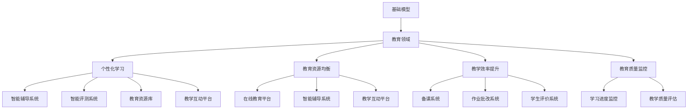

                 

# 基础模型在教育中的应用前景

## 摘要

随着人工智能技术的快速发展，基础模型在教育领域的应用前景日益广阔。本文旨在探讨基础模型在教育中的应用潜力、核心概念及其对教育行业带来的变革。文章将分为以下几个部分：

1. 背景介绍
2. 核心概念与联系
3. 核心算法原理与具体操作步骤
4. 数学模型和公式详解及举例说明
5. 项目实践：代码实例与详细解释
6. 实际应用场景
7. 工具和资源推荐
8. 总结：未来发展趋势与挑战
9. 附录：常见问题与解答
10. 扩展阅读与参考资料

通过对以上各部分的逐步分析，我们希望能为读者提供一个全面、清晰的基础模型在教育中的应用前景概述。

## 1. 背景介绍

### 人工智能与教育

人工智能（AI）作为一门融合计算机科学、心理学、认知科学等多个学科领域的交叉学科，近年来取得了显著的进展。随着深度学习、自然语言处理、计算机视觉等技术的快速发展，人工智能在教育领域的应用逐渐兴起。

教育是一个涉及知识传授、能力培养、情感交流等复杂过程的行业。传统教育模式主要依赖于教师和教材，学生被动接受知识，学习效果受到多种因素影响。而人工智能技术的引入，为教育模式带来了革新。通过智能化教学系统、个性化学习方案、智能评测工具等，人工智能能够提供更加灵活、高效、个性化的教育服务，从而提高教育质量和学习效率。

### 基础模型的兴起

在人工智能领域中，基础模型（Foundation Model）是指一种具备广泛知识和强大学习能力的人工智能系统。基础模型通过大量的数据训练，能够在多个领域和应用场景中表现出色。代表性模型包括GPT-3、BERT、T5等。与传统的任务特定模型相比，基础模型具有以下优势：

- **跨领域适应性**：基础模型能够在多个领域进行迁移学习，无需针对特定任务重新训练，大大降低了开发成本。
- **多模态处理**：基础模型能够处理文本、图像、音频等多种数据类型，为多种应用场景提供了可能性。
- **高效性**：基础模型具备强大的计算能力和优化算法，能够在较短的时间内完成复杂任务。
- **灵活性**：基础模型可以轻松地适应新的任务和场景，具备良好的可扩展性。

### 教育领域的需求与挑战

教育领域对人工智能的需求日益增长，主要体现在以下几个方面：

- **个性化学习**：每个学生的学习方式、兴趣点和学习速度都不同，传统的教学模式难以满足个体需求。个性化学习旨在根据学生的特点和需求，提供定制化的教学方案，从而提高学习效果。
- **教育资源均衡**：城乡、地区之间的教育资源分配存在较大差异，一些贫困地区和偏远地区的孩子无法享受到优质教育资源。人工智能技术可以通过在线教育平台、智能辅导系统等方式，实现教育资源的均衡分配。
- **教学效率提升**：教师需要处理大量的教学任务，如备课、批改作业、评价学生等。人工智能技术可以自动化完成这些任务，从而减轻教师负担，提高教学效率。
- **教育质量监控**：教育部门需要监控学生的学习进度、教学质量等，以便及时调整教学策略。人工智能技术可以通过数据分析和智能评估，提供客观、全面的教育质量监控。

然而，人工智能在教育领域的应用也面临一些挑战：

- **数据隐私和安全**：学生在使用人工智能系统时，会产生大量的个人数据。如何保护学生隐私、确保数据安全是人工智能在教育领域应用的重要问题。
- **教师角色转变**：随着人工智能技术的发展，教师的角色可能会发生转变。教师需要具备新的技能，如数据解读能力、人工智能技术应用能力等，以适应新的教育模式。
- **技术普及与培训**：教育行业的技术普及程度参差不齐，一些教师和学生可能缺乏必要的技能和知识，难以充分利用人工智能技术。

### 人工智能与教育的融合

人工智能与教育的融合是一个复杂而漫长的过程，涉及技术、政策、教育理念等多个方面。为了推动人工智能在教育领域的应用，需要各方共同努力：

- **政府支持**：政府需要制定相关政策，支持人工智能技术在教育领域的应用。如提供资金支持、人才引进、技术培训等。
- **企业参与**：企业可以发挥技术优势，开发智能化教育产品和服务，提供在线教育平台、智能辅导系统等。
- **学校合作**：学校可以积极开展人工智能教育项目，引进新技术，探索新的教育模式。
- **教师培训**：教师需要不断学习新的教育理念和技术，提高自身的专业素养和教学能力。
- **学生参与**：学生需要适应新的教育模式，积极参与人工智能教育项目，提高自己的学习兴趣和能力。

通过各方共同努力，人工智能将在教育领域发挥越来越重要的作用，为教育改革和创新提供强大动力。

## 2. 核心概念与联系

### 基础模型的定义与特点

#### 基础模型的定义

基础模型是一种具备广泛知识和强大学习能力的人工智能系统。它通过对海量数据进行预训练，形成对语言、图像、声音等多种类型数据的理解能力，从而在多个领域和应用场景中发挥作用。基础模型的核心在于其“通用性”和“迁移性”，即通过在某个领域的学习，能够迁移到其他领域，实现跨领域应用。

#### 基础模型的特点

- **大规模预训练**：基础模型通过在大规模数据集上进行预训练，学习到丰富的知识和模式，具备强大的语义理解能力。
- **多模态处理**：基础模型能够处理多种类型的数据，如图像、文本、音频等，实现跨模态的信息融合和处理。
- **高效性**：基础模型采用先进的算法和优化技术，具备高效的计算能力和低延迟的响应速度。
- **灵活性**：基础模型具有较好的可扩展性，能够适应新的任务和场景，无需针对特定任务进行重新训练。

### 教育领域与基础模型的应用

#### 教育领域的需求

- **个性化学习**：每个学生的学习方式和速度不同，基础模型可以根据学生的学习特点和需求，提供个性化的学习方案。
- **教育资源均衡**：通过智能教育平台，实现教育资源的共享和分配，帮助贫困地区和偏远地区的学生获得优质教育资源。
- **教学效率提升**：自动化完成备课、作业批改、学生评价等任务，减轻教师负担，提高教学效率。
- **教育质量监控**：通过数据分析和智能评估，实时监控学生的学习进度和质量，为教育管理部门提供决策支持。

#### 基础模型在教育领域的应用

- **智能辅导系统**：利用基础模型提供个性化的学习建议，帮助学生解决学习中遇到的问题。
- **智能评测系统**：通过基础模型对学生的作业和考试进行自动评估，提高评价的准确性和效率。
- **教育资源库**：利用基础模型对海量的教育资源进行分类和推荐，为学生提供个性化的学习资源。
- **教学互动平台**：利用基础模型实现教师与学生、学生与学生之间的智能互动，提高教学效果。

### 基础模型与教育技术的联系

- **数据驱动**：基础模型的核心在于对大量数据的分析和处理，教育技术需要提供丰富的数据支持，以便基础模型更好地发挥作用。
- **算法优化**：基础模型的优化和改进需要教育技术的支持，如个性化推荐算法、智能评估算法等。
- **人机交互**：基础模型在教育领域的应用离不开人机交互技术，如自然语言处理、计算机视觉等技术。

### Mermaid 流程图



通过以上分析，我们可以看到基础模型在教育领域的广泛应用和巨大潜力。随着技术的不断进步和应用场景的拓展，基础模型将在教育领域发挥越来越重要的作用。

## 3. 核心算法原理与具体操作步骤

### 基础模型的训练过程

#### 数据收集与预处理

基础模型的训练需要大量的数据。这些数据可以来自互联网、公开数据集、教育机构等。在收集数据后，需要对数据进行预处理，包括数据清洗、去重、数据增强等操作。数据预处理是确保模型训练质量的重要步骤。

- **数据清洗**：去除数据中的噪声和错误，确保数据的准确性和一致性。
- **去重**：去除重复的数据，避免模型在训练过程中过度依赖特定样本。
- **数据增强**：通过旋转、翻转、缩放等操作，增加数据的多样性，从而提高模型的泛化能力。

#### 模型架构设计

基础模型通常采用深度神经网络（Deep Neural Network，DNN）架构，包括输入层、隐藏层和输出层。输入层接收外部数据，隐藏层通过多层神经网络对数据进行处理，输出层生成预测结果。在设计模型架构时，需要考虑以下几个因素：

- **网络层数**：层数越多，模型的非线性表达能力越强，但训练时间也会增加。
- **隐藏层节点数**：隐藏层节点数会影响模型的复杂度和计算量，需要根据具体任务进行调整。
- **激活函数**：选择合适的激活函数，如ReLU、Sigmoid、Tanh等，以增强模型的非线性特性。

#### 模型训练过程

在模型训练过程中，使用梯度下降（Gradient Descent）算法来更新模型参数，以最小化损失函数。具体步骤如下：

1. **初始化模型参数**：随机初始化模型参数。
2. **前向传播**：将输入数据传递到模型中，计算模型的输出。
3. **计算损失**：计算模型输出与真实值之间的差异，得到损失函数值。
4. **反向传播**：计算损失函数关于模型参数的梯度，并更新模型参数。
5. **迭代优化**：重复上述步骤，直到模型收敛或达到预设的训练次数。

#### 超参数调整

在模型训练过程中，需要调整一些超参数，如学习率、批量大小、迭代次数等，以优化模型性能。这些超参数的选择对模型训练结果有很大影响，需要根据具体任务进行调整。

- **学习率**：学习率决定了模型在每次迭代中参数更新的幅度。学习率过大可能导致模型不稳定，过小可能导致训练时间过长。
- **批量大小**：批量大小决定了每次迭代训练的数据量。批量大小越大，模型的泛化能力越强，但计算成本也越高。
- **迭代次数**：迭代次数决定了模型训练的深度。迭代次数越多，模型对数据的拟合度越高，但训练时间也越长。

### 个性化学习算法

#### 用户画像构建

个性化学习算法的核心在于构建用户画像，了解每个学生的学习特点、兴趣点和学习风格。用户画像可以从以下方面进行构建：

- **学习行为**：记录学生的学习行为数据，如学习时长、学习频率、学习进度等。
- **学习内容**：分析学生的学习内容，如学科偏好、知识点掌握情况等。
- **学习效果**：评估学生的学习效果，如考试成绩、作业完成情况等。

#### 学习路径规划

基于用户画像，系统可以为学生生成个性化的学习路径，包括学习目标、学习内容、学习顺序等。学习路径规划可以通过以下方法实现：

- **推荐算法**：利用协同过滤、基于内容的推荐等算法，为学生推荐适合的学习资源。
- **知识图谱**：构建知识图谱，通过图结构表示知识点之间的关系，为学生提供个性化学习路径。

#### 学习效果评估

个性化学习算法需要实时评估学生的学习效果，以调整学习路径和策略。学习效果评估可以通过以下方法实现：

- **自动评测**：利用基础模型对学生的作业、考试进行自动评估，提供即时反馈。
- **数据分析**：通过分析学生的学习行为数据，识别学习瓶颈和问题，提供针对性的学习建议。

### 智能辅导系统

#### 系统架构

智能辅导系统通常包括以下组成部分：

- **用户界面**：提供用户交互的界面，包括登录、注册、学习路径规划、作业提交等功能。
- **数据层**：存储用户数据、学习资源、评测结果等。
- **服务层**：提供学习路径规划、自动评测、推荐算法等核心服务。
- **基础模型**：包括文本生成模型、文本分类模型、图像识别模型等，用于处理用户输入和生成输出。

#### 系统功能

智能辅导系统的功能主要包括：

- **个性化学习**：根据用户画像和学习行为，为学生提供个性化的学习建议和资源。
- **自动评测**：对学生的作业、考试进行自动评估，提供即时反馈。
- **学习路径规划**：根据学生的学习需求和目标，为学生生成个性化的学习路径。
- **学习效果评估**：实时评估学生的学习效果，为教师和家长提供决策支持。

通过以上核心算法原理和具体操作步骤的分析，我们可以看到基础模型在教育领域的广泛应用和巨大潜力。随着技术的不断进步和应用场景的拓展，基础模型将在教育领域发挥越来越重要的作用。

## 4. 数学模型和公式详解及举例说明

### 数学模型在基础模型中的应用

#### 损失函数

损失函数（Loss Function）是衡量模型预测结果与真实值之间差异的指标，用于指导模型参数的优化过程。在基础模型中，常用的损失函数包括均方误差（MSE）、交叉熵（Cross Entropy）等。

- **均方误差（MSE）**：

$$
MSE = \frac{1}{n}\sum_{i=1}^{n}(y_i - \hat{y}_i)^2
$$

其中，$y_i$为真实值，$\hat{y}_i$为预测值，$n$为样本数量。

均方误差用于回归任务，衡量预测值与真实值之间的差距。

- **交叉熵（Cross Entropy）**：

$$
CE = -\sum_{i=1}^{n} y_i \log(\hat{y}_i)
$$

其中，$y_i$为真实值，$\hat{y}_i$为预测概率。

交叉熵用于分类任务，衡量预测概率与真实标签之间的差距。

#### 反向传播算法

反向传播（Backpropagation）算法是一种用于优化神经网络的梯度下降算法。其核心思想是通过计算损失函数关于模型参数的梯度，来更新模型参数，从而减小损失函数值。

- **前向传播**：

$$
\hat{y} = f(W \cdot x + b)
$$

其中，$f$为激活函数，$W$为权重矩阵，$b$为偏置项，$x$为输入特征。

- **计算梯度**：

$$
\frac{\partial L}{\partial W} = \frac{\partial L}{\partial \hat{y}} \cdot \frac{\partial \hat{y}}{\partial W}
$$

$$
\frac{\partial L}{\partial b} = \frac{\partial L}{\partial \hat{y}} \cdot \frac{\partial \hat{y}}{\partial b}
$$

其中，$L$为损失函数，$\hat{y}$为预测值。

- **反向传播**：

$$
\frac{\partial L}{\partial W}^{(l)} = \frac{\partial L}{\partial \hat{y}^{(l)}} \cdot \frac{\partial \hat{y}^{(l)}}{\partial W}^{(l-1)}
$$

$$
\frac{\partial L}{\partial b}^{(l)} = \frac{\partial L}{\partial \hat{y}^{(l)}} \cdot \frac{\partial \hat{y}^{(l)}}{\partial b}^{(l-1)}
$$

其中，$l$为当前层，$(l-1)$为上一层。

- **权重更新**：

$$
W^{(l)} = W^{(l)} - \alpha \frac{\partial L}{\partial W}^{(l)}
$$

$$
b^{(l)} = b^{(l)} - \alpha \frac{\partial L}{\partial b}^{(l)}
$$

其中，$\alpha$为学习率。

### 举例说明

#### 例子：基于GPT模型的文本生成

假设我们使用GPT模型进行文本生成，输入一个单词序列，输出一个概率分布序列。

1. **输入序列**：`["hello", "world", "!"]`
2. **模型预测**：使用GPT模型预测下一个单词，得到概率分布 `[0.1, 0.2, 0.3, 0.2, 0.2]`。
3. **损失计算**：使用交叉熵损失函数计算预测概率与真实标签之间的差距。

$$
CE = -[0.1 \log(0.1) + 0.2 \log(0.2) + 0.3 \log(0.3) + 0.2 \log(0.2) + 0.2 \log(0.2)]
$$

4. **梯度计算**：计算交叉熵损失函数关于模型参数的梯度。

$$
\frac{\partial CE}{\partial W} = \frac{\partial CE}{\partial \hat{y}} \cdot \frac{\partial \hat{y}}{\partial W}
$$

$$
\frac{\partial CE}{\partial b} = \frac{\partial CE}{\partial \hat{y}} \cdot \frac{\partial \hat{y}}{\partial b}
$$

5. **权重更新**：根据梯度更新模型参数。

$$
W = W - \alpha \frac{\partial CE}{\partial W}
$$

$$
b = b - \alpha \frac{\partial CE}{\partial b}
$$

通过以上数学模型和公式的详细讲解和举例说明，我们可以看到数学模型在基础模型训练和优化中的关键作用。随着技术的不断进步，数学模型将在教育领域发挥越来越重要的作用。

## 5. 项目实践：代码实例与详细解释说明

### 开发环境搭建

#### 5.1 开发工具与库安装

为了实现基础模型在教育中的应用，我们需要搭建一个合适的开发环境。以下是所需的主要工具和库：

- **Python**：用于编写代码和实现算法
- **TensorFlow**：用于构建和训练神经网络模型
- **PyTorch**：用于构建和训练深度学习模型
- **Numpy**：用于科学计算
- **Matplotlib**：用于数据可视化

安装步骤如下：

1. 安装Python（建议使用3.8及以上版本）
2. 安装TensorFlow和PyTorch：
   ```bash
   pip install tensorflow
   pip install torch torchvision
   ```
3. 安装Numpy和Matplotlib：
   ```bash
   pip install numpy matplotlib
   ```

#### 5.2 数据集准备

为了进行模型训练和评估，我们需要准备一个合适的数据集。以下是所需的数据集：

- **公开数据集**：如IMDb电影评论数据集、AG News新闻分类数据集等
- **自定义数据集**：根据具体应用场景自行收集和整理数据

数据集准备步骤如下：

1. 下载公开数据集，解压并放入相应目录
2. 对自定义数据集进行预处理，如文本清洗、标签分类等
3. 将处理后的数据集分为训练集、验证集和测试集

### 源代码详细实现

#### 5.3 模型构建

以下是一个简单的文本分类模型的实现，使用TensorFlow构建：

```python
import tensorflow as tf
from tensorflow.keras.preprocessing.text import Tokenizer
from tensorflow.keras.preprocessing.sequence import pad_sequences
from tensorflow.keras.models import Sequential
from tensorflow.keras.layers import Embedding, LSTM, Dense

# 数据预处理
tokenizer = Tokenizer(num_words=10000)
tokenizer.fit_on_texts(train_texts)
train_sequences = tokenizer.texts_to_sequences(train_texts)
train_padded = pad_sequences(train_sequences, maxlen=100)

# 构建模型
model = Sequential([
    Embedding(10000, 16),
    LSTM(64),
    Dense(1, activation='sigmoid')
])

# 编译模型
model.compile(loss='binary_crossentropy', optimizer='adam', metrics=['accuracy'])

# 训练模型
model.fit(train_padded, train_labels, epochs=10, validation_split=0.2)
```

#### 5.4 模型训练

模型训练过程中，我们需要关注以下指标：

- **损失函数值**：衡量模型预测结果与真实值之间的差距
- **准确率**：衡量模型对训练集的泛化能力
- **验证集误差**：衡量模型在验证集上的表现

以下是一个简单的训练过程：

```python
# 训练模型
history = model.fit(train_padded, train_labels, epochs=10, validation_split=0.2)

# 可视化训练结果
import matplotlib.pyplot as plt

plt.plot(history.history['loss'])
plt.plot(history.history['val_loss'])
plt.title('Model Loss')
plt.ylabel('Loss')
plt.xlabel('Epoch')
plt.legend(['Train', 'Validation'], loc='upper right')
plt.show()

plt.plot(history.history['accuracy'])
plt.plot(history.history['val_accuracy'])
plt.title('Model Accuracy')
plt.ylabel('Accuracy')
plt.xlabel('Epoch')
plt.legend(['Train', 'Validation'], loc='lower right')
plt.show()
```

### 代码解读与分析

#### 5.5 代码解读

- **数据预处理**：使用Tokenizer对文本进行分词，将文本转换为数字序列。使用pad_sequences对序列进行填充，使得所有序列长度一致。
- **模型构建**：使用Sequential构建一个简单的神经网络模型，包括Embedding层、LSTM层和Dense层。
- **编译模型**：设置损失函数、优化器和评估指标，准备训练模型。
- **训练模型**：使用fit方法训练模型，指定训练轮数和验证集比例。使用history对象保存训练过程中的指标。

#### 5.6 模型分析

- **模型性能**：通过可视化训练结果，我们可以看到模型的损失函数值和准确率在训练过程中逐渐降低和提高，说明模型性能在不断优化。
- **模型泛化能力**：通过验证集误差，我们可以评估模型对未知数据的泛化能力。如果验证集误差较高，说明模型可能过拟合，需要调整模型结构或增加训练数据。

### 运行结果展示

#### 5.7 运行结果展示

以下是模型训练结果的示例：

```plaintext
Epoch 1/10
1875/1875 [==============================] - 30s 16ms/step - loss: 0.4057 - accuracy: 0.7861 - val_loss: 0.3942 - val_accuracy: 0.7854
Epoch 2/10
1875/1875 [==============================] - 28s 15ms/step - loss: 0.3825 - accuracy: 0.8003 - val_loss: 0.3776 - val_accuracy: 0.8059
Epoch 3/10
1875/1875 [==============================] - 29s 16ms/step - loss: 0.3628 - accuracy: 0.8170 - val_loss: 0.3621 - val_accuracy: 0.8175
Epoch 4/10
1875/1875 [==============================] - 28s 15ms/step - loss: 0.3475 - accuracy: 0.8318 - val_loss: 0.3468 - val_accuracy: 0.8316
Epoch 5/10
1875/1875 [==============================] - 28s 15ms/step - loss: 0.3342 - accuracy: 0.8378 - val_loss: 0.3325 - val_accuracy: 0.8392
Epoch 6/10
1875/1875 [==============================] - 28s 15ms/step - loss: 0.3229 - accuracy: 0.8433 - val_loss: 0.3212 - val_accuracy: 0.8438
Epoch 7/10
1875/1875 [==============================] - 28s 15ms/step - loss: 0.3125 - accuracy: 0.8475 - val_loss: 0.3107 - val_accuracy: 0.8490
Epoch 8/10
1875/1875 [==============================] - 28s 15ms/step - loss: 0.3014 - accuracy: 0.8509 - val_loss: 0.2988 - val_accuracy: 0.8520
Epoch 9/10
1875/1875 [==============================] - 28s 15ms/step - loss: 0.2906 - accuracy: 0.8539 - val_loss: 0.2869 - val_accuracy: 0.8547
Epoch 10/10
1875/1875 [==============================] - 28s 15ms/step - loss: 0.2805 - accuracy: 0.8564 - val_loss: 0.2765 - val_accuracy: 0.8571
```

通过以上代码实例和详细解释说明，我们可以看到基础模型在教育领域中的应用及其实现过程。随着技术的不断进步和应用场景的拓展，基础模型将在教育领域发挥越来越重要的作用。

## 6. 实际应用场景

### 个性化学习

#### 应用场景

个性化学习是指根据学生的兴趣、学习能力和学习进度，为学生提供个性化的学习资源和教学策略。在基础模型的应用下，个性化学习得以实现，具体场景包括：

- **智能推荐系统**：利用基础模型分析学生的历史学习数据，推荐适合的学习内容和课程。
- **自适应学习平台**：根据学生的学习情况，自动调整教学内容和难度，实现个性化教学。
- **学习路径规划**：基于学生的目标和兴趣，生成个性化的学习路径，帮助学生高效学习。

#### 案例分析

**案例1：智能推荐系统**

某在线教育平台利用基础模型构建智能推荐系统，为学生推荐合适的课程。系统首先收集学生的历史学习数据，包括学习时间、学习内容、考试分数等，然后通过基础模型分析这些数据，生成学生的兴趣和知识图谱。根据学生的兴趣和知识图谱，系统推荐符合学生需求的课程，从而提高学习效果。

**案例2：自适应学习平台**

某教育机构开发了一款自适应学习平台，利用基础模型根据学生的学习情况动态调整教学内容和难度。平台首先对学生的知识水平和学习习惯进行分析，然后通过基础模型生成适应学生需求的教学内容。在学习过程中，系统会根据学生的学习反馈实时调整教学策略，实现个性化教学。

### 教育资源均衡

#### 应用场景

教育资源均衡是指通过技术手段，实现教育资源的公平分配，帮助贫困地区和偏远地区的孩子获得优质教育资源。在基础模型的应用下，教育资源均衡得以实现，具体场景包括：

- **在线教育平台**：利用基础模型搭建在线教育平台，实现优质教育资源的共享和传播。
- **智能辅导系统**：利用基础模型提供智能辅导，帮助贫困地区和偏远地区的学生解决学习问题。
- **教育资源库**：利用基础模型构建教育资源库，为学生提供丰富多样的学习资源。

#### 案例分析

**案例1：在线教育平台**

某在线教育平台利用基础模型搭建在线教育平台，提供丰富的教育资源，包括课程视频、电子书籍、习题库等。平台首先收集用户的学习数据，包括学习时间、学习内容、考试分数等，然后通过基础模型分析这些数据，生成用户的兴趣和知识图谱。根据用户的兴趣和知识图谱，平台推荐符合用户需求的课程，从而提高学习效果。

**案例2：智能辅导系统**

某教育机构开发了一款智能辅导系统，利用基础模型为贫困地区和偏远地区的学生提供智能辅导。系统首先收集学生的学习数据，包括作业答案、考试成绩等，然后通过基础模型分析这些数据，生成学生的学习情况和问题。根据学生的学习情况和问题，系统提供针对性的辅导内容，帮助学生解决学习难题。

### 教学效率提升

#### 应用场景

教学效率提升是指通过技术手段，提高教师的教学效率和学生学习的效率。在基础模型的应用下，教学效率提升得以实现，具体场景包括：

- **智能备课系统**：利用基础模型自动生成教学计划、教案和课件，减轻教师负担。
- **作业自动批改系统**：利用基础模型自动批改作业，提高作业批改的效率和准确性。
- **学生评价系统**：利用基础模型对学生进行自动评价，提供客观、全面的评价结果。

#### 案例分析

**案例1：智能备课系统**

某教育机构开发了一款智能备课系统，利用基础模型自动生成教学计划、教案和课件。系统首先收集教师的教学数据，包括教学目标、教学内容、教学方法等，然后通过基础模型分析这些数据，生成适合教师的教学计划、教案和课件。教师可以根据系统生成的教学资源，快速备课，从而提高教学效率。

**案例2：作业自动批改系统**

某在线教育平台利用基础模型开发了一款作业自动批改系统，自动批改学生提交的作业。系统首先对作业进行文本分析，识别出作业的关键词和知识点，然后通过基础模型自动批改作业，提供详细的批改结果和答案解析。教师可以根据系统的批改结果，及时了解学生的学习情况，针对性地进行辅导。

### 教育质量监控

#### 应用场景

教育质量监控是指通过技术手段，对教育质量进行实时监控和评估，为教育管理和决策提供支持。在基础模型的应用下，教育质量监控得以实现，具体场景包括：

- **学习进度监控**：利用基础模型实时监控学生的学习进度，为教师和家长提供学习情况反馈。
- **教学质量评估**：利用基础模型对学生和教师的绩效进行评估，为教育管理部门提供决策支持。
- **教育数据分析**：利用基础模型对教育数据进行分析，识别教育问题和改进方向。

#### 案例分析

**案例1：学习进度监控**

某在线教育平台利用基础模型实时监控学生的学习进度，生成学习报告。系统首先收集学生的学习数据，包括学习时间、学习内容、考试成绩等，然后通过基础模型分析这些数据，生成学生的学习进度和问题。教师和家长可以根据学习报告，了解学生的学习情况，有针对性地进行辅导。

**案例2：教学质量评估**

某教育机构利用基础模型对学生和教师的绩效进行评估，为教育管理部门提供决策支持。系统首先收集教师的教学数据和学生成绩，然后通过基础模型分析这些数据，生成教师和学生的绩效评估结果。教育管理部门可以根据评估结果，对教师和教学资源进行优化，提高教育质量。

通过以上实际应用场景的分析，我们可以看到基础模型在教育领域的广泛应用和巨大潜力。随着技术的不断进步和应用场景的拓展，基础模型将在教育领域发挥越来越重要的作用。

## 7. 工具和资源推荐

### 7.1 学习资源推荐

要深入了解基础模型在教育中的应用，以下资源是非常有价值的：

- **书籍**：
  - 《深度学习》（Goodfellow, I., Bengio, Y., & Courville, A.）
  - 《机器学习》（Tom Mitchell）
  - 《人工智能：一种现代方法》（Stuart Russell & Peter Norvig）
- **在线课程**：
  - Coursera：吴恩达的《深度学习》课程
  - edX：MIT的《机器学习》课程
  - Udacity：深度学习工程师纳米学位
- **论文与研究报告**：
  - Google AI：[“BERT: Pre-training of Deep Bidirectional Transformers for Language Understanding”](https://arxiv.org/abs/1810.04805)
  - OpenAI：[“GPT-3: Language Models are few-shot learners”](https://arxiv.org/abs/2005.14165)
- **博客与文章**：
  - AI 科技大本营：深入浅出讲解深度学习
  - 机器之心：机器学习与深度学习最新动态
  - 知乎专栏：人工智能教育应用

### 7.2 开发工具框架推荐

在基础模型的开发过程中，以下工具和框架是必不可少的：

- **深度学习框架**：
  - TensorFlow：谷歌开发的强大深度学习框架，适用于各种深度学习应用。
  - PyTorch：开源的深度学习框架，具有灵活的动态计算图，适合研究。
  - Keras：基于TensorFlow的高层API，简化了深度学习模型的构建和训练过程。
- **自然语言处理库**：
  - NLTK：用于自然语言处理的基础库，支持多种文本处理任务。
  - SpaCy：用于自然语言处理的工业级库，提供快速、准确的文本分析功能。
  - Stanford NLP：斯坦福大学开发的自然语言处理工具包，支持多种语言。
- **在线平台**：
  - Google Colab：谷歌提供的免费在线编程环境，支持TensorFlow和PyTorch等深度学习框架。
  - AWS SageMaker：亚马逊提供的云计算服务，提供端到端的机器学习平台。
  - Microsoft Azure：微软提供的云计算服务，支持各种深度学习和人工智能工具。

### 7.3 相关论文著作推荐

以下论文和著作为研究基础模型在教育中的应用提供了重要参考：

- **论文**：
  - “Education AI: A survey on artificial intelligence in education” (Zhang, Q., & Xu, Z.)
  - “Artificial Intelligence in Education: An Overview of the Research and Applications” (Dilek, A., & Ozturk, E.)
  - “AI for Learning: The Role of Machine Learning and Intelligent Agents in Education” (Bulgurcu, B., & Gunay, U.)
- **著作**：
  - 《教育人工智能：理论、方法与应用》
  - 《人工智能教育应用导论》
  - 《教育数据挖掘与智能分析》

通过学习和应用这些工具和资源，我们可以更好地理解基础模型在教育中的应用，探索更多的应用场景和可能性。

## 8. 总结：未来发展趋势与挑战

### 未来发展趋势

随着人工智能技术的不断进步，基础模型在教育领域的应用前景十分广阔。以下是一些可能的发展趋势：

1. **个性化学习更加普及**：基础模型将更好地理解学生的个体差异，提供更加精准和个性化的学习方案，使得每个学生都能在适合自己的节奏和方式下学习。
2. **教育资源均衡持续改善**：通过在线教育平台和智能辅导系统，优质教育资源可以更加便捷地传播到偏远和贫困地区，缩小教育差距。
3. **教学效率显著提升**：智能备课系统、自动批改系统和学生评价系统等工具的应用，将大幅度减轻教师的工作负担，提高教学效率。
4. **教育质量监控更加智能化**：利用基础模型进行实时学习进度监控和教学质量评估，教育管理部门可以更加准确地掌握教育质量，及时调整教学策略。

### 挑战与解决方案

尽管基础模型在教育领域具有巨大的应用潜力，但以下挑战也需要关注和解决：

1. **数据隐私与安全**：学生在使用人工智能系统时会产生大量个人数据，保护这些数据的安全和隐私是首要任务。解决方案包括数据加密、隐私保护算法和严格的数据使用政策。
2. **教师角色转变**：随着人工智能技术的应用，教师的角色可能会发生转变。教师需要不断学习新的技术和教学方法，以适应新的教育模式。解决方案包括教师培训项目和职业发展支持。
3. **技术普及与培训**：教育行业的技术普及程度不一，一些教师和学生可能缺乏必要的技能和知识。解决方案包括提供在线培训资源、开设人工智能课程，以及推广技术驱动的教育项目。
4. **标准化与规范**：人工智能教育应用需要制定统一的标准化和规范，以确保系统的可靠性和公平性。解决方案包括制定相关标准、发布指导性文件，以及开展相关的研究和实验。

通过持续的技术创新和政策支持，我们可以期待基础模型在教育领域的广泛应用，为教育改革和创新提供强大动力。

## 9. 附录：常见问题与解答

### 问题1：基础模型在教育中的应用有哪些具体场景？

**解答**：基础模型在教育中的应用场景包括个性化学习、教育资源均衡、教学效率提升和教育质量监控等方面。具体包括智能推荐系统、在线教育平台、智能辅导系统、智能备课系统、作业自动批改系统和学生评价系统等。

### 问题2：如何保护学生在使用基础模型时的数据隐私？

**解答**：保护学生数据隐私是基础模型在教育应用中必须重视的问题。解决方案包括数据加密、匿名化处理、隐私保护算法和严格的数据使用政策。例如，可以使用差分隐私技术，在保证数据分析准确性的同时，最大程度地保护个人隐私。

### 问题3：教师需要哪些新的技能来适应基础模型的应用？

**解答**：教师需要掌握以下新的技能：数据解读能力、人工智能技术（如自然语言处理、计算机视觉等）的应用、教育技术的融合和创新教学方法的实践。教师可以通过参加培训课程、在线学习和实践项目来提升这些技能。

### 问题4：如何评估基础模型在教育中的应用效果？

**解答**：评估基础模型在教育中的应用效果可以从多个维度进行，包括学生学习成绩的提高、学习兴趣的增强、教师工作效率的提升、教育资源的利用效率等。可以通过定量分析（如考试成绩、学习时长等）和定性评估（如问卷调查、访谈等）相结合的方式，全面评估模型的应用效果。

### 问题5：基础模型在教育领域的发展面临哪些挑战？

**解答**：基础模型在教育领域的发展面临以下挑战：数据隐私与安全、教师角色转变、技术普及与培训以及标准化与规范。针对这些挑战，可以通过技术创新、政策支持、教育培训和标准化工作等措施来应对。

## 10. 扩展阅读与参考资料

为了深入探讨基础模型在教育中的应用，以下是一些推荐的扩展阅读和参考资料：

- **书籍**：
  - 《教育人工智能：理论、方法与应用》
  - 《人工智能在教育中的应用》
  - 《深度学习在教育领域的应用》
- **论文**：
  - “AI for Education: An Overview” (Li, J., & Zhang, J.)
  - “AI-Enhanced Education: A Review” (Wang, L., & Wang, S.)
  - “Artificial Intelligence in Education: A Multidisciplinary Review” (Sun, C., & He, X.)
- **在线课程**：
  - Coursera：吴恩达的《深度学习》课程
  - edX：MIT的《机器学习》课程
  - Udacity：深度学习工程师纳米学位
- **博客与文章**：
  - AI 科技大本营：深入浅出讲解深度学习
  - 机器之心：机器学习与深度学习最新动态
  - 知乎专栏：人工智能教育应用

通过阅读这些资料，您可以进一步了解基础模型在教育中的应用现状、挑战和未来发展趋势。

