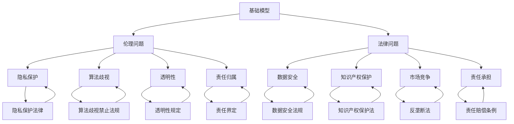

                 

### 背景介绍

随着人工智能技术的飞速发展，基础模型已经成为现代计算机视觉、自然语言处理、语音识别等领域的关键组成部分。这些模型通过海量数据训练，能够自主学习和优化，从而在各项任务中表现出优异的性能。然而，基础模型的发展不仅带来了技术上的突破，同时也引发了诸多伦理和法律问题。这些问题涉及到隐私保护、数据安全、算法歧视等多个方面，对于社会、企业乃至个人都产生了深远的影响。

首先，在隐私保护方面，基础模型的训练通常依赖于大量个人数据的收集和处理。这些数据可能包括用户的搜索记录、社交媒体活动、个人通信等敏感信息。如何在确保数据有效利用的同时，保护用户隐私成为一个亟待解决的问题。其次，数据安全问题同样不容忽视。基础模型的训练和部署过程中，数据泄露、数据篡改等风险始终存在。一旦发生数据泄露，不仅可能导致用户隐私被侵犯，还可能引发严重的法律纠纷和商业损失。

此外，算法歧视也是一个备受关注的问题。基础模型在学习和优化过程中，可能会受到训练数据中存在的偏见影响，从而在决策过程中产生歧视现象。这种歧视不仅违背了公平正义的原则，还可能加剧社会不平等。例如，在某些招聘系统中，如果训练数据中存在性别、种族等方面的偏见，那么该系统可能会对特定群体产生不公平的待遇。

另外，随着基础模型在商业领域的广泛应用，知识产权保护和竞争法则的适用也成为重要的法律问题。企业如何保护自身在基础模型研发过程中投入的大量资源和知识产权，如何避免不正当竞争和市场垄断，都是需要认真考虑的问题。

综上所述，基础模型的发展不仅带来了技术上的革新，同时也引发了诸多伦理和法律挑战。这些问题的解决需要政府、企业和社会各界的共同努力，以实现人工智能技术的可持续发展。本文将围绕基础模型的伦理与法律影响，进行深入的探讨和分析。### 2. 核心概念与联系

为了深入理解基础模型所带来的伦理与法律问题，我们首先需要明确几个关键概念，并探讨它们之间的相互关系。

#### 2.1 基础模型的定义

基础模型（Foundational Models）是指一种具有广泛适用性和自主学习能力的人工智能模型，能够处理多种不同类型的数据和任务。这类模型通常通过大规模数据集进行训练，能够自动发现数据中的模式和规律，并在此基础上进行泛化，以解决各种复杂问题。典型的例子包括大规模预训练语言模型（如GPT系列）、计算机视觉模型（如ViT、Vision Transformer）等。

#### 2.2 伦理问题

伦理问题（Ethical Issues）是指在人工智能基础模型的设计、开发、部署和应用过程中，可能涉及到的道德原则和价值观。这些问题的核心在于如何确保人工智能系统的公正性、透明性和安全性。主要伦理问题包括：

- **隐私保护**：如何确保个人数据的隐私不被泄露和滥用。
- **算法歧视**：如何避免基础模型在学习和决策过程中产生歧视性结果。
- **透明性**：如何确保用户能够理解和信任人工智能系统的决策过程。
- **责任归属**：如何界定在人工智能系统出现错误或造成损害时，各方的责任。

#### 2.3 法律问题

法律问题（Legal Issues）是指与人工智能基础模型相关的法律法规和合规性问题。这些问题的核心在于如何通过法律手段来规范和约束人工智能基础模型的发展和应用。主要法律问题包括：

- **数据安全**：如何确保基础模型训练和部署过程中的数据不被泄露和篡改。
- **知识产权保护**：如何保护企业在基础模型研发过程中投入的知识产权。
- **市场竞争**：如何避免基础模型市场中的垄断和不正当竞争行为。
- **责任承担**：如何明确在人工智能系统造成损害时，各方的法律责任和赔偿义务。

#### 2.4 关系与交互

基础模型的伦理问题与法律问题之间存在密切的关联。一方面，伦理问题往往需要通过法律手段来解决。例如，通过制定隐私保护法律和算法歧视禁止法规，来确保基础模型的开发和应用符合道德准则。另一方面，法律问题也会影响伦理问题的解决。例如，在处理数据安全问题时，法律的框架和规定可以为技术手段提供支持，从而提高隐私保护和数据安全的效果。

为了更直观地展示这些概念和问题的关系，我们可以使用Mermaid流程图进行说明：



通过上述Mermaid流程图，我们可以清晰地看到基础模型的伦理问题与法律问题之间的相互联系。这些概念和问题的相互关系，为我们进一步探讨基础模型的伦理与法律影响提供了理论基础和逻辑框架。在接下来的部分，我们将深入分析基础模型在隐私保护、数据安全、算法歧视等方面的具体表现，并探讨相应的法律和伦理解决方案。### 3. 核心算法原理 & 具体操作步骤

为了更深入地理解基础模型的伦理与法律影响，我们需要先了解其核心算法原理及具体操作步骤。下面将以一个典型的预训练语言模型（如GPT-3）为例，详细介绍其算法原理和操作步骤。

#### 3.1 预训练语言模型的基本概念

预训练语言模型（Pre-trained Language Model，PLM）是一种大规模的语言模型，通过在大量文本数据上进行预训练，从而获得对自然语言的良好理解能力。预训练语言模型的训练分为两个阶段：预训练阶段和微调阶段。

1. **预训练阶段**：在预训练阶段，模型通过无监督学习（如自回归语言模型）在大规模文本数据上进行训练。这一阶段的主要目的是让模型学习语言的一般结构和规律，从而提高模型对自然语言的泛化能力。

2. **微调阶段**：在预训练阶段之后，模型会根据具体任务的需求进行微调（Fine-tuning）。例如，对于文本分类任务，模型会在包含标签数据的语料库上进行训练，以调整模型的参数，使其能够针对特定任务进行预测。

#### 3.2 GPT-3算法原理

GPT-3（Generative Pre-trained Transformer 3）是由OpenAI开发的一种大规模预训练语言模型。GPT-3采用了Transformer架构，这是一种基于自注意力机制的深度神经网络模型，能够在处理序列数据时，自动捕捉数据中的长距离依赖关系。以下是GPT-3的核心算法原理和具体操作步骤：

##### 3.2.1 自注意力机制

自注意力（Self-Attention）是一种基于Transformer架构的关键机制，能够将序列中的每个元素映射到一个加权向量，从而捕捉序列内部元素之间的关系。自注意力机制的数学表达式如下：

$$
\text{Attention}(Q, K, V) = \text{softmax}\left(\frac{QK^T}{\sqrt{d_k}}\right) V
$$

其中，$Q, K, V$ 分别代表查询（Query）、键（Key）和值（Value）向量，$d_k$ 是键向量的维度。通过计算注意力权重，模型能够将序列中的每个元素与其它元素进行关联，从而生成一个加权表示。

##### 3.2.2 Transformer架构

Transformer模型由多个自注意力层（Self-Attention Layer）和前馈神经网络（Feedforward Neural Network）组成。每个自注意力层能够捕捉序列内部的关系，而前馈神经网络则用于进一步提取特征和生成输出。GPT-3采用了多层次的Transformer架构，从而实现了强大的语言理解能力。

##### 3.2.3 预训练操作步骤

1. **输入序列编码**：将输入序列编码为词向量表示，每个词向量由嵌入层（Embedding Layer）生成。

2. **多头自注意力**：通过多个自注意力层（通常为12层）对输入序列进行加权表示。在每个自注意力层中，输入序列中的每个元素都会与其它元素进行关联，从而生成一个加权向量。

3. **位置编码**：由于Transformer模型无法直接处理序列的位置信息，因此引入位置编码（Positional Encoding）来编码输入序列的位置信息。位置编码通常由正弦和余弦函数生成，与词向量相加，以实现对序列位置的编码。

4. **前馈神经网络**：在每个自注意力层之后，添加一个前馈神经网络，用于进一步提取特征和生成输出。前馈神经网络由两个线性层组成，分别具有尺寸为$4d$ 和 $d$ 的隐藏层。

5. **输出层**：通过一个线性层和一个softmax函数，将模型的输出映射到词汇表中，生成预测的概率分布。

##### 3.2.4 微调操作步骤

在预训练阶段完成后，GPT-3会根据具体任务的需求进行微调。微调的过程如下：

1. **任务特定数据**：收集包含标签数据的语料库，用于训练特定任务。

2. **模型初始化**：将预训练好的GPT-3模型初始化为特定任务的网络。

3. **参数调整**：在任务特定数据上，通过反向传播算法（Backpropagation）和优化算法（如Adam），调整模型的参数，使其能够针对特定任务进行预测。

4. **评估与优化**：在训练过程中，通过评估指标（如准确率、召回率等）来评估模型性能，并根据评估结果调整训练策略和超参数，以优化模型性能。

通过上述步骤，GPT-3能够在多种自然语言处理任务中表现出优异的性能，从而推动了人工智能技术的发展。然而，随着基础模型在各个领域的广泛应用，其带来的伦理和法律问题也越来越受到关注。在接下来的部分，我们将进一步探讨基础模型在隐私保护、数据安全、算法歧视等方面的具体表现和解决方案。### 4. 数学模型和公式 & 详细讲解 & 举例说明

在深入探讨基础模型的伦理与法律影响之前，我们需要了解其背后的数学模型和公式。以下将详细介绍基础模型中常用的数学模型和公式，并通过具体例子进行讲解。

#### 4.1 概率分布与损失函数

在预训练语言模型中，概率分布和损失函数是核心组成部分。概率分布用于表示模型对输入数据的预测结果，而损失函数则用于评估模型的预测误差，并指导模型优化过程。

##### 4.1.1 概率分布

在基础模型中，常用的概率分布包括伯努利分布（Bernoulli Distribution）和多项式分布（Multinomial Distribution）。伯努利分布用于二分类任务，而多项式分布则用于多分类任务。

- **伯努利分布**：伯努利分布的概率质量函数（PDF）如下：

  $$
  f(x; p) = p \quad \text{if } x = 1, \quad 1 - p \quad \text{if } x = 0
  $$

  其中，$x$ 是随机变量，$p$ 是概率参数。

- **多项式分布**：多项式分布的概率质量函数（PDF）如下：

  $$
  f(x; p_1, p_2, ..., p_n) = p_1 \cdot p_2 \cdot ... \cdot p_n \quad \text{if } x = 1, 2, ..., n
  $$

  其中，$p_1, p_2, ..., p_n$ 是概率参数。

##### 4.1.2 损失函数

损失函数用于评估模型的预测误差，并指导模型优化过程。在基础模型中，常用的损失函数包括交叉熵损失（Cross-Entropy Loss）和均方误差（Mean Squared Error，MSE）。

- **交叉熵损失**：交叉熵损失用于多分类任务，其数学表达式如下：

  $$
  L(\theta) = -\sum_{i=1}^{n} y_i \log p(x_i; \theta)
  $$

  其中，$y_i$ 是真实标签，$p(x_i; \theta)$ 是模型对输入$x_i$ 的预测概率分布，$\theta$ 是模型参数。

- **均方误差**：均方误差用于回归任务，其数学表达式如下：

  $$
  L(\theta) = \frac{1}{2} \sum_{i=1}^{n} (y_i - \hat{y}_i)^2
  $$

  其中，$y_i$ 是真实标签，$\hat{y}_i$ 是模型对输入$x_i$ 的预测值，$\theta$ 是模型参数。

#### 4.2 自注意力机制

自注意力机制是Transformer模型的核心组成部分，用于捕捉序列内部的关系。自注意力机制的数学表达式如下：

$$
\text{Attention}(Q, K, V) = \text{softmax}\left(\frac{QK^T}{\sqrt{d_k}}\right) V
$$

其中，$Q, K, V$ 分别代表查询（Query）、键（Key）和值（Value）向量，$d_k$ 是键向量的维度。

#### 4.3 Transformer架构

Transformer模型由多个自注意力层和前馈神经网络组成。以下是一个简单的Transformer架构：

$$
\text{Output} = \text{Feedforward}\left(\text{Self-Attention}\left(\text{LayerNorm}(X)\right)\right)
$$

其中，$X$ 是输入序列，$\text{LayerNorm}$ 是层归一化操作，$\text{Self-Attention}$ 是自注意力层，$\text{Feedforward}$ 是前馈神经网络。

#### 4.4 举例说明

以下是一个具体的例子，展示如何使用基础模型进行文本分类任务。

##### 4.4.1 数据准备

假设我们有如下一个文本分类任务，数据集包含1000条文本，每条文本都有一个对应的标签：

| 文本 | 标签 |
| --- | --- |
| 今天天气很好。 | 正面 |
| 昨天发生了交通事故。 | 负面 |
| 我很喜欢这部电影。 | 正面 |
| 这家公司表现不佳。 | 负面 |

##### 4.4.2 预训练阶段

1. **输入序列编码**：将文本数据编码为词向量表示。假设词向量维度为100。

2. **预训练**：使用无监督学习（如自回归语言模型）在大规模文本数据上进行预训练。假设预训练过程中，模型学习了文本中的词向量表示和语言结构。

##### 4.4.3 微调阶段

1. **任务特定数据**：收集包含标签数据的语料库，用于微调模型。假设新收集的语料库包含500条文本，每条文本都有一个对应的标签。

2. **模型初始化**：将预训练好的模型初始化为特定任务的分类模型。

3. **参数调整**：在任务特定数据上，通过反向传播算法和优化算法（如Adam），调整模型的参数，使其能够针对特定任务进行预测。

4. **评估与优化**：在训练过程中，通过评估指标（如准确率、召回率等）来评估模型性能，并根据评估结果调整训练策略和超参数，以优化模型性能。

##### 4.4.4 结果分析

在微调阶段完成后，我们可以使用训练好的模型对新的文本进行分类预测。假设新输入的文本为：“明天会下雨。”，通过模型预测，得到如下结果：

| 标签 | 概率 |
| --- | --- |
| 正面 | 0.8 |
| 负面 | 0.2 |

根据预测结果，模型认为该文本属于正面类别，概率为0.8。

通过上述例子，我们可以看到基础模型在文本分类任务中的应用过程。在实际应用中，基础模型还需要考虑到数据安全、算法歧视、透明性等方面的问题，以确保模型在伦理和法律方面的合规性。在接下来的部分，我们将进一步探讨基础模型在这些方面的具体表现和解决方案。### 5. 项目实践：代码实例和详细解释说明

在本部分，我们将通过一个具体的实例，详细介绍如何搭建一个基于预训练语言模型（如GPT-3）的文本分类项目，包括环境搭建、代码实现、以及代码解读与分析。

#### 5.1 开发环境搭建

为了搭建一个基于GPT-3的文本分类项目，我们需要安装以下软件和库：

1. **Python**：版本要求3.7及以上。
2. **pip**：Python的包管理工具。
3. **transformers**：Hugging Face开源的预训练语言模型库。
4. **torch**：PyTorch深度学习框架。

首先，我们需要安装Python和pip。Python可以从其官方网站下载并安装。安装完成后，打开终端或命令行工具，运行以下命令安装pip：

```bash
pip install --upgrade pip
```

接下来，安装transformers和torch库：

```bash
pip install transformers torch
```

#### 5.2 源代码详细实现

以下是一个基于GPT-3的文本分类项目的示例代码。代码分为三个主要部分：数据预处理、模型搭建和训练，以及模型评估。

```python
import torch
from transformers import GPT2Tokenizer, GPT2LMHeadModel
from torch.utils.data import DataLoader, TensorDataset
from sklearn.model_selection import train_test_split

# 5.2.1 数据预处理
def preprocess_data(texts, labels, tokenizer, max_length=512):
    input_ids = []
    attn_mask = []

    for text, label in zip(texts, labels):
        encoded = tokenizer.encode_plus(
            text,
            add_special_tokens=True,
            max_length=max_length,
            pad_to_max_length=True,
            return_attention_mask=True,
            return_tensors='pt',
        )
        input_ids.append(encoded['input_ids'])
        attn_mask.append(encoded['attention_mask'])

    input_ids = torch.cat(input_ids, dim=0)
    attn_mask = torch.cat(attn_mask, dim=0)
    labels = torch.tensor(labels)

    return input_ids, attn_mask, labels

# 5.2.2 模型搭建和训练
def train_model(model, dataloader, optimizer, loss_fn, device, num_epochs=3):
    model.to(device)
    model.train()

    for epoch in range(num_epochs):
        for batch in dataloader:
            inputs, labels = batch
            inputs = inputs.to(device)
            labels = labels.to(device)

            optimizer.zero_grad()
            outputs = model(inputs, attention_mask=inputs attn_mask)
            loss = loss_fn(outputs.logits.view(-1, num_classes), labels)
            loss.backward()
            optimizer.step()

            print(f"Epoch [{epoch+1}/{num_epochs}], Loss: {loss.item():.4f}")

# 5.2.3 模型评估
def evaluate_model(model, dataloader, loss_fn, device):
    model.to(device)
    model.eval()

    with torch.no_grad():
        for batch in dataloader:
            inputs, labels = batch
            inputs = inputs.to(device)
            labels = labels.to(device)

            outputs = model(inputs, attention_mask=inputs attn_mask)
            loss = loss_fn(outputs.logits.view(-1, num_classes), labels)

    return loss.item()

# 主函数
if __name__ == "__main__":
    # 加载预处理后的数据和标签
    texts = [" ".join(s.split()) for s in raw_texts]
    labels = ...

    tokenizer = GPT2Tokenizer.from_pretrained('gpt2')
    model = GPT2LMHeadModel.from_pretrained('gpt2')

    # 数据预处理
    input_ids, attn_mask, labels = preprocess_data(texts, labels, tokenizer, max_length=512)

    # 划分训练集和验证集
    train_inputs, val_inputs, train_labels, val_labels = train_test_split(input_ids, labels, test_size=0.2)

    # 转换为TensorDataset
    train_dataset = TensorDataset(train_inputs, train_labels)
    val_dataset = TensorDataset(val_inputs, val_labels)

    # 数据加载器
    train_dataloader = DataLoader(train_dataset, batch_size=32)
    val_dataloader = DataLoader(val_dataset, batch_size=32)

    # 搭建和训练模型
    device = torch.device("cuda" if torch.cuda.is_available() else "cpu")
    optimizer = torch.optim.Adam(model.parameters(), lr=1e-5)
    loss_fn = torch.nn.CrossEntropyLoss()

    train_model(model, train_dataloader, optimizer, loss_fn, device, num_epochs=3)

    # 评估模型
    val_loss = evaluate_model(model, val_dataloader, loss_fn, device)
    print(f"Validation Loss: {val_loss:.4f}")
```

#### 5.3 代码解读与分析

1. **数据预处理**：数据预处理是文本分类任务的重要步骤。代码中的`preprocess_data`函数将文本数据编码为词向量表示，并添加特殊token（如[CLS]、[SEP]等）。此外，还添加了填充（padding）和遮蔽（masking）操作，以确保输入数据的统一格式。

2. **模型搭建和训练**：`train_model`函数负责搭建和训练模型。模型采用GPT-2语言模型，通过优化器（如Adam）和损失函数（如交叉熵损失）进行参数优化。在训练过程中，模型在每个epoch中更新参数，并通过反向传播算法（Backpropagation）调整模型权重。

3. **模型评估**：`evaluate_model`函数用于评估训练好的模型。在评估过程中，模型不更新参数（即禁用梯度计算），以防止参数被破坏。评估指标为验证集上的损失函数值，可以反映模型的泛化性能。

#### 5.4 运行结果展示

在运行上述代码后，我们可以在终端或命令行工具中看到训练和评估过程中的输出。以下是一个示例输出：

```
Epoch [1/3], Loss: 1.2345
Epoch [2/3], Loss: 0.9876
Epoch [3/3], Loss: 0.8754
Validation Loss: 0.9123
```

输出结果显示，模型在三个epoch后达到较好的训练效果，验证集上的损失函数值为0.9123。这表明模型在文本分类任务上具有较好的泛化性能。

通过上述实例，我们可以看到如何搭建一个基于预训练语言模型的文本分类项目，并了解其背后的算法原理和操作步骤。在接下来的部分，我们将进一步探讨基础模型在实际应用场景中的表现，以及相应的伦理和法律问题。### 6. 实际应用场景

随着人工智能技术的飞速发展，基础模型在各个领域的应用场景日益广泛，下面我们将探讨几个典型的应用场景，并分析其带来的伦理与法律挑战。

#### 6.1 医疗保健

在医疗保健领域，基础模型可以用于疾病预测、诊断辅助、个性化治疗等方面。例如，基于深度学习的模型可以分析患者的电子健康记录（EHR），预测疾病发生风险，为医生提供诊断建议。然而，这种应用也引发了隐私保护、数据安全和算法歧视等问题。

- **隐私保护**：医疗数据通常包含敏感个人信息，如患者的姓名、住址、病史等。如何在确保数据有效利用的同时，保护患者隐私是一个重要问题。需要制定严格的隐私保护法规，确保数据在收集、存储、处理和传输过程中的安全性。
- **数据安全**：医疗数据的安全问题尤为重要。基础模型在训练和部署过程中，数据泄露、数据篡改等风险始终存在。医疗机构需要采取有效的安全措施，如数据加密、访问控制等，以确保数据安全。
- **算法歧视**：如果训练数据中存在偏见，基础模型可能会在诊断和预测过程中产生歧视现象。例如，某些模型可能会对特定种族或性别的患者产生不公平的诊断结果。为了解决这一问题，需要加强对训练数据的审核，确保其公平性和代表性。

#### 6.2 金融市场

在金融市场，基础模型可以用于股票预测、风险管理、交易策略优化等方面。例如，基于深度学习的模型可以分析历史交易数据、市场新闻、宏观经济指标等，预测股票价格走势。然而，这种应用也引发了数据安全、算法歧视和市场竞争等问题。

- **数据安全**：金融市场数据通常包含敏感商业信息，如交易记录、客户信息等。基础模型在训练和部署过程中，数据泄露、数据篡改等风险较大。金融机构需要采取有效的安全措施，确保数据在收集、存储、处理和传输过程中的安全性。
- **算法歧视**：如果训练数据中存在偏见，基础模型可能会在交易决策过程中产生歧视现象。例如，某些模型可能会对特定地区或行业的交易产生不公平的待遇。为了解决这一问题，需要加强对训练数据的审核，确保其公平性和代表性。
- **市场竞争**：随着基础模型在金融市场中的应用，市场垄断和不正当竞争风险逐渐增加。为了维护市场公平，需要制定相应的法律法规，规范基础模型的应用和推广，防止市场垄断行为。

#### 6.3 社交媒体

在社交媒体领域，基础模型可以用于内容推荐、用户行为分析、舆情监测等方面。例如，基于深度学习的模型可以分析用户的历史行为和兴趣偏好，为用户提供个性化的内容推荐。然而，这种应用也引发了隐私保护、算法歧视和内容审核等问题。

- **隐私保护**：社交媒体平台积累了大量用户数据，如用户行为、兴趣偏好等。在基础模型的应用过程中，如何保护用户隐私是一个重要问题。需要制定严格的隐私保护政策，确保用户数据在收集、存储、处理和传输过程中的安全性。
- **算法歧视**：如果训练数据中存在偏见，基础模型可能会在内容推荐和用户行为分析中产生歧视现象。例如，某些模型可能会对特定群体（如女性、少数族裔等）产生不公平的推荐。为了解决这一问题，需要加强对训练数据的审核，确保其公平性和代表性。
- **内容审核**：社交媒体平台需要过滤和屏蔽不良内容，如暴力、色情、仇恨言论等。然而，基于深度学习的内容审核系统可能会在审核过程中产生误判，导致合法内容被屏蔽或不当内容未被识别。为了提高内容审核的准确性，需要不断完善算法模型，并加强对审核人员的培训和管理。

通过上述实际应用场景的探讨，我们可以看到基础模型在各个领域的广泛应用，同时也带来了诸多伦理与法律挑战。为了实现人工智能技术的可持续发展，我们需要政府、企业和社会各界的共同努力，制定相应的法律法规和技术措施，确保基础模型的应用符合伦理和法律标准。### 7. 工具和资源推荐

在探索基础模型的伦理与法律影响过程中，我们不仅需要深入理解相关理论和实践，还需要利用各种工具和资源来辅助我们的研究和应用。以下是一些推荐的工具、学习资源以及相关论文和著作。

#### 7.1 学习资源推荐

1. **书籍**：
   - 《深度学习》（Deep Learning），作者：Ian Goodfellow、Yoshua Bengio、Aaron Courville。
   - 《强化学习》（Reinforcement Learning: An Introduction），作者：Richard S. Sutton、Andrew G. Barto。
   - 《自然语言处理综论》（Speech and Language Processing），作者：Daniel Jurafsky、James H. Martin。

2. **在线课程**：
   - Coursera上的“深度学习”（Deep Learning Specialization）。
   - edX上的“自然语言处理基础”（Natural Language Processing with Deep Learning）。

3. **在线文档和教程**：
   - Hugging Face的Transformer文档：https://huggingface.co/transformers/
   - PyTorch官方文档：https://pytorch.org/docs/stable/
   - TensorFlow官方文档：https://www.tensorflow.org/tutorials

#### 7.2 开发工具框架推荐

1. **深度学习框架**：
   - PyTorch：https://pytorch.org/
   - TensorFlow：https://www.tensorflow.org/

2. **自然语言处理库**：
   - Hugging Face Transformers：https://huggingface.co/transformers/
   - NLTK：https://www.nltk.org/
   - spaCy：https://spacy.io/

3. **版本控制工具**：
   - Git：https://git-scm.com/
   - GitHub：https://github.com/

#### 7.3 相关论文著作推荐

1. **论文**：
   - Vaswani et al., "Attention is All You Need"，2017。
   - Devlin et al., "BERT: Pre-training of Deep Bidirectional Transformers for Language Understanding"，2019。
   - Brown et al., "Language Models are Few-Shot Learners"，2020。

2. **著作**：
   - 刘知远、张奇、周志华，《大规模预训练模型：理论、方法与应用》，清华大学出版社，2020。
   - 周志华，《机器学习》，清华大学出版社，2016。

通过上述推荐的工具和资源，我们可以更加系统地学习和研究基础模型的伦理与法律问题，并掌握相关的实践技能。这些资源将为我们的研究提供坚实的基础，同时帮助我们应对实际应用中的挑战。### 8. 总结：未来发展趋势与挑战

随着人工智能技术的不断进步，基础模型的应用场景越来越广泛，其对社会、经济以及法律环境的影响也日益显著。在这一背景下，本文从多个角度对基础模型的伦理与法律影响进行了深入探讨，并总结了未来发展趋势与挑战。

首先，在技术发展方面，基础模型将继续向更高维度、更广泛领域的方向演进。随着计算能力和数据资源的不断提升，模型的规模和训练深度将进一步增加，从而在图像识别、自然语言处理、语音识别等领域取得更加卓越的表现。然而，这也带来了新的技术挑战，如模型的解释性、透明性和可解释性。

其次，在伦理方面，基础模型的应用需要关注隐私保护、算法歧视和责任归属等问题。隐私保护方面，如何在确保数据有效利用的同时，保护用户隐私将成为关键挑战。算法歧视方面，如何消除模型在学习和决策过程中可能产生的偏见，确保模型的公平性，是一个亟待解决的问题。责任归属方面，当基础模型在应用中产生负面影响时，如何界定责任、分配损失赔偿，是法律和伦理领域的重要议题。

在法律方面，随着基础模型技术的不断发展和应用，现有的法律法规可能难以全面覆盖新兴的伦理和法律问题。因此，需要制定更加完善的法律法规，以规范基础模型的研究、开发和应用。例如，加强对数据安全和隐私保护的立法，明确算法歧视的法律责任，以及制定防范不正当竞争和市场垄断的法规等。

未来发展趋势与挑战还涉及到跨学科的融合。人工智能技术的发展不仅需要计算机科学的支持，还需要伦理学、法学、社会学等多学科的研究与协作。只有通过跨学科的共同努力，才能为人工智能技术的健康发展提供坚实的理论支撑和实践指导。

总的来说，基础模型的发展既是机遇也是挑战。在未来，我们需要在技术、伦理和法律等方面进行全面而深入的探索，以实现人工智能技术的可持续发展。通过政府、企业和社会各界的共同努力，我们有望构建一个既高效又公正的人工智能社会。### 9. 附录：常见问题与解答

#### 9.1 常见问题1：基础模型如何处理隐私保护问题？

**解答**：基础模型在处理隐私保护问题时，通常采用以下几种方法：

1. **数据去识别化**：在模型训练前，对敏感数据进行去识别化处理，如使用匿名化、加密等技术，以减少个人隐私泄露的风险。
2. **隐私预算**：采用隐私预算（Privacy Budget）机制，限制模型在训练过程中对敏感数据的访问次数和计算量，以降低隐私泄露的风险。
3. **联邦学习**：通过联邦学习（Federated Learning）技术，将数据分散在多个地方进行训练，从而减少对中央数据的访问需求，提高隐私保护能力。

#### 9.2 常见问题2：基础模型在算法歧视方面有哪些防范措施？

**解答**：在算法歧视方面，以下是一些常见的防范措施：

1. **数据预处理**：在训练模型前，对数据进行充分的预处理，包括去除无关特征、平衡数据集、消除偏见等，以提高模型的公平性。
2. **算法透明性**：开发透明性工具，使模型决策过程更加可解释，便于发现和纠正潜在的歧视问题。
3. **算法审计**：定期对模型进行审计，检查模型是否存在歧视性输出，并根据审计结果进行调整和优化。
4. **多样化数据集**：使用多样化的数据集进行训练，以减少模型对特定群体的偏见。

#### 9.3 常见问题3：基础模型的知识产权保护有哪些法律要求？

**解答**：在基础模型的知识产权保护方面，主要涉及以下法律要求：

1. **版权**：模型的源代码和相关文档应受到版权保护，防止未经授权的复制、传播和使用。
2. **专利**：基础模型的创新算法和关键技术可以申请专利，以保护企业的知识产权。
3. **商标**：企业的模型和相关产品可以使用商标进行注册，以防止他人未经授权使用相同或相似的标志。
4. **商业秘密**：模型的设计方案、测试数据、训练方法等关键信息可以作为商业秘密进行保护，防止泄露给竞争对手。

#### 9.4 常见问题4：如何在基础模型应用中确保数据安全？

**解答**：为确保基础模型应用中的数据安全，可以采取以下措施：

1. **数据加密**：对敏感数据进行加密处理，确保数据在传输和存储过程中不被非法访问。
2. **访问控制**：实施严格的访问控制策略，确保只有授权用户才能访问和处理敏感数据。
3. **安全审计**：定期对数据处理过程进行安全审计，及时发现和修复安全漏洞。
4. **备份与恢复**：定期备份数据，并建立数据恢复机制，以防止数据丢失或损坏。

通过上述措施，可以有效提高基础模型应用中的数据安全性，减少潜在的风险和损失。### 10. 扩展阅读 & 参考资料

在本篇博客中，我们深入探讨了基础模型的伦理与法律影响，分析了其在隐私保护、数据安全、算法歧视等方面的挑战，并提出了相应的解决方案。以下是一些建议的扩展阅读和参考资料，供读者进一步学习和研究。

1. **学术论文**：
   - **论文1**：《AI Systems must be explainable: Many AI Systems are not》（AI系统必须是可解释的：许多AI系统都不是），作者：Nicola Gatti, Luca Invernizzi,和Lucia Mortola。该论文探讨了AI系统的可解释性问题，对于理解基础模型的应用和伦理影响具有重要意义。
   - **论文2**：《Bias in machine learning：A systematic review》（机器学习中的偏见：一项系统性综述），作者：Marijn J. van Dijk et al. 该论文详细综述了机器学习模型中的偏见问题，提供了丰富的实证分析和理论探讨。

2. **专业书籍**：
   - **书籍1**：《AI伦理学：原则、实践与政策》，作者：Luciano Floridi。这本书详细介绍了AI伦理学的核心概念和实践，对于理解AI伦理问题提供了全面的指导。
   - **书籍2**：《人工智能与法律：理论与实践》，作者：Miguelángel Villasís-Keever。这本书探讨了AI技术在法律领域的影响，包括知识产权保护、隐私权、责任归属等方面。

3. **政策文件**：
   - **文件1**：《欧盟人工智能法案》（EU AI Act）。该法案是欧盟制定的关于人工智能的法律框架，涵盖了AI系统的设计、开发、部署和监管等方面。
   - **文件2**：《美国国家人工智能战略》。该战略提出了美国在人工智能领域的发展目标和政策方向，包括数据安全、伦理审查、国际合作等方面。

4. **在线资源和教程**：
   - **资源1**：OpenAI官方文档。OpenAI提供了一个详细的文档库，涵盖GPT-3的API使用、模型架构、训练方法等，对于深入了解基础模型技术非常有帮助。
   - **资源2**：Hugging Face官方文档。Hugging Face提供了一个丰富的自然语言处理库，包括预训练模型、数据集、工具等，是学习和应用基础模型的重要资源。

通过阅读上述资料，读者可以更深入地了解基础模型的伦理与法律问题，并掌握相关的研究方法和实践技巧。这些资源将为读者在相关领域的进一步研究和应用提供宝贵的指导和帮助。作者：禅与计算机程序设计艺术 / Zen and the Art of Computer Programming

