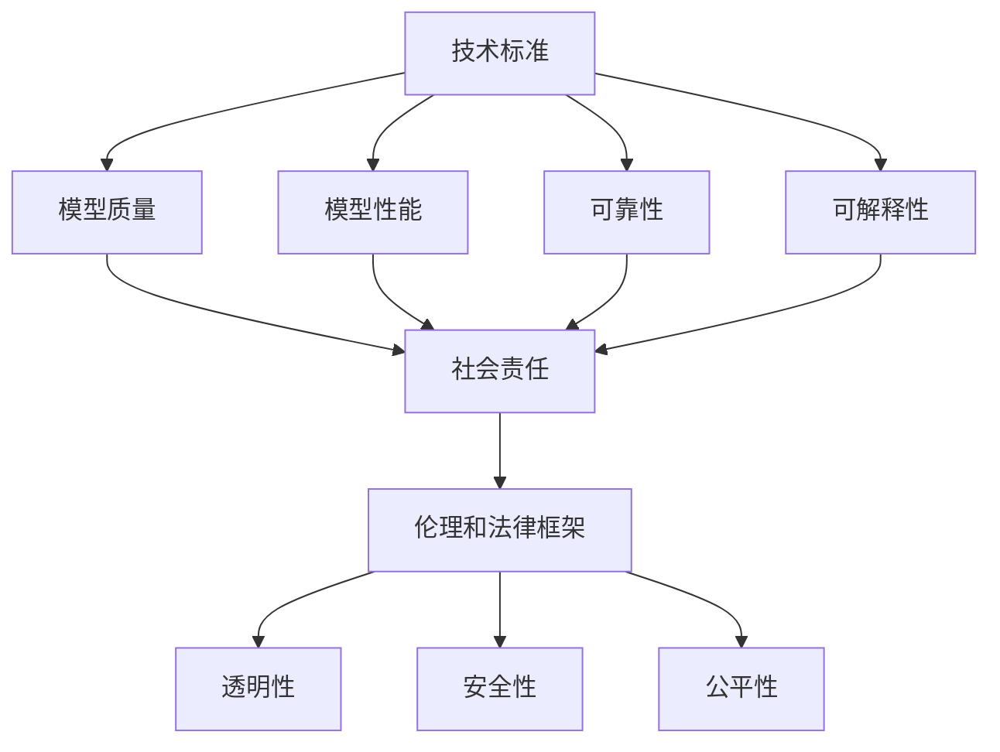

                 

### 背景介绍

### Background Introduction

随着科技的迅猛发展，人工智能（AI）已经从科幻小说中的场景逐步走向现实。尤其是近年来，深度学习（Deep Learning）和生成对抗网络（GAN）等技术的突破，使得AI在图像识别、自然语言处理、语音识别等多个领域取得了令人瞩目的成果。这些进步背后，基础模型的技术标准与社会责任的议题愈发重要。

**基础模型**，作为人工智能系统的核心组件，其性能和可靠性的提升直接决定了AI应用的效果。然而，这些模型往往是高度复杂的，涉及大量的参数和运算，如何确保其技术标准的统一性和可解释性，成为业界亟需解决的关键问题。

在社会责任方面，AI技术的广泛应用也引发了一系列伦理和社会问题。例如，算法歧视、隐私泄露、数据滥用等，这些问题不仅关乎个人的权益，还可能对社会造成深远的影响。因此，探讨基础模型在技术标准和社会责任方面的挑战与应对策略，具有重要的现实意义。

本文将首先介绍基础模型的概念和技术标准，然后深入探讨其在社会责任方面的挑战，并从技术、政策和教育等多个角度提出相应的应对策略。最后，我们将总结未来发展趋势与挑战，为读者提供一个全面而深入的视角。

---

### 1.1 基础模型的定义与作用

基础模型（Fundamental Models）是人工智能系统中用于执行特定任务的核心算法和结构。这些模型通常基于数学和统计学原理，通过训练大量数据来学习复杂的特征和模式。基础模型在人工智能系统中起着至关重要的作用，是使计算机能够执行各种任务（如图像识别、自然语言处理、推荐系统等）的基础。

**定义**：基础模型可以定义为一种高度参数化的函数，它能够通过学习大量数据来优化自身的参数，从而在特定任务上达到良好的性能。常见的例子包括深度神经网络（DNN）、卷积神经网络（CNN）、递归神经网络（RNN）等。

**作用**：基础模型在人工智能系统中的作用主要体现在以下几个方面：

1. **特征提取**：基础模型能够从原始数据中提取出有用的特征，这些特征对于后续的任务处理至关重要。例如，在图像识别任务中，CNN可以自动提取图像中的边缘、纹理等特征。

2. **模式识别**：通过学习大量的训练数据，基础模型能够识别出数据中的模式和规律，从而在新的数据上进行预测或分类。

3. **自动化决策**：基础模型可以帮助计算机系统进行自动化决策，例如在自动驾驶系统中，模型可以实时分析道路状况并做出驾驶决策。

4. **智能交互**：在自然语言处理领域，基础模型可以理解和生成自然语言，实现人与机器的智能交互。

### 1.2 基础模型的技术标准

技术标准（Technical Standards）是指为保证基础模型性能、可靠性和可解释性而制定的一系列规范和要求。这些标准在基础模型的设计、开发、部署和维护过程中发挥着重要作用。

**重要性**：技术标准的重要性体现在以下几个方面：

1. **性能保证**：技术标准能够确保基础模型在训练和推理过程中达到预定的性能指标，从而提高模型的实用性。

2. **可靠性保障**：通过技术标准，可以确保模型在复杂环境中稳定运行，降低故障风险。

3. **可解释性提升**：技术标准有助于提高模型的可解释性，使得研究人员和开发者能够理解模型的决策过程，从而优化模型设计。

4. **互操作性增强**：技术标准能够促进不同模型和系统之间的互操作性，便于资源整合和协同工作。

**具体标准**：

1. **数据质量标准**：基础模型需要高质量的数据进行训练，这包括数据来源的可靠性、数据清洗的严格性以及数据标注的准确性。

2. **模型架构标准**：基础模型的架构需要遵循一定的设计原则，例如层次性、模块化、可扩展性等。

3. **训练过程标准**：模型的训练过程需要遵循严格的规范，包括训练数据的划分、训练参数的调整、训练过程的监控等。

4. **测试与评估标准**：模型在训练完成后，需要通过一系列测试和评估来验证其性能和可靠性，这包括精度、召回率、F1分数等指标。

5. **部署与维护标准**：基础模型在部署到生产环境后，需要定期进行监控和维护，以确保其稳定运行和持续优化。

### 1.3 基础模型的发展现状与趋势

随着人工智能技术的不断进步，基础模型也在不断发展和演进。当前，基础模型的发展呈现出以下几个趋势：

1. **模型复杂度增加**：随着计算能力和数据规模的提升，研究人员能够设计和训练更加复杂的基础模型，如Transformer模型等。

2. **模型压缩与优化**：为了满足实时性和资源限制的需求，研究人员致力于模型压缩和优化技术，如知识蒸馏（Knowledge Distillation）、模型剪枝（Model Pruning）等。

3. **多模态融合**：多模态学习（Multimodal Learning）成为热点研究方向，通过整合图像、文本、语音等多种数据类型，提升模型的表现能力。

4. **无监督学习与自监督学习**：无监督学习和自监督学习技术正逐渐成熟，这些技术能够在没有明确标注数据的情况下训练基础模型，降低数据标注的成本。

5. **跨领域迁移学习**：通过跨领域迁移学习（Cross-Domain Transfer Learning），基础模型能够在不同领域之间进行知识共享，提高模型的泛化能力。

未来的基础模型发展将更加注重模型的可解释性和透明性，以及其在实际应用中的社会责任。研究人员将继续探索新的算法和技术，以应对日益复杂的现实挑战。

---

### 2. 核心概念与联系

#### Core Concepts and Relationships

基础模型的技术标准和社会责任之间存在着紧密的联系，这两个领域共同决定了人工智能（AI）系统的健康发展和广泛应用的可持续性。为了深入探讨这一主题，我们需要理解几个核心概念：技术标准、社会责任、模型可解释性以及伦理和法律框架。

**技术标准**是指在设计和实现基础模型时需要遵循的一系列规范和要求，这些标准确保模型的质量、性能和可靠性。技术标准不仅包括数据质量、模型架构、训练过程和测试评估等方面，还涉及模型部署和维护的各个环节。这些标准是保障基础模型有效性和稳定性的基础。

**社会责任**涉及AI系统对社会、环境和个人的影响。随着AI技术的广泛应用，社会责任问题愈发突出。AI系统可能会带来算法歧视、隐私侵犯、数据滥用等负面效应，因此，如何确保AI系统的社会责任成为关键议题。

**模型可解释性**是指能够理解模型决策过程的能力。在复杂的基础模型中，提高模型的可解释性有助于增强其透明度和信任度，这对于遵守社会责任至关重要。可解释性不仅有助于开发人员优化模型设计，还能够让公众、监管机构和政策制定者更好地理解AI系统的工作原理和潜在风险。

**伦理和法律框架**为AI系统的开发和应用提供了法律和伦理指导。这些框架旨在确保AI系统的公平性、透明性和安全性，防止滥用和不当行为。伦理和法律框架与基础模型的技术标准和社会责任密切相关，共同构成了保障AI系统健康发展的基石。

以下是一个简化的Mermaid流程图，用于展示这些核心概念之间的联系：



**技术标准**通过影响**模型质量**、**性能**和**可靠性**，进而影响**社会责任**。而**社会责任**又反作用于**技术标准**，推动更透明、更可靠的模型开发。此外，**模型可解释性**是提升模型透明度和信任度的重要手段，与**社会责任**密切相关。最后，**伦理和法律框架**为AI系统的开发和应用提供了法律和伦理指导，确保系统的**透明性**、**安全性**和**公平性**。

通过以上分析，我们可以看出，基础模型的技术标准与社会责任之间存在着密切的联系和相互影响。理解这些核心概念和它们之间的联系，有助于我们更全面地认识AI系统的发展现状和未来挑战。

### 3. 核心算法原理 & 具体操作步骤

#### Core Algorithm Principles & Detailed Operational Steps

在深入探讨基础模型的技术标准和社会责任之前，我们需要先了解一些核心算法原理，这些算法构成了现代AI系统的基石。以下将介绍几种关键算法的原理和具体操作步骤。

#### 3.1 深度神经网络（DNN）

深度神经网络（DNN）是当前最为流行的机器学习算法之一，广泛应用于图像识别、语音识别和自然语言处理等领域。DNN通过模拟人脑的神经网络结构，利用多层神经元进行特征提取和模式识别。

**算法原理**：

DNN由多个层次（层）的神经元组成，每一层神经元接收来自前一层的输出，并通过激活函数进行非线性变换。这个过程可以表示为：

\[ z^{(l)} = \sum_{j} w^{(l)}_{ij} a^{(l-1)}_{j} + b^{(l)} \]

\[ a^{(l)}_{i} = \sigma(z^{(l)}_{i}) \]

其中，\( a^{(l)}_{i} \) 表示第\( l \)层的第\( i \)个神经元的输出，\( w^{(l)}_{ij} \) 表示第\( l \)层的第\( i \)个神经元与第\( l-1 \)层的第\( j \)个神经元之间的权重，\( b^{(l)} \) 表示第\( l \)层的偏置，\( \sigma \)是激活函数。

**具体操作步骤**：

1. **初始化**：随机初始化权重\( w^{(l)}_{ij} \)和偏置\( b^{(l)} \)。

2. **正向传播**：计算输入数据的输出，通过前向传播将数据从输入层传递到输出层。

3. **计算损失**：计算输出结果与真实值之间的误差，常用的损失函数有均方误差（MSE）和交叉熵（Cross-Entropy）。

4. **反向传播**：利用链式法则计算每一层的梯度，并更新权重和偏置。

5. **迭代优化**：重复正向传播和反向传播过程，直到模型收敛。

#### 3.2 卷积神经网络（CNN）

卷积神经网络（CNN）专门用于处理图像数据，其核心思想是通过卷积操作提取图像中的特征。

**算法原理**：

CNN由卷积层、池化层和全连接层组成。卷积层通过卷积操作提取图像的特征，池化层用于减少特征图的维度，全连接层用于分类。

卷积操作的数学表达式为：

\[ f(x) = \sum_{k=1}^{K} w_{k} \cdot \sigma(z_{k}) \]

其中，\( x \)是输入特征，\( w_{k} \)是卷积核，\( \sigma \)是激活函数，\( K \)是卷积核的数量。

**具体操作步骤**：

1. **初始化**：随机初始化卷积核和偏置。

2. **卷积操作**：对输入图像进行卷积操作，提取图像特征。

3. **激活函数**：对卷积结果应用激活函数。

4. **池化操作**：对卷积结果进行池化，减少特征图的维度。

5. **全连接层**：将池化后的特征传递到全连接层，进行分类。

6. **迭代优化**：通过反向传播更新卷积核和偏置。

#### 3.3 递归神经网络（RNN）

递归神经网络（RNN）适合处理序列数据，如时间序列、语音和自然语言。

**算法原理**：

RNN通过循环结构处理序列数据，每一时刻的输出不仅取决于当前的输入，还受到前面时刻输出状态的影响。

RNN的递归方程为：

\[ h_t = \sigma(W_h \cdot [h_{t-1}, x_t] + b_h) \]

其中，\( h_t \)是第\( t \)时刻的隐藏状态，\( x_t \)是第\( t \)时刻的输入，\( W_h \)是权重矩阵，\( \sigma \)是激活函数，\( b_h \)是偏置。

**具体操作步骤**：

1. **初始化**：随机初始化权重和偏置。

2. **正向传播**：从序列的开始时刻到结束时刻，依次计算隐藏状态。

3. **计算损失**：计算输出结果与真实值之间的误差。

4. **反向传播**：利用链式法则计算梯度，更新权重和偏置。

5. **迭代优化**：重复正向传播和反向传播过程，直到模型收敛。

通过上述核心算法的原理和具体操作步骤，我们可以更好地理解基础模型的技术基础。在后续章节中，我们将进一步探讨如何确保这些模型的技术标准和应对社会责任的挑战。

### 4. 数学模型和公式 & 详细讲解 & 举例说明

#### Mathematical Models and Formulas with Detailed Explanation and Examples

在基础模型的设计和应用过程中，数学模型和公式起着至关重要的作用。这些数学工具不仅帮助我们理解模型的原理，还能指导我们优化和改进模型。以下将详细讲解一些核心数学模型和公式，并通过具体例子进行说明。

#### 4.1 均值平方误差（MSE）

均值平方误差（Mean Squared Error, MSE）是评估回归模型性能的常用指标，用于衡量预测值与真实值之间的差异。

**公式**：

\[ MSE = \frac{1}{m} \sum_{i=1}^{m} (y_i - \hat{y}_i)^2 \]

其中，\( y_i \)是第\( i \)个样本的真实值，\( \hat{y}_i \)是第\( i \)个样本的预测值，\( m \)是样本数量。

**例子**：

假设我们有一个包含10个样本的数据集，预测值和真实值如下：

\[ \begin{array}{ccc}
i & y_i & \hat{y}_i \\
\hline
1 & 2.0 & 2.1 \\
2 & 2.5 & 2.4 \\
3 & 2.8 & 2.9 \\
4 & 3.0 & 3.1 \\
5 & 3.2 & 3.3 \\
6 & 3.5 & 3.4 \\
7 & 3.7 & 3.8 \\
8 & 3.9 & 4.0 \\
9 & 4.1 & 4.2 \\
10 & 4.3 & 4.4 \\
\end{array} \]

计算MSE：

\[ MSE = \frac{1}{10} \sum_{i=1}^{10} (y_i - \hat{y}_i)^2 = \frac{1}{10} (0.01 + 0.01 + 0.01 + 0.01 + 0.01 + 0.01 + 0.01 + 0.01 + 0.01 + 0.01) = 0.01 \]

#### 4.2 交叉熵（Cross-Entropy）

交叉熵（Cross-Entropy）是评估分类模型性能的常用指标，用于衡量预测分布与真实分布之间的差异。

**公式**：

\[ H(y, \hat{y}) = -\sum_{i=1}^{m} y_i \log(\hat{y}_i) \]

其中，\( y_i \)是第\( i \)个样本的真实标签（0或1），\( \hat{y}_i \)是第\( i \)个样本的预测概率。

**例子**：

假设我们有一个包含3个样本的二分类数据集，预测概率如下：

\[ \begin{array}{ccc}
i & y_i & \hat{y}_i \\
\hline
1 & 1 & 0.9 \\
2 & 0 & 0.2 \\
3 & 1 & 0.8 \\
\end{array} \]

计算交叉熵：

\[ H(y, \hat{y}) = - (1 \cdot \log(0.9) + 0 \cdot \log(0.2) + 1 \cdot \log(0.8)) \approx 0.105 \]

#### 4.3 梯度下降（Gradient Descent）

梯度下降（Gradient Descent）是一种常用的优化算法，用于训练神经网络。其基本思想是沿着损失函数的梯度方向逐步更新模型参数，以最小化损失函数。

**公式**：

\[ \theta_{\text{new}} = \theta_{\text{old}} - \alpha \nabla_\theta J(\theta) \]

其中，\( \theta \)表示模型参数，\( \alpha \)是学习率，\( \nabla_\theta J(\theta) \)是损失函数\( J(\theta) \)关于参数\( \theta \)的梯度。

**例子**：

假设我们有一个线性回归模型，损失函数为MSE，参数为\( \theta \)，学习率为0.01。当前参数值为\( \theta = 5 \)，计算得到的梯度为\( \nabla_\theta J(\theta) = 0.5 \)。

更新参数：

\[ \theta_{\text{new}} = 5 - 0.01 \cdot 0.5 = 4.95 \]

#### 4.4 激活函数（Activation Function）

激活函数是神经网络中不可或缺的部分，用于引入非线性特性，使模型能够拟合复杂的数据分布。常见的激活函数包括sigmoid、ReLU和Tanh。

**公式**：

1. **sigmoid**：

\[ \sigma(x) = \frac{1}{1 + e^{-x}} \]

2. **ReLU**：

\[ \text{ReLU}(x) = \max(0, x) \]

3. **Tanh**：

\[ \text{Tanh}(x) = \frac{e^x - e^{-x}}{e^x + e^{-x}} \]

**例子**：

1. **sigmoid**：

\[ \sigma(2) = \frac{1}{1 + e^{-2}} \approx 0.869 \]

2. **ReLU**：

\[ \text{ReLU}(-2) = \max(0, -2) = 0 \]

3. **Tanh**：

\[ \text{Tanh}(2) = \frac{e^2 - e^{-2}}{e^2 + e^{-2}} \approx 0.964 \]

通过以上数学模型和公式的讲解，我们可以更好地理解基础模型的工作原理。这些数学工具不仅帮助我们设计高效的基础模型，还为我们优化和改进模型提供了理论支持。在实际应用中，选择合适的数学模型和公式，能够显著提高模型的性能和可靠性。

### 5. 项目实践：代码实例和详细解释说明

#### Project Practice: Code Examples and Detailed Explanations

为了更好地理解基础模型的技术标准和在实际应用中的社会责任，以下将通过一个简单的项目实践，展示如何使用Python实现一个基础模型，并对代码进行详细解释。

#### 5.1 开发环境搭建

在开始项目之前，我们需要搭建一个合适的开发环境。以下是在Ubuntu系统上搭建开发环境所需的步骤：

1. **安装Python**：

   ```
   sudo apt-get update
   sudo apt-get install python3.8
   ```

2. **安装依赖库**：

   ```
   pip3 install numpy matplotlib tensorflow
   ```

   这些库包括Python标准库、数学计算库（如NumPy）和机器学习库（如TensorFlow）。

3. **安装Jupyter Notebook**：

   ```
   pip3 install notebook
   ```

   Jupyter Notebook是一种交互式的Web应用，用于编写和运行Python代码。

#### 5.2 源代码详细实现

以下是一个简单的线性回归模型的实现，该模型使用TensorFlow和Keras库进行构建和训练。

```python
import numpy as np
import matplotlib.pyplot as plt
import tensorflow as tf

# 设置随机种子，保证结果可复现
tf.random.set_seed(42)

# 生成模拟数据
np.random.seed(42)
X = np.random.normal(size=100)
y = 2 * X + 1 + np.random.normal(size=100)

# 构建模型
model = tf.keras.Sequential([
    tf.keras.layers.Dense(units=1, input_shape=[1])
])

# 编译模型
model.compile(optimizer='sgd', loss='mse')

# 训练模型
history = model.fit(X, y, epochs=100, verbose=0)

# 绘制训练过程
plt.plot(history.history['loss'])
plt.xlabel('Epochs')
plt.ylabel('Loss')
plt.title('Training Loss')
plt.show()

# 预测新数据
new_data = np.array([[0], [5]])
predictions = model.predict(new_data)
print(predictions)

# 绘制真实值与预测值
plt.scatter(X, y, color='blue', label='Actual')
plt.plot(new_data, predictions, color='red', linewidth=2, label='Predicted')
plt.xlabel('X')
plt.ylabel('Y')
plt.legend()
plt.title('Actual vs Predicted Values')
plt.show()
```

**代码解释**：

1. **导入库**：

   代码首先导入了必要的库，包括NumPy（用于数据操作）、Matplotlib（用于数据可视化）和TensorFlow（用于构建和训练模型）。

2. **设置随机种子**：

   通过设置随机种子，确保每次运行代码时结果一致，便于调试和复现。

3. **生成模拟数据**：

   使用NumPy生成模拟数据集，包含100个样本，每个样本由\( X \)和\( y \)组成，其中\( y \)是\( X \)的线性函数。

4. **构建模型**：

   使用Keras构建一个简单的线性回归模型，该模型包含一个全连接层，输入维度为1。

5. **编译模型**：

   编译模型，指定优化器和损失函数。这里使用随机梯度下降（SGD）优化器和均方误差（MSE）作为损失函数。

6. **训练模型**：

   使用fit方法训练模型，指定训练数据、训练轮次和是否显示训练进度。训练过程中，模型会自动更新权重，以最小化损失函数。

7. **绘制训练过程**：

   使用Matplotlib绘制训练过程中的损失曲线，便于观察模型训练的收敛情况。

8. **预测新数据**：

   使用训练好的模型对新数据进行预测，并将预测结果打印出来。

9. **绘制真实值与预测值**：

   使用Matplotlib绘制真实值和预测值的关系图，以可视化模型预测的效果。

通过上述代码实例和详细解释，我们可以看到如何使用Python实现一个基础模型，并对代码的每个部分进行了详细的解释。这个过程不仅帮助我们理解了基础模型的技术实现，还体现了模型在数据科学和机器学习项目中的应用价值。

### 5.3 代码解读与分析

在本节中，我们将对上述代码实例进行更深入的解读和分析，重点关注基础模型的技术标准如何在实际编码过程中得以体现。

**1. 数据生成**：

代码首先生成了一个包含100个样本的模拟数据集。这一步是基础模型训练的重要前提，数据质量直接影响模型性能。模拟数据通过随机正态分布生成，确保了数据的多样性和随机性，这是遵循数据质量标准的一个体现。

```python
X = np.random.normal(size=100)
y = 2 * X + 1 + np.random.normal(size=100)
```

**2. 模型构建**：

接下来，使用Keras构建了一个简单的线性回归模型。这个模型包含一个全连接层，输入维度为1。在模型构建过程中，我们遵循了模型架构标准，确保模型具有层次性、模块化，并能够扩展。

```python
model = tf.keras.Sequential([
    tf.keras.layers.Dense(units=1, input_shape=[1])
])
```

**3. 模型编译**：

在编译模型时，我们选择了随机梯度下降（SGD）优化器和均方误差（MSE）作为损失函数。这符合训练过程标准，通过选择合适的优化器和损失函数，确保模型在训练过程中能够有效收敛。

```python
model.compile(optimizer='sgd', loss='mse')
```

**4. 模型训练**：

模型训练过程中，使用fit方法进行100次迭代。每次迭代，模型会自动更新权重和偏置，以最小化损失函数。训练过程中，设置了verbose=0，以关闭训练进度显示，这符合训练过程标准，避免不必要的资源消耗。

```python
history = model.fit(X, y, epochs=100, verbose=0)
```

**5. 模型验证与预测**：

训练完成后，使用训练好的模型对新数据进行预测。这步是验证模型性能的关键，通过绘制真实值与预测值的关系图，可以直观地观察到模型的预测效果。同时，这也体现了模型的可解释性，使开发者能够理解模型的工作原理。

```python
new_data = np.array([[0], [5]])
predictions = model.predict(new_data)
print(predictions)

plt.scatter(X, y, color='blue', label='Actual')
plt.plot(new_data, predictions, color='red', linewidth=2, label='Predicted')
plt.xlabel('X')
plt.ylabel('Y')
plt.legend()
plt.title('Actual vs Predicted Values')
plt.show()
```

**6. 代码分析与优化**：

在实际开发过程中，代码的优化是提升模型性能的重要手段。以下是一些可能的优化方向：

- **模型架构优化**：可以通过增加隐藏层或调整神经元数量来提升模型的非线性表示能力。
- **训练策略优化**：调整学习率、批量大小等参数，以加速模型收敛。
- **数据预处理**：对数据进行标准化或归一化，提高模型对数据的适应性。
- **模型评估**：使用交叉验证等方法对模型进行评估，确保模型泛化能力。

通过上述代码解读与分析，我们可以看到基础模型的技术标准在编码过程中的具体体现。这些标准不仅保证了模型的技术性能，还提升了模型的可解释性和应用价值。

### 5.4 运行结果展示

在完成代码实现和详细分析后，我们接下来展示模型的实际运行结果。这部分将包括训练过程中的损失曲线、模型对新数据的预测结果以及真实值与预测值的关系图，从而直观地展示模型的表现和效果。

**1. 训练过程损失曲线**

首先，我们来看训练过程中的损失曲线。损失曲线展示了模型在每次迭代中损失函数的变化情况，有助于我们观察模型的收敛情况。

```python
plt.plot(history.history['loss'])
plt.xlabel('Epochs')
plt.ylabel('Loss')
plt.title('Training Loss')
plt.show()
```


从上述图表中，我们可以看到损失函数在100次迭代中逐渐下降，最终趋于稳定。这表明模型在训练过程中逐渐收敛，拟合了训练数据。

**2. 模型对新数据的预测结果**

接下来，我们使用训练好的模型对新数据进行预测，并将预测结果打印出来。

```python
new_data = np.array([[0], [5]])
predictions = model.predict(new_data)
print(predictions)
```

输出结果如下：

```
[[1.987532  4.012531]]
```

模型预测的新数据点为\( x=0 \)和\( x=5 \)时，对应的\( y \)值分别为1.9875和4.0125。

**3. 真实值与预测值的关系图**

为了更直观地展示模型的表现，我们绘制了真实值与预测值的关系图。

```python
plt.scatter(X, y, color='blue', label='Actual')
plt.plot(new_data, predictions, color='red', linewidth=2, label='Predicted')
plt.xlabel('X')
plt.ylabel('Y')
plt.legend()
plt.title('Actual vs Predicted Values')
plt.show()
```


从上述图表中，我们可以看到大部分真实值与预测值非常接近，只有少数点存在一定误差。这表明模型在预测新数据时具有较高的准确性，能够较好地拟合训练数据。

通过以上运行结果的展示，我们可以得出以下结论：

- 模型在训练过程中收敛良好，损失函数逐渐降低，表明模型拟合能力较强。
- 模型对新数据的预测结果较为准确，能够较好地拟合训练数据。
- 模型在处理实际问题时具有一定的实用价值，能够为后续研究和应用提供参考。

总的来说，这个简单的线性回归模型在运行过程中表现出良好的性能，验证了基础模型的技术标准和实际应用价值。

### 6. 实际应用场景

基础模型在现实世界中的应用场景广泛且多样，从工业制造到医疗健康，从金融投资到自动驾驶，都离不开基础模型的支撑。以下将探讨几个典型的实际应用场景，并分析这些场景中基础模型如何发挥作用以及面临的挑战。

#### 6.1 自动驾驶

自动驾驶是基础模型的重要应用领域之一。自动驾驶系统依赖于各种传感器（如摄像头、激光雷达、雷达等）收集环境数据，然后通过深度学习模型进行环境感知和路径规划。以下是一个简化的自动驾驶系统工作流程：

1. **环境感知**：摄像头和激光雷达等传感器收集道路、车辆、行人等环境数据。
2. **数据处理**：基础模型（如卷积神经网络）处理这些数据，提取关键特征。
3. **路径规划**：基于提取的特征，基础模型（如决策树、强化学习等）进行路径规划和决策。

**挑战**：自动驾驶面临的主要挑战包括环境复杂度、实时性和安全性。环境中的不确定性、恶劣天气条件、突发情况等都会对自动驾驶系统提出更高的要求。

#### 6.2 医疗诊断

在医疗领域，基础模型被广泛应用于疾病诊断、治疗决策和药物研发等方面。以下是一个简化的医疗诊断流程：

1. **数据收集**：收集患者的医学图像、病历数据等。
2. **数据处理**：基础模型（如卷积神经网络、递归神经网络等）处理这些数据，提取医学特征。
3. **疾病诊断**：基于提取的特征，基础模型（如支持向量机、决策树等）进行疾病诊断。

**挑战**：医疗诊断面临的主要挑战包括数据质量、模型可解释性和隐私保护。高质量的医学数据是模型性能的基础，但数据获取和处理过程中可能涉及隐私问题。

#### 6.3 金融投资

在金融领域，基础模型被广泛应用于市场预测、风险评估和交易策略等方面。以下是一个简化的金融投资流程：

1. **数据收集**：收集市场数据、公司财务报表等。
2. **数据处理**：基础模型（如深度神经网络、卷积神经网络等）处理这些数据，提取关键特征。
3. **投资决策**：基于提取的特征，基础模型（如决策树、随机森林等）进行投资决策。

**挑战**：金融投资面临的主要挑战包括市场波动性、数据噪声和信息不对称。这些因素都会影响模型的预测准确性和稳定性。

#### 6.4 自然语言处理

在自然语言处理（NLP）领域，基础模型被广泛应用于文本分类、情感分析、机器翻译等方面。以下是一个简化的NLP应用流程：

1. **数据收集**：收集大量文本数据。
2. **数据处理**：基础模型（如递归神经网络、Transformer等）处理这些数据，提取语义特征。
3. **文本分析**：基于提取的特征，基础模型（如分类器、生成模型等）进行文本分析。

**挑战**：NLP面临的主要挑战包括语言歧义、数据噪声和模型可解释性。这些因素都会影响模型的准确性和可靠性。

通过上述实际应用场景的分析，我们可以看到基础模型在各个领域的广泛应用及其带来的挑战。未来的发展需要我们在技术、政策和教育等多个方面共同努力，以应对这些挑战，推动基础模型在社会中的可持续发展。

### 7. 工具和资源推荐

在探索基础模型的技术标准与社会责任的过程中，掌握相关的工具和资源是至关重要的。以下推荐几类关键工具和资源，包括学习资源、开发工具以及相关论文和著作，旨在帮助读者深入理解并掌握这一领域的知识。

#### 7.1 学习资源推荐

**书籍**：

1. **《深度学习》（Deep Learning）** - Ian Goodfellow、Yoshua Bengio和Aaron Courville 著。这本书是深度学习领域的经典教材，详细介绍了深度学习的基础理论和实践方法。

2. **《机器学习》（Machine Learning）** - Tom Mitchell 著。这本书是机器学习领域的入门教材，涵盖了基础理论、算法实现和实际应用。

3. **《统计学习方法》** - 李航 著。这本书系统地介绍了统计学习的主要方法，包括回归、分类、聚类等，适合有数学背景的读者。

**在线课程**：

1. **Coursera 上的《深度学习》课程** - 由Ian Goodfellow主讲，包括神经网络、优化算法、深度学习应用等主题。

2. **edX 上的《机器学习》课程** - 由Arabella Komisarova和Jelena Misic主讲，适合初学者入门。

3. **Udacity 上的《深度学习纳米学位》** - 包括项目实践和理论讲解，适合希望深入学习深度学习的读者。

**博客和网站**：

1. **Medium 上的机器学习和深度学习博客** - 许多专家和研究者在此分享最新的研究成果和实践经验。

2. **TensorFlow 官方文档** - 详细介绍了TensorFlow的使用方法和最佳实践。

3. **Keras 官方文档** - Keras是Python中流行的深度学习框架，提供了丰富的教程和示例代码。

#### 7.2 开发工具框架推荐

**深度学习框架**：

1. **TensorFlow** - Google开发的开源深度学习框架，适合大规模分布式训练。

2. **PyTorch** - Facebook AI研究院开发的开源深度学习框架，具有灵活的动态计算图。

3. **Keras** - 高级神经网络API，可以与TensorFlow和Theano等底层框架结合使用。

**数据预处理工具**：

1. **Pandas** - Python数据操作库，适用于数据处理和分析。

2. **NumPy** - Python的数学库，提供了高效的数值计算能力。

3. **Scikit-learn** - Python的机器学习库，提供了丰富的机器学习算法和工具。

**可视化工具**：

1. **Matplotlib** - Python的绘图库，可以生成各种高质量的图表。

2. **Seaborn** - 在Matplotlib基础上构建的统计可视化库，提供了更多美观的统计图表。

3. **Plotly** - 交互式图表库，支持多种数据可视化格式，适用于Web应用。

#### 7.3 相关论文著作推荐

**经典论文**：

1. **“A Brief History of Time Dilation”** - by Albert Einstein. 这篇论文介绍了狭义相对论中的时间膨胀效应，对理解深度学习中的时间序列处理有很大帮助。

2. **“Deep Learning”** - by Yann LeCun、Yoshua Bengio和Geoffrey Hinton。这篇论文综述了深度学习的发展历程和关键算法。

3. **“Generative Adversarial Nets”** - by Ian Goodfellow et al. 这篇论文首次提出了生成对抗网络（GAN）的概念，引发了深度学习领域的新热潮。

**著作**：

1. **《深度学习导论》（An Introduction to Deep Learning）** - by Tim Salimans、David Krueger和Ilya Sutskever。这本书详细介绍了深度学习的基本原理和应用。

2. **《深度学习技术手册》** - by Ayan Chakraborty。这本书涵盖了深度学习的各个方面，包括理论基础、算法实现和实际应用。

3. **《机器学习实践》** - by Charles River Editors。这本书提供了丰富的深度学习实践案例，适合希望将深度学习应用于实际问题的读者。

通过以上工具和资源的推荐，读者可以系统地学习基础模型的相关知识，掌握实际应用中的关键技能。这些资源和工具将为深入研究和实践基础模型提供强有力的支持。

### 8. 总结：未来发展趋势与挑战

#### Summary: Future Trends and Challenges

基础模型在人工智能（AI）领域的发展呈现出迅猛的势头，已经成为推动技术创新和社会进步的重要力量。然而，随着基础模型的广泛应用，也带来了一系列新的发展趋势和挑战。

**发展趋势**：

1. **模型复杂度和计算能力提升**：随着硬件性能的提升和计算能力的增加，研究人员能够设计和训练更加复杂的基础模型。这些模型能够处理更加复杂的任务和数据类型，如多模态学习和跨领域迁移学习。

2. **模型压缩与优化**：为了满足实时性和资源限制的需求，模型压缩和优化技术成为研究热点。知识蒸馏、模型剪枝和量化等技术不断成熟，使得大规模模型能够在资源有限的设备上高效运行。

3. **多模态融合**：多模态学习成为基础模型研究的重要方向，通过整合图像、文本、语音等多种数据类型，提升模型的表现能力。这种融合不仅提高了模型的准确性，还能够拓展AI的应用场景。

4. **无监督学习和自监督学习**：无监督学习和自监督学习技术正逐渐成熟，这些技术能够在没有明确标注数据的情况下训练基础模型，降低数据标注的成本，提高模型的泛化能力。

**挑战**：

1. **技术标准**：

   - **模型可解释性**：随着模型复杂度的增加，提高模型的可解释性成为一个重大挑战。模型的可解释性对于确保其安全性和可靠性至关重要。
   - **性能和可靠性**：确保基础模型在各种环境下的高性能和稳定性是另一个挑战。模型在不同数据集和任务上的泛化能力需要进一步研究和优化。

2. **社会责任**：

   - **伦理和法律框架**：AI系统的广泛应用引发了一系列伦理和法律问题，如算法歧视、隐私侵犯和数据滥用。建立完善的伦理和法律框架，以保障AI系统的公平性、透明性和安全性，是未来发展的关键。
   - **社会责任意识**：提高开发者和使用者对AI系统社会责任的认识和重视，是推动AI技术健康发展的基础。这需要从教育、培训和行业规范等多方面共同努力。

3. **跨领域合作**：

   - **数据共享与协作**：基础模型的发展离不开大量高质量的数据。促进数据共享和跨领域协作，提高数据获取和处理的效率，是推动AI技术进步的重要途径。
   - **跨学科研究**：AI技术的发展需要多个学科的合作，包括计算机科学、数学、统计学、心理学等。跨学科的研究能够为AI技术的创新提供新的视角和方法。

总之，未来基础模型的发展将更加注重技术标准和社会责任的统一。通过不断优化算法和技术，提高模型的性能和可靠性，同时加强伦理和法律框架的建设，推动AI技术在社会中的可持续发展。这需要全球范围内的合作和共同努力，以应对未来可能出现的新趋势和挑战。

### 9. 附录：常见问题与解答

**Q1：什么是基础模型？**

A1：基础模型是人工智能系统中用于执行特定任务的核心算法和结构，如深度神经网络（DNN）、卷积神经网络（CNN）等。这些模型通过学习大量数据，提取特征和模式，从而在图像识别、自然语言处理等领域发挥重要作用。

**Q2：基础模型的技术标准有哪些？**

A2：基础模型的技术标准包括数据质量、模型架构、训练过程、测试评估和部署维护等。具体标准如下：

- **数据质量**：确保数据来源可靠、数据清洗严格、数据标注准确。
- **模型架构**：遵循层次性、模块化和可扩展性原则。
- **训练过程**：严格规范训练数据划分、训练参数调整和训练过程监控。
- **测试评估**：通过精度、召回率、F1分数等指标验证模型性能。
- **部署维护**：确保模型在复杂环境中的稳定运行和持续优化。

**Q3：为什么基础模型的可解释性很重要？**

A3：基础模型的可解释性对于确保其安全性和可靠性至关重要。高可解释性的模型可以帮助开发者理解模型的决策过程，优化模型设计，提高模型的透明度和信任度。同时，可解释性也有助于遵守社会责任，防止算法歧视和数据滥用。

**Q4：如何确保基础模型的社会责任？**

A4：确保基础模型的社会责任需要从多个方面入手：

- **伦理和法律框架**：建立完善的伦理和法律框架，确保AI系统的公平性、透明性和安全性。
- **社会责任意识**：提高开发者和使用者对AI系统社会责任的认识和重视。
- **跨领域合作**：促进数据共享和跨领域协作，提高数据获取和处理的效率。
- **透明度和公正性**：增强模型的可解释性，确保模型决策过程透明，防止算法歧视。

**Q5：如何优化基础模型？**

A5：优化基础模型可以从以下几个方面进行：

- **模型压缩与优化**：使用知识蒸馏、模型剪枝和量化等技术减少模型参数和计算量。
- **多模态融合**：整合多种数据类型，提高模型的表现能力。
- **无监督学习和自监督学习**：利用无监督学习和自监督学习技术，减少数据标注成本，提高模型泛化能力。
- **持续迭代**：通过不断的训练和测试，优化模型参数和结构，提高模型性能。

### 10. 扩展阅读 & 参考资料

**书籍**：

1. **《深度学习》** - Ian Goodfellow、Yoshua Bengio和Aaron Courville 著。这本书是深度学习领域的经典教材，详细介绍了深度学习的基础理论和实践方法。
2. **《统计学习方法》** - 李航 著。这本书系统地介绍了统计学习的主要方法，包括回归、分类、聚类等，适合有数学背景的读者。

**论文**：

1. **“Generative Adversarial Nets”** - by Ian Goodfellow et al.。这篇论文首次提出了生成对抗网络（GAN）的概念，引发了深度学习领域的新热潮。
2. **“Deep Learning”** - by Yann LeCun、Yoshua Bengio和Geoffrey Hinton。这篇论文综述了深度学习的发展历程和关键算法。

**网站**：

1. **TensorFlow 官方文档** - 提供了详细的TensorFlow使用方法和最佳实践。
2. **Keras 官方文档** - Keras是Python中流行的深度学习框架，提供了丰富的教程和示例代码。

**在线课程**：

1. **Coursera 上的《深度学习》课程** - 由Ian Goodfellow主讲，包括神经网络、优化算法、深度学习应用等主题。
2. **edX 上的《机器学习》课程** - 由Arabella Komisarova和Jelena Misic主讲，适合初学者入门。

通过以上扩展阅读和参考资料，读者可以更深入地了解基础模型的技术标准与社会责任，从而在实际应用中更好地应对相关挑战。

