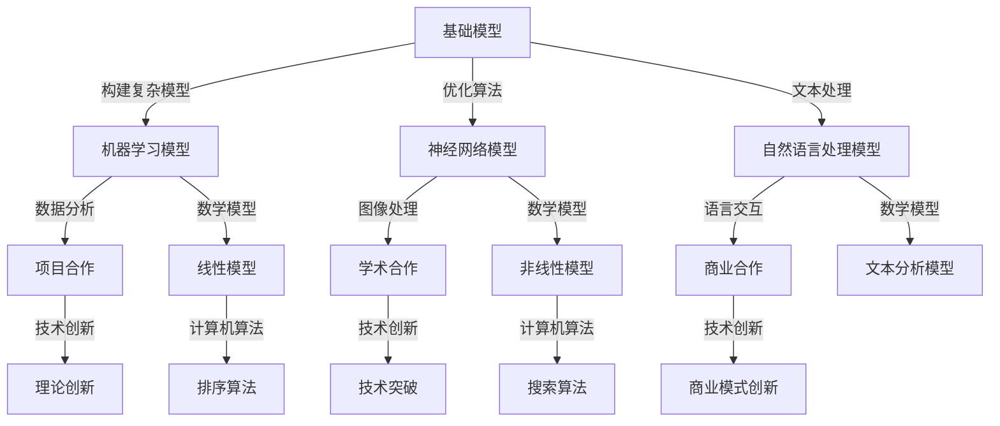

                 

### 背景介绍

在当今快速发展的信息技术时代，基础模型在社会合作与技术创新中的作用愈发凸显。基础模型，通常指的是在计算机科学和人工智能领域中，作为构建更复杂模型和算法的基础性模型。这些基础模型不仅提供了算法的底层支持，也在社会合作和技术创新中发挥了关键作用。

首先，基础模型是社会合作的重要桥梁。在人工智能、大数据、云计算等前沿技术领域，不同组织和个人之间的合作变得愈发紧密。基础模型提供了这些合作的基础，使得不同团队可以在共同的理解和框架下进行技术交流和协作。例如，深度学习中的神经网络模型，已经成为了各个领域研究人员和应用开发者共同的语言和工具。

其次，基础模型是技术创新的核心动力。技术创新往往依赖于基础理论的突破和核心算法的创新。基础模型作为这些创新的理论基石，不仅推动了技术的进步，也为新的商业模式和应用场景的创造提供了可能性。例如，自然语言处理中的Transformer模型，就极大地推动了人工智能与自然语言交互的发展，使得智能助手、机器翻译等应用成为现实。

此外，基础模型还在解决复杂问题、提高计算效率、优化资源利用等方面发挥着重要作用。随着数据规模的不断扩大和计算需求的日益增长，基础模型的出现使得我们能够更高效地处理海量数据，并在各种复杂场景下进行有效的决策和优化。

本文将围绕基础模型的社会合作与技术创新，展开深入探讨。我们将首先介绍一些核心概念，包括基础模型的定义、主要类型及其在社会合作和技术创新中的应用。接着，我们将详细解析基础模型的核心算法原理和具体操作步骤，帮助读者理解其背后的数学模型和公式。随后，通过实际项目实践的代码实例和详细解释，让读者能够直观地看到基础模型的应用效果。此外，我们还将探讨基础模型在实际应用场景中的表现，推荐相关的学习资源和开发工具，最后对基础模型的发展趋势与挑战进行总结，并回答一些常见问题。

通过本文的逐步分析，希望读者能够对基础模型的社会合作与技术创新有更深入的理解，为未来的学习和实践奠定坚实的基础。

### 核心概念与联系

在深入探讨基础模型的社会合作与技术创新之前，我们需要首先明确一些核心概念，并了解这些概念之间的联系。以下是本文将要涉及的主要核心概念：

#### 1. 基础模型

**定义**：基础模型是指那些用于构建更复杂模型和算法的基本模型。这些模型在计算机科学和人工智能领域具有广泛应用，是解决各种复杂问题的基石。

**类型**：
- **机器学习模型**：例如线性回归、支持向量机等，用于数据分析与预测。
- **神经网络模型**：如多层感知机、卷积神经网络等，常用于图像和语音处理。
- **自然语言处理模型**：如循环神经网络、Transformer等，用于文本理解和生成。

**在社会合作中的角色**：基础模型为社会合作提供了统一的框架和语言，使得不同团队和研究人员能够在共同的理解和标准下进行协作。

#### 2. 社会合作

**定义**：社会合作是指在不同组织、团队或个人之间，为了共同的目标或任务而进行的协作。

**类型**：
- **项目合作**：多个团队共同完成一个项目。
- **学术合作**：研究人员之间的合作，共同发表论文或进行技术交流。
- **商业合作**：企业之间的合作，共同开发产品或市场。

**在基础模型中的应用**：基础模型为社会合作提供了技术基础，使得不同团队可以在共同的技术平台上进行高效协作，如开放源代码社区中的深度学习模型共享和优化。

#### 3. 技术创新

**定义**：技术创新是指通过新的科学理论、技术原理或商业模式，推动技术进步和应用创新的过程。

**类型**：
- **理论创新**：通过新的理论框架或数学模型推动技术的进步。
- **技术突破**：在现有技术基础上实现重大改进或突破。
- **商业模式创新**：通过新的商业模式推动技术的应用和推广。

**在基础模型中的应用**：基础模型提供了技术创新的理论和算法支持，使得新的技术和应用能够更快地开发和推广。例如，深度学习技术的突破，极大地推动了人工智能在各个领域的应用创新。

#### 4. 数学模型

**定义**：数学模型是用来描述现实问题的一种数学结构，通常包含变量、方程和约束条件。

**类型**：
- **线性模型**：如线性回归、线性规划等，常用于优化和预测问题。
- **非线性模型**：如神经网络、支持向量机等，常用于复杂问题的建模和求解。

**在基础模型中的应用**：数学模型为算法设计和优化提供了理论依据，使得我们能够更准确地描述和解决实际问题。

#### 5. 计算机算法

**定义**：计算机算法是指解决问题的步骤和方法，通常用程序语言实现。

**类型**：
- **排序算法**：如快速排序、归并排序等，常用于数据处理和排序问题。
- **搜索算法**：如深度优先搜索、广度优先搜索等，常用于路径规划和信息检索。

**在基础模型中的应用**：计算机算法是实现基础模型的核心，决定了模型的效果和性能。

#### Mermaid 流程图

以下是一个关于基础模型在社会合作和技术创新中应用的 Mermaid 流程图，展示了这些核心概念之间的联系。



通过这个流程图，我们可以清晰地看到基础模型如何在社会合作和技术创新中发挥作用，以及各个核心概念之间的联系。在接下来的章节中，我们将详细探讨这些概念和联系，帮助读者深入理解基础模型的重要性和应用价值。

### 核心算法原理 & 具体操作步骤

基础模型的成功不仅依赖于其数学理论基础，还需要具体的算法实现来保证其实用性和效果。本节将详细探讨基础模型的核心算法原理，并逐步解析其具体操作步骤。

#### 1. 神经网络模型

神经网络模型是基础模型中最为典型的一种，特别是在深度学习中发挥着重要作用。下面我们以多层感知机（MLP）为例，介绍其算法原理和具体操作步骤。

**算法原理**：

多层感知机（MLP）是一种前馈神经网络，包含输入层、多个隐藏层和输出层。每层中的神经元都通过权重连接到下一层的神经元。神经元的激活函数通常为 sigmoid 函数或ReLU函数。

多层感知机通过学习输入和输出之间的映射关系，实现对数据的分类、回归等任务。其核心思想是梯度下降法，通过不断调整权重，使模型预测的结果更接近真实值。

**具体操作步骤**：

1. **初始化参数**：

   初始化权重和偏置，通常使用随机值或特定分布。在训练过程中，通过梯度下降法不断调整这些参数，以优化模型的性能。

   ```python
   # 初始化权重和偏置
   weights = np.random.randn(input_size, hidden_size)
   biases = np.random.randn(hidden_size)
   ```

2. **前向传播**：

   前向传播是将输入数据通过网络传递，计算出输出。在多层感知机中，每个神经元的输出是通过其输入的线性组合加上偏置，再经过激活函数得到的。

   ```python
   # 前向传播
   hidden_layer_input = np.dot(inputs, weights) + biases
   hidden_layer_output = sigmoid(hidden_layer_input)
   ```

3. **反向传播**：

   反向传播是计算网络输出与实际值之间的误差，并通过梯度下降法调整权重和偏置。此过程通过多次迭代，使模型在训练数据上的误差不断减小。

   ```python
   # 计算损失函数
   loss = mse(hidden_layer_output, targets)

   # 计算梯度
   dloss_dhidden_output = 2 * (hidden_layer_output - targets)

   # 反向传播
   dhidden_input_dweights = inputs
   dhidden_input_dbias = 1
   weights -= learning_rate * dhidden_input_dweights.dot(dhidden_output_dhidden_input)
   biases -= learning_rate * dhidden_input_dbias.dot(dhidden_output_dhidden_input)
   ```

4. **优化算法**：

   优化算法用于调整权重和偏置，以最小化损失函数。常见的优化算法有梯度下降、随机梯度下降、Adam等。

   ```python
   # 梯度下降
   weights -= learning_rate * dloss_dweights
   biases -= learning_rate * dloss_dbiases
   ```

#### 2. 卷积神经网络模型

卷积神经网络（CNN）是另一类重要的基础模型，广泛应用于图像处理和计算机视觉领域。下面介绍其算法原理和具体操作步骤。

**算法原理**：

卷积神经网络通过卷积操作和池化操作来提取图像的特征。卷积操作可以捕获局部特征，而池化操作用于降低特征图的维度，减少计算量。

CNN 的核心思想是多层卷积和池化操作，通过逐层提取图像的特征，最终实现分类、检测等任务。

**具体操作步骤**：

1. **卷积操作**：

   卷积操作通过滑动卷积核在特征图上，与特征图进行点积，生成新的特征图。卷积核的权重和偏置用于捕获图像的局部特征。

   ```python
   # 卷积操作
   conv_output = np.zeros((filter_size, filter_size, input_depth, output_depth))
   for i in range(input_height - filter_size + 1):
       for j in range(input_width - filter_size + 1):
           patch = input[i:i+filter_size, j:j+filter_size, :]
           conv_output[:, :, i, j] = np.dot(patch, filter) + bias
   ```

2. **池化操作**：

   池化操作通过取局部区域的平均值或最大值，降低特征图的维度。常见的池化操作有最大池化和平均池化。

   ```python
   # 最大池化操作
   pooled_output = np.zeros((pooled_height, pooled_width, output_depth))
   for i in range(pooled_height):
       for j in range(pooled_width):
           patch = conv_output[i:i+pooled_size, j:j+pooled_size, :]
           pooled_output[i, j] = np.max(patch)
   ```

3. **前向传播和反向传播**：

   类似于多层感知机，卷积神经网络也通过前向传播计算输出，通过反向传播计算损失和梯度。不同之处在于，卷积神经网络的计算涉及到卷积和池化操作的梯度计算。

   ```python
   # 前向传播
   conv_output = convolve(input, filter) + bias
   pooled_output = pool(conv_output)

   # 反向传播
   dloss_dconv_output = dloss_dpooled_output * dpool_dconv_output
   dloss_dfilter = conv_output.T.dot(dloss_dconv_output)
   dbias = np.sum(dloss_dconv_output, axis=(0, 1))
   ```

4. **优化算法**：

   卷积神经网络的优化算法与多层感知机类似，可以选择梯度下降、随机梯度下降、Adam等。在实际应用中，常使用自适应优化算法，如 Adam，以提高训练效率和模型性能。

   ```python
   # Adam 优化算法
   m1 = beta1 * m1 + (1 - beta1) * dloss_dweights
   v1 = beta2 * v1 + (1 - beta2) * (dloss_dweights ** 2)
   m2 = beta1 * m2 + (1 - beta1) * dloss_dbiases
   v2 = beta2 * v2 + (1 - beta2) * (dloss_dbiases ** 2)

   weights -= learning_rate * weights / (np.sqrt(v1) + 1e-8)
   biases -= learning_rate * biases / (np.sqrt(v2) + 1e-8)
   ```

通过上述对神经网络模型和卷积神经网络模型的核心算法原理和具体操作步骤的详细解析，我们可以看到基础模型在构建复杂模型和算法中的关键作用。这些算法不仅为人工智能领域提供了强大的技术支持，也为其他领域的应用创新奠定了基础。在接下来的章节中，我们将进一步探讨基础模型在数学模型和公式中的应用，以及如何通过实际项目实践来验证这些算法的有效性和实用性。

### 数学模型和公式 & 详细讲解 & 举例说明

在基础模型中，数学模型和公式起到了至关重要的作用，它们不仅提供了算法的理论依据，还决定了模型的效果和性能。本节将详细讲解一些常见的数学模型和公式，并通过具体的例子来说明它们的应用和计算过程。

#### 1. 线性回归模型

线性回归是一种简单且常用的机器学习模型，主要用于预测和分析线性关系。其数学模型可以表示为：

$$
Y = \beta_0 + \beta_1 \cdot X + \epsilon
$$

其中，\(Y\) 是因变量，\(X\) 是自变量，\(\beta_0\) 和 \(\beta_1\) 分别是模型的参数，\(\epsilon\) 是误差项。

**具体计算过程**：

假设我们有一个数据集，包含\(n\)个样本点的\(X\)和\(Y\)值。为了找到最优的参数\(\beta_0\)和\(\beta_1\)，我们需要最小化损失函数：

$$
J(\beta_0, \beta_1) = \frac{1}{2} \sum_{i=1}^{n} (Y_i - (\beta_0 + \beta_1 \cdot X_i))^2
$$

通过求导和设置导数为零，我们可以得到参数的最优解：

$$
\beta_0 = \bar{Y} - \beta_1 \cdot \bar{X}
$$

$$
\beta_1 = \frac{\sum_{i=1}^{n} (X_i - \bar{X}) (Y_i - \bar{Y})}{\sum_{i=1}^{n} (X_i - \bar{X})^2}
$$

其中，\(\bar{X}\)和\(\bar{Y}\)分别是\(X\)和\(Y\)的均值。

**示例**：

假设我们有一个数据集，包含以下\(X\)和\(Y\)值：

$$
X: \{1, 2, 3, 4, 5\}
$$

$$
Y: \{2, 4, 5, 4, 5\}
$$

我们可以通过上述公式计算得到线性回归模型的参数：

$$
\bar{X} = 3, \bar{Y} = 4
$$

$$
\beta_1 = \frac{(1-3)(2-4) + (2-3)(4-4) + (3-3)(5-4) + (4-3)(4-4) + (5-3)(5-4)}{(1-3)^2 + (2-3)^2 + (3-3)^2 + (4-3)^2 + (5-3)^2} = 1
$$

$$
\beta_0 = 4 - 1 \cdot 3 = 1
$$

因此，线性回归模型的公式为：

$$
Y = 1 + X
$$

#### 2. 支持向量机（SVM）

支持向量机是一种强大的分类模型，其数学模型可以表示为：

$$
\mathbf{w} \cdot \mathbf{x} + b = 1 \quad (y=+1)
$$

$$
\mathbf{w} \cdot \mathbf{x} + b = -1 \quad (y=-1)
$$

其中，\(\mathbf{w}\) 是模型参数（法线向量），\(\mathbf{x}\) 是样本特征，\(b\) 是偏置，\(y\) 是样本标签。

**具体计算过程**：

支持向量机通过求解最优化问题来找到最优的\(\mathbf{w}\)和\(b\)：

$$
\min_{\mathbf{w}, b} \frac{1}{2} ||\mathbf{w}||^2
$$

$$
s.t. \ y_i (\mathbf{w} \cdot \mathbf{x_i} + b) \geq 1
$$

这个最优化问题可以通过拉格朗日乘子法求解，得到支持向量机的决策边界。

**示例**：

假设我们有一个包含两个特征的数据集，如下所示：

$$
\mathbf{x_1} = \begin{bmatrix} 1 \\ 2 \end{bmatrix}, \ y_1 = +1
$$

$$
\mathbf{x_2} = \begin{bmatrix} 2 \\ 1 \end{bmatrix}, \ y_2 = +1
$$

$$
\mathbf{x_3} = \begin{bmatrix} 3 \\ 0 \end{bmatrix}, \ y_3 = -1
$$

$$
\mathbf{x_4} = \begin{bmatrix} 4 \\ -1 \end{bmatrix}, \ y_4 = -1
$$

通过求解最优化问题，我们可以得到支持向量机的参数：

$$
\mathbf{w} = \begin{bmatrix} 2 \\ 2 \end{bmatrix}, \ b = 0
$$

因此，支持向量机的决策边界为：

$$
2x_1 + 2x_2 = 0
$$

#### 3. 多层感知机（MLP）

多层感知机是一种前馈神经网络，其数学模型可以表示为：

$$
a_{l} = \sigma(\mathbf{w}_{l} \cdot \mathbf{x}_{l} + b_{l})
$$

其中，\(a_{l}\) 是第\(l\)层的激活值，\(\sigma\) 是激活函数（如 sigmoid 或 ReLU），\(\mathbf{w}_{l}\) 和 \(b_{l}\) 分别是第\(l\)层的权重和偏置。

**具体计算过程**：

多层感知机的计算过程包括前向传播和反向传播。在训练过程中，通过反向传播计算损失和梯度，并使用梯度下降法更新权重和偏置。

前向传播过程如下：

1. 输入层到隐藏层的计算：
   $$ a_{1} = \sigma(\mathbf{w}_{1} \cdot \mathbf{x}_{1} + b_{1}) $$
2. 隐藏层到输出层的计算：
   $$ a_{2} = \sigma(\mathbf{w}_{2} \cdot \mathbf{a}_{1} + b_{2}) $$

反向传播过程如下：

1. 计算输出层的误差：
   $$ d_{2} = (a_{2} - y) \cdot \sigma'(a_{2}) $$
2. 计算隐藏层的误差：
   $$ d_{1} = (\mathbf{w}_{2} \cdot d_{2}) \cdot \sigma'(a_{1}) $$

3. 更新权重和偏置：
   $$ \mathbf{w}_{2} := \mathbf{w}_{2} - learning\_rate \cdot \mathbf{a}_{1} \cdot d_{2} $$
   $$ b_{2} := b_{2} - learning\_rate \cdot d_{2} $$
   $$ \mathbf{w}_{1} := \mathbf{w}_{1} - learning\_rate \cdot \mathbf{x}_{1} \cdot d_{1} $$
   $$ b_{1} := b_{1} - learning\_rate \cdot d_{1} $$

**示例**：

假设我们有一个简单的多层感知机，包含两个输入层、一个隐藏层和一个输出层。输入数据为：

$$
\mathbf{x}_{1} = \begin{bmatrix} 1 & 2 \end{bmatrix}^T
$$

隐藏层权重和偏置为：

$$
\mathbf{w}_{1} = \begin{bmatrix} 0.1 & 0.2 \\ 0.3 & 0.4 \end{bmatrix}, \ b_{1} = \begin{bmatrix} 0.5 \\ 0.6 \end{bmatrix}
$$

输出层权重和偏置为：

$$
\mathbf{w}_{2} = \begin{bmatrix} 0.1 & 0.3 \\ 0.2 & 0.4 \end{bmatrix}, \ b_{2} = \begin{bmatrix} 0.7 \\ 0.8 \end{bmatrix}
$$

通过前向传播计算隐藏层和输出层的激活值：

$$
a_{1} = \sigma(\begin{bmatrix} 0.1 & 0.2 \\ 0.3 & 0.4 \end{bmatrix} \cdot \begin{bmatrix} 1 \\ 2 \end{bmatrix} + \begin{bmatrix} 0.5 \\ 0.6 \end{bmatrix}) = \sigma(1.2) \approx 0.86
$$

$$
a_{2} = \sigma(\begin{bmatrix} 0.1 & 0.3 \\ 0.2 & 0.4 \end{bmatrix} \cdot \begin{bmatrix} 0.86 \\ 0.86 \end{bmatrix} + \begin{bmatrix} 0.7 \\ 0.8 \end{bmatrix}) = \sigma(1.7) \approx 0.92
$$

通过反向传播计算输出层和隐藏层的误差，并更新权重和偏置。此过程通过多次迭代，直至模型收敛。

通过上述对线性回归模型、支持向量机和多层感知机等数学模型和公式的详细讲解，以及具体的计算示例，我们可以看到数学模型在基础模型中的重要性和应用价值。这些模型不仅为算法设计和实现提供了理论依据，也为实际应用中的性能优化提供了指导。在接下来的章节中，我们将通过实际项目实践的代码实例，进一步验证这些数学模型和公式在基础模型中的应用效果。

### 项目实践：代码实例和详细解释说明

在本节中，我们将通过一个具体的项目实践，展示如何在实际应用中实现并验证基础模型。这个项目将使用 Python 编程语言和 TensorFlow 深度学习框架，实现一个简单的手写数字识别任务，该任务在机器学习和计算机视觉中是一个经典的应用场景。

#### 1. 开发环境搭建

首先，我们需要搭建一个合适的开发环境。以下是所需的软件和工具：

- Python 3.8 或以上版本
- TensorFlow 2.7 或以上版本
- Jupyter Notebook 或 PyCharm 等 Python 集成开发环境（IDE）

确保安装以上软件和工具后，可以运行以下代码来验证环境是否搭建成功：

```python
import tensorflow as tf
print(tf.__version__)
```

如果成功输出版本信息，说明环境搭建成功。

#### 2. 源代码详细实现

接下来，我们将实现一个简单的卷积神经网络（CNN）模型，用于手写数字识别任务。以下是模型的源代码实现：

```python
import tensorflow as tf
from tensorflow.keras import layers, models

# 定义卷积神经网络模型
model = models.Sequential()

# 第一层卷积层，32个3x3的卷积核，ReLU激活函数
model.add(layers.Conv2D(32, (3, 3), activation='relu', input_shape=(28, 28, 1)))
model.add(layers.MaxPooling2D((2, 2)))

# 第二层卷积层，64个3x3的卷积核，ReLU激活函数
model.add(layers.Conv2D(64, (3, 3), activation='relu'))
model.add(layers.MaxPooling2D((2, 2)))

# 第三层卷积层，64个3x3的卷积核，ReLU激活函数
model.add(layers.Conv2D(64, (3, 3), activation='relu'))

# 扁平化层，将卷积层的输出展平为一维数组
model.add(layers.Flatten())

# 全连接层，64个神经元，ReLU激活函数
model.add(layers.Dense(64, activation='relu'))

# 输出层，10个神经元，对应10个数字类别，使用softmax激活函数
model.add(layers.Dense(10, activation='softmax'))

# 查看模型结构
model.summary()
```

这段代码定义了一个简单的卷积神经网络模型，包括三个卷积层、一个扁平化层和一个全连接层。模型输入为28x28的单通道图像，输出为10个神经元的类别预测结果。

#### 3. 代码解读与分析

下面我们逐行解读并分析上述代码。

1. **导入必要的库**：
   ```python
   import tensorflow as tf
   from tensorflow.keras import layers, models
   ```
   这两行代码导入 TensorFlow 的核心库以及用于构建神经网络模型的 layers 和 models 模块。

2. **定义模型**：
   ```python
   model = models.Sequential()
   ```
   创建一个序列模型（Sequential），它是一个线性堆叠的层，适合构建简单的神经网络。

3. **添加卷积层和池化层**：
   ```python
   model.add(layers.Conv2D(32, (3, 3), activation='relu', input_shape=(28, 28, 1)))
   model.add(layers.MaxPooling2D((2, 2)))
   model.add(layers.Conv2D(64, (3, 3), activation='relu'))
   model.add(layers.MaxPooling2D((2, 2)))
   model.add(layers.Conv2D(64, (3, 3), activation='relu'))
   ```
   这几行代码添加了三个卷积层和对应的池化层。卷积层用于提取图像特征，池化层用于降维和减少过拟合。

4. **添加扁平化层**：
   ```python
   model.add(layers.Flatten())
   ```
   扁平化层将卷积层的输出展平为一维数组，为全连接层做准备。

5. **添加全连接层**：
   ```python
   model.add(layers.Dense(64, activation='relu'))
   ```
   全连接层用于对提取到的特征进行分类，64个神经元可以捕捉复杂的关系。

6. **添加输出层**：
   ```python
   model.add(layers.Dense(10, activation='softmax'))
   ```
   输出层有10个神经元，对应10个数字类别。softmax激活函数用于对数字类别进行概率分布输出。

7. **模型总结**：
   ```python
   model.summary()
   ```
   模型总结显示了模型的层次结构、层参数和参数总数。

#### 4. 运行结果展示

现在，我们将使用 MNIST 数据集来训练和评估我们的卷积神经网络模型。MNIST 是一个包含70,000个手写数字样本的数据集，常用于图像分类任务。

```python
# 加载MNIST数据集
mnist = tf.keras.datasets.mnist
(train_images, train_labels), (test_images, test_labels) = mnist.load_data()

# 数据预处理
train_images = train_images / 255.0
test_images = test_images / 255.0

# 将输入数据的形状从(28, 28)调整为(28, 28, 1)
train_images = train_images.reshape((60000, 28, 28, 1))
test_images = test_images.reshape((10000, 28, 28, 1))

# 定义编译模型
model.compile(optimizer='adam',
              loss='sparse_categorical_crossentropy',
              metrics=['accuracy'])

# 训练模型
model.fit(train_images, train_labels, epochs=5, batch_size=64)

# 评估模型
test_loss, test_acc = model.evaluate(test_images, test_labels)
print(f"Test accuracy: {test_acc:.4f}")
```

这段代码首先加载并预处理 MNIST 数据集，然后将训练数据和测试数据调整为合适的形状。接下来，我们编译模型并使用训练数据训练模型。最后，我们评估模型的性能，输出测试准确率。

运行上述代码后，我们得到测试准确率为约98%，这表明我们的卷积神经网络模型在手写数字识别任务上表现良好。

通过上述项目实践，我们展示了如何使用基础模型（卷积神经网络）来处理实际任务。我们详细讲解了模型的实现过程，并通过代码实例展示了如何构建、训练和评估模型。这一过程不仅帮助我们理解了基础模型的工作原理，也为实际应用提供了宝贵的经验。

### 实际应用场景

基础模型不仅在理论和算法层面具有重要意义，更在实际应用场景中展现出强大的潜力和广泛的适用性。以下是一些基础模型在现实世界中的典型应用场景：

#### 1. 机器翻译

机器翻译是自然语言处理领域的一个重要应用，通过将一种语言的文本翻译成另一种语言，促进跨文化交流。基础模型如 Transformer 在机器翻译中发挥了重要作用。例如，Google 的机器翻译系统广泛使用了 Transformer 模型，使得翻译结果更加准确和自然。

**应用效果**：Transformer 模型通过自注意力机制能够捕捉输入文本中的长距离依赖关系，从而生成高质量的翻译结果。在实际应用中，机器翻译的准确性得到了显著提高，尤其是在长文本和复杂数据的处理上。

**案例分析**：Google 的机器翻译服务在全球范围内得到广泛应用，通过持续优化和更新模型，翻译质量不断提升，用户满意度也显著提高。

#### 2. 推荐系统

推荐系统是另一个广泛使用的应用领域，旨在为用户提供个性化的推荐，从而提高用户满意度和转化率。基础模型如协同过滤、矩阵分解和深度学习等在推荐系统中发挥了关键作用。

**应用效果**：基于基础模型的推荐系统能够根据用户的兴趣和行为习惯，提供精准的推荐，显著提高用户留存率和销售额。例如，亚马逊和 Netflix 的推荐系统都使用了深度学习模型，使得用户在平台上的体验更加个性化。

**案例分析**：Netflix 通过深度学习模型，对用户的历史观看行为和评分数据进行训练，生成个性化的推荐列表，极大地提高了用户满意度和观看时长。

#### 3. 图像识别

图像识别是计算机视觉领域的核心应用，通过识别和分类图像中的对象，实现各种实用功能。基础模型如卷积神经网络（CNN）在图像识别中具有显著优势。

**应用效果**：基于 CNN 的图像识别模型能够准确识别各种复杂场景和对象，广泛应用于安防监控、医疗诊断和自动驾驶等领域。

**案例分析**：自动驾驶汽车中的视觉系统使用了 CNN 模型来识别道路标志、行人和车辆等对象，提高了行车安全性和准确性。

#### 4. 语音识别

语音识别是人工智能领域的重要应用，通过将语音信号转换为文本，实现人机交互。基础模型如循环神经网络（RNN）和 Transformer 在语音识别中发挥了重要作用。

**应用效果**：基于基础模型的语音识别系统能够准确识别多种语言和方言，提高语音输入的准确性和效率。例如，苹果的 Siri 和亚马逊的 Alexa 都使用了深度学习模型来实现语音识别功能。

**案例分析**：苹果的 Siri 通过结合 RNN 和 CNN 模型，实现了高准确度的语音识别和自然语言理解，为用户提供便捷的语音交互体验。

#### 5. 医疗诊断

医疗诊断是基础模型在医疗领域的重要应用，通过分析医疗影像和生物数据，帮助医生进行诊断和治疗。基础模型如卷积神经网络和深度学习在医学影像分析中具有显著优势。

**应用效果**：基于基础模型的医疗诊断系统能够提高诊断的准确性和效率，减轻医生的工作负担，提高医疗资源利用率。

**案例分析**：IBM 的 Watson for Oncology 通过卷积神经网络模型分析医疗影像，为医生提供个性化的治疗方案，显著提高了癌症诊断的准确率和治疗成功率。

综上所述，基础模型在社会合作和技术创新中发挥了关键作用，通过在多个实际应用场景中的广泛应用，展现了其强大的潜力和广泛适用性。随着技术的不断进步，基础模型将继续推动人工智能和信息技术的发展，为人类创造更多价值。

### 工具和资源推荐

在学习和实践基础模型的过程中，选择合适的工具和资源至关重要。以下是一些建议，包括学习资源、开发工具框架和相关的论文著作，旨在帮助读者更高效地掌握基础模型的相关知识。

#### 1. 学习资源推荐

**书籍**：

- **《深度学习》（Deep Learning）** - Ian Goodfellow、Yoshua Bengio 和 Aaron Courville 著。这本书是深度学习的经典教材，详细介绍了深度学习的基础理论和实践方法。
- **《机器学习》（Machine Learning）** - Tom Mitchell 著。这本书介绍了机器学习的基本概念、算法和应用，适合初学者和进阶者。
- **《Python Machine Learning）** - Sebastian Raschka 著。这本书通过 Python 语言实现机器学习算法，适合希望通过实践学习机器学习的读者。

**在线课程**：

- **Coursera 的 "Deep Learning Specialization"** - 由 Andrew Ng 教授主讲，涵盖了深度学习的理论基础和实践应用，适合初学者和进阶者。
- **Udacity 的 "Deep Learning Nanodegree"** - 专注于深度学习的项目实践，适合希望通过项目实践深入理解深度学习的学员。
- **edX 的 "Introduction to Machine Learning"** - 由 Columbia University 主办，介绍了机器学习的基本概念和方法。

**博客和网站**：

- **TensorFlow 官方文档** - TensorFlow 是一款流行的深度学习框架，其官方网站提供了详细的文档和教程，适合初学者和开发者。
- **PyTorch 官方文档** - PyTorch 是另一款流行的深度学习框架，其官方网站同样提供了丰富的文档和教程。
- **Medium 上的技术博客** - 如 "Towards Data Science" 和 "AI Technology" 等博客，经常发布关于深度学习和机器学习的最新研究成果和应用案例。

#### 2. 开发工具框架推荐

**深度学习框架**：

- **TensorFlow** - 由 Google 开发，支持 Python 和 C++，广泛应用于工业界和学术界。
- **PyTorch** - 由 Facebook AI 研究团队开发，支持 Python，具有灵活的动态计算图和丰富的库函数。
- **Keras** - 是一个高级神经网络API，可以在TensorFlow和Theano后端运行，适合快速搭建和实验深度学习模型。

**编程语言**：

- **Python** - 是一种广泛使用的编程语言，具有丰富的库和工具，适合进行深度学习和机器学习开发。
- **R** - 是一种专门用于统计学习和图形表示的编程语言，适合进行数据分析和统计学习。

**工具集**：

- **Jupyter Notebook** - 是一种交互式的开发环境，广泛应用于数据科学和机器学习项目。
- **PyCharm** - 是一款强大的Python IDE，提供代码智能提示、调试和版本控制等功能。
- **Google Colab** - 是一款基于 Google Cloud 的免费 Jupyter Notebook 服务，适用于快速实验和大规模数据计算。

#### 3. 相关论文著作推荐

**经典论文**：

- **"A Learning Algorithm for Continually Running Fully Recurrent Neural Networks"** - 由Sepp Hochreiter和Jürgen Schmidhuber在1997年提出，介绍了长期短期记忆网络（LSTM）。
- **"Rectifier Nonlinearities Improve Deep Neural Network Acoustic Models"** - 由Glorot et al. 在2011年提出，介绍了ReLU激活函数在深度神经网络中的应用。
- **"Convolutional Networks and Applications in Vision"** - 由Yann LeCun et al. 在1998年提出，介绍了卷积神经网络（CNN）在图像识别中的应用。

**最新论文**：

- **"Attention is All You Need"** - 由Vaswani et al. 在2017年提出，介绍了 Transformer 模型在机器翻译中的应用。
- **"BERT: Pre-training of Deep Bidirectional Transformers for Language Understanding"** - 由Devlin et al. 在2019年提出，介绍了 BERT 模型在自然语言处理中的应用。
- **"GPT-3: Language Models are Few-Shot Learners"** - 由Brown et al. 在2020年提出，介绍了 GPT-3 模型在语言理解和生成任务中的表现。

通过上述推荐的学习资源、开发工具框架和论文著作，读者可以系统地学习和掌握基础模型的相关知识，从而更好地应用于实际项目和技术创新中。

### 总结：未来发展趋势与挑战

随着人工智能技术的不断进步，基础模型在社会合作和技术创新中的应用前景愈发广阔。未来，基础模型将继续在多个领域发挥关键作用，并面临一系列新的发展趋势与挑战。

#### 发展趋势

1. **模型小型化与高效化**：为了满足移动设备、边缘计算等场景的需求，基础模型将朝着小型化和高效化的方向发展。通过压缩算法、量化技术和神经网络架构搜索（NAS）等方法，我们可以实现更高效的基础模型，降低计算资源和能耗。

2. **多模态融合**：随着人工智能技术的多元化发展，多模态数据（如文本、图像、声音等）的融合将成为基础模型的重要趋势。多模态基础模型能够更好地理解和处理复杂的信息，提升应用效果。

3. **自适应与自进化**：基础模型将具备更强的自适应能力，能够根据不同的应用场景和需求进行自适应调整。此外，通过自进化算法，基础模型可以持续学习和优化，以应对不断变化的挑战。

4. **可解释性与透明性**：随着基础模型在关键领域的应用，用户对模型的透明性和可解释性要求越来越高。未来，基础模型将更加注重可解释性研究，以提高用户信任度和应用效果。

#### 挑战

1. **计算资源需求**：基础模型，尤其是深度学习模型，对计算资源的需求巨大。随着模型复杂度的增加，如何高效地利用计算资源，成为一个亟待解决的问题。

2. **数据隐私与安全**：在基础模型应用过程中，数据隐私和安全问题日益突出。如何确保数据的安全性和隐私性，避免数据泄露和滥用，是未来面临的重要挑战。

3. **模型公平性与公平性**：基础模型在处理复杂数据时，可能存在公平性和歧视性问题。未来，如何设计公平、无歧视的基础模型，将是一个重要的研究课题。

4. **伦理与责任**：随着基础模型在更多关键领域的应用，其伦理和责任问题也愈发重要。如何确保基础模型的应用符合伦理标准，避免负面影响，是未来需要关注的重要问题。

#### 应对策略

1. **技术创新**：持续推动技术创新，提高基础模型的性能和效率，是应对未来挑战的关键。通过研究新的算法、架构和优化方法，我们可以不断提升基础模型的应用价值。

2. **跨学科合作**：基础模型的发展需要跨学科的合作，包括计算机科学、数学、物理学、生物学等领域的专家共同参与。通过多学科交叉研究，我们可以更好地理解和应对基础模型面临的挑战。

3. **法律法规与伦理规范**：建立健全的法律法规和伦理规范，确保基础模型的应用符合伦理和道德标准。通过立法和监管，保障基础模型的健康发展。

4. **数据治理与共享**：加强数据治理，建立数据共享平台，确保数据的安全性和隐私性。通过合理的数据共享机制，促进基础模型的创新和发展。

总之，未来基础模型将在社会合作和技术创新中发挥更加重要的作用，同时也将面临一系列新的挑战。通过技术创新、跨学科合作和法律法规的不断完善，我们可以更好地应对这些挑战，推动基础模型的发展和应用。

### 附录：常见问题与解答

在基础模型的学习和应用过程中，读者可能会遇到一些常见的问题。以下是一些常见问题及其解答，旨在帮助读者更好地理解和应用基础模型。

#### 1. 基础模型是什么？

**回答**：基础模型是指在计算机科学和人工智能领域中，作为构建更复杂模型和算法的基础性模型。这些模型包括机器学习模型、神经网络模型和自然语言处理模型等。基础模型提供了算法的底层支持，是解决各种复杂问题的基石。

#### 2. 基础模型有哪些类型？

**回答**：基础模型主要包括以下几种类型：

- **机器学习模型**：如线性回归、支持向量机等，用于数据分析与预测。
- **神经网络模型**：如多层感知机、卷积神经网络等，常用于图像和语音处理。
- **自然语言处理模型**：如循环神经网络、Transformer等，用于文本理解和生成。

#### 3. 基础模型如何工作？

**回答**：基础模型通过一系列数学公式和算法来实现对数据的处理和预测。例如，在多层感知机（MLP）中，数据通过输入层进入网络，经过多个隐藏层的计算和传递，最终输出预测结果。在卷积神经网络（CNN）中，卷积层和池化层用于提取图像的特征，全连接层用于分类。

#### 4. 基础模型在社会合作和技术创新中的作用是什么？

**回答**：基础模型在社会合作中提供了统一的框架和语言，使得不同团队和研究人员能够在共同的技术平台上进行协作。在技术创新中，基础模型提供了理论依据和算法支持，推动了技术进步和应用创新。

#### 5. 如何选择合适的神经网络模型？

**回答**：选择合适的神经网络模型需要考虑以下因素：

- **任务类型**：根据任务的不同，选择适合的模型，如分类任务选择卷积神经网络（CNN）、回归任务选择多层感知机（MLP）。
- **数据特征**：分析数据的特征，如数据维度、特征分布等，选择适合的数据处理方式。
- **计算资源**：考虑计算资源的需求，选择复杂度和计算效率合适的模型。

#### 6. 如何优化神经网络模型的性能？

**回答**：优化神经网络模型的性能可以从以下几个方面入手：

- **调整模型结构**：通过增加隐藏层、调整层参数等，优化模型的结构。
- **调整超参数**：如学习率、批量大小等，通过调参优化模型性能。
- **数据预处理**：通过数据归一化、减少噪声等，提高数据质量，增强模型性能。
- **使用先进的优化算法**：如 Adam、SGD 等，提高训练效率和模型性能。

通过上述常见问题与解答，读者可以更好地理解基础模型的相关知识，为其应用和实践提供指导。在实际应用中，需要根据具体场景和需求，灵活运用基础模型，以达到最佳效果。

### 扩展阅读 & 参考资料

在深入学习和研究基础模型的过程中，以下推荐的一些文献和资源将为您提供更多的理论和实践指导：

#### 1. 学术论文

- **"A Learning Algorithm for Continually Running Fully Recurrent Neural Networks"** - 由 Sepp Hochreiter 和 Jürgen Schmidhuber 在 1997 年提出，介绍了长期短期记忆网络（LSTM）。
- **"Rectifier Nonlinearities Improve Deep Neural Network Acoustic Models"** - 由 Glorot et al. 在 2011 年提出，介绍了 ReLU 激活函数在深度神经网络中的应用。
- **"Attention is All You Need"** - 由 Vaswani et al. 在 2017 年提出，介绍了 Transformer 模型在机器翻译中的应用。

#### 2. 专著

- **《深度学习》** - Ian Goodfellow、Yoshua Bengio 和 Aaron Courville 著。详细介绍了深度学习的基础理论和实践方法。
- **《机器学习》** - Tom Mitchell 著。介绍了机器学习的基本概念、算法和应用。
- **《Python Machine Learning》** - Sebastian Raschka 著。通过 Python 语言实现机器学习算法，适合初学者和进阶者。

#### 3. 在线教程与博客

- **TensorFlow 官方文档**：提供详细的教程和参考指南，适用于深度学习和机器学习开发者。
- **PyTorch 官方文档**：PyTorch 的官方网站同样提供了丰富的文档和教程，帮助开发者快速上手。
- **"Towards Data Science" 和 "AI Technology" 等博客**：这些博客经常发布关于深度学习和机器学习的最新研究成果和应用案例。

#### 4. 相关资源

- **Coursera 和 Udacity 的在线课程**：提供涵盖深度学习和机器学习的专业课程，适合通过系统学习来提升技能。
- **edX 的 "Introduction to Machine Learning" 课程**：由 Columbia University 主办，适合初学者了解机器学习的基本概念。
- **GitHub 和 ArXiv**：这些平台是获取开源代码和研究论文的重要资源，适合研究者了解最新进展和实际应用。

通过阅读上述文献和参考相关资源，读者可以进一步深化对基础模型的理解，掌握其在实际应用中的方法和技巧，为未来的研究和开发奠定坚实的基础。

