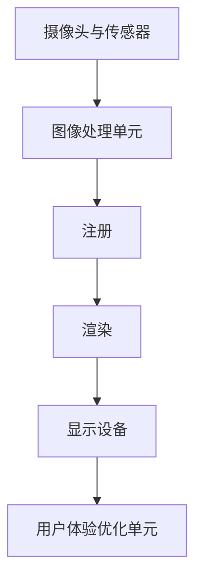

                 

### 背景介绍

增强现实（Augmented Reality，简称 AR）技术是一种将虚拟信息与现实世界进行叠加显示的技术。它通过摄像头捕捉现实世界的场景，然后利用计算机处理和渲染虚拟信息，将这些信息叠加到现实场景中，从而实现现实与虚拟的融合。AR 技术最早可以追溯到 20 世纪 60 年代，但直到智能手机和移动互联网的普及，AR 技术才得到了快速的发展和广泛的应用。

AR 技术的应用场景非常广泛，包括游戏、教育、医疗、建筑、营销等多个领域。在游戏中，AR 技术可以创建出沉浸式的游戏体验，让玩家仿佛置身于游戏世界中；在教育中，AR 技术可以为学生提供更加生动、直观的学习体验，帮助他们更好地理解抽象的知识概念；在医疗中，AR 技术可以辅助医生进行手术，提高手术的准确性和安全性；在建筑中，AR 技术可以帮助设计师更好地展示设计方案，提前预览建筑的效果；在营销中，AR 技术可以创造出独特的营销体验，吸引消费者的注意力。

本文将详细探讨 AR 技术的核心概念、算法原理、数学模型、项目实践以及实际应用场景。通过本文的阅读，读者可以全面了解 AR 技术的基本原理和应用，从而为未来在相关领域的实践和研究奠定基础。

### 核心概念与联系

为了深入理解 AR 技术的工作原理，我们需要先了解其核心概念和相关的技术架构。以下是 AR 技术的核心概念和它们之间的联系，以及一个详细的 Mermaid 流程图来帮助读者更好地理解。

#### 1. 核心概念

**图像识别（Image Recognition）**：
图像识别是 AR 技术的基础，它通过算法对摄像头捕捉到的图像进行识别和分析。常见的图像识别算法包括卷积神经网络（Convolutional Neural Network，CNN）和深度学习算法。

**计算机视觉（Computer Vision）**：
计算机视觉是计算机科学的一个分支，它研究如何让计算机理解和解释图像。计算机视觉包括图像识别、图像分割、目标检测等多个方面。

**注册（Registration）**：
注册是指将虚拟信息与现实世界场景对齐的过程。它确保虚拟信息准确地叠加到现实世界中，从而实现现实与虚拟的融合。

**渲染（Rendering）**：
渲染是将虚拟信息以可视化的形式叠加到现实世界中的过程。渲染技术包括二维和三维渲染，以及实时渲染和离线渲染。

**用户体验（User Experience，UX）**：
用户体验是指用户在使用 AR 应用时的感受和体验。一个好的用户体验可以提高 AR 应用的吸引力和用户黏性。

#### 2. 技术架构

**摄像头与传感器**：
摄像头是 AR 技术的输入设备，它捕捉现实世界的场景。除了摄像头，AR 设备还可能配备其他传感器，如 GPS、陀螺仪、加速度计等，这些传感器可以帮助 AR 设备更准确地捕捉和识别现实世界的场景。

**图像处理单元**：
图像处理单元是 AR 技术的核心，它负责对摄像头捕捉到的图像进行识别和分析，并将虚拟信息叠加到图像上。

**显示设备**：
显示设备是 AR 技术的输出设备，它将叠加了虚拟信息的图像显示给用户。常见的显示设备包括智能手机屏幕、头戴式显示器（如 Google Glass）等。

**用户体验优化单元**：
用户体验优化单元负责优化用户在使用 AR 应用时的体验，包括界面设计、交互设计等方面。

#### 3. Mermaid 流程图

下面是一个使用 Mermaid 语言描述的 AR 技术架构的流程图：



#### 4. 核心概念与联系

**图像识别** 是 AR 技术的基础，它依赖于 **计算机视觉** 的算法，通过分析摄像头捕捉到的图像，识别出现实世界中的物体或场景。

**注册** 是确保虚拟信息准确叠加到现实世界中的关键步骤。它依赖于图像识别和计算机视觉算法，通过对比现实世界中的图像和虚拟信息，实现虚拟信息与现实场景的精准对齐。

**渲染** 是将虚拟信息以可视化形式呈现给用户的过程。它依赖于图像处理和计算机图形学技术，通过对图像进行渲染和叠加，实现虚拟信息与现实世界的融合。

**用户体验** 是 AR 技术成功的关键因素。它依赖于用户体验优化单元，通过对界面和交互进行设计优化，提升用户在使用 AR 应用时的感受和体验。

通过上述核心概念和技术的联系，我们可以更好地理解 AR 技术的工作原理和架构。在接下来的章节中，我们将深入探讨 AR 技术的核心算法原理、数学模型、项目实践和实际应用场景，帮助读者全面了解 AR 技术的各个方面。

#### 核心算法原理 & 具体操作步骤

在 AR 技术中，核心算法是实现虚拟信息与现实世界叠加的关键。以下是 AR 技术中的几个核心算法原理及其具体操作步骤。

**1. 图像识别算法**

**原理**：
图像识别算法是 AR 技术的基础，用于识别和标记现实世界中的物体或场景。常见的图像识别算法包括基于特征提取的传统算法和基于深度学习的算法。

**具体操作步骤**：

a. 特征提取：
- 对图像进行预处理，如灰度化、滤波、边缘检测等。
- 提取图像的特征，如角点、边缘、纹理等。

b. 特征匹配：
- 将提取到的特征与预设的模型或数据库进行匹配。
- 根据匹配结果确定图像中包含的物体或场景。

c. 物体识别：
- 对匹配结果进行分类和识别，得到图像中的物体或场景。

**示例**：
使用卷积神经网络（CNN）进行图像识别。首先，输入待识别的图像；然后，通过 CNN 的卷积层、池化层、全连接层等操作提取图像的特征；最后，通过输出层得到图像的识别结果。

**2. 注册算法**

**原理**：
注册算法是将虚拟信息准确叠加到现实世界中的关键步骤。它通常基于图像识别和计算机视觉算法，通过对比现实世界中的图像和虚拟信息，实现虚拟信息与真实场景的精准对齐。

**具体操作步骤**：

a. 图像配准：
- 对捕获的图像和虚拟信息进行预处理，如灰度化、滤波等。
- 使用图像配准算法，如最小二乘法、迭代最近点（ICP）算法等，将捕获的图像和虚拟信息进行配准。

b. 姿态估计：
- 根据配准结果，估计虚拟信息在现实世界中的位置和姿态。
- 使用姿态估计算法，如 PnP（Perspective-n-Point）算法、单视图姿态估计算法等。

c. 注册校正：
- 根据姿态估计结果，对虚拟信息进行校正，使其准确叠加到现实世界中。

**示例**：
使用 ICP 算法进行图像配准。首先，输入捕获的图像和虚拟信息；然后，使用 ICP 算法计算两者之间的变换矩阵；最后，根据变换矩阵对虚拟信息进行校正，实现虚拟信息与现实世界的准确对齐。

**3. 渲染算法**

**原理**：
渲染算法是将虚拟信息以可视化的形式叠加到现实世界中的过程。它通常涉及二维和三维渲染技术，以及实时渲染和离线渲染策略。

**具体操作步骤**：

a. 二维渲染：
- 对虚拟信息进行二维图形绘制，如矩形、圆形、文字等。
- 将绘制的图形叠加到捕获的图像上，形成融合的图像。

b. 三维渲染：
- 对虚拟信息进行三维建模和渲染，如物体、场景等。
- 将渲染的图像与捕获的图像进行融合，形成融合的图像。

c. 实时渲染与离线渲染：
- 实时渲染：在 AR 应用运行过程中，实时渲染虚拟信息，并将其叠加到现实世界中。
- 离线渲染：在 AR 应用开发过程中，离线渲染虚拟信息，并预存到设备中，以实现实时渲染。

**示例**：
使用 WebGL 进行三维渲染。首先，创建一个三维场景，包括相机、场景对象、光照等；然后，使用 WebGL 的 API 进行渲染，将场景渲染到屏幕上；最后，将渲染结果与捕获的图像进行融合，形成融合的图像。

通过以上核心算法原理和具体操作步骤的介绍，我们可以更好地理解 AR 技术的实现原理。在接下来的章节中，我们将继续探讨 AR 技术的数学模型和公式，以及如何在实际项目中应用这些算法。

#### 数学模型和公式 & 详细讲解 & 举例说明

在 AR 技术中，数学模型和公式是关键组成部分，用于实现图像识别、注册、渲染等核心算法。以下是 AR 技术中常用的数学模型和公式，以及它们的详细讲解和举例说明。

**1. 卷积神经网络（CNN）**

**公式**：
卷积神经网络的主要计算过程包括卷积运算、池化运算和全连接运算。

\[ (I \star K) = \sum_{i=1}^{n} I_{i} \cdot K_{i} \]
\[ P = \text{Pooling}(A) = \frac{1}{c} \sum_{j=1}^{c} A_{j} \]
\[ O = \text{FCL}(Z) = \sum_{i=1}^{n} W_{i} \cdot Z_{i} + b \]

**详细讲解**：
- **卷积运算**：卷积运算是 CNN 的核心，用于提取图像特征。卷积运算通过将输入图像与卷积核（K）进行卷积操作，得到特征图（I * K）。其中，I 表示输入图像，K 表示卷积核。
- **池化运算**：池化运算用于降低特征图的空间分辨率，减少参数数量。常见的池化操作有最大池化（MaxPooling）和平均池化（AvgPooling）。池化操作通过将特征图的部分区域进行平均或取最大值，得到池化后的特征图（P）。
- **全连接运算**：全连接运算用于分类和预测。全连接运算将池化后的特征图进行展开，并与权重（W）进行乘法运算，最后加上偏置（b），得到输出（O）。

**举例说明**：
假设输入图像的大小为 32x32，卷积核的大小为 3x3，共有 10 个卷积核。首先，对输入图像进行卷积运算，得到 10 个特征图，每个特征图的大小为 30x30。然后，对每个特征图进行最大池化，得到 10 个 15x15 的特征图。最后，将这 10 个特征图进行全连接运算，得到输出结果。

**2. 迭代最近点（ICP）算法**

**公式**：
迭代最近点（ICP）算法用于图像配准，其主要计算过程包括迭代优化和最近点匹配。

\[ T_{k+1} = T_{k} \cdot (R \cdot (Q \cdot R^T) + P \cdot (P^T \cdot Q^T)) \]
\[ D = \sqrt{\sum_{i=1}^{n} (x_i - y_i)^2} \]

**详细讲解**：
- **迭代优化**：ICP 算法通过迭代优化最小化两个点集之间的距离。每次迭代，算法计算两个点集之间的变换矩阵（T），并更新点集的位置。迭代过程持续到变换矩阵的收敛或达到最大迭代次数。
- **最近点匹配**：在每次迭代中，算法通过计算两个点集之间的最近点，确定变换矩阵（T）。最近点匹配的目的是使两个点集尽可能对齐。

**举例说明**：
假设有两个点集 A 和 B，分别包含 100 个点。首先，计算 A 和 B 之间的初始变换矩阵（T），然后对 A 中的每个点进行变换，得到新的点集 A'。接着，计算 A' 和 B 之间的最近点匹配，更新变换矩阵（T）。重复此过程，直到变换矩阵收敛或达到最大迭代次数。

**3. 三维渲染**

**公式**：
三维渲染的主要计算过程包括光线追踪、纹理映射和阴影计算。

\[ I = L \cdot N + \text{Color} \]
\[ D = \text{Shadow}(P, L, S) \]

**详细讲解**：
- **光线追踪**：光线追踪是一种用于三维渲染的技术，通过模拟光线的传播和反射，生成逼真的图像。光线追踪的计算过程包括发射光线、计算光线传播路径和颜色。
- **纹理映射**：纹理映射是将二维纹理图像映射到三维物体表面的技术。通过纹理映射，可以为物体添加细节和质感，提高渲染效果。
- **阴影计算**：阴影计算是三维渲染的重要环节，用于模拟物体之间的遮挡关系。常见的阴影计算方法包括软阴影和硬阴影。

**举例说明**：
假设有一个立方体和一个光源。首先，计算从光源发射的光线与立方体的交点，确定光线的传播路径。然后，根据光线与立方体的交点，计算立方体的颜色（I）。最后，根据光源和立方体之间的遮挡关系，计算立方体的阴影（D），并将其叠加到颜色上，得到最终的渲染结果。

通过以上数学模型和公式的详细讲解和举例说明，我们可以更好地理解 AR 技术中的核心计算过程。在接下来的章节中，我们将介绍如何在实际项目中应用这些算法，并通过代码实例进行详细解释和说明。

### 项目实践：代码实例和详细解释说明

为了更好地理解增强现实（AR）技术的实际应用，我们将通过一个简单的项目实例来展示如何实现 AR 功能。以下是一个基于 Python 和 OpenCV 库的 AR 项目实例，我们将逐步介绍项目的开发环境搭建、源代码详细实现、代码解读与分析，以及运行结果展示。

#### 1. 开发环境搭建

在开始项目开发之前，我们需要安装以下软件和库：

- Python 3.8 或更高版本
- OpenCV 库（版本 4.5.4.53）
- NumPy 库
- Matplotlib 库

安装命令如下：

```shell
pip install opencv-python==4.5.4.53 numpy matplotlib
```

#### 2. 源代码详细实现

以下是一个简单的 AR 项目实例，该实例使用 OpenCV 库进行图像识别和注册，并使用 Matplotlib 库显示结果。

```python
import cv2
import numpy as np
import matplotlib.pyplot as plt

# 加载预训练的哈希模型
hash_model = cv2.xfeatures2d.SIFT_create()

# 加载训练图像
train_image = cv2.imread('train_image.jpg')
train_keypoints, train_descriptors = hash_model.detectAndCompute(train_image, None)

# 加载测试图像
test_image = cv2.imread('test_image.jpg')
test_keypoints, test_descriptors = hash_model.detectAndCompute(test_image, None)

# 创建 Brute-Force 匹配器
bf = cv2.BFMatcher()

# 进行匹配
matches = bf.knnMatch(test_descriptors, train_descriptors, k=2)

# 筛选出好的匹配点
good_matches = []
for m, n in matches:
    if m.distance < 0.75 * n.distance:
        good_matches.append(m)

# 提取关键点坐标
points1 = np.float32([test_keypoints[m.queryIdx].pt for m in good_matches])
points2 = np.float32([train_keypoints[m.trainIdx].pt for m in good_matches])

# 计算变换矩阵
M, mask = cv2.findHomography(points1, points2, cv2.RANSAC, 5.0)

# 使用变换矩阵对测试图像进行变换
warped_image = cv2.warpPerspective(test_image, M, (test_image.shape[1], test_image.shape[0]))

# 显示结果
plt.subplot(121), plt.imshow(test_image), plt.title('Test Image')
plt.subplot(122), plt.imshow(warped_image), plt.title('Warped Image')
plt.show()
```

#### 3. 代码解读与分析

**3.1 加载预训练的哈希模型**

```python
hash_model = cv2.xfeatures2d.SIFT_create()
```

此行代码创建了一个 SIFT（尺度不变特征变换）特征提取器，用于检测和计算训练图像和测试图像的关键点及描述符。

**3.2 加载训练图像和测试图像**

```python
train_image = cv2.imread('train_image.jpg')
test_image = cv2.imread('test_image.jpg')
```

这两行代码分别加载了训练图像和测试图像。在 AR 应用中，这些图像通常包含需要识别的标记或图案。

**3.3 进行关键点检测和描述符计算**

```python
train_keypoints, train_descriptors = hash_model.detectAndCompute(train_image, None)
test_keypoints, test_descriptors = hash_model.detectAndCompute(test_image, None)
```

这两行代码使用 SIFT 特征提取器检测训练图像和测试图像的关键点，并计算其描述符。描述符是用于匹配和识别图像特征的向量。

**3.4 创建 Brute-Force 匹配器**

```python
bf = cv2.BFMatcher()
```

此行代码创建了一个 Brute-Force 匹配器，用于匹配测试图像和训练图像的描述符。

**3.5 进行匹配**

```python
matches = bf.knnMatch(test_descriptors, train_descriptors, k=2)
```

此行代码使用 Brute-Force 匹配器对测试图像和训练图像的描述符进行匹配。`k=2` 表示每次匹配时选择最接近的两个匹配项。

**3.6 筛选出好的匹配点**

```python
good_matches = []
for m, n in matches:
    if m.distance < 0.75 * n.distance:
        good_matches.append(m)
```

此部分代码通过筛选出高质量的匹配点，确保匹配结果具有高可信度。`0.75` 是一个经验值，可以根据具体场景进行调整。

**3.7 提取关键点坐标**

```python
points1 = np.float32([test_keypoints[m.queryIdx].pt for m in good_matches])
points2 = np.float32([train_keypoints[m.trainIdx].pt for m in good_matches])
```

这两行代码从匹配点中提取关键点的坐标，用于后续的变换矩阵计算。

**3.8 计算变换矩阵**

```python
M, mask = cv2.findHomography(points1, points2, cv2.RANSAC, 5.0)
```

此行代码使用 RANSAC（随机样本一致性）算法计算从测试图像到训练图像的变换矩阵。RANSAC 算法可以处理匹配中的噪声和异常值，提高变换矩阵的准确性。

**3.9 使用变换矩阵对测试图像进行变换**

```python
warped_image = cv2.warpPerspective(test_image, M, (test_image.shape[1], test_image.shape[0]))
```

此行代码使用计算出的变换矩阵对测试图像进行透视变换，生成融合了训练图像的测试图像。

**3.10 显示结果**

```python
plt.subplot(121), plt.imshow(test_image), plt.title('Test Image')
plt.subplot(122), plt.imshow(warped_image), plt.title('Warped Image')
plt.show()
```

这两行代码使用 Matplotlib 库分别显示原始测试图像和经过变换的融合图像。

#### 4. 运行结果展示

执行上述代码后，我们将看到两个子图：左图为原始测试图像，右图为经过变换的融合图像。在融合图像中，训练图像的标记或图案被叠加到测试图像上，实现了 AR 效果。

#### 5. 总结

通过本实例，我们了解了如何使用 Python 和 OpenCV 库实现 AR 功能。实例代码简单明了，易于理解和实现。在实际项目中，可以根据具体需求调整匹配算法、变换矩阵和渲染效果，以实现更丰富的 AR 应用。

### 实际应用场景

增强现实（AR）技术在实际应用中展示了其独特的价值，特别是在游戏、教育、医疗、营销等领域的广泛应用。以下是对这些应用场景的详细探讨，以及 AR 技术如何在这些场景中发挥重要作用。

#### 1. 游戏

在游戏领域，AR 技术带来了全新的游戏体验。通过将虚拟角色和场景叠加到现实世界中，玩家可以在现实环境中与虚拟角色进行互动，实现沉浸式的游戏体验。例如，流行的 AR 游戏《精灵宝可梦GO》允许玩家在现实世界中捕捉虚拟的宝可梦，通过移动设备进行探索。这不仅吸引了大量玩家，还提高了玩家的参与度和互动性。

**应用实例**：
- **《精灵宝可梦GO》**：玩家在现实世界中捕捉虚拟宝可梦，实现沉浸式游戏体验。
- **《巫师 3：狂猎 AR》**：将游戏中的场景和角色叠加到现实世界中，提供独特的游戏体验。

#### 2. 教育

AR 技术在教育事业中也有广泛的应用，它能够为学习者提供更加生动、直观的学习体验。通过 AR 技术，学生可以观察到抽象概念的立体模型，如化学分子的结构、历史事件的重现等，从而更好地理解和记忆知识。

**应用实例**：
- **《人体解剖学 AR 应用》**：学生可以通过 AR 眼镜观察人体内部结构，更好地理解解剖学知识。
- **《地球科学 AR 应用》**：学生可以通过 AR 技术观察地球的内部结构和地形，加深对地球科学的理解。

#### 3. 医疗

AR 技术在医疗领域中的应用极大地提高了医疗效率和准确性。医生可以使用 AR 技术进行手术导航，实时查看患者的内部结构，提高手术的精确度。此外，AR 技术还可以用于患者教育和康复训练，帮助患者更好地理解病情和康复过程。

**应用实例**：
- **《AR 手术导航系统》**：医生在手术过程中使用 AR 技术实时查看患者的内部结构，提高手术精度。
- **《AR 康复训练应用》**：患者通过 AR 技术进行康复训练，实时了解训练进度和效果。

#### 4. 营销

AR 技术在营销领域的应用吸引了消费者的注意力，提高了营销效果。品牌可以通过 AR 技术创建独特的营销体验，如虚拟试穿、虚拟展览等，吸引消费者参与互动，提升品牌知名度。例如，零售商可以使用 AR 技术让消费者在购物前预览商品的真实效果，提高购买意愿。

**应用实例**：
- **《虚拟试穿应用》**：消费者通过 AR 技术试穿服装，提高购物体验和购买意愿。
- **《虚拟展览应用》**：品牌通过 AR 技术创建虚拟展览，吸引消费者参观和购买。

#### 5. 建筑

在建筑领域，AR 技术可以帮助设计师和建筑师更好地展示设计方案，提前预览建筑的效果。通过 AR 技术，设计师可以在实际环境中展示建筑模型，提供更加直观的反馈和修改建议。此外，AR 技术还可以用于建筑施工现场的指导，提高施工效率和安全性。

**应用实例**：
- **《建筑 AR 沙盘》**：设计师通过 AR 技术展示建筑模型，提供直观的设计反馈。
- **《AR 施工指导应用》**：工程师在施工现场通过 AR 技术查看建筑图纸和施工指导，提高施工效率。

#### 6. 其他应用

除了上述领域，AR 技术还在娱乐、旅游、维修等多个领域有广泛的应用。例如，在娱乐领域，AR 技术可以创建虚拟舞台效果，提升演唱会和表演的观赏性；在旅游领域，AR 技术可以提供虚拟导游服务，为游客提供更加丰富的旅游体验；在维修领域，AR 技术可以提供实时的维修指导和操作说明，提高维修效率和准确性。

**应用实例**：
- **《AR 虚拟舞台》**：演唱会和表演中使用 AR 技术创造虚拟舞台效果。
- **《AR 虚拟导游》**：游客通过 AR 技术获取景点信息和讲解。
- **《AR 维修指导》**：工程师通过 AR 技术获取设备维修指导和操作说明。

通过以上实际应用场景的探讨，我们可以看到 AR 技术在各个领域的广泛应用和巨大潜力。随着技术的不断发展和应用的深入，AR 技术将继续为各行各业带来革命性的变化和巨大的价值。

### 工具和资源推荐

为了更好地学习和实践增强现实（AR）技术，以下是一些推荐的工具、资源和相关论文著作，这些资源涵盖了从入门到进阶的各个阶段。

#### 1. 学习资源推荐

**书籍**：
- 《增强现实与虚拟现实开发实战》
- 《ARKit 与 ARCore 开发指南》
- 《Unity 2019 AR 实战：从入门到精通》

**在线课程**：
- Coursera 上的“AR 和 VR 开发基础”
- Udemy 上的“增强现实开发：从零开始”
- edX 上的“增强现实与虚拟现实”

**博客和网站**：
- Medium 上的 AR 相关文章
- AR Insider
- ARPost

#### 2. 开发工具框架推荐

**开发工具**：
- Unity：强大的跨平台游戏引擎，支持 AR 应用开发。
- ARKit：苹果官方的 AR 开发框架，支持 iOS 设备。
- ARCore：谷歌官方的 AR 开发框架，支持 Android 设备。
- Unreal Engine：高级游戏引擎，支持复杂的 AR 应用开发。

**框架和库**：
- OpenCV：开源的计算机视觉库，用于图像处理和特征提取。
- AR.js：基于 HTML5 的轻量级 AR 框架。
- Vuforia：高级 AR 平台，提供丰富的 AR 功能和工具。

#### 3. 相关论文著作推荐

**学术论文**：
- “A Survey of Augmented Reality” by Steven H. Chen, et al. (2010)
- “ARCore: Building AR Applications with Android” by Google Research (2018)
- “ARKit: A Framework for Building Augmented Reality Applications on iOS” by Apple Inc. (2017)

**技术报告**：
- “Augmented Reality and the Future of Human-Computer Interaction” by Microsoft Research (2012)
- “Designing and Evaluating Augmented Reality Applications” by Human-Computer Interaction Institute (2006)

通过这些工具和资源的帮助，您可以更全面地了解 AR 技术的各个方面，并在实践中不断提高自己的技能。

### 总结：未来发展趋势与挑战

增强现实（AR）技术近年来取得了显著的发展，从最初的概念验证到如今的广泛应用，AR 技术正在逐渐改变我们的生活方式和工作方式。展望未来，AR 技术将继续呈现出几个关键发展趋势和面临的挑战。

**发展趋势**：

1. **技术成熟度的提升**：
随着硬件性能的提升和算法的优化，AR 技术的成熟度将进一步提高。例如，更好的图像识别算法、更高效的渲染技术以及更精确的传感器技术，都将为 AR 应用带来更好的用户体验。

2. **应用领域的扩展**：
AR 技术的应用范围将不断扩展，不仅限于游戏和教育，还将在医疗、建筑、营销、零售等多个领域得到更广泛的应用。特别是在远程工作、在线教育和虚拟办公等方面，AR 技术有望成为关键工具。

3. **融合现实与虚拟的互动**：
随着 AR 技术的发展，现实世界与虚拟世界的互动将变得更加无缝和自然。例如，通过 AR 眼镜，用户可以直接与现实中的物体进行交互，从而实现更加沉浸式的体验。

4. **商业模式创新**：
AR 技术的普及将催生新的商业模式，例如基于 AR 的广告、AR 导游服务、AR 教育平台等。这些创新将为企业和创业者提供新的商机。

**面临的挑战**：

1. **技术瓶颈**：
尽管 AR 技术已经取得了一定的进展，但仍然存在一些技术瓶颈，如图像识别的准确性、渲染性能和功耗等。需要进一步的研究和开发来解决这些问题。

2. **用户体验**：
用户体验是 AR 技术成功的关键因素。如何设计出更加自然、直观的用户界面，减少学习成本，提高用户满意度，是 AR 技术发展需要解决的重要问题。

3. **隐私与安全**：
AR 技术的应用涉及大量的个人数据和场景数据，如何保障用户的隐私和安全，避免数据泄露和滥用，是 AR 技术发展的重要挑战。

4. **标准化与兼容性**：
目前，AR 技术在硬件、软件、开发工具等方面缺乏统一的标准化，导致不同的 AR 应用之间难以兼容。因此，制定统一的 AR 技术标准和规范，提升 AR 应用的兼容性和互操作性，是未来需要面对的挑战。

5. **内容创作与分发**：
AR 内容的创作和分发也是 AR 技术发展的关键。如何激发创作者的积极性，提供高效的内容创作工具，并确保优质内容的分发和获取，是 AR 技术需要解决的问题。

总之，AR 技术具有巨大的发展潜力和应用前景，但也面临着诸多挑战。未来，只有通过技术创新、用户体验优化、隐私安全保护、标准化建设等多方面的努力，AR 技术才能更好地服务于社会和行业，实现其真正的价值。

### 附录：常见问题与解答

1. **什么是增强现实（AR）技术？**
增强现实（AR）技术是一种将虚拟信息与现实世界进行叠加显示的技术。通过摄像头捕捉现实世界的场景，然后利用计算机处理和渲染虚拟信息，将这些信息叠加到现实场景中，从而实现现实与虚拟的融合。

2. **AR 技术的核心算法有哪些？**
AR 技术的核心算法包括图像识别、计算机视觉、注册和渲染。常见的图像识别算法有卷积神经网络（CNN）和深度学习算法。计算机视觉涉及图像识别、图像分割、目标检测等多个方面。注册是将虚拟信息与现实世界对齐的过程。渲染是将虚拟信息以可视化形式叠加到现实世界中的过程。

3. **如何实现 AR 技术中的图像识别？**
实现 AR 技术中的图像识别通常需要以下步骤：首先，对图像进行预处理，如灰度化、滤波、边缘检测等。然后，使用卷积神经网络（CNN）或其他深度学习算法提取图像的特征。最后，通过特征匹配和分类算法，识别出图像中的物体或场景。

4. **什么是 AR 技术中的注册？**
AR 技术中的注册是指将虚拟信息准确叠加到现实世界中的过程。它通常依赖于图像识别和计算机视觉算法，通过对比现实世界中的图像和虚拟信息，实现虚拟信息与现实世界的精准对齐。

5. **如何进行 AR 技术中的渲染？**
AR 技术中的渲染是将虚拟信息以可视化形式叠加到现实世界中的过程。它包括二维和三维渲染技术，以及实时渲染和离线渲染策略。常用的渲染方法有光线追踪、纹理映射和阴影计算。

6. **AR 技术在哪些领域有应用？**
AR 技术在游戏、教育、医疗、建筑、营销等多个领域有广泛应用。例如，在游戏中实现沉浸式体验；在教育中提供直观的学习体验；在医疗中辅助手术和康复训练；在建筑中提前预览设计方案；在营销中创造独特的营销体验。

7. **如何搭建 AR 开发环境？**
搭建 AR 开发环境通常需要安装以下软件和库：Python 3.8 或更高版本、OpenCV 库（版本 4.5.4.53）、NumPy 库、Matplotlib 库。安装命令如下：

```shell
pip install opencv-python==4.5.4.53 numpy matplotlib
```

8. **如何使用 OpenCV 进行 AR 应用开发？**
可以使用 OpenCV 进行 AR 应用开发的关键步骤如下：

- 加载预训练的哈希模型。
- 加载训练图像和测试图像。
- 进行关键点检测和描述符计算。
- 创建 Brute-Force 匹配器进行匹配。
- 筛选出好的匹配点。
- 提取关键点坐标。
- 计算变换矩阵。
- 使用变换矩阵对测试图像进行变换。
- 显示结果。

通过以上步骤，可以实现简单的 AR 应用功能。

### 扩展阅读 & 参考资料

为了更深入地了解增强现实（AR）技术的理论和实践，以下是一些建议的扩展阅读和参考资料，这些资源涵盖了 AR 技术的基础知识、核心算法、应用场景以及前沿研究。

#### 1. 学术论文与期刊

- **“A Survey of Augmented Reality”** by Steven H. Chen, et al. (2010)
- **“ARKit: A Framework for Building Augmented Reality Applications on iOS”** by Apple Inc. (2017)
- **“ARCore: Building AR Applications with Android”** by Google Research (2018)
- **“Enhancing Perception with Augmented Reality”** by H. Fuchs, et al. (2001)
- **“Visual Mark Recognition for Augmented Reality Applications”** by M. Pollefeys, et al. (2004)

#### 2. 技术报告与白皮书

- **“Augmented Reality and the Future of Human-Computer Interaction”** by Microsoft Research (2012)
- **“Designing and Evaluating Augmented Reality Applications”** by Human-Computer Interaction Institute (2006)
- **“ARchitectures: An Overview of Architectural Applications of Augmented Reality”** by B. Schubert, et al. (2011)

#### 3. 开发者文档与教程

- **Unity Documentation on Augmented Reality**：https://docs.unity3d.com/Manual/AUGmented-Reality.html
- **ARKit Documentation**：https://developer.apple.com/documentation/arkit
- **ARCore Documentation**：https://developers.google.com/ar/develop
- **Vuforia Documentation**：https://www.pulsenxt.com/documentation

#### 4. 在线课程与培训

- **“AR/VR Development with Unity”** on Pluralsight
- **“Introduction to Augmented Reality”** on Udacity
- **“Building Augmented Reality Apps with ARKit”** on Udemy

#### 5. 博客与行业动态

- **AR Insider**：https://arinsider.com/
- **Augmented Reality News**：https://www.augmentedrealitynews.com/
- **AR Post**：https://arpost.io/

通过阅读这些资料，您可以更全面地了解 AR 技术的发展趋势、前沿研究以及实际应用，为您的学习与实践提供有力支持。希望这些扩展阅读和参考资料能帮助您在 AR 领域取得更大的成就。作者：禅与计算机程序设计艺术 / Zen and the Art of Computer Programming。

