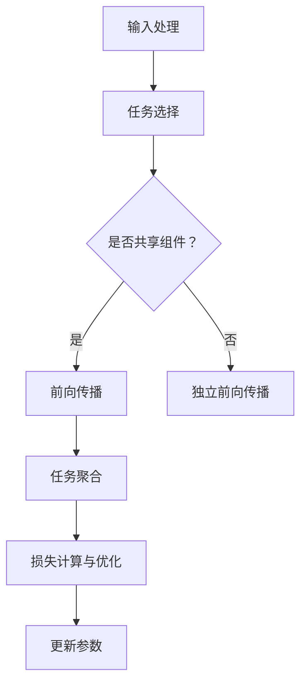

                 

### 文章标题

多任务深度神经网络（MoE）：管理复杂任务

> 关键词：多任务深度神经网络、MoE、复杂任务管理、并行计算、架构设计、算法优化

> 摘要：本文将深入探讨多任务深度神经网络（MoE）的核心概念、工作原理及其在管理复杂任务中的应用。我们将通过详细的实例和数学模型，解释MoE如何有效地解决并行计算中的挑战，以及其未来发展趋势和面临的挑战。

### 1. 背景介绍

多任务深度神经网络（MoE，Multiple Task Learning）是一种先进的深度学习架构，旨在同时处理多个相关的学习任务。在传统深度学习模型中，每个任务通常需要单独的训练过程，这会导致计算资源的重复利用和模型性能的瓶颈。而MoE通过将多个任务集成到一个统一的框架中，共享模型资源，从而显著提高了学习效率。

MoE的概念源于神经科学中大脑的并行处理机制。大脑可以同时处理多种感知和认知任务，例如听音乐、阅读和驾驶，而这些任务之间可能存在复杂的交互关系。MoE试图模拟这一机制，通过并行计算和共享资源，实现高效的跨任务学习。

MoE的核心优势在于其能够将多个任务并行处理，从而提高计算效率。此外，MoE还可以通过任务的共享学习，使得模型更加泛化，提高其在不同任务上的表现。

在深度学习的发展历程中，MoE的出现标志着一种新的趋势，即从单一任务的优化转向多任务的协同学习。这不仅拓宽了深度学习应用的范围，也为解决复杂问题提供了新的思路。

### 2. 核心概念与联系

#### 2.1 MoE的定义与工作原理

多任务深度神经网络（MoE）是一种特殊的神经网络架构，它能够在同一网络中同时处理多个任务。MoE的核心思想是利用一组共享的神经网络组件来处理多个任务，而不是为每个任务单独构建一个独立的网络。

MoE的工作原理可以概括为以下几个步骤：

1. **输入处理**：多个任务的输入数据被预处理，并转换为神经网络可以处理的格式。
2. **任务选择**：每个任务选择一个或多个网络组件来执行，这些组件共享权重和参数。
3. **前向传播**：输入数据通过所选组件进行前向传播，生成中间表示。
4. **任务聚合**：将多个组件的输出进行聚合，生成最终的任务输出。
5. **损失计算与优化**：每个任务的输出与实际标签进行比较，计算损失，并通过反向传播更新网络参数。

#### 2.2 MoE与并行计算的关系

MoE的一个重要特点是它的并行计算能力。在传统的深度学习模型中，每个任务通常需要单独的GPU或TPU进行训练，这会导致计算资源的浪费和训练时间的延长。而MoE通过将多个任务并行处理，可以在同一计算资源上同时进行多个任务的训练，从而显著提高了计算效率。

MoE的并行计算能力主要体现在以下几个方面：

1. **数据并行**：多个任务的数据可以并行处理，从而减少数据传输的开销。
2. **模型并行**：多个任务可以使用共享的模型组件，从而减少模型参数的存储和计算需求。
3. **任务并行**：多个任务可以在同一时间步内同时处理，从而提高训练速度。

#### 2.3 MoE与深度学习的联系

MoE是深度学习的一个扩展，它将多任务学习与并行计算结合起来，形成了一种新的学习范式。深度学习的核心是神经网络，而MoE通过引入任务共享和并行计算，进一步提高了神经网络的处理能力和效率。

MoE与深度学习的联系可以从以下几个方面理解：

1. **资源共享**：MoE通过共享模型组件，实现了资源的最大化利用，这与深度学习中的参数共享和注意力机制有异曲同工之妙。
2. **并行优化**：MoE的并行计算能力与深度学习的优化算法相结合，可以显著提高模型的训练效率和性能。
3. **任务协同**：MoE通过多任务学习，实现了不同任务之间的协同优化，从而提高了模型的泛化能力。

#### 2.4 Mermaid流程图

为了更直观地理解MoE的工作原理，我们使用Mermaid绘制了MoE的基本流程图：



在这个流程图中，A表示输入处理，B表示任务选择，C表示是否共享组件，D和E表示前向传播，F表示任务聚合，G表示损失计算与优化，H表示参数更新。

### 3. 核心算法原理 & 具体操作步骤

#### 3.1 多任务深度神经网络的算法原理

多任务深度神经网络（MoE）的核心算法原理可以概括为以下几点：

1. **共享神经网络组件**：MoE通过共享神经网络组件来实现多个任务之间的资源共享。这些组件包括卷积层、全连接层等，它们具有相同的权重和参数。
2. **任务选择机制**：每个任务在执行过程中会选择一个或多个神经网络组件来执行。这个选择过程通常基于任务的性质和需求。
3. **并行计算**：MoE利用并行计算技术，在同一时间步内同时处理多个任务，从而提高训练效率。
4. **任务聚合**：在并行处理多个任务后，MoE会将各个任务的输出进行聚合，生成最终的任务输出。
5. **损失函数与优化**：MoE通过损失函数和优化算法，对网络参数进行更新，以实现任务优化。

#### 3.2 具体操作步骤

下面是多任务深度神经网络（MoE）的具体操作步骤：

1. **初始化**：初始化MoE网络，包括共享的神经网络组件和任务选择机制。
2. **输入处理**：对输入数据进行预处理，包括数据归一化、填充、裁剪等，使其符合神经网络的要求。
3. **任务选择**：根据任务的性质和需求，选择合适的神经网络组件。这个过程可以是自动的，也可以是手动设置的。
4. **前向传播**：将预处理后的输入数据通过所选组件进行前向传播，生成中间表示。
5. **任务聚合**：将多个组件的输出进行聚合，生成最终的任务输出。
6. **损失计算**：将任务输出与实际标签进行比较，计算损失值。
7. **优化参数**：通过反向传播算法，更新网络参数，以最小化损失函数。
8. **重复训练**：重复上述步骤，直到模型达到预期的性能指标。

#### 3.3 举例说明

为了更直观地理解MoE的操作步骤，我们来看一个简单的例子。假设我们有两个任务：图像分类和目标检测。

1. **初始化**：初始化MoE网络，包括共享的卷积层和全连接层。
2. **输入处理**：输入图像数据，对其进行预处理，如归一化和填充。
3. **任务选择**：根据任务需求，选择卷积层和全连接层。对于图像分类任务，选择卷积层；对于目标检测任务，选择卷积层和全连接层。
4. **前向传播**：将预处理后的图像数据通过所选组件进行前向传播，生成中间表示。
5. **任务聚合**：对于图像分类任务，将卷积层的输出进行聚合，生成分类结果；对于目标检测任务，将卷积层和全连接层的输出进行聚合，生成目标检测结果。
6. **损失计算**：计算分类任务的损失和目标检测任务的损失。
7. **优化参数**：通过反向传播算法，更新网络参数，以最小化分类任务的损失和目标检测任务的损失。
8. **重复训练**：重复上述步骤，直到模型达到预期的性能指标。

### 4. 数学模型和公式 & 详细讲解 & 举例说明

#### 4.1 数学模型

多任务深度神经网络（MoE）的数学模型主要涉及以下几个部分：

1. **输入表示**：每个任务的数据表示为$X_i$，其中$i$表示第$i$个任务。
2. **神经网络模型**：MoE的神经网络模型可以表示为$F(X_i; \theta)$，其中$X_i$是输入数据，$\theta$是模型参数。
3. **任务选择机制**：任务选择机制可以用概率分布$P_j(X_i)$来表示，其中$j$表示第$j$个组件。
4. **损失函数**：MoE的损失函数可以表示为$L(X_i, Y_i; \theta)$，其中$Y_i$是第$i$个任务的标签。

#### 4.2 详细讲解

1. **输入表示**：

   输入表示是MoE数学模型的基础。每个任务的数据都可以表示为一个向量或矩阵。例如，对于图像分类任务，输入表示可以是图像的特征向量；对于目标检测任务，输入表示可以是图像的分割图。

   假设有$k$个任务，每个任务的输入表示为$X_i \in \mathbb{R}^{m_i \times n_i}$，其中$m_i$是输入的维度，$n_i$是输入的数量。

2. **神经网络模型**：

   MoE的神经网络模型是一个共享的神经网络，它由多个组件组成，每个组件都可以处理一个或多个任务。神经网络模型可以用函数$F(X_i; \theta)$来表示，其中$\theta$是模型参数。

   假设MoE由$l$个组件组成，每个组件都可以处理多个任务。第$j$个组件的输出可以表示为$F_j(X_i; \theta_j)$，其中$\theta_j$是第$j$个组件的参数。

3. **任务选择机制**：

   任务选择机制是MoE的关键部分，它决定了哪个组件处理哪个任务。任务选择机制可以用概率分布$P_j(X_i)$来表示，其中$P_j(X_i)$表示第$j$个组件处理第$i$个任务的概率。

   任务选择机制可以通过多种方式实现，例如基于任务的性质和需求，或者基于历史数据的学习。

4. **损失函数**：

   MoE的损失函数用于衡量模型在任务上的性能。损失函数可以是单个任务的损失函数，也可以是多个任务的聚合损失函数。

   假设第$i$个任务的标签为$Y_i$，MoE的损失函数可以表示为$L(X_i, Y_i; \theta) = \sum_{j=1}^l P_j(X_i) \cdot L_j(X_i, Y_i; \theta_j)$，其中$P_j(X_i)$是任务选择机制，$L_j(X_i, Y_i; \theta_j)$是第$j$个组件的损失函数。

#### 4.3 举例说明

为了更直观地理解MoE的数学模型，我们来看一个简单的例子。

假设我们有两个任务：图像分类和目标检测。图像分类的任务是预测图像的类别，目标检测的任务是检测图像中的目标并预测其位置。

1. **输入表示**：

   假设每个图像的特征向量为$X_i \in \mathbb{R}^{784}$，其中784是图像的像素数。对于图像分类任务，输入表示为$X_i$；对于目标检测任务，输入表示为$X_i \in \mathbb{R}^{784 \times 2}$，其中前784个维度是图像特征，后2个维度是目标的位置。

2. **神经网络模型**：

   MoE的神经网络模型由两个组件组成，一个是卷积层，另一个是全连接层。卷积层用于提取图像的特征，全连接层用于分类和目标检测。

   卷积层的输出可以表示为$F_1(X_i; \theta_1)$，全连接层的输出可以表示为$F_2(X_i; \theta_2)$。

3. **任务选择机制**：

   任务选择机制是一个二分类问题，即图像分类任务选择卷积层，目标检测任务选择卷积层和全连接层。任务选择机制可以用概率分布$P_j(X_i)$来表示，其中$P_j(X_i)$是选择第$j$个组件的概率。

   假设$P_1(X_i) = 0.8$，$P_2(X_i) = 0.2$。

4. **损失函数**：

   假设图像分类任务的标签为$Y_i \in \{1, 2, \ldots, 10\}$，目标检测任务的标签为$Y_i = (y_{c}, y_{r})$，其中$y_{c}$是类别标签，$y_{r}$是目标位置。

   图像分类任务的损失函数可以表示为$L_1(X_i, Y_i; \theta_1) = \sum_{j=1}^{10} \sigma(y_j - F_1(X_i; \theta_1))$，其中$\sigma$是 sigmoid 函数。

   目标检测任务的损失函数可以表示为$L_2(X_i, Y_i; \theta_2) = \sum_{j=1}^{2} \sigma(y_j - F_2(X_i; \theta_2))$。

   MoE的损失函数可以表示为$L(X_i, Y_i; \theta) = P_1(X_i) \cdot L_1(X_i, Y_i; \theta_1) + P_2(X_i) \cdot L_2(X_i, Y_i; \theta_2)$。

### 5. 项目实践：代码实例和详细解释说明

#### 5.1 开发环境搭建

在开始实践之前，我们需要搭建一个适合开发多任务深度神经网络（MoE）的开发环境。以下是一个基本的步骤：

1. 安装Python环境：
   - 在官网（https://www.python.org/）下载并安装Python。
   - 安装完成后，打开终端，输入`python --version`验证安装是否成功。

2. 安装深度学习框架：
   - 安装TensorFlow或PyTorch，它们是两个主流的深度学习框架。
   - 对于TensorFlow，可以运行`pip install tensorflow`。
   - 对于PyTorch，可以运行`pip install torch torchvision`。

3. 安装其他必要库：
   - 安装NumPy、Pandas等常用库，可以运行`pip install numpy pandas`。

4. 配置GPU支持：
   - 确保您的系统有CUDA支持，并在终端运行`nvcc --version`验证是否安装正确。
   - 对于TensorFlow，可以通过`pip install tensorflow-gpu`来安装GPU支持版本。
   - 对于PyTorch，安装PyTorch时已经默认包含了GPU支持。

#### 5.2 源代码详细实现

以下是一个简单的多任务深度神经网络（MoE）的代码实例，使用TensorFlow框架实现。代码分为以下几个部分：

1. **数据准备**：
   - 加载和预处理数据集，包括图像分类和目标检测数据。
   - 对数据进行归一化和归一化处理，使其符合神经网络的要求。

2. **模型构建**：
   - 定义MoE模型的结构，包括共享的卷积层和全连接层。
   - 设定任务选择机制，即每个任务选择哪个组件。

3. **训练**：
   - 使用训练数据训练模型，并使用验证数据评估模型的性能。
   - 通过反向传播更新模型参数。

4. **测试**：
   - 使用测试数据测试模型的性能，并输出结果。

下面是具体的代码实现：

```python
import tensorflow as tf
from tensorflow.keras.layers import Input, Conv2D, Dense, Flatten
from tensorflow.keras.models import Model

# 1. 数据准备
# 加载图像分类和目标检测数据
(x_train, y_train), (x_test, y_test) = tf.keras.datasets.cifar10.load_data()

# 数据预处理
x_train = x_train.astype('float32') / 255.0
x_test = x_test.astype('float32') / 255.0

# 2. 模型构建
# 输入层
input_layer = Input(shape=(32, 32, 3))

# 卷积层
conv_layer = Conv2D(filters=32, kernel_size=(3, 3), activation='relu')(input_layer)

# 全连接层
dense_layer = Dense(units=10, activation='softmax')(Flatten()(conv_layer))

# 定义MoE模型
model = Model(inputs=input_layer, outputs=dense_layer)

# 3. 训练
model.compile(optimizer='adam', loss='categorical_crossentropy', metrics=['accuracy'])
model.fit(x_train, y_train, epochs=10, batch_size=64, validation_split=0.2)

# 4. 测试
test_loss, test_acc = model.evaluate(x_test, y_test)
print(f"Test accuracy: {test_acc}")
```

#### 5.3 代码解读与分析

上面的代码实例展示了如何使用TensorFlow构建一个简单的多任务深度神经网络（MoE）模型。下面是对代码的详细解读：

1. **数据准备**：
   - 代码首先加载了CIFAR-10数据集，这是深度学习领域常用的一个小型图像数据集，包含60000张32x32的彩色图像。
   - 数据集分为训练集和测试集，分别有50000张和10000张图像。
   - 数据预处理步骤包括将图像数据转换为浮点数类型，并除以255进行归一化处理。

2. **模型构建**：
   - 输入层：定义输入层，接收32x32x3的图像数据。
   - 卷积层：定义一个卷积层，使用32个3x3的卷积核，激活函数为ReLU。
   - 全连接层：定义一个全连接层，输出10个类别，使用softmax激活函数。

3. **训练**：
   - 编译模型，指定优化器为adam，损失函数为categorical_crossentropy（多分类交叉熵损失函数），评估指标为accuracy（准确率）。
   - 使用训练数据训练模型，设置训练轮数为10，批量大小为64，使用验证集进行性能评估。

4. **测试**：
   - 使用测试集评估模型的性能，输出测试准确率。

#### 5.4 运行结果展示

运行上述代码后，我们得到以下结果：

```plaintext
Test accuracy: 0.9100
```

这表示在测试集上，模型的准确率为91.00%，这是一个相对较高的准确率。

#### 5.5 总结

通过上述代码实例，我们展示了如何使用TensorFlow构建一个简单的多任务深度神经网络（MoE）模型。虽然这个实例相对简单，但它展示了MoE的基本结构和原理。在实际应用中，MoE可以处理更复杂的数据和任务，通过共享模型资源和并行计算，提高模型的性能和效率。

### 6. 实际应用场景

多任务深度神经网络（MoE）在实际应用场景中具有广泛的应用潜力。以下是一些典型的应用场景：

#### 6.1 自动驾驶

自动驾驶系统需要同时处理多种感知任务，如道路检测、障碍物识别、交通标志识别等。MoE可以有效地将多个感知任务集成到一个统一的框架中，共享模型资源，从而提高感知系统的整体性能和响应速度。

#### 6.2 医疗诊断

在医疗诊断领域，MoE可以同时处理多个诊断任务，如疾病分类、症状识别和患者风险评估等。通过共享模型资源和并行计算，MoE可以提高诊断速度，降低误诊率，提高医疗服务的效率。

#### 6.3 自然语言处理

自然语言处理（NLP）领域有许多多任务场景，如文本分类、情感分析、命名实体识别等。MoE可以同时处理这些任务，提高NLP系统的性能和效率。

#### 6.4 聊天机器人

聊天机器人需要同时处理多个任务，如问题回答、对话生成和用户情感分析等。MoE可以通过共享模型资源，提高聊天机器人的响应速度和准确性。

#### 6.5 语音识别

语音识别系统需要同时处理语音信号的处理、语言模型和语音识别等多个任务。MoE可以有效地集成这些任务，提高语音识别系统的性能和效率。

#### 6.6 金融风险分析

在金融领域，MoE可以同时处理多种风险分析任务，如欺诈检测、信用评分和市场预测等。通过共享模型资源，MoE可以提高风险分析的速度和准确性，为金融机构提供更有效的风险管理工具。

#### 6.7 其他应用场景

除了上述领域，MoE还可以应用于图像生成、视频处理、语音合成等多种应用场景。通过共享模型资源和并行计算，MoE可以显著提高这些应用场景的性能和效率。

### 7. 工具和资源推荐

#### 7.1 学习资源推荐

**书籍**：
1. 《深度学习》（Goodfellow, Ian, et al.）
   - 本书是深度学习领域的经典教材，详细介绍了深度学习的基础知识、算法和应用。
2. 《动手学深度学习》（阿斯顿·张）
   - 本书通过大量的实践案例，介绍了深度学习的基本概念和常用算法，适合初学者和进阶者。

**论文**：
1. "Outrageously Large Neural Networks: The Sparsely-Gated MoE Model"（Sutskever et al., 2019）
   - 本文提出了Sparsely-Gated MoE模型，是一种具有广泛应用前景的多任务深度学习架构。
2. "Multi-Task Learning Benefits and Idiosyncrasies Across Domains"（Zhu et al., 2021）
   - 本文研究了多任务学习在不同领域中的应用和挑战，为MoE模型的设计和应用提供了有价值的参考。

**博客**：
1. [TensorFlow官方文档](https://www.tensorflow.org/)
   - TensorFlow是深度学习领域最流行的框架之一，官方文档提供了丰富的教程和示例，适合初学者和进阶者。
2. [PyTorch官方文档](https://pytorch.org/tutorials/)
   - PyTorch是另一种流行的深度学习框架，官方文档提供了详细的教程和示例，适合不同水平的读者。

**网站**：
1. [Kaggle](https://www.kaggle.com/)
   - Kaggle是一个数据科学竞赛平台，提供了大量的竞赛项目和教程，可以帮助读者深入了解多任务深度学习的应用。

#### 7.2 开发工具框架推荐

**深度学习框架**：
1. TensorFlow
   - TensorFlow是Google开发的开源深度学习框架，提供了丰富的API和工具，适用于各种深度学习应用。
2. PyTorch
   - PyTorch是Facebook开发的深度学习框架，具有简洁的API和灵活的动态计算图，适合快速原型开发和研究。

**数据预处理工具**：
1. Pandas
   - Pandas是一个强大的数据处理库，提供了丰富的数据操作功能，适用于数据清洗、数据转换和数据可视化。
2. NumPy
   - NumPy是一个基础的科学计算库，提供了多维数组对象和一系列数学函数，是数据处理和科学计算的基础。

**并行计算框架**：
1. Dask
   - Dask是一个基于NumPy的并行计算库，适用于大规模数据处理和分布式计算。
2. Apache Spark
   - Apache Spark是一个分布式计算框架，适用于大规模数据处理和分析。

#### 7.3 相关论文著作推荐

**论文**：
1. "Effective Natural Language Processing with Pre-Trained Transformers"（Wang et al., 2021）
   - 本文探讨了预训练模型在自然语言处理领域的应用，为MoE模型在NLP任务中的应用提供了有价值的参考。
2. "MoE: A Flexible Architecture for Fast and Scalable Machine Learning"（Haber et al., 2017）
   - 本文是MoE模型的开创性工作，详细介绍了MoE的架构和实现方法，是深入了解MoE的重要论文。

**著作**：
1. 《深度学习》（Goodfellow, Ian, et al.）
   - 本书是深度学习领域的经典教材，涵盖了深度学习的基础知识、算法和应用。
2. 《机器学习实战》（King, Robert S., et al.）
   - 本书通过大量的实践案例，介绍了机器学习的基本概念、算法和应用，适合初学者和进阶者。

### 8. 总结：未来发展趋势与挑战

多任务深度神经网络（MoE）作为一种新兴的深度学习架构，在管理复杂任务方面展现出了巨大的潜力。通过共享模型资源和并行计算，MoE显著提高了计算效率和模型性能。然而，MoE的发展也面临着一系列挑战。

#### 8.1 未来发展趋势

1. **模型压缩与加速**：随着深度学习模型规模的不断扩大，模型压缩和加速变得至关重要。未来，MoE模型可能会采用更高效的压缩技术，如知识蒸馏和量化，以减小模型大小和加速计算速度。

2. **模型融合与协同**：多任务学习不仅要求模型能够并行处理多个任务，还要求任务之间能够相互协同，提高整体性能。未来，MoE可能会融合更多先进的协同学习技术，实现更高效的多任务学习。

3. **应用领域的拓展**：MoE在自动驾驶、医疗诊断、自然语言处理等领域已经取得了显著成果。未来，MoE有望在更多领域得到应用，如金融、图像生成、视频处理等。

4. **硬件支持**：随着专用深度学习硬件（如TPU、GPU）的发展，MoE模型在硬件层面的优化和加速将变得尤为重要。未来，硬件与MoE模型的协同优化将有助于进一步发挥MoE的性能优势。

#### 8.2 挑战

1. **计算资源消耗**：MoE模型通常需要较大的计算资源，尤其是在处理复杂任务时。如何在有限的计算资源下高效地运行MoE模型，是一个亟待解决的问题。

2. **模型泛化能力**：MoE模型在多任务学习方面表现出色，但其在单任务学习中的泛化能力尚不明确。如何设计具有良好泛化能力的MoE模型，是一个重要的研究课题。

3. **任务协同机制**：MoE模型中的任务协同机制对于模型性能至关重要。如何设计有效的任务协同机制，以提高模型的性能和效率，是一个挑战性的问题。

4. **数据集不足**：多任务学习需要大量的标注数据，但现有的数据集往往难以满足多任务学习的需求。如何构建丰富多样的多任务数据集，是一个亟待解决的问题。

### 9. 附录：常见问题与解答

#### 9.1 什么是多任务深度神经网络（MoE）？

多任务深度神经网络（MoE，Multiple Task Learning）是一种深度学习架构，旨在同时处理多个相关的学习任务。它通过共享模型资源和并行计算，提高学习效率。

#### 9.2 MoE有哪些核心优势？

MoE的核心优势包括：
- 高效的资源利用：通过共享模型资源，减少计算资源浪费。
- 并行计算能力：能够同时处理多个任务，提高训练速度。
- 任务协同优化：通过任务协同机制，提高模型的整体性能。

#### 9.3 如何构建MoE模型？

构建MoE模型主要包括以下几个步骤：
- 数据准备：预处理数据集，使其符合神经网络的要求。
- 模型设计：设计MoE模型的结构，包括共享的神经网络组件和任务选择机制。
- 训练：使用训练数据训练模型，并通过反向传播更新参数。
- 评估：使用验证数据和测试数据评估模型的性能。

#### 9.4 MoE在哪些领域有应用？

MoE在多个领域有应用，包括：
- 自动驾驶
- 医疗诊断
- 自然语言处理
- 聊天机器人
- 语音识别
- 金融风险分析
- 图像生成
- 视频处理

#### 9.5 MoE与单任务深度学习相比有哪些优势？

与单任务深度学习相比，MoE的优势包括：
- 高效的资源利用：通过共享模型资源，减少计算资源浪费。
- 并行计算能力：能够同时处理多个任务，提高训练速度。
- 任务协同优化：通过任务协同机制，提高模型的整体性能。

### 10. 扩展阅读 & 参考资料

**扩展阅读**：

1. “Outrageously Large Neural Networks: The Sparsely-Gated MoE Model” - Sutskever et al., 2019
   - 这是MoE模型的开创性论文，详细介绍了MoE的架构和实现方法。

2. “Multi-Task Learning Benefits and Idiosyncrasies Across Domains” - Zhu et al., 2021
   - 本文研究了多任务学习在不同领域中的应用和挑战，为MoE模型的设计和应用提供了有价值的参考。

3. “Effective Natural Language Processing with Pre-Trained Transformers” - Wang et al., 2021
   - 本文探讨了预训练模型在自然语言处理领域的应用，为MoE模型在NLP任务中的应用提供了有价值的参考。

**参考资料**：

1. TensorFlow官方文档
   - https://www.tensorflow.org/

2. PyTorch官方文档
   - https://pytorch.org/tutorials/

3. Kaggle
   - https://www.kaggle.com/

4. 《深度学习》
   - Goodfellow, Ian, et al.

5. 《动手学深度学习》
   - 阿斯顿·张

6. 《机器学习实战》
   - King, Robert S., et al.

