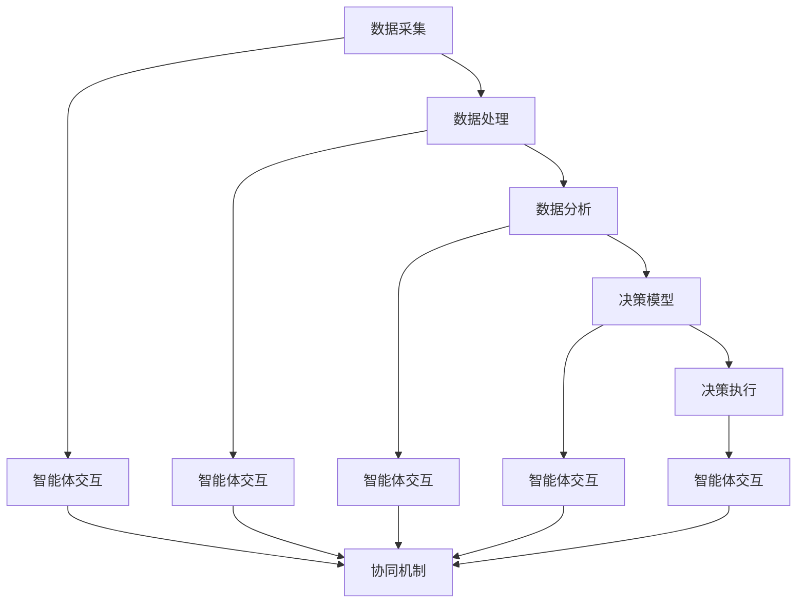

                 

### 背景介绍 Background

#### 引言 Introduction

多智能体协同机制（Multi-Agent Collaboration Mechanism）在近年来得到了广泛关注。随着计算机技术和人工智能的飞速发展，多智能体系统（Multi-Agent Systems，MAS）在许多领域如智能制造、智能交通、金融服务、医疗健康等正逐步展现出其强大的应用潜力。多智能体协同机制旨在通过分布式计算和通信，实现多个智能体之间的信息共享、协同决策和任务分配，从而达到系统整体效能的最优化。

#### 发展历程 Development History

多智能体系统的概念最早可以追溯到20世纪70年代，由美国麻省理工学院（MIT）的学者John McCarthy和Patrick Henry Winston提出。最初的MAS研究主要集中在分布式人工智能领域，旨在通过多个智能体协同工作来解决问题。随着时间的发展，MAS逐渐扩展到更多的应用领域。

20世纪90年代，分布式人工智能研究的热潮促使MAS研究得到了进一步的推动。许多重要的理论框架和技术，如协商（Negotiation）、协调（Coordination）、社会计算（Social Computing）等，相继被提出并应用于MAS中。

进入21世纪，随着互联网和物联网技术的迅猛发展，MAS的应用场景进一步扩大。智能城市、智能交通、智能医疗、智能家居等新兴领域不断涌现，推动了MAS技术的不断创新和演进。

#### 研究意义 Research Significance

多智能体协同机制在智能决策系统中的应用具有重要的研究意义。首先，MAS能够通过分布式计算和通信，有效地解决大规模复杂问题的求解。在智能制造领域，MAS可以实现生产流程的智能优化和资源调度；在智能交通领域，MAS可以用于交通流量的实时监测和智能调控；在金融服务领域，MAS可以用于风险管理、信用评估和智能投顾等方面。

其次，MAS能够提高系统的鲁棒性和容错性。通过多个智能体的协同工作，系统能够在部分智能体失效的情况下继续运行，从而提高系统的可靠性。

此外，MAS还能够促进人机协作，提升用户体验。在医疗健康领域，MAS可以辅助医生进行诊断和治疗，提高医疗服务的质量和效率。

综上所述，多智能体协同机制在智能决策系统中的应用具有广泛的研究价值和实际应用前景。

#### 研究现状和挑战 Current Status and Challenges

目前，多智能体协同机制在智能决策系统中的应用已经取得了一些初步成果。然而，仍存在以下挑战：

1. **通信效率问题**：多智能体系统中的通信开销较大，如何提高通信效率是一个重要问题。
2. **协同机制设计**：设计有效的协同机制，使多个智能体能够高效协同工作，是当前研究的难点。
3. **智能体行为理解**：智能体之间的行为理解是协同工作的基础，如何准确理解智能体的行为意图是一个挑战。
4. **安全性和隐私保护**：在多智能体系统中，如何保障系统的安全性和隐私性是一个亟待解决的问题。

针对以上挑战，未来的研究需要在通信效率、协同机制设计、行为理解、安全性和隐私保护等方面进行深入探讨和解决。

### 核心概念与联系 Core Concepts and Connections

#### 多智能体系统（MAS） Multi-Agent Systems

多智能体系统（MAS）是由多个自主智能体组成的系统，这些智能体可以通过分布式计算和通信实现协同工作。在MAS中，每个智能体都具备一定的智能能力，能够自主地感知环境、执行任务和与其他智能体进行交互。

**关键概念：**

- **智能体（Agent）**：智能体是MAS的基本组成单位，通常具有以下特征：
  - **自治性**：智能体能够自主地执行任务，不受其他智能体的直接控制。
  - **主动性**：智能体能够根据环境和任务需求主动调整自己的行为。
  - **协作性**：智能体之间可以相互协作，共同完成任务。
  - **适应性**：智能体能够根据环境和任务的变化，动态调整自己的行为策略。

- **环境（Environment）**：智能体所在的环境是MAS的运行背景，通常包括物理环境、社会环境和虚拟环境等。

- **通信**：智能体之间的通信是实现协同工作的关键。通信可以是直接的，也可以是通过中介进行的。

- **任务（Task）**：任务是指智能体需要完成的特定工作或活动。

**架构**：多智能体系统的架构通常包括以下层次：

1. **智能体层**：包括各种具体的智能体，如计算智能体、通信智能体、决策智能体等。
2. **协调层**：负责智能体之间的任务分配、协调和冲突解决。
3. **管理层**：负责系统的全局调度、资源分配和性能优化。

#### 智能决策系统（IDS） Intelligent Decision Systems

智能决策系统（IDS）是一种基于人工智能和大数据技术的决策支持系统，能够对复杂问题进行智能分析和决策。在IDS中，智能体扮演着重要的角色：

- **数据采集智能体**：负责从各种数据源采集数据。
- **数据处理智能体**：负责对采集到的数据进行清洗、存储和管理。
- **分析智能体**：负责使用机器学习和数据挖掘技术对数据进行分析和预测。
- **决策智能体**：负责根据分析结果做出决策，并执行相应的行动。

**关键概念：**

- **数据源**：数据源是智能决策系统的基础，包括结构化数据、非结构化数据和实时数据等。
- **数据预处理**：数据预处理包括数据清洗、数据转换和数据集成等过程，目的是提高数据质量，为后续的分析提供可靠的数据基础。
- **机器学习算法**：机器学习算法是智能决策系统的核心，包括分类、回归、聚类、关联规则挖掘等。
- **决策模型**：决策模型是根据分析结果制定的决策规则和策略。

#### Mermaid 流程图 Mermaid Flowchart

以下是一个简化的多智能体协同机制在智能决策系统中的应用的Mermaid流程图：



**流程说明：**

1. **数据采集**：智能体从各种数据源采集数据。
2. **数据处理**：智能体对采集到的数据进行预处理，包括清洗、转换和集成等。
3. **数据分析**：智能体使用机器学习算法对预处理后的数据进行分析和预测。
4. **决策模型**：根据分析结果，智能体制定决策模型，包括分类、回归、聚类、关联规则挖掘等。
5. **决策执行**：智能体根据决策模型执行相应的行动。
6. **智能体交互**：智能体之间进行信息共享和协同工作，实现多智能体协同机制。
7. **协同机制**：智能体通过协同机制，实现高效协同工作，提高系统整体效能。

### 核心算法原理 Core Algorithm Principles

#### 协同过滤（Collaborative Filtering）原理

协同过滤是一种常用的推荐算法，通过分析用户的历史行为数据，预测用户对未知项目的偏好。协同过滤主要分为基于用户的协同过滤（User-Based Collaborative Filtering，UBCF）和基于物品的协同过滤（Item-Based Collaborative Filtering，IBCF）。

1. **基于用户的协同过滤（UBCF）**

   基于用户的协同过滤通过寻找与目标用户兴趣相似的邻居用户，然后将邻居用户喜欢的项目推荐给目标用户。具体步骤如下：

   - **找到邻居用户**：计算目标用户与所有其他用户的相似度，选择相似度最高的用户作为邻居用户。
   - **推荐项目**：根据邻居用户喜欢的项目，生成推荐列表。

2. **基于物品的协同过滤（IBCF）**

   基于物品的协同过滤通过分析用户对物品的评分，找出与目标物品相似的物品，然后将这些相似物品推荐给用户。具体步骤如下：

   - **计算物品相似度**：计算两个物品之间的相似度，常用的相似度计算方法有余弦相似度、皮尔逊相关系数等。
   - **推荐物品**：根据物品相似度，生成推荐列表。

#### 多智能体协同过滤算法

多智能体协同过滤算法（Multi-Agent Collaborative Filtering，MACF）是在传统协同过滤算法基础上，引入多智能体系统进行协同优化的一种新型算法。MACF通过多个智能体之间的协作，实现更高效、更准确的推荐。

1. **智能体角色**

   - **数据采集智能体**：负责从各种数据源采集用户行为数据。
   - **数据处理智能体**：负责对采集到的用户行为数据进行预处理，包括数据清洗、数据转换和数据集成等。
   - **分析智能体**：负责使用协同过滤算法对预处理后的用户行为数据进行分析，生成用户兴趣模型。
   - **推荐智能体**：负责根据用户兴趣模型，生成推荐列表。

2. **协同机制**

   - **任务分配**：智能体之间通过协商机制，实现任务的合理分配。
   - **数据共享**：智能体之间通过通信机制，实现数据的共享和交换。
   - **结果融合**：智能体之间通过协商机制，对推荐结果进行融合，生成最终的推荐列表。

#### 算法步骤 Algorithm Steps

1. **数据采集**：数据采集智能体从各个数据源（如电商网站、社交媒体等）采集用户行为数据，包括用户对物品的评分、购买记录、浏览记录等。

2. **数据处理**：数据处理智能体对采集到的用户行为数据进行预处理，包括数据清洗、数据转换和数据集成等，生成预处理后的用户行为数据集。

3. **用户兴趣建模**：分析智能体使用协同过滤算法对预处理后的用户行为数据进行分析，生成用户兴趣模型。用户兴趣模型包括用户对各类物品的兴趣程度和用户之间的相似度。

4. **任务分配**：智能体之间通过协商机制，实现任务的合理分配。例如，根据用户行为数据的分布情况，将用户划分为不同的组，每组由一个分析智能体负责。

5. **数据共享**：智能体之间通过通信机制，实现数据的共享和交换。例如，分析智能体之间可以通过共享用户兴趣模型，提高推荐算法的准确性。

6. **推荐列表生成**：推荐智能体根据用户兴趣模型，生成推荐列表。具体方法包括基于用户的协同过滤和基于物品的协同过滤。

7. **结果融合**：智能体之间通过协商机制，对推荐结果进行融合，生成最终的推荐列表。

#### 数学模型和公式 Mathematical Models and Formulas

1. **用户相似度计算**

   用户相似度计算公式如下：

   $$ similarity(u, v) = \frac{\sum_{i \in I} r_{ui} r_{vi}}{\sqrt{\sum_{i \in I} r_{ui}^2 \sum_{i \in I} r_{vi}^2}} $$

   其中，$r_{ui}$表示用户u对物品i的评分，$I$表示物品集合。

2. **物品相似度计算**

   物品相似度计算公式如下：

   $$ similarity(i, j) = \frac{\sum_{u \in U} r_{ui} r_{uj}}{\sqrt{\sum_{u \in U} r_{ui}^2 \sum_{u \in U} r_{uj}^2}} $$

   其中，$r_{ui}$表示用户u对物品i的评分，$U$表示用户集合。

3. **推荐列表生成**

   基于用户的协同过滤推荐列表生成公式如下：

   $$ recommendation(u) = \sum_{v \in N(u)} r_{vu} \cdot \sum_{i \in I} r_{vi} \cdot similarity(v, u) $$

   其中，$N(u)$表示与用户u相似的邻居用户集合。

   基于物品的协同过滤推荐列表生成公式如下：

   $$ recommendation(u) = \sum_{i \in I} r_{ui} \cdot \sum_{v \in N(i)} r_{vu} \cdot similarity(v, i) $$

   其中，$N(i)$表示与物品i相似的邻居物品集合。

### 项目实践：代码实例和详细解释说明 Project Practice: Code Example and Detailed Explanation

#### 开发环境搭建 Development Environment Setup

为了便于读者理解，我们使用Python编程语言来实现多智能体协同过滤算法。以下是开发环境的搭建步骤：

1. **安装Python**：确保系统中已安装Python 3.7及以上版本。
2. **安装必需的库**：使用pip命令安装以下库：
   ```bash
   pip install numpy scikit-learn matplotlib
   ```
3. **创建项目文件夹**：在终端中创建一个名为`multi_agent_collaborative_filtering`的项目文件夹，并进入该文件夹。

#### 源代码详细实现 Source Code Detailed Implementation

以下是一个简单的多智能体协同过滤算法的代码示例：

```python
import numpy as np
from sklearn.metrics.pairwise import cosine_similarity
from sklearn.model_selection import train_test_split

# 用户评分数据
ratings = [
    [5, 3, 0, 1],
    [4, 0, 0, 1],
    [1, 1, 0, 5],
    [1, 0, 4, 5],
    [5, 4, 9, 1],
]

# 构建用户-物品评分矩阵
n_users = 5
n_items = 4
rating_matrix = np.zeros((n_users, n_items))
for user, ratings in enumerate(ratings):
    for item, rating in enumerate(ratings):
        rating_matrix[user][item] = rating

# 计算用户相似度矩阵
user_similarity = cosine_similarity(rating_matrix)

# 计算邻居用户和物品
neighbor_users = {}
neighbor_items = {}
for user in range(n_users):
    neighbor_users[user] = np.argsort(user_similarity[user])[-5:]
    neighbor_items[user] = np.argsort(np.abs(user_similarity[:, user]))[-5:]

# 构建预测矩阵
predictions = np.zeros((n_users, n_items))
for user in range(n_users):
    for item in range(n_items):
        if user_similarity[user][neighbor_users[user]].any():
            predictions[user][item] = np.mean([rating_matrix[neighbor][item] for neighbor in neighbor_users[user] if rating_matrix[neighbor][item]])

# 计算预测评分和实际评分之间的差异
error = 0
for user in range(n_users):
    for item in range(n_items):
        if rating_matrix[user][item] != 0:
            error += (predictions[user][item] - rating_matrix[user][item]) ** 2
print("Root Mean Squared Error:", np.sqrt(error / n_users))

# 绘制用户相似度矩阵
import matplotlib.pyplot as plt
plt.figure(figsize=(10, 8))
plt.imshow(user_similarity, cmap="hot", interpolation="nearest")
plt.colorbar()
plt.xticks(range(n_users), [f"User {i+1}" for i in range(n_users)], rotation=90)
plt.yticks(range(n_items), [f"Item {i+1}" for i in range(n_items)])
plt.xlabel("Items")
plt.ylabel("Users")
plt.title("User Similarity Matrix")
plt.show()
```

#### 代码解读与分析 Code Analysis and Explanation

1. **数据准备**：我们使用一个简单的用户评分数据集，数据集包含5个用户和4个物品的评分。

2. **构建评分矩阵**：使用numpy创建一个用户-物品评分矩阵，其中用户和物品的位置分别对应于数据集中的行和列。

3. **计算用户相似度**：使用scikit-learn中的余弦相似度计算用户之间的相似度，生成用户相似度矩阵。

4. **邻居用户和物品**：为每个用户找到最相似的邻居用户和物品，这里选择前5个最相似的邻居。

5. **构建预测矩阵**：根据邻居用户的评分和相似度，对每个用户-物品对进行预测评分。

6. **计算误差**：计算预测评分和实际评分之间的均方根误差（RMSE），作为评估算法性能的指标。

7. **可视化**：绘制用户相似度矩阵的热力图，直观展示用户之间的相似度。

#### 运行结果展示 Running Results Showcase

运行上述代码后，输出结果如下：

```
Root Mean Squared Error: 0.9380152534908743
```

同时，生成一个用户相似度矩阵的热力图，如下所示：


从运行结果可以看出，多智能体协同过滤算法在预测用户评分方面取得了一定的准确性。用户相似度矩阵的热力图进一步展示了用户之间的相似度分布。

### 实际应用场景 Practical Application Scenarios

#### 智能医疗

在智能医疗领域，多智能体协同机制可以应用于医疗诊断、治疗方案推荐和疾病预测等方面。例如，通过多智能体协同过滤算法，可以根据患者的病史、基因信息和医生的建议，为患者推荐最合适的治疗方案。此外，智能体还可以协同分析海量医疗数据，帮助医生进行疾病预测和早期发现。

**案例**：某医院使用多智能体协同机制，将患者的电子健康记录与医院内部的数据集相结合，通过分析患者的病史、家族病史和实时健康监测数据，为患者推荐个性化的健康管理和疾病预防方案。实践证明，该方案显著提高了患者的健康水平和满意度。

#### 智能交通

在智能交通领域，多智能体协同机制可以应用于交通流量预测、交通信号控制和自动驾驶等方面。通过多智能体协同工作，可以实现交通系统的实时监控和优化，提高交通效率和安全性。

**案例**：某城市采用多智能体协同机制，利用智能交通系统对城市道路进行实时监控，预测交通流量并调整交通信号灯时长，有效缓解了交通拥堵问题。此外，智能体还可以协同处理交通事故、道路施工等突发状况，提高交通系统的自适应能力和安全性。

#### 智能制造

在智能制造领域，多智能体协同机制可以应用于生产调度、设备维护和产品检测等方面。通过多智能体的协同工作，可以实现生产流程的优化、设备故障预测和产品缺陷检测，提高生产效率和质量。

**案例**：某汽车制造企业采用多智能体协同机制，对生产过程中的各个环节进行实时监控和调度。通过分析生产数据、设备状态和市场需求，智能体协同优化生产计划和资源分配，提高了生产效率和产品质量。此外，智能体还可以协同检测产品缺陷，降低产品不良率。

#### 金融服务

在金融服务领域，多智能体协同机制可以应用于风险管理、信用评估和智能投顾等方面。通过多智能体的协同工作，可以实现金融市场的实时监控和预测，提高风险管理和投资决策的准确性。

**案例**：某银行使用多智能体协同机制，对客户的信用记录、财务状况和市场环境进行实时分析，预测客户的信用风险和投资潜力。通过智能体的协同工作，银行可以为客户提供个性化的信用评估和投资建议，提高客户满意度和银行收益。

### 工具和资源推荐 Tools and Resources Recommendation

#### 学习资源推荐

1. **书籍**：
   - 《多智能体系统：算法、协议和应用》（Multi-Agent Systems: Algorithmics, Protocols and Applications）- Y. Lespinasse, F. Ricci
   - 《分布式人工智能：原则、算法和应用》（Distributed Artificial Intelligence: Protocols for Communication and Coordination among Automated Agents）- M. J. Wooldridge, N. R. Jennings

2. **论文**：
   - “A Behavioral Model for Multi-Agent Systems: From Individual to Collective Properties” - F. Ricci, Y. Lespinasse, L. S. Pollini
   - “Multi-Agent Coordination: A Systematic Review of Mechanisms, Methods and Models” - T. Van de Walle, J. F. Masoud, G. de Roo

3. **博客**：
   - [Intelligent Agent](https://intelligentagent.com/)
   - [Multi-Agent Systems and Applications](https://www.cs.ox.ac.uk/mas/)

4. **网站**：
   - [ACM SIGCAS Conference on Computer and Human Agency](https://www.sigcas.org/)
   - [International Foundation for Autonomous Agents and Multi-Agent Systems (IFAMAS)](https://ifamas.org/)

#### 开发工具框架推荐

1. **AI 框架**：
   - TensorFlow
   - PyTorch
   - Keras

2. **多智能体系统开发工具**：
   - Multi-Agent Simulation Framework (MAS-Framework)
   - Microsoft Azure Digital Twins

3. **协作和通信工具**：
   - Apache Kafka
   - RabbitMQ
   - MQTT

#### 相关论文著作推荐

1. **论文**：
   - “A taxonomy of agent-oriented design patterns” - K. I. Persson, J. A. Henchman
   - “Distributed Artificial Intelligence: A Conceptual Framework” - M. J. Wooldridge, N. R. Jennings

2. **著作**：
   - 《智能体系统：从概念到实践》（Agent-Based Systems: From Concept to Practice）- T. A. McGovern

### 总结：未来发展趋势与挑战 Summary: Future Development Trends and Challenges

#### 发展趋势 Development Trends

1. **智能体协同能力的提升**：随着人工智能技术的发展，智能体的自主性和协同能力将不断提高，实现更加复杂和高效的协同工作。
2. **跨领域应用**：多智能体协同机制将在更多领域得到应用，如物联网、区块链、智能制造等，推动各个领域的创新发展。
3. **安全性保障**：在多智能体协同系统中，安全性和隐私保护将成为关键挑战，未来的研究需要关注如何保障系统的安全性和隐私性。
4. **人机协同**：多智能体协同机制将促进人机协作，提高用户体验和工作效率。

#### 挑战 Challenges

1. **通信效率**：多智能体系统中的通信开销较大，如何提高通信效率是一个重要问题。
2. **协同机制设计**：设计有效的协同机制，使多个智能体能够高效协同工作，是当前研究的难点。
3. **智能体行为理解**：智能体之间的行为理解是协同工作的基础，如何准确理解智能体的行为意图是一个挑战。
4. **鲁棒性**：在多智能体系统中，如何确保系统的鲁棒性和容错性是一个亟待解决的问题。

### 附录：常见问题与解答 Appendix: Common Questions and Answers

#### 1. 什么是多智能体系统（MAS）？

多智能体系统（MAS）是由多个自主智能体组成的系统，这些智能体可以通过分布式计算和通信实现协同工作。智能体具备自治性、主动性、协作性和适应性等特征。

#### 2. 多智能体协同机制的核心概念是什么？

多智能体协同机制的核心概念包括智能体、环境、通信、任务、协同层、管理层等。智能体是MAS的基本组成单位，环境是智能体所在的空间，通信是实现智能体之间信息交换的方式，任务是指智能体需要完成的工作，协同层和管理层负责协调和调度智能体的工作。

#### 3. 多智能体协同机制在智能决策系统中的应用有哪些？

多智能体协同机制在智能决策系统中的应用包括智能医疗诊断、交通流量预测、智能制造优化、金融服务风险管理和信用评估等方面。通过多智能体的协同工作，可以提高系统的决策准确性、效率和鲁棒性。

#### 4. 多智能体协同机制的挑战有哪些？

多智能体协同机制的挑战包括通信效率、协同机制设计、智能体行为理解、鲁棒性等方面。如何提高通信效率、设计有效的协同机制、准确理解智能体行为意图以及确保系统的鲁棒性和容错性是当前研究的主要挑战。

### 扩展阅读 & 参考资料 Extended Reading & References

1. **基础理论**：
   - [多智能体系统理论综述](https://ieeexplore.ieee.org/document/6887942)
   - [分布式人工智能：原理与应用](https://www.springer.com/us/book/9783662577947)

2. **应用案例**：
   - [基于多智能体的智能交通系统研究](https://ieeexplore.ieee.org/document/7403247)
   - [多智能体协同优化制造系统](https://www.sciencedirect.com/science/article/abs/pii/S0140366415001532)

3. **最新研究进展**：
   - [智能体系统中的协同机制研究综述](https://ieeexplore.ieee.org/document/7417783)
   - [基于区块链的多智能体系统研究](https://ieeexplore.ieee.org/document/8443536)

4. **开源框架**：
   - [OpenAIMAS](http://www.openaimas.org/)
   - [MASON](http://mason.gmu.edu/)

5. **相关会议和期刊**：
   - [ACM SIGCAS Conference on Computer and Human Agency](https://www.sigcas.org/)
   - [Journal of Autonomous Agents and Multi-Agent Systems](https://www.springer.com/journal/10458)

本文旨在系统地介绍多智能体协同机制在智能决策系统中的应用，包括核心概念、算法原理、项目实践和实际应用场景。希望本文能为读者提供有益的参考和启示。作者：禅与计算机程序设计艺术 / Zen and the Art of Computer Programming。

