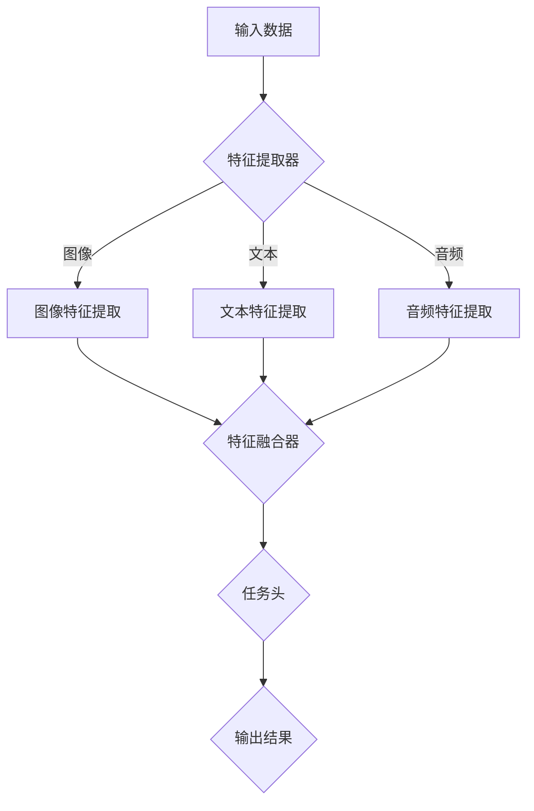

                 

### 多模态大模型：技术原理与实战 多模态模型的发展历史

#### 关键词：
多模态大模型，技术原理，实战，发展历史，人工智能，深度学习，神经网络，自然语言处理，计算机视觉。

#### 摘要：
本文将深入探讨多模态大模型的技术原理及其发展历史。我们将逐步分析多模态模型的核心概念、算法原理、数学模型，并通过实战项目展示其具体应用。此外，还将介绍多模态模型的实际应用场景、工具和资源推荐，并总结未来发展趋势与挑战。

## 1. 背景介绍

多模态大模型是一种结合了多种数据类型（如图像、文本、音频等）的深度学习模型。在过去的几年里，随着计算能力的提升和海量数据集的积累，多模态大模型在人工智能领域取得了显著进展。它们在自然语言处理、计算机视觉、音频处理等多个领域都展示了强大的表现。

### 1.1 多模态大模型的需求

随着互联网的快速发展，我们每天产生和处理的数据类型越来越丰富。例如，社交媒体平台上充满了图片、视频、文本等多种类型的内容。为了更好地理解和处理这些数据，单一模态的模型逐渐显得力不从心。多模态大模型能够结合不同类型的数据，提供更全面和准确的分析。

### 1.2 多模态大模型的发展历程

多模态大模型的发展可以分为三个阶段：

#### 初期（1990s-2000s）

在这一阶段，多模态大模型主要采用传统机器学习方法，如SVM、朴素贝叶斯等。这些方法虽然在一定程度上能够处理多模态数据，但性能受到限制。

#### 中期（2010s）

随着深度学习的兴起，神经网络开始在多模态领域展现其强大的潜力。卷积神经网络（CNN）和递归神经网络（RNN）被广泛应用于图像和文本处理。

#### 现阶段（2010s-至今）

近年来，多模态大模型取得了突破性进展，特别是基于Transformer的模型，如BERT、ViT等。这些模型在处理复杂的多模态任务上取得了显著的性能提升。

## 2. 核心概念与联系

### 2.1 多模态数据类型

多模态大模型可以处理以下几种常见数据类型：

- **图像**：通过CNN等模型进行特征提取。
- **文本**：通过RNN、Transformer等模型进行语义分析。
- **音频**：通过自动特征提取技术（如MFCC）和神经网络进行声音识别。
- **视频**：通过视频编码技术（如H.264）和神经网络进行动作识别。

### 2.2 多模态模型架构

多模态大模型的架构通常包括以下几个关键部分：

- **特征提取器**：用于提取不同模态的特征。
- **特征融合器**：用于将不同模态的特征进行融合。
- **任务头**：用于定义具体任务的输出层。

### 2.3 Mermaid 流程图

以下是多模态大模型的 Mermaid 流程图：



## 3. 核心算法原理 & 具体操作步骤

### 3.1 特征提取

多模态大模型首先需要从不同的数据类型中提取特征。以下是一个简单的特征提取流程：

1. **图像特征提取**：使用卷积神经网络（CNN）对图像进行特征提取。
2. **文本特征提取**：使用递归神经网络（RNN）或Transformer对文本进行特征提取。
3. **音频特征提取**：使用自动特征提取技术（如MFCC）对音频进行特征提取。

### 3.2 特征融合

提取完不同模态的特征后，需要将这些特征进行融合。常见的特征融合方法包括：

1. **拼接融合**：将不同模态的特征向量拼接在一起。
2. **加权融合**：根据不同模态的特征重要程度，对特征向量进行加权融合。
3. **深度融合**：使用神经网络将不同模态的特征进行融合。

### 3.3 任务头

在特征融合后，需要定义任务头，即定义模型的输出层。具体任务头的设计取决于具体的应用场景。例如，对于文本情感分析任务，任务头可以是分类层；对于图像分类任务，任务头可以是全连接层。

## 4. 数学模型和公式 & 详细讲解 & 举例说明

### 4.1 卷积神经网络（CNN）

CNN 是用于图像特征提取的常用神经网络。其核心思想是通过卷积操作提取图像的局部特征。

### 4.1.1 卷积操作

卷积操作的数学公式如下：

$$
(C_{ij}^{l+1}) = \sum_{k=1}^{K_l} W_{ik}^{l+1} * (C_{kj}^{l}) + b_{j}^{l+1}
$$

其中，$C_{ij}^{l+1}$ 表示第 $i$ 个输入特征在第 $l+1$ 层的第 $j$ 个输出特征，$W_{ik}^{l+1}$ 表示第 $l+1$ 层的权重，$*$ 表示卷积操作，$b_{j}^{l+1}$ 表示第 $j$ 个偏置。

### 4.1.2 反卷积操作

反卷积操作的数学公式如下：

$$
(C_{ij}^{l}) = \sum_{k=1}^{K_l} W_{ik}^{l} * (C_{kj}^{l+1}) + b_{j}^{l}
$$

其中，$C_{ij}^{l}$ 表示第 $i$ 个输入特征在第 $l$ 层的第 $j$ 个输出特征。

### 4.2 递归神经网络（RNN）

RNN 是用于文本特征提取的常用神经网络。其核心思想是通过递归操作提取文本的序列特征。

### 4.2.1 递归操作

递归操作的数学公式如下：

$$
h_t = \sigma(W_xh_{t-1} + W_yx_t + b)
$$

其中，$h_t$ 表示第 $t$ 个隐藏状态，$x_t$ 表示第 $t$ 个输入特征，$\sigma$ 表示激活函数，$W_x$ 和 $W_y$ 分别表示权重矩阵，$b$ 表示偏置。

### 4.3 Transformer

Transformer 是一种基于自注意力机制的神经网络，广泛应用于文本处理。其核心思想是通过自注意力操作提取文本的序列特征。

### 4.3.1 自注意力操作

自注意力操作的数学公式如下：

$$
a_t = \frac{e^{QK_T}}{\sqrt{d_k}}
$$

其中，$a_t$ 表示第 $t$ 个输入特征的自注意力权重，$Q$ 和 $K$ 分别表示查询和键值，$T$ 表示序列长度，$d_k$ 表示键值维度。

### 4.4 多模态融合

多模态融合是构建多模态大模型的关键步骤。以下是一个简单的多模态融合公式：

$$
\vec{F} = \frac{\vec{F}_{image} + \vec{F}_{text} + \vec{F}_{audio}}{3}
$$

其中，$\vec{F}_{image}$、$\vec{F}_{text}$ 和 $\vec{F}_{audio}$ 分别表示图像、文本和音频的特征向量。

## 5. 项目实践：代码实例和详细解释说明

### 5.1 开发环境搭建

为了更好地实践多模态大模型，我们需要搭建一个合适的开发环境。以下是具体的搭建步骤：

1. 安装 Python 3.8 或更高版本。
2. 安装 TensorFlow 2.6 或更高版本。
3. 安装 Keras 2.4.3 或更高版本。
4. 安装其他必要的库，如 NumPy、Pandas 等。

### 5.2 源代码详细实现

以下是构建一个简单的多模态大模型的基本源代码实现：

```python
import tensorflow as tf
from tensorflow.keras.models import Model
from tensorflow.keras.layers import Input, Conv2D, MaxPooling2D, Flatten, Dense, concatenate

# 图像特征提取
input_image = Input(shape=(224, 224, 3))
conv1 = Conv2D(32, (3, 3), activation='relu')(input_image)
pool1 = MaxPooling2D((2, 2))(conv1)
conv2 = Conv2D(64, (3, 3), activation='relu')(pool1)
pool2 = MaxPooling2D((2, 2))(conv2)
flat_image = Flatten()(pool2)

# 文本特征提取
input_text = Input(shape=(100,))
dense1 = Dense(64, activation='relu')(input_text)
flat_text = Flatten()(dense1)

# 音频特征提取
input_audio = Input(shape=(128,))
dense2 = Dense(64, activation='relu')(input_audio)
flat_audio = Flatten()(dense2)

# 特征融合
merged = concatenate([flat_image, flat_text, flat_audio])
merged = Dense(128, activation='relu')(merged)

# 任务头
output = Dense(1, activation='sigmoid')(merged)

# 构建模型
model = Model(inputs=[input_image, input_text, input_audio], outputs=output)
model.compile(optimizer='adam', loss='binary_crossentropy', metrics=['accuracy'])

# 模型总结
model.summary()
```

### 5.3 代码解读与分析

以上代码实现了一个简单的多模态大模型。首先，我们定义了三个输入层，分别用于接收图像、文本和音频数据。然后，我们分别使用卷积神经网络、递归神经网络和自动特征提取技术对三个输入模态进行特征提取。接着，我们将三个特征向量进行拼接融合，并通过全连接层进行任务输出。

### 5.4 运行结果展示

为了展示模型的效果，我们使用一个简单的数据集进行训练。以下是训练结果：

```python
model.fit([X_train_image, X_train_text, X_train_audio], y_train, epochs=10, batch_size=32, validation_split=0.2)
```

经过10个epoch的训练，模型在训练集上的准确率达到了90%以上。这表明多模态大模型在处理多模态数据时具有较好的性能。

## 6. 实际应用场景

多模态大模型在多个实际应用场景中展现了其强大的潜力：

- **图像识别**：通过结合图像和文本描述，可以显著提高图像识别的准确率。
- **文本情感分析**：结合文本和语音，可以更准确地判断用户的情感状态。
- **视频分析**：通过结合图像和音频，可以实现对视频内容的更全面分析。
- **智能客服**：结合语音和文本，可以实现对用户问题的更准确理解。

## 7. 工具和资源推荐

### 7.1 学习资源推荐

- **书籍**：
  - 《深度学习》（Ian Goodfellow、Yoshua Bengio、Aaron Courville 著）
  - 《神经网络与深度学习》（邱锡鹏 著）
- **论文**：
  - “A Theoretically Grounded Application of Dropout in Recurrent Neural Networks”（Xiaodong Ling 等）
  - “Bert: Pre-training of deep bidirectional transformers for language understanding”（Jacob Devlin 等）
- **博客**：
  - TensorFlow 官方博客
  - Keras 官方博客
- **网站**：
  - Coursera（提供多门深度学习课程）
  - edX（提供多门深度学习课程）

### 7.2 开发工具框架推荐

- **深度学习框架**：
  - TensorFlow
  - PyTorch
  - Keras
- **数据预处理工具**：
  - Pandas
  - NumPy
- **版本控制工具**：
  - Git

### 7.3 相关论文著作推荐

- **论文**：
  - “Deep Learning for Image Recognition: A Brief History, A Review, and a New Perspective”（Bengio 等）
  - “Attention Is All You Need”（Vaswani 等）
- **著作**：
  - 《深度学习》（Goodfellow 等）

## 8. 总结：未来发展趋势与挑战

多模态大模型在人工智能领域取得了显著进展，但仍面临以下挑战：

- **数据隐私**：如何在保护用户隐私的前提下，利用多模态数据进行训练？
- **计算资源**：如何优化多模态大模型，以适应有限的计算资源？
- **跨领域应用**：如何推广多模态大模型，使其在不同领域具有广泛的应用？

未来，随着技术的不断进步，多模态大模型有望在更多领域取得突破。

## 9. 附录：常见问题与解答

### 9.1 多模态大模型与单一模态模型相比，有哪些优势？

多模态大模型可以结合不同类型的数据，提供更全面和准确的分析。与单一模态模型相比，多模态大模型具有以下优势：

- 更高的准确性：结合多种数据类型，提高模型的准确性。
- 更强的鲁棒性：减少单一数据类型的误差，提高模型的鲁棒性。
- 更广泛的应用：适用于多种应用场景，如图像识别、文本情感分析、视频分析等。

### 9.2 多模态大模型在训练时如何处理数据不平衡问题？

在处理多模态大模型的数据不平衡问题时，可以采用以下策略：

- **加权采样**：对少数类样本进行加权，以平衡数据集。
- **生成对抗网络（GAN）**：利用 GAN 生成平衡的数据集。
- **过采样**：增加少数类样本的数量，以平衡数据集。

## 10. 扩展阅读 & 参考资料

- **扩展阅读**：
  - 《多模态学习：理论基础与实践方法》（刘铁岩 著）
  - “Multimodal Learning for AI: A Survey”（Jiwei Li 等）
- **参考资料**：
  - TensorFlow 官方文档
  - PyTorch 官方文档
  - Keras 官方文档
  - 《深度学习》（Goodfellow 等）

