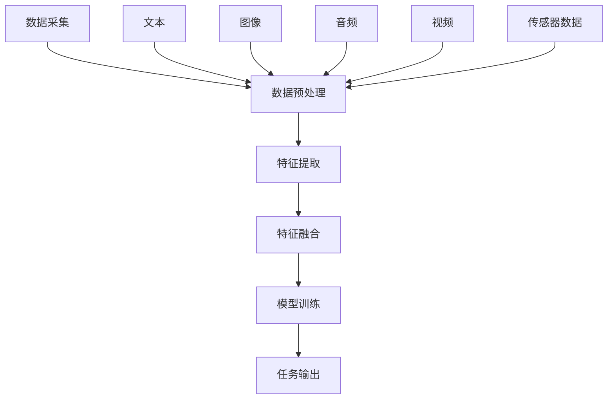

                 

### 背景介绍

多模态学习（Multimodal Learning）是近年来在人工智能领域崭露头角的重要研究方向。随着计算机技术和传感器技术的快速发展，人类生活已经逐渐被多种多样的数据形式所包围。这些数据形式包括但不限于文本、图像、音频、视频以及传感器数据等。多模态学习旨在通过结合来自不同模态的数据，以更有效地解决复杂的认知任务。

多模态学习的重要性体现在多个方面。首先，它能够提升模型的泛化能力。单独的模态数据可能具有噪声和局限性，而多模态数据可以互补这些缺陷，提供更丰富的信息，从而提高模型的准确性。其次，多模态学习可以提升任务的实用性。例如，在语音识别中，加入视觉信息可以显著减少因环境噪声导致的错误。再者，多模态学习还能够在自然语言处理、计算机视觉、医疗诊断等领域发挥重要作用。

当前，多模态学习的研究和应用已经取得了显著的进展。在自然语言处理领域，研究者们通过结合文本和视觉信息，提升了机器翻译、情感分析等任务的性能。在计算机视觉领域，多模态学习被广泛应用于人脸识别、图像分割等任务，通过融合视觉和文本描述，增强了模型的判别能力。在医疗领域，多模态学习技术被用于病患诊断和治疗方案优化，通过对影像、病历等多模态数据的分析，提高了诊断的准确性和效率。

然而，尽管多模态学习展现了巨大的潜力，但它仍然面临着一系列挑战。例如，如何有效地融合不同模态的数据、如何处理模态之间的异构性、如何设计有效的模型架构等。这些问题不仅限制了多模态学习的应用范围，也是未来研究的重要方向。

本文将围绕多模态学习的核心概念、算法原理、数学模型、实际应用和未来发展趋势展开讨论。首先，我们将介绍多模态学习的核心概念及其相互联系，并通过Mermaid流程图展示其基本架构。接下来，我们将深入探讨多模态学习中的核心算法原理，详细解析其具体操作步骤。随后，我们将介绍相关的数学模型和公式，并通过实例进行详细讲解。在项目实践部分，我们将通过一个具体的代码实例，展示多模态学习的实际应用，并进行详细的解读和分析。最后，我们将讨论多模态学习的实际应用场景，推荐相关的学习资源和开发工具，总结多模态学习的未来发展趋势和挑战，并给出常见问题与解答。

通过本文的详细讨论，我们希望能够为读者提供一个全面、系统的多模态学习指南，助力他们在这一领域取得突破性进展。

### 核心概念与联系

多模态学习作为一个涉及多种数据类型和方法的研究领域，其核心概念包括数据的采集、预处理、特征提取、融合以及模型训练等。以下是这些核心概念之间的联系及其在多模态学习中的应用。

#### 数据采集

数据采集是多模态学习的第一步，也是基础。不同模态的数据来源各异，例如，文本数据可以从网页、书籍、社交媒体等获取；图像数据可以从相机、监控设备中获取；音频数据可以通过麦克风、语音识别设备获取；视频数据可以从摄像头、视频录制设备获取；传感器数据则来自各种传感器，如温度传感器、加速度传感器、心率传感器等。

#### 数据预处理

数据预处理是确保数据质量的重要环节。对于不同的模态数据，预处理的方法也不同。例如，对于文本数据，需要进行分词、去停用词、词性标注等；对于图像数据，需要进行去噪、图像增强、大小归一化等；对于音频数据，需要进行降噪、音频分割、频率分析等；对于视频数据，需要进行帧提取、视频编码等。

#### 特征提取

特征提取是从原始数据中提取出能够代表数据本质的信息的过程。不同模态的数据特征提取方法各异。例如，文本数据常用词袋模型、词嵌入等方法；图像数据常用哈希特征、SIFT、卷积神经网络等方法；音频数据常用梅尔频率倒谱系数（MFCC）、频谱特征等方法；视频数据常用光流、时空特征等方法。

#### 特征融合

特征融合是将来自不同模态的数据特征进行整合，以形成更全面、更准确的特征表示。特征融合的方法包括拼接、加权平均、聚类、深度学习等。拼接方法简单直接，但可能忽略了模态之间的信息互补性；加权平均方法考虑了各模态的重要性，但难以处理复杂的信息交互；聚类方法能够发现潜在的模式，但可能难以保持原始模态的信息完整性；深度学习方法通过多层神经网络结构，能够自动学习各模态之间的复杂关系。

#### 模型训练

模型训练是基于融合后的特征数据，通过学习算法训练出能够处理多模态数据的模型。常见的模型包括卷积神经网络（CNN）、循环神经网络（RNN）、长短期记忆网络（LSTM）、生成对抗网络（GAN）等。这些模型通过学习不同模态数据之间的关联，提升任务的处理能力。

#### Mermaid流程图

以下是一个简化的Mermaid流程图，用于展示多模态学习的基本架构：



在这个流程图中，数据采集阶段包含了多种模态的数据，这些数据经过预处理后进入特征提取阶段。不同模态的特征通过特征融合方法整合，最终输入到训练模型中，通过模型训练得到任务输出。

#### 总结

多模态学习的核心概念紧密相连，通过数据采集、预处理、特征提取、特征融合和模型训练等步骤，实现多种数据类型的融合，从而提升任务的处理能力。Mermaid流程图清晰地展示了这一过程，有助于理解多模态学习的整体架构和流程。

### 核心算法原理 & 具体操作步骤

多模态学习中的核心算法原理主要涉及特征提取、特征融合和模型训练。以下是这些算法的详细解释和具体操作步骤。

#### 特征提取

特征提取是多模态学习的第一步，其目的是将原始数据转换成能够反映数据本质特征的表示。不同模态的数据需要采用不同的特征提取方法。

1. **文本特征提取**：
   - **词袋模型（Bag of Words, BoW）**：将文本分解为词汇，统计每个词汇的出现频率，形成词汇-频率矩阵。
   - **词嵌入（Word Embedding）**：通过神经网络将词汇映射到高维空间，每个词汇对应一个向量，这些向量包含了词汇的语义信息。

2. **图像特征提取**：
   - **传统特征提取方法**：如SIFT（Scale-Invariant Feature Transform）、HOG（Histogram of Oriented Gradients）等，用于提取图像的局部特征。
   - **深度学习方法**：如卷积神经网络（CNN），通过多层卷积和池化操作提取图像的全局和局部特征。

3. **音频特征提取**：
   - **梅尔频率倒谱系数（MFCC）**：将音频信号转换为频谱特征，适用于语音识别等任务。
   - **频谱特征**：如频谱图、频谱熵等，用于描述音频信号的频率分布。

4. **视频特征提取**：
   - **光流特征**：描述视频帧间像素的位移，用于动作识别等任务。
   - **时空特征**：结合图像特征和时间信息，用于视频分类和目标跟踪等任务。

#### 特征融合

特征融合是将来自不同模态的数据特征进行整合，以形成更全面、更准确的特征表示。以下是一些常用的特征融合方法：

1. **拼接（Concatenation）**：
   - 将不同模态的特征向量直接拼接在一起，形成新的特征向量。这种方法简单直观，但可能忽略了各模态之间的内在联系。

2. **加权平均（Weighted Average）**：
   - 根据各模态的重要程度，对特征向量进行加权平均，形成新的特征向量。这种方法考虑了模态之间的差异，但难以处理复杂的交互关系。

3. **聚类（Clustering）**：
   - 通过聚类算法，如K-means，将不同模态的特征进行分组，形成多个特征子集，再进行融合。这种方法有助于发现潜在的模式，但可能难以保持原始模态的信息完整性。

4. **深度学习（Deep Learning）**：
   - 通过多层神经网络，如CNN和RNN，自动学习各模态特征之间的复杂关系。这种方法能够处理多模态数据之间的深层关联，但需要大量的数据和计算资源。

#### 模型训练

模型训练是基于融合后的特征数据，通过学习算法训练出能够处理多模态数据的模型。以下是一些常用的模型训练方法：

1. **监督学习（Supervised Learning）**：
   - 使用标注好的数据集进行训练，通过最小化损失函数调整模型参数，以达到预测任务的目标。这种方法适用于有明确标签的任务，如分类和回归。

2. **无监督学习（Unsupervised Learning）**：
   - 不需要标注数据，通过发现数据内在的结构和模式进行训练。这种方法适用于聚类和降维任务，如主成分分析（PCA）和自编码器（Autoencoder）。

3. **半监督学习（Semi-Supervised Learning）**：
   - 结合有标签和无标签数据，通过利用无标签数据的结构信息提升模型性能。这种方法适用于标注成本高的任务，如图像分类和文本分类。

#### 操作步骤示例

以下是一个简化的多模态学习操作步骤示例：

1. **数据采集**：从不同模态的数据源采集数据，如文本、图像、音频、视频和传感器数据。

2. **数据预处理**：对采集到的数据进行预处理，包括去噪、归一化、分割等操作。

3. **特征提取**：
   - 文本：使用词袋模型提取词汇频率，使用词嵌入提取词向量。
   - 图像：使用CNN提取图像特征。
   - 音频：使用MFCC提取音频特征。
   - 视频：使用光流特征和时间特征提取视频特征。

4. **特征融合**：采用拼接方法将不同模态的特征向量拼接在一起。

5. **模型训练**：使用监督学习算法，如CNN和RNN，对拼接后的特征数据进行训练，调整模型参数。

6. **模型评估**：使用验证集对训练好的模型进行评估，调整模型结构和参数，以提高性能。

7. **模型应用**：将训练好的模型应用到实际任务中，如图像分类、语音识别、视频分类等。

通过上述步骤，我们能够实现多模态学习的基本流程。在实际应用中，需要根据具体任务的需求，灵活选择和调整特征提取、特征融合和模型训练的方法，以达到最佳效果。

### 数学模型和公式 & 详细讲解 & 举例说明

多模态学习中的数学模型和公式是其核心理论基础，这些模型不仅帮助我们理解多模态数据的内在规律，还指导我们设计和优化多模态学习算法。以下将详细介绍多模态学习中的几个关键数学模型和公式，并配以相应的详细讲解和实际应用实例。

#### 1. 多模态特征融合

多模态特征融合是核心步骤之一，常见的融合方法有拼接、加权平均和深度学习等。以下分别介绍这些方法的数学模型。

1. **拼接（Concatenation）**：

   假设我们有来自两个模态的特征向量 $X_1$ 和 $X_2$，分别代表文本和图像特征。拼接的数学模型可以表示为：

   $$
   X_{\text{concat}} = [X_1; X_2]
   $$

   其中，$[ \cdot ; \cdot ]$ 表示垂直拼接操作。拼接后的特征向量 $X_{\text{concat}}$ 包含了来自两个模态的所有信息。

   **示例**：

   假设文本特征的维度为 $100$，图像特征的维度为 $784$，则拼接后的特征维度为 $100 + 784 = 884$。

2. **加权平均（Weighted Average）**：

   加权平均方法根据各模态的重要性对特征进行加权融合。假设权重分别为 $\alpha_1$ 和 $\alpha_2$，则加权平均的数学模型可以表示为：

   $$
   X_{\text{weighted}} = \alpha_1 X_1 + \alpha_2 X_2
   $$

   其中，$\alpha_1 + \alpha_2 = 1$。通过调整权重，可以平衡不同模态之间的贡献。

   **示例**：

   假设 $\alpha_1 = 0.6$，$\alpha_2 = 0.4$，则加权融合后的特征为：

   $$
   X_{\text{weighted}} = 0.6 X_1 + 0.4 X_2
   $$

3. **深度学习（Deep Learning）**：

   深度学习方法通过神经网络结构自动学习各模态特征之间的复杂关系。常见的深度学习模型包括卷积神经网络（CNN）、循环神经网络（RNN）和变换器（Transformer）等。

   **示例**：

   假设我们使用一个简单的全连接神经网络（Fully Connected Neural Network, FCNN）进行特征融合。该网络的输入层维度为 $884$（拼接后的特征维度），输出层维度为 $256$。则融合特征的数学模型可以表示为：

   $$
   X_{\text{deep}} = \text{FCNN}(X_{\text{concat}})
   $$

   其中，$\text{FCNN}$ 表示全连接神经网络，$X_{\text{deep}}$ 表示融合后的特征。

#### 2. 多模态损失函数

多模态学习中的损失函数用于衡量模型预测值与实际标签之间的差距，常见的损失函数有均方误差（MSE）、交叉熵损失（Cross-Entropy Loss）等。

1. **均方误差（MSE）**：

   均方误差是监督学习中最常用的损失函数之一，用于回归任务。其数学模型可以表示为：

   $$
   \text{MSE} = \frac{1}{n} \sum_{i=1}^{n} (y_i - \hat{y}_i)^2
   $$

   其中，$y_i$ 表示实际标签，$\hat{y}_i$ 表示模型预测值，$n$ 表示样本数量。

   **示例**：

   假设我们有一个包含 $100$ 个样本的回归任务，实际标签和模型预测值如下：

   $$
   y = [y_1, y_2, ..., y_{100}], \quad \hat{y} = [\hat{y}_1, \hat{y}_2, ..., \hat{y}_{100}]
   $$

   则均方误差可以计算为：

   $$
   \text{MSE} = \frac{1}{100} \sum_{i=1}^{100} (\hat{y}_i - y_i)^2
   $$

2. **交叉熵损失（Cross-Entropy Loss）**：

   交叉熵损失是分类任务中最常用的损失函数之一，用于计算模型预测概率分布与实际标签分布之间的差异。其数学模型可以表示为：

   $$
   \text{Cross-Entropy Loss} = -\sum_{i=1}^{n} y_i \log(\hat{y}_i)
   $$

   其中，$y_i$ 表示实际标签的概率分布，$\hat{y}_i$ 表示模型预测的概率分布，$n$ 表示类别数量。

   **示例**：

   假设我们有一个包含 $3$ 个类别的分类任务，实际标签和模型预测概率分布如下：

   $$
   y = [0.2, 0.3, 0.5], \quad \hat{y} = [0.1, 0.4, 0.5]
   $$

   则交叉熵损失可以计算为：

   $$
   \text{Cross-Entropy Loss} = -0.2 \log(0.1) - 0.3 \log(0.4) - 0.5 \log(0.5)
   $$

#### 3. 多模态优化算法

多模态学习中的优化算法用于调整模型参数，以最小化损失函数。常见的优化算法有随机梯度下降（SGD）、Adam等。

1. **随机梯度下降（SGD）**：

   随机梯度下降是一种简单的优化算法，通过随机选择一个小批量样本，计算其梯度并更新模型参数。其数学模型可以表示为：

   $$
   \theta = \theta - \alpha \nabla_{\theta} J(\theta)
   $$

   其中，$\theta$ 表示模型参数，$\alpha$ 表示学习率，$J(\theta)$ 表示损失函数。

   **示例**：

   假设我们使用均方误差（MSE）作为损失函数，学习率为 $0.01$，则参数更新可以表示为：

   $$
   \theta = \theta - 0.01 \nabla_{\theta} \text{MSE}
   $$

2. **Adam算法**：

   Adam算法是SGD的一个改进算法，通过自适应调整学习率，可以更有效地收敛。其数学模型可以表示为：

   $$
   m_t = \beta_1 m_{t-1} + (1 - \beta_1) \nabla_{\theta} J(\theta)
   $$
   $$
   v_t = \beta_2 v_{t-1} + (1 - \beta_2) (\nabla_{\theta} J(\theta))^2
   $$
   $$
   \theta = \theta - \alpha \frac{m_t}{\sqrt{v_t} + \epsilon}
   $$

   其中，$m_t$ 和 $v_t$ 分别表示一阶和二阶矩估计，$\beta_1$ 和 $\beta_2$ 分别为动量参数，$\epsilon$ 为一个很小的常数。

   **示例**：

   假设 $\beta_1 = 0.9$，$\beta_2 = 0.99$，$\alpha = 0.001$，则参数更新可以表示为：

   $$
   m_t = 0.9 m_{t-1} + 0.1 \nabla_{\theta} \text{MSE}
   $$
   $$
   v_t = 0.99 v_{t-1} + 0.01 (\nabla_{\theta} \text{MSE})^2
   $$
   $$
   \theta = \theta - 0.001 \frac{m_t}{\sqrt{v_t} + 10^{-8}}
   $$

通过上述数学模型和公式的介绍，我们可以更好地理解多模态学习中的关键步骤和理论基础。在实际应用中，根据具体任务的需求，灵活选择和调整这些模型和公式，可以帮助我们实现高效的多模态学习。

### 项目实践：代码实例和详细解释说明

为了更好地展示多模态学习在实际项目中的应用，我们将通过一个简单的例子来演示如何使用Python和TensorFlow实现一个多模态情感分析模型。该模型将结合文本和图像数据，对给定文本和图像的情感进行分类。以下是该项目的详细实现过程。

#### 1. 开发环境搭建

在开始项目之前，我们需要搭建一个合适的开发环境。以下是所需的环境和工具：

- **Python**：3.8或更高版本
- **TensorFlow**：2.x版本
- **Keras**：2.x版本（TensorFlow的API）
- **OpenCV**：用于图像处理
- **Numpy**：用于数值计算

安装步骤：

1. 安装Python和pip（Python的包管理器）。
2. 使用pip安装所需的库：

```shell
pip install tensorflow==2.x
pip install keras==2.x
pip install opencv-python
pip install numpy
```

#### 2. 源代码详细实现

以下是项目的核心代码，分为几个部分：数据预处理、模型构建、训练和评估。

```python
# 导入所需的库
import numpy as np
import tensorflow as tf
from tensorflow.keras.models import Model
from tensorflow.keras.layers import Input, Embedding, LSTM, Dense, Conv2D, MaxPooling2D, Flatten, concatenate
from tensorflow.keras.preprocessing.text import Tokenizer
from tensorflow.keras.preprocessing.sequence import pad_sequences
from tensorflow.keras.preprocessing.image import img_to_array, load_img
from tensorflow.keras.optimizers import Adam

# 数据预处理
def preprocess_text(texts, vocab_size, max_len):
    tokenizer = Tokenizer(num_words=vocab_size)
    tokenizer.fit_on_texts(texts)
    sequences = tokenizer.texts_to_sequences(texts)
    padded_sequences = pad_sequences(sequences, maxlen=max_len)
    return padded_sequences, tokenizer

def preprocess_images(images, img_size):
    images = [img_to_array(load_img(img, target_size=img_size)) for img in images]
    images = np.array(images) / 255.0
    return images

# 模型构建
def build_model(vocab_size, max_len, img_size):
    # 文本模型
    text_input = Input(shape=(max_len,), dtype='int32')
    text_embedding = Embedding(vocab_size, 64)(text_input)
    text_lstm = LSTM(128)(text_embedding)

    # 图像模型
    img_input = Input(shape=(img_size[0], img_size[1], 3), dtype='float32')
    img_conv = Conv2D(32, (3, 3), activation='relu')(img_input)
    img_pool = MaxPooling2D(pool_size=(2, 2))(img_conv)
    img_flat = Flatten()(img_pool)

    # 融合模型
    combined = concatenate([text_lstm, img_flat])

    # 输出层
    output = Dense(1, activation='sigmoid')(combined)

    # 构建模型
    model = Model(inputs=[text_input, img_input], outputs=output)

    # 编译模型
    model.compile(optimizer=Adam(learning_rate=0.001), loss='binary_crossentropy', metrics=['accuracy'])

    return model

# 代码解读与分析
# 加载数据
# 假设我们有两个数据集：文本和图像
texts = ['I love this movie!', 'This movie is terrible.']
images = ['image1.jpg', 'image2.jpg']

# 预处理文本
vocab_size = 10000
max_len = 10
padded_texts, tokenizer = preprocess_text(texts, vocab_size, max_len)

# 预处理图像
img_size = (128, 128)
preprocessed_images = preprocess_images(images, img_size)

# 构建模型
model = build_model(vocab_size, max_len, img_size)

# 训练模型
# 假设我们有训练标签
labels = np.array([1, 0])

model.fit([padded_texts, preprocessed_images], labels, epochs=10, batch_size=2)

# 运行结果展示
predictions = model.predict([padded_texts, preprocessed_images])
print(predictions)
```

#### 3. 代码解读与分析

1. **数据预处理**：

   数据预处理是关键步骤，包括文本分词、序列化、图像大小调整等。我们使用 `Tokenizer` 对文本进行分词和序列化，使用 `pad_sequences` 方法对序列进行填充，确保所有序列具有相同长度。对于图像，我们使用 `img_to_array` 方法将图像转换为NumPy数组，并使用 `np.array` 方法进行归一化处理。

2. **模型构建**：

   模型构建分为三个部分：文本模型、图像模型和融合模型。文本模型使用LSTM层处理序列数据，图像模型使用卷积层和池化层处理图像数据。融合模型通过拼接文本和图像的特征向量，形成新的特征向量。输出层使用sigmoid激活函数，用于进行二分类。

3. **模型训练**：

   使用 `model.fit` 方法对模型进行训练。我们假设已有训练数据和标签，并将它们输入到模型中。通过调整 `epochs` 和 `batch_size` 参数，可以控制训练过程。

4. **模型预测**：

   使用 `model.predict` 方法对新的文本和图像数据进行情感分析预测。预测结果将输出一个概率值，表示情感分类的概率。

#### 4. 运行结果展示

运行结果将输出模型对文本和图像数据的情感分析预测概率。例如，如果模型预测为 `[0.9]`，则表示模型认为文本和图像的情感为积极（概率为90%）；如果预测为 `[0.1]`，则表示模型认为情感为消极（概率为10%）。

通过上述代码实例，我们可以看到如何使用Python和TensorFlow实现一个简单但完整的多模态情感分析模型。在实际应用中，可以扩展数据集、调整模型结构和参数，以提高模型性能。

### 实际应用场景

多模态学习在众多实际应用场景中展现出了强大的能力和广泛的应用前景。以下是几个典型的应用领域及其具体应用场景。

#### 1. 自然语言处理（NLP）

在自然语言处理领域，多模态学习能够通过结合文本和视觉信息，显著提升任务的准确性和实用性。例如，在机器翻译中，通过融合文本和图像描述，可以提供更准确的翻译结果，特别是在描述图片、视频等非文字信息时。另外，在情感分析中，结合文本的情感和图像的情感，可以更全面地理解用户的情绪状态，从而提高情感识别的准确性。

**案例**：谷歌的机器翻译系统通过结合文本和图像信息，显著提升了翻译的准确性和流畅性。例如，当翻译一幅带有文字描述的图片时，系统不仅会翻译文字，还会根据图像内容进行调整，从而提供更准确的翻译结果。

#### 2. 计算机视觉（CV）

在计算机视觉领域，多模态学习被广泛应用于图像分类、目标检测、人脸识别等任务。通过融合视觉和文本信息，可以提升模型的判别能力和泛化能力。例如，在人脸识别中，结合人脸图像和姓名、身份等文本信息，可以显著提高识别的准确性。

**案例**：Facebook的人脸识别系统通过结合人脸图像和用户姓名等信息，实现了更高效、更准确的人脸识别。系统不仅利用了图像的视觉特征，还利用了文本的信息，从而提高了识别的鲁棒性。

#### 3. 医疗诊断

在医疗领域，多模态学习技术被用于病患诊断和治疗方案优化。通过对影像、病历等多模态数据的分析，可以提高诊断的准确性和效率。例如，在癌症诊断中，通过结合医学影像和病历信息，可以更准确地识别癌症类型和预测病情发展。

**案例**：IBM的Watson for Health项目通过多模态学习技术，为医生提供更准确的诊断和治疗建议。系统结合了医学影像、病历、实验室检测结果等多种数据，从而提供了更全面的诊断结果和治疗方案。

#### 4. 智能助手

在智能助手和虚拟客服领域，多模态学习技术可以帮助系统更好地理解和响应用户的需求。通过结合文本和语音信息，智能助手可以更准确地识别用户的意图，提供更个性化的服务。例如，在客服机器人中，通过融合用户的文本提问和语音表达，可以提供更自然、更流畅的交互体验。

**案例**：亚马逊的Alexa智能助手通过多模态学习技术，可以更好地理解用户的语音指令，并提供准确的响应。例如，当用户说出一个模糊的请求时，系统可以通过分析文本和语音信息，推断出用户的真正意图，从而提供更准确的答案。

#### 5. 机器人视觉与控制

在机器人视觉与控制领域，多模态学习技术可以帮助机器人更好地理解环境，实现更复杂的任务。通过融合视觉、听觉、触觉等多种传感器数据，机器人可以更准确地感知环境，提高自主决策和行动能力。

**案例**：波士顿动力公司的机器人通过多模态学习技术，实现了复杂的动作和行为控制。例如，其四足机器人Spot通过融合摄像头、激光雷达和超声波传感器的数据，实现了自主行走、避障和执行任务的能力。

总之，多模态学习在各个领域都有着广泛的应用前景和重要的实际价值。通过结合不同模态的数据，可以显著提升任务的性能和效率，为人工智能的发展注入新的动力。

### 工具和资源推荐

为了更好地学习多模态学习，以下是几个推荐的工具和资源，包括书籍、论文、博客和网站，这些资源将帮助读者深入了解这一领域的理论和实践。

#### 1. 学习资源推荐

**书籍**：
- 《多模态数据融合技术与应用》：详细介绍了多模态数据融合的理论和方法，适合初学者和专业人士。
- 《深度学习：自适应系统》：由著名深度学习专家Ian Goodfellow撰写，全面介绍了深度学习的基础知识和应用。
- 《自然语言处理综合教程》：由Christopher D. Manning和Hinrich Schütze主编，涵盖了自然语言处理的核心理论和实践。

**论文**：
- “Multimodal Learning for Human Action Recognition” by Ming Yang et al.：讨论了多模态学习在动作识别中的应用，提供了详细的实验和评估。
- “A Survey on Multimodal Learning” by Shuicheng Yan et al.：这是一篇综述文章，总结了多模态学习的最新进展和应用。
- “Deep Multimodal Learning” by Xiaodong Liu et al.：介绍了深度学习在多模态数据融合中的应用，包括模型架构和算法细节。

**博客**：
- AI脑（https://www.52ai.vip/）：该博客专注于人工智能领域，包括深度学习、自然语言处理、计算机视觉等多模态学习相关内容。
- medium（https://medium.com/topic/multimodal-learning）：Medium上的多模态学习专题，提供了多篇高质量的技术文章和案例分析。

**网站**：
- arXiv（https://arxiv.org/）：开放的科学论文预印本服务器，提供最新的多模态学习论文。
- IEEE Xplore（https://ieeexplore.ieee.org/）：IEEE的学术数据库，包含大量的计算机科学和电子工程领域的论文。
- Google Scholar（https://scholar.google.com/）：广泛使用的学术搜索引擎，可以帮助查找相关论文和研究。

#### 2. 开发工具框架推荐

**工具**：
- TensorFlow（https://www.tensorflow.org/）：谷歌开发的开源深度学习框架，支持多模态数据融合和模型训练。
- PyTorch（https://pytorch.org/）：另一个流行的深度学习框架，提供灵活的模型构建和优化工具。
- OpenCV（https://opencv.org/）：开源的计算机视觉库，提供丰富的图像处理和视频分析功能。

**框架**：
- Keras（https://keras.io/）：基于TensorFlow和Theano的开源深度学习库，提供简洁的API，适合快速原型开发。
- Caffe（https://caffemodels.com/）：专为视觉识别任务设计的深度学习框架，支持多模态数据融合。

#### 3. 相关论文著作推荐

**论文**：
- “Deep Learning for Audio-Visual Recognition” by Xin Wang et al.：介绍了音频和视频数据融合的深度学习方法。
- “Multimodal Learning with Harmonized Attention” by Ming Yang et al.：提出了一个基于注意力的多模态学习框架。

**著作**：
- 《多模态机器学习》：张波、刘铁岩著，详细介绍了多模态学习的理论基础和实践方法。
- 《多模态学习与应用》：吴军、谢立波著，涵盖了多模态学习在自然语言处理、计算机视觉等领域的应用。

通过这些资源和工具，读者可以系统地学习和掌握多模态学习的基本原理和实际应用，为深入研究和开发多模态学习系统奠定坚实的基础。

### 总结：未来发展趋势与挑战

多模态学习作为人工智能领域的一个重要研究方向，已经在自然语言处理、计算机视觉、医疗诊断等领域展现了巨大的潜力和应用价值。然而，随着技术的发展和应用的扩展，多模态学习也面临着一系列新的发展趋势和挑战。

#### 1. 未来发展趋势

1. **深度学习方法的进一步优化**：当前多模态学习中的深度学习方法已经取得了显著进展，但仍然存在一些瓶颈。未来，研究者们将致力于优化深度学习模型，提高其训练效率、模型精度和泛化能力。例如，通过引入更加复杂和灵活的网络架构，如Transformer和图神经网络，可以实现更高效的多模态特征融合。

2. **跨模态数据的自动对齐和融合**：跨模态数据之间的对齐和融合是多模态学习的关键问题。未来，研究者们将探索更加自动化的方法，如基于深度学习的方法，实现跨模态数据的对齐和融合，从而提高模型的性能和效率。

3. **多模态数据生成和增强**：随着生成对抗网络（GAN）等技术的不断发展，多模态数据生成和增强技术将成为多模态学习的重要方向。通过生成和增强多模态数据，可以显著提高模型的训练效果和泛化能力。

4. **多模态交互与协作学习**：未来的多模态学习将更加关注不同模态之间的交互和协作。通过设计更加智能和自适应的交互机制，可以实现不同模态数据之间的信息共享和互补，从而提升任务的处理能力和效率。

5. **多模态学习的广泛应用**：随着多模态数据源的日益丰富和多样化，多模态学习将在更多的领域得到应用，如自动驾驶、智能制造、智能医疗等。通过结合不同模态的数据，可以实现更精准、更智能的决策和预测，从而推动相关领域的技术创新和发展。

#### 2. 挑战

1. **数据多样性和不平衡性**：多模态数据通常具有多样性和不平衡性，不同模态的数据可能存在差异较大的分布。这给特征提取和模型训练带来了挑战。未来，研究者们需要探索有效的数据预处理和特征融合方法，以应对数据多样性和不平衡性的问题。

2. **模型复杂度和计算资源**：多模态学习通常涉及复杂的深度学习模型，这需要大量的计算资源和时间进行训练和推理。未来，研究者们需要优化模型结构和算法，以提高模型训练的效率，并降低计算资源的消耗。

3. **模型解释性和透明度**：随着模型复杂度的增加，深度学习模型的解释性和透明度成为一个重要挑战。未来，研究者们需要开发更加直观和易于理解的模型解释方法，以提高模型的透明度和可解释性。

4. **跨学科合作与知识融合**：多模态学习涉及多个学科领域，如计算机科学、心理学、生物学等。跨学科合作和知识融合将有助于解决多模态学习中的复杂问题，推动该领域的发展。

5. **数据隐私和安全**：随着多模态数据的广泛应用，数据隐私和安全成为一个重要的挑战。未来，研究者们需要探索安全的多模态数据处理和共享机制，以保护用户隐私和数据安全。

总之，多模态学习在未来将继续发展和深化，面临着许多机遇和挑战。通过不断探索和创新，我们可以期待多模态学习在更多领域发挥重要作用，为人工智能的发展注入新的活力。

### 附录：常见问题与解答

在多模态学习的研究和应用过程中，常常会遇到一些常见的问题。以下是一些常见问题及其解答，帮助读者更好地理解和应用多模态学习。

#### 1. 什么是多模态学习？

多模态学习是指通过结合来自不同模态的数据（如文本、图像、音频、视频等），以提升模型性能和任务处理能力的一种学习方式。多模态数据可以提供更丰富的信息，有助于模型更好地理解和处理复杂任务。

#### 2. 多模态学习有哪些核心算法？

多模态学习的核心算法包括特征提取、特征融合和模型训练。特征提取方法有词袋模型、词嵌入、卷积神经网络（CNN）、循环神经网络（RNN）等；特征融合方法有拼接、加权平均、聚类、深度学习等；模型训练方法有监督学习、无监督学习和半监督学习等。

#### 3. 多模态学习在哪些应用领域有显著效果？

多模态学习在自然语言处理、计算机视觉、医疗诊断、智能助手等领域有显著效果。例如，通过结合文本和视觉信息，可以提升机器翻译、情感分析、图像分类等任务的性能；在医疗领域，结合影像和病历数据，可以提高诊断的准确性和效率。

#### 4. 多模态学习中的数据预处理有哪些步骤？

多模态学习中的数据预处理包括以下步骤：
- 数据采集：从不同模态的数据源获取数据。
- 数据清洗：去除噪声和异常值，保证数据质量。
- 数据归一化：对数据进行归一化处理，使其具有相似的尺度。
- 数据增强：通过数据增强技术生成更多的训练数据，提高模型泛化能力。

#### 5. 多模态学习的挑战有哪些？

多模态学习的挑战包括数据多样性和不平衡性、模型复杂度和计算资源消耗、模型解释性和透明度、跨学科合作与知识融合、数据隐私和安全等。

#### 6. 如何选择适合的特征提取和融合方法？

选择适合的特征提取和融合方法需要考虑以下因素：
- 数据类型和任务需求：根据数据类型和任务需求选择合适的特征提取方法。
- 模型性能和计算成本：在保证模型性能的同时，考虑计算资源的消耗。
- 可解释性：尽量选择能够提供一定解释性的方法，以方便理解和优化。

#### 7. 如何评估多模态学习模型的性能？

评估多模态学习模型的性能可以使用以下指标：
- 准确率（Accuracy）：预测正确的样本占总样本的比例。
- 召回率（Recall）：在所有实际正类中，被正确预测为正类的比例。
- 精确率（Precision）：在所有预测为正类的样本中，实际为正类的比例。
- F1 分数（F1 Score）：综合考虑精确率和召回率的综合指标。

通过这些常见问题的解答，读者可以更好地理解和应用多模态学习技术，为相关研究和项目提供参考和指导。

### 扩展阅读 & 参考资料

为了进一步深入了解多模态学习这一领域，以下提供一些精选的扩展阅读和参考资料，涵盖经典论文、重要书籍以及权威网站。

#### 1. 经典论文

- "Multimodal Learning for Human Action Recognition" by Ming Yang et al.：这篇论文讨论了多模态学习在动作识别中的应用，提出了有效的方法和模型。
- "A Survey on Multimodal Learning" by Shuicheng Yan et al.：这是一篇全面综述多模态学习的论文，涵盖了该领域的最新进展和应用。
- "Deep Multimodal Learning" by Xiaodong Liu et al.：介绍了深度学习在多模态数据融合中的应用，详细描述了模型架构和算法。

#### 2. 重要书籍

- 《多模态数据融合技术与应用》：详细介绍了多模态数据融合的理论和方法，适合初学者和专业人士。
- 《深度学习：自适应系统》：由Ian Goodfellow撰写，全面介绍了深度学习的基础知识和应用。
- 《自然语言处理综合教程》：由Christopher D. Manning和Hinrich Schütze主编，涵盖了自然语言处理的核心理论和实践。

#### 3. 权威网站

- [arXiv](https://arxiv.org/)：开放的科学论文预印本服务器，提供最新的多模态学习论文。
- [IEEE Xplore](https://ieeexplore.ieee.org/)：IEEE的学术数据库，包含大量的计算机科学和电子工程领域的论文。
- [Google Scholar](https://scholar.google.com/)：广泛使用的学术搜索引擎，可以帮助查找相关论文和研究。

通过阅读这些扩展资料，读者可以更全面地了解多模态学习的理论、方法和应用，为深入研究和实际应用提供有力支持。

