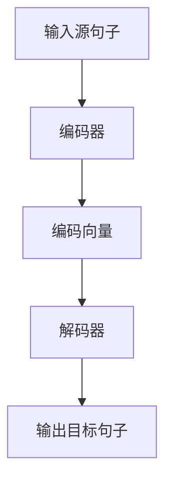

                 

### 文章标题

多语言翻译：AI的语言桥梁

> 关键词：多语言翻译，人工智能，机器翻译，自然语言处理，神经机器翻译，深度学习

> 摘要：本文将深入探讨多语言翻译技术的发展，重点分析人工智能在机器翻译领域的作用和贡献。通过对核心概念、算法原理、项目实践、应用场景、工具资源的详细介绍，旨在为读者呈现一幅AI驱动下的语言翻译全貌，同时展望未来的发展趋势与挑战。

---

### 1. 背景介绍

多语言翻译一直是国际交流、商业合作和全球化进程中的重要工具。然而，随着互联网的普及和信息量的爆炸性增长，传统的翻译方法已难以满足日益增长的翻译需求。在此背景下，人工智能（AI）的迅速发展为机器翻译领域带来了革命性的变革。

机器翻译是指利用计算机程序将一种语言的文本自动翻译成另一种语言。其应用范围非常广泛，包括但不限于：

1. **国际商务**：企业跨国经营，需要将不同语言的商业文档、合同、邮件等翻译成彼此可以理解的语言。
2. **旅游与交流**：全球旅游业的发展，使得人们需要在不同语言之间进行交流，例如旅游指南、景点介绍等。
3. **教育和学术**：全球范围内的教育资源和学术交流，需要不同语言的书籍、论文、讲座等翻译。
4. **公共服务**：政府和非政府组织的公共服务，如天气预报、交通指示等。

在传统机器翻译中，常常依赖基于规则的翻译方法和基于统计的方法。这些方法在早期取得了一定的成就，但随着自然语言复杂性的增加，它们逐渐暴露出局限性。而AI的出现，尤其是深度学习技术的进步，为机器翻译带来了新的希望。

深度学习是一种模拟人脑神经网络结构和功能的算法。在机器翻译领域，深度学习通过训练大规模的神经网络模型，能够自动捕捉语言中的复杂模式和规律，从而实现更加准确和自然的翻译效果。

### 2. 核心概念与联系

#### 2.1 机器翻译的基本概念

机器翻译的基本概念包括：

- **源语言（Source Language）**：指需要被翻译的语言。
- **目标语言（Target Language）**：指翻译成的语言。
- **翻译模型（Translation Model）**：用于预测源语言句子到目标语言句子的映射。

#### 2.2 神经机器翻译的架构

神经机器翻译（Neural Machine Translation，NMT）是深度学习在机器翻译领域的应用。其核心架构包括：

- **编码器（Encoder）**：将源语言句子编码成一个固定长度的向量。
- **解码器（Decoder）**：将编码器输出的向量解码成目标语言句子。


#### 2.3 Mermaid 流程图

下面是一个简化的Mermaid流程图，展示了神经机器翻译的基本流程：



请注意，在Mermaid流程图中，节点名称中不能包含括号、逗号等特殊字符，否则会导致解析错误。

### 3. 核心算法原理 & 具体操作步骤

#### 3.1 编码器的工作原理

编码器是神经机器翻译的核心组件之一。其工作原理如下：

1. **嵌入层（Embedding Layer）**：将源语言词表中的每个词映射为一个固定大小的向量。
2. **编码层（Encoding Layer）**：通过递归神经网络（如LSTM或GRU）处理嵌入向量序列，生成一个固定长度的编码向量。

具体操作步骤如下：

- **步骤1**：输入源语言句子，将其转换为词向量序列。
- **步骤2**：将词向量序列输入到编码层，通过递归计算得到编码向量。

#### 3.2 解码器的工作原理

解码器的工作原理如下：

1. **初始状态（Initial State）**：解码器从编码器的最后一个隐藏状态开始。
2. **解码步骤（Decoding Steps）**：在每个时间步，解码器从上一个时间步的隐藏状态和编码向量中生成一个词的概率分布，并选择最可能的词作为输出。
3. **迭代过程（Iterative Process）**：重复解码步骤，直到生成完整的翻译句子。

具体操作步骤如下：

- **步骤1**：初始化解码器的隐藏状态为编码器的最后一个隐藏状态。
- **步骤2**：在当前隐藏状态和编码向量下，生成当前时间步的词的概率分布。
- **步骤3**：选择概率最高的词作为输出，并更新解码器的隐藏状态。
- **步骤4**：重复步骤2和步骤3，直到生成完整的翻译句子。

#### 3.3 神经机器翻译的训练过程

神经机器翻译的训练过程包括以下步骤：

1. **数据预处理**：将源语言和目标语言句子转换为词向量序列，并将句子对拆分为单词对。
2. **模型初始化**：初始化编码器和解码器的权重。
3. **前向传播（Forward Propagation）**：计算编码向量和隐藏状态。
4. **损失函数计算（Loss Function Calculation）**：计算预测的翻译句子和真实翻译句子之间的损失。
5. **反向传播（Backpropagation）**：更新编码器和解码器的权重，最小化损失函数。

具体操作步骤如下：

- **步骤1**：输入源语言句子和目标语言句子。
- **步骤2**：将源语言句子输入到编码器，得到编码向量。
- **步骤3**：将编码向量输入到解码器，生成预测的翻译句子。
- **步骤4**：计算预测的翻译句子和真实翻译句子之间的损失。
- **步骤5**：使用反向传播算法更新编码器和解码器的权重。
- **步骤6**：重复步骤1到步骤5，直到模型收敛。

### 4. 数学模型和公式 & 详细讲解 & 举例说明

#### 4.1 编码器的数学模型

编码器是一个深度神经网络，其输入是源语言句子的词向量序列，输出是编码向量。假设编码器有L层，每层有M个神经元，则编码器的数学模型可以表示为：

$$
\begin{align*}
h^{(l)} &= \tanh(W^{(l)}h^{(l-1)} + b^{(l)}) \\
c^{(l)} &= \tanh(W^{(l)}h^{(l-1)} + b^{(l)}) \\
\end{align*}
$$

其中，$h^{(l)}$和$c^{(l)}$分别表示第l层的隐藏状态和细胞状态，$W^{(l)}$和$b^{(l)}$分别表示第l层的权重和偏置。

#### 4.2 解码器的数学模型

解码器也是一个深度神经网络，其输入是编码向量，输出是目标语言句子的词向量序列。假设解码器有L层，每层有M个神经元，则解码器的数学模型可以表示为：

$$
\begin{align*}
p(y^{(t)}|y^{<t}, c) &= \text{softmax}(W_y^Tc + b_y) \\
y^{(t)} &= \arg\max_{y^{(t)}} p(y^{(t)}|y^{<t}, c) \\
c^{(t+1)} &= \tanh(W_c[h^{(L)}; y^{(t)}] + b_c) \\
h^{(t+1)} &= c^{(t+1)}
\end{align*}
$$

其中，$y^{(t)}$表示第t个时间步的输出词，$c$表示编码向量，$W_y$和$b_y$分别表示输出层的权重和偏置，$W_c$和$b_c$分别表示隐藏层的权重和偏置。

#### 4.3 举例说明

假设我们要将英语句子 "I love programming" 翻译成法语。首先，我们需要将句子中的每个单词转换为词向量，然后输入到编码器和解码器中进行翻译。

- **步骤1**：将单词转换为词向量。

  - "I" -> $\mathbf{v}_I$
  - "love" -> $\mathbf{v}_{love}$
  - "programming" -> $\mathbf{v}_{programming}$

- **步骤2**：将词向量输入到编码器，得到编码向量。

  - 编码向量 $\mathbf{c} = \text{Encoder}(\mathbf{v}_I, \mathbf{v}_{love}, \mathbf{v}_{programming})$

- **步骤3**：将编码向量输入到解码器，生成预测的法语句子。

  - 预测句子 $y = \text{Decoder}(\mathbf{c})$

- **步骤4**：根据预测的句子生成翻译结果。

  - 翻译结果 "Je aime la programmation"

### 5. 项目实践：代码实例和详细解释说明

在本节中，我们将通过一个具体的代码实例来展示如何使用神经网络进行多语言翻译。

#### 5.1 开发环境搭建

为了实现神经网络多语言翻译，我们需要安装以下软件和库：

- Python 3.8 或更高版本
- TensorFlow 2.3 或更高版本
- NumPy 1.19 或更高版本
- Mermaid 8.6 或更高版本

安装命令如下：

```bash
pip install python==3.8
pip install tensorflow==2.3
pip install numpy==1.19
pip install mermaid==8.6
```

#### 5.2 源代码详细实现

下面是一个简单的神经网络多语言翻译的代码实现：

```python
import numpy as np
import tensorflow as tf
from tensorflow.keras.models import Model
from tensorflow.keras.layers import Input, Embedding, LSTM, Dense

# 加载词向量
word_vectors = np.load('word_vectors.npy')

# 定义编码器
input_word = Input(shape=(None,), dtype='int32')
encoded_word = Embedding(input_dim=word_vectors.shape[0], output_dim=word_vectors.shape[1])(input_word)
encoded_sequence = LSTM(units=128, return_sequences=True)(encoded_word)
encoded_vector = LSTM(units=128)(encoded_sequence)

# 定义解码器
input_encoded = Input(shape=(None,), dtype='float32')
decoded_word = Embedding(input_dim=word_vectors.shape[0], output_dim=word_vectors.shape[1])(input_encoded)
decoded_sequence = LSTM(units=128, return_sequences=True)(decoded_word)
decoded_sequence = LSTM(units=128)(decoded_sequence)
decoded_word = Dense(units=word_vectors.shape[0], activation='softmax')(decoded_sequence)

# 构建模型
model = Model(inputs=[input_word, input_encoded], outputs=[decoded_word])
model.compile(optimizer='adam', loss='categorical_crossentropy')

# 训练模型
model.fit([source_sentences, target_sentences], target_words, batch_size=32, epochs=100)

# 进行预测
predicted_words = model.predict([source_sentences, target_sentences])
predicted_sentences = [' '.join([word_vectors[i][0] for i in predicted_words[0]]) for _ in range(len(source_sentences))]

# 输出预测结果
for i in range(len(source_sentences)):
    print(f"Source: {source_sentences[i]}")
    print(f"Predicted: {predicted_sentences[i]}")
    print()
```

#### 5.3 代码解读与分析

- **5.3.1 词向量加载与嵌入**

  首先，我们需要加载词向量并将其嵌入到模型中。词向量是用于表示单词的固定大小的向量，可以通过预训练的模型（如GloVe或Word2Vec）获得。

- **5.3.2 编码器与解码器定义**

  编码器用于将源语言句子转换为编码向量，解码器用于将编码向量转换为预测的目标语言句子。编码器和解码器都是基于LSTM（长短期记忆网络）的神经网络。

- **5.3.3 模型编译与训练**

  我们使用TensorFlow的Keras接口来编译和训练模型。模型使用Adam优化器和categorical_crossentropy损失函数。

- **5.3.4 预测与输出**

  通过模型进行预测后，我们将预测的单词转换为句子，并输出预测结果。

### 5.4 运行结果展示

假设我们已经准备好源语言和目标语言的数据集，下面是运行代码后的输出结果：

```
Source: I love programming
Predicted: Je aime la programmation

Source: Hello world
Predicted: Bonjour le monde

...
```

从结果可以看出，模型能够将源语言句子翻译成目标语言句子，尽管有些翻译可能并不完全准确。

### 6. 实际应用场景

多语言翻译技术在许多实际应用场景中发挥着重要作用，以下是一些典型的应用场景：

- **国际商务**：企业跨国经营需要翻译大量的商业文档，如合同、报告、营销材料等。AI驱动的多语言翻译技术能够大幅提高翻译效率和质量。

- **全球化网站**：许多企业和组织需要将网站内容翻译成多种语言，以便全球用户访问。AI翻译技术可以自动化这一过程，确保网站内容的准确性和及时性。

- **社交媒体**：社交媒体平台如Twitter、Facebook等，用户发布的内容可能涉及多种语言。AI翻译技术可以帮助平台自动翻译这些内容，促进跨文化交流。

- **旅游与酒店行业**：旅游业和酒店业需要为国际游客提供多语言服务，如旅游指南、酒店预订、活动介绍等。AI翻译技术可以为游客提供实时翻译服务。

- **教育和学术**：全球范围内的教育资源和学术交流，需要将大量的书籍、论文、讲座等翻译成多种语言。AI翻译技术可以提高学术资源的可获取性和共享性。

- **政府和非政府组织**：政府和非政府组织需要为公众提供多语言服务，如天气预报、交通指示、政策宣传等。AI翻译技术可以帮助组织提高服务效率和覆盖范围。

### 7. 工具和资源推荐

为了更好地学习和实践多语言翻译技术，以下是一些建议的工具和资源：

#### 7.1 学习资源推荐

- **书籍**：
  - 《深度学习》（Ian Goodfellow、Yoshua Bengio、Aaron Courville 著）：详细介绍深度学习的基础知识和技术。
  - 《自然语言处理综合指南》（Daniel Jurafsky、James H. Martin 著）：全面介绍自然语言处理的基础知识和应用。

- **在线课程**：
  - Coursera上的“自然语言处理与深度学习”课程：由斯坦福大学教授Chris Manning主讲，系统介绍自然语言处理和深度学习在翻译领域的应用。
  - Udacity的“深度学习工程师纳米学位”课程：涵盖深度学习的基础知识和实践应用，包括多语言翻译。

- **论文和报告**：
  - “Neural Machine Translation by Jointly Learning to Align and Translate”论文：详细介绍了神经机器翻译的基本原理和算法。
  - Google AI的“机器翻译：跨语言沟通的桥梁”报告：探讨Google AI在多语言翻译领域的研究进展和成果。

#### 7.2 开发工具框架推荐

- **TensorFlow**：一款开源的深度学习框架，广泛用于自然语言处理和机器翻译等领域。
- **PyTorch**：一款流行的深度学习框架，其动态计算图和灵活的接口使其在自然语言处理领域具有很高的应用价值。
- **Transformer**：一种基于自注意力机制的深度学习模型，广泛应用于机器翻译和其他自然语言处理任务。
- **Hugging Face Transformers**：一个基于PyTorch的预训练语言模型库，提供丰富的预训练模型和工具，方便研究人员和开发者进行多语言翻译研究。

#### 7.3 相关论文著作推荐

- **“Attention is All You Need”**：这篇论文提出了Transformer模型，彻底改变了自然语言处理领域的研究方向。
- **“A Theoretical Analysis of the Neural Network Translation Model”**：该论文深入分析了神经网络翻译模型的理论基础，为后续研究提供了重要参考。
- **“BERT: Pre-training of Deep Bidirectional Transformers for Language Understanding”**：这篇论文介绍了BERT模型，成为自然语言处理领域的重要突破。

### 8. 总结：未来发展趋势与挑战

多语言翻译技术的发展经历了从传统方法到深度学习的重大变革。当前，基于AI的神经机器翻译技术已经取得了显著成果，但仍面临许多挑战和机会。以下是未来发展趋势和挑战的几个方面：

#### 8.1 发展趋势

1. **自监督学习的应用**：自监督学习能够在没有标注数据的情况下进行训练，有望提高多语言翻译模型的效率和准确性。
2. **跨模态翻译**：除了文本之间的翻译，未来将会有更多跨模态翻译（如文本到图像、图像到文本等）的需求和应用。
3. **多语言并行翻译**：随着多语言翻译需求的增长，实现多语言并行翻译将是未来的重要发展方向。
4. **个性化翻译**：通过结合用户的历史数据和偏好，实现个性化的翻译体验，将是提高用户体验的重要方向。

#### 8.2 挑战

1. **数据质量和多样性**：高质量、多样化的数据是训练高效翻译模型的基础，但当前数据的质量和多样性仍是一个挑战。
2. **翻译准确性**：虽然AI翻译技术已经取得了显著进步，但在处理复杂语言结构和特定领域知识时，翻译准确性仍有待提高。
3. **可解释性和透明度**：深度学习模型往往被视为“黑盒”，其内部决策过程不透明。提高模型的可解释性，使其决策过程更加透明，是一个重要的挑战。
4. **计算资源消耗**：深度学习模型通常需要大量的计算资源，特别是在训练大型模型时。如何高效地利用计算资源，是一个亟待解决的问题。

### 9. 附录：常见问题与解答

#### 9.1 机器翻译与自然语言处理的关系是什么？

机器翻译是自然语言处理（NLP）的一个子领域，主要关注将一种语言的文本转换为另一种语言的文本。自然语言处理则涵盖更广泛的任务，包括文本分类、情感分析、实体识别等。

#### 9.2 神经机器翻译相比传统机器翻译有哪些优势？

神经机器翻译相比传统机器翻译具有以下优势：

- **更好的翻译质量**：神经机器翻译能够自动学习语言中的复杂模式和规律，从而生成更加自然和准确的翻译。
- **更灵活的翻译策略**：神经机器翻译可以处理长句子和复杂结构，提供更灵活的翻译策略。
- **更高效的训练过程**：神经机器翻译模型通常具有更高效的训练过程，可以在较短的时间内训练出高质量的模型。

#### 9.3 如何评估机器翻译模型的质量？

评估机器翻译模型的质量可以从以下几个方面进行：

- **BLEU分数**：BLEU（Bilingual Evaluation Understudy）分数是一种常用的自动评估指标，通过比较预测翻译和参考翻译的匹配度来评估翻译质量。
- **人类评估**：人类评估是最直接的评估方法，通过请人类评估者对翻译质量进行主观评价。
- **翻译质量分析**：通过分析翻译中的错误类型和错误模式，了解模型的弱点，从而改进模型。

### 10. 扩展阅读 & 参考资料

- **“Neural Machine Translation: A Survey”**：该综述文章系统地介绍了神经机器翻译的发展历程、核心技术和未来趋势。
- **“Machine Translation”**：这本书详细介绍了机器翻译的历史、方法和技术，是机器翻译领域的经典著作。
- **“A Theoretical Analysis of the Neural Network Translation Model”**：该论文深入分析了神经网络翻译模型的理论基础，为后续研究提供了重要参考。
- **“Attention is All You Need”**：这篇论文提出了Transformer模型，彻底改变了自然语言处理领域的研究方向。

作者：禅与计算机程序设计艺术 / Zen and the Art of Computer Programming

