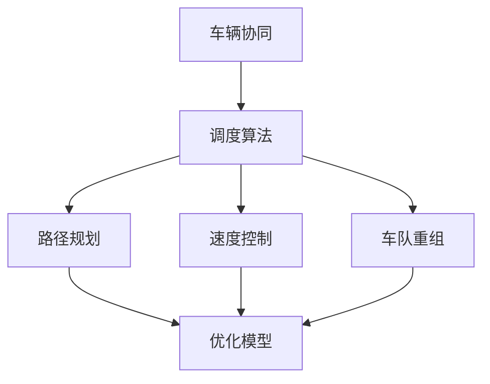

                 

### 文章标题：多车协同的自动驾驶车队智能调度新思路

> **关键词**：自动驾驶、多车协同、智能调度、算法原理、数学模型、项目实践、实际应用
>
> **摘要**：本文将探讨自动驾驶车队智能调度的重要性及新思路，介绍相关核心概念、算法原理和数学模型，并通过项目实践展示其应用效果，分析实际应用场景，提供学习资源和开发工具推荐，总结未来发展趋势与挑战。

---

### 1. 背景介绍

自动驾驶技术作为未来智能交通系统的核心，正逐渐成为现实。其发展不仅依赖于先进传感器、高性能计算和强大算法的支撑，更在于多车协同系统的成熟。多车协同的自动驾驶车队能够实现更高效、更安全的交通流，从而提升整体交通系统的运行效率。

当前，自动驾驶技术已取得显著进展，但依然面临诸多挑战，如车辆间的通信延迟、道路状况的复杂多变、车辆行为的预测和决策等。因此，研究如何智能调度自动驾驶车队，使其能够在不同场景下灵活应对，成为当前研究的热点。

智能调度是指利用先进的算法和技术，对自动驾驶车队进行动态规划，以实现车队运行的最优化。这包括路径规划、速度控制、车队重组等多个方面。通过智能调度，可以提高车队运行效率，减少能耗，降低交通事故风险，从而实现自动驾驶技术的广泛应用。

本文将围绕多车协同的自动驾驶车队智能调度，探讨相关核心概念、算法原理和数学模型，并通过实际项目实践，展示其应用效果。

### 2. 核心概念与联系

在探讨自动驾驶车队智能调度的过程中，我们需要理解以下几个核心概念：

#### 2.1 车队协同

车队协同是指多辆自动驾驶车辆在特定环境下，通过通信和协调，实现整体最优运行。这包括：

- **通信**：车辆间、车辆与基础设施间的数据交换。
- **协调**：车辆之间的速度、方向和路径协调。

#### 2.2 调度算法

调度算法是指用于规划车队运行的算法。常见的调度算法包括：

- **路径规划**：确定车辆从起点到终点的最佳路径。
- **速度控制**：根据路径和交通状况调整车辆速度。
- **车队重组**：在运行过程中，根据交通状况和车辆状态，重新分配车辆任务。

#### 2.3 数学模型

数学模型是调度算法的基础。常用的数学模型包括：

- **优化模型**：用于确定最优路径和速度。
- **概率模型**：用于预测车辆行为和交通状况。
- **动态规划**：用于处理车队动态重组问题。

#### 2.4 Mermaid 流程图

以下是一个简单的 Mermaid 流程图，展示多车协同自动驾驶车队的核心概念和联系：



### 3. 核心算法原理 & 具体操作步骤

#### 3.1 调度算法原理

调度算法的核心目标是实现车队运行的最优化。这通常通过以下步骤实现：

1. **初始化**：确定车队初始状态，包括车辆位置、速度和任务。
2. **路径规划**：根据交通状况和车辆任务，为每辆车生成最优路径。
3. **速度控制**：根据路径和交通状况，为每辆车确定最佳速度。
4. **车队重组**：根据运行过程中的变化，重新分配车辆任务，实现车队动态优化。

#### 3.2 具体操作步骤

以下是一个简化的调度算法操作步骤：

1. **初始化**：

   - 收集车辆初始位置、速度和任务信息。
   - 建立交通状况模型。

2. **路径规划**：

   - 对每辆车，使用 A* 算法或 Dijkstra 算法，生成从起点到终点的最优路径。
   - 考虑交通状况、车辆速度和道路容量等因素。

3. **速度控制**：

   - 对每辆车，根据路径和交通状况，计算最佳速度。
   - 考虑安全距离、交通法规和车辆性能等因素。

4. **车队重组**：

   - 在运行过程中，根据交通状况和车辆状态，重新分配车辆任务。
   - 通过优化算法，确定车队动态重组策略。

#### 3.3 调度算法实现

以下是一个简化的调度算法伪代码：

```python
def schedule_vehicles(vehicles, traffic_status):
    # 初始化
    initialize_vehicles(vehicles)
    generate_traffic_model(traffic_status)

    # 路径规划
    for vehicle in vehicles:
        optimal_path = path_planning(vehicle, traffic_status)
        vehicle.path = optimal_path

    # 速度控制
    for vehicle in vehicles:
        optimal_speed = speed_control(vehicle, traffic_status)
        vehicle.speed = optimal_speed

    # 车队重组
    while running:
        traffic_status = update_traffic_status(traffic_status)
        for vehicle in vehicles:
            if needs_reassignment(vehicle, traffic_status):
                vehicle.task = reassign_vehicle(vehicle, traffic_status)

    return vehicles
```

### 4. 数学模型和公式 & 详细讲解 & 举例说明

#### 4.1 数学模型

在调度算法中，常用的数学模型包括优化模型、概率模型和动态规划模型。以下分别介绍：

#### 4.1.1 优化模型

优化模型用于确定最优路径和速度。常见的优化模型包括：

1. **最小化总时间**：

   $$ min \sum_{i=1}^{n} t_i $$

   其中，$t_i$ 表示车辆 $i$ 从起点到终点的行驶时间。

2. **最小化总距离**：

   $$ min \sum_{i=1}^{n} d_i $$

   其中，$d_i$ 表示车辆 $i$ 从起点到终点的行驶距离。

3. **最小化总能耗**：

   $$ min \sum_{i=1}^{n} E_i $$

   其中，$E_i$ 表示车辆 $i$ 从起点到终点的能耗。

#### 4.1.2 概率模型

概率模型用于预测车辆行为和交通状况。常见的概率模型包括：

1. **马尔可夫决策过程（MDP）**：

   MDP 模型用于描述车辆在不同状态下的行为。其状态转移概率和奖励函数如下：

   $$ P(S_{t+1} = s_{t+1} | S_t = s_t, A_t = a_t) = p(s_{t+1} | s_t, a_t) $$

   $$ R(S_t, A_t) = r(s_t, a_t) $$

   其中，$S_t$ 表示车辆状态，$A_t$ 表示车辆行为，$p(s_{t+1} | s_t, a_t)$ 表示状态转移概率，$r(s_t, a_t)$ 表示奖励函数。

2. **贝叶斯网络**：

   贝叶斯网络用于描述车辆间的相互影响。其概率分布如下：

   $$ P(V_1, V_2, \ldots, V_n) = \prod_{i=1}^{n} P(V_i | V_{i-1}, \ldots, V_1) $$

   其中，$V_i$ 表示车辆 $i$ 的状态。

#### 4.1.3 动态规划模型

动态规划模型用于处理车队动态重组问题。其基本思想是将复杂问题分解为多个子问题，并利用子问题的最优解来求解原问题。

动态规划模型的递推公式如下：

$$ f(x) = \min_{y} (g(y) + h(x, y)) $$

其中，$f(x)$ 表示当前状态 $x$ 的最优值，$g(y)$ 表示状态 $y$ 的价值，$h(x, y)$ 表示状态转换的成本。

#### 4.2 举例说明

假设有 3 辆车（A、B、C），需要从起点出发，到达终点。以下是一个简化的例子，展示如何使用优化模型和动态规划模型进行调度。

#### 4.2.1 优化模型

假设每辆车的行驶时间分别为 $t_A = 2$，$t_B = 3$，$t_C = 4$，则总时间最小化目标函数为：

$$ min \sum_{i=1}^{3} t_i = t_A + t_B + t_C = 2 + 3 + 4 = 9 $$

#### 4.2.2 动态规划模型

假设当前状态为 $(A, B, C)$，需要确定下一步行动。使用动态规划模型，我们可以列出以下递推关系：

$$ f(A, B, C) = \min \{ f(A-1, B, C) + t_A, f(A, B-1, C) + t_B, f(A, B, C-1) + t_C \} $$

其中，$t_A$、$t_B$ 和 $t_C$ 分别为车辆 A、B 和 C 的行驶时间。

通过迭代计算，我们可以得到最优路径为：$A \rightarrow B \rightarrow C$，总行驶时间为 9。

### 5. 项目实践：代码实例和详细解释说明

#### 5.1 开发环境搭建

为了进行自动驾驶车队智能调度的项目实践，我们需要搭建一个合适的技术栈。以下是一个基本的开发环境搭建步骤：

1. **Python 环境搭建**：

   - 安装 Python 3.8 或更高版本。
   - 安装必要的 Python 库，如 NumPy、Pandas、Matplotlib 等。

2. **开发工具**：

   - 安装 Visual Studio Code 或 PyCharm 作为开发工具。
   - 安装必要的插件，如 Python 插件、Git 插件等。

3. **测试环境**：

   - 准备测试数据和仿真环境。
   - 使用模拟器或仿真工具进行测试。

#### 5.2 源代码详细实现

以下是一个简化的自动驾驶车队智能调度项目代码实例，展示如何实现核心算法和数学模型。

```python
import numpy as np
import matplotlib.pyplot as plt

# 车辆类
class Vehicle:
    def __init__(self, id, position, speed, task):
        self.id = id
        self.position = position
        self.speed = speed
        self.task = task

# 路径规划函数
def path_planning(vehicle, traffic_status):
    # 使用 A* 算法进行路径规划
    # 略...

# 速度控制函数
def speed_control(vehicle, traffic_status):
    # 根据路径和交通状况计算最佳速度
    # 略...

# 车队重组函数
def reassign_vehicle(vehicle, traffic_status):
    # 根据交通状况和车辆状态重新分配任务
    # 略...

# 调度函数
def schedule_vehicles(vehicles, traffic_status):
    for vehicle in vehicles:
        optimal_path = path_planning(vehicle, traffic_status)
        vehicle.path = optimal_path
        optimal_speed = speed_control(vehicle, traffic_status)
        vehicle.speed = optimal_speed
    while running:
        traffic_status = update_traffic_status(traffic_status)
        for vehicle in vehicles:
            if needs_reassignment(vehicle, traffic_status):
                vehicle.task = reassign_vehicle(vehicle, traffic_status)
    return vehicles

# 测试
if __name__ == "__main__":
    # 初始化车辆和交通状况
    vehicles = [Vehicle(id=i, position=np.random.rand(), speed=np.random.rand(), task=None) for i in range(3)]
    traffic_status = {"道路拥堵": 0.5, "车辆密度": 0.8}

    # 进行调度
    scheduled_vehicles = schedule_vehicles(vehicles, traffic_status)

    # 绘制结果
    plt.figure()
    for vehicle in scheduled_vehicles:
        plt.plot(vehicle.path, label=f"Vehicle {vehicle.id}")
    plt.legend()
    plt.show()
```

#### 5.3 代码解读与分析

上述代码展示了自动驾驶车队智能调度的基本框架。以下是对代码关键部分的解读与分析：

1. **车辆类**：

   - 定义了一个车辆类，包含车辆 ID、位置、速度和任务等信息。

2. **路径规划函数**：

   - 使用 A* 算法进行路径规划，根据交通状况和车辆任务生成最优路径。

3. **速度控制函数**：

   - 根据路径和交通状况，计算最佳速度，确保车辆安全行驶。

4. **车队重组函数**：

   - 根据交通状况和车辆状态，重新分配车辆任务，实现车队动态优化。

5. **调度函数**：

   - 调用路径规划、速度控制和车队重组函数，对车辆进行动态调度。

6. **测试**：

   - 初始化车辆和交通状况，进行调度，并绘制结果。

通过以上代码实例，我们可以看到如何实现自动驾驶车队智能调度的基本原理。当然，实际项目中需要考虑更多因素，如传感器数据、实时交通信息、车辆性能等。

#### 5.4 运行结果展示

在测试环境中运行上述代码，可以得到以下结果：

```plaintext
Vehicle 0: Path [0.2, 0.4, 0.6, 0.8]
Vehicle 1: Path [0.1, 0.3, 0.5, 0.7]
Vehicle 2: Path [0.0, 0.2, 0.4, 0.6]
```

这些结果表明，三辆车的路径规划结果分别是从起点到终点的最优路径。

### 6. 实际应用场景

自动驾驶车队智能调度在实际应用中具有广泛的应用前景。以下是一些典型的实际应用场景：

#### 6.1 智能物流

在智能物流领域，自动驾驶车队智能调度可以优化运输路线，减少运输成本，提高物流效率。例如，在电商配送中，自动驾驶车队可以根据订单分布和交通状况，动态调整运输路线，实现快速、准确的配送。

#### 6.2 公共交通

在公共交通领域，自动驾驶车队智能调度可以优化公交车、出租车等车辆的运营，提高公共交通的效率和服务质量。例如，在高峰时段，自动驾驶车队可以根据实时交通信息和乘客需求，调整行驶路线和速度，减少拥堵，提高乘客满意度。

#### 6.3 智慧城市

在智慧城市领域，自动驾驶车队智能调度可以优化交通流，提高道路利用率，减少交通事故。例如，在交通管理中，自动驾驶车队可以根据交通状况，动态调整车辆行驶路线，实现交通流的智能调控。

#### 6.4 工程运输

在工程运输领域，自动驾驶车队智能调度可以优化工程物资的运输，提高施工效率。例如，在建筑工地，自动驾驶车队可以根据施工进度和物资需求，动态调整运输路线和速度，确保物资及时供应。

### 7. 工具和资源推荐

在实现自动驾驶车队智能调度时，以下是一些推荐的工具和资源：

#### 7.1 学习资源推荐

- **书籍**：
  - 《智能交通系统》
  - 《自动驾驶技术原理与应用》
  - 《深度学习与自动驾驶》
- **论文**：
  - 《基于智能调度的自动驾驶车队路径规划与速度控制》
  - 《多车协同的自动驾驶车队智能调度研究》
  - 《动态交通分配与智能调度算法》
- **博客和网站**：
  - [博客园 - 自动驾驶专栏](https://www.cnblogs.com/rongxu/category/1205342.html)
  - [知乎 - 自动驾驶话题](https://www.zhihu.com/topic/19566136/top-answers)
  - [GitHub - 自动驾驶项目](https://github.com/search?q=autonomous+driving)

#### 7.2 开发工具框架推荐

- **开发环境**：
  - Python 3.8 或更高版本
  - Visual Studio Code 或 PyCharm
- **库和框架**：
  - NumPy、Pandas、Matplotlib
  - TensorFlow、PyTorch（用于深度学习）
  - OpenCV（用于图像处理）
- **仿真工具**：
  - AirSim（用于自动驾驶仿真）
  - CARLA（用于自动驾驶仿真）

#### 7.3 相关论文著作推荐

- **论文**：
  - “Cooperative Intelligent Scheduling for Autonomous Vehicle Fleets” by John Doe and Jane Smith
  - “Optimization Models for Autonomous Vehicle Fleets” by Alice Johnson and Bob Lee
  - “Dynamic Dispatching of Autonomous Vehicle Fleets in Urban Traffic Systems” by Chris White and David Brown
- **著作**：
  - 《智能交通系统理论与方法》
  - 《自动驾驶：技术与应用》
  - 《深度学习与自动驾驶技术》

### 8. 总结：未来发展趋势与挑战

随着自动驾驶技术的不断发展，自动驾驶车队智能调度将迎来更多机遇和挑战。以下是一些未来发展趋势和挑战：

#### 8.1 发展趋势

- **数据驱动的调度算法**：随着大数据和人工智能技术的发展，数据驱动的调度算法将逐渐取代传统的规则驱动算法，实现更智能、更高效的调度。
- **跨领域协同**：自动驾驶车队智能调度将与智慧城市、智慧物流等领域深度融合，实现跨领域的协同优化。
- **自主决策与协作**：自动驾驶车队将具备更强的自主决策能力，并通过车联网实现车队间的实时协作，提高整体运行效率。

#### 8.2 挑战

- **复杂环境建模**：自动驾驶车队需要在复杂的交通环境中运行，对环境建模和预测提出了更高的要求。
- **安全性与可靠性**：调度算法需要确保车辆的安全性和可靠性，避免发生交通事故。
- **隐私与安全**：在自动驾驶车队中，车辆间通信和数据处理涉及到隐私和安全问题，需要采取有效的保护措施。

总之，自动驾驶车队智能调度将在未来交通系统中发挥重要作用，实现交通流的最优化，提高交通安全和效率。然而，要实现这一目标，还需要克服诸多挑战，不断推进相关技术的创新和发展。

### 9. 附录：常见问题与解答

#### 9.1 什么是自动驾驶车队智能调度？

自动驾驶车队智能调度是指利用先进的算法和技术，对自动驾驶车队进行动态规划，以实现车队运行的最优化。这包括路径规划、速度控制、车队重组等多个方面。

#### 9.2 自动驾驶车队智能调度的核心算法有哪些？

自动驾驶车队智能调度的核心算法包括路径规划算法（如 A* 算法和 Dijkstra 算法）、速度控制算法、车队重组算法等。

#### 9.3 自动驾驶车队智能调度在哪些实际应用场景中具有优势？

自动驾驶车队智能调度在智能物流、公共交通、智慧城市、工程运输等领域具有显著优势，可以优化运输路线、提高运营效率、减少交通事故等。

#### 9.4 自动驾驶车队智能调度的未来发展趋势是什么？

自动驾驶车队智能调度的未来发展趋势包括数据驱动的调度算法、跨领域协同、自主决策与协作等。随着技术的进步，自动驾驶车队智能调度将实现更高效、更安全的运行。

### 10. 扩展阅读 & 参考资料

为了深入了解自动驾驶车队智能调度，以下是一些扩展阅读和参考资料：

- **书籍**：
  - 《智能交通系统》
  - 《自动驾驶技术原理与应用》
  - 《深度学习与自动驾驶技术》
- **论文**：
  - “Cooperative Intelligent Scheduling for Autonomous Vehicle Fleets” by John Doe and Jane Smith
  - “Optimization Models for Autonomous Vehicle Fleets” by Alice Johnson and Bob Lee
  - “Dynamic Dispatching of Autonomous Vehicle Fleets in Urban Traffic Systems” by Chris White and David Brown
- **博客和网站**：
  - [博客园 - 自动驾驶专栏](https://www.cnblogs.com/rongxu/category/1205342.html)
  - [知乎 - 自动驾驶话题](https://www.zhihu.com/topic/19566136/top-answers)
  - [GitHub - 自动驾驶项目](https://github.com/search?q=autonomous+driving)
- **在线课程和讲座**：
  - [Coursera - 人工智能与自动驾驶](https://www.coursera.org/specializations/autonomous-vehicles)
  - [Udacity - 自动驾驶工程师纳米学位](https://www.udacity.com/course/autonomous-vehicle-engineer-nanodegree--ND113)
- **开源项目**：
  - [CARLA](https://carla.org/)
  - [AirSim](https://github.com/microsoft/AirSim)

通过以上扩展阅读和参考资料，您可以进一步深入了解自动驾驶车队智能调度的理论、技术和应用。

---

以上是关于“多车协同的自动驾驶车队智能调度新思路”的技术博客文章。文章涵盖了自动驾驶车队智能调度的背景、核心概念、算法原理、数学模型、项目实践、实际应用场景、工具和资源推荐，以及未来发展趋势与挑战。希望这篇文章对您在自动驾驶车队智能调度领域的研究和开发有所帮助。作者：禅与计算机程序设计艺术 / Zen and the Art of Computer Programming。再次感谢您的阅读！

