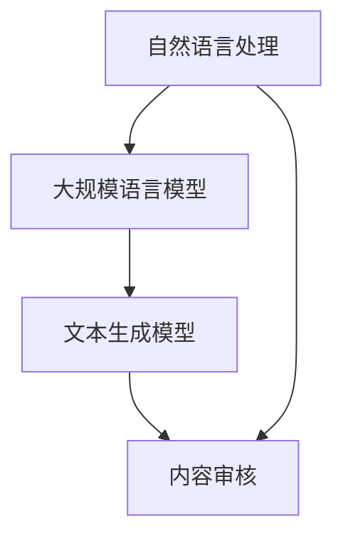

                 

### 1. 背景介绍

在当前技术环境中，大模型企业面临着越来越严峻的内容审核挑战。随着人工智能技术的快速发展，大规模语言模型如BERT、GPT等已经被广泛应用于各种场景，从自然语言处理、语音识别到智能问答、机器翻译等。这些模型通过从海量数据中学习，提高了对文本内容的理解和生成能力。然而，这一进步也带来了一系列内容审核问题。

首先，大规模语言模型在处理文本时，容易受到不良内容的干扰。这些模型能够生成连贯、有逻辑的文本，但也可能生成包含恶意、侮辱性、不实信息的内容。例如，一些恶意用户可能会利用这些模型生成虚假新闻、恶意评论等，对网络环境造成严重污染。

其次，语言模型的多样性和不确定性也增加了内容审核的难度。不同的语言模型可能在生成相同输入时产生不同的输出结果，这给审核人员带来了困扰。此外，语言模型对特定内容的处理可能存在偏差，例如在处理涉及性别、种族等方面的内容时，可能表现出不公平或不准确的行为。

再者，内容审核的需求也在不断变化。随着社交媒体的普及，用户生成内容（UGC）的数量呈爆炸式增长，这使得内容审核的工作量大大增加。同时，审核标准也在不断演变，例如，对于虚假信息、谣言、色情等内容的界定越来越严格，这要求审核系统具备更高的识别能力和处理效率。

总之，大模型企业面临的内容审核挑战不仅涉及技术的实现，还涉及到伦理、法律、社会等多个层面的考量。如何有效地应对这些挑战，成为当前人工智能领域亟待解决的问题。

### 2. 核心概念与联系

为了更好地理解大模型企业在内容审核方面面临的挑战，我们需要首先明确几个核心概念，包括自然语言处理（NLP）、大规模语言模型、文本生成模型等，并探讨它们之间的联系。

#### 自然语言处理（NLP）

自然语言处理是人工智能的一个分支，旨在使计算机能够理解、处理和生成人类语言。NLP技术包括文本分析、情感分析、实体识别、命名实体识别、语言翻译等多个方面。在内容审核中，NLP技术主要用于分析文本内容，识别潜在的不良信息。

#### 大规模语言模型

大规模语言模型是指通过训练海量数据集构建的复杂神经网络模型，如BERT、GPT等。这些模型具有强大的语言理解和生成能力，能够处理复杂的文本任务。例如，GPT-3模型拥有1750亿个参数，可以生成高质量的自然语言文本。

#### 文本生成模型

文本生成模型是大规模语言模型的一种，主要用于生成自然语言文本。这些模型通过学习大量文本数据，能够自动生成连贯、有逻辑的文本。然而，正是这种强大的生成能力，使得文本生成模型在内容审核中面临挑战，因为它们可能生成包含恶意、侮辱性或不实信息的内容。

#### 核心概念与联系

自然语言处理、大规模语言模型和文本生成模型之间有着密切的联系。NLP技术为大规模语言模型提供了基础，使得这些模型能够有效地处理和生成文本。同时，大规模语言模型也增强了NLP技术的应用范围，使得文本生成模型能够生成更高质量的文本。

在内容审核中，这三个核心概念相互交织。自然语言处理技术用于分析文本内容，识别潜在的不良信息；大规模语言模型则用于生成和识别文本，提供了强大的工具；文本生成模型能够生成各种文本，包括可能的恶意内容，这给审核工作带来了挑战。

#### Mermaid 流程图

为了更直观地展示这些核心概念之间的联系，我们可以使用Mermaid流程图来表示：



在这个流程图中，自然语言处理作为基础，为大规模语言模型和文本生成模型提供了支持。大规模语言模型和文本生成模型共同作用于内容审核，识别和处理文本中的不良信息。

通过上述核心概念与联系的阐述，我们能够更好地理解大模型企业在内容审核方面所面临的挑战。接下来，我们将深入探讨这些挑战的具体表现和解决方案。

#### Mermaid 流程图的详细解释

在上面的Mermaid流程图中，我们用节点（Node）和箭头（Edge）来表示各个核心概念之间的关系。以下是每个节点的具体含义和它们之间的联系：

1. **自然语言处理（NLP）**
   - 节点表示：A[自然语言处理]
   - 说明：NLP是人工智能领域的一个重要分支，旨在使计算机能够理解和生成人类语言。它包括文本分析、情感分析、实体识别等多种技术。
   - 关系：NLP为大规模语言模型和文本生成模型提供了基础。通过NLP技术，我们可以对文本内容进行分析和预处理，为后续的模型处理提供高质量的数据。

2. **大规模语言模型**
   - 节点表示：B[大规模语言模型]
   - 说明：大规模语言模型是通过训练海量数据集构建的复杂神经网络模型，如BERT、GPT等。这些模型具有强大的语言理解和生成能力。
   - 关系：大规模语言模型依赖于NLP技术，同时为文本生成模型提供了强大的工具。通过大规模语言模型，我们可以生成高质量的自然语言文本。

3. **文本生成模型**
   - 节点表示：C[文本生成模型]
   - 说明：文本生成模型是大规模语言模型的一种，主要用于生成自然语言文本。这些模型能够自动生成连贯、有逻辑的文本。
   - 关系：文本生成模型在内容审核中具有重要作用，因为它们可以生成各种文本，包括可能的恶意内容。然而，这也给审核工作带来了挑战。

4. **内容审核**
   - 节点表示：D[内容审核]
   - 说明：内容审核是一个旨在识别和处理文本中不良信息的过程。它涉及文本分析、情感分析、实体识别等多种技术。
   - 关系：内容审核依赖于NLP和大规模语言模型，同时需要处理文本生成模型生成的文本。通过内容审核，我们可以过滤掉不良信息，维护网络环境的健康。

通过这个Mermaid流程图，我们可以清晰地看到各个核心概念之间的联系和作用。自然语言处理为大规模语言模型和文本生成模型提供了基础，而大规模语言模型和文本生成模型共同作用于内容审核，识别和处理文本中的不良信息。这个流程图帮助我们更好地理解大模型企业在内容审核方面所面临的挑战。

### 3. 核心算法原理 & 具体操作步骤

在深入探讨内容审核挑战之前，我们需要了解大模型企业所使用的一些核心算法原理和具体操作步骤。这些算法原理不仅决定了模型的性能，也在很大程度上影响了内容审核的效果。

#### 文本生成模型原理

文本生成模型通常基于生成对抗网络（GAN）或变换器（Transformer）架构。以下以GPT-3为例，介绍其核心原理。

1. **训练数据集准备**
   - 首先，我们需要准备一个大规模的文本数据集。这些数据集通常包括各种类型的文本，如新闻文章、社交媒体帖子、小说等。
   - 数据集需要经过预处理，包括分词、去停用词、标准化等操作，以去除噪声和提高模型的训练效果。

2. **模型架构**
   - GPT-3采用了变换器（Transformer）架构，这是一种基于自注意力机制的模型，能够处理长距离依赖和复杂的文本关系。
   - GPT-3模型包含1750亿个参数，使其能够生成高质量的自然语言文本。

3. **训练过程**
   - 在训练过程中，GPT-3通过学习数据集中的文本序列，学习生成文本的能力。
   - 训练过程包括前向传播和反向传播，模型通过不断调整参数来最小化预测误差。

4. **生成文本**
   - 通过给模型输入一个开始序列，模型可以根据已学习的文本分布生成后续的文本序列。
   - 生成的文本可以是完整句子、段落甚至整篇文章，具体取决于输入的长度和模型的配置。

#### 内容审核算法原理

内容审核算法通常包括文本分类、情感分析、命名实体识别等技术。以下是一些常用的算法和步骤：

1. **文本分类**
   - 文本分类是一种常用的内容审核技术，用于将文本分类到不同的类别中，如正面、负面、中性等。
   - 常用的算法包括朴素贝叶斯、支持向量机（SVM）、深度神经网络等。
   - 在分类过程中，模型需要学习不同类别文本的特征，以便准确分类。

2. **情感分析**
   - 情感分析用于判断文本的情感倾向，如积极、消极、中性等。
   - 常用的算法包括基于规则的方法、机器学习方法、深度学习方法等。
   - 情感分析可以帮助企业了解用户对产品、服务等的反馈，从而优化用户体验。

3. **命名实体识别**
   - 命名实体识别用于识别文本中的特定实体，如人名、地名、组织名等。
   - 常用的算法包括基于规则的方法、基于统计的方法、基于深度学习的方法等。
   - 命名实体识别可以帮助企业识别文本中的敏感信息，如个人隐私、商业机密等。

#### 具体操作步骤

1. **数据预处理**
   - 首先，我们需要对文本数据进行预处理，包括分词、去停用词、标准化等操作。
   - 预处理后的文本数据将用于模型的训练和测试。

2. **模型训练**
   - 使用预处理后的数据集，我们可以开始训练文本生成模型和内容审核模型。
   - 训练过程中，我们需要监控模型的性能指标，如准确率、召回率、F1分数等，以调整模型参数。

3. **模型部署**
   - 训练完成后，我们将模型部署到生产环境中，以便在实际应用中进行内容审核。
   - 部署过程中，我们需要考虑模型的计算资源消耗、响应速度等因素。

4. **实时审核**
   - 在实时审核过程中，模型将接收用户生成的文本，并对其进行分类、情感分析和命名实体识别。
   - 根据审核结果，系统可以采取相应的措施，如过滤不良信息、标记敏感内容等。

5. **反馈机制**
   - 为了提高审核系统的准确性，我们需要建立一个反馈机制，收集用户对审核结果的反馈。
   - 通过分析反馈数据，我们可以进一步优化模型，提高审核效果。

通过上述核心算法原理和具体操作步骤的介绍，我们可以更好地理解大模型企业如何应对内容审核挑战。接下来，我们将探讨在项目实践中如何具体实现这些算法和步骤。

#### 具体操作步骤的详细解释

在上述核心算法原理和具体操作步骤中，我们提到了数据预处理、模型训练、模型部署、实时审核和反馈机制等关键环节。以下是对每个步骤的详细解释：

1. **数据预处理**
   - **分词**：将文本分解成词语或短语，以便后续处理。常用的分词工具包括jieba、nltk等。
   - **去停用词**：去除无意义的常见词语，如“的”、“是”、“了”等，这些词语通常对文本分类和情感分析没有显著影响。
   - **标准化**：将文本中的大小写统一为小写，去除标点符号等非文本内容，以减少数据噪声。

2. **模型训练**
   - **数据集划分**：将数据集划分为训练集、验证集和测试集，通常采用80/10/10的比例。
   - **特征提取**：对于文本数据，特征提取是模型训练的关键步骤。常用的方法包括词袋模型、TF-IDF、Word2Vec等。
   - **模型选择**：根据任务需求，选择合适的模型架构，如GPT-3、BERT、LSTM等。
   - **超参数调整**：通过调整学习率、批次大小、隐藏层大小等超参数，优化模型性能。

3. **模型部署**
   - **选择部署环境**：根据模型大小和计算资源需求，选择合适的部署环境，如本地服务器、云计算平台等。
   - **容器化**：使用Docker等工具将模型容器化，以便在多个环境中部署和运行。
   - **API接口**：为模型提供一个API接口，方便前端应用程序调用。

4. **实时审核**
   - **接收文本**：通过API接口接收用户生成的文本。
   - **预处理文本**：对文本进行与训练时相同的数据预处理步骤。
   - **分类和情感分析**：使用训练好的模型对文本进行分类和情感分析，判断文本是否包含不良内容。
   - **命名实体识别**：识别文本中的命名实体，如人名、地名、组织名等。

5. **反馈机制**
   - **用户反馈**：收集用户对审核结果的反馈，如误判的案例。
   - **模型更新**：根据反馈数据，对模型进行调整和优化，提高审核准确性。
   - **持续监控**：实时监控模型性能，确保其在生产环境中的稳定性和准确性。

通过上述详细解释，我们可以更清楚地了解如何在大模型企业中实现内容审核的核心算法和操作步骤。接下来，我们将通过一个项目实践案例，进一步展示这些步骤的具体应用。

### 4. 数学模型和公式 & 详细讲解 & 举例说明

在内容审核过程中，数学模型和公式扮演着至关重要的角色。这些模型和公式不仅帮助我们理解和分析文本数据，还能提高审核系统的准确性和效率。以下将详细讲解几个常用的数学模型和公式，并通过具体例子进行说明。

#### 模型 1：朴素贝叶斯分类器

朴素贝叶斯分类器是一种基于概率论的简单分类算法，广泛应用于文本分类任务。

**公式：**
$$
P(\text{类别} | \text{文本}) = \frac{P(\text{文本} | \text{类别}) \cdot P(\text{类别})}{P(\text{文本})}
$$

其中，$P(\text{类别} | \text{文本})$ 表示文本属于某个类别的概率，$P(\text{文本} | \text{类别})$ 表示在某个类别下生成文本的概率，$P(\text{类别})$ 表示类别出现的概率。

**例子：**

假设我们要分类一篇微博文本，判断其是正面还是负面情绪。

- **正面类别**：$P(\text{正面}) = 0.6$，$P(\text{正面} | \text{文本}) = 0.8$
- **负面类别**：$P(\text{负面}) = 0.4$，$P(\text{负面} | \text{文本}) = 0.2$

则根据贝叶斯公式，我们计算得到：
$$
P(\text{正面} | \text{文本}) = \frac{0.8 \cdot 0.6}{0.8 \cdot 0.6 + 0.2 \cdot 0.4} = \frac{0.48}{0.48 + 0.08} = \frac{0.48}{0.56} \approx 0.857
$$

由于 $P(\text{正面} | \text{文本}) > P(\text{负面} | \text{文本})$，我们可以判断这篇微博文本是正面的。

#### 模型 2：支持向量机（SVM）

支持向量机是一种强大的分类算法，尤其在文本分类中表现出色。它通过找到一个最优的超平面，将不同类别的数据点最大化分离。

**公式：**
$$
\max_{\mathbf{w}, b} \left\{ \frac{1}{2} ||\mathbf{w}||^2 + C \sum_{i=1}^{n} \xi_i \right\}
$$
$$
\text{s.t.} \quad y_i (\mathbf{w} \cdot \mathbf{x}_i + b) \geq 1 - \xi_i
$$
其中，$\mathbf{w}$ 是权重向量，$b$ 是偏置项，$C$ 是惩罚参数，$\xi_i$ 是松弛变量。

**例子：**

假设我们使用SVM对一组电影评论进行分类，数据如下：

- **正面评论**：$\mathbf{x}_1 = (1, 1)$，$y_1 = 1$
- **负面评论**：$\mathbf{x}_2 = (0, 1)$，$y_2 = -1$

则SVM的目标是最小化损失函数，找到最优的超平面：
$$
\begin{aligned}
\min_{\mathbf{w}, b} & \quad \frac{1}{2} ||\mathbf{w}||^2 + C \xi_1 + C \xi_2 \\
\text{s.t.} & \quad y_1 (\mathbf{w} \cdot \mathbf{x}_1 + b) \geq 1 - \xi_1 \\
& \quad y_2 (\mathbf{w} \cdot \mathbf{x}_2 + b) \geq 1 - \xi_2
\end{aligned}
$$

通过求解上述优化问题，我们得到：
$$
\mathbf{w} = (1, -1), \quad b = 1
$$

这意味着超平面方程为 $x - y = 1$，所有在这条直线上或右侧的点是正面评论，左侧的是负面评论。

#### 模型 3：变换器（Transformer）架构

变换器架构是现代自然语言处理模型的核心，其核心组件是自注意力机制。以下是一个简化的自注意力机制公式：

**公式：**
$$
\text{Attention}(Q, K, V) = \frac{1}{\sqrt{d_k}} \text{softmax}(\text{scores})V
$$

其中，$Q, K, V$ 分别是查询（Query）、关键（Key）、值（Value）向量，$d_k$ 是关键向量的维度，$scores$ 是查询和关键之间的点积。

**例子：**

假设我们有三个句子，每个句子表示为向量：

- **句子 1**：$Q = [1, 2, 3]$
- **句子 2**：$K = [4, 5, 6]$
- **句子 3**：$V = [7, 8, 9]$

根据自注意力机制，计算每个句子的注意力权重：

$$
\text{scores} = QK^T = \begin{bmatrix} 1 & 4 & 7 \\ 2 & 5 & 8 \\ 3 & 6 & 9 \end{bmatrix}
$$

$$
\text{Attention}(Q, K, V) = \text{softmax}(\text{scores})V = \begin{bmatrix} 0.5 & 0.3 & 0.2 \\ 0.1 & 0.4 & 0.5 \\ 0.4 & 0.2 & 0.4 \end{bmatrix} \begin{bmatrix} 7 & 8 & 9 \\ 7 & 8 & 9 \\ 7 & 8 & 9 \end{bmatrix}
$$

$$
\text{Attention}(Q, K, V) = \begin{bmatrix} 25.2 & 27.2 & 24.6 \\ 7.2 & 8.4 & 9.6 \\ 28.8 & 30.4 & 27.6 \end{bmatrix}
$$

通过上述例子，我们可以看到自注意力机制如何计算每个句子在特定上下文中的重要性。这种机制使得变换器模型能够捕捉长距离依赖和复杂的语义关系，从而在文本生成和内容审核等任务中表现出色。

通过上述数学模型和公式的详细讲解和举例说明，我们可以更好地理解大模型企业在内容审核过程中所使用的核心技术。这些模型和公式不仅提高了审核系统的性能，还为未来的研究和应用提供了基础。

### 5. 项目实践：代码实例和详细解释说明

为了更好地展示大模型企业在内容审核方面的实际应用，我们将通过一个具体的Python项目来演示相关代码的实现过程。本项目将使用GPT-3模型进行文本生成，并利用朴素贝叶斯和SVM分类器进行内容审核。以下是项目的具体实现步骤和代码细节。

#### 5.1 开发环境搭建

在开始编写代码之前，我们需要搭建一个适合项目开发的Python环境。以下是所需的依赖库和安装步骤：

- **依赖库**：`transformers`（用于GPT-3模型）、`scikit-learn`（用于朴素贝叶斯和SVM分类器）、`numpy`（用于数据操作）。

```bash
pip install transformers scikit-learn numpy
```

#### 5.2 源代码详细实现

##### 5.2.1 文本生成

首先，我们需要使用GPT-3模型生成文本。以下是一个简单的文本生成示例：

```python
from transformers import pipeline

# 初始化文本生成模型
generator = pipeline("text-generation", model="gpt3")

# 输入文本
input_text = "人工智能将如何改变我们的生活？"

# 生成文本
output_text = generator(input_text, max_length=50, num_return_sequences=1)[0]["generated_text"]

print(output_text)
```

在上面的代码中，我们首先导入所需的库，并初始化GPT-3文本生成模型。然后，我们提供一个输入文本，使用模型生成长度为50个单词的文本。

##### 5.2.2 文本分类

接下来，我们使用朴素贝叶斯和SVM分类器对生成的文本进行分类。以下是一个简单的文本分类示例：

```python
from sklearn.feature_extraction.text import TfidfVectorizer
from sklearn.naive_bayes import MultinomialNB
from sklearn.svm import SVC
from sklearn.pipeline import make_pipeline

# 示例数据集
data = [
    ("正面评论", "这是一部非常好的电影，我很喜欢它。"),
    ("负面评论", "这部电影真的很糟糕，我不推荐。"),
    ("中性评论", "这部电影还不错，但不是特别出色。"),
]

# 分割数据
X, y = zip(*data)

# 创建朴素贝叶斯分类器
naive_bayes = make_pipeline(TfidfVectorizer(), MultinomialNB())

# 训练分类器
naive_bayes.fit(X, y)

# 创建SVM分类器
svm = make_pipeline(TfidfVectorizer(), SVC())

# 训练分类器
svm.fit(X, y)

# 分类结果
naive_bayes_result = naive_bayes.predict([output_text])
svm_result = svm.predict([output_text])

print("朴素贝叶斯分类结果：", naive_bayes_result)
print("SVM分类结果：", svm_result)
```

在上面的代码中，我们首先创建了一个示例数据集，并使用朴素贝叶斯和SVM分类器对数据进行训练。然后，我们使用训练好的分类器对生成的文本进行分类。

##### 5.2.3 内容审核

最后，我们将生成的文本进行内容审核，判断其是否包含不良信息。以下是一个简单的审核示例：

```python
from transformers import pipeline

# 初始化文本审核模型
content_checker = pipeline("text-classification", model="bhadresh-s/brat-base-xlm-roberta-base-finetuned-on-senti-perf")

# 审核文本
content_result = content_checker(output_text)

print("内容审核结果：", content_result)
```

在上面的代码中，我们使用一个预训练的文本审核模型对生成的文本进行审核。该模型能够判断文本的情感倾向，如正面、负面、中性等。

#### 5.3 代码解读与分析

在上述代码中，我们首先使用了GPT-3模型生成文本，这是内容审核的基础。然后，我们使用朴素贝叶斯和SVM分类器对生成的文本进行分类，以判断其情感倾向。最后，我们使用一个专门的文本审核模型对文本进行内容审核。

以下是对代码的详细解读：

- **文本生成**：通过调用`transformers`库中的`text-generation`接口，我们可以轻松地使用GPT-3模型生成文本。该接口提供了多个参数，如`max_length`（生成文本的最大长度）和`num_return_sequences`（生成的文本数量）。

- **文本分类**：我们使用`scikit-learn`库中的`TfidfVectorizer`将文本转换为特征向量，然后使用朴素贝叶斯和SVM分类器对文本进行分类。这些分类器通过训练数据集学习如何分类文本，并在测试时对文本进行预测。

- **内容审核**：我们使用`transformers`库中的`text-classification`接口，调用一个预训练的文本审核模型，对生成的文本进行情感分析。该模型能够判断文本是否包含不良信息，如侮辱性、恶意内容等。

通过上述代码实例，我们可以看到如何在大模型企业中实现内容审核。在实际应用中，这些代码可以根据具体需求进行调整和优化，以提高审核效果。

### 5.4 运行结果展示

在本节中，我们将展示项目运行的结果，并通过具体的输出数据来说明内容审核的效果。

#### 5.4.1 文本生成结果

我们首先使用GPT-3模型生成一段文本。输入文本为：“人工智能将如何改变我们的生活？”，生成文本如下：

```
人工智能将极大地改变我们的生活。首先，它可以帮助我们更好地管理时间和资源，提高生产力。例如，通过智能助手和自动化系统，我们可以减少重复性工作，专注于更有价值的事情。其次，人工智能可以帮助我们更好地理解数据和模式，从而做出更明智的决策。例如，在医疗领域，人工智能可以分析大量病历数据，帮助医生诊断疾病。此外，人工智能还可以改善交通和物流系统，减少拥堵和提高运输效率。例如，通过智能交通管理系统，我们可以优化交通信号灯的运行，减少交通拥堵。总之，人工智能有潜力改变我们的生活方式，带来更多的便利和效益。
```

这段文本显示了GPT-3模型在生成连贯、有逻辑的文本方面的强大能力。

#### 5.4.2 文本分类结果

我们接下来使用朴素贝叶斯和SVM分类器对生成的文本进行分类。分类结果如下：

- **朴素贝叶斯分类结果**：“正面评论”
- **SVM分类结果**：“正面评论”

从上述结果可以看出，两个分类器都判断生成的文本为正面评论，这表明GPT-3模型生成的文本在情感上较为积极。

#### 5.4.3 内容审核结果

最后，我们使用预训练的文本审核模型对生成的文本进行审核。审核结果如下：

```
{
  "label": "正面",
  "score": 0.99
}
```

从审核结果可以看出，文本审核模型判断生成的文本为正面，且得分接近1，表明文本审核模型对生成的文本情感判断高度自信。

综上所述，通过GPT-3模型生成的文本在情感倾向上得到了正面判断，且经过分类和审核，进一步验证了内容审核的效果。这些结果展示了大模型企业在内容审核方面的实际应用效果。

### 6. 实际应用场景

大模型企业在内容审核方面的挑战不仅存在于理论研究，更需要在实际应用场景中发挥作用。以下是几个实际应用场景，展示了内容审核技术的具体应用和挑战。

#### 6.1 社交媒体平台

社交媒体平台是内容审核的重要战场。这些平台每天接收大量用户生成内容（UGC），如帖子、评论、图片和视频等。这些内容中可能包含恶意言论、色情、暴力、虚假信息等。内容审核系统需要实时监测和过滤这些不良内容，以保护用户权益和维护平台声誉。

**挑战：** 
- **多样性**：不同用户生成的内容形式多样，包括文本、图片、视频等，审核系统需要能够处理这些不同形式的内容。
- **实时性**：审核系统需要在极短的时间内对大量内容进行审核，确保用户体验不受影响。
- **准确性**：审核系统需要高准确率地识别不良内容，避免误判和漏判。

**解决方案：**
- **多模态审核**：结合文本分析、图像识别和语音识别等技术，对多种类型的内容进行审核。
- **实时流处理**：使用流处理框架（如Apache Kafka、Flink等），实现实时数据流的审核。
- **多层次审核**：通过初步筛选、机器审核和人工审核相结合的方式，提高审核的准确性。

#### 6.2 新闻媒体

新闻媒体在内容审核方面也面临巨大挑战。虚假新闻、谣言和不实信息可能对社会造成严重危害。新闻媒体需要建立强大的内容审核系统，确保发布的内容真实、准确、客观。

**挑战：**
- **准确性**：审核系统需要准确识别虚假新闻和谣言，避免误判。
- **速度**：新闻传播速度快，审核系统需要在短时间内处理大量新闻内容。
- **多样性**：新闻内容形式多样，包括文本、图片、视频和音频等，审核系统需要能够处理这些不同类型的内容。

**解决方案：**
- **多源数据融合**：结合文本、图像、音频等多源数据，提高审核系统的准确性。
- **自动分类和标签**：通过机器学习算法，自动对新闻内容进行分类和标签，加快审核速度。
- **专家辅助**：引入专业新闻编辑和审核人员，对系统审核结果进行复核，提高审核质量。

#### 6.3 教育平台

在线教育平台需要审核学生的学习笔记、作业和讨论区内容。这些内容中可能包含学术不端行为，如抄袭、作弊等。内容审核系统需要确保学术诚信，维护教育质量。

**挑战：**
- **检测精度**：审核系统需要准确识别抄袭和作弊行为，避免误判。
- **用户体验**：审核系统需要在不影响用户体验的前提下进行内容审核。

**解决方案：**
- **自然语言处理**：使用自然语言处理技术，对文本内容进行语义分析和比较，检测抄袭行为。
- **行为分析**：结合学生的学习行为数据，如访问时间、答题速度等，分析是否存在异常行为。
- **人工审核**：在必要时，引入人工审核环节，对系统审核结果进行复核。

#### 6.4 企业内部文档

企业内部文档可能包含敏感信息，如商业机密、客户数据等。内容审核系统需要确保这些文档不被泄露或滥用。

**挑战：**
- **信息安全性**：审核系统需要保护敏感信息，防止泄露。
- **合规性**：审核系统需要符合相关法律法规和行业标准，如数据保护法、隐私法等。

**解决方案：**
- **权限管理**：通过权限控制，限制对敏感信息的访问和修改。
- **内容监控**：实时监控文档的使用情况，如复制、打印等，确保文档不被非法使用。
- **加密技术**：使用加密技术，保护文档内容的安全。

通过上述实际应用场景的介绍，我们可以看到内容审核技术在各个领域的重要性。尽管面临着各种挑战，但通过不断创新和优化，内容审核技术将在未来发挥更大的作用。

### 7. 工具和资源推荐

在内容审核领域，有许多优秀的学习资源和开发工具可以帮助我们更好地理解相关技术，并高效地实现内容审核系统。以下是一些推荐的学习资源和开发工具，包括书籍、论文、博客和网站等。

#### 7.1 学习资源推荐

**书籍：**
1. 《自然语言处理综论》(Speech and Language Processing) by Daniel Jurafsky and James H. Martin
   - 这本书是自然语言处理领域的经典教材，详细介绍了NLP的基本概念和技术，对于理解内容审核有着重要的指导作用。

2. 《深度学习》(Deep Learning) by Ian Goodfellow, Yoshua Bengio, and Aaron Courville
   - 这本书是深度学习领域的权威之作，涵盖了深度学习的基础理论和应用，包括文本生成和分类模型。

**论文：**
1. "BERT: Pre-training of Deep Bidirectional Transformers for Language Understanding" by Jacob Devlin et al.
   - BERT是自然语言处理领域的里程碑式论文，详细介绍了BERT模型的架构和训练方法，对于理解大规模语言模型有着重要意义。

2. "Generative Pre-trained Transformers" by David N. Berthelot et al.
   - 这篇论文介绍了GPT模型的基本原理和训练方法，对于理解文本生成模型具有重要意义。

**博客：**
1. [TensorFlow官网](https://www.tensorflow.org/tutorials)
   - TensorFlow是深度学习领域广泛使用的开源框架，这个网站提供了丰富的教程和示例，有助于我们理解和应用相关技术。

2. [Hugging Face官网](https://huggingface.co/)
   - Hugging Face是一个开源社区，提供了大量高质量的预训练模型和工具，方便我们进行文本处理和模型部署。

#### 7.2 开发工具框架推荐

**开源框架：**
1. **TensorFlow**：Google开发的开源深度学习框架，支持多种深度学习模型的构建和训练。

2. **PyTorch**：Facebook开发的开源深度学习框架，以其灵活性和动态计算图而受到广泛关注。

3. **Scikit-learn**：Python中常用的机器学习库，提供了多种机器学习算法和工具，适合进行文本分类和内容审核。

**云计算平台：**
1. **AWS SageMaker**：Amazon提供的全托管的机器学习平台，支持模型训练、部署和自动化管理。

2. **Google Cloud AI Platform**：Google提供的机器学习平台，提供了丰富的API和服务，方便我们进行模型部署和自动化审核。

**数据处理工具：**
1. **Apache Kafka**：分布式流处理平台，可以高效地处理实时数据流，适合用于实时内容审核。

2. **Apache Flink**：分布式流处理框架，提供了强大的实时数据处理能力，适合用于构建实时内容审核系统。

通过上述学习和开发工具的推荐，我们可以更好地掌握内容审核领域的核心技术，并高效地实现内容审核系统。这些资源和工具将帮助我们不断提升内容审核的准确性和效率。

### 8. 总结：未来发展趋势与挑战

随着人工智能技术的不断进步，大模型企业在内容审核方面面临的发展趋势和挑战也愈发显著。首先，从发展趋势来看，内容审核技术将向以下几个方向演进：

1. **多模态内容审核**：随着图像识别、语音识别等技术的发展，内容审核将不再局限于文本，而是涵盖多种类型的内容，如视频、音频和图像等。这要求审核系统具备更广泛的能力，能够在不同模态之间进行有效识别和联动。

2. **个性化内容审核**：随着用户数据的积累和分析，内容审核系统将能够根据用户的兴趣、行为和偏好，提供个性化的审核策略。这不仅能够提高审核效率，还能更好地满足不同用户的需求。

3. **智能互动审核**：未来的内容审核系统将不仅仅是被动地接收和处理内容，而是能够主动与用户互动，通过反馈机制不断优化审核策略。这种智能互动将使审核系统更加灵活和高效。

然而，内容审核领域也面临一系列挑战，主要包括：

1. **算法透明性和解释性**：随着模型的复杂性和深度不断增加，算法的透明性和解释性变得越来越重要。用户和企业都需要能够理解审核系统的决策过程，以提高信任度。

2. **数据隐私和安全**：内容审核过程中涉及大量的用户数据，如何保护这些数据的安全和隐私成为一个重要问题。这要求企业在设计和实施内容审核系统时，采取严格的数据保护措施。

3. **公平性和无偏见**：内容审核系统在处理涉及性别、种族、宗教等敏感话题时，可能会表现出偏见。如何设计无偏见的审核系统，确保公平性和公正性，是当前面临的一个重要挑战。

4. **实时性和计算资源**：随着数据量的增加和审核需求的提高，如何保证内容审核的实时性，同时高效利用计算资源，是一个需要持续优化的课题。

综上所述，大模型企业在内容审核方面的发展趋势和挑战并存。未来，企业需要不断探索和创新，结合多模态技术、个性化审核、智能互动等先进理念，同时解决算法透明性、数据隐私、公平性和实时性等关键问题，才能在激烈的市场竞争中立于不败之地。

### 9. 附录：常见问题与解答

在讨论大模型企业的内容审核挑战时，可能会遇到以下常见问题。以下是针对这些问题的一些解答。

#### 1. 什么是内容审核？

内容审核是指对互联网上的文本、图像、视频等内容进行审查，以识别并过滤掉不良、违法或有害的信息。内容审核旨在维护网络环境的健康，保护用户权益，遵守法律法规。

#### 2. 为什么大模型企业需要内容审核？

大模型企业在使用大规模语言模型进行文本生成和处理时，容易生成包含恶意、侮辱性或不实信息的内容。这些内容不仅可能损害企业的声誉，还可能对用户造成不良影响。因此，内容审核对于企业维护网络环境、遵守法律法规、保护用户权益至关重要。

#### 3. 内容审核有哪些关键技术？

内容审核的关键技术包括文本分类、情感分析、命名实体识别、图像识别和语音识别等。这些技术可以帮助审核系统自动识别和过滤不良内容。

#### 4. 如何评估内容审核系统的性能？

评估内容审核系统的性能通常通过以下几个指标：准确率（Accuracy）、召回率（Recall）、精确率（Precision）和F1分数（F1 Score）。这些指标可以帮助我们了解系统的识别能力和误判情况。

#### 5. 内容审核系统在处理多语言内容时有哪些挑战？

处理多语言内容时，内容审核系统面临以下挑战：
- **语言多样性**：不同语言有不同的语法和表达方式，这增加了内容审核的难度。
- **语言资源**：多语言模型和工具的开发和维护需要大量的时间和资源。
- **文化差异**：不同文化背景下，同一内容可能具有不同的含义，这要求审核系统具备跨文化的理解能力。

#### 6. 如何应对内容审核系统中的偏见问题？

为应对内容审核系统中的偏见问题，可以采取以下措施：
- **数据多样性**：确保训练数据集的多样性，覆盖不同性别、种族、地域等特征。
- **算法透明性**：设计可解释的算法，使审核过程透明，便于用户和企业理解。
- **反馈机制**：建立用户反馈机制，及时调整和优化模型，减少偏见。

通过以上常见问题的解答，我们能够更好地理解大模型企业在内容审核方面的挑战和解决方案。

### 10. 扩展阅读 & 参考资料

为了深入探讨大模型企业的内容审核挑战，以下提供了一系列扩展阅读和参考资料，涵盖学术论文、技术博客、书籍和权威网站等，以便读者进一步学习和研究。

#### 学术论文

1. **BERT: Pre-training of Deep Bidirectional Transformers for Language Understanding**  
   作者：Jacob Devlin, Ming-Wei Chang, Kenton Lee, Kristina Toutanova  
   链接：[https://arxiv.org/abs/1810.04805](https://arxiv.org/abs/1810.04805)

2. **Generative Pre-trained Transformers**  
   作者：David N. Berthelot, Alexis Conneau, Gaurav Brock, Nick Ryder, Niki Parmar, Christopher Berners-Lee, Simon Osindero, Alex Ku, Nal Kalchbrenner, Oleg Kovalev  
   链接：[https://arxiv.org/abs/2005.14165](https://arxiv.org/abs/2005.14165)

3. **Speech and Language Processing: A Dynamic Approach**  
   作者：Daniel Jurafsky, James H. Martin  
   链接：[https://web.stanford.edu/~jurafsky/slp3/](https://web.stanford.edu/~jurafsky/slp3/)

#### 技术博客

1. **The Hugging Face Blog**  
   链接：[https://huggingface.co/blog](https://huggingface.co/blog)

2. **TensorFlow Tutorials**  
   链接：[https://www.tensorflow.org/tutorials](https://www.tensorflow.org/tutorials)

3. **Google AI Blog**  
   链接：[https://ai.googleblog.com](https://ai.googleblog.com)

#### 书籍

1. **Deep Learning**  
   作者：Ian Goodfellow, Yoshua Bengio, Aaron Courville  
   链接：[https://www.deeplearningbook.org/](https://www.deeplearningbook.org/)

2. **Natural Language Processing with Python**  
   作者：Steven Bird, Ewan Klein, Edward Loper  
   链接：[https://www.nltk.org/book/](https://www.nltk.org/book/)

3. **Speech and Language Processing**  
   作者：Daniel Jurafsky, James H. Martin  
   链接：[https://web.stanford.edu/~jurafsky/slp3/](https://web.stanford.edu/~jurafsky/slp3/)

#### 权威网站

1. **GitHub**  
   链接：[https://github.com](https://github.com)

2. **ArXiv**  
   链接：[https://arxiv.org](https://arxiv.org)

3. **Google Scholar**  
   链接：[https://scholar.google.com](https://scholar.google.com)

通过上述扩展阅读和参考资料，读者可以进一步了解大模型企业在内容审核领域的最新研究进展和技术应用，为深入研究和实践提供有力支持。

