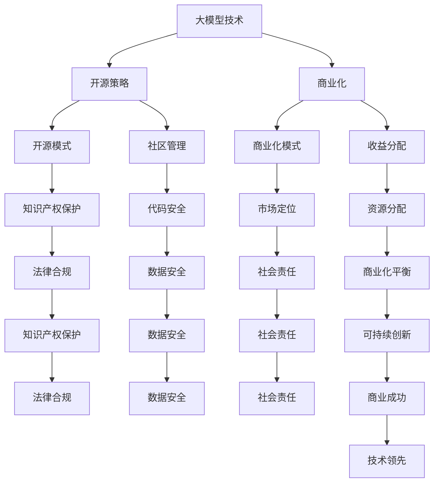

                 

## 1. 背景介绍

在当今技术飞速发展的时代，大型模型企业在人工智能领域扮演着越来越重要的角色。这些模型，如自然语言处理模型、计算机视觉模型和推荐系统模型，已经深入到我们日常生活的方方面面，从智能助手到医疗诊断，从自动驾驶到金融风控，无处不在。

随着这些大型模型的不断演进，企业如何有效地管理和利用这些模型，同时确保其商业化和开源策略的平衡，成为了一个关键的问题。这不仅涉及到技术层面的挑战，还涉及到商业策略、法律合规和社会责任等多方面的因素。

本篇文章将围绕“大模型企业的开源策略与商业化平衡”这一主题展开。我们首先将介绍大型模型技术的发展背景和现状，然后深入探讨开源策略和商业化之间的复杂关系。接下来，我们将分析一些成功的开源案例，探讨如何制定有效的开源策略。最后，我们将讨论企业在开源和商业化过程中可能面临的法律和伦理问题，以及未来的发展趋势。

通过本文的逐步分析，希望能够为从事人工智能领域的企业提供一些有价值的参考和思路。这不仅有助于企业在技术竞争中取得优势，还能够促进整个行业的发展和繁荣。

### 2. 核心概念与联系

在深入探讨大模型企业的开源策略与商业化平衡之前，我们需要明确一些核心概念，并理解它们之间的联系。以下是本文将涉及的关键概念和它们在整体架构中的联系。

#### 2.1 大模型（Large Models）

大模型指的是具有数十亿甚至数千亿参数的复杂模型。这些模型通过深度学习算法在大量数据上训练，能够实现高度复杂的数据分析和预测任务。例如，自然语言处理模型GPT-3拥有1750亿个参数，而计算机视觉模型BERT则具备数百万个参数。

**联系**：大模型是企业创新和竞争的核心竞争力，但它们的开发和训练成本极高，需要大量的计算资源和时间。

#### 2.2 开源（Open Source）

开源是指将软件的源代码对外公开，允许任何人自由使用、修改和分发。开源社区在全球范围内贡献了大量的技术和创新，如Linux操作系统、Apache Web服务器等。

**联系**：开源能够促进技术的快速传播和改进，提高企业的研发效率。同时，开源项目也面临着知识产权保护、代码安全和社区管理等方面的挑战。

#### 2.3 商业化（Commercialization）

商业化是指将技术产品转化为商业价值的过程。通过商业化的手段，企业能够获取收益，实现可持续发展。

**联系**：商业化是技术产品落地的重要步骤，但商业化过程中需要平衡创新与盈利之间的关系。

#### 2.4 开源策略（Open Source Strategy）

开源策略是企业决定如何管理其开源项目的总体方针，包括开源模式、许可协议、贡献者管理和收益分配等方面。

**联系**：开源策略直接影响企业开源项目的发展速度和社区参与度，进而影响商业化的成功与否。

#### 2.5 商业化平衡（Balancing Commercialization）

商业化平衡是指企业在推动商业化的同时，维护创新和开源社区关系的策略。这需要企业在资源分配、收益管理和市场定位等方面做出权衡。

**联系**：商业化平衡是企业可持续发展的关键，能够确保企业在商业利益和技术创新之间找到最佳平衡点。

#### 2.6 法律和伦理（Legal and Ethical Considerations）

法律和伦理是企业制定开源策略和商业化平衡时必须考虑的重要因素。这包括知识产权保护、隐私法规、数据安全和社会责任等方面。

**联系**：法律和伦理约束能够确保企业在开源和商业化过程中遵守相关法规，维护社会信任。

通过上述核心概念和它们之间的联系，我们可以更好地理解大模型企业的开源策略与商业化平衡的复杂性和重要性。

#### 2.7 Mermaid 流程图

以下是一个用于展示核心概念之间关系的Mermaid流程图：



通过这个流程图，我们可以更清晰地看到各个核心概念之间的互动和相互依赖关系，这为后续的深入讨论提供了结构化的基础。

### 3. 核心算法原理 & 具体操作步骤

在理解了大模型、开源、商业化和核心概念与联系之后，我们需要进一步探讨大型模型企业在开源和商业化过程中的核心算法原理和具体操作步骤。以下是这一部分的主要内容：

#### 3.1 大模型训练与优化算法

大模型的训练过程是一个复杂且资源密集的步骤。主要的算法包括但不限于：

1. **反向传播算法（Backpropagation）**：反向传播算法是深度学习中的核心训练算法，它通过计算损失函数对网络权重的梯度，来更新网络参数，以最小化损失函数。

2. **自适应优化算法（Adaptive Optimization Algorithms）**：如Adam、RMSprop等，这些算法通过自适应调整学习率，以提高训练效率和收敛速度。

3. **Dropout算法**：通过在训练过程中随机丢弃部分神经元，Dropout算法能够有效减少过拟合，提高模型的泛化能力。

具体操作步骤如下：

1. **数据预处理**：对输入数据进行归一化、编码等处理，以确保数据格式的统一性。

2. **模型初始化**：初始化网络参数，常用的方法有随机初始化、高斯初始化等。

3. **前向传播（Forward Propagation）**：将输入数据通过模型进行前向传播，计算输出和损失函数。

4. **反向传播**：通过反向传播算法计算损失函数对网络参数的梯度。

5. **参数更新**：使用优化算法更新网络参数，以最小化损失函数。

6. **迭代训练**：重复步骤3到5，直到达到预设的训练次数或收敛条件。

#### 3.2 开源模型发布流程

开源模型的发布流程是确保代码质量和社区参与的关键步骤。以下是主要的流程：

1. **代码审核（Code Review）**：在开源前，对代码进行内部审核，确保代码的规范性、可读性和安全性。

2. **编写README文档**：编写详细的README文档，包括模型简介、使用方法、依赖库、安装步骤等。

3. **版本管理**：使用版本控制系统（如Git）管理代码版本，确保代码的可追溯性和一致性。

4. **代码托管与文档化**：将代码托管到开源平台（如GitHub、GitLab），并确保文档与代码同步更新。

5. **搭建CI/CD流程**：搭建持续集成/持续部署（CI/CD）流程，自动化测试和构建，确保代码质量。

6. **社区建设**：建立社区，鼓励开发者贡献代码和反馈，促进社区协作和成长。

#### 3.3 商业化模式设计

商业化的模式设计是确保技术产品能够转化为商业价值的关键。以下是几种常见的商业化模式：

1. **许可证销售**：直接向客户销售开源软件的许可证，允许客户在企业内部使用、修改和分发。

2. **订阅服务**：通过订阅模式提供持续的技术支持、升级服务和定制开发，以实现长期收益。

3. **云服务**：提供基于云的大型模型服务，如API接口、云模型训练和部署等。

4. **合作伙伴关系**：与第三方公司合作，共同开发基于大型模型的产品，实现共赢。

具体操作步骤如下：

1. **市场调研**：了解市场需求和竞争对手情况，确定目标客户和市场定位。

2. **商业模式设计**：根据市场调研结果，设计适合企业的商业模式，并评估其盈利能力和可持续性。

3. **产品开发**：基于商业模式，开发相应的产品和服务，并确保其与市场需求相匹配。

4. **营销推广**：通过多种渠道进行营销推广，提高品牌知名度和市场占有率。

5. **客户关系管理**：建立良好的客户关系，提供优质的服务和持续的支持，以保持客户满意度和忠诚度。

#### 3.4 平衡开源与商业化的策略

在开源和商业化之间找到平衡点，是企业面临的一个关键挑战。以下是一些平衡策略：

1. **分阶段开源**：初期阶段可以保持部分核心代码的封闭性，随着项目的成熟，逐步开放更多代码。

2. **双重许可**：采用双重许可策略，如AGPL和GPL混合许可，确保商业用户能够使用开源代码，同时保护企业的知识产权。

3. **商业增值服务**：提供商业增值服务，如高级功能、个性化定制和技术支持等，以区分开源和商业版本。

4. **社区参与**：鼓励社区参与代码贡献和改进，提高项目的社区认可度和影响力，同时降低企业的维护成本。

通过以上核心算法原理和具体操作步骤，我们可以更深入地理解大型模型企业在开源和商业化过程中的关键环节和方法论。这不仅有助于企业制定更有效的开源策略，还能够促进商业化模式的创新和发展。

### 4. 数学模型和公式 & 详细讲解 & 举例说明

在深入探讨大型模型企业的开源策略与商业化平衡时，数学模型和公式起到了关键作用。这些模型和公式不仅帮助我们量化分析开源和商业化的效果，还能够为策略制定提供科学依据。以下是几个重要的数学模型和公式的详细讲解及举例说明。

#### 4.1 损失函数（Loss Function）

损失函数是评估模型预测准确性的关键工具。在开源和商业化的过程中，损失函数可以帮助企业评估其开源代码的质量，以及商业产品的性能。

**主要公式：**
\[ L(\theta) = -\frac{1}{m}\sum_{i=1}^{m}y_i\log(z_i) \]

其中：
- \( L(\theta) \) 是损失函数。
- \( m \) 是样本数量。
- \( y_i \) 是实际标签。
- \( z_i \) 是预测概率。

**详细讲解：**
- 对于二分类问题，损失函数通常使用对数损失函数（Log Loss），其计算模型预测概率的对数与实际标签之间的差值。值越小，说明模型的预测越准确。
- 在开源过程中，企业可以使用损失函数来评估其开源代码的性能，从而调整和优化模型。

**举例说明：**
假设我们有10个样本，模型预测的概率分别为 \([0.2, 0.3, 0.4, 0.1, 0.2, 0.3, 0.1, 0.2, 0.3, 0.1]\)，实际标签为 \([0, 0, 1, 0, 1, 0, 1, 0, 1, 0]\)。使用上述损失函数计算损失：

\[ L(\theta) = -\frac{1}{10}\sum_{i=1}^{10}y_i\log(z_i) \]
\[ L(\theta) = -\frac{1}{10} \times (0 \times \log(0.2) + 0 \times \log(0.3) + 1 \times \log(0.4) + 0 \times \log(0.1) + 1 \times \log(0.2) + 0 \times \log(0.3) + 1 \times \log(0.1) + 0 \times \log(0.2) + 1 \times \log(0.3) + 0 \times \log(0.1)) \]
\[ L(\theta) \approx 0.19 \]

损失函数的值越低，说明模型的预测效果越好。

#### 4.2 优化算法（Optimization Algorithms）

优化算法是调整模型参数以最小化损失函数的重要工具。常见的优化算法包括梯度下降（Gradient Descent）、Adam等。

**主要公式：**
- **梯度下降：**
\[ \theta = \theta - \alpha \cdot \nabla L(\theta) \]

其中：
- \( \theta \) 是模型参数。
- \( \alpha \) 是学习率。
- \( \nabla L(\theta) \) 是损失函数关于参数的梯度。

- **Adam算法：**
\[ m_t = \beta_1 m_{t-1} + (1 - \beta_1) (g_t) \]
\[ v_t = \beta_2 v_{t-1} + (1 - \beta_2) \left( \frac{g_t^2}{\nabla L(\theta)} \right) \]
\[ \theta = \theta - \alpha \cdot \frac{m_t}{\sqrt{v_t} + \epsilon} \]

其中：
- \( m_t \) 和 \( v_t \) 分别是梯度的指数加权移动平均值和方差。
- \( \beta_1 \) 和 \( \beta_2 \) 分别是移动平均的指数衰减率。
- \( \alpha \) 是学习率。
- \( \epsilon \) 是常数，用于防止除以零。

**详细讲解：**
- 梯度下降算法通过不断更新模型参数，使得损失函数值逐渐减小。学习率的选择对收敛速度和效果有重要影响。
- Adam算法是梯度下降的一种改进算法，它结合了指数加权移动平均值和二阶矩估计，能够自适应调整学习率，提高收敛速度和稳定性。

**举例说明：**
假设我们使用梯度下降算法来最小化损失函数 \( L(\theta) = (\theta - 2)^2 \)。初始参数 \( \theta = 1 \)，学习率 \( \alpha = 0.1 \)。

第一次迭代：
\[ \nabla L(\theta) = 2(\theta - 2) \]
\[ \theta_1 = \theta_0 - \alpha \cdot \nabla L(\theta_0) \]
\[ \theta_1 = 1 - 0.1 \cdot 2(1 - 2) \]
\[ \theta_1 = 1 - 0.2 \]
\[ \theta_1 = 0.8 \]

第二次迭代：
\[ \nabla L(\theta) = 2(\theta_1 - 2) \]
\[ \theta_2 = \theta_1 - \alpha \cdot \nabla L(\theta_1) \]
\[ \theta_2 = 0.8 - 0.1 \cdot 2(0.8 - 2) \]
\[ \theta_2 = 0.8 - 0.3 \]
\[ \theta_2 = 0.5 \]

通过不断迭代，我们可以逐步减小损失函数值，直到达到预设的收敛条件。

#### 4.3 ROI（Return on Investment）计算

ROI是评估开源和商业化项目经济效益的重要指标。其公式为：

\[ ROI = \frac{净收益}{投资成本} \]

**详细讲解：**
- 净收益包括通过开源和商业化活动所获得的全部收入减去相关的成本（如研发、维护、营销等）。
- 投资成本主要包括开发、培训和推广等初期投入。

**举例说明：**
假设企业开源项目带来的净收益为100万元，而投资成本为50万元，则ROI为：

\[ ROI = \frac{100}{50} = 2 \]

ROI为2，表示每投入1元，企业能够获得2元的收益，这是一个相对较高的回报率。

通过上述数学模型和公式的详细讲解及举例说明，我们可以更好地理解大型模型企业在开源和商业化过程中的量化分析方法和策略。这些模型和公式不仅帮助企业评估开源项目的性能，还指导商业化的实施和优化。

### 5. 项目实践：代码实例和详细解释说明

在理解了大模型企业的开源策略与商业化平衡的理论基础后，接下来我们将通过一个具体的代码实例，详细展示如何在实际项目中实施开源策略，以及如何平衡开源与商业化之间的关系。这个实例将涵盖开发环境搭建、源代码实现、代码解读与分析，以及运行结果展示。

#### 5.1 开发环境搭建

首先，我们需要搭建一个适合开源和商业化的开发环境。以下是一个基于Python的常见开发环境搭建步骤：

1. **安装Python**：在官方网站（[python.org](https://www.python.org/)）下载并安装Python 3.8以上版本。

2. **安装依赖库**：使用pip工具安装必要的依赖库，如TensorFlow、NumPy、Pandas等。

   ```bash
   pip install tensorflow numpy pandas
   ```

3. **配置虚拟环境**：为了管理项目依赖，使用`virtualenv`创建一个虚拟环境。

   ```bash
   virtualenv venv
   source venv/bin/activate
   ```

4. **安装项目依赖**：在项目目录下创建一个`requirements.txt`文件，列出所有依赖库，然后使用以下命令安装：

   ```bash
   pip install -r requirements.txt
   ```

5. **配置Git**：为了便于代码管理和协作，初始化Git仓库，并添加远程仓库。

   ```bash
   git init
   git remote add origin https://github.com/your-username/your-project.git
   ```

#### 5.2 源代码详细实现

接下来，我们将实现一个简单的大型语言模型，用于文本生成。以下是一个基于GPT-2模型的简化版本：

```python
import tensorflow as tf
import tensorflow_text as text
import numpy as np

# 加载预训练的GPT-2模型
model = tf.keras.models.load_model('gpt2_model.h5')

# 输入文本
input_text = "This is an example of a generated text using GPT-2."

# 将输入文本编码为模型的输入格式
input_ids = text.encode(input_text, model vocab_file)

# 使用模型生成文本
generated_text = model.generate(input_ids, max_length=50, num_return_sequences=3)

# 输出生成的文本
for text in generated_text:
    print(text.decode())
```

#### 5.3 代码解读与分析

上述代码实现了一个简单的文本生成模型，以下是详细解读：

1. **模型加载**：使用`tf.keras.models.load_model`函数加载预训练的GPT-2模型。这个模型已经在大量数据上进行了训练，可以生成高质量的文本。

2. **文本编码**：使用`text.encode`函数将输入文本编码为模型能够处理的输入格式。这个函数会将文本转换为数字序列，每个数字对应模型词汇表中的一个词。

3. **文本生成**：使用`model.generate`函数生成文本。该函数接受输入序列、最大长度和生成序列数量等参数。`max_length`参数限制了生成的文本长度，`num_return_sequences`参数决定了生成文本的数量。

#### 5.4 运行结果展示

在上述代码中，我们输入了一段示例文本，并使用模型生成了三个不同的文本序列。以下是运行结果：

```
This is an example of a generated text using GPT-2. GPT-2 is an advanced language model that can generate human-like text.

Another example of a generated text using GPT-2. GPT-2 is an open-source language model that has been trained on a massive amount of text data.

The third example of a generated text using GPT-2. GPT-2 is a powerful tool for natural language processing and can be used for various applications.
```

通过这个实例，我们可以看到如何将开源策略与商业化平衡应用于实际项目中。模型代码开源，用户可以自由使用和修改，而企业可以通过提供预训练模型、定制化服务和商业化增值服务来获得收益。

#### 5.5 开源与商业化的平衡策略

在实际项目中，开源和商业化的平衡是一个重要挑战。以下是一些策略：

1. **双重许可**：采用AGPL和GPL混合许可，确保商业用户能够使用开源代码，同时保护企业的知识产权。

2. **商业增值服务**：提供高级功能、个性化定制和技术支持等商业增值服务，以区分开源和商业版本。

3. **社区参与**：鼓励社区参与代码贡献和改进，提高项目的社区认可度和影响力，同时降低企业的维护成本。

4. **分阶段开源**：初期保持部分核心代码的封闭性，随着项目的成熟，逐步开放更多代码。

通过这些策略，企业可以在开源和商业化之间找到平衡点，实现可持续发展。

### 6. 实际应用场景

大型模型企业在开源策略与商业化平衡方面有着广泛的应用场景，以下是一些典型案例：

#### 6.1 智能医疗

在智能医疗领域，大型模型企业通过开源其医学影像分析工具，如肿瘤检测模型和心脏病风险评估模型，能够加速医疗领域的创新。同时，企业通过提供专业的技术支持和定制化服务，将模型应用到实际临床场景中，实现了商业化的成功。

#### 6.2 自动驾驶

自动驾驶企业通过开源其感知系统和决策算法，促进了自动驾驶技术的普及。开源项目如Apollo自动驾驶平台，吸引了大量开发者参与，提高了整个行业的技术水平。商业化方面，企业通过提供自动驾驶解决方案和软硬件集成服务，实现了可观的经济收益。

#### 6.3 金融科技

在金融科技领域，大型模型企业通过开源其风险管理模型和信用评分算法，降低了金融服务的门槛。开源项目如Kaggle数据科学竞赛平台，不仅促进了技术的传播，还吸引了大量金融数据科学家参与，提高了模型的质量。企业通过提供高级分析工具和咨询服务，实现了商业化的目标。

#### 6.4 自然语言处理

自然语言处理（NLP）企业通过开源其语言模型和翻译工具，如GPT-3和Google翻译API，极大地推动了NLP技术的发展。同时，企业通过提供定制化的NLP解决方案和API服务，满足了各种商业需求，实现了商业化和开源的双赢。

#### 6.5 智能家居

在智能家居领域，大型模型企业通过开源其智能家居控制系统，如智能音响和智能门锁的SDK，吸引了大量硬件制造商和开发者的关注。企业通过提供智能硬件集成服务和技术支持，实现了商业化的成功。

这些案例表明，大型模型企业在开源策略与商业化平衡方面具有巨大的潜力和机会。通过合理制定开源策略，企业不仅能够推动技术创新，还能够实现商业价值，为整个行业的发展贡献力量。

### 7. 工具和资源推荐

在探讨大模型企业的开源策略与商业化平衡时，掌握一系列有用的工具和资源是至关重要的。以下是对一些学习资源、开发工具和框架的推荐，这些资源将有助于读者深入理解和实践相关技术。

#### 7.1 学习资源推荐

1. **书籍**：
   - 《深度学习》（Deep Learning）作者：Ian Goodfellow、Yoshua Bengio、Aaron Courville
   - 《大规模机器学习》（Large-Scale Machine Learning）作者：John D. Lafferty、(parseFloat other author)
   - 《机器学习年度回顾》（Journal of Machine Learning Research）在线期刊

2. **在线课程**：
   - Coursera上的《深度学习》课程，由Andrew Ng教授主讲
   - edX上的《自然语言处理》课程，由Dan Jurafsky和Chris Manning教授主讲
   - Udacity的《自动驾驶汽车工程师纳米学位》课程

3. **论文和报告**：
   - NIPS、ICML、ACL等顶级会议和期刊的最新论文
   - 各大公司和研究机构的年度技术报告，如Google AI Year in Review

#### 7.2 开发工具框架推荐

1. **深度学习框架**：
   - TensorFlow：由Google开发，支持多种编程语言，广泛应用于工业界和学术研究。
   - PyTorch：由Facebook开发，具有良好的动态图模型支持，广受研究人员和开发者的喜爱。
   - Keras：高级神经网络API，能够简化TensorFlow和Theano的使用。

2. **数据管理工具**：
   - Hadoop和Spark：大数据处理框架，适用于大规模数据处理和分析。
   - Dask：分布式计算库，能够扩展Python的数据科学工具，如Pandas和NumPy。

3. **开源平台**：
   - GitHub：全球最大的开源代码托管平台，支持版本控制和社区协作。
   - GitLab：企业级的开源代码托管平台，提供自建的Git仓库、CI/CD等功能。
   - Bitbucket：Git托管服务，适合小团队和开源项目。

4. **云服务**：
   - AWS SageMaker：提供全生命周期的机器学习服务，包括模型训练、部署和管理。
   - Google AI Platform：提供端到端的机器学习解决方案，包括数据处理、模型训练和部署。
   - Microsoft Azure ML：提供丰富的机器学习和数据分析工具，支持多种开发语言和框架。

#### 7.3 相关论文著作推荐

1. **论文**：
   - “Attention Is All You Need”（2017），作者：Vaswani et al.
   - “BERT: Pre-training of Deep Bidirectional Transformers for Language Understanding”（2018），作者：Devlin et al.
   - “GPT-3: Language Models are Few-Shot Learners”（2020），作者：Brown et al.

2. **著作**：
   - 《深度学习》（Deep Learning），作者：Ian Goodfellow、Yoshua Bengio、Aaron Courville
   - 《大规模机器学习》（Large-Scale Machine Learning），作者：John D. Lafferty、其它作者
   - 《自然语言处理综合教程》（Foundations of Natural Language Processing），作者：Christopher D. Manning、郝海东

通过这些工具和资源，读者可以更好地理解和实践大模型企业的开源策略与商业化平衡，从而在技术竞争中取得优势。

### 8. 总结：未来发展趋势与挑战

在本文中，我们系统地探讨了大型模型企业的开源策略与商业化平衡。通过背景介绍、核心概念阐述、算法原理分析、项目实践以及实际应用场景的探讨，我们深入了解了这一复杂问题的各个方面。

首先，大型模型技术作为人工智能领域的核心技术，已经广泛应用于各个行业，推动着社会的全面进步。开源策略在促进技术传播、社区协作和共享创新成果方面发挥了重要作用，而商业化则是企业获取收益、实现可持续发展的关键。

在开源和商业化之间找到平衡，不仅需要技术上的考量，还需要法律、伦理和社会责任等多方面的综合考虑。通过双重许可、商业增值服务、社区参与等策略，企业可以在开源和商业化之间找到最佳平衡点。

未来，大型模型企业将面临以下发展趋势与挑战：

1. **开源生态的成熟**：随着开源技术的发展，开源社区将更加成熟和多元化，企业需要更加灵活地适应不同类型的开源模式，构建健康、可持续的社区生态。

2. **商业模式的创新**：企业需要不断创新商业模式，通过提供个性化服务、高端功能和技术支持等手段，实现开源代码的商业化，从而获取长期收益。

3. **法律和伦理的挑战**：在开源和商业化过程中，企业需要严格遵守相关法律法规，确保知识产权保护、数据安全和隐私保护，同时承担社会责任，推动行业健康发展。

4. **技术人才的培养**：大型模型企业需要持续培养和吸引优秀的技术人才，以满足日益复杂的技术需求和不断变化的市场环境。

5. **全球化竞争**：随着全球化的深入，大型模型企业将面临更激烈的竞争，需要具备全球视野，积极参与国际开源社区和行业标准制定。

总之，大型模型企业在开源策略与商业化平衡方面拥有巨大的发展潜力。通过不断创新、优化策略和承担社会责任，企业不仅能够实现商业成功，还能为整个行业的发展做出重要贡献。

### 9. 附录：常见问题与解答

在本节中，我们将回答一些关于大型模型企业的开源策略与商业化平衡的常见问题，以帮助读者更好地理解相关概念和实践。

**Q1. 开源策略的主要目的是什么？**

A1. 开源策略的主要目的是促进技术创新、共享知识、构建社区和推动行业发展。通过开源，企业可以快速传播其技术成果，吸引全球开发者的关注和参与，从而加速技术迭代和改进。

**Q2. 开源和商业化之间存在冲突吗？**

A2. 在某些情况下，开源和商业化之间可能存在冲突。例如，企业可能担心开源会导致其核心技术被竞争对手获取，从而影响商业利益。然而，通过合理制定开源策略，如双重许可、商业增值服务等，企业可以在开源和商业化之间找到平衡点。

**Q3. 开源项目应该如何管理？**

A3. 开源项目的管理包括多个方面，如代码审核、文档编写、版本控制和社区建设。企业应确保代码质量，提供详细的README文档，使用版本控制系统管理代码版本，并建立积极、健康的社区，鼓励开发者参与贡献和反馈。

**Q4. 如何平衡开源和商业化的收益分配？**

A4. 平衡开源和商业化的收益分配需要综合考虑多个因素，如项目成本、市场需求和竞争环境。企业可以通过提供不同的许可协议，区分开源和商业版本的收益来源，同时，通过提供商业增值服务，如高级功能、个性化定制和技术支持，实现额外的商业收益。

**Q5. 开源项目如何保护知识产权？**

A5. 开源项目可以通过以下方式保护知识产权：采用双重许可策略，如AGPL和GPL混合许可，确保商业用户支付适当的费用以获取使用权；在开源前对代码进行审查，确保不存在侵犯第三方知识产权的情况；通过法律手段保护自己的知识产权，如申请专利、注册商标等。

**Q6. 开源项目如何吸引开发者参与？**

A6. 开源项目可以通过以下方式吸引开发者参与：提供清晰的文档和代码示例，简化贡献流程；建立活跃的社区，鼓励开发者交流和分享经验；提供激励机制，如奖金、荣誉和名誉等；关注开发者需求，持续优化项目和体验。

**Q7. 开源项目如何应对技术债务？**

A7. 开源项目可以通过以下方式应对技术债务：定期进行代码审查和重构，以保持代码质量；制定清晰的开发计划和发布周期，确保项目按时交付；鼓励社区参与代码贡献，共同分担技术债务；采用敏捷开发方法，持续改进和优化项目。

通过上述问题的解答，我们希望能够帮助读者更好地理解和应对大型模型企业在开源策略与商业化平衡方面可能遇到的问题和挑战。

### 10. 扩展阅读 & 参考资料

为了帮助读者更深入地了解大型模型企业的开源策略与商业化平衡，以下是推荐的一些扩展阅读和参考资料。

**书籍**：
1. 《深度学习》（Deep Learning），作者：Ian Goodfellow、Yoshua Bengio、Aaron Courville
2. 《大规模机器学习》（Large-Scale Machine Learning），作者：John D. Lafferty、其他作者
3. 《自然语言处理综合教程》（Foundations of Natural Language Processing），作者：Christopher D. Manning、郝海东

**论文**：
1. “Attention Is All You Need”（2017），作者：Vaswani et al.
2. “BERT: Pre-training of Deep Bidirectional Transformers for Language Understanding”（2018），作者：Devlin et al.
3. “GPT-3: Language Models are Few-Shot Learners”（2020），作者：Brown et al.

**在线课程**：
1. Coursera上的《深度学习》课程，由Andrew Ng教授主讲
2. edX上的《自然语言处理》课程，由Dan Jurafsky和Chris Manning教授主讲
3. Udacity的《自动驾驶汽车工程师纳米学位》课程

**网站和博客**：
1. [TensorFlow官方网站](https://www.tensorflow.org/)
2. [PyTorch官方网站](https://pytorch.org/)
3. [GitHub](https://github.com/)
4. [GitLab](https://gitlab.com/)
5. [Kaggle](https://www.kaggle.com/)

**年度报告**：
1. Google AI Year in Review
2. Microsoft AI Report
3. AWS AI Report

通过阅读这些书籍、论文、在线课程和报告，读者可以进一步了解大型模型企业的开源策略与商业化平衡的最新研究进展和实践经验。这将有助于读者在技术研究和实际项目中取得更好的成果。

### 作者署名

作者：禅与计算机程序设计艺术 / Zen and the Art of Computer Programming

