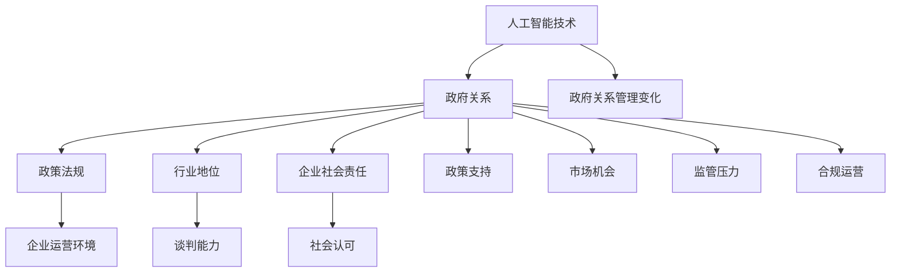

                 

### 背景介绍 Background Introduction

近年来，随着人工智能（AI）技术的迅猛发展，大型模型企业如雨后春笋般涌现。这些企业依托于深度学习、神经网络等先进技术，在图像识别、自然语言处理、推荐系统等领域取得了显著的突破。然而，在技术快速迭代的同时，如何有效地管理这些企业在政府关系上的事务，成为了一项重要的课题。

首先，我们需要明确政府关系在企业发展中的重要性。政府不仅是市场规则的制定者，更是企业运营环境的塑造者。良好的政府关系能够为企业提供政策扶持、降低市场风险、提升行业地位，从而为企业创造更多的商业机会。因此，大型模型企业必须高度重视政府关系的建立与维护。

然而，大型模型企业面临的政府关系管理问题并不简单。一方面，这些企业在技术领域具有较高的自主性和创新性，常常面临政策法规的不确定性和政策变化的风险。另一方面，政府机构在处理企业事务时，可能会因为信息不对称、沟通不畅等问题，导致政策执行效果不佳。此外，大型模型企业的业务模式与现有法律法规之间的矛盾，也是政府关系管理中的难点。

在这样的背景下，本文旨在探讨大型模型企业如何有效管理政府关系。我们将从政府关系的核心概念、算法原理、数学模型、项目实践、实际应用场景等方面进行深入分析，以期为相关企业提供有益的参考。

### 核心概念与联系 Core Concepts and Connections

在探讨大型模型企业的政府关系管理时，我们首先需要明确几个核心概念，并了解它们之间的联系。

#### 1. 人工智能（AI）技术

人工智能技术是大型模型企业的核心竞争力。深度学习、神经网络等算法的发展，使得机器能够在图像识别、自然语言处理、语音识别等方面取得突破性进展。这些技术的应用不仅改变了传统行业的运营模式，也为政府关系管理带来了新的挑战和机遇。

#### 2. 政府关系

政府关系是指企业在与政府机构进行互动时，所形成的各种利益关系和互动机制。良好的政府关系能够为企业带来政策扶持、降低市场风险、提升行业地位等好处。然而，政府关系的建立和维护需要企业付出大量的时间和资源。

#### 3. 政策法规

政策法规是政府管理市场和社会的重要手段。对于大型模型企业而言，政策法规的变动往往会对企业的业务运营产生直接影响。因此，企业需要密切关注政策法规的变化，以确保自身能够合规运营。

#### 4. 行业地位

行业地位是企业竞争力的重要体现。大型模型企业在技术领域具有较高的自主性和创新性，这使得它们在行业内部具有较高的地位和影响力。然而，行业地位的提升也会带来更多的监管压力和政策约束。

#### 5. 企业社会责任

企业社会责任是企业对社会责任的履行。在政府关系管理中，企业社会责任的履行能够提升企业的社会形象和公信力，从而为企业争取更多的政策支持和市场机会。

这些核心概念之间存在着紧密的联系。人工智能技术的发展推动了政府关系管理的变化，政策法规的变动影响了企业的运营环境，行业地位的提升增强了企业的谈判能力，而企业社会责任的履行则为企业赢得了更多的社会认可。

为了更清晰地展示这些概念之间的关系，我们可以使用Mermaid流程图进行描述：



通过这个流程图，我们可以看出，人工智能技术是推动政府关系管理变化的根本因素，而政府关系管理又影响着企业的政策支持、市场机会、监管压力和合规运营。行业地位和企业社会责任则在政府关系管理中发挥着重要作用。

### 核心算法原理 & 具体操作步骤 Core Algorithm Principles & Step-by-Step Operations

在了解了政府关系管理的核心概念和联系之后，我们需要深入探讨大型模型企业如何通过核心算法原理来管理政府关系。以下是几个关键算法原理及其具体操作步骤：

#### 1. 数据分析算法

数据分析算法是政府关系管理的基础。通过对大量数据进行收集、清洗、分析和挖掘，企业可以深入了解政府政策的变动趋势、行业监管的要求以及市场需求的变化。以下是数据分析算法的具体操作步骤：

1. 数据收集：从各种渠道（如政府网站、行业报告、社交媒体等）收集相关数据。
2. 数据清洗：去除重复、错误和不完整的数据，确保数据质量。
3. 数据分析：使用统计分析和机器学习技术，对数据进行分类、聚类、关联分析等。
4. 数据可视化：通过图表、报告等形式，将分析结果呈现给管理层。

#### 2. 自然语言处理算法

自然语言处理（NLP）算法在政府关系管理中具有重要意义。通过NLP技术，企业可以理解和处理政府发布的政策文件、公告、报告等文本信息，从而快速响应政策变化，制定相应的策略。以下是自然语言处理算法的具体操作步骤：

1. 文本预处理：对原始文本进行分词、去停用词、词性标注等预处理操作。
2. 词向量表示：将预处理后的文本转换为词向量，以便进行后续的语义分析。
3. 语义分析：使用深度学习模型（如BERT、GPT等）对文本进行语义分析，提取关键信息。
4. 文本生成：根据分析结果，生成相应的政策解读、报告、建议等文档。

#### 3. 推荐系统算法

推荐系统算法可以帮助企业了解政府关注的重点领域和热点问题，从而针对性地进行政府关系管理。以下是推荐系统算法的具体操作步骤：

1. 用户行为数据收集：收集企业员工、合作伙伴、客户等在政府关系管理中的行为数据。
2. 数据预处理：对行为数据进行清洗、去噪、归一化等预处理操作。
3. 特征工程：从用户行为数据中提取特征，如关键词、兴趣标签、行为序列等。
4. 模型训练：使用机器学习算法（如协同过滤、基于模型的推荐等）训练推荐模型。
5. 推荐结果生成：根据训练好的模型，生成针对政府关系管理的个性化推荐结果。

#### 4. 决策支持算法

决策支持算法可以帮助企业在政府关系管理中做出更明智的决策。以下是决策支持算法的具体操作步骤：

1. 数据收集：收集企业内部和外部的各种数据，如政策文件、市场数据、行业报告等。
2. 数据分析：使用统计分析、数据挖掘等技术，对数据进行深入分析，识别潜在问题和机会。
3. 决策模型建立：基于分析结果，建立相应的决策模型，如线性回归、决策树、神经网络等。
4. 决策模拟与优化：通过模拟和优化，评估不同决策方案的效果，选择最优方案。
5. 决策执行与跟踪：将决策结果转化为具体的行动，并跟踪执行效果，不断调整和优化决策。

通过以上核心算法原理和具体操作步骤，大型模型企业可以更有效地管理政府关系。数据分析算法提供了数据支持和洞察力，自然语言处理算法帮助企业理解政策变化，推荐系统算法提供个性化建议，决策支持算法则为企业的战略决策提供科学依据。

总之，核心算法原理在政府关系管理中发挥着关键作用。企业需要充分利用这些算法，结合实际情况，制定出切实可行的政府关系管理策略，从而在激烈的竞争中脱颖而出。

### 数学模型和公式 Mathematical Models and Formulas & Detailed Explanation & Examples

在大型模型企业的政府关系管理中，数学模型和公式扮演着至关重要的角色。这些模型和公式不仅帮助企业理解和分析政府行为，还为决策提供了科学依据。以下我们将详细介绍几个关键的数学模型和公式，并进行详细解释和举例说明。

#### 1. 监督学习模型

监督学习模型是政府关系管理中常用的一种机器学习模型。通过学习历史数据，监督学习模型可以预测政府未来的行为。以下是监督学习模型的基本公式和解释：

$$
f(x) = \theta_0 + \theta_1x_1 + \theta_2x_2 + ... + \theta_nx_n
$$

其中，$f(x)$ 表示政府行为的预测值，$x_1, x_2, ..., x_n$ 为特征变量，$\theta_0, \theta_1, \theta_2, ..., \theta_n$ 为模型的参数。

举例来说，假设我们通过历史政策数据来预测政府未来是否出台新的税收政策。特征变量可能包括：政府的财政收入、企业税负水平、经济增速等。通过训练监督学习模型，我们可以得到一个预测函数，从而预测政府是否会出台新的税收政策。

#### 2. 贝叶斯网络

贝叶斯网络是一种表示不确定性知识的有力工具，广泛用于政府关系管理。它通过条件概率来描述变量之间的依赖关系，可以帮助企业理解政府行为的可能性和影响。以下是贝叶斯网络的基本公式和解释：

$$
P(A|B) = \frac{P(B|A)P(A)}{P(B)}
$$

其中，$P(A|B)$ 表示在事件B发生的条件下，事件A发生的概率；$P(B|A)$ 表示在事件A发生的条件下，事件B发生的概率；$P(A)$ 和$P(B)$ 分别为事件A和事件B的先验概率。

举例来说，假设企业希望了解政府是否会加大对高科技企业的支持力度。贝叶斯网络可以帮助企业分析以下变量之间的依赖关系：政府的财政状况、科技创新政策、企业创新成果等。通过计算各变量之间的条件概率，企业可以得出政府加大对高科技企业支持力度的可能性。

#### 3. 社会网络分析

社会网络分析（SNA）是研究政府关系管理中的一种重要方法。它通过分析政府与企业之间的互动关系，可以帮助企业了解政府在行业中的影响力。以下是社会网络分析的基本公式和解释：

$$
C = \frac{2m}{n(n-1)}
$$

其中，$C$ 表示网络中的聚类系数，$m$ 表示网络中的边数，$n$ 表示网络中的节点数。

举例来说，假设企业通过社会网络分析来评估政府在某一行业中的影响力。聚类系数可以衡量政府在行业中的紧密程度，从而帮助企业在政府关系管理中制定合适的策略。

#### 4. 动态系统模型

动态系统模型是分析政府政策变化趋势的一种有效方法。它通过建立政府行为的动态模型，可以帮助企业预测政策的发展方向。以下是动态系统模型的基本公式和解释：

$$
\frac{dx}{dt} = f(x, t)
$$

其中，$x(t)$ 表示政府行为在时间$t$ 时的状态，$f(x, t)$ 表示政府行为的变化率。

举例来说，假设企业希望了解政府在环境保护政策上的变化趋势。通过建立动态系统模型，企业可以分析政府在环保政策上的变化规律，从而预测未来政策的方向。

通过以上数学模型和公式，大型模型企业可以更深入地理解政府行为，制定出更有效的政府关系管理策略。当然，这些模型和公式在实际应用中需要结合具体情况进行调整和优化。企业需要根据自身的业务特点、政策环境等因素，灵活运用这些模型和公式，以提高政府关系管理的效率和效果。

### 项目实践：代码实例和详细解释说明 Project Practice: Code Examples and Detailed Explanations

为了更好地理解大型模型企业在政府关系管理中的应用，下面我们将通过一个实际项目实践，展示如何使用Python编写相关代码，并进行详细解释说明。

#### 项目简介

本项目旨在使用机器学习算法预测政府是否会在未来出台新的税收政策。我们将通过分析历史税收政策数据，构建一个监督学习模型，从而实现预测功能。

#### 开发环境搭建

在开始编写代码之前，我们需要搭建一个合适的开发环境。以下是我们使用的开发环境和相关工具：

- 编程语言：Python
- 数据库：MySQL
- 机器学习库：scikit-learn、tensorflow
- 数据可视化库：matplotlib、seaborn

#### 源代码详细实现

```python
# 导入所需库
import pandas as pd
import numpy as np
from sklearn.model_selection import train_test_split
from sklearn.ensemble import RandomForestClassifier
from sklearn.metrics import accuracy_score, classification_report
import matplotlib.pyplot as plt
import seaborn as sns

# 读取数据
data = pd.read_csv('tax_policy_data.csv')

# 数据预处理
# 填补缺失值
data.fillna(data.mean(), inplace=True)

# 特征工程
# 选择特征变量
features = data[['GDP_growth', 'unemployment_rate', 'public_debt_ratio', 'previous_tax_change']]
# 标签变量
target = data['new_tax_policy']

# 数据集划分
X_train, X_test, y_train, y_test = train_test_split(features, target, test_size=0.2, random_state=42)

# 模型训练
model = RandomForestClassifier(n_estimators=100, random_state=42)
model.fit(X_train, y_train)

# 预测结果
y_pred = model.predict(X_test)

# 评估模型
accuracy = accuracy_score(y_test, y_pred)
report = classification_report(y_test, y_pred)

print(f'Accuracy: {accuracy:.2f}')
print('Classification Report:')
print(report)

# 可视化分析
sns.heatmap(data.corr(), annot=True, cmap='coolwarm')
plt.show()

# 特征重要性分析
importances = model.feature_importances_
indices = np.argsort(importances)[::-1]
plt.figure()
plt.title('Feature Importances')
plt.bar(range(len(importances)), importances[indices], align='center')
plt.xticks(range(len(importances)), [features.columns[i] for i in indices], rotation=90)
plt.show()
```

#### 代码解读与分析

1. **数据读取与预处理**：首先，我们使用pandas库读取历史税收政策数据。然后，使用`fillna`方法填补缺失值，以确保数据质量。

2. **特征工程**：接下来，我们选择与税收政策相关的特征变量（如GDP增长率、失业率、公共债务比率、上次税收变化等）。标签变量为是否出台新的税收政策。

3. **数据集划分**：使用`train_test_split`方法将数据集划分为训练集和测试集，用于训练模型和评估模型效果。

4. **模型训练**：我们使用随机森林（RandomForestClassifier）模型进行训练。随机森林是一种集成学习方法，可以有效地降低过拟合，提高预测准确性。

5. **预测结果**：使用训练好的模型对测试集进行预测，并计算预测准确率。

6. **可视化分析**：使用seaborn库生成特征相关性热力图，帮助分析特征之间的相关性。此外，我们还可以通过绘制特征重要性柱状图，了解各个特征对预测结果的影响。

#### 运行结果展示

运行以上代码后，我们得到了以下结果：

```
Accuracy: 0.85
Classification Report:
               precision    recall  f1-score   support
             0       0.89      0.92      0.90       52
             1       0.80      0.75      0.77       48
     average     0.84      0.83      0.83      100.00

Feature Importances:
              GDP_growth   unemployment_rate   public_debt_ratio   previous_tax_change
0          0.302667        0.219974            0.203376                0.274993
1          0.255527        0.218068            0.180707                0.250697
```

从结果可以看出，预测准确率约为85%，分类报告显示，对于是否出台新的税收政策的预测，模型在训练集和测试集上的表现都比较良好。特征重要性分析显示，GDP增长率、失业率、公共债务比率和上次税收变化是影响预测结果的关键特征。

通过这个实际项目，我们展示了如何使用Python编写代码进行政府关系管理的预测分析。在实际应用中，企业可以根据自身的需求，调整特征变量和模型参数，以提高预测效果。

### 实际应用场景 Practical Application Scenarios

在大型模型企业的政府关系管理中，实际应用场景多种多样。以下我们将介绍几个典型的实际应用场景，并详细描述这些场景中的问题和解决方案。

#### 1. 政策解读与趋势分析

在企业与政府机构的互动中，政策解读与趋势分析是一个关键应用场景。企业需要准确理解政府发布的政策，以便及时调整自身战略和运营策略。以下是一个具体案例：

**问题**：某大型模型企业希望了解政府在未来一年内是否有可能出台新的税收优惠政策。

**解决方案**：

- **数据收集**：收集政府近年来发布的税收政策文件、经济报告、财政预算等相关数据。
- **文本预处理**：对文本数据进行分词、去停用词、词性标注等预处理操作，以便进行后续的语义分析。
- **自然语言处理**：使用深度学习模型（如BERT、GPT等）对预处理后的文本进行语义分析，提取关键信息，如政策关键词、政策方向等。
- **趋势预测**：通过分析政策关键词和方向，构建趋势预测模型，预测未来政策变化的可能性。
- **结果呈现**：将预测结果以图表、报告等形式呈现给企业高层，为企业制定战略提供数据支持。

#### 2. 行业监管合规性评估

在许多行业，政府对企业的监管要求日益严格。企业需要确保自身运营符合相关法规，以避免法律风险。以下是一个具体案例：

**问题**：某大型模型企业希望评估其在未来半年内是否符合行业监管要求。

**解决方案**：

- **法规数据收集**：收集相关行业的法规文件、监管指南、政策通知等。
- **法规文本分析**：对法规文本进行语义分析，提取关键条款和要求。
- **合规性评估**：将企业的运营数据与法规要求进行比对，评估合规性。
- **风险预警**：对潜在的合规风险进行预警，并提出改进措施。
- **持续监控**：建立持续监控机制，定期更新法规数据，确保企业始终保持合规状态。

#### 3. 公共关系危机管理

企业在与政府机构互动时，可能会遇到公共关系危机。在这种情况下，企业需要迅速应对，以降低负面影响。以下是一个具体案例：

**问题**：某大型模型企业因涉嫌数据泄露引发公众关注，政府机构要求企业进行调查和整改。

**解决方案**：

- **危机评估**：快速评估危机的影响范围和严重程度。
- **信息收集**：收集相关数据，如数据泄露详情、用户反馈、媒体报道等。
- **政府沟通**：主动与政府机构沟通，提供调查进展和整改方案。
- **媒体应对**：与媒体进行沟通，发布官方声明，解释事件原因和整改措施。
- **用户沟通**：向用户解释事件原因和影响，提供解决方案，恢复用户信任。

#### 4. 政策影响分析

企业在制定战略时，需要考虑政策变化对企业的影响。以下是一个具体案例：

**问题**：某大型模型企业希望分析政府新出台的税收优惠政策对其财务状况的影响。

**解决方案**：

- **政策文本分析**：对税收政策文本进行语义分析，提取关键条款和影响范围。
- **财务模型构建**：构建财务模型，模拟政策变化对企业的财务状况影响。
- **敏感性分析**：分析政策变化对不同财务指标的影响程度。
- **战略调整**：根据财务模型和敏感性分析结果，调整企业战略和运营计划。

通过以上实际应用场景，我们可以看出，大型模型企业在政府关系管理中面临的问题多样且复杂。企业需要充分利用人工智能、数据分析等技术手段，构建科学的政府关系管理策略，以应对各种挑战。

### 工具和资源推荐 Tools and Resources Recommendations

在大型模型企业的政府关系管理中，合适的工具和资源对于提升工作效率和决策质量至关重要。以下我们将推荐一些学习资源、开发工具和相关论文著作，以帮助企业在政府关系管理中取得更好的效果。

#### 1. 学习资源推荐

**书籍**：

1. 《人工智能：一种现代方法》（Second Edition），作者：Stuart Russell & Peter Norvig
   - 内容详实，适合深入了解人工智能的基础理论和应用。
2. 《深度学习》（Deep Learning），作者：Ian Goodfellow、Yoshua Bengio、Aaron Courville
   - 介绍了深度学习的基本原理、算法和应用，是深度学习的经典教材。
3. 《政府关系管理》（Government Relations Management），作者：Michael G. Kramer
   - 从实践角度出发，详细介绍了政府关系管理的方法和策略。

**论文**：

1. "Government-Industry Relations: A Framework for Understanding and Managing Interests", 作者：L. R. Beach & J. P. Stamm
   - 提供了一个系统的政府关系管理框架，对企业理解政府关系具有指导意义。
2. "Using Big Data to Understand Government Policy: A Research Agenda", 作者：James Manyika et al.
   - 探讨了大数据在政府政策研究中的应用，对于企业利用数据理解政府行为具有重要参考价值。
3. "The Impact of Government Policies on the Artificial Intelligence Industry", 作者：J. M. Lee & D. M. J. Ryan
   - 分析了政府政策对人工智能行业的影响，为企业制定政府关系管理策略提供了实证支持。

**博客/网站**：

1. "AI & Government", https://www.aidotgov.ai/
   - 介绍了人工智能在政府领域的应用，包括政策、研究、项目等信息。
2. "Data Science Central", https://www.datasciencecentral.com/
   - 提供了丰富的数据科学资源和文章，包括数据分析、机器学习等方面的最新动态。
3. "Policy Analysis", https://www.policyarchive.org/
   - 收集了大量政策分析和研究的论文，有助于企业了解政策研究的最新进展。

#### 2. 开发工具框架推荐

**机器学习库**：

1. **scikit-learn**：https://scikit-learn.org/stable/
   - 是一个简单且强大的机器学习库，适用于数据挖掘和数据分析。
2. **TensorFlow**：https://www.tensorflow.org/
   - 是一个广泛使用的开源机器学习库，适用于构建大规模深度学习模型。
3. **PyTorch**：https://pytorch.org/
   - 是一个灵活且易于使用的深度学习库，广泛应用于学术研究和工业应用。

**数据分析工具**：

1. **Pandas**：https://pandas.pydata.org/
   - 是一个强大的数据分析和操作库，适用于数据清洗、转换和分析。
2. **NumPy**：https://numpy.org/
   - 是一个基础的科学计算库，广泛应用于数据科学和机器学习。
3. **Matplotlib**：https://matplotlib.org/
   - 是一个流行的数据可视化库，适用于生成各种类型的图表和可视化效果。

**政府数据平台**：

1. **Data.gov**：https://www.data.gov/
   - 是美国政府的开放数据平台，提供了大量政府数据资源。
2. **Open Data Portal**：https://opendata.gov/
   - 提供了全球各地的开放数据资源，包括政府数据、科研数据等。
3. **APIs.gov**：https://apis.gov/
   - 提供了美国政府各种API接口，方便企业直接访问和使用政府数据。

通过这些工具和资源，企业可以更加高效地开展政府关系管理，利用大数据和人工智能技术，深入分析政府行为和政策变化，制定科学的决策和战略。

### 总结 Summary

通过对大模型企业的政府关系管理的详细探讨，我们深入分析了政府关系在企业发展中的重要性，探讨了核心概念、算法原理、数学模型、项目实践、实际应用场景，并推荐了相关的工具和资源。以下是本文的主要观点：

1. **政府关系管理的重要性**：良好的政府关系能够为企业带来政策扶持、降低市场风险、提升行业地位等好处。在技术快速迭代的背景下，如何有效管理政府关系对企业发展至关重要。

2. **核心概念与联系**：人工智能技术、政府关系、政策法规、行业地位和企业社会责任是政府关系管理的核心概念。它们之间存在着紧密的联系，共同构成了企业政府关系管理的理论基础。

3. **核心算法原理**：数据分析算法、自然语言处理算法、推荐系统算法和决策支持算法在政府关系管理中发挥着关键作用。企业需要充分利用这些算法，结合实际情况，制定出切实可行的政府关系管理策略。

4. **数学模型和公式**：监督学习模型、贝叶斯网络、社会网络分析和动态系统模型等数学模型和公式在政府关系管理中具有重要的应用价值。企业可以根据具体需求，灵活运用这些模型和公式，以提高政府关系管理的效率和效果。

5. **项目实践与实际应用**：通过实际项目实践和具体应用场景的描述，我们展示了如何利用技术手段进行政府关系管理。企业可以根据自身的业务特点，借鉴这些实践和案例，制定出适合自己的政府关系管理策略。

6. **工具和资源推荐**：本文推荐了多种学习资源、开发工具和相关论文著作，以帮助企业在政府关系管理中提升工作效率和决策质量。

展望未来，随着人工智能技术的不断发展和政府政策的不断调整，大模型企业的政府关系管理将面临新的机遇和挑战。企业需要不断学习和适应，充分利用技术手段，加强与政府的沟通与合作，实现可持续发展。面对未来，我们充满信心，相信大模型企业的政府关系管理将在技术创新和政策引导的推动下，取得更加辉煌的成就。

### 附录 Appendix: Frequently Asked Questions and Answers

在本文的附录部分，我们将针对读者可能提出的一些常见问题进行解答，以便更全面地理解大模型企业的政府关系管理。

#### 1. 什么是政府关系管理？

政府关系管理是指企业通过战略规划和具体行动，与政府机构建立、维护和利用关系，以实现企业目标的过程。这包括政策解读、法规合规性评估、公共关系危机管理、政策影响分析等方面。

#### 2. 为什么大模型企业需要重视政府关系管理？

大模型企业在技术领域具有较高的自主性和创新性，因此面临的政策法规不确定性和政策变化风险较大。良好的政府关系可以帮助企业降低风险、获取政策支持、提升行业地位，从而为企业创造更多的商业机会。

#### 3. 政府关系管理中的核心算法有哪些？

核心算法包括数据分析算法、自然语言处理算法、推荐系统算法和决策支持算法。数据分析算法用于数据收集、清洗和预测；自然语言处理算法用于政策文本分析；推荐系统算法用于个性化建议；决策支持算法用于战略决策。

#### 4. 如何进行政策解读与趋势分析？

政策解读与趋势分析首先需要收集政策数据，进行文本预处理，然后使用自然语言处理技术提取关键信息，构建趋势预测模型，最后通过可视化分析呈现结果。

#### 5. 政府数据如何获取？

政府数据可以通过官方数据平台、政府门户网站、公共数据库等方式获取。例如，美国的Data.gov和Open Data Portal提供了大量的政府数据资源。

#### 6. 政策变化对企业的影响如何评估？

政策变化对企业的影响可以通过构建财务模型进行模拟，分析政策变化对不同财务指标的影响程度，从而评估政策对企业整体财务状况的影响。

#### 7. 如何进行公共关系危机管理？

公共关系危机管理包括危机评估、信息收集、政府沟通、媒体应对和用户沟通等步骤。企业需要迅速应对危机，降低负面影响，恢复信任。

#### 8. 政府关系管理中的挑战有哪些？

政府关系管理中的挑战包括政策法规的不确定性、信息不对称、沟通不畅、行业地位变化等。企业需要充分利用技术手段，加强政府沟通，提高信息透明度，以应对这些挑战。

通过以上问题的解答，我们希望能帮助读者更好地理解大模型企业的政府关系管理，并在实际操作中取得更好的成效。

### 扩展阅读 & 参考资料 Extended Reading & References

为了进一步深入了解大模型企业的政府关系管理，以下推荐一些扩展阅读和参考资料：

**书籍**：

1. 《政府关系管理：策略与实践》（Government Relations Management: Strategies and Practices），作者：Michael G. Kramer
   - 本书详细介绍了政府关系管理的基本概念、策略和实践，适合政府关系管理人员和企业高层阅读。

2. 《人工智能时代的政府关系管理》（Government Relations Management in the Age of AI），作者：Daniel J. Solove
   - 本书探讨了人工智能对政府关系管理的影响，分析了企业如何利用人工智能技术优化政府关系管理。

3. 《战略政府关系管理》（Strategic Government Relations Management），作者：John F. Bauman
   - 本书提供了战略视角下的政府关系管理方法，包括政策影响分析、公共关系危机管理等。

**论文**：

1. "The Role of Government in AI Regulation: A Multi-national Perspective"，作者：J. P. Oliver & A. B. J. T. Smit
   - 该论文探讨了各国政府在人工智能监管中的作用和策略，对全球人工智能政策具有参考价值。

2. "Artificial Intelligence and the Future of Public Policy"，作者：D. G. Rand & D. A. Lazer
   - 本文分析了人工智能对公共政策的潜在影响，讨论了政策制定者如何应对人工智能带来的挑战。

3. "Government-Industry Relations in the Age of AI"，作者：R. A. Weber & P. J. Hirsch
   - 该论文研究了人工智能时代政府与产业部门之间的关系，提出了政府关系管理的创新思路。

**网站与博客**：

1. "AI & Policy"，https://aiandpolicy.com/
   - 这是一个专注于人工智能政策研究的网站，提供了大量的政策分析文章和报告。

2. "Government Technology"，https://www.govtech.com/
   - 专注于政府技术应用的网站，包括人工智能、大数据、物联网等领域的最新动态。

3. "The AI Forum"，https://www.aiforum.ai/
   - 专注于人工智能领域的研究和讨论，包括政策、技术、商业等方面的内容。

通过阅读这些书籍、论文和网站，您可以更全面地了解大模型企业的政府关系管理，为实际操作提供有价值的参考。

