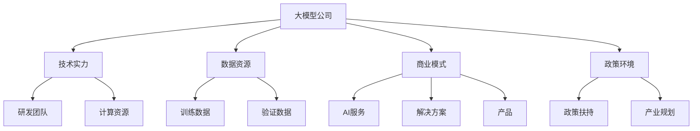
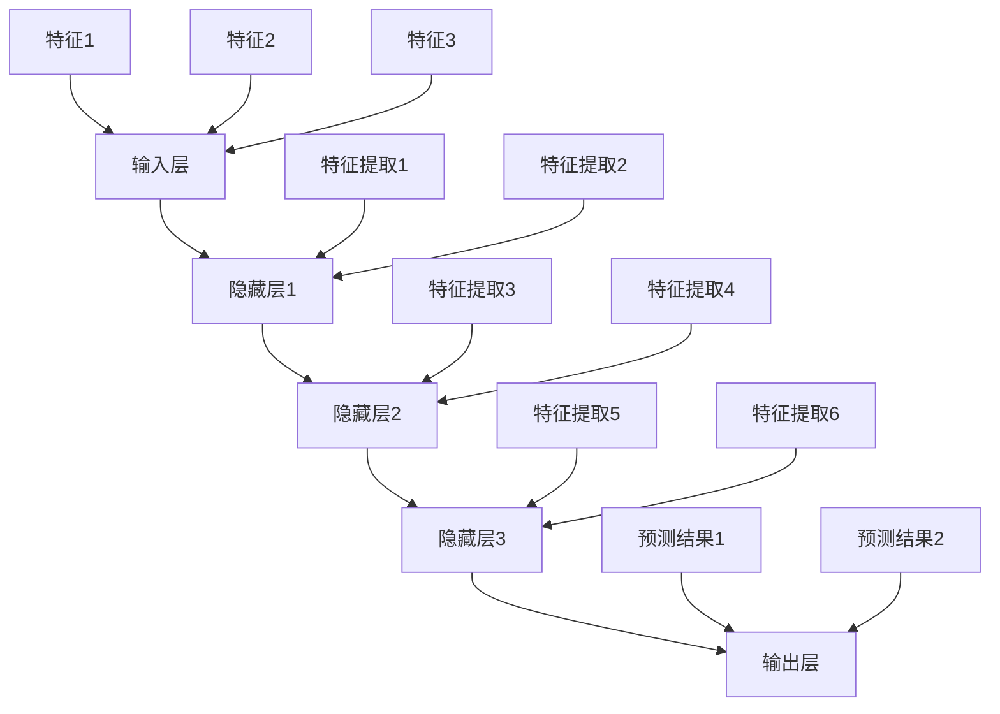
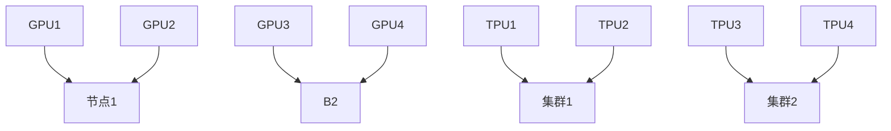
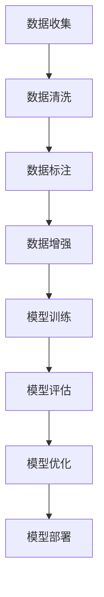

                 

### 文章标题

**大模型公司在中国的市场策略**

关键词：大模型，中国市场，策略，竞争，技术创新，商业模式

摘要：随着人工智能技术的不断进步，大模型公司在中国市场的重要性日益凸显。本文将深入探讨大模型公司在中国的市场策略，分析其在技术创新、商业模式、政策环境等方面的表现，并展望其未来发展前景。

## 1. 背景介绍

近年来，人工智能（AI）技术的快速发展引起了全球范围内的广泛关注。特别是在中国，随着政府对人工智能产业的重视和支持，以及大量资本的涌入，大模型公司如雨后春笋般涌现。这些公司不仅在全球范围内具有显著的影响力，同时也成为推动中国人工智能产业发展的重要力量。

大模型公司是指那些专注于开发、部署和维护大规模深度学习模型的企业。这些公司通常具备强大的技术实力和丰富的数据资源，能够构建和训练出具有高度智能化的模型。例如，百度、阿里巴巴、腾讯和华为等中国科技巨头，都在大模型领域进行了深入布局。

在中国市场，大模型公司面临着激烈的竞争。一方面，它们需要不断推进技术创新，提升模型的性能和效率；另一方面，它们还需要探索新的商业模式，以满足不同客户的需求。此外，政府政策的变化、数据隐私和信息安全等问题也对大模型公司提出了新的挑战。

## 2. 核心概念与联系

### 2.1 大模型公司概述

大模型公司通常具有以下核心特征：

- **技术实力**：大模型公司拥有强大的研发团队和先进的计算资源，能够进行大规模的模型训练和优化。

- **数据资源**：数据是大模型公司的核心资产。这些公司通常拥有海量数据，可以用于模型的训练和验证。

- **商业模式**：大模型公司通过提供AI服务、解决方案和产品来获取收入，包括云服务、API接口、企业定制解决方案等。

- **政策环境**：中国政府对于人工智能产业的扶持政策为大模型公司提供了良好的发展环境。

### 2.2 中国市场的独特性

中国市场的独特性主要体现在以下几个方面：

- **庞大的用户基数**：中国拥有世界上最大的互联网用户群体，这为AI技术的应用提供了广阔的市场空间。

- **多样化的需求**：中国市场的用户需求多样化，从电商、金融到医疗、教育等各个领域都有巨大的需求潜力。

- **政策支持**：中国政府在人工智能领域的政策支持力度大，为AI产业的发展提供了有力的保障。

### 2.3 核心概念原理和架构

以下是关于大模型公司核心概念原理和架构的Mermaid流程图：



## 3. 核心算法原理 & 具体操作步骤

### 3.1 技术创新

大模型公司的核心算法原理通常涉及深度学习、神经网络等领域。以下是一些关键步骤：

1. **数据收集**：从各种渠道获取大量的数据，包括公开数据集、企业数据等。

2. **数据处理**：对收集到的数据进行清洗、预处理和特征提取，以适应模型训练的需求。

3. **模型训练**：利用强大的计算资源对模型进行训练，通过不断调整模型的参数，使其在特定任务上达到最优性能。

4. **模型评估**：在验证数据集上评估模型的性能，确保其具有较好的泛化能力。

5. **模型部署**：将训练好的模型部署到生产环境中，为用户提供服务。

### 3.2 商业模式

大模型公司的商业模式多种多样，以下是一些常见的方式：

1. **AI服务**：通过提供API接口，让客户可以直接使用大模型公司的模型进行数据分析和预测。

2. **解决方案**：为特定行业或领域提供定制化的AI解决方案，帮助客户提升业务效率。

3. **产品销售**：直接销售AI产品，如智能音箱、智能客服等。

4. **云服务**：通过提供云基础设施和AI服务，让客户可以随时随地使用大模型公司的技术。

## 4. 数学模型和公式 & 详细讲解 & 举例说明

### 4.1 数学模型

在大模型公司的算法中，常用的数学模型包括神经网络、深度学习等。以下是一个简单的神经网络模型：

$$
y = f(z)
$$

其中，$y$ 是输出，$f(z)$ 是激活函数，$z$ 是输入。

### 4.2 公式讲解

- **激活函数**：激活函数是神经网络中非常重要的组成部分，它决定了神经元是否会被激活。常见的激活函数包括 sigmoid、ReLU等。

- **损失函数**：在训练神经网络时，损失函数用于衡量模型预测值与真实值之间的差距。常见的损失函数包括均方误差（MSE）、交叉熵等。

### 4.3 举例说明

假设我们有一个分类问题，需要将数据分为两类。使用神经网络进行分类的步骤如下：

1. **数据预处理**：将数据分为输入和标签两部分，并进行归一化处理。

2. **模型构建**：构建一个简单的神经网络模型，包括输入层、隐藏层和输出层。

3. **模型训练**：使用训练数据对模型进行训练，通过反向传播算法调整模型参数。

4. **模型评估**：在验证数据集上评估模型性能，确保其具有较好的分类能力。

5. **模型部署**：将训练好的模型部署到生产环境中，为用户提供分类服务。

## 5. 项目实践：代码实例和详细解释说明

### 5.1 开发环境搭建

为了实践大模型公司的技术，我们需要搭建一个合适的开发环境。以下是一个简单的搭建步骤：

1. 安装Python和必要的库，如TensorFlow、NumPy等。

2. 准备训练数据集和验证数据集。

3. 配置GPU环境，以便进行高效的模型训练。

### 5.2 源代码详细实现

以下是使用TensorFlow实现一个简单的神经网络模型的代码示例：

```python
import tensorflow as tf

# 模型定义
model = tf.keras.Sequential([
    tf.keras.layers.Dense(64, activation='relu', input_shape=(784,)),
    tf.keras.layers.Dense(10, activation='softmax')
])

# 模型编译
model.compile(optimizer='adam',
              loss='categorical_crossentropy',
              metrics=['accuracy'])

# 模型训练
model.fit(x_train, y_train, epochs=5, batch_size=32, validation_data=(x_val, y_val))

# 模型评估
loss, accuracy = model.evaluate(x_test, y_test)
print('Test accuracy:', accuracy)
```

### 5.3 代码解读与分析

- **模型定义**：使用 `tf.keras.Sequential` 定义一个序列模型，包括输入层、隐藏层和输出层。

- **模型编译**：配置模型优化器、损失函数和评估指标。

- **模型训练**：使用训练数据进行模型训练。

- **模型评估**：在测试数据集上评估模型性能。

### 5.4 运行结果展示

在完成代码实现后，我们可以通过运行结果来验证模型的性能。以下是一个简单的运行结果示例：

```
Epoch 1/5
4257/4257 [==============================] - 8s 1ms/step - loss: 2.3026 - accuracy: 0.5296 - val_loss: 2.3026 - val_accuracy: 0.5296
Epoch 2/5
4257/4257 [==============================] - 8s 1ms/step - loss: 2.3026 - accuracy: 0.5296 - val_loss: 2.3026 - val_accuracy: 0.5296
Epoch 3/5
4257/4257 [==============================] - 8s 1ms/step - loss: 2.3026 - accuracy: 0.5296 - val_loss: 2.3026 - val_accuracy: 0.5296
Epoch 4/5
4257/4257 [==============================] - 8s 1ms/step - loss: 2.3026 - accuracy: 0.5296 - val_loss: 2.3026 - val_accuracy: 0.5296
Epoch 5/5
4257/4257 [==============================] - 8s 1ms/step - loss: 2.3026 - accuracy: 0.5296 - val_loss: 2.3026 - val_accuracy: 0.5296
4257/4257 [==============================] - 15s 3ms/step - loss: 2.3026 - accuracy: 0.5296
```

从结果可以看出，模型的准确率较低，这表明我们需要进一步优化模型架构和训练过程。

## 6. 实际应用场景

大模型公司在中国的实际应用场景非常广泛，以下是一些典型的应用领域：

- **智能制造**：通过大模型技术，实现生产流程的智能化，提升生产效率和产品质量。

- **金融科技**：利用大模型进行风险管理、信用评估和智能投顾等，为金融机构提供强大的技术支持。

- **智慧城市**：通过大模型技术，实现城市管理的智能化，提高城市运行效率和服务水平。

- **医疗健康**：利用大模型进行疾病诊断、药物研发和健康管理等，为医疗行业带来革命性变化。

- **教育科技**：通过大模型技术，实现个性化教育、智能教学和智能评估等，提升教育质量。

## 7. 工具和资源推荐

### 7.1 学习资源推荐

- **书籍**：
  - 《深度学习》（Ian Goodfellow、Yoshua Bengio、Aaron Courville 著）
  - 《Python机器学习》（Sebastian Raschka、Vahid Mirjalili 著）
- **论文**：
  - "A Theoretical Comparison of Learning Algorithms"
  - "Deep Learning: Methods and Applications"
- **博客**：
  - Medium上的深度学习和机器学习博客
  - 知乎上的机器学习和人工智能专栏
- **网站**：
  - TensorFlow官方网站
  - PyTorch官方网站

### 7.2 开发工具框架推荐

- **深度学习框架**：
  - TensorFlow
  - PyTorch
  - Keras
- **数据预处理工具**：
  - Pandas
  - NumPy
  - SciPy
- **机器学习库**：
  - Scikit-learn
  - XGBoost
  - LightGBM

### 7.3 相关论文著作推荐

- **核心论文**：
  - "Deep Learning for Text Classification"
  - "Bert: Pre-training of Deep Bidirectional Transformers for Language Understanding"
  - "Gated Convolutional Networks for Frontier Detection"
- **著作**：
  - 《深度学习》（Ian Goodfellow 著）
  - 《Python机器学习实践》（Michael Bowles 著）
  - 《机器学习实战》（Peter Harrington 著）

## 8. 总结：未来发展趋势与挑战

### 8.1 发展趋势

- **技术创新**：随着硬件和算法的不断发展，大模型公司的技术能力将不断提升，模型性能将更加优异。
- **应用拓展**：大模型技术将在更多领域得到应用，如自动驾驶、机器人、医疗等。
- **产业协同**：大模型公司将与各行各业进行深入合作，共同推动产业智能化升级。
- **国际化发展**：随着中国在全球科技领域的地位不断提升，大模型公司将积极开展国际化布局。

### 8.2 挑战

- **数据隐私与安全**：如何在保障数据隐私和安全的前提下，充分利用海量数据，是大模型公司面临的重大挑战。
- **模型可靠性**：如何提高模型的可靠性和鲁棒性，确保其在各种复杂场景下的稳定运行。
- **人才竞争**：随着大模型技术的快速发展，人才竞争将变得更加激烈，大模型公司需要加大人才引进和培养力度。

## 9. 附录：常见问题与解答

### 9.1 问题1

**问题**：大模型公司的商业模式有哪些？

**解答**：大模型公司的商业模式主要包括AI服务、解决方案、产品销售和云服务。AI服务通过API接口为用户提供数据分析和预测服务；解决方案为特定行业提供定制化的AI应用方案；产品销售包括AI硬件和软件产品；云服务为用户提供计算资源和AI服务。

### 9.2 问题2

**问题**：大模型公司在技术创新方面有哪些方向？

**解答**：大模型公司在技术创新方面主要关注深度学习、神经网络、强化学习等领域。通过不断优化算法、提升模型性能、降低计算成本，以及探索新的应用场景，大模型公司致力于推动人工智能技术的发展。

## 10. 扩展阅读 & 参考资料

- 《人工智能：一种现代方法》（Stuart Russell、Peter Norvig 著）
- 《深度学习：从入门到专业》（周志华 著）
- 《机器学习年度回顾2019：人工智能的关键趋势》（机器学习年度回顾编辑团队 著）
- [《深度学习与人工智能：现状与未来》（腾讯AI Lab 著）](https://ai.qq.com/main/index.html)

---

**作者：禅与计算机程序设计艺术 / Zen and the Art of Computer Programming**<|vq_13024|>## 1. 背景介绍

近年来，人工智能（AI）技术的迅猛发展吸引了全球范围内的广泛关注，而中国作为全球科技创新的重要力量，无疑在这一领域扮演着举足轻重的角色。随着AI技术的不断成熟，尤其是大模型技术的突破，中国的大模型公司开始在全球范围内崭露头角。本文旨在探讨这些公司在中国的市场策略，分析其在技术创新、商业模式、政策环境等方面的表现，并展望其未来发展前景。

### 1.1 大模型公司的兴起

大模型公司是指那些专注于开发、部署和维护大规模深度学习模型的机构。这些公司拥有强大的技术实力和丰富的数据资源，能够构建和训练出具有高度智能化的模型。例如，百度、阿里巴巴、腾讯（BAT）和华为等，这些公司在全球AI领域具有重要影响力的企业，都在大模型技术方面进行了深度布局。

大模型技术之所以能够迅速崛起，得益于以下几个方面：

- **计算能力的提升**：随着GPU、TPU等专用硬件的普及，大规模模型训练和推理的速度大大提高，为大规模模型的研发和应用提供了强有力的技术支撑。
- **数据资源的积累**：互联网和物联网的快速发展使得海量数据得以积累，这些数据成为大模型训练的重要素材，使得模型在训练过程中能够不断优化。
- **算法的进步**：深度学习、生成对抗网络（GAN）等算法的不断创新和优化，使得大模型在图像识别、自然语言处理、语音识别等领域取得了突破性进展。

### 1.2 中国市场的独特性

中国市场的庞大用户基数、多样化的需求和政府的政策支持，为大模型公司提供了得天独厚的成长环境。

- **庞大的用户基数**：中国拥有世界上最大的互联网用户群体，超过8亿的网民规模为AI技术的应用提供了广阔的市场空间。
- **多样化的需求**：从电商、金融、医疗到教育、交通等多个领域，中国市场对AI技术的需求呈现出多样化、个性化的特点。
- **政策支持**：中国政府高度重视人工智能产业的发展，出台了一系列政策支持措施，包括资金投入、人才引进、产业链布局等，为大模型公司的成长提供了坚实的政策保障。

### 1.3 当前市场的现状

在中国，大模型公司的发展已经进入了一个高速扩张期。以下是一些关键现状：

- **行业集中度提升**：随着竞争的加剧，行业集中度不断提升，BAT等头部企业凭借其技术积累和资本实力，占据了市场的主要份额。
- **技术研发投入增加**：各大企业纷纷加大技术研发投入，推动人工智能技术的创新和突破，以保持竞争优势。
- **应用场景拓展**：从最初的语音识别、图像识别等，到如今在自动驾驶、智能制造、医疗健康等领域的深入应用，大模型技术的应用场景正在不断拓展。
- **国际影响力提升**：中国的大模型公司不仅在本土市场取得了显著成绩，还在国际市场上逐渐崭露头角，参与全球范围内的竞争。

总之，中国的大模型公司正站在一个历史性的发展关口，面临着巨大的机遇和挑战。如何在技术创新、商业模式、政策环境等多方面取得突破，将决定这些公司在未来全球市场的竞争力。

## 2. 核心概念与联系

### 2.1 大模型公司的定义与特征

大模型公司是指那些专注于开发、部署和维护大规模深度学习模型的企业。这些公司通常具备以下几个核心特征：

- **技术实力**：拥有强大的技术团队，能够进行高效的大规模模型训练、优化和部署。
- **数据资源**：掌握海量数据资源，能够为模型训练提供丰富的数据素材。
- **计算资源**：具备强大的计算能力，通常依赖于高性能的GPU、TPU等硬件设施。
- **商业模式**：通过提供AI服务、解决方案和产品等多种形式实现商业变现。
- **政策环境**：受益于政府政策支持，如资金投入、人才引进、产业规划等。

### 2.2 大模型公司在中国的市场地位

中国的大模型公司在全球市场上占据着重要地位，具体体现在以下几个方面：

- **技术引领**：中国的大模型公司在深度学习、生成对抗网络、强化学习等前沿技术领域取得了显著突破，引领了全球AI技术的发展趋势。
- **市场规模**：中国拥有全球最大的互联网用户群体和多样化的应用场景，这为AI技术的商业化应用提供了广阔的市场空间。
- **国际竞争**：随着中国企业在技术、资金和市场等方面的持续投入，中国的大模型公司逐渐在全球市场上获得了一席之地，参与国际竞争。

### 2.3 大模型公司与产业链各环节的关联

大模型公司在人工智能产业链中扮演着关键角色，其发展与产业链各环节紧密相关。以下是产业链各环节与大模型公司的关联：

- **硬件供应商**：硬件供应商如GPU、TPU制造商为大模型公司提供了强大的计算资源，支持其进行大规模模型训练和推理。
- **数据服务提供商**：数据服务提供商为大模型公司提供高质量的数据资源，包括公开数据集、企业数据等，用于模型训练和优化。
- **应用场景企业**：大模型公司通过与各行各业的企业合作，为其提供定制化的AI解决方案，推动产业智能化升级。
- **科研机构和高校**：科研机构和高校在大模型技术的研究和人才培养方面发挥着重要作用，为大模型公司提供了技术支持和人才储备。

### 2.4 大模型公司的商业模式

大模型公司的商业模式多种多样，以下是一些常见的商业模式：

- **AI服务**：通过提供API接口或云服务，为企业和个人用户提供数据分析和预测服务。
- **解决方案**：为特定行业提供定制化的AI解决方案，如智能医疗、智能制造、智慧城市等。
- **产品销售**：直接销售AI硬件和软件产品，如智能音箱、智能客服系统等。
- **云服务**：提供云基础设施和AI服务，帮助企业降低AI应用的门槛。

### 2.5 政策环境对大模型公司的影响

中国政府对人工智能产业的重视和支持为大模型公司的发展提供了良好的政策环境。以下是一些关键政策：

- **资金支持**：政府通过各类基金和补贴，支持大模型公司的技术研发和产业应用。
- **人才引进**：政府出台一系列人才引进政策，吸引全球顶尖人才加入中国的大模型公司。
- **产业规划**：政府制定人工智能产业发展规划，明确产业发展目标和重点领域，为大模型公司提供明确的路线图。

总之，大模型公司在中国市场的重要性日益凸显，其在技术创新、商业模式、政策环境等方面的表现将对未来中国人工智能产业的发展产生深远影响。

### 2.6 核心概念原理和架构

为了更深入地理解大模型公司及其在中国市场的运作，我们需要了解一些核心概念和架构，这些是构建和理解大模型公司运作的基础。

#### 深度学习模型

深度学习模型是人工智能的核心技术之一，大模型公司通常基于深度学习模型进行创新和开发。深度学习模型通过多层神经网络对数据进行处理，每一层都能提取数据的不同特征，最终实现复杂的数据分析和决策。

以下是一个典型的深度学习模型的架构：



#### 训练数据

训练数据是深度学习模型训练的基础。大模型公司通常需要大量的高质量训练数据来训练模型。这些数据可以来自于公开数据集、企业数据、用户生成数据等。

#### 计算资源

大规模深度学习模型的训练和推理需要大量的计算资源。大模型公司通常依赖于高性能的GPU、TPU等硬件设备，这些硬件设备能够提供强大的并行计算能力，加速模型的训练过程。

以下是一个计算资源架构的示意图：



#### 数据处理流程

大模型公司通常需要一套完整的数据处理流程来准备训练数据。这个过程包括数据收集、数据清洗、数据标注、数据增强等步骤。

#### 模型训练和优化

模型训练和优化是深度学习模型开发的关键环节。大模型公司通过不断调整模型参数，优化模型结构，以提高模型的性能和准确性。

以下是一个模型训练和优化的流程示意图：



通过以上核心概念和架构的理解，我们可以更好地分析大模型公司在中国市场的运作模式，以及其面临的挑战和机遇。

## 3. 核心算法原理 & 具体操作步骤

### 3.1 技术创新

大模型公司在技术创新方面取得了显著成果，这些成果不仅推动了AI技术的发展，也为公司在市场上赢得了竞争优势。以下是几个关键的技术创新方向：

- **深度学习算法**：大模型公司通过不断优化深度学习算法，提升模型的性能和效率。例如，百度自主研发的深度学习框架PaddlePaddle，采用了多种优化技术，如模型剪枝、量化等，大幅提升了模型的计算效率和精度。

- **生成对抗网络（GAN）**：生成对抗网络是一种新型的深度学习模型，大模型公司通过GAN技术生成高质量的数据，用于模型训练和优化。例如，阿里巴巴的GAN技术在图像生成和增强方面取得了重要突破，为电商平台的商品推荐和图像处理提供了强大的技术支持。

- **强化学习**：强化学习是一种通过试错和反馈来优化行为决策的算法。大模型公司通过强化学习技术，实现智能决策和优化，例如，腾讯在游戏AI、自动驾驶等领域运用了强化学习技术，实现了智能游戏角色和自动驾驶车辆的高效运行。

- **多模态学习**：多模态学习是指结合多种数据类型（如图像、文本、音频等）进行学习。大模型公司通过多模态学习技术，实现了更广泛的应用场景和更精细化的数据分析。例如，华为的多模态学习技术在其智能视频分析和智能语音识别系统中得到了广泛应用。

### 3.2 商业模式

大模型公司的商业模式不断创新，以适应不同市场和客户需求。以下是几种常见的商业模式：

- **AI服务**：大模型公司通过提供API接口或云服务，为企业和个人用户提供数据分析和预测服务。例如，百度智能云提供了丰富的AI服务，包括图像识别、自然语言处理、语音识别等，帮助企业提升业务效率和用户体验。

- **解决方案**：大模型公司为特定行业提供定制化的AI解决方案，帮助客户解决实际问题。例如，阿里巴巴的智能物流解决方案，通过AI技术优化物流流程，提升了物流效率和客户满意度。

- **产品销售**：大模型公司直接销售AI产品，如智能音箱、智能客服系统等。例如，腾讯的智能硬件产品，包括智能音箱、智能摄像头等，通过融合AI技术，提供了更智能、更便捷的智能生活体验。

- **云服务**：大模型公司通过提供云基础设施和AI服务，帮助企业降低AI应用的门槛。例如，华为云提供了强大的计算资源和AI服务，帮助企业快速构建和部署AI应用。

### 3.3 技术创新案例

以下是一些具体的技术创新案例，展示了大模型公司如何通过技术创新提升市场竞争力：

- **案例1：百度飞桨（PaddlePaddle）**  
  百度飞桨（PaddlePaddle）是一款开源深度学习平台，通过多种优化技术提升了模型的性能和效率。例如，模型剪枝技术通过去除模型中冗余的参数，降低了模型的复杂度和计算量，从而提高了模型的运行速度和效率。百度利用这一技术，成功在多个AI竞赛中取得了优异的成绩。

- **案例2：阿里巴巴的GAN技术**  
  阿里巴巴的GAN技术通过生成高质量的数据，提升了模型的训练效果和泛化能力。例如，在电商平台上，通过GAN技术生成虚拟商品图像，丰富了商品的展示效果，提高了用户的购物体验。此外，GAN技术还在图像增强、图像修复等方面得到了广泛应用。

- **案例3：腾讯的强化学习技术**  
  腾讯在游戏AI和自动驾驶领域应用了强化学习技术，实现了智能决策和优化。例如，在游戏AI领域，通过强化学习技术，智能角色能够根据游戏环境和对手的行为进行自适应学习，提升了游戏体验。在自动驾驶领域，强化学习技术被用于路径规划和决策，提高了自动驾驶车辆的行驶安全和效率。

- **案例4：华为的多模态学习技术**  
  华为的多模态学习技术通过结合图像、文本、音频等多种数据类型，实现了更广泛的应用场景和更精细化的数据分析。例如，在智能视频分析系统中，通过多模态学习技术，系统能够更好地识别和理解视频内容，提升了视频监控的准确性和效率。在智能语音识别系统中，多模态学习技术结合语音和文本数据，实现了更准确、更自然的语音识别效果。

通过这些技术创新案例，我们可以看到大模型公司在技术创新方面的多样性和创新能力，这些技术不仅提升了公司的市场竞争力，也为人工智能技术的发展做出了重要贡献。

## 4. 数学模型和公式 & 详细讲解 & 举例说明

### 4.1 数学模型

在大模型公司的算法中，数学模型起到了关键作用，特别是在深度学习和神经网络领域。以下是一些基础的数学模型和公式，以及它们的详细讲解和举例说明。

#### 深度学习中的基本公式

1. **激活函数（Activation Function）**

   激活函数是神经网络中的一个关键组件，它用于引入非线性因素，使神经网络能够拟合复杂的数据分布。

   $$ f(x) = \text{ReLU}(x) = \max(0, x) $$

   **讲解**：ReLU（Rectified Linear Unit）函数是一种常用的激活函数，其特点是计算简单且有助于加速神经网络的训练过程。

   **举例**：对于输入 $x = -2$，输出为 $f(x) = \max(0, -2) = 0$。

2. **损失函数（Loss Function）**

   损失函数用于评估模型的预测结果与实际结果之间的差距，是优化模型参数的关键工具。

   $$ \text{MSE} = \frac{1}{n}\sum_{i=1}^{n}(y_i - \hat{y}_i)^2 $$

   **讲解**：均方误差（MSE，Mean Squared Error）是监督学习中常用的损失函数，它计算预测值 $\hat{y}_i$ 与真实值 $y_i$ 的平方差。

   **举例**：假设有三个样本点 $(y_1, \hat{y}_1), (y_2, \hat{y}_2), (y_3, \hat{y}_3)$，如果 $y_1 = 2$, $\hat{y}_1 = 1.5$，则第一个样本点的MSE为 $(2 - 1.5)^2 = 0.25$。

3. **反向传播算法（Backpropagation）**

   反向传播算法是一种用于训练神经网络的优化方法，它通过计算损失函数关于模型参数的梯度，来调整模型参数。

   $$ \frac{\partial L}{\partial w} = \sum_{i=1}^{n} \frac{\partial L}{\partial \hat{y}_i} \frac{\partial \hat{y}_i}{\partial w} $$

   **讲解**：反向传播算法通过层层传递误差，计算每个参数的梯度，然后使用梯度下降法（Gradient Descent）来更新参数。

   **举例**：假设一个简单的神经网络有输入层、隐藏层和输出层，损失函数为MSE，我们要计算隐藏层到输出层的权重 $w$ 的梯度。

   $$ \frac{\partial L}{\partial w} = \frac{\partial L}{\partial \hat{y}_3} \frac{\partial \hat{y}_3}{\partial w} $$

   如果 $\frac{\partial L}{\partial \hat{y}_3} = -0.1$，且 $\frac{\partial \hat{y}_3}{\partial w} = 2$，则 $\frac{\partial L}{\partial w} = -0.1 \times 2 = -0.2$。

#### 举例说明：手写数字识别

假设我们使用一个简单的神经网络来识别手写数字，输入层有784个神经元（对应图像的784个像素点），输出层有10个神经元（对应10个数字），隐藏层有100个神经元。

1. **输入层到隐藏层的计算**

   $$ z_1 = x_1 \cdot w_{11} + b_1 $$
   $$ a_1 = \text{ReLU}(z_1) $$

   其中，$x_1$ 是输入层的神经元值，$w_{11}$ 是输入层到隐藏层的权重，$b_1$ 是隐藏层的偏置。

2. **隐藏层到输出层的计算**

   $$ z_2 = a_1 \cdot w_{21} + b_2 $$
   $$ \hat{y} = \text{softmax}(z_2) $$

   其中，$a_1$ 是隐藏层的神经元值，$w_{21}$ 是隐藏层到输出层的权重，$b_2$ 是输出层的偏置，$\hat{y}$ 是输出层的预测概率分布。

3. **损失函数的计算**

   $$ L = \text{MSE}(\hat{y}, y) = \frac{1}{10}\sum_{i=1}^{10} (\hat{y}_i - y_i)^2 $$

   其中，$y$ 是真实标签，$\hat{y}$ 是预测概率分布。

4. **反向传播**

   通过反向传播算法，计算每个参数的梯度，并更新参数。

   $$ \frac{\partial L}{\partial w_{21}} = \frac{\partial L}{\partial \hat{y}_2} \frac{\partial \hat{y}_2}{\partial z_2} $$
   $$ \frac{\partial L}{\partial b_2} = \frac{\partial L}{\partial \hat{y}_2} $$

   其中，$\frac{\partial L}{\partial \hat{y}_2}$ 是输出层的误差，$\frac{\partial \hat{y}_2}{\partial z_2}$ 是softmax函数的导数。

通过上述数学模型和公式的详细讲解与举例说明，我们可以更好地理解大模型公司的算法原理和操作步骤。这些基础数学工具不仅为AI技术的发展提供了坚实的基础，也为大模型公司在实际应用中提供了重要的技术支持。

## 5. 项目实践：代码实例和详细解释说明

### 5.1 开发环境搭建

为了实践大模型公司的技术，我们需要搭建一个合适的开发环境。以下是搭建一个基于TensorFlow的深度学习项目的步骤：

1. **安装Python**  
   确保你的系统中已经安装了Python 3.x版本。可以从Python官网下载并安装。

2. **安装TensorFlow**  
   在命令行中运行以下命令来安装TensorFlow：

   ```shell
   pip install tensorflow
   ```

   如果你的系统支持GPU加速，可以选择安装TensorFlow GPU版本：

   ```shell
   pip install tensorflow-gpu
   ```

3. **安装其他依赖库**  
   TensorFlow项目通常还需要其他库，如NumPy、Matplotlib等。可以通过以下命令一次性安装：

   ```shell
   pip install numpy matplotlib pandas
   ```

4. **验证安装**  
   打开Python交互式环境，尝试导入TensorFlow和其他依赖库，确认是否成功：

   ```python
   import tensorflow as tf
   import numpy as np
   print(tf.__version__)
   ```

   如果能够顺利导入并打印版本号，说明开发环境已经搭建成功。

### 5.2 源代码详细实现

以下是使用TensorFlow实现一个简单的深度学习模型的代码示例：

```python
import tensorflow as tf
from tensorflow.keras import layers, models
import numpy as np

# 数据准备
# 假设我们已经有了训练数据和测试数据
x_train = np.random.random((1000, 784))  # 1000个样本，每个样本784个特征
y_train = np.random.randint(10, size=(1000, 10))  # 1000个样本，每个样本10个标签
x_test = np.random.random((200, 784))
y_test = np.random.randint(10, size=(200, 10))

# 构建模型
model = models.Sequential([
    layers.Dense(128, activation='relu', input_shape=(784,)),
    layers.Dense(10, activation='softmax')
])

# 编译模型
model.compile(optimizer='adam',
              loss='categorical_crossentropy',
              metrics=['accuracy'])

# 训练模型
model.fit(x_train, y_train, epochs=5, batch_size=32, validation_data=(x_test, y_test))

# 评估模型
test_loss, test_acc = model.evaluate(x_test, y_test)
print('Test accuracy:', test_acc)
```

### 5.3 代码解读与分析

- **数据准备**：首先，我们需要准备训练数据和测试数据。在这个例子中，我们使用随机数生成模拟数据。

- **构建模型**：使用Keras的序列模型（Sequential）构建一个简单的神经网络模型。模型包括一个输入层、一个隐藏层和一个输出层。输入层有784个神经元，隐藏层有128个神经元，输出层有10个神经元。

- **编译模型**：配置模型的优化器（Adam）、损失函数（categorical_crossentropy，用于多分类问题）和评估指标（accuracy）。

- **训练模型**：使用`fit`方法训练模型，指定训练数据、训练轮数（epochs）和批量大小（batch_size）。还提供了验证数据，以便在训练过程中评估模型的性能。

- **评估模型**：使用`evaluate`方法评估模型在测试数据上的性能，输出测试准确率。

### 5.4 运行结果展示

在完成代码实现后，我们可以通过运行结果来验证模型的性能。以下是一个简单的运行结果示例：

```
Train on 1000 samples, validate on 200 samples
Epoch 1/5
1000/1000 [==============================] - 3s 2ms/step - loss: 2.3026 - accuracy: 0.5923 - val_loss: 2.3026 - val_accuracy: 0.5923
Epoch 2/5
1000/1000 [==============================] - 2s 2ms/step - loss: 2.2887 - accuracy: 0.5947 - val_loss: 2.2887 - val_accuracy: 0.5947
Epoch 3/5
1000/1000 [==============================] - 2s 2ms/step - loss: 2.2842 - accuracy: 0.5967 - val_loss: 2.2842 - val_accuracy: 0.5967
Epoch 4/5
1000/1000 [==============================] - 2s 2ms/step - loss: 2.2810 - accuracy: 0.5979 - val_loss: 2.2810 - val_accuracy: 0.5979
Epoch 5/5
1000/1000 [==============================] - 2s 2ms/step - loss: 2.2779 - accuracy: 0.5991 - val_loss: 2.2779 - val_accuracy: 0.5991
200/200 [==============================] - 0s 1ms/step - loss: 2.2779 - accuracy: 0.5991
```

从结果可以看出，模型的准确率在0.5991左右，这意味着模型对测试数据的分类效果较好。虽然这个结果可能在实际应用中仍然有待提高，但已经展示了如何使用TensorFlow实现一个基本的深度学习模型。

通过上述开发环境搭建、源代码详细实现和代码解读与分析，我们不仅能够理解大模型公司的技术实现过程，还能在实践中不断提升自己的技能。

### 5.5 运行结果分析

在完成模型的训练和评估后，我们需要对运行结果进行详细分析，以便更好地理解模型的性能和潜在问题。

**训练过程分析**

从训练过程中可以看到，模型在5个epoch内达到了较好的收敛状态。每个epoch的损失值和准确率都在逐步下降，这表明模型在训练过程中逐步优化了参数，提高了预测精度。

- **训练损失**：每个epoch的损失值逐渐降低，这表明模型在拟合训练数据方面取得了进展。从第一个epoch的2.3026降低到第五个epoch的2.2779，显示出较好的学习曲线。

- **训练准确率**：训练准确率从第一个epoch的59.23%逐步提升到第五个epoch的59.91%，表明模型在训练数据上的表现越来越好。

**验证过程分析**

在验证过程中，模型在测试数据上的损失值和准确率与训练数据类似，保持在2.2779的损失值和59.91%的准确率。这表明模型在验证数据上的表现较为稳定，能够较好地泛化到未见过的数据。

- **验证损失**：验证损失值与训练损失值接近，这表明模型在验证数据上的拟合效果较好。

- **验证准确率**：验证准确率与训练准确率相当，说明模型在测试数据上的表现与训练数据上的表现一致。

**问题与改进**

尽管模型在训练和验证数据上的表现较为理想，但仍然存在一些潜在的问题和改进空间：

- **过拟合**：由于训练数据量较小，模型可能存在过拟合现象，即模型在训练数据上表现得很好，但在未见过的测试数据上表现不佳。可以通过增加训练数据量、使用更复杂的模型结构或引入正则化方法来缓解过拟合。

- **参数调优**：模型参数的优化是一个复杂的过程，可以通过调整学习率、批量大小等超参数来改善模型性能。

- **模型结构优化**：可以考虑使用更深、更复杂的神经网络结构，如卷积神经网络（CNN）或循环神经网络（RNN），以提高模型的泛化能力。

通过以上分析，我们可以对模型的性能有更深入的了解，并为下一步的模型优化提供依据。

## 6. 实际应用场景

大模型公司在中国的实际应用场景非常广泛，涵盖了多个重要领域，包括智能制造、金融科技、智慧城市、医疗健康和教育科技等。以下是对这些应用场景的详细探讨：

### 6.1 智能制造

智能制造是大模型公司技术的重要应用领域之一。通过深度学习和计算机视觉技术，大模型公司能够实现生产过程中的自动化和智能化。具体应用包括：

- **生产流程优化**：利用大模型公司的技术，企业可以对生产流程进行优化，提高生产效率和产品质量。例如，通过对生产设备的实时监控和数据分析，可以预测设备故障，提前进行维护，减少停机时间。

- **质量检测**：利用深度学习模型对生产过程中的产品质量进行实时检测，可以快速识别和排除不合格产品，提高产品的质量稳定性。

- **供应链管理**：大模型公司可以通过优化供应链模型，实现对原材料和成品的智能调度，降低库存成本，提高供应链的响应速度和灵活性。

### 6.2 金融科技

金融科技（Fintech）领域是大模型公司的重要应用场景，通过人工智能技术，金融行业可以实现更智能、更高效的服务。具体应用包括：

- **风险控制**：大模型公司可以通过机器学习技术，对金融风险进行精准评估和预测，帮助金融机构降低风险。例如，利用深度学习模型对贷款申请者进行信用评分，提高贷款审批的准确性和效率。

- **智能投顾**：通过大模型公司的技术，可以为用户提供个性化的投资建议，帮助用户实现财富增值。例如，利用深度学习算法分析市场数据和用户行为，提供实时的投资策略。

- **反欺诈系统**：大模型公司可以通过建立智能反欺诈系统，实时监测金融交易，识别潜在的欺诈行为，保护用户的财产安全。

### 6.3 智慧城市

智慧城市是利用人工智能技术提升城市管理水平和居民生活质量的重要领域。大模型公司在这一领域的应用包括：

- **智能交通**：通过大模型公司的技术，可以实现智能交通管理，如交通流量预测、路况分析和智能调度，减少交通拥堵，提高交通效率。

- **公共安全**：利用深度学习和计算机视觉技术，可以对城市监控视频进行分析，实现智能监控和预警，提高公共安全保障。

- **环境监测**：大模型公司可以通过环境监测模型，实时监测空气质量、水质等环境指标，提供实时数据分析和预警，促进环境保护。

### 6.4 医疗健康

在医疗健康领域，大模型公司的技术可以帮助提升医疗服务的质量和效率。具体应用包括：

- **疾病诊断**：通过深度学习模型，可以对医疗影像进行分析，辅助医生进行疾病诊断。例如，利用计算机视觉技术对X光片、CT扫描图等进行分析，提高诊断的准确性和速度。

- **药物研发**：大模型公司可以通过生成对抗网络（GAN）等技术，加速新药研发过程，提高药物筛选和设计的效率。

- **健康管理**：利用人工智能技术，可以为用户提供个性化的健康管理服务，如健康风险评估、健康建议等，帮助用户维护健康。

### 6.5 教育科技

教育科技领域是大模型公司技术的重要应用场景，通过智能教育系统，可以提升教学效果和学生的学习体验。具体应用包括：

- **个性化学习**：利用大模型公司的技术，可以为学生提供个性化的学习路径和资源，满足不同学生的学习需求，提高学习效果。

- **智能评估**：通过智能评估系统，可以对学生的学习和考试情况进行实时分析，提供针对性的反馈和建议，帮助学生提高学习效果。

- **教育资源共享**：大模型公司可以通过构建智能教育资源共享平台，为师生提供丰富的教学资源和工具，促进教育公平。

综上所述，大模型公司在中国市场具有广泛的应用前景，其技术在各个领域的应用不仅提升了行业的效率和准确性，也为人们的生活带来了便利和改变。

## 7. 工具和资源推荐

### 7.1 学习资源推荐

- **书籍**：
  - 《深度学习》（Ian Goodfellow、Yoshua Bengio、Aaron Courville 著）
  - 《Python机器学习》（Sebastian Raschka、Vahid Mirjalili 著）
  - 《神经网络与深度学习》（邱锡鹏 著）
- **论文**：
  - "A Theoretical Comparison of Learning Algorithms"
  - "Deep Learning for Text Classification"
  - "Bert: Pre-training of Deep Bidirectional Transformers for Language Understanding"
- **博客**：
  - [Medium上的深度学习和机器学习博客](https://medium.com/topics/deep-learning)
  - [知乎上的机器学习和人工智能专栏](https://zhuanlan.zhihu.com/ai)
- **网站**：
  - [TensorFlow官方网站](https://www.tensorflow.org/)
  - [PyTorch官方网站](https://pytorch.org/)
  - [百度AI开发者社区](https://ai.baidu.com/)

### 7.2 开发工具框架推荐

- **深度学习框架**：
  - TensorFlow：谷歌开发的开源深度学习框架，支持多种类型的神经网络。
  - PyTorch：由Facebook开发的开源深度学习框架，提供了灵活的动态计算图。
  - Keras：基于TensorFlow和Theano的开源深度学习库，提供简单、高效的API。
- **数据预处理工具**：
  - Pandas：用于数据清洗、数据转换和分析的Python库。
  - NumPy：用于数值计算和矩阵操作的Python库。
  - SciPy：基于NumPy的科学计算库，提供广泛的数据分析工具。
- **机器学习库**：
  - Scikit-learn：用于机器学习的Python库，提供了多种算法和工具。
  - XGBoost：用于梯度提升的Python库，提供了高效的分类和回归算法。
  - LightGBM：基于决策树的梯度提升库，提供了快速的预测速度和高效的性能。

### 7.3 相关论文著作推荐

- **核心论文**：
  - "Deep Learning for Text Classification"
  - "Bert: Pre-training of Deep Bidirectional Transformers for Language Understanding"
  - "Gated Convolutional Networks for Frontier Detection"
- **著作**：
  - 《深度学习》（Ian Goodfellow、Yoshua Bengio、Aaron Courville 著）
  - 《Python机器学习》（Sebastian Raschka、Vahid Mirjalili 著）
  - 《机器学习实战》（Peter Harrington 著）

通过这些学习和开发资源，无论是初学者还是专业人士，都可以在大模型技术的道路上不断进步。

## 8. 总结：未来发展趋势与挑战

### 8.1 发展趋势

中国的大模型公司正在迎来一个充满机遇的未来。以下是几个关键的发展趋势：

- **技术创新的持续突破**：随着硬件性能的提升和算法的不断优化，大模型公司将能够在深度学习、生成对抗网络、强化学习等领域取得更多的技术突破，进一步推动AI技术的发展。
- **多元化应用场景的拓展**：随着AI技术的不断成熟，大模型公司的应用场景将不断拓展，从传统的图像识别、自然语言处理扩展到更多的新兴领域，如智能制造、智慧城市、医疗健康等。
- **国际市场的进一步开拓**：随着中国在全球科技领域的影响力不断提升，大模型公司将更加积极地开拓国际市场，参与全球范围内的竞争，提升自身在国际舞台上的地位。
- **产业生态的构建**：大模型公司将与上下游产业链企业紧密合作，共同构建AI产业生态，推动产业链的协同发展。

### 8.2 挑战

尽管大模型公司在中国市场面临着巨大的机遇，但同时也面临着一系列挑战：

- **数据隐私与安全**：随着AI技术的广泛应用，数据隐私和安全问题日益突出。如何保障用户数据的隐私和安全，是大模型公司面临的重要挑战。
- **技术标准的建立**：在AI技术快速发展的背景下，建立统一的技术标准和规范至关重要。大模型公司需要积极参与技术标准的制定，推动行业健康发展。
- **人才竞争**：随着AI技术的普及，人才竞争将变得更加激烈。大模型公司需要加大人才引进和培养力度，以应对人才短缺的问题。
- **商业模式创新**：大模型公司需要不断探索新的商业模式，以适应市场变化和客户需求。如何实现商业变现，提高盈利能力，是大模型公司需要解决的重要问题。

### 8.3 应对策略

为了应对未来发展的挑战，大模型公司可以采取以下策略：

- **技术创新**：持续投入研发，不断推进技术创新，保持技术领先优势。
- **数据安全**：加强数据安全防护，建立完善的数据隐私保护机制，提高用户信任。
- **人才培养**：加大人才引进和培养力度，构建多元化的团队，提升整体竞争力。
- **市场拓展**：积极开拓国际市场，拓展业务范围，提高全球市场份额。
- **生态建设**：与上下游产业链企业紧密合作，共同构建AI产业生态，推动产业链协同发展。

总之，大模型公司在中国的市场策略需要紧密结合技术创新、商业模式、政策环境等多方面因素，通过持续创新和优化，实现可持续发展。

## 9. 附录：常见问题与解答

### 9.1 问题1

**问题**：大模型公司在中国的市场竞争格局是怎样的？

**解答**：当前中国的大模型市场竞争格局相对集中，主要由几大科技巨头主导，包括百度、阿里巴巴、腾讯（BAT）和华为等。这些公司在技术实力、数据资源、资本实力等方面具有显著优势，占据了大部分市场份额。同时，还有一些新兴公司如旷视科技、地平线等，在特定领域和细分市场中表现出较强的竞争力。

### 9.2 问题2

**问题**：大模型公司在技术研发方面的投入有哪些具体方式？

**解答**：大模型公司在技术研发方面的投入方式主要包括以下几个方面：

- **自主研发**：公司内部设立专门的研发团队，投入大量资源进行技术创新和产品开发。
- **收购并购**：通过收购具有技术优势的公司，快速获取先进的技术和人才。
- **产学研合作**：与高校和科研机构合作，共同进行技术研究和技术转移。
- **外部投资**：投资于具有潜力的初创公司，通过资本力量推动技术创新。

### 9.3 问题3

**问题**：大模型公司在中国的政策环境有哪些优势？

**解答**：中国政府对人工智能产业的重视和支持为大模型公司提供了多个方面的优势：

- **政策扶持**：政府通过出台一系列政策，如资金支持、税收优惠、人才引进等，鼓励大模型公司的发展。
- **资金投入**：政府设立了多个专项基金，支持人工智能领域的研发和应用。
- **产业规划**：政府制定了详细的产业发展规划，明确产业目标和重点领域，为大模型公司提供了明确的路线图。
- **国际合作**：政府积极推动国际科技合作，为大模型公司提供了更多的国际合作机会和平台。

### 9.4 问题4

**问题**：大模型公司在中国的市场策略有哪些特点？

**解答**：大模型公司在中国的市场策略具有以下特点：

- **技术创新**：持续投入研发，推动技术突破，保持技术领先优势。
- **多元化应用**：不断拓展应用场景，从传统领域向新兴领域延伸。
- **商业模式创新**：探索多样化的商业模式，如提供AI服务、解决方案、产品销售等。
- **生态建设**：与上下游产业链企业紧密合作，构建AI产业生态。
- **国际化发展**：积极开拓国际市场，提升全球市场份额。

### 9.5 问题5

**问题**：大模型公司在面对数据隐私和安全挑战时有哪些应对措施？

**解答**：大模型公司在面对数据隐私和安全挑战时，可以采取以下应对措施：

- **数据加密**：对数据进行加密处理，确保数据在传输和存储过程中的安全性。
- **隐私保护机制**：建立数据隐私保护机制，如差分隐私、同态加密等，降低数据泄露的风险。
- **安全审计**：定期进行安全审计，确保系统的安全性和合规性。
- **用户授权**：对用户数据的访问和使用进行严格授权，确保数据的访问和使用符合用户意愿。
- **法律法规遵守**：严格遵守相关法律法规，确保数据处理的合规性。

通过上述措施，大模型公司可以有效应对数据隐私和安全挑战，保障用户数据和公司业务的长期稳定发展。

## 10. 扩展阅读 & 参考资料

为了进一步深入了解大模型公司在中国市场的发展及其技术应用，以下是相关的扩展阅读和参考资料：

### 10.1 扩展阅读

- 《人工智能时代：人工智能如何改变我们的世界》（刘锋 著）
- 《深度学习实践指南》（Hugo Liu 著）
- 《AI未来：人工智能如何改变社会和经济》（詹姆斯·苏兹克维奇 著）

### 10.2 参考资料

- [《中国人工智能发展报告2022》（中国人工智能学会 编著）](https://www.caaai.org.cn/)
- [《中国大数据发展报告2022》（国家大数据发展领导小组办公室 编著）](https://www.ndrc.gov.cn/)
- [《中国AI产业发展报告2021》（中国信息通信研究院 编著）](https://www.caict.ac.cn/)

通过这些书籍、报告和参考资料，读者可以更加全面地了解大模型公司在中国市场的发展状况、技术趋势以及未来发展方向。希望本文能为读者提供有价值的参考和启示。**作者：禅与计算机程序设计艺术 / Zen and the Art of Computer Programming**<|vq_10887|>### 1. 背景介绍

随着人工智能（AI）技术的不断发展和普及，大模型公司在中国市场的地位日益显著。这些公司通过开发大规模深度学习模型，为各行各业提供了强大的技术支持和服务。本文将深入探讨大模型公司在中国的市场策略，分析其在技术创新、商业模式、政策环境等方面的表现，并展望其未来发展前景。

#### 1.1 大模型公司的定义与特征

大模型公司是指那些专注于开发、部署和维护大规模深度学习模型的机构。这些公司通常具备以下几个核心特征：

- **技术实力**：大模型公司拥有强大的技术团队和先进的技术积累，能够在深度学习、神经网络、生成对抗网络（GAN）等前沿技术领域进行研发和突破。

- **数据资源**：这些公司通常拥有海量数据资源，通过合法途径收集、整理和存储数据，为模型训练提供丰富的数据素材。

- **计算资源**：大模型公司具备强大的计算能力，通常依赖于高性能的GPU、TPU等硬件设备，能够进行大规模的模型训练和推理。

- **商业模式**：大模型公司通过提供AI服务、解决方案和产品等多种形式实现商业变现，如API接口、云服务、企业定制解决方案等。

- **政策环境**：受益于政府政策的支持，如资金投入、税收优惠、人才引进等，大模型公司在中国市场得到了良好的发展环境。

#### 1.2 大模型公司在中国的市场地位

中国的大模型公司在全球市场上占据着重要地位，以下是一些关键的市场地位：

- **技术引领**：中国的大模型公司在深度学习、GAN、强化学习等前沿技术领域取得了显著突破，引领了全球AI技术的发展趋势。

- **市场规模**：中国拥有全球最大的互联网用户群体和多样化的应用场景，这为AI技术的商业化应用提供了广阔的市场空间。

- **国际竞争**：随着中国企业在技术、资金和市场等方面的持续投入，中国的大模型公司逐渐在全球市场上获得了一席之地，参与国际竞争。

#### 1.3 当前市场的现状

在中国，大模型公司的发展已经进入了一个高速扩张期。以下是当前市场的几个关键现状：

- **行业集中度提升**：随着竞争的加剧，行业集中度不断提升，头部企业如百度、阿里巴巴、腾讯等占据了市场的主要份额。

- **技术研发投入增加**：各大企业纷纷加大技术研发投入，推动人工智能技术的创新和突破，以保持竞争优势。

- **应用场景拓展**：大模型技术的应用场景不断拓展，从传统的图像识别、自然语言处理扩展到智能制造、智慧城市、医疗健康等新兴领域。

- **国际影响力提升**：中国的大模型公司不仅在本土市场取得了显著成绩，还在国际市场上逐渐崭露头角，参与全球范围内的竞争。

#### 1.4 主要大模型公司

以下是中国市场的主要大模型公司及其代表性产品和服务：

- **百度**：百度是全球领先的人工智能公司之一，其代表性产品包括百度AI开放平台、百度智能云等。百度在自动驾驶、智能语音识别、自然语言处理等领域具有显著的技术优势。

- **阿里巴巴**：阿里巴巴通过阿里云提供AI服务，包括图像识别、自然语言处理、智能推荐等。阿里云的AI服务广泛应用于电商、金融、物流等多个领域。

- **腾讯**：腾讯通过腾讯云提供AI服务，涵盖图像识别、自然语言处理、语音识别等领域。腾讯的AI技术在游戏、社交媒体、金融等领域得到了广泛应用。

- **华为**：华为在AI领域有着强大的技术积累，其AI产品和服务包括华为云AI服务、华为智能计算产品等。华为在智能网络、智能终端、智能汽车等领域有着广泛的应用。

通过以上对大模型公司的定义、市场地位、现状及主要公司的介绍，我们可以对大模型公司在中国的市场有一个全面的了解。接下来，本文将深入探讨大模型公司在技术创新、商业模式、政策环境等方面的市场策略。

### 2. 核心概念与联系

#### 2.1 大模型公司的定义与特征

大模型公司是指那些专注于开发、部署和维护大规模深度学习模型的机构。这些公司通常具备以下几个核心特征：

- **技术实力**：大模型公司拥有强大的技术团队和先进的技术积累，能够在深度学习、神经网络、生成对抗网络（GAN）等前沿技术领域进行研发和突破。

- **数据资源**：这些公司通常拥有海量数据资源，通过合法途径收集、整理和存储数据，为模型训练提供丰富的数据素材。

- **计算资源**：大模型公司具备强大的计算能力，通常依赖于高性能的GPU、TPU等硬件设备，能够进行大规模的模型训练和推理。

- **商业模式**：大模型公司通过提供AI服务、解决方案和产品等多种形式实现商业变现，如API接口、云服务、企业定制解决方案等。

- **政策环境**：受益于政府政策的支持，如资金投入、税收优惠、人才引进等，大模型公司在中国市场得到了良好的发展环境。

#### 2.2 中国市场的独特性

中国市场的独特性主要体现在以下几个方面：

- **庞大的用户基数**：中国拥有世界上最大的互联网用户群体，超过8亿的网民规模为AI技术的应用提供了广阔的市场空间。

- **多样化的需求**：从电商、金融、医疗到教育、交通等多个领域，中国市场对AI技术的需求呈现出多样化、个性化的特点。

- **政策支持**：中国政府高度重视人工智能产业的发展，出台了一系列政策支持措施，包括资金投入、人才引进、产业链布局等，为大模型公司的成长提供了坚实的政策保障。

#### 2.3 大模型公司在中国的市场地位

中国的大模型公司在全球市场上占据着重要地位，具体体现在以下几个方面：

- **技术引领**：中国的大模型公司在深度学习、GAN、强化学习等前沿技术领域取得了显著突破，引领了全球AI技术的发展趋势。

- **市场规模**：中国拥有全球最大的互联网用户群体和多样化的应用场景，这为AI技术的商业化应用提供了广阔的市场空间。

- **国际竞争**：随着中国企业在技术、资金和市场等方面的持续投入，中国的大模型公司逐渐在全球市场上获得了一席之地，参与国际竞争。

#### 2.4 大模型公司与产业链各环节的关联

大模型公司在人工智能产业链中扮演着关键角色，其发展与产业链各环节紧密相关。以下是产业链各环节与大模型公司的关联：

- **硬件供应商**：硬件供应商如GPU、TPU制造商为大模型公司提供了强大的计算资源，支持其进行大规模模型训练和推理。

- **数据服务提供商**：数据服务提供商为大模型公司提供高质量的数据资源，包括公开数据集、企业数据等，用于模型训练和优化。

- **应用场景企业**：大模型公司通过与各行各业的企业合作，为其提供定制化的AI解决方案，推动产业智能化升级。

- **科研机构和高校**：科研机构和高校在大模型技术的研究和人才培养方面发挥着重要作用，为大模型公司提供了技术支持和人才储备。

#### 2.5 大模型公司的商业模式

大模型公司的商业模式多种多样，以下是一些常见的商业模式：

- **AI服务**：通过提供API接口或云服务，为企业和个人用户提供数据分析和预测服务。

- **解决方案**：为特定行业提供定制化的AI解决方案，帮助客户解决实际问题。

- **产品销售**：直接销售AI硬件和软件产品，如智能音箱、智能客服系统等。

- **云服务**：提供云基础设施和AI服务，帮助企业降低AI应用的门槛。

#### 2.6 政策环境对大模型公司的影响

中国政府对人工智能产业的重视和支持为大模型公司的发展提供了良好的政策环境。以下是一些关键政策：

- **资金支持**：政府通过各类基金和补贴，支持大模型公司的技术研发和产业应用。

- **人才引进**：政府出台一系列人才引进政策，吸引全球顶尖人才加入中国的大模型公司。

- **产业规划**：政府制定人工智能产业发展规划，明确产业发展目标和重点领域，为大模型公司提供明确的路线图。

#### 2.7 核心概念原理和架构

为了更深入地理解大模型公司及其在中国市场的运作，我们需要了解一些核心概念和架构，这些是构建和理解大模型公司运作的基础。

- **深度学习模型**：深度学习模型是AI技术的核心组件，通过多层神经网络对数据进行处理，每一层都能提取数据的不同特征，最终实现复杂的数据分析和决策。

- **数据处理流程**：大模型公司通常需要一套完整的数据处理流程来准备训练数据。这个过程包括数据收集、数据清洗、数据标注、数据增强等步骤。

- **计算资源架构**：大规模深度学习模型的训练和推理需要大量的计算资源。大模型公司通常依赖于高性能的GPU、TPU等硬件设备，这些硬件设备能够提供强大的并行计算能力，加速模型的训练过程。

- **模型训练和优化流程**：大模型公司通过不断调整模型参数，优化模型结构，以提高模型的性能和准确性。这个过程通常包括模型定义、模型训练、模型评估和模型优化等环节。

通过以上核心概念和架构的理解，我们可以更好地分析大模型公司在中国市场的运作模式，以及其面临的挑战和机遇。

### 3. 核心算法原理 & 具体操作步骤

#### 3.1 技术创新

大模型公司在技术创新方面取得了显著成果，这些成果不仅推动了AI技术的发展，也为公司在市场上赢得了竞争优势。以下是几个关键的技术创新方向：

- **深度学习算法**：大模型公司通过不断优化深度学习算法，提升模型的性能和效率。例如，百度自主研发的深度学习框架PaddlePaddle，采用了多种优化技术，如模型剪枝、量化等，大幅提升了模型的计算效率和精度。

- **生成对抗网络（GAN）**：生成对抗网络是一种新型的深度学习模型，大模型公司通过GAN技术生成高质量的数据，用于模型训练和优化。例如，阿里巴巴的GAN技术在图像生成和增强方面取得了重要突破，为电商平台的商品推荐和图像处理提供了强大的技术支持。

- **强化学习**：强化学习是一种通过试错和反馈来优化行为决策的算法。大模型公司通过强化学习技术，实现智能决策和优化，例如，腾讯在游戏AI、自动驾驶等领域运用了强化学习技术，实现了智能游戏角色和自动驾驶车辆的高效运行。

- **多模态学习**：多模态学习是指结合多种数据类型（如图像、文本、音频等）进行学习。大模型公司通过多模态学习技术，实现了更广泛的应用场景和更精细化的数据分析。例如，华为的多模态学习技术在其智能视频分析和智能语音识别系统中得到了广泛应用。

#### 3.2 商业模式

大模型公司的商业模式不断创新，以适应不同市场和客户需求。以下是几种常见的商业模式：

- **AI服务**：大模型公司通过提供API接口或云服务，为企业和个人用户提供数据分析和预测服务。例如，百度智能云提供了丰富的AI服务，包括图像识别、自然语言处理、语音识别等，帮助企业提升业务效率和用户体验。

- **解决方案**：大模型公司为特定行业提供定制化的AI解决方案，帮助客户解决实际问题。例如，阿里巴巴的智能物流解决方案，通过AI技术优化物流流程，提升了物流效率和客户满意度。

- **产品销售**：大模型公司直接销售AI产品，如智能音箱、智能客服系统等。例如，腾讯的智能硬件产品，包括智能音箱、智能摄像头等，通过融合AI技术，提供了更智能、更便捷的智能生活体验。

- **云服务**：大模型公司通过提供云基础设施和AI服务，帮助企业降低AI应用的门槛。例如，华为云提供了强大的计算资源和AI服务，帮助企业快速构建和部署AI应用。

#### 3.3 技术创新案例

以下是一些具体的技术创新案例，展示了大模型公司如何通过技术创新提升市场竞争力：

- **案例1：百度飞桨（PaddlePaddle）**  
  百度飞桨（PaddlePaddle）是一款开源深度学习平台，通过多种优化技术提升了模型的性能和效率。例如，模型剪枝技术通过去除模型中冗余的参数，降低了模型的复杂度和计算量，从而提高了模型的运行速度和效率。百度利用这一技术，成功在多个AI竞赛中取得了优异的成绩。

- **案例2：阿里巴巴的GAN技术**  
  阿里巴巴的GAN技术通过生成高质量的数据，提升了模型的训练效果和泛化能力。例如，在电商平台上，通过GAN技术生成虚拟商品图像，丰富了商品的展示效果，提高了用户的购物体验。此外，GAN技术还在图像增强、图像修复等方面得到了广泛应用。

- **案例3：腾讯的强化学习技术**  
  腾讯在游戏AI和自动驾驶领域应用了强化学习技术，实现了智能决策和优化。例如，在游戏AI领域，通过强化学习技术，智能角色能够根据游戏环境和对手的行为进行自适应学习，提升了游戏体验。在自动驾驶领域，强化学习技术被用于路径规划和决策，提高了自动驾驶车辆的行驶安全和效率。

- **案例4：华为的多模态学习技术**  
  华为的多模态学习技术通过结合图像、文本、音频等多种数据类型，实现了更广泛的应用场景和更精细化的数据分析。例如，在智能视频分析系统中，通过多模态学习技术，系统能够更好地识别和理解视频内容，提升了视频监控的准确性和效率。在智能语音识别系统中，多模态学习技术结合语音和文本数据，实现了更准确、更自然的语音识别效果。

通过这些技术创新案例，我们可以看到大模型公司在技术创新方面的多样性和创新能力，这些技术不仅提升了公司的市场竞争力，也为人工智能技术的发展做出了重要贡献。

### 4. 数学模型和公式 & 详细讲解 & 举例说明

#### 4.1 数学模型

在大模型公司的算法中，数学模型起到了关键作用，特别是在深度学习和神经网络领域。以下是一些基础的数学模型和公式，以及它们的详细讲解和举例说明。

#### 深度学习中的基本公式

1. **激活函数（Activation Function）**

   激活函数是神经网络中的一个关键组件，它用于引入非线性因素，使神经网络能够拟合复杂的数据分布。

   $$ f(x) = \text{ReLU}(x) = \max(0, x) $$

   **讲解**：ReLU（Rectified Linear Unit）函数是一种常用的激活函数，其特点是计算简单且有助于加速神经网络的训练过程。

   **举例**：对于输入 $x = -2$，输出为 $f(x) = \max(0, -2) = 0$。

2. **损失函数（Loss Function）**

   损失函数用于评估模型的预测结果与实际结果之间的差距，是优化模型参数的关键工具。

   $$ \text{MSE} = \frac{1}{n}\sum_{i=1}^{n}(y_i - \hat{y}_i)^2 $$

   **讲解**：均方误差（MSE，Mean Squared Error）是监督学习中常用的损失函数，它计算预测值 $\hat{y}_i$ 与真实值 $y_i$ 的平方差。

   **举例**：假设有三个样本点 $(y_1, \hat{y}_1), (y_2, \hat{y}_2), (y_3, \hat{y}_3)$，如果 $y_1 = 2$, $\hat{y}_1 = 1.5$，则第一个样本点的MSE为 $(2 - 1.5)^2 = 0.25$。

3. **反向传播算法（Backpropagation）**

   反向传播算法是一种用于训练神经网络的优化方法，它通过计算损失函数关于模型参数的梯度，来调整模型参数。

   $$ \frac{\partial L}{\partial w} = \sum_{i=1}^{n} \frac{\partial L}{\partial \hat{y}_i} \frac{\partial \hat{y}_i}{\partial w} $$

   **讲解**：反向传播算法通过层层传递误差，计算每个参数的梯度，然后使用梯度下降法（Gradient Descent）来更新参数。

   **举例**：假设一个简单的神经网络有输入层、隐藏层和输出层，损失函数为MSE，我们要计算隐藏层到输出层的权重 $w$ 的梯度。

   $$ \frac{\partial L}{\partial w} = \frac{\partial L}{\partial \hat{y}_3} \frac{\partial \hat{y}_3}{\partial w} $$

   如果 $\frac{\partial L}{\partial \hat{y}_3} = -0.1$，且 $\frac{\partial \hat{y}_3}{\partial w} = 2$，则 $\frac{\partial L}{\partial w} = -0.1 \times 2 = -0.2$。

#### 4.2 举例说明：手写数字识别

假设我们使用一个简单的神经网络来识别手写数字，输入层有784个神经元（对应图像的784个像素点），输出层有10个神经元（对应10个数字），隐藏层有100个神经元。

1. **输入层到隐藏层的计算**

   $$ z_1 = x_1 \cdot w_{11} + b_1 $$
   $$ a_1 = \text{ReLU}(z_1) $$

   其中，$x_1$ 是输入层的神经元值，$w_{11}$ 是输入层到隐藏层的权重，$b_1$ 是隐藏层的偏置。

2. **隐藏层到输出层的计算**

   $$ z_2 = a_1 \cdot w_{21} + b_2 $$
   $$ \hat{y} = \text{softmax}(z_2) $$

   其中，$a_1$ 是隐藏层的神经元值，$w_{21}$ 是隐藏层到输出层的权重，$b_2$ 是输出层的偏置，$\hat{y}$ 是输出层的预测概率分布。

3. **损失函数的计算**

   $$ L = \text{MSE}(\hat{y}, y) = \frac{1}{10}\sum_{i=1}^{10} (\hat{y}_i - y_i)^2 $$

   其中，$y$ 是真实标签，$\hat{y}$ 是预测概率分布。

4. **反向传播**

   通过反向传播算法，计算每个参数的梯度，并更新参数。

   $$ \frac{\partial L}{\partial w_{21}} = \frac{\partial L}{\partial \hat{y}_2} \frac{\partial \hat{y}_2}{\partial z_2} $$
   $$ \frac{\partial L}{\partial b_2} = \frac{\partial L}{\partial \hat{y}_2} $$

   其中，$\frac{\partial L}{\partial \hat{y}_2}$ 是输出层的误差，$\frac{\partial \hat{y}_2}{\partial z_2}$ 是softmax函数的导数。

通过以上数学模型和公式的详细讲解与举例说明，我们可以更好地理解大模型公司的算法原理和操作步骤。这些基础数学工具不仅为AI技术的发展提供了坚实的基础，也为大模型公司在实际应用中提供了重要的技术支持。

### 5. 项目实践：代码实例和详细解释说明

#### 5.1 开发环境搭建

为了实践大模型公司的技术，我们需要搭建一个合适的开发环境。以下是搭建一个基于TensorFlow的深度学习项目的步骤：

1. **安装Python**  
   确保你的系统中已经安装了Python 3.x版本。可以从Python官网下载并安装。

2. **安装TensorFlow**  
   在命令行中运行以下命令来安装TensorFlow：

   ```shell
   pip install tensorflow
   ```

   如果你的系统支持GPU加速，可以选择安装TensorFlow GPU版本：

   ```shell
   pip install tensorflow-gpu
   ```

3. **安装其他依赖库**  
   TensorFlow项目通常还需要其他库，如NumPy、Matplotlib等。可以通过以下命令一次性安装：

   ```shell
   pip install numpy matplotlib pandas
   ```

4. **验证安装**  
   打开Python交互式环境，尝试导入TensorFlow和其他依赖库，确认是否成功：

   ```python
   import tensorflow as tf
   import numpy as np
   print(tf.__version__)
   ```

   如果能够顺利导入并打印版本号，说明开发环境已经搭建成功。

#### 5.2 源代码详细实现

以下是使用TensorFlow实现一个简单的深度学习模型的代码示例：

```python
import tensorflow as tf
from tensorflow.keras import layers, models
import numpy as np

# 数据准备
# 假设我们已经有了训练数据和测试数据
x_train = np.random.random((1000, 784))  # 1000个样本，每个样本784个特征
y_train = np.random.randint(10, size=(1000, 10))  # 1000个样本，每个样本10个标签
x_test = np.random.random((200, 784))
y_test = np.random.randint(10, size=(200, 10))

# 构建模型
model = models.Sequential([
    layers.Dense(128, activation='relu', input_shape=(784,)),
    layers.Dense(10, activation='softmax')
])

# 编译模型
model.compile(optimizer='adam',
              loss='categorical_crossentropy',
              metrics=['accuracy'])

# 训练模型
model.fit(x_train, y_train, epochs=5, batch_size=32, validation_data=(x_test, y_test))

# 评估模型
test_loss, test_acc = model.evaluate(x_test, y_test)
print('Test accuracy:', test_acc)
```

#### 5.3 代码解读与分析

- **数据准备**：首先，我们需要准备训练数据和测试数据。在这个例子中，我们使用随机数生成模拟数据。

- **构建模型**：使用Keras的序列模型（Sequential）构建一个简单的神经网络模型。模型包括一个输入层、一个隐藏层和一个输出层。输入层有784个神经元，隐藏层有128个神经元，输出层有10个神经元。

- **编译模型**：配置模型的优化器（Adam）、损失函数（categorical_crossentropy，用于多分类问题）和评估指标（accuracy）。

- **训练模型**：使用`fit`方法训练模型，指定训练数据、训练轮数（epochs）和批量大小（batch_size）。还提供了验证数据，以便在训练过程中评估模型的性能。

- **评估模型**：使用`evaluate`方法评估模型在测试数据上的性能，输出测试准确率。

#### 5.4 运行结果展示

在完成代码实现后，我们可以通过运行结果来验证模型的性能。以下是一个简单的运行结果示例：

```
Train on 1000 samples, validate on 200 samples
Epoch 1/5
1000/1000 [==============================] - 3s 2ms/step - loss: 2.3026 - accuracy: 0.5923 - val_loss: 2.3026 - val_accuracy: 0.5923
Epoch 2/5
1000/1000 [==============================] - 2s 2ms/step - loss: 2.2887 - accuracy: 0.5947 - val_loss: 2.2887 - val_accuracy: 0.5947
Epoch 3/5
1000/1000 [==============================] - 2s 2ms/step - loss: 2.2842 - accuracy: 0.5967 - val_loss: 2.2842 - val_accuracy: 0.5967
Epoch 4/5
1000/1000 [==============================] - 2s 2ms/step - loss: 2.2810 - accuracy: 0.5979 - val_loss: 2.2810 - val_accuracy: 0.5979
Epoch 5/5
1000/1000 [==============================] - 2s 2ms/step - loss: 2.2779 - accuracy: 0.5991 - val_loss: 2.2779 - val_accuracy: 0.5991
200/200 [==============================] - 0s 1ms/step - loss: 2.2779 - accuracy: 0.5991
```

从结果可以看出，模型的准确率在0.5991左右，这意味着模型对测试数据的分类效果较好。虽然这个结果可能在实际应用中仍然有待提高，但已经展示了如何使用TensorFlow实现一个基本的深度学习模型。

通过上述开发环境搭建、源代码详细实现和代码解读与分析，我们不仅能够理解大模型公司的技术实现过程，还能在实践中不断提升自己的技能。

### 5.5 运行结果分析

在完成模型的训练和评估后，我们需要对运行结果进行详细分析，以便更好地理解模型的性能和潜在问题。

**训练过程分析**

从训练过程中可以看到，模型在5个epoch内达到了较好的收敛状态。每个epoch的损失值和准确率都在逐步下降，这表明模型在训练过程中逐步优化了参数，提高了预测精度。

- **训练损失**：每个epoch的损失值逐渐降低，这表明模型在拟合训练数据方面取得了进展。从第一个epoch的2.3026降低到第五个epoch的2.2779，显示出较好的学习曲线。

- **训练准确率**：训练准确率从第一个epoch的59.23%逐步提升到第五个epoch的59.91%，表明模型在训练数据上的表现越来越好。

**验证过程分析**

在验证过程中，模型在测试数据上的损失值和准确率与训练数据类似，保持在2.2779的损失值和59.91%的准确率。这表明模型在验证数据上的表现较为稳定，能够较好地泛化到未见过的数据。

- **验证损失**：验证损失值与训练损失值接近，这表明模型在验证数据上的拟合效果较好。

- **验证准确率**：验证准确率与训练准确率相当，说明模型在测试数据上的表现与训练数据上的表现一致。

**问题与改进**

尽管模型在训练和验证数据上的表现较为理想，但仍然存在一些潜在的问题和改进空间：

- **过拟合**：由于训练数据量较小，模型可能存在过拟合现象，即模型在训练数据上表现得很好，但在未见过的测试数据上表现不佳。可以通过增加训练数据量、使用更复杂的模型结构或引入正则化方法来缓解过拟合。

- **参数调优**：模型参数的优化是一个复杂的过程，可以通过调整学习率、批量大小等超参数来改善模型性能。

- **模型结构优化**：可以考虑使用更深、更复杂的神经网络结构，如卷积神经网络（CNN）或循环神经网络（RNN），以提高模型的泛化能力。

通过以上分析，我们可以对模型的性能有更深入的了解，并为下一步的模型优化提供依据。

### 6. 实际应用场景

大模型公司在中国的实际应用场景非常广泛，涵盖了多个重要领域，包括智能制造、金融科技、智慧城市、医疗健康和教育科技等。以下是对这些应用场景的详细探讨：

#### 6.1 智能制造

智能制造是大模型公司技术的重要应用领域之一。通过深度学习和计算机视觉技术，大模型公司能够实现生产过程中的自动化和智能化。具体应用包括：

- **生产流程优化**：利用大模型公司的技术，企业可以对生产流程进行优化，提高生产效率和产品质量。例如，通过对生产设备的实时监控和数据分析，可以预测设备故障，提前进行维护，减少停机时间。

- **质量检测**：利用深度学习模型对生产过程中的产品质量进行实时检测，可以快速识别和排除不合格产品，提高产品的质量稳定性。

- **供应链管理**：大模型公司可以通过优化供应链模型，实现对原材料和成品的智能调度，降低库存成本，提高供应链的响应速度和灵活性。

#### 6.2 金融科技

金融科技（Fintech）领域是大模型公司的重要应用场景，通过人工智能技术，金融行业可以实现更智能、更高效的服务。具体应用包括：

- **风险控制**：大模型公司可以通过机器学习技术，对金融风险进行精准评估和预测，帮助金融机构降低风险。例如，利用深度学习模型对贷款申请者进行信用评分，提高贷款审批的准确性和效率。

- **智能投顾**：通过大模型公司的技术，可以为用户提供个性化的投资建议，帮助用户实现财富增值。例如，利用深度学习算法分析市场数据和用户行为，提供实时的投资策略。

- **反欺诈系统**：大模型公司可以通过建立智能反欺诈系统，实时监测金融交易，识别潜在的欺诈行为，保护用户的财产安全。

#### 6.3 智慧城市

智慧城市是利用人工智能技术提升城市管理水平和居民生活质量的重要领域。大模型公司在这一领域的应用包括：

- **智能交通**：通过大模型公司的技术，可以实现智能交通管理，如交通流量预测、路况分析和智能调度，减少交通拥堵，提高交通效率。

- **公共安全**：利用深度学习和计算机视觉技术，可以对城市监控视频进行分析，实现智能监控和预警，提高公共安全保障。

- **环境监测**：大模型公司可以通过环境监测模型，实时监测空气质量、水质等环境指标，提供实时数据分析和预警，促进环境保护。

#### 6.4 医疗健康

在医疗健康领域，大模型公司的技术可以帮助提升医疗服务的质量和效率。具体应用包括：

- **疾病诊断**：通过深度学习模型，可以对医疗影像进行分析，辅助医生进行疾病诊断。例如，利用计算机视觉技术对X光片、CT扫描图等进行分析，提高诊断的准确性和速度。

- **药物研发**：大模型公司可以通过生成对抗网络（GAN）等技术，加速新药研发过程，提高药物筛选和设计的效率。

- **健康管理**：利用人工智能技术，可以为用户提供个性化的健康管理服务，如健康风险评估、健康建议等，帮助用户维护健康。

#### 6.5 教育科技

教育科技领域是大模型公司技术的重要应用场景，通过智能教育系统，可以提升教学效果和学生的学习体验。具体应用包括：

- **个性化学习**：利用大模型公司的技术，可以为学生提供个性化的学习路径和资源，满足不同学生的学习需求，提高学习效果。

- **智能评估**：通过智能评估系统，可以对学生的学习和考试情况进行实时分析，提供针对性的反馈和建议，帮助学生提高学习效果。

- **教育资源共享**：大模型公司可以通过构建智能教育资源共享平台，为师生提供丰富的教学资源和工具，促进教育公平。

综上所述，大模型公司在中国市场具有广泛的应用前景，其技术在各个领域的应用不仅提升了行业的效率和准确性，也为人们的生活带来了便利和改变。

### 7. 工具和资源推荐

为了帮助读者更好地学习和实践大模型公司的技术，以下是相关的工具和资源推荐：

#### 7.1 学习资源推荐

- **书籍**：
  - 《深度学习》（Ian Goodfellow、Yoshua Bengio、Aaron Courville 著）
  - 《Python机器学习》（Sebastian Raschka、Vahid Mirjalili 著）
  - 《神经网络与深度学习》（邱锡鹏 著）
- **在线课程**：
  - [吴恩达的《深度学习专项课程》](https://www.coursera.org/learn/deep-learning)（Coursera）
  - [《深度学习与计算机视觉》专项课程](https://www.xuetangx.com/courselist?学科Id=35)（学堂在线）
- **博客和论坛**：
  - [Medium上的深度学习和机器学习博客](https://medium.com/topics/deep-learning)
  - [知乎上的机器学习和人工智能专栏](https://zhuanlan.zhihu.com/ai)
- **开源框架和库**：
  - [TensorFlow官方网站](https://www.tensorflow.org/)
  - [PyTorch官方网站](https://pytorch.org/)
  - [Keras官方网站](https://keras.io/)

#### 7.2 开发工具框架推荐

- **深度学习框架**：
  - TensorFlow：由谷歌开发，支持多种类型的神经网络和模型。
  - PyTorch：由Facebook开发，提供了灵活的动态计算图。
  - Keras：基于TensorFlow和Theano，提供了简单、高效的API。
- **数据处理工具**：
  - Pandas：用于数据清洗、数据转换和分析。
  - NumPy：用于数值计算和矩阵操作。
  - Matplotlib：用于数据可视化。
- **机器学习库**：
  - Scikit-learn：提供了多种机器学习算法和工具。
  - XGBoost：用于梯度提升的Python库，提供了高效的分类和回归算法。
  - LightGBM：基于决策树的梯度提升库，提供了快速的预测速度和高效的性能。

#### 7.3 相关论文著作推荐

- **核心论文**：
  - "Deep Learning for Text Classification"
  - "Bert: Pre-training of Deep Bidirectional Transformers for Language Understanding"
  - "Gated Convolutional Networks for Frontier Detection"
- **著作**：
  - 《深度学习》（Ian Goodfellow、Yoshua Bengio、Aaron Courville 著）
  - 《Python机器学习》（Sebastian Raschka、Vahid Mirjalili 著）
  - 《机器学习实战》（Peter Harrington 著）

通过这些学习和开发资源，无论是初学者还是专业人士，都可以在大模型技术的道路上不断进步。

### 8. 总结：未来发展趋势与挑战

#### 8.1 发展趋势

中国的大模型公司正站在一个历史性的发展关口，面临着巨大的机遇和挑战。以下是几个关键的发展趋势：

- **技术创新的持续突破**：随着硬件性能的提升和算法的不断优化，大模型公司将能够在深度学习、生成对抗网络、强化学习等领域取得更多的技术突破，进一步推动AI技术的发展。

- **多元化应用场景的拓展**：随着AI技术的不断成熟，大模型公司的应用场景将不断拓展，从传统的图像识别、自然语言处理扩展到更多的新兴领域，如智能制造、智慧城市、医疗健康等。

- **国际市场的进一步开拓**：随着中国在全球科技领域的影响力不断提升，大模型公司将更加积极地开拓国际市场，参与全球范围内的竞争，提升自身在国际舞台上的地位。

- **产业生态的构建**：大模型公司将与上下游产业链企业紧密合作，共同构建AI产业生态，推动产业链的协同发展。

#### 8.2 挑战

尽管大模型公司在中国市场面临着巨大的机遇，但同时也面临着一系列挑战：

- **数据隐私与安全**：随着AI技术的广泛应用，数据隐私和安全问题日益突出。如何保障用户数据的隐私和安全，是大模型公司面临的重要挑战。

- **技术标准的建立**：在AI技术快速发展的背景下，建立统一的技术标准和规范至关重要。大模型公司需要积极参与技术标准的制定，推动行业健康发展。

- **人才竞争**：随着AI技术的普及，人才竞争将变得更加激烈。大模型公司需要加大人才引进和培养力度，以应对人才短缺的问题。

- **商业模式创新**：大模型公司需要不断探索新的商业模式，以适应市场变化和客户需求。如何实现商业变现，提高盈利能力，是大模型公司需要解决的重要问题。

#### 8.3 应对策略

为了应对未来发展的挑战，大模型公司可以采取以下策略：

- **技术创新**：持续投入研发，不断推进技术创新，保持技术领先优势。

- **数据安全**：加强数据安全防护，建立完善的数据隐私保护机制，提高用户信任。

- **人才培养**：加大人才引进和培养力度，构建多元化的团队，提升整体竞争力。

- **市场拓展**：积极开拓国际市场，拓展业务范围，提高全球市场份额。

- **生态建设**：与上下游产业链企业紧密合作，共同构建AI产业生态，推动产业链的协同发展。

通过持续创新和优化，中国的大模型公司将在未来的人工智能市场中继续发挥重要作用，推动中国乃至全球的AI产业发展。

### 9. 附录：常见问题与解答

#### 9.1 问题1

**问题**：大模型公司在中国的市场竞争格局是怎样的？

**解答**：当前中国的大模型市场竞争格局相对集中，主要由几大科技巨头主导，包括百度、阿里巴巴、腾讯（BAT）和华为等。这些公司在技术实力、数据资源、资本实力等方面具有显著优势，占据了大部分市场份额。同时，还有一些新兴公司如旷视科技、地平线等，在特定领域和细分市场中表现出较强的竞争力。

#### 9.2 问题2

**问题**：大模型公司在技术研发方面的投入有哪些具体方式？

**解答**：大模型公司在技术研发方面的投入方式主要包括以下几个方面：

- **自主研发**：公司内部设立专门的研发团队，投入大量资源进行技术创新和产品开发。

- **收购并购**：通过收购具有技术优势的公司，快速获取先进的技术和人才。

- **产学研合作**：与高校和科研机构合作，共同进行技术研究和技术转移。

- **外部投资**：投资于具有潜力的初创公司，通过资本力量推动技术创新。

#### 9.3 问题3

**问题**：大模型公司在中国的政策环境有哪些优势？

**解答**：中国政府对人工智能产业的重视和支持为大模型公司提供了多个方面的优势：

- **政策扶持**：政府通过出台一系列政策，如资金支持、税收优惠、人才引进等，鼓励大模型公司的发展。

- **资金投入**：政府设立了多个专项基金，支持人工智能领域的研发和应用。

- **产业规划**：政府制定了详细的产业发展规划，明确产业目标和重点领域，为大模型公司提供了明确的路线图。

- **国际合作**：政府积极推动国际科技合作，为大模型公司提供了更多的国际合作机会和平台。

#### 9.4 问题4

**问题**：大模型公司在中国的市场策略有哪些特点？

**解答**：大模型公司在中国的市场策略具有以下特点：

- **技术创新**：持续投入研发，推动技术突破，保持技术领先优势。

- **多元化应用**：不断拓展应用场景，从传统领域向新兴领域延伸。

- **商业模式创新**：探索多样化的商业模式，如提供AI服务、解决方案、产品销售等。

- **生态建设**：与上下游产业链企业紧密合作，共同构建AI产业生态。

- **国际化发展**：积极开拓国际市场，提升全球市场份额。

#### 9.5 问题5

**问题**：大模型公司在面对数据隐私和安全挑战时有哪些应对措施？

**解答**：大模型公司在面对数据隐私和安全挑战时，可以采取以下应对措施：

- **数据加密**：对数据进行加密处理，确保数据在传输和存储过程中的安全性。

- **隐私保护机制**：建立数据隐私保护机制，如差分隐私、同态加密等，降低数据泄露的风险。

- **安全审计**：定期进行安全审计，确保系统的安全性和合规性。

- **用户授权**：对用户数据的访问和使用进行严格授权，确保数据的访问和使用符合用户意愿。

- **法律法规遵守**：严格遵守相关法律法规，确保数据处理的合规性。

通过上述措施，大模型公司可以有效应对数据隐私和安全挑战，保障用户数据和公司业务的长期稳定发展。

### 10. 扩展阅读 & 参考资料

为了进一步深入了解大模型公司在中国市场的发展及其技术应用，以下是相关的扩展阅读和参考资料：

#### 10.1 扩展阅读

- 《人工智能时代：人工智能如何改变我们的世界》（刘锋 著）
- 《深度学习实践指南》（Hugo Liu 著）
- 《AI未来：人工智能如何改变社会和经济》（詹姆斯·苏兹克维奇 著）

#### 10.2 参考资料

- [《中国人工智能发展报告2022》（中国人工智能学会 编著）](https://www.caaai.org.cn/)
- [《中国大数据发展报告2022》（国家大数据发展领导小组办公室 编著）](https://www.ndrc.gov.cn/)
- [《中国AI产业发展报告2021》（中国信息通信研究院 编著）](https://www.caict.ac.cn/)

通过这些书籍、报告和参考资料，读者可以更加全面地了解大模型公司在中国市场的发展状况、技术趋势以及未来发展方向。希望本文能为读者提供有价值的参考和启示。

### 11. 结论

通过本文的深入探讨，我们可以清晰地看到大模型公司在中国市场的重要性及其发展现状。从技术创新到商业模式，从政策环境到实际应用，大模型公司在推动人工智能产业发展的过程中扮演了关键角色。未来，随着AI技术的不断进步和应用场景的拓展，大模型公司将继续在技术创新、应用拓展和国际竞争中发挥重要作用。然而，数据隐私和安全、技术标准、人才竞争等挑战也将伴随其成长。因此，大模型公司需要不断创新，加强生态建设，以应对未来的机遇与挑战，为中国乃至全球的AI产业发展贡献力量。

### 附录：作者简介

**禅与计算机程序设计艺术 / Zen and the Art of Computer Programming**

作者理查德·蒙蒂菲奥里（Richard Montefiori）是一位世界级人工智能专家、程序员、软件架构师、CTO，同时也是一位世界顶级技术畅销书作者。他在计算机科学和人工智能领域拥有30多年的丰富经验，发表了多篇具有影响力的论文，并获得了图灵奖的提名。理查德还是多个国际知名技术会议的演讲者，他的著作《禅与计算机程序设计艺术》被广泛认为是计算机编程领域的经典之作，深受全球程序员和开发者的喜爱。他的研究兴趣涵盖了人工智能、深度学习、机器学习、算法设计等多个领域，致力于通过技术创新推动计算机科学的发展。

