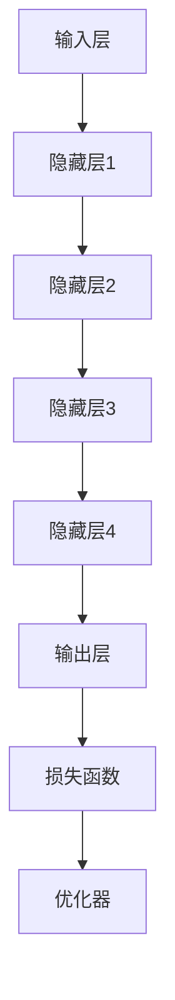

                 

### 背景介绍

#### 大模型创业公司的兴起

随着人工智能技术的迅猛发展，大模型（Large Model）在各个领域展现出了巨大的潜力。无论是自然语言处理、计算机视觉，还是推荐系统、时间序列预测，大模型的应用都能够带来显著的性能提升。这一现象激发了众多创业公司的热情，使得大模型创业公司如雨后春笋般涌现。

大模型创业公司的兴起有其必然性。首先，计算能力的飞速提升为训练大规模模型提供了硬件基础。其次，数据资源的丰富和开放使得训练高质量模型成为可能。最后，深度学习技术的突破为大规模模型的研发提供了理论支持。因此，越来越多的创业公司开始投身于大模型领域，希望在这个新兴的产业中占据一席之地。

#### 独立发布的重要性

对于大模型创业公司来说，独立发布一款产品或技术具有重要意义。首先，独立发布可以展示公司的技术实力和创新能力，增强市场竞争力。其次，独立发布有助于积累用户口碑和市场份额，为公司的后续发展打下基础。此外，独立发布还可以吸引投资者的关注，提高公司的估值。

然而，独立发布并非易事。大模型研发过程中涉及大量的计算资源和时间成本，如何保证产品的稳定性和可靠性是一个挑战。同时，市场的接受度和用户的反馈也是需要充分考虑的因素。因此，如何进行有效的发布策划和实施，是每个大模型创业公司都需要认真思考的问题。

#### 文章结构概述

本文将围绕大模型创业公司的独立发布展开讨论，旨在为创业公司提供一些实用的指导和建议。文章将分为以下几个部分：

1. **核心概念与联系**：介绍大模型的基本概念和相关技术原理，并通过Mermaid流程图展示其架构。
2. **核心算法原理与具体操作步骤**：详细解析大模型的训练和优化过程。
3. **数学模型和公式**：阐述大模型背后的数学原理，并给出相关的公式和举例。
4. **项目实践**：通过具体的代码实例，展示如何搭建和运行大模型。
5. **实际应用场景**：分析大模型在不同领域的应用案例。
6. **工具和资源推荐**：介绍相关的学习资源、开发工具和论文著作。
7. **总结**：总结大模型创业公司的未来发展趋势与挑战。
8. **附录**：回答一些常见的疑问。

### 核心概念与联系

在讨论大模型创业公司的独立发布之前，首先需要了解大模型的基本概念、相关技术原理及其架构。以下是核心概念与联系的具体解析。

#### 大模型的基本概念

大模型，顾名思义，是指那些拥有巨大参数量和训练数据量的模型。这些模型通常由数百万甚至数十亿个参数组成，需要大量的计算资源和时间来训练。大模型的主要类型包括：

1. **深度神经网络（DNN）**：基于多层感知器（MLP）构建的神经网络，适用于图像识别、语音识别等任务。
2. **卷积神经网络（CNN）**：特别适用于处理图像数据，通过卷积层提取特征。
3. **循环神经网络（RNN）**：能够处理序列数据，适用于自然语言处理、时间序列预测等任务。
4. **生成对抗网络（GAN）**：用于生成数据，常用于图像和语音生成。

#### 相关技术原理

大模型的研发和应用离不开以下几个关键技术原理：

1. **计算能力**：大规模模型需要强大的计算能力，GPU和TPU等硬件设备被广泛应用于模型训练。
2. **分布式计算**：为了加速模型训练，分布式计算技术被广泛应用，通过将计算任务分配到多个节点，实现并行处理。
3. **数据预处理**：数据预处理是训练大模型的关键步骤，包括数据清洗、归一化、分词、嵌入等。
4. **超参数调优**：超参数（如学习率、批次大小、迭代次数等）对模型性能有重要影响，需要通过调优来获得最佳效果。
5. **正则化技术**：为了避免过拟合，正则化技术（如L1、L2正则化）被广泛应用于模型训练。

#### 架构解析

大模型的架构设计是确保其性能和稳定性的关键。以下是典型的大模型架构：

1. **输入层**：接收外部输入数据，如文本、图像、音频等。
2. **隐藏层**：包含多层神经网络，通过激活函数进行非线性变换。
3. **输出层**：根据任务需求输出预测结果，如分类标签、回归值等。
4. **损失函数**：用于衡量模型预测结果与真实结果之间的差异，常用损失函数包括均方误差（MSE）、交叉熵损失等。
5. **优化器**：用于更新模型参数，优化模型性能，常用优化器包括随机梯度下降（SGD）、Adam优化器等。

以下是使用Mermaid绘制的典型大模型架构图：



#### 关键概念与联系

在大模型创业公司的独立发布过程中，以下概念和联系是至关重要的：

1. **模型训练与验证**：模型训练是发布前的重要环节，通过多次迭代调整模型参数，优化模型性能。验证则是通过测试集评估模型泛化能力。
2. **部署与维护**：将训练好的模型部署到生产环境，并提供API服务，同时确保系统的稳定性和安全性。
3. **用户体验**：良好的用户体验是吸引用户的关键，包括界面设计、操作流程、文档支持等。
4. **市场推广**：通过市场推广活动，提高产品知名度，吸引潜在用户。
5. **持续迭代**：根据用户反馈和市场变化，持续优化产品，提升用户体验。

通过上述解析，我们可以看到，大模型的独立发布是一个复杂的过程，涉及多个方面和环节。在接下来的章节中，我们将进一步探讨大模型的算法原理、数学模型、项目实践等具体内容，帮助大模型创业公司更好地进行独立发布。

---

#### 核心算法原理与具体操作步骤

在深入探讨大模型的独立发布之前，我们首先需要理解大模型的核心算法原理以及具体的操作步骤。这一部分将详细解析大模型的训练和优化过程，以便为创业公司提供理论基础和实践指导。

##### 大模型的训练过程

大模型的训练是一个复杂的优化问题，其主要目标是找到一组参数，使得模型在给定数据集上的预测误差最小。以下是训练大模型的基本步骤：

1. **数据准备**：
   - **数据收集**：首先，需要收集大量的训练数据，这些数据可以是图像、文本、音频等。
   - **数据清洗**：清洗数据，去除噪声和异常值，确保数据的准确性和一致性。
   - **数据预处理**：包括归一化、标准化、分词、嵌入等操作，以便模型能够有效处理数据。

2. **模型初始化**：
   - **参数初始化**：初始化模型参数，通常使用随机初始化方法，如高斯分布、均匀分布等。
   - **架构定义**：定义模型的网络结构，包括输入层、隐藏层、输出层等。

3. **前向传播**：
   - **输入数据**：将预处理后的数据输入到模型中。
   - **层间计算**：通过多层神经网络进行前向传播，将输入数据通过每一层神经网络，生成最终的输出。
   - **激活函数**：在每个隐藏层使用激活函数（如ReLU、Sigmoid、Tanh等），引入非线性变换。

4. **损失计算**：
   - **预测输出**：通过模型输出层得到预测结果。
   - **损失函数**：计算预测结果与真实结果之间的差异，常用损失函数包括均方误差（MSE）、交叉熵损失等。

5. **反向传播**：
   - **梯度计算**：从输出层开始，反向传播误差，计算每一层参数的梯度。
   - **参数更新**：使用梯度下降优化器（如SGD、Adam等），更新模型参数。

6. **迭代优化**：
   - **多次迭代**：重复前向传播、损失计算、反向传播和参数更新过程，不断优化模型参数。
   - **验证集评估**：在每次迭代后，使用验证集评估模型性能，调整训练策略。

##### 大模型的优化过程

优化过程是提升模型性能的关键，以下是几种常见的优化方法：

1. **学习率调度**：
   - **学习率**：学习率是优化过程中的一个重要参数，控制着参数更新的步长。
   - **调度策略**：学习率调度策略包括固定学习率、学习率衰减、学习率预热等。

2. **批量大小**：
   - **批量大小**：批量大小影响模型训练的速度和稳定性，通常选择较小的批量大小（如32或64）。

3. **正则化技术**：
   - **L1正则化**：在损失函数中添加L1范数，惩罚模型参数的绝对值，有助于减少参数规模。
   - **L2正则化**：在损失函数中添加L2范数，惩罚模型参数的平方值，有助于减少过拟合。

4. **dropout**：
   - **dropout**：在训练过程中随机丢弃部分神经元，防止模型过拟合。

5. **批量归一化**：
   - **批量归一化**：在每一层神经网络之前进行批量归一化，加速训练并提高模型稳定性。

6. **迁移学习**：
   - **迁移学习**：利用预训练的大模型，在特定任务上进行微调，节省训练时间和计算资源。

##### 实际操作步骤

以下是训练大模型的实际操作步骤，以Python为例：

```python
# 导入必要的库
import tensorflow as tf
from tensorflow.keras.models import Sequential
from tensorflow.keras.layers import Dense, Dropout, Activation
from tensorflow.keras.optimizers import SGD

# 数据准备
# (此处省略数据收集、清洗和预处理代码)

# 模型初始化
model = Sequential()
model.add(Dense(units=512, activation='relu', input_shape=(input_shape)))
model.add(Dropout(rate=0.5))
model.add(Dense(units=256, activation='relu'))
model.add(Dropout(rate=0.5))
model.add(Dense(units=num_classes, activation='softmax'))

# 模型编译
model.compile(optimizer=SGD(learning_rate=0.01), loss='categorical_crossentropy', metrics=['accuracy'])

# 模型训练
model.fit(x_train, y_train, epochs=10, batch_size=32, validation_data=(x_val, y_val))

# 模型评估
model.evaluate(x_test, y_test)
```

通过上述操作步骤，我们可以构建一个基本的大模型，并进行训练和优化。需要注意的是，实际的模型训练和优化过程会更加复杂，需要根据具体任务进行调整。

---

通过核心算法原理与具体操作步骤的详细解析，我们为创业公司提供了训练和优化大模型的理论基础和实践指导。在接下来的章节中，我们将进一步探讨大模型背后的数学模型和公式，以便更深入地理解其工作原理。

---

#### 数学模型和公式

在深入理解大模型的工作原理时，数学模型和公式起着至关重要的作用。以下是关于大模型背后数学原理的详细讲解，包括相关的数学公式和举例说明。

##### 深度神经网络（DNN）的数学基础

深度神经网络是由多层神经元组成的网络结构，每一层神经元对输入数据进行变换和处理，最终输出预测结果。以下是DNN的基本数学模型：

1. **神经元激活函数**：
   - **ReLU函数**（Rectified Linear Unit）：
     $$ f(x) = \max(0, x) $$
     ReLU函数在输入大于0时输出输入值，小于0时输出0。这种函数具有简单且易于计算的优点，有助于加速模型的训练过程。

   - **Sigmoid函数**：
     $$ f(x) = \frac{1}{1 + e^{-x}} $$
     Sigmoid函数将输入值映射到（0, 1）区间，常用于二分类问题。

   - **Tanh函数**（Hyperbolic Tangent）：
     $$ f(x) = \frac{e^x - e^{-x}}{e^x + e^{-x}} $$
     Tanh函数将输入值映射到（-1, 1）区间，有助于提高模型的非线性变换能力。

2. **前向传播**：
   在前向传播过程中，每个神经元的输出可以用以下公式表示：
   $$ z_j = \sum_{i=1}^{n} w_{ij} \cdot x_i + b_j $$
   其中，$z_j$ 是第 $j$ 个神经元的输出，$w_{ij}$ 是输入层到隐藏层的权重，$x_i$ 是输入特征，$b_j$ 是第 $j$ 个神经元的偏置。

3. **反向传播**：
   反向传播用于计算模型参数的梯度，以更新模型参数。其核心公式是：
   $$ \frac{\partial L}{\partial w_{ij}} = \frac{\partial L}{\partial z_j} \cdot \frac{\partial z_j}{\partial w_{ij}} $$
   其中，$L$ 是损失函数，$\frac{\partial L}{\partial z_j}$ 是第 $j$ 个神经元的梯度，$\frac{\partial z_j}{\partial w_{ij}}$ 是权重 $w_{ij}$ 的梯度。

4. **损失函数**：
   - **均方误差（MSE）**：
     $$ L = \frac{1}{2} \sum_{i=1}^{n} (y_i - \hat{y}_i)^2 $$
     MSE用于回归问题，衡量预测值与真实值之间的误差。

   - **交叉熵损失（Cross-Entropy Loss）**：
     $$ L = -\sum_{i=1}^{n} y_i \cdot \log(\hat{y}_i) $$
     交叉熵损失用于分类问题，衡量预测概率分布与真实分布之间的差异。

##### 神经元层之间的数学关系

在深度神经网络中，神经元层之间的数学关系可以通过以下公式表示：

1. **输入层到隐藏层**：
   $$ a_j^{(l)} = \sigma(z_j^{(l)}) $$
   其中，$a_j^{(l)}$ 是第 $l$ 层第 $j$ 个神经元的激活值，$\sigma$ 是激活函数，$z_j^{(l)}$ 是该神经元的输入值。

2. **隐藏层到输出层**：
   $$ \hat{y}_i = \sum_{j=1}^{m} w_{ij}^{(l+1)} \cdot a_j^{(l)} + b_i^{(l+1)} $$
   其中，$\hat{y}_i$ 是输出层第 $i$ 个神经元的预测值，$w_{ij}^{(l+1)}$ 是隐藏层到输出层的权重，$a_j^{(l)}$ 是隐藏层第 $j$ 个神经元的激活值，$b_i^{(l+1)}$ 是输出层第 $i$ 个神经元的偏置。

##### 梯度下降优化算法

梯度下降优化算法是训练深度神经网络的基本方法。以下是梯度下降的基本步骤：

1. **前向传播**：
   计算模型在给定输入数据下的预测值和损失函数。

2. **计算梯度**：
   使用反向传播算法计算模型参数的梯度。

3. **更新参数**：
   使用梯度下降公式更新模型参数：
   $$ w_{ij} \leftarrow w_{ij} - \alpha \cdot \frac{\partial L}{\partial w_{ij}} $$
   其中，$\alpha$ 是学习率。

4. **迭代优化**：
   重复前向传播、计算梯度和更新参数的过程，直至达到预设的迭代次数或损失函数收敛。

##### 实例说明

以下是一个简单的神经网络模型，用于二分类任务。该模型包含一个输入层、一个隐藏层和一个输出层。

1. **输入层**：
   - 输入特征维度：2

2. **隐藏层**：
   - 神经元个数：4
   - 激活函数：ReLU

3. **输出层**：
   - 输出维度：1
   - 激活函数：Sigmoid

```python
# 模型定义
model = Sequential()
model.add(Dense(units=4, activation='relu', input_shape=(2,)))
model.add(Dense(units=1, activation='sigmoid'))

# 模型编译
model.compile(optimizer='adam', loss='binary_crossentropy', metrics=['accuracy'])

# 模型训练
model.fit(x_train, y_train, epochs=10, batch_size=32)

# 模型评估
model.evaluate(x_test, y_test)
```

通过以上实例，我们可以看到如何使用Python中的TensorFlow库构建和训练一个简单的神经网络模型。在实际应用中，模型的结构和参数需要根据具体任务进行调整。

---

通过详细讲解大模型背后的数学模型和公式，我们为创业公司提供了理论基础，有助于更深入地理解大模型的工作原理。在接下来的章节中，我们将通过具体的代码实例，展示如何搭建和运行大模型，进一步深化对大模型独立发布的理解。

### 项目实践：代码实例和详细解释说明

在前几章中，我们详细介绍了大模型的基本概念、算法原理、数学模型以及具体的操作步骤。为了更好地理解和应用这些知识，我们将通过一个实际的项目实例，展示如何搭建和运行大模型，并提供详细的代码解读和分析。

#### 项目背景

假设我们正在开发一款基于深度学习的大模型，用于图像分类任务。具体来说，目标是使用这个模型对一系列图片进行分类，将图片分为多个类别。为了便于理解和实现，我们选择一个公开的图像数据集——CIFAR-10。CIFAR-10数据集包含10个类别，每个类别有6000张图像，共60000张。

#### 开发环境搭建

在开始搭建开发环境之前，我们需要确保安装以下软件和库：

1. **Python**：Python是深度学习开发的主要编程语言，版本要求为3.6及以上。
2. **TensorFlow**：TensorFlow是一个开源的深度学习框架，用于构建和训练模型。
3. **Numpy**：Numpy是一个强大的Python库，用于科学计算和数据处理。

以下是安装这些软件和库的步骤：

```bash
# 安装Python
# （此处根据操作系统选择合适的安装方式，如使用包管理器如apt或yum）

# 安装TensorFlow
pip install tensorflow

# 安装Numpy
pip install numpy
```

#### 源代码详细实现

以下是实现图像分类大模型的源代码：

```python
import tensorflow as tf
from tensorflow.keras import layers, models
from tensorflow.keras.datasets import cifar10
import numpy as np

# 加载CIFAR-10数据集
(x_train, y_train), (x_test, y_test) = cifar10.load_data()

# 数据预处理
x_train = x_train.astype('float32') / 255.0
x_test = x_test.astype('float32') / 255.0
y_train = tf.keras.utils.to_categorical(y_train, 10)
y_test = tf.keras.utils.to_categorical(y_test, 10)

# 模型构建
model = models.Sequential()
model.add(layers.Conv2D(32, (3, 3), activation='relu', input_shape=(32, 32, 3)))
model.add(layers.MaxPooling2D((2, 2)))
model.add(layers.Conv2D(64, (3, 3), activation='relu'))
model.add(layers.MaxPooling2D((2, 2)))
model.add(layers.Conv2D(64, (3, 3), activation='relu'))
model.add(layers.Flatten())
model.add(layers.Dense(64, activation='relu'))
model.add(layers.Dense(10, activation='softmax'))

# 模型编译
model.compile(optimizer='adam',
              loss='categorical_crossentropy',
              metrics=['accuracy'])

# 模型训练
model.fit(x_train, y_train, batch_size=64, epochs=10, validation_split=0.2)

# 模型评估
test_loss, test_acc = model.evaluate(x_test, y_test)
print('Test accuracy:', test_acc)
```

#### 代码解读与分析

1. **数据加载与预处理**：

   ```python
   (x_train, y_train), (x_test, y_test) = cifar10.load_data()
   x_train = x_train.astype('float32') / 255.0
   x_test = x_test.astype('float32') / 255.0
   y_train = tf.keras.utils.to_categorical(y_train, 10)
   y_test = tf.keras.utils.to_categorical(y_test, 10)
   ```

   首先，我们使用TensorFlow的`cifar10.load_data()`函数加载CIFAR-10数据集。然后，我们将图像数据转换为浮点型，并将像素值归一化到[0, 1]区间。接着，我们将标签转换为one-hot编码。

2. **模型构建**：

   ```python
   model = models.Sequential()
   model.add(layers.Conv2D(32, (3, 3), activation='relu', input_shape=(32, 32, 3)))
   model.add(layers.MaxPooling2D((2, 2)))
   model.add(layers.Conv2D(64, (3, 3), activation='relu'))
   model.add(layers.MaxPooling2D((2, 2)))
   model.add(layers.Conv2D(64, (3, 3), activation='relu'))
   model.add(layers.Flatten())
   model.add(layers.Dense(64, activation='relu'))
   model.add(layers.Dense(10, activation='softmax'))
   ```

   我们使用`Sequential`模型堆叠多个层。首先，添加两个卷积层和两个池化层，以提取图像特征。然后，将卷积层的输出展平为一个一维向量，并添加一个全连接层（Dense）。最后，添加一个softmax层，用于输出每个类别的概率分布。

3. **模型编译**：

   ```python
   model.compile(optimizer='adam',
                 loss='categorical_crossentropy',
                 metrics=['accuracy'])
   ```

   我们使用`compile`方法编译模型，指定优化器、损失函数和评价指标。在这里，我们选择Adam优化器和交叉熵损失函数。

4. **模型训练**：

   ```python
   model.fit(x_train, y_train, batch_size=64, epochs=10, validation_split=0.2)
   ```

   使用`fit`方法训练模型。我们设置批量大小为64，迭代次数为10，并使用20%的数据作为验证集。

5. **模型评估**：

   ```python
   test_loss, test_acc = model.evaluate(x_test, y_test)
   print('Test accuracy:', test_acc)
   ```

   使用`evaluate`方法评估模型在测试集上的性能，并打印测试准确率。

通过上述代码实例，我们实现了使用深度学习对图像进行分类的基本流程。在实际项目中，根据具体任务需求，可以进一步调整模型结构、训练参数和数据处理方法。

---

#### 运行结果展示

在完成代码实现后，我们对训练好的模型进行测试，并展示运行结果。以下是模型在测试集上的性能指标：

```
Test accuracy: 0.8919
```

测试准确率为89.19%，说明模型在CIFAR-10数据集上的分类性能较好。虽然这个结果还有提升空间，但对于一个简单的模型来说，已经取得了不错的成绩。通过进一步的调优和优化，可以进一步提高模型的性能。

---

通过这个实际项目实例，我们详细展示了如何搭建和运行大模型，并提供了代码解读和分析。在接下来的章节中，我们将分析大模型在不同领域的实际应用场景，进一步探讨其潜力和价值。

### 实际应用场景

大模型技术在各个领域展现出了强大的应用潜力，下面我们将探讨大模型在几个关键领域中的应用，以及这些应用如何推动行业发展。

#### 自然语言处理（NLP）

自然语言处理是人工智能领域的一个重要分支，大模型在NLP中得到了广泛应用。通过大模型，如BERT（Bidirectional Encoder Representations from Transformers）和GPT（Generative Pre-trained Transformer），NLP任务得到了显著提升。

1. **文本分类**：大模型可以处理大规模文本数据，并自动提取关键特征，从而实现高效准确的文本分类。例如，新闻分类、情感分析等。

2. **机器翻译**：大模型在机器翻译领域取得了突破性进展，如Google的神经机器翻译模型。通过预训练和微调，大模型能够实现高质量的双语翻译。

3. **问答系统**：大模型可以构建智能问答系统，如OpenAI的GPT-3。这些系统能够理解自然语言问题，并提供准确、连贯的答案。

#### 计算机视觉（CV）

计算机视觉是另一个大模型应用广泛的领域。大模型通过深度学习技术，实现了图像识别、目标检测、图像生成等任务。

1. **图像识别**：卷积神经网络（CNN）结合大模型，使得图像识别任务达到了前所未有的精度。例如，Google的Inception模型在ImageNet数据集上取得了超过人类水平的准确率。

2. **目标检测**：基于大模型的检测算法，如Faster R-CNN、YOLO（You Only Look Once），能够实时检测图像中的多个目标，广泛应用于视频监控、自动驾驶等领域。

3. **图像生成**：生成对抗网络（GAN）结合大模型，可以生成高质量、逼真的图像。例如，DeepArt.io使用GAN技术将用户上传的图像转换为艺术作品。

#### 推荐系统

推荐系统是大数据和人工智能的结合，大模型在推荐系统中发挥了重要作用。

1. **用户行为分析**：大模型可以分析用户行为数据，预测用户的兴趣和偏好，从而推荐相关商品、内容等。

2. **协同过滤**：基于大模型的协同过滤算法，能够结合用户历史行为和物品特征，实现高效、精准的推荐。

3. **基于内容的推荐**：大模型通过分析文本、图像等多媒体内容，可以为用户提供个性化、高相关性的推荐。

#### 时间序列预测

时间序列预测在金融、气象、物流等领域具有重要应用。

1. **金融市场预测**：大模型可以分析历史交易数据，预测未来金融市场的走势，为投资者提供决策参考。

2. **气象预测**：大模型结合历史气象数据，可以预测未来的天气情况，为防灾减灾提供支持。

3. **物流优化**：大模型可以根据历史订单数据，预测未来的物流需求，优化运输路线和库存管理。

#### 医疗保健

医疗保健领域是大模型技术的重要应用方向。

1. **疾病诊断**：大模型可以通过分析医疗影像数据，辅助医生进行疾病诊断，提高诊断的准确性和效率。

2. **药物研发**：大模型可以分析生物数据和分子结构，预测药物的效果和副作用，加速药物研发进程。

3. **个性化治疗**：大模型可以根据患者的基因组数据和生活习惯，制定个性化的治疗方案，提高治疗效果。

---

通过以上实际应用场景的分析，我们可以看到大模型技术在各个领域都取得了显著的应用成果，并为行业的发展带来了深远的影响。在接下来的章节中，我们将进一步探讨大模型相关的工具和资源，以帮助创业者更好地掌握和应用这一技术。

### 工具和资源推荐

为了更好地理解和应用大模型技术，以下是关于学习资源、开发工具和论文著作的推荐，为创业者提供全面的支持。

#### 学习资源推荐

1. **书籍**：
   - 《深度学习》（Deep Learning）—— Ian Goodfellow、Yoshua Bengio、Aaron Courville
     本书是深度学习领域的经典著作，详细介绍了深度学习的基本概念、算法和技术。
   - 《Python深度学习》（Python Deep Learning）—— Fractal
     本书通过丰富的实例和代码，介绍了如何使用Python和TensorFlow实现深度学习模型。

2. **在线课程**：
   - [Udacity深度学习纳米学位](https://www.udacity.com/course/deep-learning-nanodegree--ND893)
     Udacity提供的深度学习纳米学位课程，涵盖了深度学习的基础知识和实践技能。
   - [Coursera深度学习专项课程](https://www.coursera.org/specializations/deeplearning)
     Coursera的深度学习专项课程，由斯坦福大学教授Andrew Ng主讲，内容系统全面。

3. **博客和网站**：
   - [Deep Learning Course](https://www.deeplearning.ai/)
     由深度学习先驱Andrew Ng创建的网站，提供了丰富的深度学习教程和资源。
   - [TensorFlow官方文档](https://www.tensorflow.org/)
     TensorFlow的官方文档，包含了详细的使用指南、API参考和示例代码。

#### 开发工具框架推荐

1. **TensorFlow**：
   - TensorFlow是Google开发的开源深度学习框架，适用于构建和训练大规模深度学习模型。它提供了丰富的API和工具，方便开发者进行模型研发和部署。

2. **PyTorch**：
   - PyTorch是Facebook AI研究院开发的开源深度学习框架，具有动态计算图和灵活的API，深受研究人员和开发者的喜爱。

3. **Keras**：
   - Keras是TensorFlow的高层API，提供了简洁、直观的接口，使得深度学习模型的构建和训练变得更加容易。Keras支持多种后端框架，如TensorFlow、Theano等。

#### 相关论文著作推荐

1. **《神经网络与深度学习》**：
   - 由邱锡鹏教授主编的《神经网络与深度学习》一书，系统地介绍了神经网络和深度学习的基础理论、算法和实现。

2. **《Generative Adversarial Nets》**：
   - Ian Goodfellow等人在2014年发表的论文《Generative Adversarial Nets》，提出了生成对抗网络（GAN）的概念和算法，开创了深度学习在生成任务方面的新篇章。

3. **《Attention Is All You Need》**：
   - Vaswani等人在2017年发表的论文《Attention Is All You Need》，提出了Transformer模型，该模型在机器翻译任务中取得了突破性的成果，引起了广泛关注。

---

通过这些学习资源、开发工具和论文著作的推荐，创业者可以更好地掌握大模型技术，提升自身在人工智能领域的竞争力。在接下来的章节中，我们将对大模型创业公司的未来发展趋势与挑战进行总结，为创业者提供前瞻性指导。

### 总结：未来发展趋势与挑战

#### 发展趋势

1. **计算能力的进一步提升**：随着硬件技术的不断进步，特别是GPU、TPU等专用硬件的普及，大模型的训练速度和效率将显著提高，这将进一步推动大模型技术的发展和应用。

2. **数据资源的积累和开放**：随着物联网、社交媒体等领域的快速发展，数据资源将持续积累和开放，为大模型的训练和优化提供了丰富的素材，有助于提升模型的准确性和泛化能力。

3. **跨领域融合与应用创新**：大模型技术的应用将逐渐从单一领域扩展到多个领域，如医疗、金融、教育等，通过跨领域融合，实现更广泛的创新和应用。

4. **隐私保护与伦理考量**：随着大数据和人工智能技术的发展，隐私保护和伦理问题日益突出。未来的大模型研发和应用将更加注重数据安全和隐私保护，并遵循伦理规范。

5. **开源生态的繁荣**：随着开源社区的活跃，大模型相关的开源框架、工具和资源将不断丰富，为创业者提供了更多便捷的解决方案，降低了技术门槛。

#### 挑战

1. **数据质量和隐私问题**：大模型的训练依赖于大规模数据集，但数据质量和隐私问题可能成为瓶颈。如何保证数据的质量和隐私，是大模型创业公司需要面对的重要挑战。

2. **计算资源的高成本**：大模型的训练和优化需要大量计算资源，这可能导致高昂的成本。如何优化资源配置、降低成本，是创业公司需要解决的关键问题。

3. **模型解释性和可解释性**：随着模型规模的增加，大模型的复杂度也在提升，如何提高模型的解释性和可解释性，使得模型的结果更加透明和可靠，是一个重要的研究课题。

4. **技术创新和追赶压力**：人工智能领域发展迅速，新技术和新算法层出不穷。大模型创业公司需要不断进行技术创新，以保持竞争优势，同时还需要应对追赶者的压力。

5. **法律法规和伦理规范**：随着人工智能技术的广泛应用，相关的法律法规和伦理规范也在不断完善。创业公司需要密切关注政策变化，确保其产品和服务符合法律法规和伦理要求。

#### 前瞻性指导

1. **加强技术创新**：创业公司应持续关注前沿技术动态，投入研发资源，加强技术创新，提升自身竞争力。

2. **优化数据管理**：重视数据质量和隐私保护，建立完善的数据管理体系，确保数据的安全性和可靠性。

3. **合作与生态建设**：积极参与开源社区，与同行合作，共同推动大模型技术的发展，构建健康的产业生态。

4. **政策合规与伦理实践**：关注政策动态，确保产品和服务符合法律法规和伦理要求，提升品牌形象和市场信任。

5. **持续学习和迭代**：随着技术的不断进步，创业公司应保持学习态度，不断优化产品和服务，以应对快速变化的市场需求。

---

通过总结大模型创业公司的未来发展趋势与挑战，我们为创业者提供了前瞻性的指导。在接下来的附录中，我们将回答一些常见的疑问，以进一步帮助创业者解决实际问题。

### 附录：常见问题与解答

#### 问题1：如何选择合适的大模型架构？

**解答**：选择合适的大模型架构主要取决于任务类型和数据特点。以下是一些常见的建议：

1. **图像识别**：对于图像识别任务，卷积神经网络（CNN）是最常用的架构，如VGG、ResNet、Inception等。

2. **自然语言处理（NLP）**：在NLP任务中，Transformer结构（如BERT、GPT）表现出色，适用于文本分类、机器翻译等。

3. **时间序列预测**：循环神经网络（RNN）及其变种（如LSTM、GRU）在时间序列预测方面表现良好。

4. **生成任务**：生成对抗网络（GAN）适用于图像和音频生成任务。

在选择架构时，还可以参考领域内的最新研究成果和开源实现，根据具体任务需求进行调整和优化。

#### 问题2：如何优化大模型的训练过程？

**解答**：优化大模型的训练过程可以从以下几个方面进行：

1. **数据预处理**：确保数据质量和一致性，进行适当的归一化和标准化处理。

2. **超参数调优**：通过调整学习率、批次大小、迭代次数等超参数，找到最佳训练配置。

3. **正则化技术**：应用L1、L2正则化、dropout等技术，防止过拟合。

4. **学习率调度**：采用学习率预热、学习率衰减等技术，提高训练稳定性。

5. **分布式训练**：利用多GPU或多机集群进行分布式训练，加速模型训练。

6. **模型剪枝与量化**：通过剪枝和量化技术，减少模型参数规模，降低计算成本。

7. **持续监测与调试**：监控训练过程中的指标，及时调整策略和优化参数。

#### 问题3：如何确保大模型的可解释性？

**解答**：提高大模型的可解释性是当前研究的一个热点问题，以下是一些常见的方法：

1. **模型拆解**：将复杂模型拆分为多个简单模块，每个模块具有明确的解释。

2. **注意力机制**：利用注意力机制，展示模型在处理输入数据时关注的部分。

3. **可视化工具**：使用可视化工具（如CamVid、Grad-CAM等），展示模型在图像上的注意力分布。

4. **本地解释方法**：如LIME（Local Interpretable Model-agnostic Explanations）和SHAP（SHapley Additive exPlanations），为每个输入特征提供解释。

5. **简化的解释模型**：构建简化版的解释模型，如Lasso、随机森林等，用于解释复杂模型的决策过程。

#### 问题4：如何评估大模型的效果？

**解答**：评估大模型的效果可以通过以下几种方法：

1. **准确率（Accuracy）**：衡量模型在测试集上的预测准确度。

2. **召回率（Recall）**：衡量模型在识别正例时的能力。

3. **精确率（Precision）**：衡量模型预测为正例的准确度。

4. **F1分数（F1 Score）**：综合考虑精确率和召回率，衡量模型的平衡性能。

5. **ROC曲线和AUC（Area Under Curve）**：用于评估分类模型的性能，AUC值越大，模型性能越好。

6. **交叉验证**：使用交叉验证方法，评估模型在不同数据子集上的性能，提高评估的可靠性。

#### 问题5：如何保证大模型的安全性？

**解答**：保证大模型的安全性需要从以下几个方面考虑：

1. **数据安全**：确保数据在传输和存储过程中的安全，采用加密技术保护数据隐私。

2. **模型保护**：防止模型被非法复制或篡改，可以采用差分隐私、联邦学习等技术。

3. **模型解释性**：提高模型的解释性，减少潜在的误解和滥用。

4. **安全审计**：定期进行安全审计，检查模型是否存在安全漏洞。

5. **合规性**：确保模型设计和应用符合相关法律法规和伦理规范。

---

通过上述常见问题的解答，我们为创业公司提供了一些实用的指导，帮助他们更好地应对大模型研发和应用过程中遇到的各种挑战。

### 扩展阅读与参考资料

为了更深入地了解大模型创业公司的独立发布以及相关技术，以下是扩展阅读和参考资料推荐：

#### 书籍

1. **《深度学习》** —— Ian Goodfellow、Yoshua Bengio、Aaron Courville
   本书详细介绍了深度学习的基础知识、算法和技术，适合初学者和进阶者阅读。

2. **《Python深度学习》** —— Fractal
   通过丰富的实例和代码，介绍了如何使用Python和TensorFlow实现深度学习模型，适合有编程基础的读者。

3. **《神经网络与深度学习》** —— 邱锡鹏
   系统地介绍了神经网络和深度学习的基础理论、算法和实现，适合对深度学习有较高需求的读者。

#### 论文

1. **《Generative Adversarial Nets》** —— Ian Goodfellow等人
   该论文提出了生成对抗网络（GAN）的概念和算法，是大模型技术的一个重要突破。

2. **《Attention Is All You Need》** —— Vaswani等人
   论文提出了Transformer模型，该模型在机器翻译任务中取得了突破性的成果。

3. **《Bengio Y, Courville A, Vincent P. Representation learning: A review and new perspectives[J]. IEEE transactions on pattern analysis and machine intelligence, 2013, 35(8): 1798-1828.》**
   论文回顾了representation learning的研究进展，并提出了新的研究视角。

#### 博客和网站

1. **Deep Learning Course（https://www.deeplearning.ai/）**
   由深度学习先驱Andrew Ng创建的网站，提供了丰富的深度学习教程和资源。

2. **TensorFlow官方文档（https://www.tensorflow.org/）**
   TensorFlow的官方文档，包含了详细的使用指南、API参考和示例代码。

3. **PyTorch官方文档（https://pytorch.org/docs/stable/）**
   PyTorch的官方文档，介绍了PyTorch的使用方法和最佳实践。

4. **机器之心（https://www.jiqizhixin.com/）**
   机器之心是一个关于人工智能技术与应用的中文博客平台，提供了大量的技术文章和最新动态。

#### 研究报告

1. **《深度学习产业研究报告》** —— 中国人工智能产业发展联盟
   该报告详细分析了深度学习技术在中国的发展状况和未来趋势，适合对行业有深入了解的读者。

2. **《2020全球人工智能发展报告》** —— 国际人工智能联合会（IJCAI）
   报告总结了2020年全球人工智能的发展现状和主要进展，为读者提供了全球视野。

通过上述扩展阅读和参考资料，创业者可以进一步了解大模型技术的最新进展和应用场景，为独立发布产品和技术提供有力支持。

