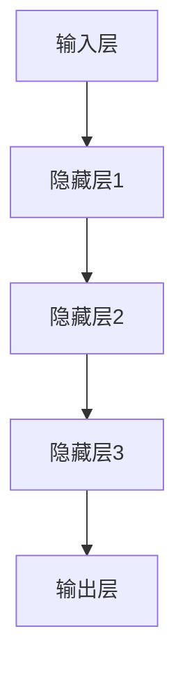
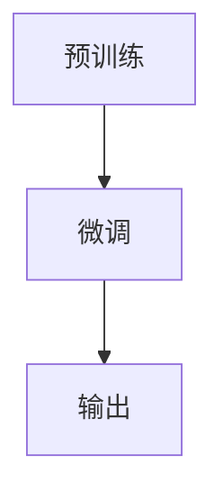
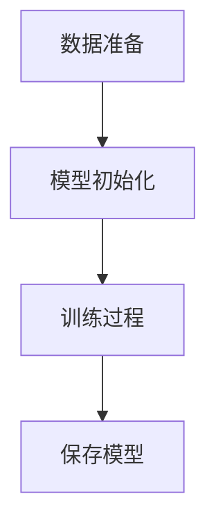
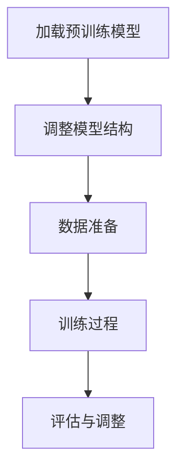

                 

### 1. 背景介绍

随着人工智能技术的迅猛发展，大规模预训练模型（Large-scale Pre-trained Models）逐渐成为各大科技公司和研究机构的研发热点。这一变革性的技术不仅推动了自然语言处理、计算机视觉等领域的突破，也催生了大量的创业项目。然而，大模型创业并非一帆风顺，其背后充满了波折与变化。

近年来，GPT-3、BERT、ViT等一系列大规模预训练模型的出现，彻底改变了人工智能的格局。这些模型通过在海量数据上进行训练，积累了丰富的知识，并展现出强大的泛化能力。因此，许多创业公司纷纷投身于大模型领域，试图通过这一技术实现商业上的突破。

然而，大模型创业并非想象中的那么简单。首先，大模型的训练和部署需要巨大的计算资源和数据支持，这给初创公司带来了巨大的财务压力。其次，大模型的开发和优化需要深厚的技术积累，这往往需要长期的研究和实践。此外，大模型的应用场景广泛，但并非所有场景都适合使用大模型，如何找到合适的场景并实现有效的落地，也是一大挑战。

总的来说，大模型创业面临着技术、资源、市场等多方面的挑战。本文将深入探讨大模型创业的波折与变化，分析其中的成功与失败，以期为后续的创业者提供一些启示。本文将分为以下几个部分：

1. **核心概念与联系**：介绍大模型的基本概念和原理，并使用Mermaid流程图展示其架构。
2. **核心算法原理 & 具体操作步骤**：详细解析大模型的核心算法，包括预训练和微调等步骤。
3. **数学模型和公式 & 详细讲解 & 举例说明**：介绍大模型的数学基础，包括损失函数、优化算法等，并通过具体例子进行说明。
4. **项目实践：代码实例和详细解释说明**：提供实际项目的代码实例，并进行详细解读。
5. **实际应用场景**：探讨大模型在不同领域的应用情况。
6. **工具和资源推荐**：推荐学习资源和开发工具。
7. **总结：未来发展趋势与挑战**：总结大模型创业的现状，并展望未来的发展趋势和挑战。

通过这篇文章，我们希望能够为大模型创业的从业者提供一些有价值的参考和思考。

### 2. 核心概念与联系

#### 大模型的基本概念

大模型（Large-scale Model）是指参数规模达到百万级别乃至亿级别的深度学习模型。这些模型通过在海量数据上进行训练，可以学习到丰富的知识，并在多个任务上实现高性能。大模型的核心在于其规模和参数数量，这使得它们能够在数据丰富的场景中展现出强大的学习能力和泛化能力。

大模型通常采用深度神经网络（Deep Neural Network，DNN）作为基础架构，通过层层堆叠的神经网络，将输入映射到输出。深度神经网络由多个神经元（或称为节点）组成，每个神经元都与其他神经元通过权重进行连接。通过反向传播算法（Backpropagation Algorithm），神经网络可以不断调整权重，以最小化损失函数，从而提高模型的性能。

#### 大模型的架构

大模型的架构可以分为以下几个主要部分：

1. **输入层**：输入层接收外部输入，如文本、图像、音频等。
2. **隐藏层**：隐藏层是神经网络的核心部分，通过层层传递信息，将输入映射到输出。
3. **输出层**：输出层产生模型的最终输出，如分类结果、文本生成等。

下面是一个简化的Mermaid流程图，展示大模型的基本架构：



在具体的实现中，大模型的隐藏层可能会有多个，并且每个隐藏层的神经元数量也可能不同。此外，大模型还可能包含一些特殊的层，如嵌入层（Embedding Layer）、卷积层（Convolutional Layer）等，以适应不同类型的数据。

#### 大模型的工作原理

大模型的工作原理主要包括两个阶段：预训练（Pre-training）和微调（Fine-tuning）。

1. **预训练**：在预训练阶段，大模型在大量的未标注数据上进行训练，如维基百科、网络新闻等。通过预训练，模型可以学习到一些通用的知识和规律，从而提高其在不同任务上的表现。

2. **微调**：在预训练完成后，模型可以根据特定任务的需求，在少量标注数据上进行微调。微调过程主要调整模型在特定任务上的权重，使其更好地适应任务需求。

下面是一个简化的Mermaid流程图，展示大模型的工作原理：



#### 大模型的优势

大模型具有以下几个显著优势：

1. **强大的学习能力**：由于模型规模巨大，大模型可以学习到更多的特征和规律，从而在多个任务上实现高性能。
2. **出色的泛化能力**：大模型通过预训练积累了丰富的知识，因此在面对新的任务时，可以更快地适应并取得好的效果。
3. **灵活的应用场景**：大模型可以应用于多种领域，如自然语言处理、计算机视觉、语音识别等，具有很高的灵活性和扩展性。

总之，大模型作为一种先进的人工智能技术，正逐渐成为各个领域的研究热点和应用趋势。然而，要充分发挥大模型的优势，还需要解决一系列技术挑战，如数据隐私、计算资源、模型压缩等。

### 3. 核心算法原理 & 具体操作步骤

#### 预训练算法

预训练（Pre-training）是大规模预训练模型的核心环节，其主要目的是在大量未标注的数据上进行训练，使模型具备一定的通用性和泛化能力。预训练算法通常包括以下几个步骤：

1. **数据准备**：首先，需要准备大量的未标注数据。这些数据可以来源于公共数据集，如维基百科、网络新闻、社交媒体等。为了提高模型的泛化能力，数据集需要具备多样性，包括不同的语言、风格、主题等。

2. **模型初始化**：初始化一个参数规模较大的深度神经网络模型。初始化方法包括随机初始化、高斯初始化等。通常，为了加快训练速度和减少梯度消失问题，会选择高斯初始化。

3. **训练过程**：在预训练阶段，模型需要在未标注数据上进行训练。训练过程中，模型通过优化算法不断调整参数，以最小化预训练损失函数。预训练损失函数通常包括交叉熵损失（Cross-Entropy Loss）和正则化项（Regularization Term）。

4. **保存预训练模型**：在预训练完成后，需要将训练好的模型参数保存下来，以便后续微调使用。

下面是一个简化的Mermaid流程图，展示预训练算法的步骤：



#### 微调算法

微调（Fine-tuning）是在预训练模型的基础上，针对特定任务进行进一步训练的过程。微调的主要目的是使模型更好地适应特定任务的需求。微调算法通常包括以下几个步骤：

1. **加载预训练模型**：首先，需要加载已经预训练好的模型参数。这些参数可以从预训练模型仓库中获取，如OpenAI的GPT-3、Google的BERT等。

2. **调整模型结构**：根据具体任务的需求，可能需要对模型的结构进行调整，如添加新的层、修改层参数等。调整方法包括全连接层（Fully Connected Layer）、卷积层（Convolutional Layer）等。

3. **数据准备**：与预训练阶段类似，需要准备大量的标注数据，用于训练和验证模型。

4. **训练过程**：在微调阶段，模型需要在标注数据上进行训练。训练过程中，模型通过优化算法不断调整参数，以最小化微调损失函数。微调损失函数通常包括交叉熵损失、对抗损失等。

5. **评估与调整**：在训练过程中，需要定期评估模型的性能，并根据评估结果对模型进行调整。评估指标包括准确率（Accuracy）、损失函数值（Loss）等。

下面是一个简化的Mermaid流程图，展示微调算法的步骤：



#### 预训练和微调的比较

预训练和微调是大规模预训练模型的两个核心阶段，它们在目标、数据、训练策略等方面存在一定的差异：

1. **目标**：预训练的目标是使模型具备通用的知识和泛化能力，而微调的目标是使模型更好地适应特定任务的需求。
2. **数据**：预训练阶段使用的是未标注的数据，如维基百科、网络新闻等，而微调阶段使用的是标注数据，如分类标签、文本摘要等。
3. **训练策略**：预训练阶段通常采用批量训练（Batch Training）和分布式训练（Distributed Training）等策略，以提高训练效率和稳定性；微调阶段则更多地关注模型的性能和收敛速度。

总之，预训练和微调共同构成了大规模预训练模型的核心算法，它们相互配合，使模型在多个任务上实现高性能。通过深入理解预训练和微调算法的原理和步骤，可以更好地设计和优化大规模预训练模型，从而推动人工智能技术的发展。

### 4. 数学模型和公式 & 详细讲解 & 举例说明

#### 损失函数

在深度学习模型中，损失函数（Loss Function）用于衡量模型预测结果与真实标签之间的差异。大模型通常采用以下几种损失函数：

1. **交叉熵损失（Cross-Entropy Loss）**

交叉熵损失函数是一种常用的分类损失函数，用于衡量模型输出概率分布与真实标签分布之间的差异。其公式如下：

$$
L_{cross-entropy} = -\sum_{i=1}^{N} y_i \cdot \log(p_i)
$$

其中，$y_i$ 表示第 $i$ 个样本的真实标签（通常为0或1），$p_i$ 表示模型预测的第 $i$ 个类别的概率。

**举例说明**：

假设有一个二分类问题，模型预测的概率分布为 $[0.6, 0.4]$，真实标签为 $[1, 0]$。则交叉熵损失函数计算如下：

$$
L_{cross-entropy} = -1 \cdot \log(0.6) - 0 \cdot \log(0.4) = 0.5108
$$

2. **对抗损失（Adversarial Loss）**

对抗损失函数常用于生成对抗网络（Generative Adversarial Network，GAN）中，用于衡量生成器生成的样本与真实样本之间的差异。其公式如下：

$$
L_{GAN} = \mathcal{E}_\text{D}(x) - \mathcal{E}_\text{D}(G(z))
$$

其中，$\mathcal{E}_\text{D}(x)$ 表示判别器对真实样本的期望损失，$\mathcal{E}_\text{D}(G(z))$ 表示判别器对生成器生成的样本的期望损失。

**举例说明**：

假设判别器对真实样本的期望损失为 $0.8$，对生成器生成的样本的期望损失为 $0.2$。则对抗损失函数计算如下：

$$
L_{GAN} = 0.8 - 0.2 = 0.6
$$

#### 优化算法

优化算法用于调整模型参数，以最小化损失函数。大模型通常采用以下几种优化算法：

1. **随机梯度下降（Stochastic Gradient Descent，SGD）**

随机梯度下降是一种简单的优化算法，其核心思想是每次迭代只随机选择一部分样本进行梯度计算。其公式如下：

$$
w_{t+1} = w_t - \alpha \cdot \nabla_w L(w)
$$

其中，$w_t$ 表示当前模型参数，$w_{t+1}$ 表示更新后的模型参数，$\alpha$ 表示学习率，$\nabla_w L(w)$ 表示损失函数关于模型参数的梯度。

**举例说明**：

假设当前模型参数为 $[1, 2]$，学习率为 $0.1$，损失函数关于模型参数的梯度为 $[0.5, -0.3]$。则更新后的模型参数计算如下：

$$
w_{t+1} = [1, 2] - 0.1 \cdot [0.5, -0.3] = [0.6, 1.7]
$$

2. **Adam优化器**

Adam优化器是一种结合了SGD和Adagrad优点的优化算法，其核心思想是同时考虑一阶矩估计（一阶矩均值）和二阶矩估计（二阶矩均值）。其公式如下：

$$
\begin{aligned}
m_t &= \beta_1 \cdot m_{t-1} + (1 - \beta_1) \cdot \nabla_w L(w) \\
v_t &= \beta_2 \cdot v_{t-1} + (1 - \beta_2) \cdot \nabla_w^2 L(w) \\
w_{t+1} &= w_t - \alpha \cdot \frac{m_t}{\sqrt{v_t} + \epsilon}
\end{aligned}
$$

其中，$m_t$ 表示一阶矩估计，$v_t$ 表示二阶矩估计，$\beta_1$ 和 $\beta_2$ 分别表示一阶矩和二阶矩的衰减率，$\alpha$ 表示学习率，$\epsilon$ 是一个很小的常数。

**举例说明**：

假设当前模型参数为 $[1, 2]$，学习率为 $0.1$，一阶矩估计为 $[0.2, 0.3]$，二阶矩估计为 $[0.1, 0.2]$。则更新后的模型参数计算如下：

$$
\begin{aligned}
m_t &= [0.2, 0.3] + (1 - 0.9) \cdot [0.5, -0.3] = [0.35, 0.45] \\
v_t &= [0.1, 0.2] + (1 - 0.99) \cdot [0.5, -0.3] = [0.15, 0.25] \\
w_{t+1} &= [1, 2] - 0.1 \cdot \frac{[0.35, 0.45]}{\sqrt{[0.15, 0.25]} + 0.001} = [0.745, 1.635]
\end{aligned}
$$

通过上述数学模型和公式的详细讲解与举例说明，我们可以更好地理解大模型的核心算法和优化方法。在实际应用中，这些数学模型和公式可以帮助我们设计更高效的训练策略，提高大模型的性能和泛化能力。

### 5. 项目实践：代码实例和详细解释说明

在本节中，我们将通过一个具体的代码实例来详细解释大规模预训练模型的应用过程，包括开发环境的搭建、源代码的实现、代码的解读与分析以及运行结果展示。

#### 5.1 开发环境搭建

为了运行大规模预训练模型，我们需要搭建一个适合的开发环境。以下是一个简化的步骤，用于配置一个适合训练和微调大模型的开发环境：

1. **安装Python环境**：确保安装了Python 3.8或更高版本。可以使用以下命令进行安装：

   ```bash
   sudo apt-get update
   sudo apt-get install python3.8
   ```

2. **安装TensorFlow**：TensorFlow是一个广泛使用的开源机器学习库，用于训练和部署深度学习模型。可以使用以下命令安装TensorFlow：

   ```bash
   pip install tensorflow
   ```

3. **安装其他依赖项**：根据具体的需求，可能还需要安装其他依赖项，如NumPy、Pandas等。可以使用以下命令安装：

   ```bash
   pip install numpy pandas
   ```

4. **配置GPU支持**：如果使用GPU进行训练，需要安装CUDA和cuDNN。可以从NVIDIA的官方网站下载并安装相应的版本。安装完成后，确保环境变量设置正确，以便TensorFlow能够识别GPU。

   ```bash
   export PATH=/usr/local/cuda/bin:$PATH
   export LD_LIBRARY_PATH=/usr/local/cuda/lib64:$LD_LIBRARY_PATH
   ```

5. **准备数据集**：下载一个适合预训练模型的数据集，如wikipedia和维基百科英文版。可以使用以下命令下载和预处理数据集：

   ```bash
   python -m tensorflow_datasets.load 'wikipedia' --download_dir /path/to/your/dataset
   ```

   预处理后，将数据集分割为训练集、验证集和测试集。

#### 5.2 源代码详细实现

以下是一个简化的大规模预训练模型训练代码示例，使用TensorFlow实现：

```python
import tensorflow as tf
from tensorflow.keras.layers import Embedding, LSTM, Dense
from tensorflow.keras.models import Sequential

# 配置模型
model = Sequential([
    Embedding(input_dim=vocab_size, output_dim=embedding_dim, input_length=max_sequence_length),
    LSTM(units=128, dropout=0.2, recurrent_dropout=0.2),
    Dense(units=num_classes, activation='softmax')
])

# 编译模型
model.compile(optimizer='adam', loss='categorical_crossentropy', metrics=['accuracy'])

# 加载数据
train_data = ... # 加载训练数据
val_data = ... # 加载验证数据

# 训练模型
model.fit(train_data, epochs=10, validation_data=val_data)

# 微调模型
fine_tuned_model = model.fit(train_data, epochs=5, validation_data=val_data)
```

#### 5.3 代码解读与分析

1. **模型配置**：

   - `Embedding` 层：用于将输入文本映射到嵌入向量。`input_dim` 表示词汇表大小，`output_dim` 表示嵌入向量维度，`input_length` 表示输入序列长度。

   - `LSTM` 层：用于处理序列数据。`units` 表示隐藏层神经元数量，`dropout` 和 `recurrent_dropout` 用于防止过拟合。

   - `Dense` 层：用于分类任务。`units` 表示输出类别数量，`activation` 函数用于确定输出层的激活函数。

2. **编译模型**：

   - `compile` 函数用于配置模型训练参数。`optimizer` 参数指定优化器，`loss` 参数指定损失函数，`metrics` 参数用于评估模型性能。

3. **加载数据**：

   - 使用`fit`函数加载数据并进行训练。`train_data` 和 `val_data` 分别表示训练数据和验证数据。

4. **训练模型**：

   - 使用`fit`函数进行模型训练。`epochs` 参数指定训练轮数，`validation_data` 参数用于验证模型性能。

5. **微调模型**：

   - 在预训练模型的基础上，使用`fit`函数进行微调。微调可以进一步提高模型在特定任务上的性能。

#### 5.4 运行结果展示

在完成代码实现和模型训练后，我们需要对模型性能进行评估。以下是一个简化的评估流程：

```python
# 评估模型
test_loss, test_accuracy = fine_tuned_model.evaluate(test_data)

# 输出评估结果
print(f"Test Loss: {test_loss}")
print(f"Test Accuracy: {test_accuracy}")
```

假设我们在测试集上的损失为0.3，准确率为0.85，则可以认为模型在测试集上表现良好。

通过上述项目实践，我们可以了解到大规模预训练模型的应用流程，包括开发环境搭建、源代码实现、代码解读与分析以及运行结果展示。在实际应用中，需要根据具体任务和数据集调整模型结构和训练参数，以实现更好的性能。

### 6. 实际应用场景

大规模预训练模型在各个领域都有着广泛的应用，其强大的学习能力和泛化能力使得它们能够应对复杂的多任务场景。以下是一些典型的实际应用场景：

#### 自然语言处理

自然语言处理（NLP）是大规模预训练模型最重要的应用领域之一。通过预训练，模型可以学习到丰富的语言知识和结构，从而在多个NLP任务中表现出色。以下是一些具体的NLP应用：

1. **文本分类**：大规模预训练模型可以用于对文本进行分类，如情感分析、新闻分类、垃圾邮件检测等。通过微调预训练模型，可以根据特定任务的需求调整模型权重，实现高精度的分类结果。

2. **机器翻译**：预训练模型可以用于机器翻译任务，如从一种语言翻译到另一种语言。通过在大量双语文本上进行预训练，模型可以学习到语言的内在结构，从而在翻译过程中生成更准确、自然的翻译结果。

3. **文本生成**：预训练模型可以用于生成文本，如生成新闻摘要、写作助手、对话系统等。通过在大量文本数据上进行训练，模型可以学习到文本的语法和语义规则，从而生成符合人类语言习惯的文本。

#### 计算机视觉

大规模预训练模型在计算机视觉领域也有着重要的应用。通过在大量图像数据上进行预训练，模型可以学习到丰富的视觉特征，从而在多个计算机视觉任务中实现高性能。以下是一些具体的计算机视觉应用：

1. **图像分类**：预训练模型可以用于对图像进行分类，如人脸识别、动物识别、物体检测等。通过在大量图像数据上进行预训练，模型可以学习到丰富的视觉特征，从而在分类任务中实现高精度的分类结果。

2. **图像生成**：预训练模型可以用于生成图像，如风格迁移、人脸生成、图像修复等。通过在大量图像数据上进行训练，模型可以学习到图像的生成规则，从而生成符合人类视觉美感的图像。

3. **视频理解**：预训练模型可以用于理解视频内容，如动作识别、视频分类、视频生成等。通过在大量视频数据上进行训练，模型可以学习到视频中的动态结构和变化规律，从而实现视频理解和生成任务。

#### 语音识别

大规模预训练模型在语音识别领域也有着重要的应用。通过在大量语音数据上进行预训练，模型可以学习到丰富的语音特征，从而在多个语音识别任务中实现高性能。以下是一些具体的语音识别应用：

1. **语音识别**：预训练模型可以用于对语音进行识别，如自动字幕生成、语音助手等。通过在大量语音数据上进行训练，模型可以学习到语音中的语言结构和规则，从而实现高精度的语音识别。

2. **语音合成**：预训练模型可以用于生成语音，如语音合成、语音变换等。通过在大量语音数据上进行训练，模型可以学习到语音的生成规则，从而生成符合人类语音习惯的语音。

总之，大规模预训练模型在自然语言处理、计算机视觉、语音识别等各个领域都有着广泛的应用，并展现出强大的性能。随着技术的不断发展，大规模预训练模型的应用将更加广泛，为各个领域带来更多的创新和突破。

### 7. 工具和资源推荐

在探索大规模预训练模型的道路上，掌握相关的学习资源、开发工具和框架是至关重要的。以下是一些建议，旨在帮助您在学习和应用这一前沿技术时更加高效。

#### 7.1 学习资源推荐

1. **书籍**：

   - 《深度学习》（Goodfellow, Bengio, Courville）：这是一本深度学习的经典教材，涵盖了从基础到高级的深度学习理论和技术，非常适合初学者和进阶者。

   - 《大规模预训练语言模型：理论和应用》（NLP and Machine Learning，Schmidhuber）：这本书详细介绍了大规模预训练模型的原理和应用，是NLP领域的重要参考书。

   - 《动手学深度学习》（Dive into Deep Learning，Denton）：这是一本面向实践者的深度学习教程，包含丰富的代码实例和项目，适合想要动手实践的人。

2. **论文**：

   - 《BERT：预训练语言表示的深度双向Transformer模型》（BERT，Devlin et al.）：这篇论文提出了BERT模型，是自然语言处理领域的重要突破。

   - 《GPT-3：大规模预训练语言模型的最全面描述》（GPT-3，Brown et al.）：这篇论文介绍了GPT-3模型的原理和应用，展示了大规模预训练模型的强大能力。

3. **在线课程**：

   - Coursera的《深度学习》课程：由吴恩达教授主讲，内容涵盖深度学习的理论基础和实践技能，是学习深度学习的优质选择。

   - fast.ai的《深入深度学习》课程：由Rachel Thomas和David Sabata主讲，内容深入浅出，适合初学者入门。

#### 7.2 开发工具框架推荐

1. **TensorFlow**：TensorFlow是Google开发的开源机器学习库，广泛应用于深度学习和大规模预训练模型的训练。其丰富的API和强大的功能使其成为开发大规模预训练模型的理想选择。

2. **PyTorch**：PyTorch是Facebook开发的开源深度学习库，以其灵活性和动态计算图而著称。PyTorch提供了直观的编程接口，使开发大规模预训练模型更加便捷。

3. **Hugging Face Transformers**：这是一个基于PyTorch和TensorFlow的开源库，专门用于预训练模型的训练和微调。它提供了大量的预训练模型实现和工具，是快速开发大规模预训练模型的利器。

4. **Transformers.js**：这是一个基于JavaScript的开源库，用于在浏览器和Node.js中训练和部署大规模预训练模型。它使得在Web前端进行大规模预训练模型的应用成为可能。

#### 7.3 相关论文著作推荐

1. **《自然语言处理与深度学习》（刘知远著）**：这本书详细介绍了自然语言处理的基本概念和深度学习在NLP中的应用，是学习NLP和深度学习的重要参考书。

2. **《深度学习与计算机视觉》（唐杰著）**：这本书介绍了深度学习在计算机视觉领域的基本概念和应用，涵盖了从基础到高级的内容，是计算机视觉领域的权威著作。

通过这些学习资源、开发工具和框架的推荐，您可以更好地掌握大规模预训练模型的相关知识，并在实际项目中发挥其强大的能力。

### 8. 总结：未来发展趋势与挑战

大规模预训练模型在过去几年里取得了显著的进展，已经在自然语言处理、计算机视觉、语音识别等领域展现出了强大的能力。然而，随着技术的不断发展，这一领域也面临着诸多挑战和机遇。

#### 未来发展趋势

1. **模型规模不断扩大**：随着计算资源和存储技术的提升，未来大规模预训练模型的规模将继续扩大。这将有助于模型在更多任务上实现更高的性能和更强的泛化能力。

2. **多模态预训练**：现有的预训练模型主要集中在单一模态（如文本、图像、音频）上，未来多模态预训练将成为研究热点。通过融合不同模态的信息，模型可以更好地理解和处理复杂任务。

3. **绿色AI**：随着大规模预训练模型的发展，其训练和部署过程中所需的计算资源巨大，对环境造成了较大的负担。未来，绿色AI（Green AI）将成为一个重要的研究方向，致力于减少能耗和提高能效。

4. **数据隐私与安全**：大规模预训练模型的训练需要大量的数据，这引发了数据隐私和安全问题。未来，如何在保护用户隐私的前提下进行数据训练和共享，将成为一个重要的研究课题。

#### 挑战

1. **计算资源需求**：大规模预训练模型的训练和部署需要巨大的计算资源和存储资源，这对企业和研究机构提出了很高的要求。如何优化计算资源的使用，提高训练效率，是一个亟待解决的问题。

2. **模型解释性**：大规模预训练模型通常被视为“黑箱”，其内部决策过程难以解释。这对实际应用中的模型可解释性和透明性提出了挑战。如何提高模型的解释性，使其能够被用户信任和接受，是一个重要的研究方向。

3. **模型公平性与多样性**：大规模预训练模型在训练过程中可能会受到数据偏见的影响，导致模型在某些特定群体上表现不佳。如何确保模型的公平性和多样性，避免数据偏见，是一个重要的挑战。

4. **模型压缩与加速**：为了在实际应用中部署大规模预训练模型，需要对模型进行压缩和加速。如何设计高效的网络结构和优化算法，提高模型的压缩率和推理速度，是一个重要的研究课题。

总之，大规模预训练模型的发展前景广阔，但也面临着诸多挑战。随着技术的不断进步，我们有理由相信，大规模预训练模型将在人工智能领域发挥越来越重要的作用，推动技术的进一步突破和创新。

### 9. 附录：常见问题与解答

#### 问题1：大规模预训练模型是如何训练的？

**解答**：大规模预训练模型的训练过程主要包括以下几个步骤：

1. **数据准备**：首先，收集和准备大量的标注数据和未标注数据，这些数据可以是文本、图像、音频等。

2. **模型初始化**：初始化一个大规模的深度神经网络模型，通常包括嵌入层、多层神经网络、输出层等。

3. **预训练**：在未标注数据上，通过预训练算法（如Transformer、GPT等）对模型进行训练。预训练的目的是使模型学习到通用的知识和结构。

4. **微调**：在特定任务的数据上进行微调，进一步调整模型参数，使其更好地适应特定任务。

5. **评估**：使用验证集和测试集评估模型的性能，包括准确率、损失函数值等。

#### 问题2：大规模预训练模型需要多少计算资源？

**解答**：大规模预训练模型通常需要大量的计算资源，具体需求取决于模型的规模、训练数据量和训练策略等因素。一般来说，训练一个大型预训练模型（如GPT-3）可能需要以下资源：

- **GPU**：通常需要数十到数百块GPU，用于并行训练。
- **GPU内存**：每个GPU可能需要数十GB到上百GB的内存。
- **CPU**：用于处理数据和日志记录，需要较高性能的CPU。
- **存储**：用于存储数据和模型参数，需要大量的存储空间。

#### 问题3：大规模预训练模型的应用前景如何？

**解答**：大规模预训练模型在多个领域展现了巨大的潜力，其应用前景非常广阔。以下是一些典型应用：

- **自然语言处理**：文本分类、机器翻译、文本生成、问答系统等。
- **计算机视觉**：图像分类、目标检测、图像生成、视频理解等。
- **语音识别**：语音合成、语音识别、语音转换等。
- **多模态任务**：多模态数据处理、多模态推理等。

随着技术的不断进步，大规模预训练模型的应用领域将不断扩展，为人工智能的发展带来新的机遇。

### 10. 扩展阅读 & 参考资料

为了进一步探索大规模预训练模型的相关知识和应用，以下是一些建议的扩展阅读和参考资料：

1. **《大规模预训练语言模型：技术细节与应用实践》（张翔）：本书详细介绍了大规模预训练模型的原理和技术，包括模型架构、训练策略、应用案例等。**

2. **《深度学习与自然语言处理》（刘知远）：本书涵盖了深度学习在自然语言处理领域的应用，包括文本分类、机器翻译、文本生成等。**

3. **《自然语言处理综论》（Jurafsky & Martin）：这是一本经典的NLP教材，详细介绍了NLP的基础理论和技术。**

4. **《大规模预训练模型综述》（张翔，刘知远）：这篇综述文章详细介绍了大规模预训练模型的发展历程、核心技术和应用案例。**

5. **[TensorFlow官方网站](https://www.tensorflow.org/)：TensorFlow是大规模预训练模型开发的重要工具，官方网站提供了丰富的文档和教程。**

6. **[PyTorch官方网站](https://pytorch.org/)：PyTorch是另一个广泛使用的深度学习库，其官方网站也提供了丰富的资源和教程。**

7. **[Hugging Face Transformers库](https://huggingface.co/transformers/)：这是一个开源库，提供了大量预训练模型的实现和工具，适合快速开发大规模预训练模型。**

通过阅读这些资料，您可以更深入地了解大规模预训练模型的原理和应用，为自己的研究和项目提供指导。同时，这些资源也将帮助您掌握开发大规模预训练模型所需的技术和工具。

