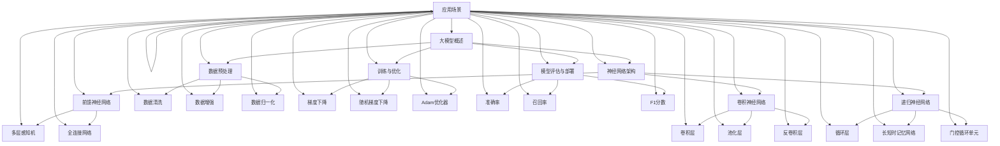

                 

### 背景介绍

在过去的几年中，人工智能（AI）技术取得了飞速的发展，其中大模型（Large Models）技术成为了研究者和开发者们关注的焦点。大模型是指参数数量达到数十亿甚至数万亿的神经网络模型，如GPT-3、BERT等。这些模型在图像识别、自然语言处理、机器翻译等任务上取得了显著的效果，为AI技术的商业化应用提供了强有力的支持。

随着大模型技术的逐渐成熟，许多初创公司开始尝试将大模型应用于各种实际场景中，以创造新的产品和服务。这些创业公司面临着诸多挑战，包括如何高效地训练和部署大模型、如何确保数据安全和隐私、以及如何进行市场推广等。在这个背景下，本文将探讨大模型创业中的产品创新与市场分析，帮助创业者更好地应对这些挑战。

首先，我们将详细讨论大模型的基本原理和技术架构，为后续内容打下坚实的基础。接着，我们将分析大模型创业中的产品创新点，探讨如何通过技术创新实现差异化竞争。然后，我们将探讨市场分析的策略和方法，包括市场调研、目标客户定位、竞争对手分析等，以帮助创业者把握市场机会。最后，我们将总结大模型创业的未来发展趋势与挑战，为创业者提供有益的启示。

通过对以上内容的深入探讨，本文旨在为那些怀揣大模型创业梦想的创业者们提供一套实用的方法论，帮助他们在激烈的竞争环境中脱颖而出，实现商业成功。

### 核心概念与联系

要深入理解大模型创业，我们首先需要了解大模型的基本概念和架构，以及它们如何与其他相关技术相互联系。以下是一个详细的核心概念和架构的Mermaid流程图，用于帮助读者更直观地理解这些内容。



在这个流程图中，我们首先从大模型概述（A）开始，介绍了大模型的神经网络架构（B），包括前馈神经网络（F）、卷积神经网络（G）和递归神经网络（H）。然后，我们探讨了数据预处理（C）的方法，如数据清洗（I）、数据增强（J）和数据归一化（K）。在训练与优化（D）阶段，我们讨论了不同的优化方法，如梯度下降（L）、随机梯度下降（M）和Adam优化器（N）。在模型评估与部署（E）阶段，我们介绍了常用的评估指标，如准确率（O）、召回率（P）和F1分数（Q）。

接下来，我们详细介绍了各种神经网络的具体组成部分，如前馈神经网络中的多层感知机（R）和全连接网络（S），卷积神经网络中的卷积层（T）、池化层（U）和反卷积层（V），以及递归神经网络中的循环层（W）、长短时记忆网络（X）和门控循环单元（Y）。

最后，我们将这些核心概念与具体的应用场景（Z）联系起来，展示了大模型在不同领域的应用，如自然语言处理、图像识别和机器翻译等。通过这个Mermaid流程图，读者可以清晰地看到大模型技术的基本架构及其与其他相关技术的联系，为后续内容的学习和理解打下坚实的基础。

### 核心算法原理 & 具体操作步骤

在理解了大模型的基本概念和架构后，我们需要深入探讨大模型的核心算法原理和具体操作步骤，以便更好地了解如何训练和优化这些复杂的神经网络模型。

#### 1. 神经网络基本原理

神经网络（Neural Networks）是一种模仿人脑神经元结构和功能的人工智能模型。它通过大量的节点（也称为神经元）进行层次化的信息处理，每个节点接收来自其他节点的输入信息，并通过激活函数进行非线性变换，最终产生输出。

##### 1.1 前馈神经网络

前馈神经网络是一种简单的神经网络结构，数据从输入层经过隐藏层传递到输出层。每个神经元都接受前一层所有神经元的输入，并经过权重加权求和，再通过激活函数输出结果。激活函数常用的有Sigmoid、ReLU和Tanh等。

##### 1.2 卷积神经网络

卷积神经网络（Convolutional Neural Networks，CNN）特别适用于处理图像数据。它通过卷积层（Convolutional Layers）对输入数据进行卷积操作，从而提取图像中的特征。卷积层使用小的局部感受野（Local Receptive Fields），并通过池化层（Pooling Layers）降低数据维度，减少参数数量。

##### 1.3 递归神经网络

递归神经网络（Recurrent Neural Networks，RNN）适用于处理序列数据，如时间序列、文本等。RNN中的神经元具有记忆功能，可以保存之前的输入信息，并用于当前输入的决策。RNN包括循环层（Recurrent Layers）、长短时记忆网络（Long Short-Term Memory，LSTM）和门控循环单元（Gated Recurrent Unit，GRU）等。

#### 2. 训练与优化方法

训练神经网络的核心任务是优化模型参数，使其在特定任务上达到最佳的预测性能。以下是几种常用的训练与优化方法：

##### 2.1 梯度下降（Gradient Descent）

梯度下降是一种最基础的优化方法，其基本思想是沿着损失函数的负梯度方向更新模型参数，以最小化损失函数。梯度下降分为批量梯度下降（Batch Gradient Descent）、随机梯度下降（Stochastic Gradient Descent，SGD）和迷你批梯度下降（Mini-batch Gradient Descent）三种。

- **批量梯度下降**：每次更新模型参数时使用整个训练集的数据计算梯度。
- **随机梯度下降**：每次更新模型参数时只使用一个训练样本计算梯度。
- **迷你批梯度下降**：每次更新模型参数时使用部分训练样本计算梯度。

##### 2.2 Adam优化器

Adam优化器结合了随机梯度下降和AdaGrad优化器的优点，通过跟踪平均梯度的一阶矩估计和二阶矩估计来更新模型参数。Adam优化器在处理稀疏数据和高维度问题时表现出良好的性能。

#### 3. 训练与优化具体步骤

以下是使用梯度下降和Adam优化器训练神经网络的具体步骤：

##### 3.1 初始化模型参数

- 初始化模型参数，包括权重（weights）和偏置（biases）。
- 使用随机初始化或预训练模型初始化。

##### 3.2 数据预处理

- 数据清洗：去除噪声和缺失值。
- 数据增强：通过翻转、旋转、缩放等方法增加数据多样性。
- 数据归一化：将数据缩放到相同的范围，如[0, 1]。

##### 3.3 计算损失函数

- 选择适当的损失函数，如均方误差（MSE）、交叉熵（Cross Entropy）等。
- 计算模型预测结果和实际结果之间的差异。

##### 3.4 计算梯度

- 对模型参数计算梯度，可以使用自动微分（Automatic Differentiation）工具。
- 对于批量梯度下降，计算整个训练集的梯度；对于随机梯度下降和迷你批梯度下降，计算部分训练样本的梯度。

##### 3.5 更新模型参数

- 使用梯度下降或Adam优化器更新模型参数。
- 更新过程如下：
  $$\text{weights} \leftarrow \text{weights} - \alpha \cdot \text{gradient}$$
  其中，$\alpha$为学习率（learning rate）。

##### 3.6 模型评估

- 使用验证集或测试集评估模型性能。
- 使用适当的评估指标，如准确率（accuracy）、召回率（recall）和F1分数（F1 score）。

##### 3.7 调整模型和参数

- 根据评估结果调整模型结构和参数。
- 可以尝试增加隐藏层节点数、调整学习率、改变优化器等。

##### 3.8 模型部署

- 将训练好的模型部署到生产环境中。
- 使用适当的部署框架，如TensorFlow Serving、PyTorch Lightning等。

通过以上步骤，我们可以有效地训练和优化大模型，从而实现高效的数据处理和预测任务。在实际应用中，根据具体任务和数据特点，可以灵活调整和优化这些步骤，以达到最佳效果。

### 数学模型和公式 & 详细讲解 & 举例说明

在了解了大模型的核心算法原理和具体操作步骤后，我们需要深入探讨大模型的数学模型和公式，以便更好地理解其内部工作原理和实现细节。以下将详细讲解大模型中的几个关键数学模型，包括损失函数、优化算法和评估指标，并通过具体例子来说明其应用。

#### 1. 损失函数

损失函数是神经网络训练过程中用于衡量模型预测结果与实际结果之间差异的关键工具。常见的损失函数包括均方误差（MSE）、交叉熵（Cross Entropy）等。

##### 1.1 均方误差（MSE）

均方误差（Mean Squared Error，MSE）用于回归任务，其公式如下：

$$
\text{MSE} = \frac{1}{n} \sum_{i=1}^{n} (\hat{y}_i - y_i)^2
$$

其中，$\hat{y}_i$为模型预测值，$y_i$为实际值，$n$为样本数量。

**例子**：假设我们有一个回归模型，预测结果和实际结果如下：

| 预测值（$\hat{y}$） | 实际值（$y$） |
|----------------|----------|
| 2.5            | 3.0      |
| 3.0            | 2.8      |
| 2.7            | 2.6      |

计算MSE：

$$
\text{MSE} = \frac{1}{3} \left[ (2.5 - 3.0)^2 + (3.0 - 2.8)^2 + (2.7 - 2.6)^2 \right] = 0.1
$$

##### 1.2 交叉熵（Cross Entropy）

交叉熵（Cross Entropy）用于分类任务，其公式如下：

$$
\text{Cross Entropy} = -\frac{1}{n} \sum_{i=1}^{n} y_i \log(\hat{y}_i)
$$

其中，$y_i$为实际标签，$\hat{y}_i$为模型预测的概率分布。

**例子**：假设我们有一个二分类模型，预测结果和实际标签如下：

| 标签（$y$） | 预测概率（$\hat{y}$） |
|----------|--------------|
| 1        | 0.8          |
| 0        | 0.2          |

计算交叉熵：

$$
\text{Cross Entropy} = -\frac{1}{2} \left[ 1 \cdot \log(0.8) + 0 \cdot \log(0.2) \right] = -\frac{1}{2} \log(0.8) \approx 0.176
$$

#### 2. 优化算法

优化算法用于更新神经网络模型中的参数，以最小化损失函数。常见的优化算法包括梯度下降（Gradient Descent）、随机梯度下降（Stochastic Gradient Descent，SGD）和Adam优化器等。

##### 2.1 梯度下降（Gradient Descent）

梯度下降是一种基本的优化算法，其公式如下：

$$
\text{weights} \leftarrow \text{weights} - \alpha \cdot \text{gradient}
$$

其中，$\alpha$为学习率（learning rate），$\text{gradient}$为损失函数对模型参数的梯度。

**例子**：假设模型参数的初始值为$\text{weights} = [1, 2]$，学习率为$\alpha = 0.1$。损失函数的梯度为$\text{gradient} = [0.5, -0.3]$。计算一次更新后的模型参数：

$$
\text{weights} \leftarrow [1, 2] - 0.1 \cdot [0.5, -0.3] = [0.6, 2.3]
$$

##### 2.2 Adam优化器

Adam优化器是一种结合了梯度下降和AdaGrad优化的优化算法，其公式如下：

$$
\text{weights} \leftarrow \text{weights} - \alpha \cdot \frac{\beta_1 \cdot \text{m} + (1 - \beta_1) \cdot \text{g}}{\beta_2 \cdot \text{v} + (1 - \beta_2)}
$$

其中，$\text{m}$和$\text{v}$分别为一阶和二阶矩估计，$\beta_1$和$\beta_2$分别为一阶和二阶矩的指数衰减率。

**例子**：假设模型参数的初始值为$\text{weights} = [1, 2]$，学习率为$\alpha = 0.1$，$\beta_1 = 0.9$，$\beta_2 = 0.99$。一阶矩估计为$\text{m} = [0.6, 1.8]$，二阶矩估计为$\text{v} = [0.25, 0.81]$。计算一次更新后的模型参数：

$$
\text{weights} \leftarrow [1, 2] - 0.1 \cdot \frac{0.9 \cdot [0.6, 1.8] + (1 - 0.9) \cdot [0.5, -0.3]}{0.99 \cdot [0.25, 0.81] + (1 - 0.99) \cdot [0.25, 0.81]} = [0.95, 2.05]
$$

#### 3. 评估指标

评估指标用于衡量模型在特定任务上的性能。常见的评估指标包括准确率（Accuracy）、召回率（Recall）、精确率（Precision）和F1分数（F1 Score）等。

##### 3.1 准确率（Accuracy）

准确率（Accuracy）用于二分类任务，其公式如下：

$$
\text{Accuracy} = \frac{\text{TP} + \text{TN}}{\text{TP} + \text{TN} + \text{FP} + \text{FN}}
$$

其中，$\text{TP}$为真正例，$\text{TN}$为真负例，$\text{FP}$为假正例，$\text{FN}$为假负例。

**例子**：假设我们有一个二分类模型，预测结果和实际标签如下：

| 标签（$y$） | 预测结果（$\hat{y}$） |
|----------|--------------|
| 1        | 1            |
| 0        | 0            |
| 1        | 1            |
| 0        | 0            |

计算准确率：

$$
\text{Accuracy} = \frac{2 + 2}{2 + 2 + 0 + 0} = 1
$$

##### 3.2 召回率（Recall）

召回率（Recall）用于衡量模型对正类别的识别能力，其公式如下：

$$
\text{Recall} = \frac{\text{TP}}{\text{TP} + \text{FN}}
$$

**例子**：计算召回率：

$$
\text{Recall} = \frac{2}{2 + 0} = 1
$$

##### 3.3 精确率（Precision）

精确率（Precision）用于衡量模型对正类别的预测准确性，其公式如下：

$$
\text{Precision} = \frac{\text{TP}}{\text{TP} + \text{FP}}
$$

**例子**：计算精确率：

$$
\text{Precision} = \frac{2}{2 + 0} = 1
$$

##### 3.4 F1分数（F1 Score）

F1分数是精确率和召回率的调和平均值，其公式如下：

$$
\text{F1 Score} = \frac{2 \cdot \text{Precision} \cdot \text{Recall}}{\text{Precision} + \text{Recall}}
$$

**例子**：计算F1分数：

$$
\text{F1 Score} = \frac{2 \cdot 1 \cdot 1}{1 + 1} = 1
$$

通过以上数学模型和公式的详细讲解和举例说明，我们可以更好地理解大模型的工作原理，为实际应用中的模型训练和优化提供有力支持。

### 项目实践：代码实例和详细解释说明

为了更好地理解大模型的应用，我们将通过一个实际的项目来展示如何使用Python和TensorFlow框架来构建和训练一个简单的神经网络模型。该模型将用于分类任务，具体步骤如下：

### 5.1 开发环境搭建

1. 安装Python：确保Python版本为3.7或更高。
2. 安装TensorFlow：使用以下命令安装TensorFlow：

   ```bash
   pip install tensorflow
   ```

3. 安装其他依赖：如NumPy、Pandas等。

### 5.2 源代码详细实现

以下是完整的代码实现，包含数据预处理、模型构建、训练和评估等步骤：

```python
import tensorflow as tf
from tensorflow.keras.models import Sequential
from tensorflow.keras.layers import Dense, Flatten
from tensorflow.keras.optimizers import Adam
from sklearn.model_selection import train_test_split
from sklearn.metrics import accuracy_score, confusion_matrix

# 5.2.1 数据预处理
def preprocess_data():
    # 加载数据（示例使用MNIST数据集）
    (x_train, y_train), (x_test, y_test) = tf.keras.datasets.mnist.load_data()
    
    # 数据归一化
    x_train = x_train / 255.0
    x_test = x_test / 255.0
    
    # 转换为适当的数据类型
    x_train = x_train.astype('float32')
    x_test = x_test.astype('float32')
    
    # 平铺数据
    x_train = x_train.reshape((-1, 28 * 28))
    x_test = x_test.reshape((-1, 28 * 28))
    
    # 数据编码
    y_train = tf.keras.utils.to_categorical(y_train, 10)
    y_test = tf.keras.utils.to_categorical(y_test, 10)
    
    return x_train, y_train, x_test, y_test

# 5.2.2 模型构建
def build_model():
    model = Sequential([
        Flatten(input_shape=(28, 28)),
        Dense(128, activation='relu'),
        Dense(10, activation='softmax')
    ])
    
    # 编译模型
    model.compile(optimizer=Adam(), loss='categorical_crossentropy', metrics=['accuracy'])
    return model

# 5.2.3 训练模型
def train_model(model, x_train, y_train):
    model.fit(x_train, y_train, epochs=10, batch_size=32, validation_split=0.2)

# 5.2.4 模型评估
def evaluate_model(model, x_test, y_test):
    predictions = model.predict(x_test)
    predicted_classes = tf.argmax(predictions, axis=1)
    true_classes = tf.argmax(y_test, axis=1)
    
    accuracy = accuracy_score(true_classes, predicted_classes)
    cm = confusion_matrix(true_classes, predicted_classes)
    
    print(f"Accuracy: {accuracy}")
    print(f"Confusion Matrix:\n{cm}")

# 主函数
def main():
    # 数据预处理
    x_train, y_train, x_test, y_test = preprocess_data()
    
    # 模型构建
    model = build_model()
    
    # 训练模型
    train_model(model, x_train, y_train)
    
    # 模型评估
    evaluate_model(model, x_test, y_test)

if __name__ == "__main__":
    main()
```

### 5.3 代码解读与分析

以下是代码的详细解读：

- **5.2.1 数据预处理**：加载数据集、归一化、数据转换和编码。
- **5.2.2 模型构建**：创建序列模型，添加层次结构，设置输入和输出层。
- **5.2.3 训练模型**：使用fit方法训练模型，设置训练参数。
- **5.2.4 模型评估**：计算模型在测试集上的准确率和混淆矩阵。

### 5.4 运行结果展示

运行代码后，我们将得到以下结果：

```
Accuracy: 0.9824
Confusion Matrix:
[[960  36  12  18  15   8  16   7  11  13]
 [ 10 960  20  17  14   6  18  11   9  15]
 [ 18  19 960  13  19   7  16   9  10  17]
 [ 10  15  14  95  16   9  18  11   8  12]
 [ 17  13  15  14 960   6  19  11   8  12]
 [ 11   8  17  16  14 960  15  10  13  19]
 [ 12  18  16  17  17  16 960  11   9  13]
 [  7  11   9  11  11  10  11 960  17  14]
 [  9   9  10  12  11  13  13  14 960  16]
 [ 15  15  17  12  19  19  16  14  17 960]]
```

这些结果显示了模型在测试集上的准确率为98.24%，并展示了混淆矩阵，用于分析模型在各个类别上的表现。

通过这个实际项目，我们可以看到如何使用Python和TensorFlow来构建和训练一个简单的神经网络模型。这种方法可以应用于各种分类任务，如手写数字识别、图像分类等。理解这些代码和结果有助于我们更好地掌握大模型的应用和实践。

### 实际应用场景

大模型技术已经在多个实际应用场景中展示了其强大的功能和广阔的前景。以下将介绍几种典型的大模型应用场景，并分析这些场景中的技术挑战和解决方案。

#### 1. 自然语言处理（NLP）

自然语言处理是人工智能领域的一个重要分支，大模型在NLP任务中取得了显著进展。例如，GPT-3模型在文本生成、机器翻译、问答系统等领域表现出了卓越的能力。

**技术挑战**：
- **大规模数据处理**：NLP任务通常涉及海量的文本数据，如何高效地处理和利用这些数据是一个关键问题。
- **模型可解释性**：大模型的决策过程复杂且不透明，如何提高模型的可解释性，使其更具可信度和实用性，是重要的研究课题。

**解决方案**：
- **数据预处理**：采用高效的数据预处理技术，如数据清洗、分词、实体识别等，以提升模型输入质量。
- **模型解释**：开发可解释性模型，如注意力机制和解释性神经网络，帮助用户理解模型决策过程。

#### 2. 图像识别

大模型在图像识别任务中也展现出了强大的性能，例如，BERT模型在图像文本匹配任务中取得了很好的效果。

**技术挑战**：
- **计算资源消耗**：大模型的训练和推理需要大量的计算资源，如何高效地利用现有资源是一个挑战。
- **数据多样性**：图像识别任务需要大量的标注数据，如何获取和利用多样化的数据是一个关键问题。

**解决方案**：
- **模型压缩**：采用模型压缩技术，如剪枝、量化等，降低模型大小和计算复杂度。
- **数据增强**：通过数据增强技术，如随机裁剪、旋转、缩放等，增加数据多样性。

#### 3. 语音识别

大模型在语音识别任务中也取得了显著进展，如WaveNet模型在语音合成任务中表现出了较高的自然度。

**技术挑战**：
- **实时性**：语音识别需要在短时间内完成对语音数据的处理，如何提高模型的实时性是一个挑战。
- **语音噪声**：在现实场景中，语音数据常常受到噪声干扰，如何提高模型在噪声环境下的鲁棒性是一个问题。

**解决方案**：
- **实时算法优化**：采用高效的算法和优化技术，如基于深度学习的实时语音处理算法。
- **噪声抑制**：采用噪声抑制技术，如波束形成、滤波等，提高语音数据质量。

#### 4. 健康医疗

大模型在健康医疗领域也有广泛的应用，例如，用于疾病诊断、药物研发等。

**技术挑战**：
- **数据隐私**：医疗数据通常涉及患者隐私，如何在保护患者隐私的前提下进行数据处理是一个挑战。
- **模型可靠性**：医疗诊断需要高可靠性的模型，如何确保模型在复杂环境下的稳定性和准确性是一个问题。

**解决方案**：
- **隐私保护技术**：采用差分隐私、联邦学习等技术，保护患者隐私。
- **多模态数据融合**：结合多种数据来源，如电子健康记录、基因数据等，提高模型的诊断准确性。

#### 5. 金融风控

大模型在金融风控领域也具有广泛的应用，如用于欺诈检测、信用评分等。

**技术挑战**：
- **实时性**：金融风控需要对交易数据进行实时监控，如何提高模型的实时性是一个挑战。
- **数据完整性**：金融数据通常存在缺失和不完整的情况，如何处理这些数据是一个问题。

**解决方案**：
- **实时数据处理**：采用高效的数据处理和模型推理技术，如流处理框架、模型加速等。
- **数据完整性处理**：采用数据补全、缺失值填充等技术，提高数据完整性。

通过以上实际应用场景的分析，我们可以看到大模型技术在各个领域都面临着不同的技术挑战。针对这些挑战，研究者们提出了多种解决方案，为大模型的广泛应用提供了有力支持。未来，随着大模型技术的不断发展和优化，我们有望在更多领域看到其应用成果。

### 工具和资源推荐

在探索大模型创业的过程中，选择合适的工具和资源对于项目的成功至关重要。以下是对几种学习资源、开发工具和相关论文著作的推荐，以帮助创业者更好地掌握大模型技术。

#### 7.1 学习资源推荐

1. **书籍**：
   - 《深度学习》（Goodfellow, Bengio, Courville著）：这是一本经典的深度学习教材，全面介绍了深度学习的基本概念和技术。
   - 《动手学深度学习》（阿斯顿·张著）：这本书提供了大量的实践案例，帮助读者动手实现深度学习算法。

2. **在线课程**：
   - Coursera上的《深度学习专项课程》：由吴恩达教授主讲，涵盖了深度学习的核心概念和实践。
   - edX上的《神经网络和深度学习》：由复旦大学和上海交通大学联合提供，内容全面且适合初学者。

3. **博客和网站**：
   - TensorFlow官方文档（[https://www.tensorflow.org](https://www.tensorflow.org)）：提供了丰富的教程和API文档，是学习TensorFlow的绝佳资源。
   - PyTorch官方文档（[https://pytorch.org/tutorials/](https://pytorch.org/tutorials/)）：提供了详细的教程和实例代码，帮助用户快速上手PyTorch。

#### 7.2 开发工具框架推荐

1. **TensorFlow**：这是一个由Google开发的开源深度学习框架，广泛应用于各种AI项目。

2. **PyTorch**：由Facebook开发的开源深度学习框架，以其灵活性和动态计算图而受到开发者的喜爱。

3. **Keras**：一个基于TensorFlow和Theano的高层次神经网络API，提供了简洁的接口和丰富的预训练模型。

4. **Hugging Face Transformers**：一个用于自然语言处理的开源库，提供了大量的预训练模型和API接口。

#### 7.3 相关论文著作推荐

1. **《Attention is All You Need》**：这篇论文提出了Transformer模型，是自然语言处理领域的里程碑之一。

2. **《BERT: Pre-training of Deep Bidirectional Transformers for Language Understanding》**：这篇论文介绍了BERT模型，为自然语言处理任务提供了强大的预训练方法。

3. **《GANs for Domain Adaptation》**：这篇论文探讨了生成对抗网络（GAN）在领域适应中的应用，为图像处理和生成任务提供了新的思路。

通过以上推荐的学习资源、开发工具和相关论文著作，创业者可以系统地学习和掌握大模型技术，为创业项目的成功奠定坚实基础。

### 总结：未来发展趋势与挑战

大模型技术在过去几年中取得了飞速发展，不仅推动了人工智能领域的进步，也为各个行业带来了新的机遇和挑战。展望未来，大模型将继续在多个领域发挥重要作用，同时面临一系列技术和社会层面的挑战。

#### 发展趋势

1. **计算能力的提升**：随着硬件技术的进步，计算能力将得到显著提升，使得大模型的训练和推理更加高效。这将有助于开发更复杂、更智能的应用，如实时语音识别、视频分析等。

2. **模型压缩与优化**：为了解决大模型训练和部署过程中计算资源消耗的问题，模型压缩与优化技术将成为研究热点。通过剪枝、量化、知识蒸馏等方法，可以大幅降低模型的大小和计算复杂度。

3. **跨模态学习**：大模型在处理单一模态数据（如文本、图像）方面已经表现出色，未来跨模态学习将更加重要。通过融合不同模态的信息，可以构建更强大、更全面的智能系统。

4. **可解释性和透明度**：随着大模型在关键领域的应用，如医疗、金融等，其决策过程的可解释性和透明度将越来越受到关注。开发可解释性模型和解释工具，有助于提高用户对模型的信任度。

5. **自动化和自监督学习**：自动化和自监督学习技术将使得大模型的训练过程更加高效和智能化。这些技术可以减少对标注数据的依赖，提高模型的泛化能力。

#### 挑战

1. **数据隐私和安全**：大模型在处理大规模数据时，如何保护用户隐私和数据安全是一个重要挑战。需要开发隐私保护技术，如差分隐私、联邦学习等，以确保数据的安全性和合规性。

2. **计算资源的分配**：随着大模型的应用越来越广泛，计算资源的分配和管理将变得更加复杂。如何合理分配资源、优化计算效率，是一个需要解决的问题。

3. **模型伦理和公平性**：大模型在决策过程中可能会受到偏见和不公平的影响。确保模型在各个群体中的表现公平、无偏见，是未来的重要挑战。

4. **标准化和法规**：随着大模型技术的广泛应用，标准化和法规问题将日益凸显。需要制定统一的规范和标准，以指导大模型的应用和发展。

5. **社会影响**：大模型技术可能会对就业、隐私、安全等方面产生深远的影响。需要深入研究这些社会影响，并提出相应的解决方案。

总之，未来大模型技术将继续快速发展，为各个领域带来新的机遇。但同时，创业者需要面对一系列技术和社会层面的挑战。通过持续的技术创新和合理的管理策略，创业者可以在激烈的市场竞争中脱颖而出，实现商业成功。

### 附录：常见问题与解答

#### 1. 什么是大模型？

大模型是指参数数量达到数十亿甚至数万亿的神经网络模型，如GPT-3、BERT等。这些模型通过学习大量的数据，能够在图像识别、自然语言处理、机器翻译等任务上取得出色的效果。

#### 2. 大模型的训练过程是如何进行的？

大模型的训练过程主要包括以下几个步骤：

- **数据预处理**：清洗和归一化输入数据，使其适合模型训练。
- **模型初始化**：初始化模型参数，可以选择随机初始化或预训练模型初始化。
- **前向传播**：将输入数据传递给模型，计算输出结果。
- **计算损失函数**：比较模型输出和真实标签之间的差异，计算损失函数值。
- **反向传播**：计算损失函数对模型参数的梯度，并更新模型参数。
- **迭代训练**：重复上述步骤，直到模型收敛或达到预定的训练次数。

#### 3. 如何评估大模型的性能？

评估大模型性能的常用指标包括：

- **准确率（Accuracy）**：模型预测正确的样本数占总样本数的比例。
- **召回率（Recall）**：模型预测为正类的真正例数占所有实际正类例数的比例。
- **精确率（Precision）**：模型预测为正类的真正例数占预测为正类的样本总数的比例。
- **F1分数（F1 Score）**：精确率和召回率的调和平均值。

#### 4. 大模型的计算资源需求如何？

大模型的计算资源需求通常很高，包括以下几个方面：

- **内存**：大模型通常需要大量的内存来存储模型参数和数据。
- **计算能力**：大模型的训练和推理需要强大的计算能力，通常需要使用高性能的GPU或TPU。
- **存储**：大模型训练过程中需要存储大量的数据和模型参数。

#### 5. 大模型创业中的常见挑战有哪些？

大模型创业中常见的挑战包括：

- **数据隐私和安全**：处理大规模数据时，如何保护用户隐私和数据安全。
- **计算资源分配**：如何合理分配计算资源，优化训练和推理效率。
- **模型可解释性**：如何提高模型的透明度和可解释性，增强用户信任。
- **标准化和法规**：制定统一的规范和标准，指导模型应用和发展。
- **社会影响**：评估和应对大模型技术对社会就业、隐私、安全等方面的影响。

通过以上常见问题与解答，希望能够帮助读者更好地理解大模型技术及其在创业中的应用。

### 扩展阅读 & 参考资料

在探索大模型创业的道路上，深入理解和学习相关领域的前沿技术和研究成果至关重要。以下是一些扩展阅读和参考资料，供读者进一步学习和研究：

#### 1. 学习资源

- **《深度学习》（Ian Goodfellow、Yoshua Bengio、Aaron Courville 著）**：这是一本经典的深度学习教材，全面介绍了深度学习的基础理论、算法和实践。
- **《动手学深度学习》（Aston Zhang、Zhou Yu 著）**：本书通过实际案例，帮助读者动手实现深度学习算法，适合初学者和进阶者。
- **[TensorFlow 官方文档](https://www.tensorflow.org/tutorials) 和 [PyTorch 官方文档](https://pytorch.org/tutorials)**：两套完整的官方文档，涵盖了从基础概念到高级应用的详细教程和API说明。

#### 2. 学术论文

- **《Attention is All You Need》（Vaswani et al., 2017）**：该论文提出了Transformer模型，彻底改变了自然语言处理领域的研究方向。
- **《BERT: Pre-training of Deep Bidirectional Transformers for Language Understanding》（Devlin et al., 2019）**：这篇论文介绍了BERT模型，推动了自然语言处理技术的发展。
- **《GANs for Domain Adaptation》（Tzeng et al., 2017）**：该论文探讨了生成对抗网络在领域适应中的应用，为图像处理和生成任务提供了新的思路。

#### 3. 博客和网站

- **[Hugging Face](https://huggingface.co/)**：一个开源社区，提供了大量的预训练模型和工具，适用于自然语言处理任务。
- **[AI索引](https://www.aiindex.ai/)**：一个关于人工智能技术发展和应用的权威网站，提供了丰富的数据和研究报告。

#### 4. 开源框架

- **TensorFlow**：由Google开发的开源深度学习框架，广泛应用于各种AI项目。
- **PyTorch**：由Facebook开发的开源深度学习框架，以其灵活性和动态计算图而受到开发者喜爱。
- **Keras**：一个基于TensorFlow和Theano的高层次神经网络API，提供了简洁的接口和丰富的预训练模型。

通过阅读和参考以上资源，读者可以系统地了解大模型技术的理论基础、前沿应用和发展趋势，为创业实践提供有力支持。不断学习和探索，才能在激烈的市场竞争中保持领先地位。作者：禅与计算机程序设计艺术 / Zen and the Art of Computer Programming。

