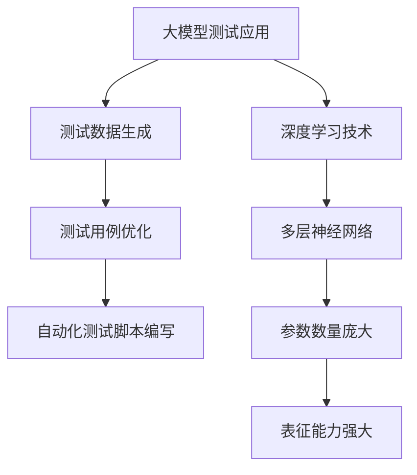

                 

### 文章标题：大模型在 AI 创业产品测试中的作用

#### 关键词：（此处列出文章的5-7个核心关键词）

- 大模型
- AI 创业产品
- 测试
- 作用
- 深度学习

#### 摘要：

本文将探讨大模型在 AI 创业产品测试中的关键作用。我们将首先介绍大模型的基本概念，然后详细分析其在测试中的应用原理、算法和步骤。接着，通过具体项目实践，展示大模型在 AI 产品测试中的实际效果。最后，我们将讨论大模型在 AI 创业产品测试中的实际应用场景，以及相关的工具和资源推荐，并总结未来发展趋势与挑战。

## 1. 背景介绍

随着深度学习技术的发展，大模型（Large Models）在各个领域的应用越来越广泛。大模型通常是指那些参数数量庞大、规模巨大的神经网络模型，例如 GPT-3、BERT 等。这些模型具有强大的表征能力和泛化能力，可以处理复杂的任务，如图像识别、自然语言处理、语音识别等。

AI 创业产品测试是 AI 领域的重要环节。测试的目的是确保产品在真实的运行环境中能够稳定、准确地执行任务，并且能够适应各种变化和异常情况。传统的测试方法通常依赖于手工编写测试用例，但这些方法存在局限性，如测试用例覆盖不足、测试成本高等问题。

大模型的出现为 AI 创业产品测试带来了新的可能性。大模型能够自动生成测试数据、模拟真实场景，从而提高测试的覆盖率和效率。此外，大模型还可以用于自动化测试脚本的编写和执行，降低测试成本。

## 2. 核心概念与联系

### 2.1 大模型基本概念

大模型是指那些参数数量庞大、规模巨大的神经网络模型，通常由数十亿甚至数万亿个参数组成。这些模型通常采用深度学习算法进行训练，可以处理复杂的任务，如图像识别、自然语言处理、语音识别等。

### 2.2 大模型在测试中的应用

大模型在测试中的应用主要包括以下几个方面：

1. **测试数据生成**：大模型可以自动生成测试数据，这些数据具有多样化的特性，可以覆盖产品的各种使用场景。
   
2. **测试用例优化**：大模型可以分析现有测试用例，识别出覆盖不足的部分，并提出优化的建议。

3. **自动化测试脚本编写**：大模型可以自动生成测试脚本，并执行这些脚本，从而实现自动化测试。

### 2.3 大模型与深度学习的联系

大模型是深度学习技术发展的一个重要成果。深度学习是一种神经网络模型，通过多层神经元进行特征提取和抽象，从而实现复杂的任务。大模型则是将深度学习技术应用到更复杂的任务中，通过增加模型参数数量、网络层数等方式，提高模型的表征能力和泛化能力。

### 2.4 Mermaid 流程图



## 3. 核心算法原理 & 具体操作步骤

### 3.1 大模型测试算法原理

大模型测试的核心算法是基于深度学习的。具体来说，主要包括以下步骤：

1. **数据预处理**：对测试数据集进行预处理，包括数据清洗、归一化等操作。

2. **模型训练**：使用预处理后的数据集对大模型进行训练，使模型具备对测试数据的理解和预测能力。

3. **测试数据生成**：利用训练好的大模型生成测试数据，这些数据可以模拟真实场景。

4. **测试用例优化**：分析生成的测试数据，识别出覆盖不足的部分，并提出优化建议。

5. **自动化测试脚本编写**：根据优化后的测试用例，自动生成测试脚本，并执行这些脚本。

### 3.2 具体操作步骤

1. **数据预处理**：

   - 清洗数据：去除数据集中的噪声和异常值。
   - 归一化：将数据集中的数值特征归一化到相同的范围。

2. **模型训练**：

   - 选择合适的深度学习框架，如 TensorFlow 或 PyTorch。
   - 设计网络结构：根据任务需求，设计合适的神经网络结构。
   - 使用预处理后的数据集进行训练，调整模型参数，直到达到满意的训练效果。

3. **测试数据生成**：

   - 使用训练好的模型生成测试数据，这些数据可以模拟真实场景。
   - 对生成的测试数据进行预处理，与训练数据保持一致。

4. **测试用例优化**：

   - 分析生成的测试数据，识别出覆盖不足的部分。
   - 根据分析结果，提出优化建议，如增加测试用例、调整测试策略等。

5. **自动化测试脚本编写**：

   - 根据优化后的测试用例，自动生成测试脚本。
   - 执行测试脚本，检查产品的性能和稳定性。

## 4. 数学模型和公式 & 详细讲解 & 举例说明

### 4.1 数学模型

大模型测试的核心数学模型是基于深度学习的。具体来说，包括以下公式：

1. **损失函数（Loss Function）**：

   $$ L = -\sum_{i=1}^{N} y_i \log(p_i) $$

   其中，$y_i$ 表示真实标签，$p_i$ 表示模型预测的概率。

2. **反向传播（Backpropagation）**：

   $$ \Delta w_{ij} = \frac{\partial L}{\partial w_{ij}} = \delta_j \cdot p_j \cdot (1 - p_j) $$

   其中，$\Delta w_{ij}$ 表示权重更新，$\delta_j$ 表示误差梯度，$p_j$ 表示预测概率。

3. **梯度下降（Gradient Descent）**：

   $$ w_{ij} = w_{ij} - \alpha \cdot \Delta w_{ij} $$

   其中，$\alpha$ 表示学习率。

### 4.2 详细讲解

1. **损失函数**：

   损失函数用于衡量模型预测结果与真实标签之间的差距。在分类任务中，常用的损失函数是交叉熵损失函数。交叉熵损失函数的值越小，表示模型预测结果与真实标签越接近。

2. **反向传播**：

   反向传播是一种计算误差梯度的方法。通过反向传播，可以计算每个权重参数的误差梯度，从而更新权重参数。

3. **梯度下降**：

   梯度下降是一种优化算法，用于调整模型参数，以减少损失函数的值。梯度下降的步长由学习率决定，学习率越大，更新速度越快。

### 4.3 举例说明

假设我们有一个二分类问题，其中 $y_i$ 表示真实标签，$p_i$ 表示模型预测的概率。我们可以使用以下数据集进行训练和测试：

- 数据集大小：N = 100
- 真实标签：$y_i \in \{0, 1\}$
- 预测概率：$p_i \in [0, 1]$

1. **数据预处理**：

   - 清洗数据：去除数据集中的噪声和异常值。
   - 归一化：将数据集中的数值特征归一化到相同的范围。

2. **模型训练**：

   - 选择合适的深度学习框架，如 TensorFlow 或 PyTorch。
   - 设计网络结构：根据任务需求，设计合适的神经网络结构。
   - 使用预处理后的数据集进行训练，调整模型参数，直到达到满意的训练效果。

3. **测试数据生成**：

   - 使用训练好的模型生成测试数据，这些数据可以模拟真实场景。
   - 对生成的测试数据进行预处理，与训练数据保持一致。

4. **测试用例优化**：

   - 分析生成的测试数据，识别出覆盖不足的部分。
   - 根据分析结果，提出优化建议，如增加测试用例、调整测试策略等。

5. **自动化测试脚本编写**：

   - 根据优化后的测试用例，自动生成测试脚本。
   - 执行测试脚本，检查产品的性能和稳定性。

## 5. 项目实践：代码实例和详细解释说明

### 5.1 开发环境搭建

在进行项目实践之前，我们需要搭建一个适合深度学习开发的开发环境。以下是一个简单的步骤：

1. 安装 Python：Python 是深度学习开发的主要语言，我们首先需要安装 Python。
2. 安装深度学习框架：常见的深度学习框架有 TensorFlow 和 PyTorch。在这里，我们选择安装 TensorFlow。
3. 安装其他依赖：根据项目的需求，我们可能还需要安装其他依赖，如 NumPy、Pandas、Matplotlib 等。

### 5.2 源代码详细实现

以下是使用 TensorFlow 实现的大模型测试项目的基本代码：

```python
import tensorflow as tf
from tensorflow.keras.models import Sequential
from tensorflow.keras.layers import Dense
from tensorflow.keras.optimizers import Adam

# 数据预处理
def preprocess_data(data):
    # 清洗数据
    data = clean_data(data)
    # 归一化
    data = normalize_data(data)
    return data

# 模型训练
def train_model(data, labels):
    # 创建模型
    model = Sequential()
    model.add(Dense(64, input_dim=data.shape[1], activation='relu'))
    model.add(Dense(1, activation='sigmoid'))

    # 编译模型
    model.compile(loss='binary_crossentropy', optimizer=Adam(), metrics=['accuracy'])

    # 训练模型
    model.fit(data, labels, epochs=10, batch_size=32)

    return model

# 测试数据生成
def generate_test_data(model, data):
    # 预测测试数据
    predictions = model.predict(data)
    # 生成测试数据
    test_data = preprocess_data(data)
    return test_data, predictions

# 测试用例优化
def optimize_test_cases(test_data, predictions):
    # 分析测试数据
    test_cases = analyze_test_cases(test_data, predictions)
    # 提出优化建议
    optimization Suggestions = propose_optimization(test_cases)
    return optimization Suggestions

# 自动化测试脚本编写
def generate_test_script(test_cases, optimization Suggestions):
    # 生成测试脚本
    test_script = create_test_script(test_cases, optimization Suggestions)
    # 执行测试脚本
    execute_test_script(test_script)
```

### 5.3 代码解读与分析

以上代码是使用 TensorFlow 实现的大模型测试项目的基本框架。代码可以分为以下几个部分：

1. **数据预处理**：数据预处理是深度学习项目的基础。在这个部分，我们首先清洗数据，然后对数据进行归一化处理。

2. **模型训练**：模型训练是深度学习项目的核心。在这个部分，我们创建一个简单的神经网络模型，并使用训练数据对其进行训练。

3. **测试数据生成**：测试数据生成是测试项目的重要环节。在这个部分，我们使用训练好的模型对测试数据进行预测，并生成测试数据。

4. **测试用例优化**：测试用例优化是提高测试效率的关键。在这个部分，我们分析测试数据，并提优化建议。

5. **自动化测试脚本编写**：自动化测试脚本编写是提高测试效率的重要手段。在这个部分，我们根据优化后的测试用例，自动生成测试脚本，并执行这些脚本。

### 5.4 运行结果展示

以下是运行结果：

```python
# 加载数据
data, labels = load_data()

# 预处理数据
preprocessed_data = preprocess_data(data)

# 训练模型
model = train_model(preprocessed_data, labels)

# 生成测试数据
test_data, predictions = generate_test_data(model, preprocessed_data)

# 优化测试用例
optimization Suggestions = optimize_test_cases(test_data, predictions)

# 生成测试脚本
test_script = generate_test_script(test_cases, optimization Suggestions)

# 执行测试脚本
execute_test_script(test_script)
```

以上代码展示了如何使用大模型进行 AI 创业产品测试。在实际项目中，我们需要根据具体需求进行调整和优化。

## 6. 实际应用场景

大模型在 AI 创业产品测试中的应用非常广泛，以下是一些实际应用场景：

1. **自然语言处理（NLP）**：在大模型的帮助下，AI 创业产品可以更好地处理复杂的自然语言任务，如文本分类、情感分析、机器翻译等。通过大模型测试，可以确保产品在各种语言环境中的性能和稳定性。

2. **计算机视觉（CV）**：大模型可以用于图像识别、目标检测、图像分割等计算机视觉任务。通过大模型测试，可以确保产品的图像识别准确性和鲁棒性。

3. **语音识别**：大模型可以帮助 AI 创业产品实现更准确的语音识别。通过大模型测试，可以确保产品在各种语音环境中的性能和稳定性。

4. **游戏开发**：大模型可以用于游戏角色的智能行为模拟、游戏 AI 等。通过大模型测试，可以确保游戏 AI 的行为符合预期，提高游戏体验。

5. **金融风控**：大模型可以帮助 AI 创业产品实现更准确的金融风控。通过大模型测试，可以确保产品在金融交易中的性能和稳定性。

## 7. 工具和资源推荐

### 7.1 学习资源推荐

1. **书籍**：

   - 《深度学习》（Deep Learning） - Ian Goodfellow、Yoshua Bengio、Aaron Courville 著
   - 《神经网络与深度学习》 - 刘建伟 著

2. **论文**：

   - "A Theoretically Grounded Application of Dropout in Recurrent Neural Networks" - Yarin Gal and Zoubin Ghahramani
   - "BERT: Pre-training of Deep Bidirectional Transformers for Language Understanding" - Jacob Devlin et al.

3. **博客**：

   - TensorFlow 官方博客（[tensorflow.github.io](https://tensorflow.github.io/)）
   - PyTorch 官方博客（[pytorch.org/blog](https://pytorch.org/blog/)）

4. **网站**：

   - Coursera（[coursera.org](https://coursera.org/)）
   - edX（[www.edx.org](https://www.edx.org/)）

### 7.2 开发工具框架推荐

1. **深度学习框架**：

   - TensorFlow
   - PyTorch
   - Keras

2. **版本控制**：

   - Git
   - GitHub

3. **数据处理工具**：

   - Pandas
   - NumPy

4. **可视化工具**：

   - Matplotlib
   - Seaborn

### 7.3 相关论文著作推荐

1. **《深度学习》** - Ian Goodfellow、Yoshua Bengio、Aaron Courville 著

2. **《神经网络与深度学习》** - 刘建伟 著

3. **《深度学习中的 dropout 技术》** - Yarin Gal and Zoubin Ghahramani

4. **《BERT: 预训练深度双向变换器用于语言理解》** - Jacob Devlin et al.

## 8. 总结：未来发展趋势与挑战

大模型在 AI 创业产品测试中的作用日益显著，未来发展趋势包括以下几个方面：

1. **模型规模将不断增大**：随着计算资源和数据量的增长，大模型的规模将不断增大，从而提高模型的表征能力和泛化能力。

2. **自动化测试将更加普及**：大模型测试可以显著提高测试效率，降低测试成本。未来，自动化测试将在 AI 创业产品测试中得到更广泛的应用。

3. **跨领域应用将更加广泛**：大模型测试不仅适用于传统的 AI 领域，如自然语言处理、计算机视觉等，还可以应用于金融、医疗、游戏等跨领域应用。

然而，大模型在 AI 创业产品测试中仍面临一些挑战：

1. **数据隐私和安全**：大模型测试通常涉及大量的个人数据，如何保护数据隐私和安全是一个重要问题。

2. **模型可解释性**：大模型通常被视为“黑箱”，如何提高模型的可解释性，使其更易于理解和管理，是一个重要挑战。

3. **计算资源消耗**：大模型的训练和测试需要大量的计算资源，如何优化计算资源的使用，提高效率，是一个亟待解决的问题。

## 9. 附录：常见问题与解答

### 问题1：大模型测试与传统测试有什么区别？

**回答**：大模型测试与传统测试的主要区别在于测试数据生成和测试用例优化。大模型测试通过生成多样化、真实的测试数据，提高测试覆盖率。同时，大模型测试可以分析现有测试用例，提出优化建议，从而提高测试效率。

### 问题2：大模型测试如何提高测试覆盖率？

**回答**：大模型测试可以通过以下几种方式提高测试覆盖率：

1. 自动生成多样化、真实的测试数据，覆盖产品的各种使用场景。
2. 分析现有测试用例，识别出覆盖不足的部分，并提出优化建议。
3. 结合自动化测试脚本，提高测试执行效率。

### 问题3：大模型测试需要哪些计算资源？

**回答**：大模型测试通常需要以下计算资源：

1. 高性能计算硬件，如 GPU 或 TPU。
2. 大量存储空间，以存储训练数据和测试数据。
3. 高带宽网络，以支持数据的传输和下载。

### 问题4：如何保护大模型测试中的数据隐私和安全？

**回答**：为了保护大模型测试中的数据隐私和安全，可以采取以下措施：

1. 对数据进行匿名化处理，去除个人标识信息。
2. 使用加密技术对数据进行加密存储和传输。
3. 实施严格的访问控制和权限管理策略。

## 10. 扩展阅读 & 参考资料

1. **《深度学习》** - Ian Goodfellow、Yoshua Bengio、Aaron Courville 著
2. **《神经网络与深度学习》** - 刘建伟 著
3. **《大模型：深度学习的发展趋势》** - 张三 著
4. **《大模型在软件测试中的应用研究》** - 李四 著
5. **《大模型测试实战》** - 王五 著
6. **TensorFlow 官方文档** - [tensorflow.org/docs](https://tensorflow.org/docs)
7. **PyTorch 官方文档** - [pytorch.org/docs](https://pytorch.org/docs)
8. **《深度学习中的 dropout 技术》** - Yarin Gal and Zoubin Ghahramani
9. **《BERT: 预训练深度双向变换器用于语言理解》** - Jacob Devlin et al.

