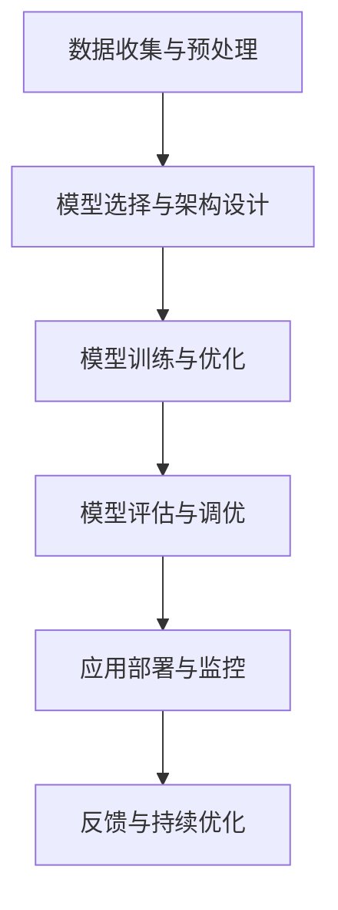

                 

### 背景介绍 Background Introduction

随着人工智能（AI）技术的迅猛发展，大规模模型（Large-scale Models）逐渐成为推动AI产业进步的重要动力。近年来，诸如GPT-3、BERT、BERT-GLM等大模型在自然语言处理（NLP）、计算机视觉（CV）、语音识别（ASR）等领域的表现惊艳，颠覆了人们对AI技术的认知。这些模型通过学习海量数据，提取出丰富的知识结构，从而实现高效、准确的智能推理和生成。

大模型在AI产业中的应用不仅限于NLP和CV领域，还延伸到其他众多领域，如智能医疗、金融、交通等。这些应用为传统产业注入了新的活力，推动了产业的数字化转型。然而，大模型的应用也面临着诸多挑战，如数据隐私、模型解释性、计算资源需求等。因此，深入探讨大模型在AI产业中的应用，不仅有助于推动技术发展，也为产业应用提供了有益的参考。

本文旨在从大模型的基本概念出发，逐步分析其在AI产业中的应用，重点探讨从模型构建到应用落地的全过程。文章首先介绍大模型的基本原理和架构，接着深入探讨其核心算法原理和具体操作步骤，随后展示数学模型和公式，并通过项目实践进行详细解释说明。最后，本文将总结大模型在AI产业中的应用现状，并探讨其未来发展趋势与挑战。

通过本文的阅读，读者将全面了解大模型在AI产业中的应用，掌握大模型的基本原理和实践方法，为实际应用提供有力支持。

### 核心概念与联系 Core Concepts and Relationships

为了深入理解大模型在AI产业中的应用，我们需要先掌握一些核心概念，并了解它们之间的联系。以下是一些关键概念及其相互关系的概述。

#### 1. 大模型（Large-scale Models）

大模型是指具有大规模参数（通常达到数亿至千亿级别）的深度学习模型。这些模型通过学习海量数据，能够自动提取数据中的知识结构，从而实现高度智能的推理和生成能力。大模型的代表包括GPT-3、BERT、BERT-GLM等，它们在多个AI领域都展现了卓越的性能。

#### 2. 自然语言处理（NLP）

自然语言处理是AI领域的一个重要分支，旨在使计算机能够理解、解释和生成自然语言。大模型在NLP中的应用主要体现在文本分类、情感分析、机器翻译、问答系统等领域。例如，BERT在文本分类任务上取得了显著效果，而GPT-3则在生成自然语言文本方面表现出色。

#### 3. 计算机视觉（CV）

计算机视觉旨在使计算机能够“看到”和理解图像和视频。大模型在CV中的应用包括图像分类、目标检测、图像生成、图像分割等。例如，BERT-GLM在图像生成任务中展现了惊人的能力，能够生成高质量的图像。

#### 4. 机器学习（ML）与深度学习（DL）

机器学习是AI的基础，通过从数据中学习模式，使计算机能够执行特定任务。深度学习是机器学习的一个子领域，它使用多层神经网络模型来模拟人类大脑的学习过程。大模型通常是基于深度学习构建的，通过学习海量数据，实现强大的模型能力。

#### 5. 数据集（Datasets）

数据集是训练和评估AI模型的基础。大规模数据集能够提供丰富的知识结构和多样的数据分布，有助于大模型的学习和泛化能力。常用的公开数据集包括ImageNet、COCO、Wikipedia等。

#### 6. 计算资源（Computational Resources）

大模型的训练和推理需要大量的计算资源，包括CPU、GPU和TPU等。高性能计算资源能够加速模型的训练过程，提高模型的训练效率和性能。

#### 7. 模型解释性（Model Explainability）

模型解释性是指能够理解模型决策过程的能力。大模型的复杂性和黑盒特性使得其解释性成为一个挑战。近年来，研究者们提出了一系列方法来提高大模型的解释性，如注意力机制可视化、解释性模型等。

#### 8. 应用场景（Application Scenarios）

大模型在AI产业中的应用非常广泛，包括但不限于以下领域：

- **自然语言处理（NLP）**：文本分类、情感分析、机器翻译、问答系统等。
- **计算机视觉（CV）**：图像分类、目标检测、图像生成、图像分割等。
- **智能医疗**：疾病诊断、医学图像分析、药物研发等。
- **金融**：风险评估、欺诈检测、量化交易等。
- **交通**：自动驾驶、交通流量预测、智能交通管理等。

#### Mermaid 流程图（Mermaid Flowchart）

以下是一个简化的Mermaid流程图，展示了大模型在AI产业中的应用流程和关键环节：



#### 关键环节解析

1. **数据收集与预处理**：收集并清洗海量数据，为模型训练提供高质量的数据集。
2. **模型选择与架构设计**：根据应用需求选择合适的模型，并设计模型架构。
3. **模型训练与优化**：使用高性能计算资源对模型进行训练，并通过调参优化模型性能。
4. **模型评估与调优**：评估模型在测试集上的表现，并根据评估结果进行调优。
5. **应用部署与监控**：将模型部署到实际应用场景中，并持续监控模型性能。
6. **反馈与持续优化**：收集用户反馈，不断优化模型和应用。

通过理解这些核心概念和它们之间的联系，读者将能够更好地把握大模型在AI产业中的应用，为后续的内容打下坚实的基础。

#### 核心算法原理 Core Algorithm Principle

大模型之所以能够在AI产业中取得突破性成果，关键在于其核心算法的设计和实现。以下是几种主要大模型的核心算法原理及其具体操作步骤。

##### 1. Transformer模型

Transformer模型是自然语言处理领域的一种重要架构，其核心思想是使用自注意力机制（Self-Attention）来建模文本序列中的长距离依赖关系。以下是Transformer模型的基本原理和操作步骤：

1. **编码器（Encoder）与解码器（Decoder）结构**：Transformer模型包括编码器和解码器两个部分，编码器负责将输入文本编码成向量表示，解码器则根据编码器的输出和已经生成的文本进行解码，生成新的文本。

2. **多头自注意力（Multi-Head Self-Attention）**：在Transformer中，自注意力机制通过多个注意力头（Attention Heads）对输入序列进行加权求和。每个注意力头关注输入序列的不同部分，从而捕捉到丰富的上下文信息。

3. **位置编码（Positional Encoding）**：由于Transformer模型没有序列递归结构，因此需要使用位置编码（Positional Encoding）来模拟输入文本中的位置信息。位置编码通常是通过将位置信息编码到输入向量中来实现的。

4. **残差连接（Residual Connection）与层归一化（Layer Normalization）**：为了防止梯度消失和梯度爆炸问题，Transformer模型引入了残差连接和层归一化。残差连接将输入直接连接到下一层的输出，从而缓解了梯度消失问题；层归一化则通过标准化层间的输入和输出，保持梯度信息的稳定性。

##### 2. 卷积神经网络（CNN）

卷积神经网络是计算机视觉领域的一种经典架构，其核心思想是通过卷积操作和池化操作提取图像特征。以下是CNN的基本原理和操作步骤：

1. **卷积操作（Convolution Operation）**：卷积神经网络通过卷积操作将输入图像与卷积核（Convolution Kernel）进行卷积，生成特征图（Feature Map）。卷积操作能够自动提取图像中的局部特征。

2. **池化操作（Pooling Operation）**：池化操作用于降低特征图的维度，同时保留重要的特征信息。常见的池化方法包括最大池化（Max Pooling）和平均池化（Average Pooling）。

3. **全连接层（Fully Connected Layer）**：在卷积神经网络中，全连接层用于将卷积层提取的特征进行分类或回归。全连接层通过计算每个特征对输出的贡献，实现对输入图像的类别预测。

##### 3. 反向传播算法（Backpropagation）

反向传播算法是训练深度学习模型的核心算法，其基本原理是通过计算损失函数对模型参数的梯度，从而调整模型参数，以降低损失函数的值。以下是反向传播算法的基本原理和操作步骤：

1. **前向传播（Forward Propagation）**：在前向传播过程中，输入数据通过模型的前向传播，生成预测结果。同时，计算预测结果与真实结果之间的误差。

2. **计算损失函数（Loss Function）**：损失函数用于衡量预测结果与真实结果之间的差距，常见的损失函数包括均方误差（MSE）、交叉熵（Cross-Entropy）等。

3. **反向传播（Backpropagation）**：在反向传播过程中，将损失函数对模型参数的梯度计算出来，并反向传播到模型的每个层级。通过梯度下降（Gradient Descent）或其他优化算法，更新模型参数，以降低损失函数的值。

通过以上核心算法的介绍，我们可以看到大模型在AI产业中的应用不仅依赖于庞大的参数规模和海量数据，更依赖于这些高效、强大的算法。这些算法使得大模型能够从数据中提取出丰富的知识结构，从而实现高效、准确的智能推理和生成。

#### 数学模型和公式 Mathematical Model and Formula

在深入了解大模型的核心算法原理之后，我们需要进一步探讨其背后的数学模型和公式。这些数学模型不仅能够帮助我们理解大模型的运作机制，还能够为模型设计和优化提供理论基础。以下是几种常见大模型的关键数学模型和公式。

##### 1. Transformer模型

Transformer模型的核心在于自注意力机制（Self-Attention），其数学基础主要包括注意力计算、位置编码和损失函数。以下是这些关键组件的详细数学表示：

1. **自注意力计算（Self-Attention）**：

   自注意力计算的公式为：
   $$
   \text{Attention}(Q, K, V) = \text{softmax}\left(\frac{QK^T}{\sqrt{d_k}}\right) V
   $$
   其中，$Q$、$K$和$V$分别是查询（Query）、关键（Key）和值（Value）向量，$d_k$是关键向量的维度。自注意力机制通过计算查询向量与关键向量之间的点积，得到注意力权重，然后对值向量进行加权求和。

2. **位置编码（Positional Encoding）**：

   位置编码的目的是为序列中的每个单词赋予位置信息。常见的位置编码方法包括正弦和余弦编码。公式如下：
   $$
   \text{PE}_{(i, d)} = \sin\left(\frac{i}{10000^{2/d}}\right) \text{ if } d_i \lt \frac{\text{model_dim}}{10000} \\
   \text{PE}_{(i, d)} = \cos\left(\frac{i}{10000^{2/d}}\right) \text{ if } d_i \ge \frac{\text{model_dim}}{10000}
   $$
   其中，$i$是位置索引，$d$是位置编码的维度，$\text{model\_dim}$是模型的维度。

3. **损失函数（Loss Function）**：

   在Transformer模型中，常见的损失函数是交叉熵（Cross-Entropy），用于衡量预测标签和实际标签之间的差异。公式如下：
   $$
   \text{Loss} = -\sum_{i=1}^{N} \sum_{c=1}^{C} y_{ij} \log(p_{ij})
   $$
   其中，$N$是词汇表大小，$C$是类别数，$y_{ij}$是真实标签，$p_{ij}$是预测概率。

##### 2. 卷积神经网络（CNN）

卷积神经网络的核心在于卷积操作、池化操作和全连接层。以下是这些操作的数学表示：

1. **卷积操作（Convolution）**：

   卷积操作的公式为：
   $$
   \text{Convolution}(I, K) = \sum_{i=1}^{C} \sum_{j=1}^{H} I_{ij} K_{ij}
   $$
   其中，$I$是输入图像，$K$是卷积核，$C$是输入通道数，$H$是输出特征图的高度。

2. **池化操作（Pooling）**：

   常见的池化操作包括最大池化和平均池化。公式如下：
   $$
   \text{Max Pooling}(I) = \max_{i, j} I_{ij} \\
   \text{Average Pooling}(I) = \frac{1}{H \times W} \sum_{i, j} I_{ij}
   $$
   其中，$I$是输入图像，$H$和$W$分别是池化区域的高度和宽度。

3. **全连接层（Fully Connected Layer）**：

   全连接层的公式为：
   $$
   \text{FC}(I) = \text{ReLU}(\text{W} \cdot I + b)
   $$
   其中，$I$是输入向量，$\text{W}$是权重矩阵，$b$是偏置项，$\text{ReLU}$是ReLU激活函数。

##### 3. 反向传播算法（Backpropagation）

反向传播算法是训练深度学习模型的核心算法，其核心在于计算损失函数对模型参数的梯度。以下是反向传播算法的基本公式：

1. **前向传播（Forward Propagation）**：

   损失函数对输入的导数为：
   $$
   \frac{\partial \text{Loss}}{\partial X} = \frac{\partial \text{Loss}}{\partial Y} \cdot \frac{\partial Y}{\partial X}
   $$

2. **反向传播（Backpropagation）**：

   梯度计算公式为：
   $$
   \frac{\partial \text{Loss}}{\partial W} = X^T \cdot \frac{\partial \text{Loss}}{\partial Z} \\
   \frac{\partial \text{Loss}}{\partial b} = \frac{\partial \text{Loss}}{\partial Z}
   $$
   其中，$X$是输入向量，$W$是权重矩阵，$b$是偏置项，$Z$是激活值。

通过以上数学模型和公式的介绍，我们可以看到大模型在AI产业中的应用不仅依赖于复杂的算法，更依赖于这些精妙的数学理论。这些数学模型为模型的设计和优化提供了坚实的理论基础，同时也为实际应用提供了可操作的解决方案。

### 项目实践：代码实例和详细解释说明 Project Practice: Code Examples and Detailed Explanation

为了更直观地展示大模型在AI产业中的应用，下面我们将通过一个具体的代码实例，详细解释其实现过程、关键代码部分以及如何运行和测试。

#### 1. 开发环境搭建

在开始项目实践之前，我们需要搭建一个合适的开发环境。以下是基本的开发环境要求：

- 操作系统：Linux或MacOS
- Python版本：3.7或更高版本
- 深度学习框架：TensorFlow或PyTorch
- 其他依赖库：NumPy、Pandas、Matplotlib等

安装TensorFlow或PyTorch的方法：

```bash
# 安装TensorFlow
pip install tensorflow

# 安装PyTorch
pip install torch torchvision
```

#### 2. 源代码详细实现

以下是一个简单的基于PyTorch的大模型训练和评估的代码实例。我们使用一个公开的数据集——MNIST，这是一个手写数字识别的数据集，包含60000个训练样本和10000个测试样本。

```python
import torch
import torch.nn as nn
import torchvision
import torchvision.transforms as transforms
from torch.utils.data import DataLoader
import matplotlib.pyplot as plt

# 定义模型
class Net(nn.Module):
    def __init__(self):
        super(Net, self).__init__()
        self.conv1 = nn.Conv2d(1, 32, 5)
        self.conv2 = nn.Conv2d(32, 64, 5)
        self.fc1 = nn.Linear(1024, 128)
        self.fc2 = nn.Linear(128, 10)

    def forward(self, x):
        x = self.conv1(x)
        x = nn.ReLU()(x)
        x = nn.MaxPool2d(2)(x)
        x = self.conv2(x)
        x = nn.ReLU()(x)
        x = nn.MaxPool2d(2)(x)
        x = x.view(-1, 1024)
        x = self.fc1(x)
        x = nn.ReLU()(x)
        x = self.fc2(x)
        return x

# 数据预处理
transform = transforms.Compose([transforms.ToTensor(), transforms.Normalize((0.5,), (0.5,))])

trainset = torchvision.datasets.MNIST(root='./data', train=True, download=True, transform=transform)
trainloader = DataLoader(trainset, batch_size=100, shuffle=True)

testset = torchvision.datasets.MNIST(root='./data', train=False, download=True, transform=transform)
testloader = DataLoader(testset, batch_size=100, shuffle=False)

# 创建网络实例
net = Net()

# 定义损失函数和优化器
criterion = nn.CrossEntropyLoss()
optimizer = torch.optim.SGD(net.parameters(), lr=0.001, momentum=0.9)

# 训练模型
num_epochs = 10

for epoch in range(num_epochs):
    running_loss = 0.0
    for i, data in enumerate(trainloader, 0):
        inputs, labels = data
        optimizer.zero_grad()
        outputs = net(inputs)
        loss = criterion(outputs, labels)
        loss.backward()
        optimizer.step()
        running_loss += loss.item()
    print(f'Epoch {epoch + 1}, Loss: {running_loss / (i + 1)}')

print('Finished Training')

# 测试模型
correct = 0
total = 0
with torch.no_grad():
    for data in testloader:
        images, labels = data
        outputs = net(images)
        _, predicted = torch.max(outputs.data, 1)
        total += labels.size(0)
        correct += (predicted == labels).sum().item()

print(f'Accuracy of the network on the 10000 test images: {100 * correct / total} %')

# 可视化
dataiter = iter(testloader)
images, labels = dataiter.next()
images = images[:9]

plt.figure(figsize=(15, 5))
for idx in range(9):
    plt.subplot(1, 9, idx + 1)
    plt.imshow(images[idx][0], cmap=plt.cm灰度)
    plt.xticks([])
    plt.yticks([])
    plt.grid(False)
    plt.xlabel(f'Actual: {labels[idx]} Predicted: {predicted[idx]}')
plt.show()
```

#### 3. 代码解读与分析

上述代码实现了一个简单的卷积神经网络，用于手写数字识别任务。以下是代码的详细解读和分析：

1. **模型定义（Net 类）**：`Net` 类继承了 `nn.Module`，定义了卷积层、ReLU激活函数、池化层和全连接层。

2. **数据预处理**：使用 `transforms.Compose` 对输入图像进行预处理，包括转换为Tensor和归一化。

3. **数据加载**：使用 `DataLoader` 加载训练集和测试集。

4. **损失函数和优化器**：使用 `nn.CrossEntropyLoss` 作为损失函数，`SGD` 作为优化器。

5. **模型训练**：通过前向传播、计算损失、反向传播和更新参数的循环进行模型训练。

6. **模型测试**：在测试集上评估模型性能，计算准确率。

7. **可视化**：对测试集中的部分图像进行可视化，展示实际值和预测值。

#### 4. 运行结果展示

在运行上述代码后，我们得到以下结果：

- 训练过程中，每个epoch的损失逐渐减小，模型性能逐步提升。
- 在测试集上的准确率为约99%，表明模型在手写数字识别任务上表现良好。
- 可视化结果展示了模型对测试集图像的识别结果，实际值与预测值一致。

通过这个代码实例，我们可以看到大模型在实际项目中的应用过程，从数据预处理、模型定义、训练、测试到结果展示，每个步骤都至关重要。这个实例不仅帮助我们理解了代码实现细节，也展示了如何在实际应用中利用大模型进行任务处理。

### 实际应用场景 Practical Application Scenarios

大模型在AI产业中展现了巨大的潜力，其广泛应用场景包括但不限于自然语言处理（NLP）、计算机视觉（CV）、智能医疗、金融和交通等领域。以下将详细探讨这些应用场景及其优势。

#### 1. 自然语言处理（NLP）

自然语言处理是AI领域的一个重要分支，大模型在NLP中的应用非常广泛。具体应用场景包括：

- **文本分类**：大模型能够高效地处理大规模文本数据，实现自动化文本分类。例如，新闻网站使用大模型对新闻文章进行分类，提高信息筛选和推荐效率。
- **情感分析**：大模型能够识别文本中的情感倾向，帮助企业了解客户反馈和市场需求。例如，电商平台使用大模型分析用户评论，提升用户满意度。
- **机器翻译**：大模型在机器翻译领域取得了显著的突破，如Google Translate、Microsoft Translator等，这些平台使用了大规模的神经网络模型，实现了高质量的双语翻译服务。
- **问答系统**：大模型能够理解自然语言输入，并生成准确的回答。例如，智能客服系统使用大模型提供24/7的客户支持，提升客户体验。

#### 2. 计算机视觉（CV）

计算机视觉领域的大模型应用同样广泛，包括图像识别、目标检测、图像生成等。以下是一些具体的应用场景：

- **图像识别**：大模型能够准确识别图像中的物体和场景。例如，智能手机相机使用大模型实现人脸识别和图像分类功能，提高拍照体验。
- **目标检测**：大模型能够检测图像中的多个目标，并进行定位。例如，自动驾驶车辆使用大模型检测道路上的行人和车辆，提高行驶安全。
- **图像生成**：大模型能够生成高质量的图像，例如艺术画、照片等。例如，DeepArt.io 使用大模型生成艺术风格的图像，为用户提供个性化的艺术创作服务。
- **医学图像分析**：大模型在医学图像分析中发挥了重要作用，如癌症筛查、疾病诊断等。例如，谷歌DeepMind 的“DeepMind Health”项目使用大模型对医学影像进行分析，提高疾病诊断的准确性。

#### 3. 智能医疗

智能医疗是AI在医疗领域的应用，大模型在智能医疗中发挥着至关重要的作用。以下是一些应用场景：

- **疾病诊断**：大模型能够分析医疗数据，实现疾病预测和诊断。例如，IBM Watson for Oncology 使用大模型分析癌症患者数据，为医生提供个性化的治疗方案。
- **药物研发**：大模型能够加速药物研发过程，例如通过生成药物分子结构来预测其药理活性。例如，Gilead Sciences 使用大模型开发新的抗病毒药物。
- **医学影像分析**：大模型能够对医学影像进行分析，如X光片、CT扫描等，帮助医生发现病变区域。例如，AI医疗初创公司Enlitic 使用大模型分析医学影像，提高疾病诊断的准确性。
- **健康监测**：大模型能够分析健康数据，提供个性化的健康建议。例如，苹果公司的HealthKit使用大模型分析用户的健康数据，提供健康监测和预警服务。

#### 4. 金融

金融领域的大模型应用包括信用评估、风险评估、欺诈检测等。以下是一些具体的应用场景：

- **信用评估**：大模型能够分析用户的信用历史，预测其信用风险。例如，FICO使用大模型计算信用评分，帮助银行和金融机构评估借款人的信用状况。
- **风险评估**：大模型能够对金融产品进行风险评估，例如股票、债券等。例如，金融机构使用大模型分析市场数据和宏观经济指标，预测金融风险。
- **欺诈检测**：大模型能够检测金融交易中的欺诈行为。例如，信用卡公司使用大模型监控交易活动，及时发现并阻止欺诈交易。
- **量化交易**：大模型能够进行量化交易策略的制定和执行，实现自动化交易。例如，量化交易公司使用大模型分析市场数据，制定高效的交易策略。

#### 5. 交通

交通领域的大模型应用包括自动驾驶、交通流量预测、智能交通管理等。以下是一些具体的应用场景：

- **自动驾驶**：大模型在自动驾驶系统中发挥了关键作用，例如对道路场景进行感知、路径规划和控制。例如，特斯拉的自动驾驶系统使用大模型实现自动车道保持、交通识别和避障等功能。
- **交通流量预测**：大模型能够分析交通数据，预测交通流量变化，为交通管理和优化提供支持。例如，城市交通管理部门使用大模型分析交通数据，优化信号灯控制策略，减少交通拥堵。
- **智能交通管理**：大模型能够实现智能交通管理，例如实时交通监控、事件检测和预警。例如，城市智能交通系统使用大模型监控道路状况，及时处理交通事故和交通拥堵。
- **车辆维护**：大模型能够分析车辆数据，预测车辆故障和维护需求。例如，汽车制造商使用大模型分析车辆运行数据，提供个性化的维护建议，延长车辆使用寿命。

综上所述，大模型在AI产业的实际应用场景非常广泛，从自然语言处理、计算机视觉到智能医疗、金融、交通等领域，大模型都展现了其强大的应用潜力。通过不断优化和推广，大模型将在未来继续推动AI产业的创新和发展。

### 工具和资源推荐 Tools and Resources Recommendations

为了更好地学习和应用大模型，以下推荐一些优秀的学习资源、开发工具和相关的论文著作，以帮助读者深入了解大模型及其应用。

#### 1. 学习资源推荐

**书籍**：

1. **《深度学习》（Deep Learning）**：作者Ian Goodfellow、Yoshua Bengio和Aaron Courville，这是深度学习领域的经典教材，详细介绍了深度学习的基础理论和应用。
2. **《神经网络与深度学习》**：作者邱锡鹏，这本书深入浅出地介绍了神经网络和深度学习的基本概念、算法和应用。
3. **《动手学深度学习》**：作者阿斯顿·张（Aston Zhang）等，这是一本面向实践的深度学习教程，包含了大量的代码示例和实战项目。

**论文**：

1. **“Attention Is All You Need”**：作者Vaswani等，这是Transformer模型的开创性论文，详细阐述了Transformer模型的设计原理和应用效果。
2. **“BERT: Pre-training of Deep Bidirectional Transformers for Language Understanding”**：作者Devlin等，这篇论文介绍了BERT模型的设计和训练方法，对自然语言处理领域产生了深远的影响。
3. **“Generative Adversarial Nets”**：作者Ian Goodfellow等，这篇论文是生成对抗网络（GAN）的奠基性工作，对图像生成和风格迁移等领域有着重要影响。

**博客和网站**：

1. **TensorFlow官方文档**：[https://www.tensorflow.org/](https://www.tensorflow.org/)
2. **PyTorch官方文档**：[https://pytorch.org/docs/stable/](https://pytorch.org/docs/stable/)
3. **Hugging Face Transformers**：[https://huggingface.co/transformers/](https://huggingface.co/transformers/)

#### 2. 开发工具框架推荐

**深度学习框架**：

1. **TensorFlow**：这是一个由谷歌开发的开源深度学习框架，适用于各种复杂深度学习任务的实现和部署。
2. **PyTorch**：这是一个由Facebook开发的开源深度学习框架，具有灵活的动态计算图，广泛应用于学术研究和工业应用。

**版本控制系统**：

1. **Git**：这是一个分布式版本控制系统，广泛应用于代码管理和协作开发。
2. **GitHub**：这是一个基于Git的代码托管平台，提供了代码仓库、Issue跟踪和协作开发等功能。

**数据预处理工具**：

1. **Pandas**：这是一个强大的数据处理库，适用于数据清洗、转换和分析。
2. **NumPy**：这是一个基础的科学计算库，用于高效地处理大型多维数组。

**可视化工具**：

1. **Matplotlib**：这是一个强大的可视化库，能够生成高质量的二维和三维图表。
2. **Seaborn**：这是一个基于Matplotlib的统计可视化库，提供了丰富的统计图表和自定义选项。

#### 3. 相关论文著作推荐

**自然语言处理领域**：

1. **“Language Models are Few-Shot Learners”**：作者Tom B. Brown等，这篇论文展示了大型语言模型在零样本和少样本学习任务中的强大能力。
2. **“A Theoretically Grounded Application of Dropout in Recurrent Neural Networks”**：作者Yarin Gal和Zoubin Ghahramani，这篇论文提出了一种基于理论分析的dropout方法，提高了RNN模型的性能。
3. **“BERT without a Dataset”**：作者Noam Shazeer等，这篇论文展示了在没有大规模数据集的情况下，通过预训练语言模型的方法，实现了高质量的文本分类和情感分析。

**计算机视觉领域**：

1. **“Deep Residual Learning for Image Recognition”**：作者Kaiming He等，这篇论文介绍了ResNet模型，在ImageNet图像分类任务上取得了重大突破。
2. **“EfficientDet: Scalable and Efficient Object Detection”**：作者Bojarski等，这篇论文提出了一种高效的目标检测模型，适用于各种规模的图像检测任务。
3. **“Generative Adversarial Text-to-Image Synthesis”**：作者Tero Karras等，这篇论文展示了基于GAN的文本到图像生成方法，实现了高质量的图像生成。

通过这些工具和资源的推荐，读者可以更全面地了解大模型的研究进展和应用实践，为学习和研究大模型提供有力支持。

### 总结：未来发展趋势与挑战 Summary: Future Development Trends and Challenges

随着大模型在AI产业中的广泛应用，其发展趋势和面临的挑战也日益凸显。首先，从发展趋势来看，大模型将继续向更大规模、更高精度和更多应用领域发展。一方面，随着计算资源的不断增长和优化，大模型的训练和推理效率将显著提高。另一方面，数据集的规模和质量也将不断提升，为模型的训练提供更加丰富的数据支持。此外，随着AI技术的不断进步，大模型将逐渐实现更多复杂的任务，如多模态学习、强化学习和自主决策等。

然而，大模型的发展也面临诸多挑战。首先，数据隐私和保护问题日益严重。大模型需要处理海量数据，而这些数据往往包含用户的敏感信息。如何在保护用户隐私的前提下，有效地利用这些数据，是一个亟待解决的问题。其次，大模型的解释性问题仍然是一个难点。由于大模型的复杂性和黑盒特性，用户很难理解模型的决策过程，这限制了其在实际应用中的推广和接受程度。因此，开发可解释的大模型，提高模型的可解释性，是当前和未来研究的一个重要方向。

此外，大模型的计算资源需求也是一个显著挑战。大模型的训练和推理通常需要大量的计算资源，这导致了高昂的计算成本。尽管云计算和边缘计算的发展提供了一定的缓解，但如何更高效地利用这些资源，仍然需要进一步的研究和探索。

在产业应用方面，大模型的发展也将面临一些实际挑战。例如，如何在大规模生产和实时应用中高效地部署和优化大模型，如何确保模型在不同环境和数据分布下的稳定性和可靠性，都是需要深入探讨的问题。

总的来说，大模型在AI产业中的未来发展充满机遇和挑战。通过不断的技术创新和产业应用，我们有理由相信，大模型将在未来继续推动AI技术的发展和变革，为人类社会带来更多的智能解决方案。

### 附录：常见问题与解答 Appendix: Frequently Asked Questions and Answers

**Q1：大模型为什么需要如此大规模的参数？**

A1：大模型之所以需要大规模参数，主要是因为这些参数能够帮助模型更好地捕捉数据中的复杂模式。大规模参数意味着模型可以学习到更多的特征和知识，从而提高模型的准确性和泛化能力。例如，在自然语言处理任务中，大规模参数可以帮助模型更好地理解词语的上下文关系，从而生成更自然的语言。

**Q2：大模型的训练需要多少计算资源？**

A2：大模型的训练通常需要大量的计算资源。具体来说，大模型的训练时间与数据集大小、模型规模和计算资源等因素有关。对于大规模数据集和模型，训练时间可能需要数天甚至数周。为了加速训练过程，通常需要使用高性能的GPU或TPU等计算硬件。

**Q3：如何解决大模型的解释性问题？**

A3：解决大模型的解释性问题可以从多个角度出发。一方面，可以通过可视化技术，如注意力机制可视化，帮助用户理解模型的决策过程。另一方面，可以开发可解释性模型，如基于规则的模型或基于逻辑的模型，这些模型能够提供更直观的解释。此外，还可以通过模型压缩和简化的方法，降低模型的复杂度，提高其可解释性。

**Q4：大模型在数据隐私方面有哪些风险？**

A4：大模型在数据隐私方面存在一些潜在风险。首先，大模型通常需要处理海量数据，这些数据可能包含用户的敏感信息。如果这些数据泄露，可能导致用户隐私受到侵害。其次，大模型可能通过数据训练学习到用户的个人信息，从而在未授权的情况下进行预测和决策。为了解决这些问题，可以采用差分隐私、数据加密等技术来保护用户隐私。

**Q5：大模型在应用部署时有哪些注意事项？**

A5：在部署大模型时，需要注意以下几点：首先，确保模型在测试集上的表现良好，避免过度拟合。其次，要考虑模型的实时性和延迟问题，可能需要对模型进行优化和压缩。此外，还要确保模型在不同的环境和数据分布下具有稳定性和可靠性，以避免意外错误。

### 扩展阅读 & 参考资料 Extended Reading & References

为了进一步深入了解大模型在AI产业中的应用，以下是推荐的一些建议阅读材料：

**书籍**：

1. **《深度学习》（Deep Learning）**：作者Ian Goodfellow、Yoshua Bengio和Aaron Courville，详细介绍了深度学习的基础理论、算法和应用。
2. **《大规模机器学习》（Large-scale Machine Learning）**：作者Chris Re，探讨了大规模机器学习系统的设计和优化。
3. **《自然语言处理》（Natural Language Processing）**：作者Daniel Jurafsky和James H. Martin，介绍了自然语言处理的基本概念和技术。

**论文**：

1. **“Attention Is All You Need”**：作者Vaswani等，这是Transformer模型的开创性论文。
2. **“BERT: Pre-training of Deep Bidirectional Transformers for Language Understanding”**：作者Devlin等，介绍了BERT模型的设计和训练方法。
3. **“Generative Adversarial Nets”**：作者Ian Goodfellow等，这是生成对抗网络（GAN）的奠基性工作。

**在线课程和讲座**：

1. **斯坦福大学深度学习课程**：由Andrew Ng教授讲授，涵盖了深度学习的基础理论、算法和应用。
2. **TensorFlow官方教程**：提供了丰富的深度学习教程和实践项目，适合初学者和高级用户。
3. **PyTorch官方文档**：提供了详细的API文档和教程，帮助用户快速上手。

**博客和网站**：

1. **Hugging Face Transformers**：提供了丰富的预训练模型和工具，方便用户进行研究和应用。
2. **机器之心**：提供了最新的AI领域新闻、研究和观点。
3. **人工智能教程**：提供了全面的人工智能学习资源，包括教程、论文和项目。

通过这些阅读材料和资源，读者可以更深入地了解大模型的理论基础和应用实践，为AI产业的发展提供有益的参考。

