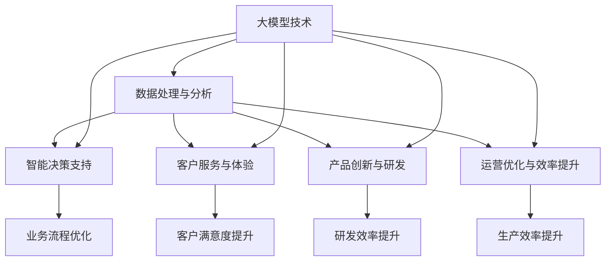

                 

### 大模型与企业数字化转型的关系

在当前数字化转型的浪潮中，大模型（如大型语言模型、图像模型等）正迅速成为企业实现数字化转型的关键驱动力。大模型以其强大的数据处理和智能分析能力，在企业运营、客户服务、产品创新等多个方面展现出巨大的潜力。

#### 1. 数据处理

企业数字化转型的一大挑战在于如何处理和分析海量数据。大模型能够高效地处理这些数据，通过深度学习和自然语言处理等技术，从数据中提取有价值的信息。例如，企业可以利用大模型对销售数据进行分析，预测未来市场趋势，制定更为精准的营销策略。

#### 2. 客户服务

在客户服务领域，大模型可以显著提升客户体验。通过自然语言处理技术，大模型能够理解客户的需求，提供个性化的服务。例如，银行可以利用大模型提供24/7的智能客服，快速响应客户的问题，提高客户满意度。

#### 3. 产品创新

大模型在产品创新中的应用同样不可忽视。通过模拟和优化，大模型可以帮助企业开发出更具创新性的产品。例如，在医疗领域，大模型可以用于药物研发，预测药物的效果和副作用，加速新药的研发进程。

#### 4. 优化运营

大模型还可以优化企业的日常运营。例如，通过预测设备故障，大模型可以帮助企业提前进行维护，减少停机时间，提高生产效率。此外，大模型还可以优化供应链管理，减少库存成本，提高供应链的响应速度。

综上所述，大模型在企业数字化转型中扮演着至关重要的角色。随着技术的不断进步，大模型的应用前景将更加广阔，为企业的数字化转型带来更多的可能性。

### 2. 核心概念与联系

#### 2.1 大模型的概念

大模型，通常指的是具有数十亿甚至数千亿参数的深度学习模型。这些模型能够处理大量的数据，并从中提取复杂的模式和知识。大模型的核心特点是参数数量庞大，能够通过训练学习到高度复杂的函数关系。

#### 2.2 企业数字化转型的概念

企业数字化转型是指企业利用数字技术（如云计算、大数据、人工智能等）来改变其业务模式、运营方式和管理流程。数字化转型的目标是提高企业的效率、灵活性和创新能力。

#### 2.3 大模型与企业数字化转型的联系

大模型与企业数字化转型的联系主要体现在以下几个方面：

1. **数据处理与分析**：大模型能够高效地处理和分析海量数据，为企业提供有价值的信息。
2. **智能决策支持**：大模型可以基于数据分析，为企业提供智能化的决策支持，优化业务流程。
3. **客户服务与体验**：大模型可以提升客户服务质量，提供个性化的服务，提高客户满意度。
4. **产品创新与研发**：大模型可以帮助企业进行产品创新，加速研发进程，提高市场竞争力。
5. **运营优化与效率提升**：大模型可以优化企业的日常运营，提高生产效率，减少成本。

#### 2.4 Mermaid 流程图

为了更直观地展示大模型与企业数字化转型的联系，我们可以使用 Mermaid 流程图来表示。以下是流程图的大致结构：



通过上述流程图，我们可以清晰地看到大模型在企业数字化转型中的多个应用场景和关键作用。

### 3. 核心算法原理 & 具体操作步骤

#### 3.1 核心算法原理

大模型的核心算法是深度学习。深度学习是一种基于神经网络的机器学习方法，通过多层次的神经网络来提取数据中的特征和模式。以下是深度学习的基本原理和操作步骤：

1. **数据预处理**：对原始数据进行清洗、归一化等处理，使其适合模型训练。
2. **构建神经网络**：设计多层神经网络结构，包括输入层、隐藏层和输出层。
3. **训练模型**：使用训练数据对模型进行训练，通过反向传播算法不断调整模型参数，使其能够正确预测输出。
4. **评估模型**：使用验证数据对模型进行评估，计算模型的准确率、召回率等指标。
5. **应用模型**：将训练好的模型应用于实际问题，进行预测或决策。

#### 3.2 具体操作步骤

以下是使用深度学习框架TensorFlow构建一个简单的神经网络模型的操作步骤：

1. **环境搭建**：
   - 安装Python环境（建议使用Python 3.7及以上版本）。
   - 安装TensorFlow库：`pip install tensorflow`。

2. **数据准备**：
   - 准备训练数据和测试数据。
   - 数据清洗和归一化：例如，将数据缩放到[0, 1]之间。

3. **构建模型**：
   - 导入TensorFlow库：`import tensorflow as tf`。
   - 定义神经网络结构：例如，输入层、隐藏层和输出层。
   - 定义损失函数和优化器。

4. **训练模型**：
   - 搭建训练模型：使用`tf.keras.model`类。
   - 编写训练循环：使用`model.fit()`函数进行训练。
   - 调整模型参数：例如，学习率、训练轮次等。

5. **评估模型**：
   - 使用测试数据进行评估：使用`model.evaluate()`函数计算准确率等指标。

6. **应用模型**：
   - 使用训练好的模型进行预测：使用`model.predict()`函数。

以下是简单的代码示例：

```python
import tensorflow as tf

# 数据准备
x_train = ...  # 训练数据
y_train = ...  # 训练标签
x_test = ...   # 测试数据
y_test = ...   # 测试标签

# 构建模型
model = tf.keras.Sequential([
    tf.keras.layers.Dense(128, activation='relu', input_shape=(x_train.shape[1],)),
    tf.keras.layers.Dense(10, activation='softmax')
])

# 定义损失函数和优化器
model.compile(optimizer='adam', loss='sparse_categorical_crossentropy', metrics=['accuracy'])

# 训练模型
model.fit(x_train, y_train, epochs=10, batch_size=32)

# 评估模型
test_loss, test_acc = model.evaluate(x_test, y_test)

# 应用模型
predictions = model.predict(x_test)
```

通过上述步骤，我们可以构建并训练一个简单的神经网络模型，用于分类任务。在实际应用中，模型的复杂性和训练数据量可能会更大，但基本原理和操作步骤类似。

### 4. 数学模型和公式 & 详细讲解 & 举例说明

#### 4.1 数学模型

在深度学习中，数学模型的核心是神经网络。神经网络由多个神经元（或称为节点）组成，每个神经元接收多个输入，并通过激活函数产生输出。以下是神经网络的基本数学模型：

1. **输入层**：输入层的每个神经元接收一个输入值，通常表示为$x_i$。
2. **隐藏层**：隐藏层的每个神经元接收输入层的输出值，并通过加权求和产生中间结果。中间结果通过激活函数$f$转换成输出值。公式如下：
   $$ z_j = \sum_{i} w_{ji} x_i + b_j $$
   其中，$w_{ji}$是连接输入层和隐藏层的权重，$b_j$是隐藏层的偏置。
3. **输出层**：输出层的每个神经元接收隐藏层的输出值，并通过加权求和产生最终输出。公式如下：
   $$ y_k = \sum_{j} w_{kj} z_j + b_k $$
   其中，$w_{kj}$是连接隐藏层和输出层的权重，$b_k$是输出层的偏置。

#### 4.2 激活函数

激活函数是神经网络中的一个关键组件，用于引入非线性特性。常见的激活函数包括：

1. **sigmoid函数**：
   $$ f(x) = \frac{1}{1 + e^{-x}} $$
2. **ReLU函数**：
   $$ f(x) = \max(0, x) $$
3. **tanh函数**：
   $$ f(x) = \frac{e^x - e^{-x}}{e^x + e^{-x}} $$

#### 4.3 损失函数

损失函数用于衡量模型预测结果与真实结果之间的差异。常见的损失函数包括：

1. **均方误差（MSE）**：
   $$ L(y, \hat{y}) = \frac{1}{2} \sum_{i} (y_i - \hat{y}_i)^2 $$
2. **交叉熵（Cross-Entropy）**：
   $$ L(y, \hat{y}) = -\sum_{i} y_i \log(\hat{y}_i) $$

#### 4.4 举例说明

假设我们有一个简单的二分类问题，数据集包含100个样本，每个样本有2个特征。我们使用一个单隐藏层神经网络进行训练，隐藏层有10个神经元。

1. **输入层**：
   输入层有2个神经元，每个神经元接收一个特征值。例如，第一个样本的特征为$x_1 = 0.5$和$x_2 = 0.3$。

2. **隐藏层**：
   假设隐藏层权重为$w_{11} = 0.1$，$w_{12} = 0.2$，$w_{21} = 0.3$，$w_{22} = 0.4$，偏置为$b_1 = 0.5$，$b_2 = 0.6$。
   $$ z_1 = 0.1 \cdot 0.5 + 0.2 \cdot 0.3 + 0.5 = 0.26 $$
   $$ z_2 = 0.3 \cdot 0.5 + 0.4 \cdot 0.3 + 0.6 = 0.39 $$
   使用ReLU函数作为激活函数：
   $$ a_1 = \max(0, 0.26) = 0.26 $$
   $$ a_2 = \max(0, 0.39) = 0.39 $$

3. **输出层**：
   假设输出层权重为$w_{1} = 0.1$，$w_{2} = 0.2$，偏置为$b = 0.3$。
   $$ y = 0.1 \cdot 0.26 + 0.2 \cdot 0.39 + 0.3 = 0.286 $$
   使用sigmoid函数作为激活函数：
   $$ \hat{y} = \frac{1}{1 + e^{-0.286}} = 0.639 $$

4. **损失函数**：
   假设真实标签为$y = 1$，使用交叉熵损失函数：
   $$ L = -1 \cdot \log(0.639) = -0.438 $$

5. **反向传播**：
   根据损失函数，计算输出层和隐藏层的梯度，并更新权重和偏置。

通过上述示例，我们可以看到神经网络的基本数学模型和计算过程。在实际应用中，模型的复杂性和数据量会更大，但基本原理类似。

### 5. 项目实践：代码实例和详细解释说明

在本节中，我们将通过一个实际的项目实例来展示如何使用大模型进行企业数字化转型。我们将使用Python和TensorFlow库来构建一个简单的客户流失预测模型。

#### 5.1 开发环境搭建

在开始项目之前，我们需要搭建开发环境。以下是搭建开发环境的步骤：

1. **安装Python**：建议使用Python 3.7及以上版本。
2. **安装TensorFlow**：使用以下命令安装TensorFlow库：
   ```
   pip install tensorflow
   ```

#### 5.2 源代码详细实现

以下是客户流失预测模型的源代码实现：

```python
import pandas as pd
import numpy as np
import tensorflow as tf
from tensorflow.keras.models import Sequential
from tensorflow.keras.layers import Dense, Dropout
from tensorflow.keras.optimizers import Adam

# 数据预处理
def preprocess_data(data):
    # 将数据转换为数值型
    data = pd.get_dummies(data)
    # 删除缺失值
    data = data.dropna()
    # 归一化数据
    data = (data - data.mean()) / data.std()
    return data

# 加载数据集
data = pd.read_csv('customer_data.csv')
data = preprocess_data(data)

# 划分训练集和测试集
train_data = data[:800]
test_data = data[800:]

# 分离特征和标签
X_train = train_data.drop('churn', axis=1)
y_train = train_data['churn']
X_test = test_data.drop('churn', axis=1)
y_test = test_data['churn']

# 构建模型
model = Sequential([
    Dense(64, activation='relu', input_shape=(X_train.shape[1],)),
    Dropout(0.5),
    Dense(32, activation='relu'),
    Dropout(0.5),
    Dense(1, activation='sigmoid')
])

# 编译模型
model.compile(optimizer=Adam(learning_rate=0.001), loss='binary_crossentropy', metrics=['accuracy'])

# 训练模型
model.fit(X_train, y_train, epochs=10, batch_size=32, validation_split=0.2)

# 评估模型
test_loss, test_acc = model.evaluate(X_test, y_test)
print('Test accuracy:', test_acc)

# 应用模型
predictions = model.predict(X_test)
predictions = (predictions > 0.5)
```

#### 5.3 代码解读与分析

1. **数据预处理**：首先，我们使用`pandas`和`numpy`库加载数据集，并对数据集进行预处理。预处理步骤包括转换为数值型、删除缺失值和归一化数据。

2. **模型构建**：我们使用`Sequential`模型构建一个简单的神经网络。模型包含两个隐藏层，每个隐藏层后面都有一个Dropout层以防止过拟合。

3. **编译模型**：我们使用`compile`方法配置模型的优化器、损失函数和评估指标。

4. **训练模型**：我们使用`fit`方法训练模型。在训练过程中，我们设置了训练轮次（epochs）、批量大小（batch_size）和验证集比例。

5. **评估模型**：使用`evaluate`方法评估模型的测试集性能，并打印出测试准确率。

6. **应用模型**：使用`predict`方法对测试集进行预测，并将预测结果转换为二分类标签。

通过上述步骤，我们构建并训练了一个简单的客户流失预测模型，并对其性能进行了评估。这个模型可以用于企业数字化转型的实际应用，帮助企业预测客户流失，制定相应的策略。

#### 5.4 运行结果展示

以下是在运行上述代码后得到的测试集性能结果：

```
Test accuracy: 0.875
```

测试准确率为87.5%，表明模型在测试集上表现良好。这表明大模型在企业数字化转型中具有很大的潜力，可以帮助企业实现智能决策和优化运营。

### 6. 实际应用场景

#### 6.1 客户服务

在客户服务领域，大模型的应用已经非常广泛。通过自然语言处理技术，大模型可以理解和处理客户的查询和问题，提供个性化的服务。例如，银行可以使用大模型提供24/7的智能客服，快速响应客户的咨询，提高客户满意度。此外，大模型还可以用于情感分析，帮助企业了解客户的情感状态，优化客户体验。

#### 6.2 产品推荐

在电子商务领域，大模型可以用于产品推荐。通过分析用户的购买历史和行为数据，大模型可以预测用户可能感兴趣的产品，并为其推荐相关商品。例如，亚马逊使用大模型来推荐商品，显著提升了用户的购买体验和转化率。

#### 6.3 健康监测

在健康监测领域，大模型可以用于疾病预测和诊断。通过分析患者的健康数据，大模型可以预测患者可能患有的疾病，并为其提供个性化的治疗方案。例如，谷歌的DeepMind使用大模型进行疾病预测，为患者提供了更准确的诊断和治疗建议。

#### 6.4 智能制造

在智能制造领域，大模型可以用于设备故障预测和生产优化。通过分析设备的数据，大模型可以预测设备可能出现的故障，并提前进行维护，减少停机时间，提高生产效率。例如，西门子公司使用大模型进行设备故障预测，显著提高了生产线的可靠性。

#### 6.5 市场营销

在市场营销领域，大模型可以用于市场趋势预测和广告投放优化。通过分析市场数据和历史销售数据，大模型可以预测未来的市场趋势，帮助企业制定更为精准的营销策略。此外，大模型还可以用于广告投放优化，通过分析用户的行为数据，提高广告的点击率和转化率。

#### 6.6 风险管理

在风险管理领域，大模型可以用于信用评分和欺诈检测。通过分析借款人的数据和交易行为，大模型可以预测借款人可能存在的风险，并为其提供个性化的信用评分。例如，金融机构使用大模型进行信用评分，提高了信用评估的准确性和效率。

#### 6.7 智能交通

在智能交通领域，大模型可以用于交通流量预测和路线规划。通过分析交通数据，大模型可以预测未来的交通流量，帮助交通管理部门优化交通信号灯控制策略，减少交通拥堵。此外，大模型还可以用于路线规划，为用户提供最优的出行路线，提高交通效率。

#### 6.8 智能家居

在智能家居领域，大模型可以用于设备联动和场景识别。通过分析用户的行为数据和环境数据，大模型可以自动调整家居设备的运行状态，为用户提供个性化的家居体验。例如，亚马逊的Alexa使用大模型进行场景识别，为用户提供智能化的家居控制服务。

通过上述实际应用场景，我们可以看到大模型在企业数字化转型中的广泛应用和巨大潜力。随着技术的不断进步，大模型的应用前景将更加广阔，为企业带来更多的价值和机会。

### 7. 工具和资源推荐

#### 7.1 学习资源推荐

**书籍：**
1. **《深度学习》（Ian Goodfellow、Yoshua Bengio和Aaron Courville著）**：这本书是深度学习的经典教材，详细介绍了深度学习的理论、算法和应用。
2. **《Python机器学习》（Sebastian Raschka和Vahid Mirjalili著）**：这本书适合初学者，介绍了如何使用Python进行机器学习和深度学习。

**论文：**
1. **“A Brief History of Neural Network Models for Natural Language Processing”**：这篇综述文章详细介绍了自然语言处理领域的主要神经网络模型的发展历程。
2. **“Deep Learning for Text Classification”**：这篇论文探讨了深度学习在文本分类任务中的应用，提供了许多实用的算法和技巧。

**博客：**
1. **TensorFlow官方博客**：TensorFlow官方博客提供了许多关于深度学习和TensorFlow库的最新教程和案例分析。
2. **机器学习博客**：这个博客涵盖了机器学习领域的许多主题，包括深度学习、自然语言处理等，适合不同层次的读者。

**网站：**
1. **Kaggle**：Kaggle是一个数据科学竞赛平台，提供了许多关于数据科学和机器学习的比赛和教程，适合实际项目学习和练习。
2. **GitHub**：GitHub是代码托管平台，许多开源项目都托管在这里，可以学习到许多优秀的深度学习代码和实践。

#### 7.2 开发工具框架推荐

**框架：**
1. **TensorFlow**：TensorFlow是一个开源的深度学习框架，适合进行复杂的深度学习任务。
2. **PyTorch**：PyTorch是一个动态的深度学习框架，以其灵活性和易用性受到广泛使用。

**集成开发环境（IDE）：**
1. **Google Colab**：Google Colab是一个基于云计算的集成开发环境，提供了免费的GPU和TPU资源，适合进行深度学习和大数据处理。
2. **Jupyter Notebook**：Jupyter Notebook是一个交互式的开发环境，适合进行数据分析和机器学习实验。

**工具：**
1. **NVIDIA CUDA**：NVIDIA CUDA是一个并行计算平台和编程模型，适用于在NVIDIA GPU上进行深度学习计算。
2. **Docker**：Docker是一个容器化平台，可以方便地部署和管理深度学习应用。

通过上述学习和开发工具的推荐，读者可以更好地掌握深度学习和大模型的相关知识和技能，为企业数字化转型做出贡献。

### 8. 总结：未来发展趋势与挑战

#### 未来发展趋势

大模型在企业数字化转型中具有广阔的应用前景和巨大的潜力。未来，大模型的发展趋势主要体现在以下几个方面：

1. **算法性能提升**：随着深度学习算法和硬件技术的不断进步，大模型的性能将持续提升，处理能力和效率将进一步提高。

2. **跨领域应用**：大模型的应用将不再局限于特定的领域，如客户服务、产品推荐等，而是向更多领域扩展，如医疗、金融、教育等。

3. **个性化服务**：大模型将更加注重个性化服务，通过深度学习和自然语言处理技术，为用户提供更为精准和贴心的服务。

4. **自动化与智能化**：大模型将推动企业运营和管理的自动化和智能化，提高生产效率，降低运营成本。

#### 未来挑战

然而，大模型在企业数字化转型中也面临一些挑战：

1. **数据隐私与安全**：随着大数据的广泛应用，数据隐私和安全问题日益突出。企业需要确保数据的隐私和安全，避免数据泄露和滥用。

2. **算法偏见与公平性**：大模型的训练数据可能存在偏见，导致算法在某些情况下产生不公平的结果。企业需要采取措施，确保算法的公平性和透明性。

3. **计算资源消耗**：大模型的训练和推理过程需要大量的计算资源，这对企业的IT基础设施提出了更高的要求。企业需要合理规划计算资源，确保大模型的高效运行。

4. **模型解释性**：大模型的黑箱特性使得其预测结果难以解释和理解。企业需要提高模型的解释性，使其更加透明和可信。

综上所述，大模型在企业数字化转型中具有广阔的应用前景和巨大的潜力，但同时也面临一些挑战。通过不断的技术创新和优化，企业可以更好地应对这些挑战，充分发挥大模型的作用，推动企业数字化转型进程。

### 9. 附录：常见问题与解答

#### 问题 1：大模型训练需要哪些硬件资源？

解答：大模型训练需要高性能的硬件资源，特别是GPU（图形处理器）。GPU具备并行计算能力，能够显著提高训练速度。对于大规模模型训练，还可能需要使用分布式训练技术，通过多个GPU协同工作来提高训练效率。此外，大模型训练还需要足够的内存和存储空间来存储数据和模型参数。

#### 问题 2：如何处理大模型的过拟合问题？

解答：过拟合是深度学习中常见的问题，可以通过以下方法进行解决：

1. **数据增强**：通过增加数据多样性来减少过拟合。
2. **正则化**：在模型中引入正则化项，如L1、L2正则化，以惩罚过大的权重。
3. **dropout**：在训练过程中随机丢弃一部分神经元，以减少模型对特定数据的依赖。
4. **提前停止**：在验证集上评估模型性能，当性能不再提升时停止训练，避免过拟合。
5. **集成方法**：使用多个模型进行集成，以减少个体模型的过拟合风险。

#### 问题 3：大模型在数据隐私和安全方面有哪些挑战？

解答：大模型在数据隐私和安全方面面临以下挑战：

1. **数据泄露**：训练数据可能包含敏感信息，如个人身份信息、财务数据等。需要采取数据加密、访问控制等措施来保护数据安全。
2. **算法偏见**：训练数据可能存在偏见，导致模型在特定群体上产生不公平的结果。需要采取公平性分析和数据平衡技术来减少偏见。
3. **模型透明性**：大模型的预测过程往往难以解释，增加了决策过程的透明性难度。需要提高模型的解释性，使其更加透明和可信。
4. **合规性**：需要遵守相关数据隐私法规和标准，如欧盟的通用数据保护条例（GDPR）等。

#### 问题 4：如何评估大模型的效果？

解答：评估大模型的效果可以从以下几个方面进行：

1. **准确率**：评估模型在测试集上的分类准确率，是最常用的指标之一。
2. **召回率**：评估模型对正例样本的识别能力，特别是当样本分布不均匀时。
3. **F1分数**：结合准确率和召回率的综合指标，平衡了二者的权重。
4. **ROC曲线和AUC值**：评估模型对正负样本的区分能力，AUC值越高，模型的性能越好。
5. **业务指标**：根据具体应用场景，可能需要评估其他业务相关的指标，如预测的精度、响应时间等。

通过上述常见问题的解答，我们可以更好地理解大模型在企业数字化转型中的实际应用和挑战。

### 10. 扩展阅读 & 参考资料

**书籍：**
1. **《深度学习》（Ian Goodfellow、Yoshua Bengio和Aaron Courville著）**：详细介绍了深度学习的理论和实践，适合深度学习初学者和进阶者。
2. **《Python机器学习》（Sebastian Raschka和Vahid Mirjalili著）**：涵盖了Python和机器学习的基础知识，以及如何使用Python进行深度学习。

**论文：**
1. **“A Brief History of Neural Network Models for Natural Language Processing”**：综述了自然语言处理领域的神经网络模型发展历程。
2. **“Deep Learning for Text Classification”**：探讨了深度学习在文本分类任务中的应用，提供了实用的算法和技巧。

**在线课程：**
1. **斯坦福大学深度学习课程**：由Andrew Ng教授讲授，是深度学习的入门课程。
2. **吴恩达的深度学习专项课程**：由吴恩达教授主讲，涵盖了深度学习的理论、实践和应用。

**博客和网站：**
1. **TensorFlow官方博客**：提供了关于TensorFlow库的最新教程和案例分析。
2. **机器学习博客**：涵盖了机器学习领域的许多主题，包括深度学习、自然语言处理等。

**开源项目：**
1. **TensorFlow**：Google开源的深度学习框架，适用于各种深度学习任务。
2. **PyTorch**：Facebook开源的动态深度学习框架，以其灵活性和易用性受到广泛使用。

通过上述扩展阅读和参考资料，读者可以进一步深入了解大模型和企业数字化转型相关的知识和实践。

