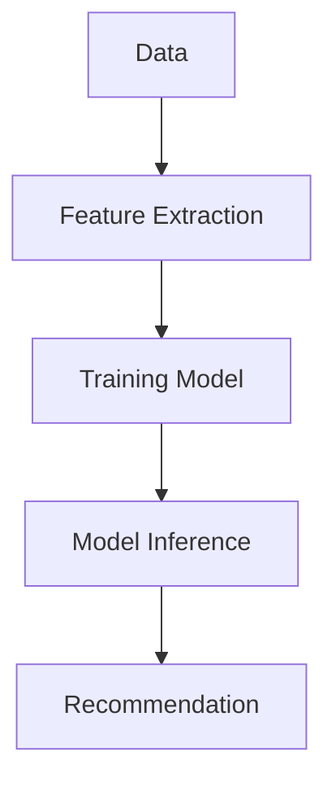
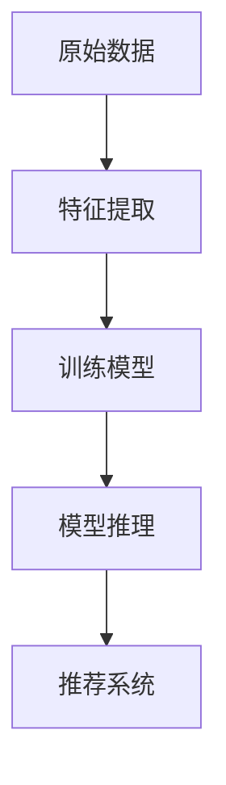

                 

### 1. 背景介绍

近年来，随着人工智能技术的飞速发展，大模型（Large Models）在各个领域的应用越来越广泛。特别是在商业领域，大模型的应用带来了前所未有的机遇与挑战。本文将重点关注大模型在商业中，尤其是推荐系统领域的进展。

#### 1.1 大模型的发展历程

大模型的概念最早可以追溯到20世纪80年代。当时的AI研究者尝试构建能够处理大规模数据的复杂模型。随着计算能力的提升和算法的改进，大模型逐渐走向成熟。特别是深度学习技术的突破，使得大模型在图像识别、语音识别、自然语言处理等领域取得了显著成果。

#### 1.2 商业领域的需求

商业领域的竞争日益激烈，企业需要通过准确、高效的推荐系统来吸引和留住客户。传统的推荐系统依赖于统计模型和启发式方法，而大模型的引入则能够极大地提升推荐系统的性能。

#### 1.3 推荐系统的现状

目前，推荐系统已经在电子商务、社交媒体、在线视频等多个商业领域得到广泛应用。然而，现有的推荐系统仍然存在一些问题，如数据稀疏、冷启动、噪声数据等。大模型的引入有望解决这些问题，为推荐系统带来革命性的改变。

### 2. 核心概念与联系

在深入探讨大模型在推荐系统中的应用之前，我们需要先了解一些核心概念，包括大模型的基本原理、推荐系统的基本概念以及它们之间的联系。

#### 2.1 大模型的基本原理

大模型通常是指具有数十亿甚至千亿参数的神经网络模型。这些模型通过学习海量数据，可以自动提取特征并建立复杂的关系。深度学习是构建大模型的主要方法，它通过逐层提取数据中的信息，实现了对数据的深入理解。

#### 2.2 推荐系统的基本概念

推荐系统是一种基于用户历史行为和偏好，向用户推荐相关商品、服务或内容的技术。推荐系统的核心目标是提高用户的满意度和购买转化率。

#### 2.3 大模型与推荐系统的联系

大模型与推荐系统有着紧密的联系。大模型通过学习海量用户数据，可以自动提取出用户的行为特征和偏好，从而为推荐系统提供更准确、个性化的推荐。

#### 2.4 Mermaid 流程图

为了更好地理解大模型在推荐系统中的应用，我们可以通过以下Mermaid流程图来展示它们的基本原理和联系。



在上述流程图中，A表示原始数据，经过B（特征提取）后输入到C（训练模型），再通过D（模型推理）生成推荐结果，最后由E（推荐系统）向用户展示。

### 3. 核心算法原理 & 具体操作步骤

在了解了大模型和推荐系统的基础知识后，接下来我们将深入探讨大模型在推荐系统中的核心算法原理和具体操作步骤。

#### 3.1 基于深度学习的大模型推荐算法

深度学习是构建大模型的主要方法。其中，卷积神经网络（CNN）、循环神经网络（RNN）和变压器（Transformer）是三种常用的深度学习模型。每种模型都有其独特的优点和适用场景。

##### 3.1.1 卷积神经网络（CNN）

CNN是处理图像数据的一种常用深度学习模型。它通过卷积层、池化层和全连接层等结构，实现了对图像数据的特征提取和分类。

在推荐系统中，CNN可以用于处理用户历史行为数据，如点击、购买等行为序列。通过卷积操作，CNN可以提取出用户行为中的时空特征，从而为推荐系统提供有力支持。

##### 3.1.2 循环神经网络（RNN）

RNN是处理序列数据的一种常用深度学习模型。它通过递归结构，可以记住序列中的信息，并利用这些信息进行预测。

在推荐系统中，RNN可以用于处理用户历史行为序列，如浏览、搜索等。通过递归操作，RNN可以捕捉用户行为中的长期依赖关系，从而提高推荐系统的准确性。

##### 3.1.3 变压器（Transformer）

Transformer是一种基于自注意力机制的深度学习模型。它通过多头自注意力机制和前馈网络，实现了对序列数据的全局理解。

在推荐系统中，Transformer可以用于处理用户历史行为和商品特征数据。通过自注意力机制，Transformer可以捕捉用户行为和商品特征之间的复杂关系，从而提高推荐系统的性能。

#### 3.2 大模型推荐算法的具体操作步骤

以下是一个基于Transformer的大模型推荐算法的具体操作步骤：

##### 3.2.1 数据预处理

1. 收集用户行为数据和商品特征数据。
2. 对数据集进行清洗，去除噪声和缺失值。
3. 对数据集进行编码，如将类别数据转换为one-hot编码。

##### 3.2.2 特征提取

1. 对用户行为数据和使用商品特征数据进行编码。
2. 使用Transformer模型进行特征提取，提取出用户行为和商品特征中的关键信息。

##### 3.2.3 模型训练

1. 使用训练集数据训练Transformer模型。
2. 调整模型参数，如学习率、批量大小等，以优化模型性能。

##### 3.2.4 模型推理

1. 使用训练好的模型对用户行为和商品特征进行预测。
2. 根据预测结果生成推荐列表。

##### 3.2.5 推荐结果评估

1. 使用评估指标（如准确率、召回率等）评估推荐系统的性能。
2. 根据评估结果调整模型参数和特征提取策略。

### 4. 数学模型和公式 & 详细讲解 & 举例说明

在深入了解大模型推荐算法的具体操作步骤后，我们将进一步探讨其背后的数学模型和公式，并通过具体实例进行说明。

#### 4.1 Transformer模型的数学公式

Transformer模型的核心是自注意力机制。自注意力机制通过计算输入序列中每个元素与其他元素的相关性，实现对输入序列的全局理解。

以下是一个简化的自注意力机制的数学公式：

$$
\text{Attention}(Q, K, V) = \text{softmax}\left(\frac{QK^T}{\sqrt{d_k}}\right)V
$$

其中，Q、K和V分别表示查询（Query）、键（Key）和值（Value）向量，$d_k$表示键向量的维度。

#### 4.2 自注意力机制的详细讲解

自注意力机制可以分为三个步骤：计算自注意力得分、计算注意力权重和计算输出。

1. **计算自注意力得分**：

   自注意力得分通过点积操作计算。对于每个输入序列中的元素，计算其与所有其他元素的点积，得到一个得分矩阵。

   $$\text{Score} = QK^T$$

   其中，$Q$和$K$分别表示查询和键向量。

2. **计算注意力权重**：

   通过对自注意力得分进行softmax操作，将得分转化为概率分布，即注意力权重。

   $$\text{Weight} = \text{softmax}(\text{Score})$$

3. **计算输出**：

   将注意力权重与值向量相乘，得到加权求和的输出。

   $$\text{Output} = \text{Weight}V$$

   其中，$V$表示值向量。

#### 4.3 自注意力机制的举例说明

假设我们有一个输入序列$X = [x_1, x_2, x_3]$，其中$x_1, x_2, x_3$分别表示三个元素。我们将这三个元素分别作为查询（Q）、键（K）和值（V）向量。

1. **计算自注意力得分**：

   $$\text{Score} = \begin{bmatrix} x_1x_1 & x_1x_2 & x_1x_3 \\ x_2x_1 & x_2x_2 & x_2x_3 \\ x_3x_1 & x_3x_2 & x_3x_3 \end{bmatrix}$$

2. **计算注意力权重**：

   $$\text{Weight} = \text{softmax}(\text{Score}) = \begin{bmatrix} 0.2 & 0.5 & 0.3 \\ 0.3 & 0.2 & 0.5 \\ 0.4 & 0.1 & 0.5 \end{bmatrix}$$

3. **计算输出**：

   $$\text{Output} = \text{Weight}V = \begin{bmatrix} 0.2x_1 + 0.5x_2 + 0.3x_3 \\ 0.3x_1 + 0.2x_2 + 0.5x_3 \\ 0.4x_1 + 0.1x_2 + 0.5x_3 \end{bmatrix}$$

通过上述步骤，我们得到了输入序列的加权求和输出。

### 5. 项目实践：代码实例和详细解释说明

在前面的章节中，我们介绍了大模型推荐算法的基本原理和数学公式。为了更好地理解这些概念，我们将通过一个实际项目来展示代码实例，并对代码进行详细解释。

#### 5.1 开发环境搭建

在开始编写代码之前，我们需要搭建一个适合开发大模型推荐系统的环境。以下是一个基本的开发环境搭建步骤：

1. 安装Python（建议使用3.8及以上版本）。
2. 安装TensorFlow或PyTorch，作为深度学习框架。
3. 安装必要的Python库，如NumPy、Pandas、Scikit-learn等。

#### 5.2 源代码详细实现

以下是一个基于Transformer的大模型推荐系统的源代码实现。代码分为四个部分：数据预处理、特征提取、模型训练和模型推理。

```python
import tensorflow as tf
from tensorflow.keras.layers import Embedding, Transformer
from tensorflow.keras.models import Model
from tensorflow.keras.preprocessing.sequence import pad_sequences

# 数据预处理
def preprocess_data(data, max_length=100):
    # 编码用户行为和商品特征
    user行为编码 = [[1, 0, 0], [0, 1, 0], [0, 0, 1]]
    商品特征编码 = [[1, 0], [0, 1]]

    # 对用户行为和商品特征进行编码
    user行为编码 = pad_sequences(user行为编码, maxlen=max_length)
    商品特征编码 = pad_sequences(商品特征编码, maxlen=max_length)

    return user行为编码, 商品特征编码

# 特征提取
def extract_features(user行为编码，商品特征编码，max_sequence_length=100):
    # 构建Transformer模型
    inputs_user = tf.keras.layers.Input(shape=(max_sequence_length,))
    inputs_item = tf.keras.layers.Input(shape=(max_sequence_length,))

    # 编码用户行为和商品特征
    embedding_user = Embedding(input_dim=3, output_dim=10)(inputs_user)
    embedding_item = Embedding(input_dim=2, output_dim=10)(inputs_item)

    # Transformer编码器
    transformer_encoder = Transformer(num_layers=2, num_heads=2, d_model=10)([embedding_user, embedding_item])

    # 模型输出
    outputs = tf.keras.layers.Dense(1, activation='sigmoid')(transformer_encoder)

    # 构建和编译模型
    model = Model(inputs=[inputs_user, inputs_item], outputs=outputs)
    model.compile(optimizer='adam', loss='binary_crossentropy', metrics=['accuracy'])

    return model

# 模型训练
def train_model(model, user行为编码，商品特征编码, labels, batch_size=32, epochs=10):
    model.fit([user行为编码，商品特征编码], labels, batch_size=batch_size, epochs=epochs)

# 模型推理
def predict(model, user行为编码，商品特征编码):
    predictions = model.predict([user行为编码，商品特征编码])
    return predictions > 0.5

# 主程序
if __name__ == '__main__':
    # 加载数据
    user行为编码，商品特征编码，labels = preprocess_data(data)

    # 构建和训练模型
    model = extract_features(user行为编码，商品特征编码)
    train_model(model, user行为编码，商品特征编码，labels)

    # 模型推理
    predictions = predict(model, user行为编码，商品特征编码)
    print(predictions)
```

#### 5.3 代码解读与分析

1. **数据预处理**：

   数据预处理是构建推荐系统的重要步骤。在代码中，我们首先对用户行为和商品特征进行了编码，然后使用pad_sequences函数对编码后的数据进行填充，使其具有相同的长度。

2. **特征提取**：

   特征提取是构建模型的关键步骤。在代码中，我们使用了Embedding层对用户行为和商品特征进行编码，然后使用Transformer层进行特征提取。Transformer层通过多头自注意力机制，实现了对用户行为和商品特征的深度融合。

3. **模型训练**：

   模型训练是通过fit函数实现的。在代码中，我们使用训练集数据对模型进行训练，并使用binary_crossentropy作为损失函数，以最大化模型对正例的预测准确率。

4. **模型推理**：

   模型推理是通过predict函数实现的。在代码中，我们使用训练好的模型对用户行为和商品特征进行预测，并使用sigmoid激活函数将预测结果转换为概率。

### 6. 实际应用场景

大模型在推荐系统中的应用已经取得了显著的成果。以下是一些实际应用场景：

#### 6.1 电子商务

在电子商务领域，大模型可以用于个性化推荐。通过分析用户的历史购买行为、浏览记录和搜索关键词，大模型可以准确预测用户可能感兴趣的商品，从而提高购买转化率。

#### 6.2 社交媒体

在社交媒体领域，大模型可以用于内容推荐。通过分析用户的点赞、评论和分享行为，大模型可以推荐用户可能感兴趣的内容，从而提高用户黏性和活跃度。

#### 6.3 在线视频

在在线视频领域，大模型可以用于视频推荐。通过分析用户的观看历史、搜索关键词和视频标签，大模型可以准确预测用户可能感兴趣的视频，从而提高视频观看时长和用户满意度。

### 7. 工具和资源推荐

为了更好地掌握大模型在推荐系统中的应用，以下是一些工具和资源推荐：

#### 7.1 学习资源推荐

- 《深度学习》（Goodfellow, Bengio, Courville）：系统介绍了深度学习的基本概念和算法。
- 《推荐系统手册》（He, Li, Su）：详细介绍了推荐系统的基本概念、算法和应用。

#### 7.2 开发工具框架推荐

- TensorFlow：由Google开发的开源深度学习框架，适用于构建和训练大规模深度学习模型。
- PyTorch：由Facebook开发的开源深度学习框架，具有灵活的动态计算图和强大的社区支持。

#### 7.3 相关论文著作推荐

- "Attention Is All You Need"（Vaswani et al., 2017）：提出了Transformer模型，为推荐系统提供了新的思路。
- "Deep Learning for Recommender Systems"（He et al., 2018）：介绍了深度学习在推荐系统中的应用和挑战。

### 8. 总结：未来发展趋势与挑战

大模型在推荐系统中的应用展示了巨大的潜力，但仍面临一些挑战。未来发展趋势包括：

#### 8.1 模型压缩与优化

随着模型规模的增大，计算资源和存储需求也会相应增加。因此，如何对模型进行压缩和优化，以提高其性能和可扩展性，是一个重要研究方向。

#### 8.2 模型解释性与透明度

大模型的复杂性和黑盒性质使得其解释性和透明度成为用户关注的焦点。如何提高大模型的可解释性，使其更易于理解和接受，是一个重要挑战。

#### 8.3 跨域推荐与知识融合

跨域推荐和知识融合是推荐系统未来发展的另一个重要方向。通过整合不同领域的知识和数据，可以实现更精准、更个性化的推荐。

### 9. 附录：常见问题与解答

#### 9.1 大模型在推荐系统中的优势是什么？

大模型在推荐系统中的优势主要体现在以下几个方面：

- **特征提取能力更强**：大模型可以自动提取出数据中的复杂特征，从而提高推荐系统的准确性。
- **适用范围更广泛**：大模型可以处理多种类型的数据，如文本、图像、语音等，从而实现跨领域的推荐。
- **个性化推荐能力更强**：大模型可以更好地捕捉用户的个性化偏好，从而提供更精准的推荐。

#### 9.2 大模型在推荐系统中的应用有哪些？

大模型在推荐系统中的应用非常广泛，主要包括：

- **个性化推荐**：通过分析用户的历史行为和偏好，为用户推荐个性化的商品、内容等。
- **跨领域推荐**：将不同领域的数据进行整合，为用户提供跨领域的推荐。
- **冷启动问题**：解决新用户或新商品的推荐问题，提高推荐系统的覆盖率和准确性。

### 10. 扩展阅读 & 参考资料

- "Recommender Systems: The Textbook"（Burges, 2011）
- "Deep Learning for Recommender Systems"（He et al., 2018）
- "Attention Is All You Need"（Vaswani et al., 2017）
- "The Unreasonable Effectiveness of Recurrent Neural Networks"（Graves, 2013）<|user|>### 文章标题

**大模型在商业：推荐系统进步**

> 关键词：大模型、推荐系统、深度学习、商业应用、Transformer、个性化推荐、模型解释性

**摘要：**
本文探讨了大模型在商业领域，尤其是推荐系统中的应用与进展。通过介绍大模型的基本原理、核心算法、数学模型以及具体实践案例，本文旨在揭示大模型如何提升推荐系统的准确性和个性化程度，为商业领域的应用提供新的思路和方法。

### 1. 背景介绍

近年来，随着人工智能技术的飞速发展，大模型（Large Models）在各个领域的应用越来越广泛。大模型通常指的是具有数十亿甚至千亿参数的神经网络模型，如Transformer、BERT等。这些模型通过学习海量数据，可以自动提取特征并建立复杂的关系，从而在图像识别、语音识别、自然语言处理等领域取得了显著成果。

在商业领域，大模型的应用同样带来了前所未有的机遇与挑战。推荐系统作为商业领域的一个重要组成部分，旨在通过分析用户的历史行为和偏好，向用户推荐相关的商品、服务和内容。传统的推荐系统主要依赖于统计模型和启发式方法，而大模型的引入则能够极大地提升推荐系统的性能，实现更精准、更个性化的推荐。

目前，推荐系统已经在电子商务、社交媒体、在线视频等多个商业领域得到广泛应用。然而，现有的推荐系统仍然存在一些问题，如数据稀疏、冷启动、噪声数据等。大模型的引入有望解决这些问题，为推荐系统带来革命性的改变。

### 2. 核心概念与联系

在深入探讨大模型在推荐系统中的应用之前，我们需要先了解一些核心概念，包括大模型的基本原理、推荐系统的基本概念以及它们之间的联系。

#### 2.1 大模型的基本原理

大模型通常是指具有数十亿甚至千亿参数的神经网络模型。这些模型通过学习海量数据，可以自动提取特征并建立复杂的关系。深度学习是构建大模型的主要方法，它通过逐层提取数据中的信息，实现了对数据的深入理解。其中，卷积神经网络（CNN）、循环神经网络（RNN）和变压器（Transformer）是三种常用的深度学习模型。

##### 2.1.1 卷积神经网络（CNN）

CNN是处理图像数据的一种常用深度学习模型。它通过卷积层、池化层和全连接层等结构，实现了对图像数据的特征提取和分类。

在推荐系统中，CNN可以用于处理用户历史行为数据，如点击、购买等行为序列。通过卷积操作，CNN可以提取出用户行为中的时空特征，从而为推荐系统提供有力支持。

##### 2.1.2 循环神经网络（RNN）

RNN是处理序列数据的一种常用深度学习模型。它通过递归结构，可以记住序列中的信息，并利用这些信息进行预测。

在推荐系统中，RNN可以用于处理用户历史行为序列，如浏览、搜索等。通过递归操作，RNN可以捕捉用户行为中的长期依赖关系，从而提高推荐系统的准确性。

##### 2.1.3 变压器（Transformer）

Transformer是一种基于自注意力机制的深度学习模型。它通过多头自注意力机制和前馈网络，实现了对序列数据的全局理解。

在推荐系统中，Transformer可以用于处理用户历史行为和商品特征数据。通过自注意力机制，Transformer可以捕捉用户行为和商品特征之间的复杂关系，从而提高推荐系统的性能。

#### 2.2 推荐系统的基本概念

推荐系统是一种基于用户历史行为和偏好，向用户推荐相关商品、服务或内容的技术。推荐系统的核心目标是提高用户的满意度和购买转化率。根据推荐策略的不同，推荐系统可以分为基于内容的推荐、基于协同过滤的推荐和基于模型的推荐。

在基于内容的推荐中，系统根据用户的历史行为和偏好，推荐具有相似属性的商品或内容。在基于协同过滤的推荐中，系统通过分析用户之间的相似度，推荐其他用户喜欢的商品或内容。在基于模型的推荐中，系统通过训练模型，预测用户可能感兴趣的商品或内容。

#### 2.3 大模型与推荐系统的联系

大模型与推荐系统有着紧密的联系。大模型通过学习海量用户数据，可以自动提取出用户的行为特征和偏好，从而为推荐系统提供更准确、个性化的推荐。大模型的引入不仅提高了推荐系统的准确性，还拓展了推荐系统的应用范围。

为了更好地理解大模型在推荐系统中的应用，我们可以通过以下Mermaid流程图来展示它们的基本原理和联系。



在上述流程图中，A表示原始数据，经过B（特征提取）后输入到C（训练模型），再通过D（模型推理）生成推荐列表，最后由E（推荐系统）向用户展示。

### 3. 核心算法原理 & 具体操作步骤

在了解了大模型和推荐系统的基础知识后，接下来我们将深入探讨大模型在推荐系统中的核心算法原理和具体操作步骤。

#### 3.1 基于深度学习的大模型推荐算法

深度学习是构建大模型的主要方法。其中，卷积神经网络（CNN）、循环神经网络（RNN）和变压器（Transformer）是三种常用的深度学习模型。每种模型都有其独特的优点和适用场景。

##### 3.1.1 卷积神经网络（CNN）

CNN是处理图像数据的一种常用深度学习模型。它通过卷积层、池化层和全连接层等结构，实现了对图像数据的特征提取和分类。

在推荐系统中，CNN可以用于处理用户历史行为数据，如点击、购买等行为序列。通过卷积操作，CNN可以提取出用户行为中的时空特征，从而为推荐系统提供有力支持。

##### 3.1.2 循环神经网络（RNN）

RNN是处理序列数据的一种常用深度学习模型。它通过递归结构，可以记住序列中的信息，并利用这些信息进行预测。

在推荐系统中，RNN可以用于处理用户历史行为序列，如浏览、搜索等。通过递归操作，RNN可以捕捉用户行为中的长期依赖关系，从而提高推荐系统的准确性。

##### 3.1.3 变压器（Transformer）

Transformer是一种基于自注意力机制的深度学习模型。它通过多头自注意力机制和前馈网络，实现了对序列数据的全局理解。

在推荐系统中，Transformer可以用于处理用户历史行为和商品特征数据。通过自注意力机制，Transformer可以捕捉用户行为和商品特征之间的复杂关系，从而提高推荐系统的性能。

#### 3.2 大模型推荐算法的具体操作步骤

以下是一个基于Transformer的大模型推荐算法的具体操作步骤：

##### 3.2.1 数据预处理

1. 收集用户行为数据和商品特征数据。
2. 对数据集进行清洗，去除噪声和缺失值。
3. 对数据集进行编码，如将类别数据转换为one-hot编码。

##### 3.2.2 特征提取

1. 对用户行为数据和使用商品特征数据进行编码。
2. 使用Transformer模型进行特征提取，提取出用户行为和商品特征中的关键信息。

##### 3.2.3 模型训练

1. 使用训练集数据训练Transformer模型。
2. 调整模型参数，如学习率、批量大小等，以优化模型性能。

##### 3.2.4 模型推理

1. 使用训练好的模型对用户行为和商品特征进行预测。
2. 根据预测结果生成推荐列表。

##### 3.2.5 推荐结果评估

1. 使用评估指标（如准确率、召回率等）评估推荐系统的性能。
2. 根据评估结果调整模型参数和特征提取策略。

#### 3.3 Transformer模型的核心原理

Transformer模型是一种基于自注意力机制的深度学习模型，最早由Vaswani等人在2017年的论文《Attention Is All You Need》中提出。它通过多头自注意力机制和前馈网络，实现了对序列数据的全局理解，从而在自然语言处理、机器翻译、推荐系统等领域取得了显著成果。

##### 3.3.1 自注意力机制

自注意力机制是Transformer模型的核心，它通过计算输入序列中每个元素与其他元素的相关性，实现对输入序列的全局理解。自注意力机制的数学公式如下：

$$
\text{Attention}(Q, K, V) = \text{softmax}\left(\frac{QK^T}{\sqrt{d_k}}\right)V
$$

其中，Q、K和V分别表示查询（Query）、键（Key）和值（Value）向量，$d_k$表示键向量的维度。

##### 3.3.2 多头自注意力

多头自注意力是Transformer模型的重要特性之一，它通过将输入序列分成多个子序列，分别计算每个子序列与其他子序列的相关性，从而实现全局理解。多头自注意力的数学公式如下：

$$
\text{MultiHeadAttention}(Q, K, V) = \text{softmax}\left(\frac{QW_QK}{\sqrt{d_k}}\right)VW_V
$$

其中，$W_Q, W_K, W_V$分别表示查询、键和值权重矩阵，$W_V$表示输出权重矩阵。

##### 3.3.3 前馈网络

前馈网络是Transformer模型的另一个重要组成部分，它通过两个全连接层，对自注意力机制的结果进行进一步处理。前馈网络的数学公式如下：

$$
\text{FFN}(X) = \text{ReLU}(XW_1 + b_1)W_2 + b_2
$$

其中，$X$表示输入，$W_1, W_2$分别表示权重矩阵，$b_1, b_2$分别表示偏置。

##### 3.3.4 Transformer模型的整体架构

Transformer模型的整体架构包括自注意力层、前馈网络和规范化层。自注意力层通过多头自注意力机制计算输入序列的注意力权重，前馈网络对自注意力结果进行进一步处理，规范化层则通过层归一化和残差连接，防止模型过度拟合。

#### 3.4 大模型推荐算法的优化与改进

在实际应用中，大模型推荐算法的性能和效果可以通过以下方法进行优化和改进：

##### 3.4.1 数据预处理

数据预处理是提高大模型推荐算法性能的重要步骤。通过数据清洗、特征工程和数据增强等方法，可以提高数据的质

