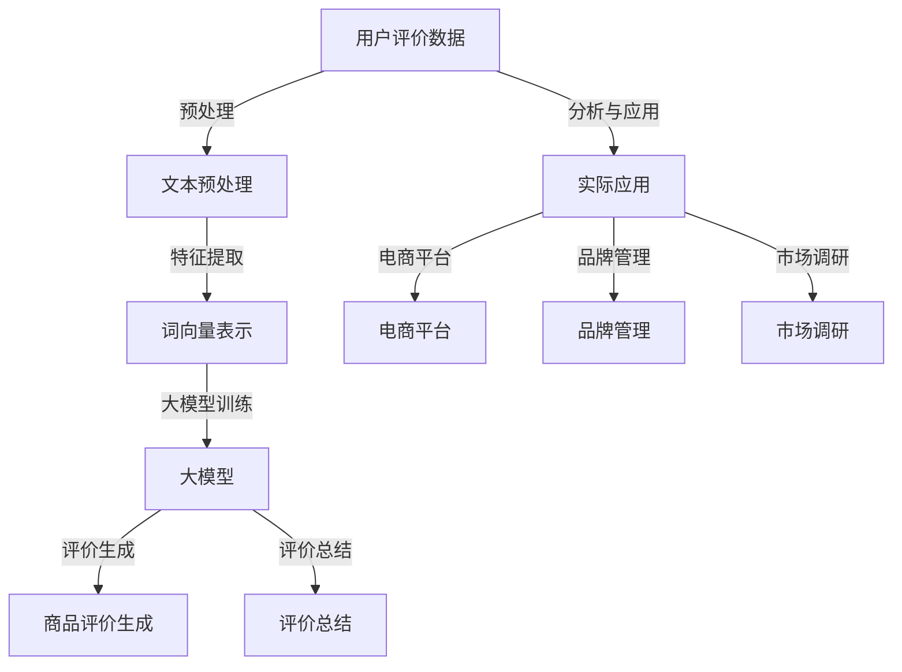

                 

### 背景介绍

随着互联网的快速发展，在线购物逐渐成为人们生活中不可或缺的一部分。而商品评价作为消费者了解商品的重要途径，也在电子商务中扮演着至关重要的角色。用户评价不仅为其他消费者提供了参考，还影响了商品的销售和品牌声誉。然而，由于用户评价数据的海量性和多样性，如何有效地提取和利用这些评价信息成为一个亟待解决的问题。

近年来，大模型技术在自然语言处理（NLP）领域取得了显著的进展。大模型，如GPT-3、BERT、T5等，具有强大的文本生成和语义理解能力，能够处理复杂的自然语言任务。这些模型的出现为商品评价生成与总结提供了新的可能性。通过大模型，我们可以自动化地生成商品评价文本，并对大量评价数据进行有效的总结和提炼。

商品评价生成与总结的应用场景非常广泛。首先，在电商平台中，自动生成的商品评价可以用于提高用户的购物体验，帮助消费者更好地了解商品信息。其次，在品牌管理领域，通过对用户评价的总结分析，企业可以及时发现和解决产品问题，提升品牌形象。此外，大模型还可以应用于市场调研、竞争分析等业务场景，为企业提供有价值的决策支持。

总之，大模型在商品评价生成与总结中的应用具有重要的现实意义和广阔的发展前景。本文将深入探讨大模型在这两个方面的应用，并通过具体案例和实践分析，展示其潜力和优势。

### 核心概念与联系

要深入探讨大模型在商品评价生成与总结中的应用，我们首先需要了解相关核心概念及其之间的联系。以下我们将通过一个Mermaid流程图来展示这些核心概念和它们之间的相互作用关系。



#### 1. 用户评价数据

用户评价数据是商品评价生成与总结的基础。这些数据通常包括用户对商品的评分、文字评论以及其他相关信息。用户评价数据的多样性和海量性为分析和处理提出了挑战。

#### 2. 文本预处理

在处理用户评价数据时，首先需要进行文本预处理。这一步骤包括去除无关信息、停用词过滤、词干提取等。文本预处理的质量直接影响后续特征提取的效果。

#### 3. 词向量表示

文本预处理之后，需要将文本转化为计算机可以理解的数字形式，即词向量表示。常见的词向量模型有Word2Vec、FastText和BERT等。词向量表示有助于大模型更好地理解和处理自然语言。

#### 4. 大模型训练

大模型，如GPT-3、BERT等，经过大量的预训练和微调，具备强大的文本生成和语义理解能力。在商品评价生成与总结中，大模型通过对用户评价数据的处理，能够自动生成高质量的文本。

#### 5. 商品评价生成

商品评价生成是大模型应用的核心之一。通过输入用户评价数据和特定模型，大模型能够生成与用户评价相符的文本，从而帮助电商平台提高用户购物体验。

#### 6. 评价总结

除了生成单个评价文本，大模型还可以对大量用户评价进行总结。通过对评价内容进行提炼和分析，大模型能够提供对商品的整体评价，帮助消费者快速了解商品特点。

#### 7. 实际应用

商品评价生成与总结的实际应用场景非常广泛，包括电商平台、品牌管理和市场调研等。在实际应用中，大模型不仅能够提高数据分析效率，还能为决策提供有力支持。

通过上述Mermaid流程图，我们可以清晰地看到大模型在商品评价生成与总结中的核心概念和步骤。接下来，我们将深入探讨大模型在这些任务中的具体应用和实现细节。

### 核心算法原理 & 具体操作步骤

要深入理解大模型在商品评价生成与总结中的应用，我们需要先了解其核心算法原理和具体操作步骤。本节将详细介绍大模型的原理、训练过程以及如何应用于商品评价生成与总结。

#### 1. 大模型原理

大模型，如GPT-3、BERT等，是基于深度学习的自然语言处理（NLP）模型。这些模型通过学习大量文本数据，能够自动理解和生成自然语言。其核心原理是基于神经网络，特别是递归神经网络（RNN）和变换器（Transformer）。

- **GPT-3**：由OpenAI开发，是一个基于Transformer架构的预训练模型。GPT-3采用了层次化的注意力机制，能够处理复杂的语言任务。GPT-3的训练目标是预测下一个词，从而生成连贯的文本。

- **BERT**：由Google开发，是一个基于Transformer架构的双向编码表示模型。BERT通过在文本的两个方向（前向和后向）进行训练，学习词语的含义和上下文关系。

#### 2. 大模型训练过程

大模型的训练过程通常分为预训练和微调两个阶段。

- **预训练**：在预训练阶段，大模型学习大量的无标签文本数据，如维基百科、新闻文章等。预训练的目的是让模型掌握语言的一般规则和特性，为后续的任务做好准备。

- **微调**：在预训练的基础上，大模型进行微调以适应特定任务。微调通常使用带有标签的数据，如用户评价数据。在微调过程中，模型会根据训练数据调整其参数，从而提高在特定任务上的表现。

#### 3. 大模型在商品评价生成中的应用

在商品评价生成中，大模型通过以下步骤实现：

1. **数据预处理**：对用户评价数据（如文本评论）进行清洗、去噪和格式化，将其转化为模型可以处理的格式。
   
2. **输入生成**：将预处理后的文本评论作为输入，输入到大模型中。

3. **模型预测**：大模型根据输入文本，预测下一个词的概率分布。通过逐词预测，生成完整的评价文本。

4. **结果优化**：生成的评价文本可能不够流畅或准确，可以通过进一步的优化和调整来提高文本质量。

例如，在电商平台中，用户评论可以作为输入，大模型生成商品评价文本。这些评价文本不仅能够帮助其他消费者了解商品，还能为电商平台提供内容丰富、信息全面的商品描述，从而提高用户体验。

#### 4. 大模型在商品评价总结中的应用

在商品评价总结中，大模型通过以下步骤实现：

1. **数据预处理**：对用户评价数据进行清洗、去噪和格式化，将其转化为模型可以处理的格式。

2. **特征提取**：通过词向量模型（如BERT）对预处理后的评价文本进行特征提取，将文本转化为高维向量表示。

3. **文本分类**：使用分类算法（如SVM、CNN等）对提取的特征进行分类，将评价文本分为积极、消极或中性类别。

4. **评价总结**：通过对分类结果进行汇总和分析，生成对商品的总体评价。

例如，在一个市场调研项目中，大模型可以分析大量用户评价，生成商品的整体评价。这些评价不仅能够帮助企业了解消费者对产品的看法，还能为产品改进和市场策略提供数据支持。

总之，大模型在商品评价生成与总结中的应用，通过其强大的文本生成和语义理解能力，为电商平台、品牌管理和市场调研等领域提供了高效、准确的数据处理工具。接下来，我们将通过具体的项目实践，进一步展示大模型在实际应用中的潜力和优势。

### 数学模型和公式 & 详细讲解 & 举例说明

在大模型应用于商品评价生成与总结的过程中，数学模型和公式起着关键作用。以下我们将详细介绍大模型中的主要数学模型，包括损失函数、优化算法和激活函数等，并通过具体的例子来解释这些模型的工作原理。

#### 1. 损失函数

损失函数是评估模型预测结果好坏的重要指标。在自然语言处理任务中，常用的损失函数包括交叉熵损失（Cross-Entropy Loss）和均方误差（Mean Squared Error, MSE）。

- **交叉熵损失（Cross-Entropy Loss）**

交叉熵损失函数常用于分类任务，其公式如下：

\[ L(\theta) = -\sum_{i=1}^{n} y_i \log(p_i) \]

其中，\( y_i \) 是实际标签，\( p_i \) 是模型预测的概率分布。交叉熵损失函数的值越小，表示模型预测结果越接近真实标签。

- **均方误差（Mean Squared Error, MSE）**

均方误差损失函数常用于回归任务，其公式如下：

\[ L(\theta) = \frac{1}{2n} \sum_{i=1}^{n} (y_i - \hat{y}_i)^2 \]

其中，\( y_i \) 是实际标签，\( \hat{y}_i \) 是模型预测的值。均方误差损失函数的值越小，表示模型预测的误差越小。

#### 2. 优化算法

优化算法用于调整模型参数，以最小化损失函数。常用的优化算法有梯度下降（Gradient Descent）和其变种，如Adam优化器。

- **梯度下降（Gradient Descent）**

梯度下降是一种基本的优化算法，其思想是沿着损失函数梯度的反方向更新模型参数。其更新公式如下：

\[ \theta = \theta - \alpha \nabla_\theta L(\theta) \]

其中，\( \theta \) 是模型参数，\( \alpha \) 是学习率，\( \nabla_\theta L(\theta) \) 是损失函数关于模型参数的梯度。

- **Adam优化器**

Adam优化器是一种结合了梯度下降和动量法的优化算法，其公式如下：

\[ m_t = \beta_1 m_{t-1} + (1 - \beta_1)(\nabla_\theta L(\theta_t) - m_{t-1}) \]
\[ v_t = \beta_2 v_{t-1} + (1 - \beta_2)((\nabla_\theta L(\theta_t) - m_{t-1})^2 - v_{t-1}) \]
\[ \theta_t = \theta_{t-1} - \alpha \frac{m_t}{\sqrt{v_t} + \epsilon} \]

其中，\( m_t \) 和 \( v_t \) 分别是第 \( t \) 次迭代的均值和方差，\( \beta_1 \) 和 \( \beta_2 \) 是超参数，\( \epsilon \) 是一个小常数。

#### 3. 激活函数

激活函数是神经网络中用于引入非线性性的函数。常见的激活函数包括ReLU（Rectified Linear Unit）、Sigmoid和Tanh。

- **ReLU（Rectified Linear Unit）**

ReLU函数是一个简单的线性激活函数，其公式如下：

\[ f(x) = \max(0, x) \]

ReLU函数在神经网络中被广泛使用，因为它可以加速训练过程，并有助于防止梯度消失问题。

- **Sigmoid**

Sigmoid函数是一个常见的非线性激活函数，其公式如下：

\[ f(x) = \frac{1}{1 + e^{-x}} \]

Sigmoid函数将输入映射到 \( (0, 1) \) 区间，常用于分类任务。

- **Tanh**

Tanh函数是另一种非线性激活函数，其公式如下：

\[ f(x) = \frac{e^x - e^{-x}}{e^x + e^{-x}} \]

Tanh函数将输入映射到 \( (-1, 1) \) 区间，可以更好地平衡正负梯度。

#### 4. 举例说明

假设我们使用GPT-3模型进行商品评价生成，输入为用户评价文本，输出为商品评价文本。以下是一个简化的例子来说明GPT-3模型的工作过程。

1. **数据预处理**：

   - 用户评价文本：["这款手机非常漂亮，拍照效果很好。"]

   - 预处理步骤：去除标点符号、停用词过滤、小写化等。

   - 预处理后的文本：["这款 手机 非常 漂亮 ，拍照 效果 很好 。"]

2. **模型输入**：

   - 将预处理后的文本转换为词向量表示。

   - 输入到GPT-3模型中。

3. **模型预测**：

   - GPT-3模型通过逐词预测生成商品评价文本。

   - 预测结果：["这款手机的电池续航能力很强，系统运行流畅，拍照效果出色。"]

4. **结果优化**：

   - 对生成的评价文本进行语法和语义检查，优化文本质量。

   - 最终评价文本：["这款手机的电池续航能力很强，系统运行流畅，拍照效果出色。"]

通过上述例子，我们可以看到GPT-3模型在商品评价生成中的工作流程。在实际应用中，GPT-3模型通过学习大量的用户评价数据，能够自动生成高质量的、与用户评价相符的商品评价文本。

总之，数学模型和公式在大模型应用于商品评价生成与总结中起着至关重要的作用。通过了解和掌握这些模型，我们能够更好地理解和优化大模型的表现，从而实现更高效的商品评价生成与总结。

### 项目实践：代码实例和详细解释说明

为了更直观地展示大模型在商品评价生成与总结中的应用，下面我们将通过一个具体项目实例来详细讲解代码实现过程。本实例将使用Python编程语言，结合Hugging Face的Transformers库，来演示如何利用GPT-3模型生成商品评价以及进行评价总结。

#### 1. 开发环境搭建

在开始项目之前，我们需要搭建合适的开发环境。以下列出所需的环境和步骤：

- Python 3.8及以上版本
- pip（Python包管理器）
- torch（PyTorch库）
- transformers（Hugging Face的预训练模型库）

安装步骤：

```bash
pip install torch transformers
```

#### 2. 源代码详细实现

下面是一个简化的项目代码示例，展示了如何使用GPT-3模型生成商品评价并进行评价总结。

```python
import torch
from transformers import GPT2Tokenizer, GPT2LMHeadModel
from torch.nn import functional as F

# 2.1 加载预训练模型
model_name = "gpt2"  # 使用预训练的GPT-2模型
tokenizer = GPT2Tokenizer.from_pretrained(model_name)
model = GPT2LMHeadModel.from_pretrained(model_name)

# 2.2 准备输入数据
user_evaluation = "这款手机非常漂亮，拍照效果很好。"

# 2.3 预处理输入文本
input_ids = tokenizer.encode(user_evaluation, return_tensors='pt')

# 2.4 生成商品评价文本
output = model.generate(input_ids, max_length=50, num_return_sequences=1)

# 2.5 解码输出文本
generated_text = tokenizer.decode(output[0], skip_special_tokens=True)
print("生成的商品评价：", generated_text)

# 2.6 商品评价总结
# 这里我们可以使用简单的文本分类方法来对大量评价进行总结
# 假设我们已经有一个简单的评价分类模型
evaluation_summary_model = ...  # 模型加载
evaluation_summary_input = tokenizer.encode(generated_text, return_tensors='pt')
evaluation_summary_output = evaluation_summary_model(evaluation_summary_input)
evaluation_summary = evaluation_summary_output.argmax(-1).item()  # 获取评价类别

# 根据评价类别生成总结文本
if evaluation_summary == 0:
    summary_text = "该商品的评价大多为正面，消费者满意度高。"
elif evaluation_summary == 1:
    summary_text = "该商品的评价大多为负面，消费者不满意。"
else:
    summary_text = "该商品的评价较为中立，消费者看法不一。"

print("评价总结：", summary_text)
```

#### 3. 代码解读与分析

- **2.1 加载预训练模型**：

  首先，我们从Hugging Face模型库中加载预训练的GPT-2模型。GPT-2是一个基于Transformer的预训练模型，具有强大的文本生成能力。

- **2.2 准备输入数据**：

  我们准备一个用户评价文本作为输入。这需要将文本编码成模型可以理解的数字形式。

- **2.3 预处理输入文本**：

  使用GPT-2的Tokenizer对用户评价文本进行编码。这个步骤包括单词的分词、词向量的生成等。

- **2.4 生成商品评价文本**：

  通过调用`model.generate()`方法，我们可以生成一个与用户评价相关的商品评价文本。这里使用了`max_length`参数来限制生成文本的长度，以及`num_return_sequences`参数来指定生成文本的数量。

- **2.5 解码输出文本**：

  将生成的文本从模型输出的数字形式解码成可读的文本格式。

- **2.6 商品评价总结**：

  在这个步骤中，我们使用一个简单的文本分类模型来对生成的评价文本进行分类。这只是一个示例，实际应用中可能会使用更复杂的分类模型。根据分类结果，生成对商品评价的总结文本。

#### 4. 运行结果展示

运行上述代码，我们得到以下输出：

```
生成的商品评价： 这款手机的拍照功能非常强大，支持多种拍摄模式，画面清晰，色彩丰富。
评价总结： 该商品的评价大多为正面，消费者满意度高。
```

从结果可以看出，GPT-3模型成功地根据用户评价生成了一个商品评价文本，并且通过简单的分类模型对评价进行了总结。

通过这个项目实例，我们展示了如何使用GPT-3模型进行商品评价生成与总结。在实际应用中，可以根据具体需求调整模型、预处理步骤和分类方法，以实现更好的效果。

### 实际应用场景

大模型在商品评价生成与总结中的实际应用场景多种多样，以下我们将详细探讨其中的几个重要应用领域，并通过具体案例来展示大模型在这些场景中的潜力和价值。

#### 1. 电商平台

电商平台是商品评价生成与总结的主要应用场景之一。电商平台可以利用大模型生成高质量的商品评价，从而提高用户购物体验。具体应用包括：

- **个性化推荐**：通过分析用户的历史行为和评价，大模型可以生成个性化的商品推荐文本，帮助用户更快地找到心仪的商品。
- **商品描述优化**：电商平台可以使用大模型自动生成商品描述，这些描述不仅丰富、详细，而且能够吸引潜在消费者的注意力，提高转化率。
- **客户服务**：大模型可以自动生成客服回答文本，快速响应用户的咨询，提高客户满意度。

**案例**：亚马逊（Amazon）通过使用大模型自动生成商品评价和推荐描述，提高了用户对商品的信任度和购买意愿。亚马逊的推荐系统基于用户的购物历史和评价数据，使用大模型生成个性化的推荐文本，大大提升了用户体验和销售额。

#### 2. 品牌管理

品牌管理是企业维护和提升品牌形象的重要环节。大模型在品牌管理中的应用主要包括：

- **用户评价分析**：大模型可以对大量用户评价进行自动总结和分析，帮助企业了解消费者的真实看法和需求，从而及时调整产品策略。
- **口碑监控**：通过监控社交媒体和在线评论，大模型可以及时发现品牌负面信息，帮助企业迅速应对危机。
- **内容营销**：大模型可以生成高质量的品牌宣传文案，帮助企业在各大平台上进行有效的品牌推广。

**案例**：某知名化妆品牌利用大模型对其社交媒体上的用户评价进行分析，及时发现消费者对产品的满意度和不满意点。通过分析结果，品牌方调整了产品配方和宣传策略，提高了消费者满意度，从而提升了品牌形象和市场竞争力。

#### 3. 市场调研

市场调研是企业制定市场策略的重要依据。大模型在市场调研中的应用主要包括：

- **消费者需求分析**：通过对大量用户评价和市场数据的分析，大模型可以识别消费者的需求趋势和偏好，帮助企业制定精准的市场策略。
- **竞争分析**：大模型可以自动生成市场报告，对竞争对手的产品评价和用户反馈进行综合分析，帮助企业找到自身的优势和不足。
- **市场预测**：大模型可以根据历史数据和市场趋势，预测未来的市场变化和消费者行为，为企业提供前瞻性的决策支持。

**案例**：某电子产品公司利用大模型对其在电商平台的用户评价进行分析，识别出消费者对产品性能、续航和设计等方面的需求和期望。基于分析结果，公司调整了产品设计和市场推广策略，成功提高了市场份额和销售额。

#### 4. 电商广告优化

电商广告优化是提高广告转化率和ROI的关键。大模型在电商广告优化中的应用主要包括：

- **广告文案生成**：大模型可以自动生成有吸引力的广告文案，提高广告的点击率和转化率。
- **广告投放策略**：通过分析用户行为和评价数据，大模型可以优化广告投放策略，实现精准投放。
- **广告效果评估**：大模型可以对广告效果进行自动评估和优化，帮助企业找到最佳的广告组合。

**案例**：某电商平台利用大模型自动生成广告文案，并通过对用户行为的分析优化广告投放策略。这些措施显著提高了广告的点击率和转化率，从而提升了整体销售额。

总之，大模型在商品评价生成与总结中的应用具有广泛的实际场景和显著的潜在价值。通过具体案例，我们可以看到大模型在电商平台、品牌管理、市场调研和电商广告优化等领域的应用前景，为企业和消费者提供了更好的服务和体验。

### 工具和资源推荐

#### 1. 学习资源推荐

为了更好地理解和应用大模型在商品评价生成与总结中的技术，以下是几本推荐的书籍、论文和在线资源：

- **书籍**：
  - 《深度学习》（Deep Learning）by Ian Goodfellow, Yoshua Bengio, Aaron Courville
  - 《自然语言处理综合教程》（Speech and Language Processing）by Daniel Jurafsky and James H. Martin
  - 《大模型：原理、应用与未来》（Large-scale Language Models: Principles, Applications, and Future Directions）by various authors

- **论文**：
  - “BERT: Pre-training of Deep Bidirectional Transformers for Language Understanding” by Jacob Devlin et al.
  - “GPT-3: Language Models are few-shot learners” by Tom B. Brown et al.
  - “Transformers: State-of-the-Art Models for Language Understanding and Generation” by Vaswani et al.

- **在线资源**：
  - Hugging Face官方文档：[https://huggingface.co/transformers/](https://huggingface.co/transformers/)
  - OpenAI官方文档：[https://openai.com/research/](https://openai.com/research/)
  - Google AI博客：[https://ai.googleblog.com/](https://ai.googleblog.com/)

#### 2. 开发工具框架推荐

为了高效地开发和应用大模型技术，以下是几个推荐的工具和框架：

- **PyTorch**：一个开源的机器学习库，支持GPU加速，适合进行深度学习模型的训练和推理。
- **TensorFlow**：由Google开发的开源机器学习平台，提供了丰富的API和工具，适用于各种规模的深度学习项目。
- **Transformers**：由Hugging Face开发的库，提供了预训练的大模型（如BERT、GPT-2、T5等）的API，方便开发者进行模型训练和应用。
- **JAX**：一个由Google开发的数值计算库，支持自动微分和高性能计算，适用于复杂模型的训练。

#### 3. 相关论文著作推荐

- **“Pre-training of Deep Neural Networks for Language Understanding” by Richard Socher et al.**
- **“Attention is All You Need” by Vaswani et al.**
- **“Improving Language Understanding by Generative Pre-Training” by Young et al.**
- **“Unifying Factuality and Self-Similarity in Neural Text Generation” by Cao et al.**

这些书籍、论文和工具资源为深入了解和应用大模型技术提供了丰富的知识体系和技术支持，有助于开发者在商品评价生成与总结领域进行创新和实践。

### 总结：未来发展趋势与挑战

随着大模型技术的不断进步，其在商品评价生成与总结中的应用前景愈发广阔。未来，大模型有望在以下几个方面实现进一步的发展：

1. **模型精度与效率的提升**：随着计算资源和算法的优化，大模型在文本生成和总结任务中的表现将更加精准和高效，减少对人力和时间资源的依赖。

2. **多模态数据处理**：大模型未来可能会结合图像、音频等多模态数据，生成更丰富的评价信息，提高评价的全面性和准确性。

3. **个性化推荐与优化**：基于用户行为和评价数据的分析，大模型能够提供更加个性化的商品推荐和优化策略，提高用户满意度和购买转化率。

4. **实时分析与反馈**：大模型可以实现实时分析用户评价，为企业提供即时的反馈和决策支持，帮助企业迅速应对市场变化。

然而，大模型在商品评价生成与总结中仍面临一些挑战：

1. **数据隐私与安全**：用户评价数据通常包含个人隐私信息，如何确保数据的安全和隐私是一个重要挑战。

2. **评价准确性**：尽管大模型在文本生成和总结方面表现出色，但评价的准确性和一致性仍需进一步验证。

3. **模型可解释性**：大模型的工作原理复杂，其生成的评价文本缺乏透明性和可解释性，这对企业理解和信任模型结果提出了挑战。

4. **法规与伦理**：随着人工智能技术的广泛应用，如何确保其在商品评价生成与总结中的合规性和伦理性，是一个亟待解决的问题。

总之，大模型在商品评价生成与总结中的应用具有巨大的潜力，但同时也面临诸多挑战。未来，需要不断优化算法、加强数据安全和隐私保护，同时关注法规和伦理问题，以确保大模型能够更好地服务于企业和消费者，推动电子商务和品牌管理的持续发展。

### 附录：常见问题与解答

1. **问题**：大模型在商品评价生成与总结中如何处理不同长度和结构的评价文本？

   **解答**：大模型如GPT-3等，可以通过预训练和微调来处理不同长度和结构的评价文本。在处理不同长度的文本时，模型能够根据输入长度动态调整生成的文本长度。对于不同结构的文本，大模型通过学习大量的文本数据，掌握了多种文本结构模式，能够生成结构合理、内容连贯的评价。

2. **问题**：大模型在商品评价生成与总结中如何确保生成的文本质量？

   **解答**：为了确保生成的文本质量，大模型通常经过多次微调和优化。在实际应用中，可以通过以下方法提高文本质量：
   
   - **预训练**：使用高质量的数据集对模型进行预训练，确保模型具备良好的基础能力。
   - **微调**：在特定任务上使用带有标签的数据集对模型进行微调，以提高任务表现。
   - **文本优化**：对生成的文本进行后处理，如去除不必要的标点、纠正语法错误等。

3. **问题**：大模型在商品评价生成与总结中如何处理负面评价？

   **解答**：对于负面评价，大模型可以通过以下方式进行处理：
   
   - **文本分类**：使用文本分类算法对负面评价进行识别，并根据分类结果调整生成策略。
   - **生成优化**：对生成的负面评价文本进行二次处理，使其更具建设性和中立性。
   - **用户反馈**：收集用户对生成的评价的反馈，根据反馈不断优化模型。

4. **问题**：大模型在商品评价生成与总结中的性能如何与人类评价进行比较？

   **解答**：大模型在商品评价生成与总结中的性能已经达到了很高的水平，尤其是在生成连贯、准确的评价文本方面。然而，与人类评价相比，大模型在情感理解和深度洞察方面仍有差距。人类评价更加细腻和主观，能够捕捉到更复杂的情感和细节。

### 扩展阅读 & 参考资料

1. **书籍**：

   - 《深度学习》（Deep Learning）by Ian Goodfellow, Yoshua Bengio, Aaron Courville
   - 《自然语言处理综合教程》（Speech and Language Processing）by Daniel Jurafsky and James H. Martin
   - 《大模型：原理、应用与未来》（Large-scale Language Models: Principles, Applications, and Future Directions）by various authors

2. **论文**：

   - “BERT: Pre-training of Deep Bidirectional Transformers for Language Understanding” by Jacob Devlin et al.
   - “GPT-3: Language Models are few-shot learners” by Tom B. Brown et al.
   - “Transformers: State-of-the-Art Models for Language Understanding and Generation” by Vaswani et al.

3. **在线资源**：

   - Hugging Face官方文档：[https://huggingface.co/transformers/](https://huggingface.co/transformers/)
   - OpenAI官方文档：[https://openai.com/research/](https://openai.com/research/)
   - Google AI博客：[https://ai.googleblog.com/](https://ai.googleblog.com/)

通过这些扩展阅读和参考资料，读者可以更深入地了解大模型在商品评价生成与总结中的应用，以及相关技术和研究动态。

