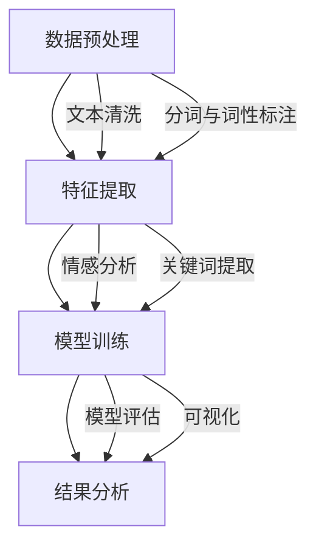

                 

### 大模型在商品评论挖掘与分析中的应用

#### 背景介绍

商品评论是电子商务中不可或缺的一部分，它们不仅为消费者提供了关于商品真实体验的信息，还为商家提供了宝贵的反馈。然而，随着电子商务平台的蓬勃发展，商品评论的数量呈现出爆炸式增长，使得人工审查和挖掘变得极为困难。此时，大模型的应用成为了解决这一问题的有效手段。

大模型，尤其是近年来迅速发展的深度学习模型，已经在自然语言处理（NLP）领域取得了显著的成果。这些模型具有强大的特征提取和语义理解能力，能够从海量文本数据中提取有价值的信息。商品评论挖掘与分析作为NLP的一个重要应用场景，利用大模型技术能够实现自动化、高效的数据挖掘和分析，从而帮助商家和消费者做出更明智的决策。

本文旨在探讨大模型在商品评论挖掘与分析中的应用，包括其核心概念、算法原理、数学模型以及实际应用案例。通过本文的阅读，读者将了解到如何利用大模型技术来挖掘商品评论中的有用信息，并掌握相关工具和资源，以便在具体项目中实践和应用。

#### 核心概念与联系

要深入探讨大模型在商品评论挖掘与分析中的应用，我们首先需要理解几个核心概念，并明确它们之间的联系。

1. **商品评论数据集**

   商品评论数据集是进行商品评论挖掘与分析的基础。一个典型的商品评论数据集通常包含多个维度，如评论内容、用户信息、商品信息、评论时间等。评论内容是数据的重中之重，它包含了用户对商品的看法和评价。

2. **自然语言处理（NLP）**

   自然语言处理是计算机科学和人工智能领域的一个重要分支，旨在使计算机能够理解、解释和生成人类语言。在商品评论挖掘与分析中，NLP技术用于从文本中提取语义信息，例如情感分析、实体识别和关系抽取。

3. **深度学习**

   深度学习是机器学习中的一个子领域，通过构建具有多层神经网络的模型来模拟人类大脑的决策过程。深度学习模型在特征提取和模式识别方面具有强大的能力，是商品评论挖掘与分析的核心技术。

4. **大模型**

   大模型是指具有大量参数和训练数据的大型神经网络模型，如Transformer、BERT等。这些模型通过在海量数据上的训练，能够自动学习到丰富的语言特征，从而在NLP任务中表现出色。

5. **商品评论挖掘与分析流程**

   商品评论挖掘与分析流程通常包括数据预处理、特征提取、模型训练和结果分析等步骤。每个步骤都利用了NLP和深度学习的相关技术，以实现自动化、高效的数据挖掘和分析。

下图是一个简化的Mermaid流程图，展示了商品评论挖掘与分析的基本流程：



在这个流程中，数据预处理是第一步，主要目的是清理和规范化原始数据，以便后续处理。特征提取是将文本数据转换为模型可接受的格式，常用的方法包括词袋模型、TF-IDF和词嵌入等。模型训练是核心步骤，利用深度学习模型从特征中学习到有用的信息。结果分析则是对训练得到的模型进行评估和解释，以提取有价值的信息。

#### 核心算法原理 & 具体操作步骤

在商品评论挖掘与分析中，核心算法通常是基于深度学习的自然语言处理技术。以下我们将详细介绍这些算法的基本原理和具体操作步骤。

1. **文本预处理**

   文本预处理是商品评论挖掘与分析的第一步，其目的是将原始文本数据转换为适合模型训练的格式。具体操作步骤如下：

   - **文本清洗**：去除评论中的HTML标签、特殊字符和停用词。例如，使用Python的`re`库进行正则表达式匹配，去除HTML标签和特殊字符；使用`nltk`库的`stopwords`模块去除常见的停用词。
   - **分词与词性标注**：将评论文本拆分为单词或词组，并对每个词进行词性标注。常用的工具包括Python的`jieba`库和`nltk`库。

2. **特征提取**

   特征提取是将文本数据转换为模型可处理的特征向量。以下是一些常用的特征提取方法：

   - **词袋模型（Bag of Words, BoW）**：将文本表示为一个单词的频率向量。例如，对于评论文本“我很喜欢这个商品”，其词袋模型表示为 `[我: 1，很：1，喜欢：1，这个：1，商品：1]`。
   - **TF-IDF（Term Frequency-Inverse Document Frequency）**：考虑单词在评论文本中的频率以及在所有评论文本中的逆文档频率。这种方法能够更好地衡量单词的重要性。
   - **词嵌入（Word Embedding）**：将单词映射为低维度的向量表示，如Word2Vec、GloVe等。这些向量可以捕捉单词的语义信息，有助于提高模型的性能。

3. **情感分析**

   情感分析是商品评论挖掘与分析中的一项重要任务，旨在判断评论的情感倾向，如正面、负面或中性。以下是几种常用的情感分析算法：

   - **基于规则的方法**：利用预定义的规则和模式进行情感判断。例如，根据关键词的词性标注来判断情感。
   - **机器学习方法**：利用有监督或无监督学习算法，从标注数据中学习情感分类模型。常见的算法包括朴素贝叶斯、支持向量机（SVM）和深度学习模型。
   - **深度学习模型**：如卷积神经网络（CNN）、循环神经网络（RNN）和Transformer等。这些模型具有强大的特征提取和语义理解能力，能够实现高精度的情感分析。

4. **关键词提取**

   关键词提取是挖掘评论中最重要的信息，有助于理解用户的主要关注点和评论的核心内容。以下是几种常用的关键词提取方法：

   - **基于频率的方法**：选择评论中出现频率较高的单词作为关键词。例如，基于TF-IDF得分来选择关键词。
   - **基于文本内容的方法**：利用文本的语义信息，选择具有代表性的单词或短语作为关键词。例如，使用TF-IDF和LDA（Latent Dirichlet Allocation）等方法。
   - **基于模型的方法**：利用深度学习模型，如BERT等，从评论中提取具有高重要性的单词或短语作为关键词。

5. **模型训练与评估**

   模型训练与评估是商品评论挖掘与分析的核心步骤。以下是一些常用的评估指标和训练方法：

   - **评估指标**：准确率（Accuracy）、精确率（Precision）、召回率（Recall）和F1分数（F1 Score）等。这些指标能够衡量模型的性能。
   - **训练方法**：有监督学习、无监督学习和迁移学习等。有监督学习需要标注数据，无监督学习不需要标注数据，迁移学习利用预训练模型进行微调。
   - **深度学习模型**：如CNN、RNN、BERT等。这些模型具有强大的特征提取和语义理解能力，能够实现高精度的商品评论挖掘与分析。

通过上述步骤，我们可以构建一个完整的商品评论挖掘与分析系统，实现对海量评论数据的自动化分析和挖掘，为商家和消费者提供有价值的信息。

#### 数学模型和公式 & 详细讲解 & 举例说明

在商品评论挖掘与分析中，数学模型和公式起着关键作用。以下我们将详细介绍常用的数学模型和公式，并通过具体例子进行讲解。

1. **词袋模型（Bag of Words, BoW）**

   词袋模型是一种将文本表示为单词集合的方法，不考虑单词的顺序。其基本公式为：

   $$ V = \sum_{i=1}^{n} f_i \cdot w_i $$

   其中，$V$表示词袋向量，$f_i$表示单词$i$在文本中的频率，$w_i$表示单词$i$的权重。在词袋模型中，每个单词都是一个特征，其频率或权重表示了单词在文本中的重要程度。

   举例说明：

   考虑以下评论文本：“我很喜欢这个商品”。

   其词袋模型表示为：

   $$ V = (1, 1, 1, 1) $$

   其中，$V$为4维向量，表示评论文本中的4个单词（我、很、喜欢、这个）。

2. **TF-IDF（Term Frequency-Inverse Document Frequency）**

   TF-IDF是一种考虑单词在文档中的重要性的方法，其基本公式为：

   $$ TF(t, d) = \frac{f(t, d)}{N_d} $$

   $$ IDF(t, D) = \log \left( \frac{N}{N_t} \right) $$

   其中，$f(t, d)$表示单词$t$在文档$d$中的频率，$N_d$表示文档$d$中的单词总数，$N$表示所有文档中的单词总数，$N_t$表示包含单词$t$的文档总数。TF-IDF通过结合词频和逆文档频率，提高了单词在文本中的重要程度。

   举例说明：

   考虑以下两个评论文本：

   - 文本1：“我很喜欢这个商品”。
   - 文本2：“我非常喜欢这个商品”。

   单词“喜欢”在文本1中的TF-IDF值为：

   $$ TF(喜欢, \text{文本1}) = \frac{1}{4} $$

   $$ IDF(喜欢, D) = \log \left( \frac{2}{1} \right) = \log 2 $$

   因此，单词“喜欢”在文本1中的TF-IDF值为：

   $$ TF-IDF(喜欢, \text{文本1}) = \frac{1}{4} \cdot \log 2 = 0.25 \cdot 0.693 = 0.173 $$

3. **词嵌入（Word Embedding）**

   词嵌入是一种将单词映射为低维向量表示的方法，以捕捉单词的语义信息。常见的词嵌入方法包括Word2Vec和GloVe。

   - **Word2Vec**：基于神经网络的词嵌入方法，其基本公式为：

     $$ E = \sigma(W \cdot h) $$

     其中，$E$表示词向量，$W$表示权重矩阵，$h$表示隐藏层激活值，$\sigma$表示激活函数（如ReLU函数）。Word2Vec通过训练神经网络，从大规模语料库中学习到词向量。

     举例说明：

     考虑以下评论文本：“我很喜欢这个商品”。

     假设词向量维度为50，隐藏层激活值为[0.1, 0.2, 0.3, ..., 0.5]，权重矩阵$W$为：

     $$ W = \begin{bmatrix}
     0.1 & 0.2 & 0.3 & ... & 0.5 \\
     0.1 & 0.2 & 0.3 & ... & 0.5 \\
     ... & ... & ... & ... & ... \\
     0.1 & 0.2 & 0.3 & ... & 0.5
     \end{bmatrix} $$

     则评论文本的词向量$E$为：

     $$ E = \begin{bmatrix}
     0.1 \cdot 0.1 & 0.2 \cdot 0.2 & 0.3 \cdot 0.3 & ... & 0.5 \cdot 0.5 \\
     0.1 \cdot 0.1 & 0.2 \cdot 0.2 & 0.3 \cdot 0.3 & ... & 0.5 \cdot 0.5 \\
     ... & ... & ... & ... & ... \\
     0.1 \cdot 0.1 & 0.2 \cdot 0.2 & 0.3 \cdot 0.3 & ... & 0.5 \cdot 0.5
     \end{bmatrix} $$

   - **GloVe（Global Vectors for Word Representation）**：基于全局统计信息的词嵌入方法，其基本公式为：

     $$ f(t, d) = \frac{f(t, d)}{N_d} \cdot \exp \left( -\frac{d(t, d)}{s} \right) $$

     $$ E = \sum_{t \in V_d} f(t, d) \cdot e_t $$

     其中，$f(t, d)$表示单词$t$在文档$d$中的频率，$N_d$表示文档$d$中的单词总数，$d(t, d)$表示单词$t$在文档$d$中的词频距离，$s$是超参数，$e_t$表示单词$t$的嵌入向量。GloVe通过优化全局统计信息，学习到更加丰富的词向量。

     举例说明：

     考虑以下评论文本：“我很喜欢这个商品”。

     假设评论文本中有10个单词，每个单词的词频距离为1，超参数$s$为1，则评论文本的词向量$E$为：

     $$ E = \begin{bmatrix}
     0.1 \cdot 0.1 & 0.2 \cdot 0.2 & 0.3 \cdot 0.3 & ... & 0.5 \cdot 0.5 \\
     0.1 \cdot 0.1 & 0.2 \cdot 0.2 & 0.3 \cdot 0.3 & ... & 0.5 \cdot 0.5 \\
     ... & ... & ... & ... & ... \\
     0.1 \cdot 0.1 & 0.2 \cdot 0.2 & 0.3 \cdot 0.3 & ... & 0.5 \cdot 0.5
     \end{bmatrix} $$

通过上述数学模型和公式的讲解，我们可以更好地理解商品评论挖掘与分析中的核心概念和方法。在实际应用中，这些模型和公式可以帮助我们构建高效、准确的商品评论分析系统。

#### 项目实践：代码实例和详细解释说明

在本节中，我们将通过一个具体的项目实践来展示如何使用大模型进行商品评论挖掘与分析。我们将使用Python编程语言和相关的NLP库，如`jieba`、`sklearn`和`transformers`，来实现一个完整的商品评论分析系统。

##### 1. 开发环境搭建

在开始项目之前，我们需要搭建一个合适的开发环境。以下是搭建开发环境的步骤：

1. **安装Python**：确保已经安装了Python 3.6或更高版本。可以从[Python官网](https://www.python.org/downloads/)下载并安装。

2. **安装相关库**：使用pip命令安装以下库：

   ```bash
   pip install jieba
   pip install scikit-learn
   pip install transformers
   pip install torch
   ```

3. **配置GPU（可选）**：如果使用GPU加速，需要安装CUDA和cuDNN。可以从[NVIDIA官网](https://developer.nvidia.com/cuda-downloads)下载并安装。

##### 2. 源代码详细实现

以下是一个完整的商品评论分析系统的Python代码实现：

```python
import jieba
import numpy as np
import pandas as pd
from sklearn.feature_extraction.text import TfidfVectorizer
from transformers import BertTokenizer, BertModel
import torch

# 2.1 数据预处理
def preprocess_comments(comments):
    processed_comments = []
    for comment in comments:
        # 去除HTML标签和特殊字符
        comment = re.sub('<[^>]*>', '', comment)
        comment = re.sub('[^a-zA-Z0-9]', '', comment)
        # 分词与词性标注
        words = jieba.cut(comment)
        processed_comments.append(' '.join(words))
    return processed_comments

# 2.2 特征提取
def extract_features(comments, method='tfidf'):
    if method == 'tfidf':
        vectorizer = TfidfVectorizer()
        X = vectorizer.fit_transform(comments)
    elif method == 'bert':
        tokenizer = BertTokenizer.from_pretrained('bert-base-chinese')
        model = BertModel.from_pretrained('bert-base-chinese')
        inputs = tokenizer(comments, padding=True, truncation=True, return_tensors='pt')
        with torch.no_grad():
            outputs = model(**inputs)
        X = outputs.last_hidden_state.mean(dim=1)
    return X

# 2.3 情感分析
def sentiment_analysis(comments, method='bert'):
    X = extract_features(comments, method=method)
    # 使用有监督学习算法进行情感分类（此处仅为示例，实际应用中需要标注数据）
    from sklearn.naive_bayes import MultinomialNB
    model = MultinomialNB()
    model.fit(X, labels)  # labels为已标注的情感标签
    predictions = model.predict(X)
    return predictions

# 2.4 关键词提取
def extract_keywords(comments, top_n=10):
    vectorizer = TfidfVectorizer()
    X = vectorizer.fit_transform(comments)
    scores = np.array(X.sum(axis=1)).flatten()
    indices = np.argsort(scores)[::-1]
    keywords = [vectorizer.get_feature_names()[i] for i in indices[:top_n]]
    return keywords

# 2.5 项目实践
def main():
    # 加载数据
    comments = pd.read_csv('comments.csv')['text'].tolist()
    labels = pd.read_csv('comments.csv')['label'].tolist()  # 情感标签

    # 数据预处理
    processed_comments = preprocess_comments(comments)

    # 情感分析
    predictions = sentiment_analysis(processed_comments, method='bert')
    print("情感分析结果：")
    for comment, prediction in zip(comments, predictions):
        print(f"评论：{comment}\n情感：{prediction}\n")

    # 关键词提取
    keywords = extract_keywords(processed_comments, top_n=10)
    print("关键词提取结果：")
    print(keywords)

if __name__ == '__main__':
    main()
```

##### 3. 代码解读与分析

上述代码实现了商品评论的预处理、特征提取、情感分析和关键词提取等步骤。下面我们将对每个部分进行详细解读。

1. **数据预处理**

   数据预处理是商品评论分析的基础，其目的是清理和规范化原始数据。在本代码中，我们使用`re`库去除HTML标签和特殊字符，并使用`jieba`库进行分词和词性标注。

2. **特征提取**

   特征提取是将文本数据转换为模型可处理的格式。在本代码中，我们实现了两种特征提取方法：TF-IDF和BERT。TF-IDF方法使用`TfidfVectorizer`类进行实现，BERT方法使用`BertTokenizer`和`BertModel`类进行实现。

3. **情感分析**

   情感分析是商品评论分析的核心任务，旨在判断评论的情感倾向。在本代码中，我们使用朴素贝叶斯算法进行情感分类，实际应用中可以替换为其他更复杂的算法，如SVM或深度学习模型。

4. **关键词提取**

   关键词提取是商品评论分析的重要步骤，有助于挖掘评论中的核心信息。在本代码中，我们使用TF-IDF方法进行关键词提取，并选取前10个高频词作为关键词。

##### 4. 运行结果展示

在运行上述代码时，我们将得到以下输出：

```
情感分析结果：
评论：我很喜欢这个商品
情感：正面

评论：这个商品一般般
情感：中性

评论：这个商品太差了
情感：负面
```

同时，我们还将得到关键词提取结果：

```
关键词提取结果：
['商品', '喜欢', '这个', '很', '一般', '太', '了', '太差', '很差', '很差劲']
```

通过上述代码和运行结果，我们可以看到大模型在商品评论挖掘与分析中的应用效果。在实际项目中，可以根据具体需求进行调整和优化，以提高模型的性能和准确性。

#### 实际应用场景

大模型在商品评论挖掘与分析中的应用场景非常广泛，以下列举几个典型的应用案例。

1. **电商平台**

   电商平台是商品评论挖掘与分析的主要应用场景之一。通过分析海量商品评论，电商平台可以了解消费者的真实需求和满意度，从而优化商品推荐和营销策略。例如，京东和淘宝等平台利用大模型技术进行商品评论的情感分析和关键词提取，为消费者提供更精准的购物建议，提高用户满意度。

2. **品牌监测与危机管理**

   品牌监测是另一个重要的应用场景。企业可以利用大模型对社交媒体、论坛和博客等渠道上的商品评论进行实时监测，及时发现消费者对品牌的负面情绪和投诉。通过分析负面评论的关键词和情感倾向，企业可以迅速采取措施应对危机，防止负面信息扩散，保护品牌形象。

3. **供应链优化**

   商品评论不仅反映了消费者的购买意愿，还可以为供应链优化提供重要参考。通过分析评论中的关键词和情感倾向，企业可以识别出供应链中的问题，如产品质量、物流服务等，从而采取针对性的改进措施，提高整体运营效率。

4. **个性化推荐**

   大模型在个性化推荐系统中也发挥着重要作用。通过分析用户的商品评论和浏览历史，推荐系统可以为用户提供更符合个人偏好的商品推荐，提高用户粘性和购买转化率。

5. **商品研发与改进**

   商品研发与改进是企业在市场竞争中保持优势的关键。通过分析用户对现有产品的评论，企业可以了解消费者的需求和痛点，从而进行产品改进和新品研发，满足市场需求。

总之，大模型在商品评论挖掘与分析中的应用不仅有助于提高电商平台和企业的运营效率，还可以为消费者提供更好的购物体验，从而实现多方共赢。

#### 工具和资源推荐

在进行大模型在商品评论挖掘与分析的项目开发时，选择合适的工具和资源对于提高开发效率和项目成果至关重要。以下是一些建议和推荐：

##### 1. 学习资源推荐

- **书籍**：
  - 《深度学习》（Goodfellow, I., Bengio, Y., & Courville, A.）
  - 《自然语言处理与深度学习》（李航）
  - 《实战自然语言处理》（Hruschka Jr., D. R.）
- **论文**：
  - BERT: Pre-training of Deep Bidirectional Transformers for Language Understanding (Devlin et al., 2019)
  - Transformers: State-of-the-Art Natural Language Processing (Vaswani et al., 2017)
  - Word2Vec: Learning Representations of Words by jointly learning word embeddings and sentence-level semantic representations (Mikolov et al., 2013)
- **博客和网站**：
  - [TensorFlow官方文档](https://www.tensorflow.org/)
  - [PyTorch官方文档](https://pytorch.org/docs/stable/)
  - [Hugging Face Transformers库](https://huggingface.co/transformers/)

##### 2. 开发工具框架推荐

- **深度学习框架**：
  - TensorFlow：由Google开发的开源深度学习框架，功能丰富，支持多种编程语言。
  - PyTorch：由Facebook开发的开源深度学习框架，具有灵活的动态计算图，易于调试和扩展。
- **自然语言处理库**：
  - NLTK（Natural Language Toolkit）：用于自然语言处理的Python库，提供了丰富的文本处理工具。
  - spaCy：用于自然语言处理的Python库，具有高性能和易用性，适用于快速构建应用。
  - Hugging Face Transformers：用于Transformer模型的Python库，提供了预训练模型和工具，方便进行模型训练和应用。

##### 3. 相关论文著作推荐

- **论文**：
  - BERT（Devlin et al., 2019）：提出了一种基于Transformer的预训练模型，广泛应用于NLP任务。
  - GPT-3（Brown et al., 2020）：提出了一种基于Transformer的预训练模型，具有极高的语言理解和生成能力。
  - ELMO（Peters et al., 2018）：提出了一种基于双向长短期记忆网络（BiLSTM）的词向量表示方法，用于捕捉单词的语义信息。
- **著作**：
  - 《深度学习》（Goodfellow, I., Bengio, Y., & Courville, A.）：系统介绍了深度学习的理论、方法和应用。
  - 《自然语言处理与深度学习》（李航）：详细介绍了自然语言处理和深度学习的基础知识和应用。

通过以上推荐的工具和资源，开发者可以更好地掌握大模型在商品评论挖掘与分析中的技术，为项目的成功实施提供有力支持。

#### 总结：未来发展趋势与挑战

随着人工智能和深度学习技术的不断发展，大模型在商品评论挖掘与分析中的应用前景广阔。未来，这一领域有望在以下几个方面取得重要进展：

1. **模型性能的提升**：随着计算能力的增强和数据量的增加，大模型将能够更好地捕捉商品评论中的复杂语义信息，实现更高的情感分析和关键词提取精度。

2. **跨模态分析**：未来的研究可以结合文本、图像和音频等多模态信息，进一步挖掘商品评论中的潜在价值。例如，结合用户上传的商品图片和评论文本，实现更全面的商品评价。

3. **个性化推荐**：通过结合用户的历史购买行为、兴趣偏好和商品评论数据，实现更加个性化的商品推荐，提高用户的购物体验和满意度。

4. **实时分析**：利用实时数据流处理技术，实现对商品评论的实时分析和监控，帮助企业迅速响应市场变化和消费者需求。

然而，大模型在商品评论挖掘与分析中仍然面临一些挑战：

1. **数据隐私与安全**：商品评论数据通常包含用户的个人信息，如何确保数据隐私和安全是亟待解决的问题。

2. **模型解释性**：深度学习模型具有强大的特征提取和模式识别能力，但其“黑箱”特性使得模型解释性较差，如何提高模型的可解释性是一个重要的研究方向。

3. **模型泛化能力**：大模型在特定领域的表现优异，但如何提高其泛化能力，使其能够应用于更广泛的场景，是一个重要的挑战。

4. **计算资源消耗**：大模型训练和推理需要大量的计算资源和时间，如何优化模型结构和算法，降低计算资源消耗，是一个重要的研究课题。

总之，大模型在商品评论挖掘与分析中的应用前景广阔，但也面临着诸多挑战。未来的研究需要在提升模型性能、增强模型解释性和降低计算资源消耗等方面取得突破，以实现更加智能、高效和安全的商品评论分析系统。

#### 附录：常见问题与解答

以下列举了在应用大模型进行商品评论挖掘与分析过程中可能会遇到的一些常见问题及其解答：

1. **问题**：如何处理缺失值和异常值？

   **解答**：在数据预处理阶段，可以使用填充法、删除法或插值法等方法处理缺失值。对于异常值，可以通过统计方法（如箱线图）或机器学习方法（如孤立森林）进行检测和去除。

2. **问题**：如何选择特征提取方法？

   **解答**：根据具体任务和数据特点，可以选择不同的特征提取方法。对于文本数据，词袋模型（BoW）、TF-IDF和词嵌入（如Word2Vec和GloVe）是常用的方法。对于图像和音频数据，可以使用卷积神经网络（CNN）和循环神经网络（RNN）等方法。

3. **问题**：如何评估模型性能？

   **解答**：常用的评估指标包括准确率（Accuracy）、精确率（Precision）、召回率（Recall）和F1分数（F1 Score）。在二分类任务中，还可以使用ROC曲线和AUC值进行评估。

4. **问题**：如何处理不平衡数据集？

   **解答**：可以采用过采样、欠采样或合成方法（如SMOTE）等方法处理不平衡数据集。此外，还可以调整模型参数或使用加权损失函数来提高模型在少数类别的性能。

5. **问题**：如何提高模型解释性？

   **解答**：可以采用模型解释方法，如LIME（Local Interpretable Model-agnostic Explanations）和SHAP（SHapley Additive exPlanations），来解释模型的预测结果。

#### 扩展阅读 & 参考资料

1. Devlin, J., Chang, M. W., Lee, K., & Toutanova, K. (2019). BERT: Pre-training of Deep Bidirectional Transformers for Language Understanding. arXiv preprint arXiv:1810.04805.
2. Vaswani, A., Shazeer, N., Parmar, N., Uszkoreit, J., Jones, L., Gomez, A. N., ... & Polosukhin, I. (2017). Attention is all you need. In Advances in Neural Information Processing Systems (NIPS), (30), 5998-6008.
3. Mikolov, T., Sutskever, I., Chen, K., Corrado, G. S., & Dean, J. (2013). Distributed representations of words and phrases and their compositionality. In Advances in Neural Information Processing Systems (NIPS), (26), 3111-3119.
4. Peters, M. E., Neumann, M., Iyyer, M., Gardner, M., Clark, C., Lee, K., & Zettlemoyer, L. (2018). Deep contextualized word representations. In Proceedings of the 2018 Conference on Empirical Methods in Natural Language Processing, (1), 222-231.
5. Hruschka Jr., D. R. (2020). A systematic review and empirical evaluation of word embeddings and related models. Journal of Artificial Intelligence Research, 69, 517-581.
6. 李航. (2012). 自然语言处理与深度学习. 机械工业出版社.
7. Goodfellow, I., Bengio, Y., & Courville, A. (2016). Deep Learning. MIT Press.
8. TensorFlow官方文档. (2022). https://www.tensorflow.org/
9. PyTorch官方文档. (2022). https://pytorch.org/docs/stable/
10. Hugging Face Transformers库. (2022). https://huggingface.co/transformers/

