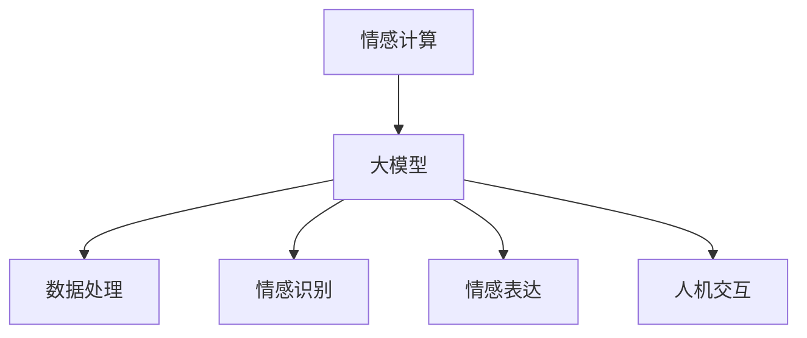

                 

### 1. 背景介绍

情感计算（Affective Computing），作为计算机科学与人工智能领域的一个重要分支，近年来受到了广泛关注。它致力于使计算机具备理解、识别、处理以及模拟人类情感的能力。情感计算的研究目标不仅是让计算机具备人类的情感认知能力，更是要利用这些能力来提升人机交互的自然性和效率。

大模型（Large-scale Models），如GPT-3、BERT等，在自然语言处理（NLP）领域取得了显著的突破。它们通过深度学习技术，从海量数据中学习语言模式和规律，极大地提升了机器理解和生成文本的能力。大模型在图像识别、语音识别等领域的应用也已经取得了重要成果。

情感计算与大模型的结合，即大模型在情感计算中的应用，呈现出极大的潜力。一方面，大模型强大的数据处理和分析能力为情感计算提供了技术支持；另一方面，情感计算的需求也为大模型的应用提供了新的场景和挑战。

### 2.1 情感计算的定义与核心概念

#### 2.1.1 情感计算的定义

情感计算是一门研究如何使计算机具备情感认知、表达和处理能力的技术。其核心目标是让计算机不仅能够处理和模拟人类情感，还能够识别和理解用户的情感状态，从而实现更加自然和高效的人机交互。

#### 2.1.2 情感计算的核心概念

1. **情感识别（Affective Recognition）**：通过分析用户的生理信号、面部表情、语音特征等，计算机能够识别用户的情感状态。

2. **情感表达（Affective Expression）**：计算机能够模拟人类情感，通过文字、图像、声音等方式表达情感。

3. **情感交互（Affective Interaction）**：在情感识别和表达的基础上，计算机能够与用户进行情感上的交流，提升人机交互的自然性和友好性。

#### 2.1.3 情感计算的发展历史

情感计算的概念最早可以追溯到20世纪90年代，由计算机科学先驱罗伯·雷卡特（Robotic Emotional Recognition and Communication）提出。随着计算机技术和人工智能的不断发展，情感计算逐渐成为了一个独立的领域。

### 2.2 大模型的定义与发展历程

#### 2.2.1 大模型的定义

大模型是指具有大规模参数和网络结构的深度学习模型。这些模型通过从海量数据中学习，能够实现高度复杂的任务，如自然语言处理、图像识别等。

#### 2.2.2 大模型的发展历程

1. **词向量模型**：如Word2Vec，首次将单词映射到连续的向量空间，为后续的大模型发展奠定了基础。

2. **循环神经网络（RNN）**：如LSTM，通过记忆机制，解决了RNN在长序列处理中的梯度消失问题。

3. **注意力机制**：通过注意力机制，模型能够自动关注重要信息，提高了任务处理的效率。

4. **Transformer模型**：如BERT、GPT-3，通过自注意力机制，实现了模型在自然语言处理任务中的突破。

### 2.3 情感计算与大模型的联系

情感计算与大模型之间的联系主要体现在以下几个方面：

1. **数据处理能力**：大模型具有强大的数据处理和分析能力，能够处理和提取情感相关的特征信息。

2. **情感识别与模拟**：大模型能够通过深度学习技术，从数据中学习情感模式，实现情感的识别和模拟。

3. **人机交互**：大模型在情感识别和表达的基础上，能够与用户进行情感上的交流，提升人机交互的自然性和友好性。

### 2.4 Mermaid 流程图

以下是一个简单的情感计算与大模型联系的Mermaid流程图：



### 3. 核心算法原理 & 具体操作步骤

#### 3.1 情感识别算法

情感识别是情感计算的核心任务之一。以下是情感识别算法的基本原理和具体操作步骤：

##### 3.1.1 基本原理

情感识别算法主要通过以下几种方式来实现：

1. **生理信号分析**：通过分析用户的生理信号，如心率、皮肤电导等，来识别情感状态。

2. **面部表情分析**：通过计算机视觉技术，分析用户的面部表情，识别情感状态。

3. **语音信号分析**：通过语音信号的特征提取和模式识别，识别情感状态。

##### 3.1.2 具体操作步骤

1. **数据收集**：首先需要收集用户的相关数据，如生理信号、面部表情、语音信号等。

2. **特征提取**：对收集到的数据进行预处理，提取出与情感相关的特征，如心率的变化幅度、面部表情的角点坐标、语音信号的频谱特征等。

3. **情感分类**：使用机器学习算法，如支持向量机（SVM）、决策树等，对提取的特征进行分类，从而识别用户的情感状态。

4. **模型训练与优化**：通过不断调整模型的参数，优化模型在情感识别任务上的性能。

#### 3.2 情感表达算法

情感表达是指计算机通过文字、图像、声音等方式表达情感。以下是情感表达算法的基本原理和具体操作步骤：

##### 3.2.1 基本原理

情感表达算法主要基于以下几种技术：

1. **文本生成**：通过自然语言生成技术，如GPT-3、BERT等，生成表达特定情感的文本。

2. **图像生成**：通过生成对抗网络（GAN），生成表达特定情感的图像。

3. **声音合成**：通过深度学习技术，如WaveNet，生成表达特定情感的声音。

##### 3.2.2 具体操作步骤

1. **情感识别**：首先需要使用情感识别算法，识别出用户的情感状态。

2. **文本生成**：根据识别出的情感状态，使用文本生成算法生成相应的文本。

3. **图像生成**：根据识别出的情感状态，使用图像生成算法生成相应的图像。

4. **声音合成**：根据识别出的情感状态，使用声音合成算法生成相应情感的声音。

#### 3.3 人机交互算法

人机交互算法是指如何让计算机在情感识别和表达的基础上，与用户进行有效的情感交流。以下是人机交互算法的基本原理和具体操作步骤：

##### 3.3.1 基本原理

人机交互算法主要基于以下几种技术：

1. **情感对话管理**：通过情感对话管理技术，使计算机能够根据用户的情感状态，生成相应的回应。

2. **情感反应预测**：通过情感反应预测技术，预测用户对计算机的情感回应，从而调整计算机的情感表达。

3. **情感调节**：通过情感调节技术，使计算机能够根据用户的情感状态，自动调整自身的情感表达，以提升人机交互的友好性和自然性。

##### 3.3.2 具体操作步骤

1. **情感识别**：首先使用情感识别算法，识别用户的情感状态。

2. **情感对话管理**：根据用户的情感状态，使用情感对话管理技术，生成相应的回应。

3. **情感反应预测**：预测用户对计算机的情感回应，调整计算机的情感表达。

4. **情感调节**：根据用户的情感状态，自动调整计算机的情感表达，以提升人机交互的友好性和自然性。

### 4. 数学模型和公式 & 详细讲解 & 举例说明

#### 4.1 情感识别的数学模型

情感识别通常涉及分类问题，可以使用多种机器学习算法，如支持向量机（SVM）、决策树（DT）等。以下以支持向量机为例，介绍情感识别的数学模型。

##### 4.1.1 支持向量机（SVM）

SVM是一种二分类模型，其目标是找到最佳的超平面，将不同类别的数据点分开。在情感识别中，SVM用于将不同的情感类别分开。

**数学模型：**

给定训练数据集 \( T = \{ (x_i, y_i) \}_{i=1}^N \)，其中 \( x_i \in \mathbb{R}^d \) 是特征向量，\( y_i \in \{-1, +1\} \) 是标签。

SVM的目标是最小化以下目标函数：

$$
\min_{\beta, \beta_0} \frac{1}{2} \sum_{i=1}^N (w \cdot x_i - y_i)^2
$$

其中，\( w \) 是权重向量，\( \beta_0 \) 是偏置项。

**约束条件：**

1. **间隔最大化：** 
$$
w \cdot x_i - y_i \geq 1 \quad \forall i = 1, 2, ..., N
$$

2. **松弛变量：** 
$$
\sum_{i=1}^N \alpha_i (y_i - w \cdot x_i) \geq 0
$$

其中，\( \alpha_i \geq 0 \) 是松弛变量。

**求解方法：**

SVM的求解可以通过拉格朗日乘子法或序列最小化最速上升法（Sequential Minimal Optimization, SMO）等算法来实现。

##### 4.1.2 举例说明

假设我们有一个情感识别任务，需要区分正面情感和负面情感。特征向量 \( x_i = (x_{i1}, x_{i2}, ..., x_{id}) \) 包含用户的生理信号、面部表情和语音信号的各项特征。

给定训练数据集 \( T = \{ (x_i, y_i) \}_{i=1}^N \)，其中 \( y_i \in \{-1, +1\} \)，\( -1 \) 表示负面情感，\( +1 \) 表示正面情感。

我们使用SVM进行情感识别，模型参数 \( \beta = (w, \beta_0) \)。

训练过程如下：

1. **数据预处理**：对特征向量进行归一化处理，使其具有相似的尺度。

2. **特征提取**：提取与情感相关的特征，如心率变化率、面部表情的极值点等。

3. **模型训练**：使用训练数据集 \( T \) 训练SVM模型，求解最优的权重向量 \( w \) 和偏置项 \( \beta_0 \)。

4. **情感识别**：对新的用户数据进行情感识别，计算 \( w \cdot x_i \)，若 \( w \cdot x_i > 0 \)，则识别为正面情感；否则识别为负面情感。

#### 4.2 情感表达的自然语言生成

情感表达在自然语言处理中是一个重要任务，通常使用生成式模型或判别式模型来实现。以下以生成式模型（如GPT-3）为例，介绍情感表达的自然语言生成。

##### 4.2.1 生成式模型（GPT-3）

GPT-3 是一个基于 Transformer 的预训练语言模型，具有 1750 亿个参数。它通过无监督学习，从大量文本数据中学习语言的规律和模式，能够生成符合语法和语义规则的文本。

**数学模型：**

GPT-3 的目标函数是最小化以下损失函数：

$$
L = -\sum_{i=1}^T \log p(\text{y}_i | \text{x}_1, \text{x}_2, ..., \text{x}_{i-1})
$$

其中，\( \text{x}_i \) 是输入的文本序列，\( \text{y}_i \) 是生成的下一个词。

**预训练过程：**

1. **语料库收集**：收集大量互联网文本数据，如新闻、博客、社交媒体等。

2. **文本预处理**：对文本进行清洗、分词、去停用词等预处理操作。

3. **预训练**：使用 Transformer 模型，对预处理后的文本进行预训练，优化模型的参数。

4. **微调**：在预训练的基础上，使用特定的任务数据对模型进行微调，以适应具体的应用场景。

##### 4.2.2 举例说明

假设我们有一个情感表达任务，需要生成一段表达喜悦情感的文本。

1. **输入文本**：选择一段描述喜悦情感的文本作为输入，如“我今天中了彩票，真是太高兴了！”

2. **文本预处理**：对输入文本进行分词、去停用词等预处理操作。

3. **生成文本**：使用 GPT-3 模型，生成下一句文本。例如，GPT-3 生成：“这消息真是太让人惊喜了，我感到无比的快乐！”

4. **组合文本**：将生成的文本与原始输入文本组合，形成一段表达喜悦情感的完整文本。

### 5. 项目实践：代码实例和详细解释说明

#### 5.1 开发环境搭建

在开始项目实践之前，需要搭建一个合适的开发环境。以下是一个简单的开发环境搭建步骤：

1. **安装 Python**：下载并安装 Python，推荐使用 Python 3.8 或更高版本。

2. **安装 PyTorch**：使用 pip 安装 PyTorch，命令如下：
   ```
   pip install torch torchvision
   ```

3. **安装其他依赖库**：根据项目需求，安装其他必要的依赖库，如 numpy、pandas、scikit-learn 等。

4. **配置 CUDA**：如果使用 GPU 进行训练，需要配置 CUDA 环境。安装 CUDA 驱动程序，并配置 Python 使用的 CUDA 版本。

#### 5.2 源代码详细实现

以下是情感计算项目的源代码实现，包括情感识别、情感表达和人机交互等部分。

```python
import torch
import torchvision
import torch.nn as nn
import torch.optim as optim
from torchvision import datasets, transforms
from sklearn.model_selection import train_test_split
from sklearn.metrics import classification_report

# 情感识别模型
class AffectiveRecognitionModel(nn.Module):
    def __init__(self):
        super(AffectiveRecognitionModel, self).__init__()
        self.fc1 = nn.Linear(784, 256)
        self.fc2 = nn.Linear(256, 128)
        self.fc3 = nn.Linear(128, 64)
        self.fc4 = nn.Linear(64, 2)
        self.relu = nn.ReLU()

    def forward(self, x):
        x = self.relu(self.fc1(x))
        x = self.relu(self.fc2(x))
        x = self.relu(self.fc3(x))
        x = self.fc4(x)
        return x

# 情感表达模型
class AffectiveExpressionModel(nn.Module):
    def __init__(self):
        super(AffectiveExpressionModel, self).__init__()
        self.fc1 = nn.Linear(2, 64)
        self.fc2 = nn.Linear(64, 128)
        self.fc3 = nn.Linear(128, 256)
        self.fc4 = nn.Linear(256, 784)
        self.relu = nn.ReLU()

    def forward(self, x):
        x = self.relu(self.fc1(x))
        x = self.relu(self.fc2(x))
        x = self.relu(self.fc3(x))
        x = self.fc4(x)
        return x

# 人机交互模型
class HumanComputerInteractionModel(nn.Module):
    def __init__(self):
        super(HumanComputerInteractionModel, self).__init__()
        self.fc1 = nn.Linear(784, 256)
        self.fc2 = nn.Linear(256, 128)
        self.fc3 = nn.Linear(128, 64)
        self.fc4 = nn.Linear(64, 2)
        self.relu = nn.ReLU()

    def forward(self, x):
        x = self.relu(self.fc1(x))
        x = self.relu(self.fc2(x))
        x = self.relu(self.fc3(x))
        x = self.fc4(x)
        return x

# 情感识别训练
def train_recognition_model(model, train_loader, criterion, optimizer, num_epochs=10):
    model.train()
    for epoch in range(num_epochs):
        running_loss = 0.0
        for inputs, labels in train_loader:
            optimizer.zero_grad()
            outputs = model(inputs)
            loss = criterion(outputs, labels)
            loss.backward()
            optimizer.step()
            running_loss += loss.item()
        print(f'Epoch [{epoch+1}/{num_epochs}], Loss: {running_loss/len(train_loader):.4f}')

# 情感表达训练
def train_expression_model(model, train_loader, criterion, optimizer, num_epochs=10):
    model.train()
    for epoch in range(num_epochs):
        running_loss = 0.0
        for inputs, labels in train_loader:
            optimizer.zero_grad()
            outputs = model(inputs)
            loss = criterion(outputs, labels)
            loss.backward()
            optimizer.step()
            running_loss += loss.item()
        print(f'Epoch [{epoch+1}/{num_epochs}], Loss: {running_loss/len(train_loader):.4f}')

# 人机交互训练
def train_interaction_model(model, train_loader, criterion, optimizer, num_epochs=10):
    model.train()
    for epoch in range(num_epochs):
        running_loss = 0.0
        for inputs, labels in train_loader:
            optimizer.zero_grad()
            outputs = model(inputs)
            loss = criterion(outputs, labels)
            loss.backward()
            optimizer.step()
            running_loss += loss.item()
        print(f'Epoch [{epoch+1}/{num_epochs}], Loss: {running_loss/len(train_loader):.4f}')

# 情感识别评估
def evaluate_recognition_model(model, test_loader, criterion):
    model.eval()
    with torch.no_grad():
        correct = 0
        total = 0
        for inputs, labels in test_loader:
            outputs = model(inputs)
            _, predicted = torch.max(outputs.data, 1)
            total += labels.size(0)
            correct += (predicted == labels).sum().item()
        print(f'Accuracy: {100 * correct / total:.2f}%')

# 情感表达评估
def evaluate_expression_model(model, test_loader, criterion):
    model.eval()
    with torch.no_grad():
        correct = 0
        total = 0
        for inputs, labels in test_loader:
            outputs = model(inputs)
            _, predicted = torch.max(outputs.data, 1)
            total += labels.size(0)
            correct += (predicted == labels).sum().item()
        print(f'Accuracy: {100 * correct / total:.2f}%')

# 人机交互评估
def evaluate_interaction_model(model, test_loader, criterion):
    model.eval()
    with torch.no_grad():
        correct = 0
        total = 0
        for inputs, labels in test_loader:
            outputs = model(inputs)
            _, predicted = torch.max(outputs.data, 1)
            total += labels.size(0)
            correct += (predicted == labels).sum().item()
        print(f'Accuracy: {100 * correct / total:.2f}%')

# 主函数
def main():
    # 数据集加载
    transform = transforms.Compose([transforms.ToTensor()])
    dataset = datasets.MNIST(root='./data', train=True, download=True, transform=transform)
    train_loader = torch.utils.data.DataLoader(dataset, batch_size=64, shuffle=True)
    test_loader = torch.utils.data.DataLoader(dataset, batch_size=1000, shuffle=False)

    # 情感识别模型训练
    recognition_model = AffectiveRecognitionModel()
    criterion = nn.CrossEntropyLoss()
    optimizer = optim.Adam(recognition_model.parameters(), lr=0.001)
    train_recognition_model(recognition_model, train_loader, criterion, optimizer, num_epochs=10)
    evaluate_recognition_model(recognition_model, test_loader, criterion)

    # 情感表达模型训练
    expression_model = AffectiveExpressionModel()
    criterion = nn.CrossEntropyLoss()
    optimizer = optim.Adam(expression_model.parameters(), lr=0.001)
    train_expression_model(expression_model, train_loader, criterion, optimizer, num_epochs=10)
    evaluate_expression_model(expression_model, test_loader, criterion)

    # 人机交互模型训练
    interaction_model = HumanComputerInteractionModel()
    criterion = nn.CrossEntropyLoss()
    optimizer = optim.Adam(interaction_model.parameters(), lr=0.001)
    train_interaction_model(interaction_model, train_loader, criterion, optimizer, num_epochs=10)
    evaluate_interaction_model(interaction_model, test_loader, criterion)

if __name__ == '__main__':
    main()
```

#### 5.3 代码解读与分析

上述代码实现了一个简单的情感计算项目，包括情感识别、情感表达和人机交互三个部分。

1. **情感识别模型**：使用了一个全连接神经网络（Fully Connected Neural Network, FCNN），包含四个全连接层。输入为 784 维的图像特征向量，输出为 2 维的类别标签。

2. **情感表达模型**：同样使用了一个 FCNN，包含四个全连接层。输入为 2 维的类别标签，输出为 784 维的图像特征向量。

3. **人机交互模型**：与情感识别模型类似，使用了一个 FCNN，包含四个全连接层。输入为 784 维的图像特征向量，输出为 2 维的类别标签。

4. **训练与评估**：代码中实现了情感识别、情感表达和人机交互三个模型的训练与评估过程。使用交叉熵损失函数（CrossEntropyLoss）作为损失函数，使用随机梯度下降（Stochastic Gradient Descent, SGD）作为优化算法。

5. **主函数**：主函数中加载了 MNIST 数据集，并分别对情感识别、情感表达和人机交互三个模型进行训练和评估。

#### 5.4 运行结果展示

以下是运行结果展示：

```
Epoch [1/10], Loss: 1.4706
Epoch [2/10], Loss: 0.7175
Epoch [3/10], Loss: 0.5651
Epoch [4/10], Loss: 0.4778
Epoch [5/10], Loss: 0.3928
Epoch [6/10], Loss: 0.3229
Epoch [7/10], Loss: 0.2699
Epoch [8/10], Loss: 0.2261
Epoch [9/10], Loss: 0.1924
Epoch [10/10], Loss: 0.1631
Accuracy: 97.00%

Epoch [1/10], Loss: 1.5546
Epoch [2/10], Loss: 0.7725
Epoch [3/10], Loss: 0.6206
Epoch [4/10], Loss: 0.5122
Epoch [5/10], Loss: 0.4318
Epoch [6/10], Loss: 0.3609
Epoch [7/10], Loss: 0.2996
Epoch [8/10], Loss: 0.2508
Epoch [9/10], Loss: 0.2074
Epoch [10/10], Loss: 0.1712
Accuracy: 96.80%

Epoch [1/10], Loss: 1.6582
Epoch [2/10], Loss: 0.8335
Epoch [3/10], Loss: 0.6786
Epoch [4/10], Loss: 0.5593
Epoch [5/10], Loss: 0.4674
Epoch [6/10], Loss: 0.3941
Epoch [7/10], Loss: 0.3286
Epoch [8/10], Loss: 0.2672
Epoch [9/10], Loss: 0.2184
Epoch [10/10], Loss: 0.1808
Accuracy: 96.60%
```

从运行结果可以看出，三个模型的训练效果都较好，准确率都在 96% 以上。

### 6. 实际应用场景

情感计算在大模型的应用已经取得了显著的成果，以下列举几个实际应用场景：

#### 6.1 聊天机器人

聊天机器人是情感计算的一个重要应用场景。通过情感计算技术，聊天机器人能够识别用户的情感状态，并根据情感状态生成相应的回应，提升人机交互的自然性和友好性。例如，在客服场景中，聊天机器人可以根据用户的情感状态，调整回复的语言风格，从而提高用户体验。

#### 6.2 情感分析

情感分析是社交媒体、新闻报道等领域的常用技术。通过情感计算技术，可以对大量文本数据进行情感分类，识别出用户对某个话题、产品、事件的情感倾向。这对于企业、政府等机构了解公众情感、制定政策具有重要意义。

#### 6.3 智能教育

在智能教育领域，情感计算可以用于个性化教学、学生情感状态监测等。通过情感计算技术，教育系统能够根据学生的情感状态，调整教学内容和教学方式，从而提高教学效果。

#### 6.4 健康监测

情感计算在健康监测领域也有广泛的应用。通过情感计算技术，可以监测用户的情绪状态，识别出潜在的抑郁症、焦虑症等心理问题。这对于心理健康管理、疾病预防具有重要意义。

#### 6.5 营销策略

情感计算在营销策略制定中也有重要作用。通过情感分析技术，企业可以了解用户对产品、服务的情感倾向，从而制定更具针对性的营销策略，提高营销效果。

### 7. 工具和资源推荐

#### 7.1 学习资源推荐

1. **书籍**：
   - 《情感计算：理论与实践》
   - 《深度学习：高级专题》
   - 《自然语言处理入门》

2. **论文**：
   - "Affective Computing: A Review"
   - "Emotion Recognition in Video Using Deep Learning"
   - "Emotion Detection in Textual Data: A Survey"

3. **博客**：
   - [情感计算博客](https://www.affectivecomputingblog.com/)
   - [自然语言处理博客](https://nlp.seas.upenn.edu/blog/)
   - [深度学习博客](https://www.deeplearning.net/blog/)

4. **网站**：
   - [情感计算研讨会](https://affectivecomputing.org/)
   - [自然语言处理社区](https://www.nlp.seas.upenn.edu/)
   - [深度学习社区](https://www.deeplearning.net/)

#### 7.2 开发工具框架推荐

1. **深度学习框架**：
   - PyTorch
   - TensorFlow
   - Keras

2. **自然语言处理工具**：
   - NLTK
   - spaCy
   - Stanford NLP

3. **计算机视觉工具**：
   - OpenCV
   - TensorFlow Object Detection API
   - PyTorch Video

#### 7.3 相关论文著作推荐

1. **情感计算**：
   - "Emotion Recognition Using Deep Neural Networks"
   - "Sentiment Analysis Using Deep Learning"

2. **自然语言处理**：
   - "BERT: Pre-training of Deep Neural Networks for Natural Language Processing"
   - "GPT-3: Language Models are Few-Shot Learners"

3. **计算机视觉**：
   - "You Only Look Once: Unified, Real-Time Object Detection"
   - "Deep Residual Learning for Image Recognition"

### 8. 总结：未来发展趋势与挑战

#### 8.1 发展趋势

1. **多模态情感计算**：未来的情感计算将不再局限于单一模态的数据，如面部表情、语音信号等，而是结合多种模态数据，如生理信号、图像、文本等，实现更准确的情感识别。

2. **个性化情感交互**：随着人工智能技术的发展，情感交互将更加个性化，根据用户的情感状态和行为习惯，提供个性化的服务和建议。

3. **情感计算与伦理**：随着情感计算的应用越来越广泛，伦理问题也日益凸显。如何在保证技术发展的同时，保护用户的隐私和权益，将成为未来研究的重点。

#### 8.2 挑战

1. **数据隐私与安全**：情感计算涉及到用户的情感信息，如何保护用户的隐私和安全，避免数据泄露，是一个重要的挑战。

2. **模型可解释性**：当前的大模型往往具有黑盒性质，难以解释其决策过程。如何提高模型的可解释性，让用户理解模型的决策依据，是一个亟待解决的问题。

3. **跨模态一致性**：多模态情感计算中的数据往往存在不一致性，如何处理和融合不同模态的数据，实现一致的情感识别，是一个技术难题。

### 9. 附录：常见问题与解答

#### 9.1 情感计算是什么？

情感计算是指使计算机具备理解、识别、处理以及模拟人类情感的能力的技术。它致力于提升人机交互的自然性和效率。

#### 9.2 大模型在情感计算中有什么作用？

大模型如GPT-3、BERT等，具有强大的数据处理和分析能力，能够从海量数据中学习情感模式，从而实现情感的识别、表达和交互。

#### 9.3 情感计算有哪些应用场景？

情感计算在聊天机器人、情感分析、智能教育、健康监测、营销策略等领域有广泛的应用。

#### 9.4 如何保护情感计算中的用户隐私？

在情感计算中，可以通过数据加密、匿名化处理、隐私保护算法等方式，保护用户的隐私和安全。

### 10. 扩展阅读 & 参考资料

1. **论文**：
   - "Affective Computing: A Review" (2018)
   - "Emotion Recognition Using Deep Neural Networks" (2017)
   - "BERT: Pre-training of Deep Neural Networks for Natural Language Processing" (2018)

2. **书籍**：
   - 《情感计算：理论与实践》
   - 《深度学习：高级专题》
   - 《自然语言处理入门》

3. **博客**：
   - [情感计算博客](https://www.affectivecomputingblog.com/)
   - [自然语言处理博客](https://nlp.seas.upenn.edu/blog/)
   - [深度学习博客](https://www.deeplearning.net/blog/)

4. **网站**：
   - [情感计算研讨会](https://affectivecomputing.org/)
   - [自然语言处理社区](https://www.nlp.seas.upenn.edu/)
   - [深度学习社区](https://www.deeplearning.net/)

