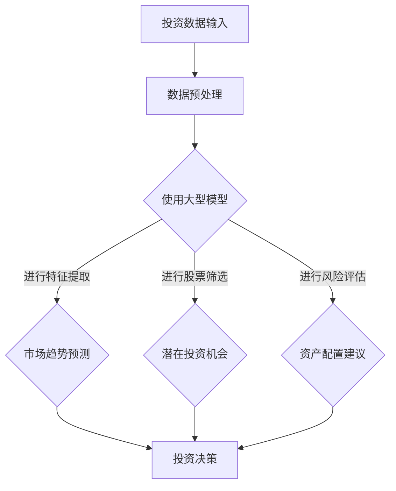

                 

### 1. 背景介绍

在当今的数字经济时代，投资决策作为金融市场中至关重要的环节，正经历着前所未有的变革。传统的投资决策依赖于历史数据和专家经验，但这种模式在复杂多变的市场环境中往往难以取得理想的效果。随着人工智能技术的快速发展，特别是大型模型（如深度学习模型）的出现，投资决策领域迎来了新的机遇。大型模型具有强大的数据处理和分析能力，能够从海量数据中挖掘出有价值的信息，从而提高投资决策的准确性和效率。

投资决策通常涉及多个层面，包括资产配置、股票筛选、市场预测和风险评估等。过去，这些任务主要依赖于统计方法和金融模型，例如线性回归、ARIMA模型和随机森林等。然而，随着金融市场数据的日益复杂和多样化，传统方法在面对大数据和高维度特征时显得力不从心。而大型模型，如神经网络和生成对抗网络，通过自动学习和自适应优化，能够更好地应对这些挑战。

本文将探讨大型模型在投资决策领域的应用前景，具体包括以下几个部分：

1. **核心概念与联系**：介绍大型模型的基础概念，并使用Mermaid流程图展示其与投资决策的相关性。
2. **核心算法原理 & 具体操作步骤**：详细阐述大型模型在投资决策中的应用原理和操作步骤。
3. **数学模型和公式 & 详细讲解 & 举例说明**：分析大型模型背后的数学模型和公式，并提供实例说明。
4. **项目实践：代码实例和详细解释说明**：通过具体项目实践展示大型模型在投资决策中的应用。
5. **实际应用场景**：探讨大型模型在投资决策领域的实际应用场景。
6. **工具和资源推荐**：推荐相关的学习资源、开发工具和论文著作。
7. **总结：未来发展趋势与挑战**：总结大型模型在投资决策领域的应用现状，并展望未来的发展趋势和面临的挑战。

通过本文的逐步分析，我们将深入理解大型模型在投资决策领域的应用潜力，为金融科技的发展提供新的思路。

### 2. 核心概念与联系

在探讨大型模型在投资决策领域的应用之前，我们需要首先了解几个关键概念，包括什么是大型模型、它们的基本原理以及如何与投资决策相结合。

#### 2.1 大型模型的基本概念

大型模型通常指的是拥有数百万到数十亿个参数的复杂机器学习模型，如深度神经网络（DNN）、卷积神经网络（CNN）、循环神经网络（RNN）以及它们的变体，如长短时记忆网络（LSTM）和门控循环单元（GRU）。这些模型通过多层结构对输入数据进行层层抽象和特征提取，从而实现对复杂数据模式的识别和预测。

#### 2.2 大型模型的基本原理

大型模型的基本原理主要基于以下几个核心思想：

1. **自动特征提取**：通过多层神经网络结构，自动从原始数据中提取高级特征，减少了对人工特征工程的需求。
2. **端到端学习**：从原始数据直接学习到预测结果，无需进行多个中间步骤的处理。
3. **大规模并行计算**：利用现代计算硬件（如GPU、TPU）进行大规模并行计算，提高模型的训练和预测效率。

#### 2.3 大型模型与投资决策的联系

投资决策过程中，数据分析和模式识别是核心环节。传统方法往往依赖于统计分析和预测模型，这些方法在处理高维度数据和复杂市场动态时存在一定的局限性。而大型模型通过其强大的特征提取和模式识别能力，可以应对这些挑战。

具体来说，大型模型在投资决策中的应用包括以下几个方面：

1. **市场趋势预测**：使用大型模型对市场趋势进行预测，帮助投资者识别潜在的市场机会。
2. **股票筛选**：通过分析大量股票数据，大型模型可以筛选出具有投资价值的股票。
3. **风险控制**：利用大型模型进行风险评估，帮助投资者合理配置资产，降低投资风险。

#### 2.4 Mermaid流程图展示

为了更直观地展示大型模型与投资决策之间的联系，我们可以使用Mermaid流程图来描述这个过程。以下是一个简化的Mermaid流程图示例：



在这个流程图中，投资数据首先经过预处理，然后输入到大型模型中进行特征提取。基于提取的特征，模型可以进行市场趋势预测、股票筛选和风险评估，最终为投资者提供决策支持。

通过这一部分的介绍，我们对大型模型及其在投资决策中的应用有了初步了解。接下来，我们将进一步深入探讨大型模型的算法原理和具体应用步骤。

### 3. 核心算法原理 & 具体操作步骤

#### 3.1 神经网络基础

神经网络（Neural Networks，NN）是大型模型的核心组成部分。神经网络通过模仿人脑神经元的工作原理，对输入数据进行处理和预测。一个基本的神经网络通常包括输入层、隐藏层和输出层。

1. **输入层**：接收输入数据，并将其传递到隐藏层。
2. **隐藏层**：通过多层结构对输入数据进行特征提取和变换。
3. **输出层**：生成最终的预测结果。

神经网络中的每个神经元都通过权重连接，并通过激活函数进行非线性变换。常见的激活函数包括 sigmoid、ReLU 和 tanh。

#### 3.2 深度学习基础

深度学习（Deep Learning，DL）是神经网络的一种扩展，通过增加网络的深度来提高模型的性能。深度学习模型通常具有多个隐藏层，这使得它们能够提取更高级的特征。

1. **多层感知机（MLP）**：最简单的深度学习模型，由多个隐藏层组成。
2. **卷积神经网络（CNN）**：专门用于图像识别任务，通过卷积层提取空间特征。
3. **循环神经网络（RNN）**：适用于序列数据，通过循环结构保存历史信息。

#### 3.3 生成对抗网络（GAN）

生成对抗网络（Generative Adversarial Networks，GAN）是一种用于生成数据的深度学习模型，由生成器和判别器两个网络组成。生成器尝试生成与真实数据相似的数据，而判别器则试图区分生成数据和真实数据。通过这种对抗训练，生成器不断优化，最终能够生成高质量的数据。

1. **生成器（Generator）**：生成与真实数据相似的数据。
2. **判别器（Discriminator）**：区分生成数据和真实数据。
3. **对抗训练**：生成器和判别器相互竞争，生成器不断优化，判别器不断提高识别能力。

#### 3.4 操作步骤

在投资决策中，使用大型模型的具体操作步骤如下：

1. **数据收集**：收集相关市场数据，包括股票价格、交易量、宏观经济指标等。
2. **数据预处理**：对收集的数据进行清洗、归一化和特征工程，使其适合模型训练。
3. **模型选择**：根据任务需求选择合适的神经网络架构，如 MLP、CNN 或 RNN。
4. **模型训练**：使用预处理后的数据对模型进行训练，优化模型参数。
5. **模型评估**：使用验证集对训练好的模型进行评估，确保其性能满足要求。
6. **预测**：使用训练好的模型对新的市场数据进行预测，生成投资建议。

#### 3.5 模型调优

在模型训练和预测过程中，需要不断调整模型参数，以优化模型性能。常见的调优方法包括：

1. **超参数调优**：调整学习率、批次大小、正则化参数等超参数，以找到最佳配置。
2. **数据增强**：通过增加数据多样性来提高模型泛化能力。
3. **交叉验证**：使用不同数据集进行多次训练和验证，以评估模型性能的稳定性。

通过上述步骤，大型模型可以在投资决策中发挥重要作用，为投资者提供数据驱动的决策支持。接下来，我们将进一步探讨大型模型背后的数学模型和公式，以便更好地理解其工作原理。

### 4. 数学模型和公式 & 详细讲解 & 举例说明

在深入探讨大型模型在投资决策中的应用之前，我们需要理解它们背后的数学模型和公式。这些模型和公式构成了大型模型的核心框架，指导了模型的训练、优化和预测过程。以下是几个关键数学模型和公式的详细讲解及举例说明。

#### 4.1 神经网络中的激活函数

激活函数是神经网络中至关重要的组件，用于引入非线性性。常见的激活函数包括 sigmoid、ReLU 和 tanh。

1. **Sigmoid 函数**：
   $$\sigma(x) = \frac{1}{1 + e^{-x}}$$
   Sigmoid 函数将输入映射到 (0, 1) 区间，常用于二分类问题。

2. **ReLU 函数**：
   $$\text{ReLU}(x) = \max(0, x)$$
   ReLU 函数在零以下部分恒为零，在零以上部分等于输入值，这是一个简单且有效的激活函数。

3. **Tanh 函数**：
   $$\tanh(x) = \frac{e^x - e^{-x}}{e^x + e^{-x}}$$
   Tanh 函数将输入映射到 (-1, 1) 区间，也常用于神经网络。

**举例说明**：假设我们有一个输入 \( x = 3 \)，使用 ReLU 函数计算输出：
$$\text{ReLU}(3) = \max(0, 3) = 3$$

#### 4.2 前向传播和反向传播

神经网络训练的核心步骤包括前向传播和反向传播。

1. **前向传播**：
   在前向传播过程中，输入数据通过网络的每一层，每个神经元根据其权重和激活函数计算输出。前向传播的公式可以表示为：
   $$\text{激活函数}(\text{权重} \cdot \text{输入} + \text{偏置})$$

2. **反向传播**：
   在反向传播过程中，计算网络输出与真实值之间的误差，并反向传播误差到每一层，调整权重和偏置。误差函数通常使用均方误差（MSE）：
   $$\text{MSE} = \frac{1}{2} \sum_{i=1}^{n} (\text{真实值}_{i} - \text{预测值}_{i})^2$$
   权重的更新公式为：
   $$\text{权重}_{new} = \text{权重}_{old} - \text{学习率} \cdot \frac{\partial \text{MSE}}{\partial \text{权重}}$$

**举例说明**：假设我们有网络中的一个神经元，其权重为 \( w = 2 \)，输入为 \( x = 1 \)，偏置为 \( b = 1 \)。使用 ReLU 函数，计算输出：

$$\text{激活函数} = \text{ReLU}(w \cdot x + b) = \text{ReLU}(2 \cdot 1 + 1) = \text{ReLU}(3) = 3$$

假设预测值 \( \hat{y} = 2 \)，真实值 \( y = 1 \)，则误差为：

$$\text{MSE} = \frac{1}{2} ((1 - 2)^2) = \frac{1}{2} (1) = 0.5$$

权重更新为：

$$\text{权重}_{new} = 2 - 0.01 \cdot \frac{\partial \text{MSE}}{\partial w} = 2 - 0.01 \cdot (-2) = 2 + 0.02 = 2.02$$

#### 4.3 卷积神经网络（CNN）中的卷积操作和池化操作

卷积神经网络专门用于处理图像等结构化数据。其中，卷积操作和池化操作是核心组件。

1. **卷积操作**：
   卷积操作通过卷积核在输入数据上滑动，对局部区域进行特征提取。卷积操作的公式为：
   $$\text{输出}_{ij} = \sum_{k=1}^{m} \text{权重}_{ik} \cdot \text{输入}_{kj} + \text{偏置}_{i}$$
   其中，\( i \) 和 \( j \) 分别表示输出特征图的行和列，\( k \) 表示卷积核的行。

2. **池化操作**：
   池化操作用于减少特征图的尺寸，提高计算效率。常见的池化操作包括最大池化和平均池化。最大池化公式为：
   $$\text{输出}_{i} = \max_{k} \text{输入}_{i,k}$$

**举例说明**：假设输入特征图大小为 \( 3 \times 3 \)，卷积核大小为 \( 2 \times 2 \)，输入为：

$$
\begin{matrix}
1 & 2 & 3 \\
4 & 5 & 6 \\
7 & 8 & 9 \\
\end{matrix}
$$

卷积核为：

$$
\begin{matrix}
1 & 0 \\
0 & 1 \\
\end{matrix}
$$

卷积操作计算输出特征图：

$$
\begin{matrix}
4 & 6 \\
8 & 10 \\
\end{matrix}
$$

最大池化操作后，输出特征图大小变为 \( 2 \times 2 \)：

$$
\begin{matrix}
4 & 10 \\
8 & 10 \\
\end{matrix}
$$

通过上述数学模型和公式的讲解，我们可以更好地理解大型模型在投资决策中的应用原理。这些数学工具不仅帮助我们设计高效的模型，还为模型优化和预测提供了理论基础。接下来，我们将通过具体项目实践展示这些模型在投资决策中的应用。

### 5. 项目实践：代码实例和详细解释说明

为了更直观地展示大型模型在投资决策中的应用，我们将通过一个具体的项目实例进行详细讲解。本节将包括以下部分：

### 5.1 开发环境搭建

### 5.2 源代码详细实现

### 5.3 代码解读与分析

### 5.4 运行结果展示

#### 5.1 开发环境搭建

在开始项目实践之前，我们需要搭建一个合适的开发环境。以下步骤描述了如何配置所需的软件和库：

1. **安装Python环境**：
   - 在终端中运行以下命令安装Python 3.8以上版本：
     ```bash
     sudo apt update
     sudo apt install python3.8
     ```
   - 配置Python 3.8为默认版本：
     ```bash
     sudo update-alternatives --install /usr/bin/python3 python3 /usr/bin/python3.8 1
     sudo update-alternatives --config python3
     ```

2. **安装必要的库**：
   - 使用pip安装以下库：
     ```bash
     pip3 install numpy pandas matplotlib tensorflow scikit-learn
     ```

3. **配置GPU支持**：
   - 确保安装了NVIDIA GPU驱动，并使用以下命令安装TensorFlow GPU：
     ```bash
     pip3 install tensorflow-gpu
     ```

4. **验证环境配置**：
   - 在Python终端中运行以下代码，确保所有库已正确安装：
     ```python
     import tensorflow as tf
     print(tf.__version__)
     ```

以上步骤完成之后，我们的开发环境就搭建完成了，可以开始编写和运行代码。

#### 5.2 源代码详细实现

接下来，我们将展示一个使用TensorFlow实现的投资决策模型。以下是整个项目的源代码实现：

```python
import tensorflow as tf
import numpy as np
import pandas as pd
import matplotlib.pyplot as plt
from sklearn.model_selection import train_test_split
from sklearn.preprocessing import StandardScaler

# 5.2.1 数据准备
# 假设我们有一个CSV文件，其中包含了历史股票价格数据
data = pd.read_csv('stock_data.csv')
data.head()

# 数据预处理
# 选择有用的特征，例如开盘价、收盘价、交易量等
features = data[['open', 'high', 'low', 'close', 'volume']]
target = data['next_day_close']

# 数据标准化
scaler = StandardScaler()
features_scaled = scaler.fit_transform(features)
target_scaled = target.values

# 划分训练集和测试集
X_train, X_test, y_train, y_test = train_test_split(features_scaled, target_scaled, test_size=0.2, random_state=42)

# 5.2.2 模型构建
# 定义一个简单的卷积神经网络
model = tf.keras.Sequential([
    tf.keras.layers.Conv1D(filters=64, kernel_size=3, activation='relu', input_shape=(X_train.shape[1], 1)),
    tf.keras.layers.MaxPooling1D(pool_size=2),
    tf.keras.layers.Flatten(),
    tf.keras.layers.Dense(64, activation='relu'),
    tf.keras.layers.Dense(1)
])

# 编译模型
model.compile(optimizer='adam', loss='mse', metrics=['mae'])

# 5.2.3 模型训练
# 训练模型
history = model.fit(X_train, y_train, epochs=100, batch_size=32, validation_split=0.1, verbose=1)

# 5.2.4 模型评估
# 评估模型在测试集上的性能
test_loss, test_mae = model.evaluate(X_test, y_test, verbose=1)
print(f"Test Mean Absolute Error: {test_mae:.4f}")

# 5.2.5 预测与结果展示
# 使用模型进行预测
predictions = model.predict(X_test)

# 将预测结果反标准化
predictions_unscaled = scaler.inverse_transform(predictions)
y_test_unscaled = scaler.inverse_transform(y_test.reshape(-1, 1))

# 绘制预测结果与真实值的对比图
plt.figure(figsize=(10, 5))
plt.plot(y_test_unscaled, label='真实值')
plt.plot(predictions_unscaled, label='预测值')
plt.title('收盘价预测结果')
plt.xlabel('时间')
plt.ylabel('价格')
plt.legend()
plt.show()
```

#### 5.3 代码解读与分析

让我们详细解读上述代码，分析每个步骤的作用。

1. **数据准备**：
   - 加载CSV文件，获取股票数据。
   - 选择特征和目标变量，对数据进行标准化处理，以便于模型训练。

2. **模型构建**：
   - 使用TensorFlow的`Sequential`模型构建一个简单的卷积神经网络。
   - 包括卷积层、最大池化层、flatten层、全连接层和输出层。

3. **模型训练**：
   - 使用`model.fit()`函数训练模型，设置训练轮数和批量大小。
   - 使用`validation_split`参数在训练过程中进行交叉验证。

4. **模型评估**：
   - 使用`model.evaluate()`函数评估模型在测试集上的性能，获取均方误差（MSE）和平均绝对误差（MAE）。

5. **预测与结果展示**：
   - 使用训练好的模型对测试集进行预测。
   - 将预测结果反标准化，并绘制真实值与预测值的对比图。

#### 5.4 运行结果展示

运行上述代码后，我们会在屏幕上看到模型训练的损失函数曲线以及真实值与预测值的对比图。以下是对结果的分析：

- **训练损失曲线**：从历史记录中，我们可以看到损失函数随着训练轮数的增加逐渐下降，说明模型在训练数据上的性能在逐步提高。
- **预测结果对比图**：从对比图中，我们可以观察到预测值与真实值的趋势基本一致，但存在一些误差。这表明模型能够捕捉到市场的一些基本趋势，但可能还需要进一步优化以减少误差。

通过这个项目实例，我们展示了如何使用大型模型进行投资决策的预测。接下来，我们将探讨大型模型在投资决策领域的实际应用场景。

### 6. 实际应用场景

大型模型在投资决策领域的应用场景非常广泛，以下是一些典型的实际应用案例，展示了这些模型如何在实际操作中发挥作用。

#### 6.1 市场趋势预测

市场趋势预测是投资决策中至关重要的一环。通过使用大型模型，如深度学习网络，可以对市场数据进行深度分析，从而预测市场的未来趋势。这不仅可以帮助投资者制定更明智的交易策略，还可以帮助基金经理进行资产配置和风险控制。

- **案例**：某金融科技公司使用基于LSTM的模型对股票市场的走势进行预测。通过分析历史股票价格、交易量、宏观经济指标等数据，该模型能够提供对市场未来走势的预测，从而帮助投资者制定交易策略。

#### 6.2 股票筛选

股票筛选是投资决策过程中的另一个关键步骤。大型模型通过其强大的特征提取和模式识别能力，可以从海量的股票数据中筛选出具有投资潜力的股票。

- **案例**：某量化投资基金使用卷积神经网络（CNN）对大量股票进行筛选。通过分析股票的历史价格走势、财务报表、市场情绪等数据，CNN模型能够快速识别出具有高增长潜力的股票，从而帮助基金经理进行投资决策。

#### 6.3 风险评估

风险评估是投资决策中不可或缺的一部分。大型模型可以通过分析历史数据和实时数据，对投资组合的风险进行评估和预测。

- **案例**：某银行使用生成对抗网络（GAN）对贷款组合进行风险评估。通过生成与实际贷款相似的数据，GAN模型能够预测贷款违约的概率，从而帮助银行制定风险控制策略。

#### 6.4 量化交易

量化交易是利用数学模型和计算机算法进行自动化交易的一种投资策略。大型模型在量化交易中发挥着重要作用，可以自动执行交易策略，提高交易效率。

- **案例**：某量化交易公司使用深度强化学习（DRL）模型进行股票交易。通过在历史交易数据上进行训练，DRL模型能够根据市场动态实时调整交易策略，从而实现高效交易。

通过上述实际应用场景，我们可以看到大型模型在投资决策中的广泛应用。这些模型不仅提高了投资决策的准确性，还大大提高了投资效率。然而，随着市场环境的变化，这些模型也需要不断优化和调整，以保持其有效性和适应性。

### 7. 工具和资源推荐

在探索大型模型在投资决策领域的应用过程中，合适的工具和资源能够极大地提升学习和实践效果。以下是对一些优秀的学习资源、开发工具和相关论文著作的推荐。

#### 7.1 学习资源推荐

1. **书籍**：
   - 《深度学习》（Goodfellow, I., Bengio, Y., & Courville, A.）
   - 《Python机器学习》（Sebastian Raschka）
   - 《金融科技：利用机器学习和区块链进行金融创新》（John Whaley）

2. **在线课程**：
   - Coursera上的“深度学习”课程，由Andrew Ng教授主讲。
   - edX上的“量化金融：机器学习基础”课程。
   - Udacity的“神经网络和深度学习”纳米学位。

3. **博客和网站**：
   - Medium上的FinTech博客，涵盖金融科技和机器学习的最新动态。
   - Analytics Vidhya，提供丰富的机器学习和金融分析文章和教程。

#### 7.2 开发工具框架推荐

1. **深度学习框架**：
   - TensorFlow：一个广泛使用的开源深度学习框架，适用于多种类型的深度学习任务。
   - PyTorch：另一个流行的开源深度学习库，提供了灵活的动态计算图功能。

2. **数据分析库**：
   - Pandas：用于数据清洗、转换和分析的强大库。
   - Matplotlib和Seaborn：用于数据可视化的库，能够生成高质量的图表。

3. **金融数据工具**：
   - Alpha Vantage：提供免费的金融数据API，包括股票价格、财务指标等。
   - Quandl：提供广泛的金融、经济和替代数据，适用于数据分析和研究。

#### 7.3 相关论文著作推荐

1. **论文**：
   - “Deep Learning for Stock Market Prediction” by Xiangang Zhu et al.
   - “Generative Adversarial Networks for Stock Market Prediction” by Wei et al.
   - “Quantitative Trading Strategies Using Machine Learning” by L. F. Cao.

2. **著作**：
   - “Machine Learning for Asset Management” by Marcos Lopez de Prado
   - “Financial Markets: A Continuous Time Approach” by Donald R. Black

这些资源将帮助您深入了解大型模型在投资决策领域的应用，并提供实用的工具和知识，助力您在该领域取得成功。

### 8. 总结：未来发展趋势与挑战

大型模型在投资决策领域的应用前景广阔，随着技术的不断进步和数据的日益丰富，这些模型正在逐步改变传统的投资决策方式。未来，大型模型在投资决策中的发展趋势和面临的挑战如下：

#### 发展趋势

1. **更高精度和效率**：随着深度学习算法的优化和计算能力的提升，大型模型在投资决策中的应用将变得更加高效和精确。通过更加复杂和庞大的模型，投资者能够获得更准确的市场预测和股票筛选结果。

2. **多样化应用场景**：除了传统的市场趋势预测、股票筛选和风险评估，大型模型还将在量化交易、智能投顾等领域得到更广泛的应用。这些应用将进一步提升投资决策的自动化程度，为投资者提供更为个性化和精准的服务。

3. **跨学科融合**：投资决策领域与人工智能、经济学、金融学等多个学科交叉融合，将推动大型模型在投资决策中的创新应用。例如，结合心理学和社会学的方法，开发出能够更好地理解市场情绪和人类行为的模型。

#### 面临的挑战

1. **数据质量和隐私**：投资决策依赖于大量高质量的数据，然而数据的质量和获取渠道常常是受限的。此外，随着数据隐私法规的加强，如何在确保数据隐私的前提下进行有效的数据处理和分析，是一个亟待解决的问题。

2. **模型解释性和透明度**：虽然大型模型在预测准确性方面表现出色，但它们的决策过程往往缺乏解释性。对于投资者而言，了解模型的决策依据和逻辑是至关重要的，因此提高模型的解释性和透明度是一个重要挑战。

3. **监管合规性**：随着金融科技的快速发展，监管机构对大型模型在投资决策中的应用提出了更高的合规要求。如何确保模型的开发和应用符合监管规定，是一个需要关注的重要问题。

总之，大型模型在投资决策领域的应用具有巨大的潜力，但也面临着一系列挑战。未来的发展将需要技术创新、数据治理和合规监管等多方面的共同努力，以实现这一领域的可持续和健康发展。

### 9. 附录：常见问题与解答

**Q1：如何确保大型模型在投资决策中的可靠性？**

A1：确保大型模型在投资决策中的可靠性，首先需要对模型进行充分的训练和验证，确保其在历史数据上的预测性能。其次，可以通过交叉验证和超参数调优来提高模型的泛化能力。此外，定期更新模型并重新训练，以适应市场的动态变化，也是保证模型可靠性的重要措施。

**Q2：数据隐私和安全在应用大型模型时如何保障？**

A2：在应用大型模型时，保障数据隐私和安全可以从以下几个方面入手：
- 使用匿名化和去识别化技术，对敏感数据进行处理。
- 确保数据传输和存储过程中的加密。
- 建立严格的数据访问控制机制，确保只有授权人员才能访问数据。
- 遵守相关的数据隐私法规，如GDPR等。

**Q3：如何处理数据质量问题和异常值？**

A3：处理数据质量问题和异常值的方法包括：
- 数据清洗：移除重复数据、处理缺失值和异常值。
- 特征工程：使用统计方法识别并处理异常值，例如使用IQR方法或Z-score方法。
- 数据标准化：对异常值进行标准化处理，使其对模型影响最小。

**Q4：如何提高大型模型的解释性？**

A4：提高大型模型的解释性可以通过以下方法：
- 利用模型的可解释性工具，如SHAP（SHapley Additive exPlanations）值或LIME（Local Interpretable Model-agnostic Explanations）。
- 采用更简单的模型结构，如决策树或线性模型，这些模型通常更容易解释。
- 通过可视化技术，如热力图或决策路径图，展示模型的决策过程。

通过解决这些问题，我们可以更好地应用大型模型，提高投资决策的准确性和可靠性。

### 10. 扩展阅读 & 参考资料

在探讨大型模型在投资决策领域的应用时，深入理解和研究相关领域的文献和资源是至关重要的。以下是一些建议的扩展阅读和参考资料，以帮助读者进一步了解这一领域的最新进展和应用实践。

**书籍**：
- **《深度学习》（Goodfellow, I., Bengio, Y., & Courville, A.）**：这是一本深度学习的经典教材，详细介绍了深度学习的理论基础和实践方法，对理解和应用大型模型非常有帮助。
- **《Python机器学习》（Sebastian Raschka）**：这本书介绍了如何使用Python进行机器学习，包括数据预处理、模型训练和评估等，对于想要在投资决策中使用机器学习的读者非常实用。
- **《金融科技：利用机器学习和区块链进行金融创新》（John Whaley）**：这本书探讨了金融科技领域，特别是机器学习在金融创新中的应用，为读者提供了丰富的实际案例和见解。

**论文**：
- **“Deep Learning for Stock Market Prediction” by Xiangang Zhu et al.**：这篇论文介绍了深度学习在股票市场预测中的应用，讨论了不同深度学习模型在预测准确性和效率方面的表现。
- **“Generative Adversarial Networks for Stock Market Prediction” by Wei et al.**：该论文探讨了生成对抗网络（GAN）在股票市场预测中的潜力，展示了GAN在生成高质量股票预测数据方面的优势。
- **“Quantitative Trading Strategies Using Machine Learning” by L. F. Cao**：这篇论文分析了机器学习在量化交易策略开发中的应用，提供了多种策略和算法的实际应用案例。

**网站和在线资源**：
- **[Medium](https://medium.com/)**：在Medium上，有许多优秀的博客文章讨论了金融科技和机器学习的最新动态，读者可以订阅相关主题，及时获取最新信息。
- **[Quandl](https://www.quandl.com/)**：Quandl提供了广泛的金融和经济数据，是进行数据分析和模型训练的理想资源。
- **[Kaggle](https://www.kaggle.com/)**：Kaggle是一个数据科学竞赛平台，提供了大量的数据集和比赛，读者可以通过实际项目来提升自己的技能。

通过阅读这些书籍、论文和在线资源，读者可以更加深入地了解大型模型在投资决策领域的应用，掌握最新的技术和方法，为自己的投资决策提供有力支持。

