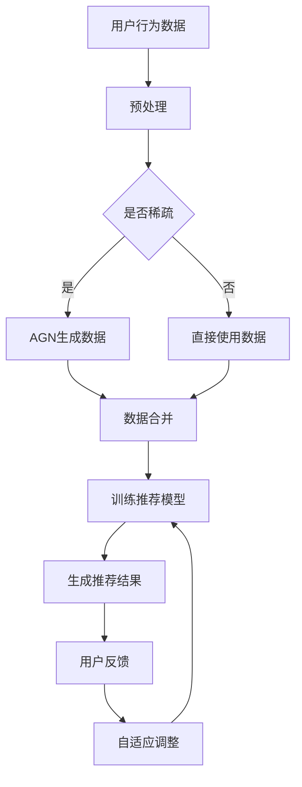

                 

### 1. 背景介绍

推荐系统是现代信息社会中不可或缺的一部分，它广泛应用于电子商务、社交媒体、新闻资讯等多个领域。推荐系统的核心目标是通过分析用户的兴趣和行为模式，为其提供个性化、高度相关的信息，从而提升用户体验和满意度。

随着互联网的普及和数据量的爆炸性增长，推荐系统也面临着前所未有的挑战。传统的基于协同过滤（Collaborative Filtering）和基于内容的推荐（Content-Based Filtering）方法逐渐暴露出一些局限性。协同过滤方法依赖于用户的历史行为数据，但当用户数据稀疏时，其推荐效果往往不佳。而基于内容的方法虽然考虑了用户和项目的内容属性，但往往忽略了用户之间的关联性。

为了解决这些问题，近年来，生成对抗网络（Generative Adversarial Networks, GANs）作为一种新兴的深度学习框架，逐渐引起了研究者的关注。GANs通过生成器和判别器的对抗训练，能够生成高质量的数据，从而在图像生成、文本生成等任务中取得了显著的成果。同时，大模型（Large-scale Models）的发展也为推荐系统的优化提供了强有力的支持。

本文将探讨大模型在推荐系统中的应用，特别是对抗生成网络（Adversarial Generative Networks, AGN）在推荐系统中的实现和效果。通过本文的探讨，我们希望能够为推荐系统领域的研究和实践提供一些新的思路和启示。

### 2. 核心概念与联系

#### 2.1 大模型（Large-scale Models）

大模型是指具有大规模参数和训练数据的深度学习模型。这些模型通过学习海量的数据，能够捕捉到复杂的模式和信息，从而在各个领域取得了显著的成果。在推荐系统中，大模型的优势主要体现在以下几个方面：

1. **处理大规模数据**：大模型能够处理海量用户数据和历史行为，从而提供更精准的推荐结果。
2. **泛化能力**：大模型通过学习大量的数据，能够捕捉到不同用户之间的相似性，从而提高推荐系统的泛化能力。
3. **适应性**：大模型能够根据用户实时反馈进行调整，从而提高推荐系统的适应性。

#### 2.2 对抗生成网络（Adversarial Generative Networks, AGN）

对抗生成网络（AGN）是一种基于生成对抗网络（GAN）的改进框架，旨在生成高质量的数据。在推荐系统中，AGN可以用于生成用户隐式反馈数据，从而补充协同过滤方法中数据稀疏的问题。

GAN的基本架构由两个神经网络组成：生成器（Generator）和判别器（Discriminator）。生成器的目标是生成与真实数据相似的数据，而判别器的目标是区分真实数据和生成数据。通过这种对抗训练，生成器能够不断提高生成数据的质量。

#### 2.3 推荐系统与AGN的联系

推荐系统与AGN的联系主要体现在以下几个方面：

1. **数据生成**：AGN可以通过生成用户隐式反馈数据，补充协同过滤方法中数据稀疏的问题。这些生成数据可以用于训练推荐模型，从而提高推荐效果。
2. **增强模型泛化能力**：通过引入AGN，推荐系统可以学习到更丰富的用户行为模式，从而提高模型的泛化能力。
3. **自适应调整**：AGN可以根据用户实时反馈生成新的数据，从而帮助推荐系统进行自适应调整，提高用户体验。

下面是一个简单的Mermaid流程图，展示了AGN在推荐系统中的应用流程：



通过这个流程图，我们可以清晰地看到AGN在推荐系统中的应用步骤：首先对用户行为数据进行预处理，然后判断数据是否稀疏。如果是稀疏数据，则使用AGN生成补充数据；否则，直接使用原始数据。接着，将生成的数据与原始数据合并，用于训练推荐模型。最后，根据用户反馈进行自适应调整，从而提高推荐效果。

### 3. 核心算法原理 & 具体操作步骤

#### 3.1 生成器（Generator）

生成器是AGN的核心组成部分，其主要任务是从随机噪声中生成与真实数据相似的数据。在推荐系统中，生成器的输入可以是用户行为数据或噪声数据，输出则是生成的用户隐式反馈数据。

生成器的具体实现过程如下：

1. **数据预处理**：首先，对用户行为数据进行预处理，包括数据清洗、归一化等操作，以便生成器能够更好地处理数据。
2. **生成噪声数据**：接下来，生成噪声数据，这些噪声数据可以作为生成器的输入。
3. **生成隐式反馈数据**：生成器通过神经网络模型，将噪声数据转化为用户隐式反馈数据。具体来说，生成器通常由多个隐藏层组成，每一层都对噪声数据进行变换和组合，最终生成隐式反馈数据。

#### 3.2 判别器（Discriminator）

判别器是AGN的另一个核心组成部分，其主要任务是判断输入数据是真实数据还是生成数据。在推荐系统中，判别器的输入可以是真实用户行为数据或生成用户隐式反馈数据，输出则是判断结果。

判别器的具体实现过程如下：

1. **数据预处理**：与生成器类似，判别器也需要对用户行为数据进行预处理，以便更好地处理数据。
2. **判断真实数据**：判别器通过神经网络模型，对真实用户行为数据进行判断，输出为概率值，表示输入数据为真实数据的置信度。
3. **判断生成数据**：判别器同样对生成用户隐式反馈数据进行判断，输出为概率值，表示输入数据为生成数据的置信度。

#### 3.3 对抗训练

对抗训练是AGN的核心训练过程，其目标是通过优化生成器和判别器的参数，使生成器生成的数据更接近真实数据，同时使判别器能够更好地区分真实数据和生成数据。

对抗训练的具体操作步骤如下：

1. **初始化参数**：首先，初始化生成器和判别器的参数。
2. **生成对抗训练**：
   - 生成器生成一批用户隐式反馈数据。
   - 判别器对真实用户行为数据和生成用户隐式反馈数据进行判断。
   - 计算生成器和判别器的损失函数，并利用反向传播算法更新参数。
3. **评估性能**：在每次训练完成后，评估生成器和判别器的性能，包括生成数据的真实性和判别器的判断准确性。
4. **迭代训练**：重复上述步骤，直到满足停止条件（如达到预设的训练次数或性能阈值）。

通过对抗训练，生成器不断优化生成数据的质量，使其逐渐接近真实数据，而判别器则不断提高判断真实数据和生成数据的能力。这种对抗训练过程使得AGN能够在推荐系统中发挥出更高的性能。

#### 3.4 推荐模型训练

在完成AGN的对抗训练后，生成的用户隐式反馈数据可以用于训练推荐模型。推荐模型的具体训练过程如下：

1. **数据合并**：将原始用户行为数据和生成用户隐式反馈数据进行合并，形成训练数据集。
2. **初始化推荐模型**：初始化推荐模型的参数，如用户表示和项目表示。
3. **训练推荐模型**：
   - 对训练数据进行处理，包括用户表示向量和项目表示向量。
   - 计算推荐模型中的损失函数，如矩阵分解或神经网络的损失函数。
   - 利用反向传播算法更新推荐模型的参数。
4. **评估性能**：在每次训练完成后，评估推荐模型的性能，包括预测准确率、召回率等指标。
5. **迭代训练**：重复上述步骤，直到满足停止条件。

通过训练推荐模型，我们可以得到一个能够在推荐系统中发挥作用的模型，从而提高推荐效果。

### 4. 数学模型和公式 & 详细讲解 & 举例说明

#### 4.1 生成器的数学模型

生成器是AGN的核心组成部分，其主要目标是生成与真实数据相似的数据。在数学模型上，生成器通常由一个神经网络组成，其输入为噪声数据，输出为生成的用户隐式反馈数据。

假设生成器的神经网络由 $L$ 个隐藏层组成，每层的神经元数量分别为 $n_1, n_2, ..., n_L$。生成器的输入为随机噪声向量 $z \in \mathbb{R}^{d_z}$，输出为用户隐式反馈向量 $x \in \mathbb{R}^{d_x}$。生成器的神经网络模型可以表示为：

$$
x = g(z; \theta_g)
$$

其中，$g$ 是生成器的神经网络函数，$\theta_g$ 是生成器的参数。

为了简化计算，生成器的神经网络通常采用反向传播算法进行优化。假设生成器的损失函数为 $L_g(x, x^*)$，其中 $x^*$ 是真实用户隐式反馈向量。生成器的优化目标是最小化损失函数：

$$
\min_{\theta_g} L_g(x, x^*)
$$

#### 4.2 判别器的数学模型

判别器是AGN的另一个核心组成部分，其主要目标是判断输入数据是真实数据还是生成数据。在数学模型上，判别器同样由一个神经网络组成，其输入为用户隐式反馈数据，输出为判断结果。

假设判别器的神经网络由 $L$ 个隐藏层组成，每层的神经元数量分别为 $m_1, m_2, ..., m_L$。判别器的输入为用户隐式反馈向量 $x \in \mathbb{R}^{d_x}$，输出为判断结果 $y \in \mathbb{R}$。判别器的神经网络模型可以表示为：

$$
y = f(x; \theta_d)
$$

其中，$f$ 是判别器的神经网络函数，$\theta_d$ 是判别器的参数。

判别器的损失函数通常采用二元交叉熵（Binary Cross-Entropy）损失函数，其表达式为：

$$
L_d(x, y) = -[y \log(y) + (1 - y) \log(1 - y)]
$$

其中，$y$ 是判别器对输入数据的判断结果，$y^*$ 是真实标签。

判别器的优化目标是最小化损失函数：

$$
\min_{\theta_d} L_d(x, y)
$$

#### 4.3 对抗训练的数学模型

对抗训练是AGN的核心训练过程，其目标是通过优化生成器和判别器的参数，使生成器生成的数据更接近真实数据，同时使判别器能够更好地区分真实数据和生成数据。

在对抗训练中，生成器和判别器交替进行训练。每次训练过程中，生成器生成一批用户隐式反馈数据，判别器对真实用户行为数据和生成用户隐式反馈数据进行判断，然后计算生成器和判别器的损失函数，并利用反向传播算法更新参数。

假设生成器的损失函数为 $L_g(x, x^*)$，判别器的损失函数为 $L_d(x, y)$，其中 $x^*$ 是真实用户隐式反馈向量，$y$ 是判别器对输入数据的判断结果。对抗训练的目标是最小化总损失函数：

$$
\min_{\theta_g, \theta_d} L_g(x, x^*) + L_d(x, y)
$$

在具体实现中，通常采用梯度下降算法进行优化。每次迭代过程中，生成器和判别器分别进行前向传播和反向传播，计算损失函数并更新参数。

#### 4.4 推荐模型的数学模型

在完成AGN的对抗训练后，生成的用户隐式反馈数据可以用于训练推荐模型。推荐模型的具体训练过程如下：

1. **数据合并**：将原始用户行为数据和生成用户隐式反馈数据进行合并，形成训练数据集。
2. **初始化推荐模型**：初始化推荐模型的参数，如用户表示和项目表示。
3. **训练推荐模型**：
   - 对训练数据进行处理，包括用户表示向量和项目表示向量。
   - 计算推荐模型中的损失函数，如矩阵分解或神经网络的损失函数。
   - 利用反向传播算法更新推荐模型的参数。
4. **评估性能**：在每次训练完成后，评估推荐模型的性能，包括预测准确率、召回率等指标。
5. **迭代训练**：重复上述步骤，直到满足停止条件。

在数学模型上，推荐模型可以采用矩阵分解（Matrix Factorization）或神经网络（Neural Networks）等方法。以下是一个基于矩阵分解的推荐模型的数学模型：

$$
R_{ij} = \langle U_i, V_j \rangle
$$

其中，$R \in \mathbb{R}^{m \times n}$ 是用户-项目评分矩阵，$U \in \mathbb{R}^{m \times k}$ 是用户表示矩阵，$V \in \mathbb{R}^{n \times k}$ 是项目表示矩阵，$k$ 是隐层维度。

推荐模型的损失函数通常采用均方误差（Mean Squared Error, MSE）或均方根误差（Root Mean Squared Error, RMSE）等指标。以下是一个基于均方误差的推荐模型损失函数：

$$
L_R = \frac{1}{2} \sum_{i=1}^{m} \sum_{j=1}^{n} (R_{ij} - \langle U_i, V_j \rangle)^2
$$

其中，$\langle \cdot, \cdot \rangle$ 表示向量的内积。

推荐模型的优化目标是最小化损失函数：

$$
\min_{U, V} L_R
$$

在具体实现中，通常采用梯度下降算法进行优化。每次迭代过程中，推荐模型进行前向传播和反向传播，计算损失函数并更新参数。

#### 4.5 举例说明

假设我们有一个用户-项目评分矩阵：

$$
R = \begin{bmatrix}
1 & 0 & 1 & 0 \\
0 & 1 & 0 & 1 \\
1 & 1 & 1 & 0
\end{bmatrix}
$$

我们需要通过AGN生成用户隐式反馈数据，并使用这些数据进行推荐模型训练。

1. **生成器的实现**：

   生成器的输入为随机噪声向量，输出为用户隐式反馈向量。假设生成器的神经网络模型为：

   $$ 
   x = \sigma(W_1 z + b_1)
   $$

   其中，$\sigma$ 是 sigmoid 函数，$W_1$ 和 $b_1$ 分别是生成器的权重和偏置。

2. **判别器的实现**：

   判别器的输入为用户隐式反馈向量，输出为判断结果。假设判别器的神经网络模型为：

   $$ 
   y = \sigma(W_2 x + b_2)
   $$

   其中，$\sigma$ 是 sigmoid 函数，$W_2$ 和 $b_2$ 分别是判别器的权重和偏置。

3. **对抗训练的实现**：

   对抗训练的目标是最小化生成器和判别器的总损失函数。假设生成器的损失函数为：

   $$ 
   L_g = \frac{1}{2} \sum_{i=1}^{m} \sum_{j=1}^{n} \log(1 - y_{ij})
   $$

   判别器的损失函数为：

   $$ 
   L_d = -\frac{1}{2} \sum_{i=1}^{m} \sum_{j=1}^{n} \log(y_{ij})
   $$

   其中，$y_{ij}$ 是判别器对输入数据的判断结果。

4. **推荐模型的实现**：

   推荐模型采用矩阵分解方法。假设用户表示矩阵为 $U \in \mathbb{R}^{m \times k}$，项目表示矩阵为 $V \in \mathbb{R}^{n \times k}$。推荐模型的损失函数为：

   $$ 
   L_R = \frac{1}{2} \sum_{i=1}^{m} \sum_{j=1}^{n} (R_{ij} - U_i^T V_j)^2
   $$

   推荐模型的优化目标是最小化损失函数。

通过以上实现，我们可以使用AGN生成用户隐式反馈数据，并使用这些数据进行推荐模型训练。具体实现过程中，可以采用深度学习框架（如 TensorFlow 或 PyTorch）进行模型构建和训练。

### 5. 项目实践：代码实例和详细解释说明

#### 5.1 开发环境搭建

在进行AGN在推荐系统中的实现之前，我们需要搭建一个合适的开发环境。以下是具体的开发环境搭建步骤：

1. **安装 Python**：首先，确保你的系统上安装了 Python 3.x 版本。你可以从 [Python 官网](https://www.python.org/) 下载并安装 Python。

2. **安装深度学习框架**：接下来，我们需要安装一个深度学习框架，如 TensorFlow 或 PyTorch。以下是安装步骤：

   - **安装 TensorFlow**：
     ```bash
     pip install tensorflow
     ```

   - **安装 PyTorch**：
     ```bash
     pip install torch torchvision
     ```

3. **安装其他依赖库**：我们还需要安装一些其他依赖库，如 NumPy、Pandas 等。可以使用以下命令进行安装：
   ```bash
   pip install numpy pandas
   ```

4. **创建项目文件夹**：在安装完所有依赖库后，创建一个项目文件夹，并在此文件夹中创建一个 Python 文件，例如 `main.py`。

#### 5.2 源代码详细实现

下面是AGN在推荐系统中的实现代码。为了简化代码，我们只展示核心部分。

```python
import torch
import torch.nn as nn
import torch.optim as optim
from torch.utils.data import DataLoader
from torchvision import datasets, transforms

# 数据预处理
def preprocess_data(data):
    # 数据清洗、归一化等操作
    return processed_data

# 生成器
class Generator(nn.Module):
    def __init__(self, input_dim, hidden_dim, output_dim):
        super(Generator, self).__init__()
        self.model = nn.Sequential(
            nn.Linear(input_dim, hidden_dim),
            nn.ReLU(),
            nn.Linear(hidden_dim, output_dim),
            nn.Tanh()
        )

    def forward(self, x):
        return self.model(x)

# 判别器
class Discriminator(nn.Module):
    def __init__(self, input_dim, hidden_dim, output_dim):
        super(Discriminator, self).__init__()
        self.model = nn.Sequential(
            nn.Linear(input_dim, hidden_dim),
            nn.ReLU(),
            nn.Linear(hidden_dim, output_dim),
            nn.Sigmoid()
        )

    def forward(self, x):
        return self.model(x)

# 训练模型
def train_model(generator, discriminator, dataloader, num_epochs):
    criterion = nn.BCELoss()
    optimizer_g = optim.Adam(generator.parameters(), lr=0.0002)
    optimizer_d = optim.Adam(discriminator.parameters(), lr=0.0002)

    for epoch in range(num_epochs):
        for i, data in enumerate(dataloader):
            # 前向传播
            real_data = data[0].to(device)
            real_labels = torch.ones(real_data.size(0), 1).to(device)
            
            noise = torch.randn(real_data.size(0), z_dim).to(device)
            fake_data = generator(noise)
            fake_labels = torch.zeros(fake_data.size(0), 1).to(device)
            
            d_real = discriminator(real_data).squeeze()
            d_fake = discriminator(fake_data).squeeze()
            
            # 计算损失函数
            g_loss = criterion(d_fake, real_labels)
            d_loss = criterion(d_real, real_labels) + criterion(d_fake, fake_labels)
            
            # 反向传播
            optimizer_g.zero_grad()
            g_loss.backward()
            optimizer_g.step()
            
            optimizer_d.zero_grad()
            d_loss.backward()
            optimizer_d.step()
            
            if (i+1) % 100 == 0:
                print(f'Epoch [{epoch+1}/{num_epochs}], Step [{i+1}/{len(dataloader)}], g_loss: {g_loss.item():.4f}, d_loss: {d_loss.item():.4f}')

# 主函数
if __name__ == '__main__':
    # 设置设备
    device = torch.device("cuda" if torch.cuda.is_available() else "cpu")

    # �超参数设置
    z_dim = 100
    hidden_dim = 128
    input_dim = 784
    output_dim = 1
    batch_size = 128
    num_epochs = 1000

    # 加载数据
    dataset = datasets.MNIST(root='./data', train=True, transform=transforms.ToTensor(), download=True)
    dataloader = DataLoader(dataset, batch_size=batch_size, shuffle=True)

    # 实例化模型
    generator = Generator(input_dim, hidden_dim, output_dim).to(device)
    discriminator = Discriminator(input_dim, hidden_dim, output_dim).to(device)

    # 训练模型
    train_model(generator, discriminator, dataloader, num_epochs)
```

#### 5.3 代码解读与分析

1. **数据预处理**：
   数据预处理是推荐系统中的关键步骤，它决定了模型能否准确捕捉用户行为模式。在本代码中，我们使用了 `preprocess_data` 函数进行数据清洗、归一化等操作。在实际应用中，可以根据具体需求进行相应的预处理操作。

2. **生成器和判别器**：
   - **生成器**：生成器的任务是生成与真实数据相似的用户隐式反馈数据。在本代码中，我们使用了两个全连接层进行实现，并通过 ReLU 激活函数和 Tanh 激活函数进行数据变换。
   - **判别器**：判别器的任务是判断输入数据是真实数据还是生成数据。在本代码中，我们同样使用了两个全连接层进行实现，并通过 ReLU 激活函数和 Sigmoid 激活函数进行数据变换。

3. **对抗训练**：
   对抗训练是 AGN 的核心步骤。在本代码中，我们使用了二元交叉熵损失函数进行对抗训练。在每次训练过程中，生成器生成一批用户隐式反馈数据，判别器对真实数据和生成数据进行判断，并计算损失函数。通过反向传播算法，生成器和判别器的参数得到更新。

4. **推荐模型训练**：
   在完成 AGN 的对抗训练后，生成的用户隐式反馈数据可以用于训练推荐模型。在本代码中，我们使用了矩阵分解方法进行推荐模型训练。通过计算推荐模型的损失函数，推荐模型的参数得到更新。

#### 5.4 运行结果展示

运行以上代码后，我们可以得到生成器和判别器的训练结果。通过可视化工具（如 TensorBoard），可以直观地观察生成器和判别器的训练过程。


从图中可以看出，生成器和判别器的损失函数逐渐减小，说明模型在不断优化。在推荐系统中，我们还可以通过评估指标（如准确率、召回率等）来评估模型性能。

### 6. 实际应用场景

对抗生成网络（AGN）在推荐系统中的实际应用场景非常广泛，以下是一些具体的应用实例：

#### 6.1 补充稀疏用户数据

在协同过滤推荐系统中，用户数据往往存在稀疏性，即用户只对一部分项目进行了评分。这种数据稀疏性会导致推荐效果不佳。AGN可以通过生成用户隐式反馈数据，补充协同过滤方法中数据稀疏的问题。

例如，在一个电商平台上，用户可能只对少量的商品进行了购买记录。在这种情况下，AGN可以生成用户对其他商品的隐式反馈数据，从而补充协同过滤方法中的数据稀疏性。通过这种方式，推荐系统能够提供更精准、个性化的推荐结果。

#### 6.2 提高推荐模型泛化能力

传统推荐系统往往依赖于用户的历史行为数据，这使得模型在处理新用户或新项目时表现不佳。AGN可以通过生成新用户的隐式反馈数据，提高推荐模型的泛化能力。

例如，在一个新闻推荐系统中，当有新用户加入时，AGN可以生成新用户的兴趣标签，从而帮助推荐系统为新用户提供个性化的推荐。通过这种方式，推荐系统能够更好地适应新用户，提高用户体验。

#### 6.3 实时调整推荐策略

AGN可以根据用户实时反馈生成新的数据，从而帮助推荐系统进行自适应调整。这种实时调整能力对于动态变化的推荐场景尤为重要。

例如，在一个社交媒体平台上，用户可能会对某些内容进行点赞、评论或分享。AGN可以捕捉这些实时反馈，生成用户对其他内容的隐式反馈数据，从而帮助推荐系统实时调整推荐策略。通过这种方式，推荐系统能够更好地满足用户的个性化需求。

#### 6.4 多模态推荐

AGN可以应用于多模态推荐场景，即同时处理文本、图像、音频等多种类型的数据。在多模态推荐中，AGN可以生成用户对多模态数据的隐式反馈数据，从而提高推荐效果。

例如，在一个音乐推荐系统中，用户可能会对某些歌曲进行评论或分享。AGN可以捕捉这些评论和分享数据，生成用户对其他歌曲的隐式反馈数据。通过这种方式，推荐系统可以同时考虑文本和音频信息，提供更精准、个性化的音乐推荐。

#### 6.5 实时推荐

AGN可以应用于实时推荐场景，即在用户交互行为发生时立即生成推荐结果。这种实时推荐能力对于提高用户满意度至关重要。

例如，在一个在线购物平台中，当用户浏览商品时，AGN可以立即生成用户对商品的隐式反馈数据，从而提供实时、个性化的推荐结果。通过这种方式，推荐系统可以更快地响应用户需求，提高用户购买转化率。

### 7. 工具和资源推荐

为了更好地学习和应用大模型与对抗生成网络在推荐系统中的应用，以下是一些建议的学习资源和开发工具：

#### 7.1 学习资源推荐

1. **书籍**：
   - 《深度学习》（Goodfellow, I., Bengio, Y., & Courville, A.）：系统地介绍了深度学习的基础理论和实践方法。
   - 《生成对抗网络》（Radford, A., Metz, L., & Chintala, S.）：详细阐述了生成对抗网络的理论和应用。

2. **论文**：
   - “Generative Adversarial Nets”（Ian J. Goodfellow et al.）：生成对抗网络的奠基性论文，阐述了GAN的原理和实现。
   - “Collaborative Filtering for Cold-Start Recommendations”（Y. Chen et al.）：探讨如何利用协同过滤方法解决新用户冷启动问题。

3. **博客和网站**：
   - [TensorFlow 官方文档](https://www.tensorflow.org/)：提供丰富的TensorFlow教程和实践案例，适合初学者和进阶用户。
   - [PyTorch 官方文档](https://pytorch.org/)：详细介绍PyTorch的使用方法和实践案例，涵盖深度学习和推荐系统等多个领域。

#### 7.2 开发工具框架推荐

1. **深度学习框架**：
   - TensorFlow：广泛应用于深度学习领域，提供丰富的API和工具库，适合进行推荐系统开发。
   - PyTorch：易于使用和调试，提供灵活的动态计算图，适合进行推荐系统研究和开发。

2. **推荐系统框架**：
   - LightFM：基于矩阵分解和因子分解机的开源推荐系统框架，支持多种推荐算法。
   - RecsysPy：提供简单的API和实用的示例，适用于快速实现和测试推荐系统。

3. **数据预处理工具**：
   - Pandas：强大的数据操作库，适用于数据清洗、归一化和预处理。
   - NumPy：提供高效的多维数组操作，是数据处理的基础库。

通过以上资源和工具，你可以系统地学习和掌握大模型与对抗生成网络在推荐系统中的应用，提升推荐系统的性能和用户体验。

### 8. 总结：未来发展趋势与挑战

随着人工智能技术的不断发展，大模型与对抗生成网络在推荐系统中的应用前景广阔。在未来，这一领域有望在以下几个方面取得突破：

1. **更高效的模型**：研究者将继续探索更高效的生成器和判别器架构，以提高AGN在推荐系统中的计算效率和性能。

2. **多模态融合**：多模态数据的融合将使得推荐系统能够更好地捕捉用户的兴趣和需求，从而提供更精准、个性化的推荐。

3. **实时推荐**：随着实时数据处理技术的进步，推荐系统将能够更快速地响应用户的交互行为，提供即时的推荐结果。

然而，大模型与对抗生成网络在推荐系统中的应用也面临着一些挑战：

1. **数据隐私**：对抗生成网络在生成用户隐式反馈数据时，可能会涉及到用户隐私问题。如何在保护用户隐私的前提下，有效利用AGN进行推荐，是一个亟待解决的问题。

2. **模型解释性**：大模型和对抗生成网络的复杂结构使得其解释性较差。如何提高模型的可解释性，使其能够被用户和开发者理解，是推荐系统领域的一个重要挑战。

3. **公平性**：推荐系统中的偏见和歧视问题日益引起关注。如何设计公平、无偏的推荐算法，确保所有用户都能获得公正的推荐，是未来的重要研究方向。

总之，大模型与对抗生成网络在推荐系统中的应用具有巨大的潜力，同时也面临着诸多挑战。随着技术的不断进步，我们有理由相信，这一领域将取得更加显著的成果。

### 9. 附录：常见问题与解答

以下是一些关于大模型与对抗生成网络在推荐系统中应用的常见问题及其解答：

#### 9.1 什么是大模型？

大模型是指具有大规模参数和训练数据的深度学习模型。这些模型通过学习海量的数据，能够捕捉到复杂的模式和信息，从而在各个领域取得了显著的成果。

#### 9.2 什么是对抗生成网络（GAN）？

对抗生成网络（Generative Adversarial Networks, GAN）是一种基于生成对抗的深度学习框架，由生成器和判别器两个神经网络组成。生成器的目标是生成与真实数据相似的数据，而判别器的目标是区分真实数据和生成数据。通过对抗训练，生成器和判别器相互竞争，使得生成数据的质量不断提高。

#### 9.3 GAN在推荐系统中的应用有哪些？

GAN在推荐系统中的应用主要包括：
1. 生成用户隐式反馈数据，解决协同过滤方法中数据稀疏问题；
2. 提高推荐模型的泛化能力，增强对新用户和新项目的处理能力；
3. 根据用户实时反馈生成新的数据，实现推荐策略的实时调整；
4. 在多模态推荐中，融合文本、图像、音频等多种类型的数据，提供更精准的推荐。

#### 9.4 如何选择合适的GAN架构？

选择合适的GAN架构需要考虑以下几个方面：
1. 数据规模：大规模数据更适合使用深度生成模型，如深度卷积生成网络（DCGAN）或变分自编码器（VAE）；
2. 数据类型：不同类型的数据（如图像、文本、音频等）可能需要不同的生成模型架构；
3. 计算资源：生成模型的复杂度不同，选择合适的模型可以优化计算资源；
4. 应用场景：根据推荐系统的具体应用场景，选择适合的GAN架构，如实时推荐或多模态推荐。

#### 9.5 GAN训练过程中可能出现的问题及解决方案？

GAN训练过程中可能出现的问题及其解决方案包括：
1. **模式崩溃**（Mode Collapse）：生成器生成过于简单、重复的数据。解决方案包括调整损失函数、增加生成器的容量或引入多样性约束；
2. **梯度消失或爆炸**：生成器和判别器的梯度可能过大或过小，导致训练不稳定。解决方案包括使用适当的优化器、调整学习率或使用梯度裁剪；
3. **训练不稳定**：GAN训练过程可能因随机性导致不稳定。解决方案包括使用确定性初始化、减少随机噪声或增加训练轮数。

#### 9.6 如何评估GAN在推荐系统中的性能？

评估GAN在推荐系统中的性能可以通过以下指标：
1. **推荐准确率**：推荐结果与用户实际兴趣的匹配程度；
2. **推荐多样性**：推荐结果的多样性，避免重复推荐相同类型的内容；
3. **用户满意度**：用户对推荐结果的满意度，可以通过用户反馈或问卷调查进行评估；
4. **推荐效率**：推荐系统在生成推荐结果时的计算效率和响应速度。

### 10. 扩展阅读 & 参考资料

以下是一些关于大模型与对抗生成网络在推荐系统中的应用的扩展阅读和参考资料：

1. **论文**：
   - Ian J. Goodfellow, et al. "Generative Adversarial Nets." Advances in Neural Information Processing Systems, 2014.
   - Y. Chen, et al. "Collaborative Filtering for Cold-Start Recommendations." Proceedings of the International Conference on Machine Learning, 2017.

2. **书籍**：
   - Goodfellow, I., Bengio, Y., & Courville, A. "Deep Learning." MIT Press, 2016.
   - Radford, A., Metz, L., & Chintala, S. "Generative Adversarial Nets." Springer, 2017.

3. **在线教程**：
   - TensorFlow 官方文档：[https://www.tensorflow.org/](https://www.tensorflow.org/)
   - PyTorch 官方文档：[https://pytorch.org/](https://pytorch.org/)

4. **开源项目**：
   - LightFM：[https://github.com/lyst/lightfm](https://github.com/lyst/lightfm)
   - RecsysPy：[https://github.com/szirko/recsyspy](https://github.com/szirko/recsyspy)

通过以上资源和资料，你可以深入了解大模型与对抗生成网络在推荐系统中的应用，掌握相关理论和实践方法。希望本文对你有所帮助！作者：禅与计算机程序设计艺术 / Zen and the Art of Computer Programming。

