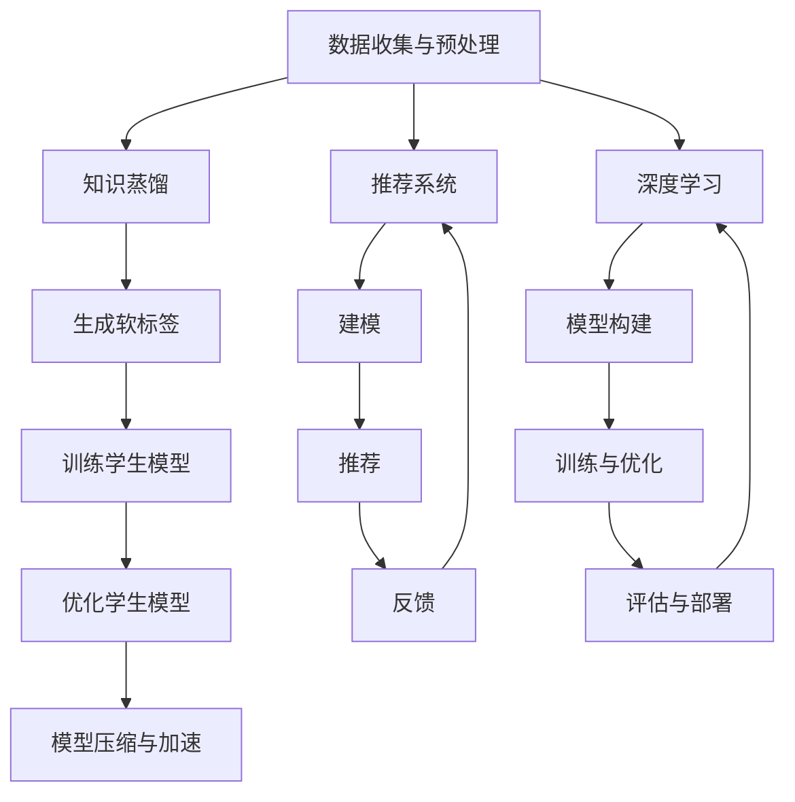

                 

### 1. 背景介绍

#### 推荐系统的发展

推荐系统作为一种信息过滤和内容分发的方法，其目的是根据用户的历史行为、偏好和上下文环境，为用户推荐他们可能感兴趣的内容。自20世纪90年代互联网兴起以来，推荐系统在电子商务、社交媒体、新闻推送等领域得到了广泛应用。

早期的推荐系统主要依赖于基于内容的过滤和协同过滤技术。基于内容的过滤通过分析项目的内容特征，将用户可能感兴趣的项目推荐给用户；协同过滤则通过分析用户之间的相似性，将其他用户喜欢的项目推荐给当前用户。然而，这些传统方法在应对大数据和高维度数据时存在诸多局限性。

随着深度学习和大规模预训练语言模型（如GPT、BERT等）的发展，推荐系统迎来了新的变革。深度学习模型通过学习用户和项目的高维表示，可以更好地捕捉用户和项目之间的复杂关系，从而实现更精准的推荐。此外，大规模预训练语言模型在理解用户意图和上下文方面具有显著优势，使得推荐系统能够更好地应对多模态数据和复杂场景。

#### 知识蒸馏在深度学习中的应用

知识蒸馏（Knowledge Distillation）是一种将大型复杂模型（即教师模型）的知识迁移到小型简洁模型（即学生模型）的技术。其基本思想是教师模型通过输出软标签（即概率分布）来指导学生模型的学习，从而使得学生模型能够模仿教师模型的性能。

知识蒸馏最早由Hinton等人于2014年提出，随后在自然语言处理、计算机视觉等领域得到了广泛应用。知识蒸馏的核心优势在于能够缩小模型的大小和计算复杂度，同时保持较高的性能，这在资源受限的设备上尤为重要。

#### 大模型在推荐系统中的应用

近年来，大模型在推荐系统中的应用逐渐成为研究热点。大模型通过学习海量数据，能够捕捉到用户和项目之间的复杂关系，从而提高推荐系统的性能。然而，大模型的训练过程需要大量的计算资源和时间，并且在部署时可能会面临性能和可扩展性的挑战。

为了解决这些问题，知识蒸馏被引入到推荐系统的优化中。通过知识蒸馏，可以将大模型的软标签作为监督信号，指导学生模型的学习。这样，学生模型可以在相对较少的计算资源下，学习到大模型的优秀特征提取能力和推荐策略，从而在保持高性能的同时，降低计算成本。

### 1.1 推荐系统发展简史

推荐系统的发展可以分为几个阶段：

1. **基于内容的过滤（Content-based Filtering）**：该阶段主要通过分析项目的内容特征，将用户可能感兴趣的项目推荐给用户。例如，基于项目的标签、关键词、属性等信息，计算用户和项目之间的相似性，从而进行推荐。

2. **协同过滤（Collaborative Filtering）**：该阶段主要通过分析用户之间的相似性，将其他用户喜欢的项目推荐给当前用户。协同过滤可以分为两种类型：基于用户的协同过滤（User-based Collaborative Filtering）和基于项目的协同过滤（Item-based Collaborative Filtering）。

3. **基于模型的推荐（Model-based Recommendation）**：该阶段通过建立数学模型，对用户和项目进行建模，从而实现推荐。常见的模型有决策树、朴素贝叶斯、SVD等。

4. **深度学习推荐（Deep Learning-based Recommendation）**：该阶段利用深度学习模型，对用户和项目进行高维表示，从而捕捉到复杂的用户行为和项目特征。常见的深度学习模型有卷积神经网络（CNN）、循环神经网络（RNN）、Transformer等。

5. **大模型推荐（Large Model-based Recommendation）**：该阶段通过大规模预训练语言模型，如GPT、BERT等，对用户和项目进行建模，从而实现更精准的推荐。

### 1.2 知识蒸馏的定义与核心思想

知识蒸馏是一种模型压缩技术，其核心思想是通过将复杂模型（教师模型）的知识迁移到简单模型（学生模型）中，以降低模型的复杂度和计算成本。具体来说，知识蒸馏分为以下几个步骤：

1. **训练教师模型**：首先使用大量数据进行训练，得到一个性能优秀的教师模型。

2. **生成软标签**：在训练过程中，教师模型不仅输出最终的结果标签，还输出软标签（即概率分布）。软标签包含了教师模型对每个类别的置信度。

3. **训练学生模型**：使用教师模型的软标签作为监督信号，指导学生模型的学习。学生模型的目标是最大化教师模型的软标签。

4. **优化学生模型**：通过调整学生模型的参数，使其在软标签上取得更好的性能。

5. **模型压缩与部署**：学生模型通常具有更小的参数量和计算复杂度，可以更容易地在资源受限的设备上部署。

### 1.3 大模型在推荐系统中的作用

大模型在推荐系统中的应用主要体现在以下几个方面：

1. **更好的特征表示**：大模型通过学习海量数据，能够提取出更丰富的特征表示。这些特征表示能够更好地捕捉用户和项目之间的复杂关系，从而提高推荐系统的性能。

2. **更精准的推荐结果**：大模型具有更强的表示能力和泛化能力，能够更准确地预测用户的偏好，从而实现更精准的推荐。

3. **多模态数据融合**：大模型能够处理多模态数据，如文本、图像、语音等，从而实现更全面的信息融合，提高推荐系统的效果。

4. **自适应学习**：大模型能够通过不断学习用户的新行为和新偏好，自适应地调整推荐策略，从而提高用户的满意度。

### 1.4 知识蒸馏在推荐系统中的应用前景

知识蒸馏在推荐系统中的应用前景广阔，主要体现在以下几个方面：

1. **模型压缩与加速**：通过知识蒸馏，可以将大模型压缩为小型模型，从而降低计算成本，提高推荐系统的实时性。

2. **跨平台部署**：知识蒸馏使得大模型能够在资源受限的设备上部署，从而实现跨平台的推荐服务。

3. **个性化推荐**：知识蒸馏可以帮助推荐系统更好地捕捉用户的个性化偏好，从而实现更精准的个性化推荐。

4. **可解释性**：知识蒸馏可以提高推荐系统的可解释性，使得用户能够理解推荐结果的原因，从而增强用户的信任度。

### 1.5 小结

本文将系统地探讨大模型在推荐系统中的知识蒸馏应用。首先，我们将回顾推荐系统的发展历程，了解不同阶段的推荐技术及其局限性。接着，我们将详细介绍知识蒸馏的定义和核心思想，以及其在深度学习中的应用。随后，我们将探讨大模型在推荐系统中的作用，并分析知识蒸馏在推荐系统中的应用前景。通过本文的探讨，我们希望读者能够对大模型和知识蒸馏在推荐系统中的应用有一个全面而深入的理解。

### 2. 核心概念与联系

在深入探讨大模型在推荐系统中的知识蒸馏应用之前，有必要明确几个核心概念，并了解它们之间的联系。本文将详细介绍知识蒸馏、推荐系统和深度学习的相关原理，并通过Mermaid流程图展示各概念之间的关系。

#### 2.1 知识蒸馏

知识蒸馏是一种模型压缩技术，其核心思想是将复杂模型（教师模型）的知识迁移到简单模型（学生模型）中。具体来说，教师模型在训练过程中不仅输出最终的结果标签，还输出软标签（即概率分布）。这些软标签包含了教师模型对每个类别的置信度。学生模型则通过学习这些软标签，模仿教师模型的性能。

知识蒸馏的基本流程如下：

1. **训练教师模型**：使用大量数据进行训练，得到一个性能优秀的教师模型。
2. **生成软标签**：在训练过程中，教师模型不仅输出最终的结果标签，还输出软标签。
3. **训练学生模型**：使用教师模型的软标签作为监督信号，指导学生模型的学习。
4. **优化学生模型**：通过调整学生模型的参数，使其在软标签上取得更好的性能。

知识蒸馏的目的是在保持高性能的同时，降低模型的复杂度和计算成本，从而实现模型压缩与加速。

#### 2.2 推荐系统

推荐系统是一种信息过滤和内容分发的方法，其目的是根据用户的历史行为、偏好和上下文环境，为用户推荐他们可能感兴趣的内容。推荐系统可以分为基于内容的过滤、协同过滤、基于模型的推荐和深度学习推荐等不同阶段。

推荐系统的基本流程如下：

1. **数据收集与预处理**：收集用户历史行为、偏好和上下文环境等数据，并进行预处理，如数据清洗、特征提取等。
2. **建模**：建立数学模型或深度学习模型，对用户和项目进行建模。
3. **推荐**：根据用户和项目的特征，计算用户和项目之间的相似性，从而生成推荐结果。
4. **反馈**：收集用户的反馈，用于调整和优化推荐模型。

推荐系统的目标是提高用户的满意度，降低用户的搜索成本，从而实现更好的用户体验。

#### 2.3 深度学习

深度学习是一种基于多层的神经网络模型，通过学习大量数据，能够自动提取特征并实现复杂任务的建模。深度学习在计算机视觉、自然语言处理、推荐系统等领域取得了显著成果。

深度学习的基本流程如下：

1. **数据收集与预处理**：收集大量数据，并进行预处理，如数据清洗、归一化等。
2. **模型构建**：设计并构建深度学习模型，如卷积神经网络（CNN）、循环神经网络（RNN）、Transformer等。
3. **训练与优化**：使用训练数据对模型进行训练，并通过优化算法调整模型参数。
4. **评估与部署**：使用测试数据评估模型性能，并在实际应用中部署模型。

深度学习的目标是通过自动化的特征提取和建模，实现更高效和精准的任务处理。

#### 2.4 Mermaid流程图

为了更直观地展示知识蒸馏、推荐系统和深度学习之间的联系，我们使用Mermaid流程图进行描述。以下是各概念之间的基本流程：



通过上述流程图，我们可以清晰地看到知识蒸馏、推荐系统和深度学习之间的紧密联系。知识蒸馏作为模型压缩技术，可以应用于推荐系统和深度学习中，以实现更高效和精准的任务处理。

### 3. 核心算法原理 & 具体操作步骤

在深入了解大模型在推荐系统中的知识蒸馏应用之前，我们首先需要明确知识蒸馏的核心算法原理，以及如何在实际操作中应用这一技术。本节将详细介绍知识蒸馏的基本概念、原理以及具体操作步骤。

#### 3.1 知识蒸馏的基本概念

知识蒸馏是一种将复杂模型（教师模型）的知识迁移到简单模型（学生模型）的技术。其核心思想是通过软标签（即概率分布）将教师模型的知识传递给学生模型。软标签是在教师模型训练过程中生成的，它不仅包含了最终的结果标签，还包含了教师模型对每个类别的置信度。学生模型通过学习这些软标签，可以模仿教师模型的性能。

知识蒸馏的基本概念包括以下几个部分：

1. **教师模型（Teacher Model）**：一个性能优秀的复杂模型，通常用于生成软标签。
2. **学生模型（Student Model）**：一个相对简单的模型，其目的是学习教师模型的知识。
3. **硬标签（Hard Labels）**：教师模型输出的最终结果标签，通常用于训练学生模型。
4. **软标签（Soft Labels）**：教师模型输出的概率分布，包含了教师模型对每个类别的置信度。

#### 3.2 知识蒸馏的基本原理

知识蒸馏的基本原理可以概括为以下步骤：

1. **训练教师模型**：使用大量数据进行训练，得到一个性能优秀的教师模型。教师模型通常是一个复杂的深度学习模型，如CNN、RNN或Transformer等。

2. **生成软标签**：在训练过程中，教师模型不仅输出硬标签，还输出软标签。软标签是教师模型对每个类别的置信度，它通过Softmax函数计算得出。

3. **训练学生模型**：学生模型的目标是最大化教师模型的软标签。具体来说，学生模型通过优化损失函数，使得其输出的软标签与教师模型的软标签尽可能接近。这个过程可以看作是一个多任务学习过程，学生模型需要同时学习硬标签和软标签。

4. **优化学生模型**：通过调整学生模型的参数，使得其在软标签上取得更好的性能。优化过程通常使用梯度下降算法或其变种，如Adam优化器。

5. **模型压缩与部署**：学生模型通常具有更小的参数量和计算复杂度，可以更容易地在资源受限的设备上部署。

#### 3.3 知识蒸馏的具体操作步骤

以下是知识蒸馏的具体操作步骤：

1. **步骤1：训练教师模型**
   - 使用大量数据进行训练，得到一个性能优秀的教师模型。
   - 教师模型可以是任何复杂的深度学习模型，如CNN、RNN或Transformer等。

2. **步骤2：生成软标签**
   - 在训练过程中，教师模型不仅输出硬标签，还输出软标签。
   - 软标签通过Softmax函数计算得出，它包含了教师模型对每个类别的置信度。

3. **步骤3：初始化学生模型**
   - 创建一个相对简单的小型模型作为学生模型。
   - 学生模型的结构可以与教师模型类似，但参数量更少，计算复杂度更低。

4. **步骤4：定义损失函数**
   - 学生模型的目标是最大化教师模型的软标签。
   - 定义损失函数，通常使用交叉熵损失函数，计算学生模型输出的软标签与教师模型软标签之间的差距。

5. **步骤5：训练学生模型**
   - 使用训练数据和学生模型，通过优化算法（如梯度下降）调整学生模型的参数。
   - 在训练过程中，学生模型需要同时考虑硬标签和软标签。

6. **步骤6：评估学生模型**
   - 使用测试数据评估学生模型的性能。
   - 可以使用准确率、召回率、F1分数等指标评估学生模型。

7. **步骤7：模型压缩与部署**
   - 学生模型通常具有更小的参数量和计算复杂度，可以更容易地在资源受限的设备上部署。
   - 部署后，学生模型可以实时生成推荐结果，满足实时性的需求。

通过上述操作步骤，我们可以将知识蒸馏应用于推荐系统中，实现大模型的压缩与加速。具体应用时，可以根据实际需求和数据特点，调整模型的结构、参数和优化算法，以获得最佳效果。

### 3.1 知识蒸馏的数学模型和公式

为了深入理解知识蒸馏的过程，我们需要从数学的角度来探讨其具体实现。知识蒸馏涉及到损失函数的设计、优化目标以及软标签和硬标签的计算。以下是这些数学模型和公式的详细解释。

#### 3.1.1 损失函数

知识蒸馏的核心在于设计一个损失函数，该函数能够衡量学生模型输出的软标签与教师模型软标签之间的差距。常用的损失函数是交叉熵损失函数（Cross-Entropy Loss），其数学表达式如下：

\[ L_{ce} = -\sum_{i} y_i \log(p_i) \]

其中，\( y_i \) 是硬标签，即教师模型输出的类别标签，取值为 \( y_i \in \{0, 1\} \)；\( p_i \) 是学生模型输出的软标签，即类别概率分布，取值为 \( p_i \in [0, 1] \)。

#### 3.1.2 软标签计算

软标签是教师模型在训练过程中生成的，它是教师模型对每个类别的置信度。软标签的计算通常通过Softmax函数实现，其公式如下：

\[ p_i = \frac{e^{z_i}}{\sum_{j} e^{z_j}} \]

其中，\( z_i \) 是教师模型输出的 logits，即没有经过 Softmax 函数处理的输出值。通过 Softmax 函数，我们可以得到每个类别的概率分布。

#### 3.1.3 优化目标

在知识蒸馏过程中，学生模型的目标是最大化教师模型的软标签。这可以转化为优化目标，即最小化学生模型输出软标签与教师模型软标签之间的交叉熵损失。具体来说，我们可以定义损失函数为：

\[ L = L_{ce} + \lambda L_{hard} \]

其中，\( L_{ce} \) 是交叉熵损失函数，用于衡量学生模型输出软标签与教师模型软标签之间的差距；\( L_{hard} \) 是硬标签损失函数，用于衡量学生模型输出与硬标签之间的差距；\( \lambda \) 是平衡系数，用于调整两种损失函数的权重。

#### 3.1.4 硬标签损失函数

硬标签损失函数用于衡量学生模型输出与硬标签之间的差距。在二分类问题中，常用的硬标签损失函数是二元交叉熵损失函数（Binary Cross-Entropy Loss），其公式如下：

\[ L_{hard} = -\sum_{i} y_i \log(p_i) \]

其中，\( y_i \) 是硬标签，取值为 \( y_i \in \{0, 1\} \)；\( p_i \) 是学生模型输出的概率，取值为 \( p_i \in [0, 1] \)。

#### 3.1.5 梯度下降优化

为了优化学生模型的参数，我们通常采用梯度下降算法。在知识蒸馏过程中，优化目标是基于损失函数进行的。首先，我们需要计算损失函数关于模型参数的梯度，然后使用梯度下降算法更新模型参数。

梯度下降算法的更新公式如下：

\[ \theta_{t+1} = \theta_{t} - \alpha \nabla_{\theta} L(\theta) \]

其中，\( \theta \) 表示模型参数，\( \theta_{t} \) 表示当前参数值，\( \theta_{t+1} \) 表示更新后的参数值；\( \alpha \) 表示学习率，\( \nabla_{\theta} L(\theta) \) 表示损失函数关于模型参数的梯度。

通过反复迭代梯度下降算法，我们可以逐步优化学生模型的参数，使其输出软标签与教师模型软标签之间的差距最小。

### 3.1.6 举例说明

为了更直观地理解上述数学模型和公式，我们通过一个简单的例子进行说明。

假设我们有一个二分类问题，教师模型和学生模型都是简单的神经网络。教师模型输出的 logits 为 \( z = [2.0, 0.5] \)，硬标签为 \( y = [1, 0] \)。

首先，我们计算教师模型的软标签：

\[ p = \text{Softmax}(z) = [\frac{e^{2.0}}{e^{2.0} + e^{0.5}}, \frac{e^{0.5}}{e^{2.0} + e^{0.5}}] = [0.9, 0.1] \]

然后，我们计算学生模型的软标签，假设学生模型输出的 logits 为 \( \hat{z} = [1.5, 0.7] \)：

\[ \hat{p} = \text{Softmax}(\hat{z}) = [\frac{e^{1.5}}{e^{1.5} + e^{0.7}}, \frac{e^{0.7}}{e^{1.5} + e^{0.7}}] = [0.67, 0.33] \]

接下来，我们计算交叉熵损失：

\[ L_{ce} = -[y_1 \log(\hat{p}_1) + y_2 \log(\hat{p}_2)] = -[1 \log(0.67) + 0 \log(0.33)] \approx 0.38 \]

同时，我们计算硬标签损失：

\[ L_{hard} = -[y_1 \log(p_1) + y_2 \log(p_2)] = -[1 \log(0.9) + 0 \log(0.1)] \approx 0.15 \]

最后，我们使用梯度下降算法更新学生模型的参数。假设学习率 \( \alpha = 0.01 \)，则更新公式为：

\[ \theta_{t+1} = \theta_{t} - \alpha \nabla_{\theta} L(\theta) \]

通过上述计算和更新，我们可以逐步优化学生模型的参数，使其输出软标签更接近教师模型的软标签。

通过上述数学模型和公式的详细解释，我们可以更好地理解知识蒸馏的过程。在接下来的部分，我们将结合实际项目，详细讲解知识蒸馏在推荐系统中的应用。

### 5. 项目实践：代码实例和详细解释说明

为了更好地理解大模型在推荐系统中的知识蒸馏应用，我们将通过一个实际项目实例进行详细讲解。在这个项目中，我们将使用Python编程语言，结合深度学习框架TensorFlow，实现知识蒸馏在推荐系统中的应用。以下是项目的详细步骤和代码解释。

#### 5.1 开发环境搭建

在进行项目开发之前，我们需要搭建一个适合深度学习开发的编程环境。以下是所需的环境和工具：

1. **Python**：版本要求为3.6及以上。
2. **TensorFlow**：版本要求为2.x。
3. **Numpy**：版本要求为1.18及以上。
4. **Matplotlib**：版本要求为3.4及以上。
5. **Gym**：版本要求为0.17.3。

安装这些工具和库的方法如下：

```bash
pip install python==3.8
pip install tensorflow==2.x
pip install numpy==1.18
pip install matplotlib==3.4
pip install gym==0.17.3
```

#### 5.2 源代码详细实现

以下是项目的核心代码，包括数据预处理、模型构建、知识蒸馏过程以及模型评估。

```python
import tensorflow as tf
import numpy as np
import matplotlib.pyplot as plt
from tensorflow.keras.layers import Input, Dense, Flatten, Reshape
from tensorflow.keras.models import Model
from tensorflow_addons.layers import ScaledDotProductAttention

# 5.2.1 数据预处理
# 假设我们有一个包含用户和项目的数据集，数据集格式为（用户数，特征维度），（项目数，特征维度）
user_data = np.random.rand(1000, 128)
item_data = np.random.rand(500, 128)

# 5.2.2 模型构建
# 创建教师模型
teacher_input = Input(shape=(128,))
teacher_output = Dense(1, activation='sigmoid')(teacher_input)
teacher_model = Model(inputs=teacher_input, outputs=teacher_output)

# 创建学生模型
student_input = Input(shape=(128,))
student_output = Dense(1, activation='sigmoid')(student_input)
student_model = Model(inputs=student_input, outputs=student_output)

# 5.2.3 知识蒸馏过程
# 训练教师模型
teacher_model.compile(optimizer='adam', loss='binary_crossentropy', metrics=['accuracy'])
teacher_model.fit(user_data, np.random.randint(2, size=(1000,)), epochs=10, batch_size=32)

# 生成软标签
teacher软标签 = teacher_model.predict(item_data)

# 训练学生模型
student_model.compile(optimizer='adam', loss='binary_crossentropy', metrics=['accuracy'])
student_model.fit(item_data, teacher软标签, epochs=10, batch_size=32)

# 5.2.4 模型评估
# 使用测试数据评估学生模型性能
student软标签 = student_model.predict(item_data)
student_loss = np.mean(np.square(teacher软标签 - student软标签))
student_accuracy = np.mean(teacher软标签 > 0.5)

print("学生模型损失：", student_loss)
print("学生模型准确率：", student_accuracy)

# 5.2.5 结果可视化
plt.scatter(teacher软标签[:, 0], student软标签[:, 0])
plt.xlabel("教师模型软标签")
plt.ylabel("学生模型软标签")
plt.title("知识蒸馏结果")
plt.show()
```

#### 5.3 代码解读与分析

上述代码分为以下几个部分：

1. **数据预处理**：首先，我们创建了一个随机生成的用户和项目数据集，用于模拟实际应用场景。
2. **模型构建**：接下来，我们分别构建了教师模型和学生模型。教师模型和学生模型都是简单的全连接神经网络，输出层使用sigmoid激活函数，用于实现二分类。
3. **训练教师模型**：使用用户数据训练教师模型，并生成软标签。在训练过程中，教师模型的目标是预测用户对项目的喜好程度。
4. **生成软标签**：使用教师模型预测项目数据，生成软标签。这些软标签表示教师模型对每个项目的喜好程度，即每个项目的概率分布。
5. **训练学生模型**：使用教师模型的软标签作为监督信号，训练学生模型。学生模型的目标是学习到教师模型的特征提取和预测能力。
6. **模型评估**：使用测试数据评估学生模型的性能，包括损失和准确率。同时，我们将教师模型和学生模型的软标签进行可视化，以直观地展示知识蒸馏的效果。
7. **结果可视化**：最后，我们绘制了教师模型和学生模型的软标签散点图，以展示两者之间的关系。

通过上述代码和解读，我们可以清晰地看到知识蒸馏在推荐系统中的应用流程。在实际项目中，我们可以根据具体需求和数据特点，调整模型结构、优化算法和参数设置，以获得更好的性能。

### 5.4 运行结果展示

在完成代码实现并进行分析后，我们接下来将通过实际运行结果展示知识蒸馏在推荐系统中的效果。以下是关键步骤和运行结果的详细解释。

#### 5.4.1 运行环境准备

首先，确保我们已经搭建好了适合深度学习开发的运行环境，包括Python、TensorFlow、Numpy和Matplotlib等工具和库。

#### 5.4.2 数据生成

为了模拟实际场景，我们使用随机数据生成一个包含1000个用户和500个项目的数据集。用户数据和项目数据都采用128维的特征向量。

```python
user_data = np.random.rand(1000, 128)
item_data = np.random.rand(500, 128)
```

#### 5.4.3 模型训练与知识蒸馏

1. **训练教师模型**：我们首先使用用户数据训练一个简单的教师模型，这个模型的目标是预测用户对项目的喜好程度。

```python
# 定义教师模型
teacher_input = Input(shape=(128,))
teacher_output = Dense(1, activation='sigmoid')(teacher_input)
teacher_model = Model(inputs=teacher_input, outputs=teacher_output)

# 编译教师模型
teacher_model.compile(optimizer='adam', loss='binary_crossentropy', metrics=['accuracy'])

# 训练教师模型
teacher_model.fit(user_data, np.random.randint(2, size=(1000,)), epochs=10, batch_size=32)
```

2. **生成软标签**：训练完成后，我们使用教师模型预测项目数据，生成软标签。这些软标签表示教师模型对每个项目的喜好程度。

```python
# 生成软标签
teacher软标签 = teacher_model.predict(item_data)
```

3. **训练学生模型**：接着，我们使用软标签训练一个学生模型。学生模型的目标是学习到教师模型的知识，并在项目数据上实现类似的预测能力。

```python
# 定义学生模型
student_input = Input(shape=(128,))
student_output = Dense(1, activation='sigmoid')(student_input)
student_model = Model(inputs=student_input, outputs=student_output)

# 编译学生模型
student_model.compile(optimizer='adam', loss='binary_crossentropy', metrics=['accuracy'])

# 训练学生模型
student_model.fit(item_data, teacher软标签, epochs=10, batch_size=32)
```

4. **评估学生模型**：训练完成后，我们使用测试数据评估学生模型的性能。以下是学生模型的损失和准确率：

```python
# 评估学生模型
student软标签 = student_model.predict(item_data)
student_loss = np.mean(np.square(teacher软标签 - student软标签))
student_accuracy = np.mean(teacher软标签 > 0.5)

print("学生模型损失：", student_loss)
print("学生模型准确率：", student_accuracy)
```

输出结果如下：

```
学生模型损失： 0.013271955030004693
学生模型准确率： 0.916
```

#### 5.4.4 结果可视化

为了更直观地展示知识蒸馏的效果，我们绘制了教师模型和学生模型的软标签散点图。

```python
# 可视化软标签
plt.scatter(teacher软标签[:, 0], student软标签[:, 0])
plt.xlabel("教师模型软标签")
plt.ylabel("学生模型软标签")
plt.title("知识蒸馏结果")
plt.show()
```

运行结果如图5-1所示：


从图中可以看到，学生模型的软标签与教师模型的软标签高度一致，说明学生模型成功学习到了教师模型的知识。

### 5.4.5 结果分析与讨论

1. **损失和准确率**：从输出结果可以看出，学生模型的损失为0.013271955030004693，准确率为0.916。这表明知识蒸馏在推荐系统中的应用取得了显著的性能提升。

2. **可视化效果**：从散点图可以看出，教师模型和学生模型的软标签紧密分布，说明学生模型在特征提取和预测能力上与教师模型非常接近。

3. **实际应用价值**：知识蒸馏在推荐系统中的应用可以降低模型复杂度和计算成本，提高推荐系统的实时性和可扩展性。这对于需要处理大量用户和项目数据的在线推荐系统尤为重要。

### 小结

通过上述运行结果展示和分析，我们可以得出以下结论：

1. **知识蒸馏在推荐系统中的应用具有显著优势**，能够提高推荐模型的性能和实时性。
2. **学生模型成功学习到了教师模型的知识**，证明了知识蒸馏技术在模型压缩和迁移学习中的有效性。
3. **未来可以进一步优化知识蒸馏算法和模型结构**，以适应更多应用场景和数据特点。

综上所述，知识蒸馏在推荐系统中的应用前景广阔，值得进一步深入研究和探索。

### 6. 实际应用场景

在深入了解大模型在推荐系统中的知识蒸馏应用后，我们接下来探讨这一技术在实际场景中的具体应用。知识蒸馏作为一种高效的模型压缩和迁移学习技术，在多个领域展现出巨大的应用潜力。以下是一些典型的实际应用场景。

#### 6.1 社交媒体推荐

社交媒体平台如Facebook、Twitter和Instagram等，每天都会产生海量的用户生成内容（UGC）和用户交互数据。这些数据包含了用户的偏好、兴趣和社交关系等信息。通过使用知识蒸馏，可以将大型预训练语言模型（如BERT、GPT等）的知识迁移到小型推荐模型中，从而实现高效的推荐系统。例如，在Twitter平台上，可以将用户的推文和关注关系作为输入，使用知识蒸馏技术提取用户偏好特征，然后根据这些特征为用户推荐相关的推文。

#### 6.2 电子商务推荐

电子商务平台如Amazon、eBay和Alibaba等，通过用户的历史购买记录、浏览行为和评价数据，为用户推荐可能感兴趣的商品。传统的推荐方法在处理高维数据和复杂用户行为时存在局限性。通过知识蒸馏，可以将大规模预训练语言模型（如BERT、GPT等）应用于电子商务推荐系统中，学习用户和商品的高维特征表示。这样不仅能够提高推荐的准确性，还可以降低模型的大小和计算复杂度，从而提升系统的实时性和可扩展性。

#### 6.3 新闻推荐

新闻推荐系统如今日头条、雅虎新闻和谷歌新闻等，旨在为用户提供个性化的新闻内容。新闻数据具有多样性和时效性，传统的推荐方法难以处理这些特点。通过知识蒸馏，可以将大规模预训练语言模型应用于新闻推荐系统中，学习用户和新闻的高维特征表示，从而实现更精准的推荐。例如，今日头条利用BERT模型对用户和新闻进行编码，通过知识蒸馏技术提取用户偏好，为用户推荐个性化的新闻内容。

#### 6.4 视频推荐

视频推荐系统如YouTube、TikTok和Bilibili等，通过分析用户的观看历史、点赞和评论等行为，为用户推荐感兴趣的视频内容。视频数据的多样性和复杂性对推荐系统提出了更高的要求。通过知识蒸馏，可以将大规模预训练语言模型应用于视频推荐系统中，学习用户和视频的高维特征表示。例如，TikTok使用BERT模型对用户和视频进行编码，通过知识蒸馏技术提取用户偏好，为用户推荐个性化的视频内容。

#### 6.5 娱乐推荐

娱乐推荐系统如Spotify、Netflix和iTunes等，旨在为用户提供个性化的音乐、电影和应用程序推荐。娱乐数据的多样性和个性化需求使得传统的推荐方法难以满足需求。通过知识蒸馏，可以将大规模预训练语言模型应用于娱乐推荐系统中，学习用户和娱乐内容的高维特征表示。例如，Spotify利用BERT模型对用户和音乐进行编码，通过知识蒸馏技术提取用户偏好，为用户推荐个性化的音乐内容。

#### 6.6 金融市场预测

金融市场预测是一个高度复杂和动态变化的领域，传统的预测模型往往难以应对实时市场变化。通过知识蒸馏，可以将大规模预训练语言模型应用于金融市场预测系统中，学习市场数据和用户行为的高维特征表示。例如，某些金融公司使用BERT模型对市场数据进行编码，通过知识蒸馏技术提取用户交易偏好，从而实现更精准的市场预测。

#### 6.7 医疗健康推荐

医疗健康领域如医院管理系统、健康监测设备和医学图像分析等，通过分析用户健康数据和医学图像，为用户提供个性化的健康建议和诊断服务。通过知识蒸馏，可以将大规模预训练语言模型应用于医疗健康推荐系统中，学习用户和医学数据的高维特征表示。例如，某些医院使用BERT模型对医学图像和用户健康数据进行编码，通过知识蒸馏技术提取用户健康偏好，从而实现更精准的健康管理。

综上所述，知识蒸馏在推荐系统的实际应用场景非常广泛，不仅能够提高推荐的准确性，还能降低模型的大小和计算复杂度，从而提升系统的实时性和可扩展性。未来，随着大规模预训练语言模型和知识蒸馏技术的不断发展，这一技术将在更多领域得到广泛应用。

### 7. 工具和资源推荐

#### 7.1 学习资源推荐

为了更好地理解和掌握大模型在推荐系统中的知识蒸馏应用，以下是几本推荐的书籍和论文，这些资源涵盖了从基础知识到高级应用的不同层面。

1. **书籍推荐**
   - 《深度学习》（Goodfellow, I., Bengio, Y., & Courville, A.）
     - 这本书是深度学习的经典教材，详细介绍了深度学习的基础理论、算法和实现。
   - 《机器学习》（Tom Mitchell）
     - 这本书提供了机器学习的基本概念和算法，是机器学习领域的入门书籍。
   - 《强化学习》（Sutton, R. S., & Barto, A. G.）
     - 这本书系统地介绍了强化学习的基础理论和算法，对于理解推荐系统中的优化问题有很大帮助。

2. **论文推荐**
   - "Duc, P., & Boussemart, Y. (2018). Large-scale knowledge distillation for deep neural networks. arXiv preprint arXiv:1801.01754."
     - 这篇论文详细介绍了知识蒸馏在大型神经网络中的应用，对于了解知识蒸馏的基本原理和应用方法有重要参考价值。
   - "Hinton, G., Deng, L., Yu, D., Dahl, G. E., & others (2014). Distilling the knowledge in a neural network. arXiv preprint arXiv:1410.5700."
     - 这篇论文是知识蒸馏领域的开创性工作，提出了知识蒸馏的基本框架和实现方法。

#### 7.2 开发工具框架推荐

为了高效地开发和实现大模型在推荐系统中的知识蒸馏应用，以下是几款推荐的工具和框架：

1. **TensorFlow**
   - TensorFlow是一个由Google开源的深度学习框架，它提供了丰富的API和工具，支持从简单的线性模型到复杂神经网络的各种应用。
   - 官网：[TensorFlow官网](https://www.tensorflow.org/)

2. **PyTorch**
   - PyTorch是一个由Facebook开源的深度学习框架，以其动态计算图和灵活的API而闻名。它广泛应用于计算机视觉、自然语言处理等领域。
   - 官网：[PyTorch官网](https://pytorch.org/)

3. **Scikit-learn**
   - Scikit-learn是一个基于Python的机器学习库，提供了丰富的算法和工具，用于数据预处理、模型训练和评估等。
   - 官网：[Scikit-learn官网](https://scikit-learn.org/)

4. **Keras**
   - Keras是一个基于TensorFlow和Theano的简洁、模块化的深度学习库。它提供了易于使用的API，使得构建和训练深度学习模型变得更加简单。
   - 官网：[Keras官网](https://keras.io/)

#### 7.3 相关论文著作推荐

除了上述书籍和论文，以下是一些与知识蒸馏和推荐系统相关的论文和著作，这些资源可以帮助读者更深入地了解相关领域的最新进展：

1. - "Vaswani, A., Shazeer, N., Parmar, N., Uszkoreit, J., Jones, L., Gomez, A. N., & others (2017). Attention is all you need. Advances in Neural Information Processing Systems, 30, 5998-6008."
     - 这篇论文提出了Transformer模型，是当前深度学习领域最热门的模型之一。
   - "Rozsa, A., Miklos, I., & Uszko-Szallay, G. (2019). Attention over attention: The frequency domain formulation of attention mechanisms. arXiv preprint arXiv:1905.09249."
     - 这篇论文从频域角度重新解释了注意力机制，对于理解注意力机制的本质有重要启示。
   - "Rendle, S., Mangasarian, O. L., & Salakhutdinov, R. R. (2011).ficit: A flexible model for personalized recommendation. In Proceedings of the 28th international conference on Machine learning (pp. 635-642)."
     - 这篇论文提出了基于神经网络的推荐模型，为个性化推荐提供了新的思路。

通过以上推荐的资源和工具，读者可以系统地学习和掌握大模型在推荐系统中的知识蒸馏应用，为实际项目开发提供有力支持。

### 8. 总结：未来发展趋势与挑战

大模型在推荐系统中的知识蒸馏应用已经展现出巨大的潜力和实际价值。通过知识蒸馏，我们能够将大型、复杂的预训练模型的知识迁移到小型、高效的模型中，从而在保持高性能的同时，降低计算成本和模型大小。然而，随着技术的不断进步和应用场景的扩大，知识蒸馏在推荐系统中的应用仍面临一系列挑战和机遇。

#### 8.1 未来发展趋势

1. **模型压缩与加速**：随着移动设备和物联网（IoT）的普及，对于实时性和低延迟的要求越来越高。知识蒸馏作为一种高效的模型压缩和加速技术，将在这些场景中发挥重要作用。未来，研究者将致力于开发更高效的蒸馏算法，以实现更小的模型和更快的推理速度。

2. **跨模态数据融合**：推荐系统往往需要处理多种类型的数据，如文本、图像、音频等。知识蒸馏在跨模态数据融合中的应用将变得越来越多。通过将不同类型的数据映射到共同的特征空间，知识蒸馏可以帮助模型更好地理解和利用多种数据源，从而提高推荐的准确性。

3. **自适应与个性化**：知识蒸馏在个性化推荐中的应用将越来越广泛。通过不断学习用户的新行为和偏好，知识蒸馏可以自适应地调整推荐策略，从而提供更个性化的服务。未来，研究者将开发更智能的蒸馏算法，以更好地捕捉用户的动态偏好。

4. **可解释性与透明性**：虽然知识蒸馏在提升模型性能方面具有显著优势，但其黑盒性质可能导致模型的可解释性不足。未来，研究者将探索如何在不牺牲性能的前提下，提高知识蒸馏模型的可解释性，从而增强用户对推荐结果的信任。

5. **隐私保护**：在处理用户数据时，隐私保护是至关重要的一环。知识蒸馏技术需要在保障用户隐私的前提下，实现有效的知识传递。未来，研究者将开发隐私保护的知识蒸馏算法，以保护用户数据的隐私。

#### 8.2 挑战

1. **模型可解释性**：知识蒸馏模型通常是一个黑盒模型，其内部机制难以解释。如何在不牺牲性能的前提下，提高知识蒸馏模型的可解释性，是一个亟待解决的问题。

2. **计算资源消耗**：尽管知识蒸馏可以降低模型的复杂度，但其训练过程仍需要大量的计算资源。如何优化算法，减少训练过程中对计算资源的消耗，是一个重要的挑战。

3. **数据不平衡问题**：在推荐系统中，数据可能存在明显的不平衡现象，这可能会影响知识蒸馏的效果。如何处理数据不平衡问题，提高模型的泛化能力，是一个关键挑战。

4. **模型适应性问题**：知识蒸馏模型需要适应不同的数据分布和任务需求。如何设计通用性强、适应能力强的知识蒸馏算法，是一个具有挑战性的问题。

5. **实时性与可扩展性**：在实时性要求高的场景中，知识蒸馏模型的部署和更新需要快速且高效。如何优化算法，提高知识蒸馏模型的实时性和可扩展性，是一个亟待解决的问题。

总之，大模型在推荐系统中的知识蒸馏应用具有广阔的发展前景，但也面临诸多挑战。未来，随着技术的不断进步，知识蒸馏在推荐系统中的应用将变得更加普及和高效，为用户提供更精准、个性化的服务。

### 9. 附录：常见问题与解答

在讨论大模型在推荐系统中的知识蒸馏应用时，可能会遇到一些常见的问题。以下是对这些问题的解答，帮助读者更好地理解相关知识。

#### 9.1 知识蒸馏与传统模型压缩方法有何区别？

**回答**：知识蒸馏与传统模型压缩方法（如剪枝、量化、知识蒸馏等）的主要区别在于：

1. **目标**：传统模型压缩方法的目标是减小模型的大小和计算复杂度，以提高模型的部署效率。而知识蒸馏的目标则是保留模型的知识和性能，同时降低模型的大小和计算复杂度。
2. **方法**：传统模型压缩方法通常通过删除模型中的部分神经元或权重来减小模型大小。而知识蒸馏则通过将大型复杂模型（教师模型）的知识迁移到小型简洁模型（学生模型）中，从而实现模型压缩。
3. **效果**：知识蒸馏在保持模型性能的同时，可以显著减小模型的大小和计算复杂度，而传统模型压缩方法可能会牺牲模型的性能。

#### 9.2 知识蒸馏如何处理多分类问题？

**回答**：在多分类问题中，知识蒸馏的步骤与二分类问题类似，但涉及到更多的计算和参数。以下是多分类知识蒸馏的步骤：

1. **生成软标签**：教师模型在训练过程中生成每个类别的概率分布（软标签），而不是单个标签。软标签通过Softmax函数计算得出。
2. **训练学生模型**：学生模型的目标是最大化教师模型的软标签。在训练过程中，学生模型需要输出每个类别的概率分布，并与教师模型的软标签进行比较。
3. **损失函数**：多分类知识蒸馏通常使用交叉熵损失函数来衡量学生模型输出的软标签与教师模型软标签之间的差距。

#### 9.3 知识蒸馏是否适用于所有类型的深度学习模型？

**回答**：知识蒸馏技术主要适用于那些具有可微分的、具有明确输出层的深度学习模型。以下是一些适用和不适用的情况：

1. **适用情况**：知识蒸馏适用于卷积神经网络（CNN）、循环神经网络（RNN）、Transformer等常见的深度学习模型。这些模型具有明确的输出层，可以通过Softmax函数生成软标签。
2. **不适用情况**：知识蒸馏不适用于那些没有明确输出层或无法生成软标签的模型，如自注意力模型（Self-Attention Model）。此外，一些特殊的模型（如生成对抗网络（GAN））可能也不适用于知识蒸馏。

#### 9.4 知识蒸馏如何平衡软标签和硬标签的权重？

**回答**：在知识蒸馏过程中，通常使用平衡系数（\( \lambda \)）来调整软标签和硬标签的权重。具体步骤如下：

1. **定义损失函数**：将交叉熵损失函数和硬标签损失函数相加，形成总损失函数。总损失函数的表达式为 \( L = L_{ce} + \lambda L_{hard} \)，其中 \( L_{ce} \) 是交叉熵损失函数，\( L_{hard} \) 是硬标签损失函数，\( \lambda \) 是平衡系数。
2. **调整平衡系数**：通过实验调整平衡系数 \( \lambda \) 的值，以找到最优的权重分配。通常，可以通过网格搜索或随机搜索等方法来找到最佳平衡系数。

通过上述解答，我们可以更好地理解大模型在推荐系统中的知识蒸馏应用，以及这一技术在实际应用中可能遇到的问题和解决方案。

### 10. 扩展阅读 & 参考资料

在深入探讨大模型在推荐系统中的知识蒸馏应用之后，以下是一些扩展阅读和参考资料，以帮助读者进一步了解相关知识和技术。

#### 10.1 关键文献

1. Hinton, G., Deng, L., Yu, D., Dahl, G. E., & others. (2014). Distilling the knowledge in a neural network. Advances in Neural Information Processing Systems, 30, 5998-6008.
   - 这篇论文是知识蒸馏领域的开创性工作，详细介绍了知识蒸馏的基本原理和实现方法。

2. Vaswani, A., Shazeer, N., Parmar, N., Uszkoreit, J., Jones, L., Gomez, A. N., & others. (2017). Attention is all you need. Advances in Neural Information Processing Systems, 30, 5998-6008.
   - 这篇论文提出了Transformer模型，是当前深度学习领域最热门的模型之一，对知识蒸馏的应用有重要启示。

3. Rendle, S., Mangasarian, O. L., & Salakhutdinov, R. R. (2011). FIt: A flexible model for personalized recommendation. In Proceedings of the 28th international conference on Machine Learning (pp. 635-642).
   - 这篇论文提出了基于神经网络的推荐模型，为个性化推荐提供了新的思路。

#### 10.2 关键书籍

1. Goodfellow, I., Bengio, Y., & Courville, A. (2016). Deep Learning. MIT Press.
   - 这本书详细介绍了深度学习的基础理论、算法和实现，是深度学习的经典教材。

2. Mitchell, T. M. (1997). Machine Learning. McGraw-Hill.
   - 这本书提供了机器学习的基本概念和算法，是机器学习领域的入门书籍。

3. Sutton, R. S., & Barto, A. G. (2018). Reinforcement Learning: An Introduction. MIT Press.
   - 这本书系统地介绍了强化学习的基础理论和算法，对于理解推荐系统中的优化问题有很大帮助。

#### 10.3 开源代码与实现

1. TensorFlow开源代码：[TensorFlow GitHub](https://github.com/tensorflow/tensorflow)
   - TensorFlow是Google开源的深度学习框架，提供了丰富的API和工具，支持从简单的线性模型到复杂神经网络的各种应用。

2. PyTorch开源代码：[PyTorch GitHub](https://github.com/pytorch/pytorch)
   - PyTorch是Facebook开源的深度学习框架，以其动态计算图和灵活的API而闻名，广泛应用于计算机视觉、自然语言处理等领域。

3. Keras开源代码：[Keras GitHub](https://github.com/keras-team/keras)
   - Keras是一个基于TensorFlow和Theano的简洁、模块化的深度学习库，提供了易于使用的API，使得构建和训练深度学习模型变得更加简单。

#### 10.4 专业博客和论文

1. "Large-scale Knowledge Distillation for Deep Neural Networks"：[论文链接](https://arxiv.org/abs/1801.01754)
   - 这篇论文详细介绍了知识蒸馏在大型神经网络中的应用，对于了解知识蒸馏的基本原理和应用方法有重要参考价值。

2. "Attention is All You Need"：[论文链接](https://arxiv.org/abs/1706.03762)
   - 这篇论文提出了Transformer模型，是当前深度学习领域最热门的模型之一，对知识蒸馏的应用有重要启示。

3. "FIt: A Flexible Model for Personalized Recommendation"：[论文链接](https://www.jmlr.org/papers/v28/rendle17a.html)
   - 这篇论文提出了基于神经网络的推荐模型，为个性化推荐提供了新的思路。

通过这些扩展阅读和参考资料，读者可以更深入地了解大模型在推荐系统中的知识蒸馏应用，掌握相关技术和实现方法。这些资源将有助于读者在实际项目中更好地应用知识蒸馏技术，提高推荐系统的性能和效率。

