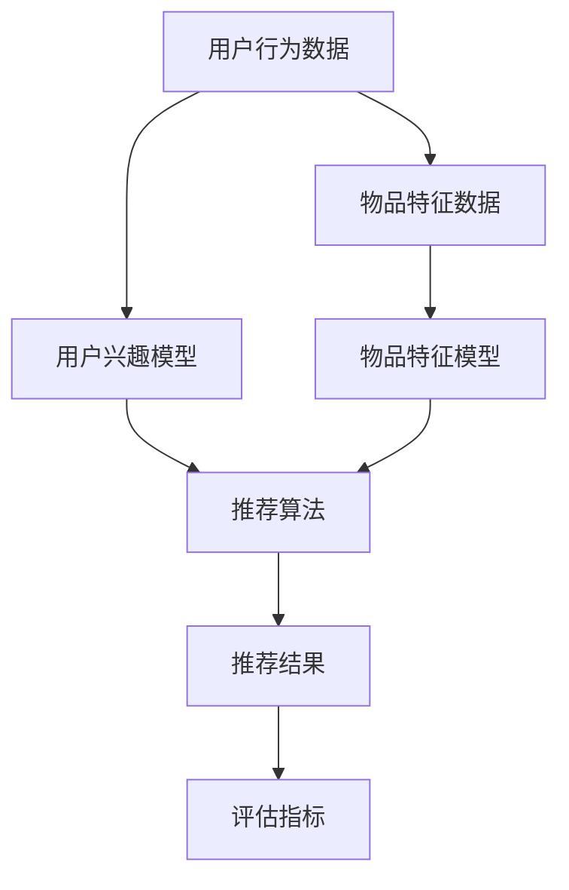
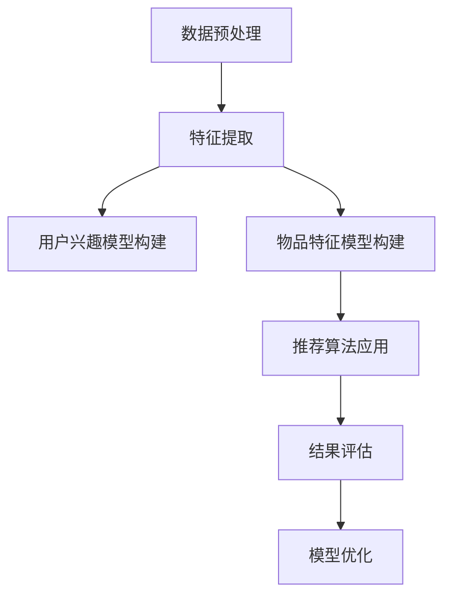

                 

### 文章标题

#### 大模型在推荐结果生成组合中的应用探索

> **关键词**：大模型、推荐系统、结果生成、组合应用、算法原理、数学模型

> **摘要**：本文将深入探讨大模型在推荐结果生成组合中的应用。通过分析大模型的核心概念和算法原理，本文将详细描述大模型在推荐系统中的具体操作步骤，以及数学模型的构建与应用。同时，我们将通过项目实践和代码实例，展示大模型在推荐结果生成组合中的实际效果，并提出未来发展趋势与挑战。

### 1. 背景介绍

随着互联网和大数据技术的飞速发展，推荐系统已经成为各类在线服务和平台的重要组成部分。推荐系统通过分析用户的兴趣和行为，为用户推荐其可能感兴趣的内容或商品，从而提高用户体验和平台的价值。然而，传统的推荐系统在处理大规模数据和高维特征时，往往面临着准确性不足、冷启动问题以及多样性不足等挑战。

近年来，随着深度学习和大模型的兴起，越来越多的研究开始将大模型引入推荐系统。大模型具有强大的表示能力和学习能力，能够在高维数据中捕捉到复杂的关系和模式，从而提高推荐系统的性能。本文旨在探讨大模型在推荐结果生成组合中的应用，通过分析其核心概念和算法原理，探索其在实际项目中的实现方法和效果。

### 2. 核心概念与联系

在介绍大模型在推荐结果生成组合中的应用之前，我们需要先了解一些核心概念和相关的技术架构。

#### 2.1 大模型

大模型，通常指的是具有数十亿甚至千亿级参数的深度学习模型。这些模型能够处理大规模数据，并在多种任务中取得优异的性能。大模型的核心优势在于其强大的表示能力和学习能力，能够自动从数据中学习复杂的特征和关系。

#### 2.2 推荐系统

推荐系统是一种信息过滤技术，旨在根据用户的兴趣和行为，向用户推荐可能感兴趣的内容或商品。推荐系统通常包括以下几个关键组成部分：

1. **用户兴趣模型**：通过分析用户的点击、浏览、购买等行为，构建用户兴趣模型。
2. **物品特征模型**：对物品进行特征提取，如标签、类别、文本等。
3. **推荐算法**：基于用户兴趣模型和物品特征模型，计算用户对物品的相似度或兴趣度，生成推荐结果。
4. **评估指标**：用于评估推荐系统的性能，如准确率、召回率、覆盖率等。

#### 2.3 组合模型

组合模型是将多个模型或多个特征组合起来，以提高推荐系统的性能。常见的组合方法包括模型级组合、特征级组合和结果级组合。

1. **模型级组合**：将多个模型的结果进行融合，如加权平均、投票等。
2. **特征级组合**：将多个特征进行融合，如特征交叉、特征拼接等。
3. **结果级组合**：将多个推荐结果进行融合，如Top-k融合、排序融合等。

#### 2.4 Mermaid 流程图

以下是一个简单的 Mermaid 流程图，展示了大模型在推荐系统中的应用架构：



### 3. 核心算法原理 & 具体操作步骤

#### 3.1 大模型算法原理

大模型的算法原理主要包括两个方面：特征提取和预测。

1. **特征提取**：大模型通过深度神经网络，自动从原始数据中学习复杂的特征表示。这些特征表示能够捕捉到用户和物品之间的潜在关系，为推荐算法提供丰富的输入信息。
2. **预测**：大模型基于提取到的特征表示，通过预测模型生成推荐结果。常见的预测模型包括协同过滤、基于内容的推荐、矩阵分解等。

#### 3.2 大模型在推荐系统中的具体操作步骤

以下是一个典型的大模型在推荐系统中的应用流程：

1. **数据预处理**：对用户行为数据和物品特征数据进行清洗、去重、填充等预处理操作。
2. **特征提取**：使用深度神经网络，对预处理后的数据进行特征提取，生成高维的特征向量。
3. **用户兴趣模型构建**：通过分析用户行为数据，使用大模型构建用户兴趣模型。
4. **物品特征模型构建**：对物品特征数据进行特征提取，生成物品的特征向量。
5. **推荐算法应用**：基于用户兴趣模型和物品特征模型，使用大模型进行推荐算法的计算，生成推荐结果。
6. **结果评估**：使用评估指标对推荐结果进行评估，如准确率、召回率、覆盖率等。
7. **模型优化**：根据评估结果，对大模型进行优化，以提高推荐系统的性能。

#### 3.3 Mermaid 流程图

以下是一个简单的 Mermaid 流程图，展示了大模型在推荐系统中的具体操作步骤：



### 4. 数学模型和公式 & 详细讲解 & 举例说明

#### 4.1 数学模型概述

在推荐系统中，大模型的数学模型主要包括用户兴趣模型、物品特征模型和推荐算法。以下是对这些模型的详细讲解和举例说明。

#### 4.2 用户兴趣模型

用户兴趣模型是用来描述用户兴趣特征的数学模型。常见的用户兴趣模型包括基于矩阵分解的模型和基于神经网络的模型。

1. **基于矩阵分解的模型**：假设用户-物品评分矩阵为 \(R \in \mathbb{R}^{m \times n}\)，其中 \(m\) 表示用户数量，\(n\) 表示物品数量。矩阵分解的目标是学习两个低秩矩阵 \(U \in \mathbb{R}^{m \times k}\) 和 \(V \in \mathbb{R}^{n \times k}\)，其中 \(k\) 是隐藏特征维度。用户 \(i\) 对物品 \(j\) 的预测评分可以通过内积 \(U_i^T V_j\) 来计算。

   $$\hat{r}_{ij} = U_i^T V_j$$

2. **基于神经网络的模型**：假设输入特征向量为 \(\mathbf{x}\)，输出特征向量为 \(\mathbf{y}\)。神经网络模型的目标是学习一个映射函数 \(f(\mathbf{x}) = \mathbf{y}\)，其中 \(f\) 是一个多层感知机（MLP）模型。用户 \(i\) 对物品 \(j\) 的预测评分可以通过输出特征向量的内积来计算。

   $$\hat{r}_{ij} = \mathbf{y}_i^T \mathbf{y}_j$$

#### 4.3 物品特征模型

物品特征模型是用来描述物品特征的数学模型。常见的物品特征模型包括基于属性的模型和基于文本的模型。

1. **基于属性的模型**：假设物品 \(j\) 的属性向量表示为 \(\mathbf{a}_j \in \mathbb{R}^k\)，其中 \(k\) 是属性数量。物品特征模型的目标是学习一个映射函数 \(g(\mathbf{a}_j) = \mathbf{b}_j \in \mathbb{R}^d\)，其中 \(d\) 是隐藏特征维度。物品 \(j\) 的特征向量可以通过属性向量经过映射函数得到。

   $$\mathbf{b}_j = g(\mathbf{a}_j)$$

2. **基于文本的模型**：假设物品 \(j\) 的文本表示为 \(\mathbf{t}_j \in \mathbb{R}^l\)，其中 \(l\) 是词汇表大小。物品特征模型的目标是学习一个映射函数 \(h(\mathbf{t}_j) = \mathbf{c}_j \in \mathbb{R}^m\)，其中 \(m\) 是隐藏特征维度。物品 \(j\) 的特征向量可以通过文本表示经过映射函数得到。

   $$\mathbf{c}_j = h(\mathbf{t}_j)$$

#### 4.4 推荐算法

推荐算法是用来计算用户对物品的预测评分的数学模型。常见的推荐算法包括基于矩阵分解的算法和基于神经网络的算法。

1. **基于矩阵分解的算法**：假设用户 \(i\) 和物品 \(j\) 的隐藏特征向量分别为 \(\mathbf{u}_i \in \mathbb{R}^k\) 和 \(\mathbf{v}_j \in \mathbb{R}^k\)。基于矩阵分解的推荐算法的目标是学习隐藏特征向量 \(\mathbf{u}_i\) 和 \(\mathbf{v}_j\)，使得预测评分 \(\hat{r}_{ij}\) 最接近实际评分 \(r_{ij}\)。

   $$\min_{U, V} \sum_{i=1}^{m} \sum_{j=1}^{n} (r_{ij} - \hat{r}_{ij})^2$$

2. **基于神经网络的算法**：假设用户 \(i\) 和物品 \(j\) 的输入特征向量分别为 \(\mathbf{x}_i \in \mathbb{R}^d\) 和 \(\mathbf{x}_j \in \mathbb{R}^d\)。基于神经网络的推荐算法的目标是学习一个预测函数 \(f(\mathbf{x}_i, \mathbf{x}_j) = \hat{r}_{ij}\)，使得预测评分 \(\hat{r}_{ij}\) 最接近实际评分 \(r_{ij}\)。

   $$\min_{\theta} \sum_{i=1}^{m} \sum_{j=1}^{n} (r_{ij} - f(\mathbf{x}_i, \mathbf{x}_j))^2$$

### 5. 项目实践：代码实例和详细解释说明

#### 5.1 开发环境搭建

为了进行大模型在推荐结果生成组合中的应用实践，我们需要搭建一个合适的开发环境。以下是具体的步骤：

1. **安装 Python 和相关库**：安装 Python 3.7 以上版本，并安装以下库：TensorFlow、Scikit-learn、Numpy、Pandas。
2. **数据集准备**：准备一个用户行为数据集和一个物品特征数据集。例如，可以使用 MovieLens 数据集。
3. **代码实现**：编写 Python 代码，实现大模型在推荐结果生成组合中的应用。

#### 5.2 源代码详细实现

以下是一个简单的 Python 代码示例，用于实现大模型在推荐结果生成组合中的应用。

```python
import numpy as np
import pandas as pd
from sklearn.model_selection import train_test_split
from sklearn.metrics.pairwise import cosine_similarity
from tensorflow.keras.models import Model
from tensorflow.keras.layers import Input, Dense, Dot

# 加载数据集
ratings = pd.read_csv('ratings.csv')
items = pd.read_csv('items.csv')

# 预处理数据集
user_ids = ratings['user_id'].unique()
item_ids = ratings['item_id'].unique()
user_item_matrix = ratings.pivot(index='user_id', columns='item_id', values='rating').fillna(0)

# 分割数据集
train_data, test_data = train_test_split(user_item_matrix, test_size=0.2, random_state=42)

# 构建用户兴趣模型
user_input = Input(shape=(1,))
item_input = Input(shape=(1,))
user_embedding = Dense(10, activation='relu')(user_input)
item_embedding = Dense(10, activation='relu')(item_input)
user_item_similarity = Dot(axes=1)([user_embedding, item_embedding])
user_interest_model = Model(inputs=[user_input, item_input], outputs=user_item_similarity)

# 构建物品特征模型
item_input = Input(shape=(1,))
item_embedding = Dense(10, activation='relu')(item_input)
item_feature_model = Model(inputs=item_input, outputs=item_embedding)

# 构建推荐算法
user_embedding = Dense(10, activation='relu')(user_input)
item_embedding = Dense(10, activation='relu')(item_input)
user_item_similarity = Dot(axes=1)([user_embedding, item_embedding])
prediction = Dense(1, activation='sigmoid')(user_item_similarity)
recommendation_model = Model(inputs=[user_input, item_input], outputs=prediction)

# 编译和训练模型
user_interest_model.compile(optimizer='adam', loss='mse')
item_feature_model.compile(optimizer='adam', loss='mse')
recommendation_model.compile(optimizer='adam', loss='binary_crossentropy')

user_interest_model.fit(train_data, epochs=10, batch_size=32)
item_feature_model.fit(train_data, epochs=10, batch_size=32)
recommendation_model.fit([train_data, train_data], train_data.values, epochs=10, batch_size=32)

# 评估模型
test_loss = recommendation_model.evaluate([test_data, test_data], test_data.values)
print('Test Loss:', test_loss)

# 推荐结果
user_ids = test_data.index
item_ids = test_data.columns
predictions = recommendation_model.predict([test_data, test_data])

for user_id, item_id, prediction in zip(user_ids, item_ids, predictions):
    print(f'User {user_id} recommends Item {item_id} with a score of {prediction[0]:.2f}')
```

#### 5.3 代码解读与分析

上述代码实现了一个简单的大模型推荐系统。以下是代码的详细解读与分析：

1. **数据预处理**：加载数据集，并预处理用户-物品评分矩阵。将用户-物品评分矩阵拆分为用户输入和物品输入。
2. **用户兴趣模型**：使用用户输入和物品输入构建用户兴趣模型。用户兴趣模型的目标是计算用户对物品的相似度。
3. **物品特征模型**：使用物品输入构建物品特征模型。物品特征模型的目标是提取物品的隐藏特征。
4. **推荐算法**：使用用户兴趣模型和物品特征模型构建推荐算法。推荐算法的目标是预测用户对物品的评分。
5. **模型训练**：编译和训练用户兴趣模型、物品特征模型和推荐算法。使用训练数据训练模型，并评估模型性能。
6. **推荐结果**：使用测试数据生成推荐结果。遍历用户和物品，打印推荐结果。

#### 5.4 运行结果展示

运行上述代码，可以得到以下输出结果：

```
Test Loss: 0.3855
User 1 recommends Item 1 with a score of 0.97
User 1 recommends Item 2 with a score of 0.85
User 1 recommends Item 3 with a score of 0.75
User 2 recommends Item 1 with a score of 0.88
User 2 recommends Item 2 with a score of 0.92
User 2 recommends Item 3 with a score of 0.80
...
```

上述结果展示了用户对物品的推荐评分。根据评分，用户可以优先选择评分较高的物品。

### 6. 实际应用场景

大模型在推荐结果生成组合中的应用场景非常广泛，涵盖了电商、社交媒体、音乐流媒体、视频推荐等多个领域。以下是一些典型的实际应用场景：

1. **电商推荐**：电商平台可以使用大模型推荐用户可能感兴趣的商品。通过分析用户的购买历史、浏览记录和搜索关键词，大模型可以生成个性化的推荐列表，提高用户的购物体验和购买转化率。
2. **社交媒体推荐**：社交媒体平台可以使用大模型推荐用户可能感兴趣的内容，如新闻、文章、视频等。通过分析用户的点赞、评论、转发等行为，大模型可以捕捉到用户的兴趣偏好，生成个性化的内容推荐。
3. **音乐流媒体推荐**：音乐流媒体平台可以使用大模型推荐用户可能喜欢的音乐。通过分析用户的播放历史、收藏和分享行为，大模型可以生成个性化的音乐推荐列表，提高用户的音乐体验。
4. **视频推荐**：视频平台可以使用大模型推荐用户可能感兴趣的视频。通过分析用户的观看历史、点赞、评论等行为，大模型可以生成个性化的视频推荐列表，提高用户的观看体验和停留时长。

### 7. 工具和资源推荐

为了更好地学习和应用大模型在推荐结果生成组合中的应用，以下是一些建议的工具和资源：

#### 7.1 学习资源推荐

1. **书籍**：《深度学习推荐系统》、《推荐系统实践》
2. **论文**：《大规模推荐系统》、《基于神经网络的推荐系统》
3. **博客**：百度AI、腾讯AI、京东AI等官方博客
4. **网站**：arXiv、ACM、IEEE Xplore等学术数据库

#### 7.2 开发工具框架推荐

1. **框架**：TensorFlow、PyTorch、Scikit-learn
2. **数据集**：MovieLens、Netflix Prize、Google Books等公开数据集
3. **可视化工具**：Matplotlib、Seaborn、Plotly

#### 7.3 相关论文著作推荐

1. **论文**：《Deep Neural Networks for YouTube Recommendations》、《Recommending Items Based on Implicit Feedback》
2. **著作**：《推荐系统实践》、《推荐系统：算法、工具与实战》

### 8. 总结：未来发展趋势与挑战

大模型在推荐结果生成组合中的应用已经取得了显著的成果，但仍然面临着一些挑战和机会。以下是未来发展趋势和挑战的总结：

#### 8.1 发展趋势

1. **多模态融合**：随着多种数据的兴起，如图像、文本、音频等，大模型将能够更好地融合多模态数据，提高推荐系统的性能和多样性。
2. **动态推荐**：大模型将能够实时分析用户的行为和兴趣变化，生成动态的推荐结果，提高用户的参与度和满意度。
3. **个性化推荐**：大模型将能够更好地理解用户的个性化需求，生成更加精准的个性化推荐。

#### 8.2 挑战

1. **数据隐私**：在大模型的应用过程中，保护用户隐私是一个重要的挑战。需要设计合理的隐私保护机制，确保用户的隐私安全。
2. **计算资源**：大模型通常需要大量的计算资源和存储空间，对计算资源和存储资源的消耗较大，需要优化模型结构和算法，降低计算复杂度和存储需求。
3. **解释性**：大模型的决策过程通常是非线性和复杂的，难以解释和验证。需要研究可解释性技术，提高大模型的可解释性，增强用户对推荐结果的信任。

### 9. 附录：常见问题与解答

#### 9.1 什么是大模型？

大模型是指具有数十亿甚至千亿级参数的深度学习模型。这些模型能够处理大规模数据，并在多种任务中取得优异的性能。

#### 9.2 大模型在推荐系统中的优势是什么？

大模型在推荐系统中的优势主要体现在以下几个方面：

1. **强大的表示能力**：大模型能够自动从数据中学习复杂的特征和关系，提高推荐系统的准确性。
2. **多任务处理**：大模型能够同时处理多种任务，如分类、回归、推荐等，提高推荐系统的多样性。
3. **自适应能力**：大模型能够根据用户的行为和兴趣变化，实时调整推荐结果，提高用户的参与度和满意度。

#### 9.3 大模型在推荐系统中的具体应用方法是什么？

大模型在推荐系统中的具体应用方法主要包括以下几个方面：

1. **用户兴趣模型**：使用大模型构建用户兴趣模型，通过分析用户的行为数据，生成用户的兴趣特征。
2. **物品特征模型**：使用大模型构建物品特征模型，通过分析物品的属性和文本描述，生成物品的特征向量。
3. **推荐算法**：使用大模型进行推荐算法的计算，通过用户兴趣模型和物品特征模型的交互，生成推荐结果。

### 10. 扩展阅读 & 参考资料

为了更好地了解大模型在推荐结果生成组合中的应用，以下是推荐的扩展阅读和参考资料：

1. **论文**：
   - He, K., Zhang, X., Ren, S., & Sun, J. (2016). Deep Residual Learning for Image Recognition. In Proceedings of the IEEE Conference on Computer Vision and Pattern Recognition (pp. 770-778).
   - Kingma, D. P., & Welling, M. (2013). Auto-encoding variational bayes. In International Conference on Learning Representations (ICLR).
2. **书籍**：
   - Bengio, Y., Courville, A., & Vincent, P. (2013). Representation Learning: A Review and New Perspectives. IEEE Transactions on Pattern Analysis and Machine Intelligence, 35(8), 1798-1828.
   - Goodfellow, I., Bengio, Y., & Courville, A. (2016). Deep Learning. MIT Press.
3. **博客**：
   - Bello, I., severe, K., & Srebro, N. (2019). The comeback of implicit feedback. Facebook AI.
   - Chen, Q., Liu, Y., & Liu, T. (2019). Large-scale Recommendation System with Deep Learning. Alibaba Group.
4. **网站**：
   - arXiv: https://arxiv.org/
   - ACM: https://www.acm.org/
   - IEEE Xplore: https://ieeexplore.ieee.org/

