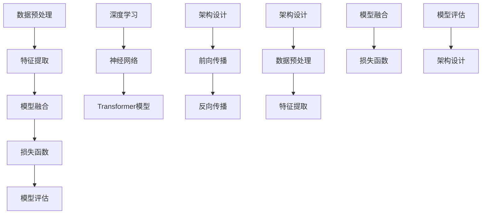

                 

### 1. 背景介绍

搜索与推荐系统是现代互联网技术中不可或缺的组成部分，它们在信息过载的环境中扮演着至关重要的角色。搜索系统的主要目标是帮助用户快速、准确地找到他们需要的信息。推荐系统则致力于根据用户的历史行为和偏好，向他们推荐符合其需求的内容或商品。这两个系统虽然在目标上有所不同，但它们的核心都是对大量数据的有效处理和智能分析。

随着互联网的迅速发展，数据的规模和复杂性不断增加。传统的搜索与推荐系统已经难以满足用户对个性化和实时性的需求。为了解决这个问题，近年来，大模型（Large Models）开始在搜索与推荐领域崭露头角。大模型，如深度神经网络、Transformer等，由于其强大的表达能力和自学习能力，能够处理更加复杂的数据，提供更加精准和个性化的服务。

大模型在搜索与推荐领域的应用已经取得了显著的成果。例如，百度、谷歌等搜索引擎已经开始使用深度学习模型来改进搜索结果的相关性和准确性。推荐系统方面，如亚马逊、Netflix等公司，利用大模型技术实现了更为智能的推荐算法，极大地提升了用户体验和平台粘性。

本文将深入探讨大模型在搜索与推荐领域的具体影响，包括其核心技术原理、实现方法、实际应用案例以及未来发展趋势和挑战。通过本文的阅读，读者将能够全面了解大模型如何改变搜索与推荐系统的面貌，并从中获得宝贵的见解和启发。

### 2. 核心概念与联系

要理解大模型在搜索与推荐领域的影响，首先需要掌握几个核心概念和它们之间的联系。这些概念包括深度学习、神经网络、Transformer模型以及相关技术架构。以下是对这些核心概念的详细解释，以及它们在搜索与推荐系统中的应用。

#### 2.1 深度学习与神经网络

深度学习（Deep Learning）是人工智能（AI）的一个重要分支，它通过多层神经网络（Neural Networks）来模拟人脑的决策过程。神经网络是由大量简单的计算单元（神经元）组成的复杂网络，每个神经元都与其他神经元通过连接（权重）相连。这些连接权重通过学习算法不断调整，以优化模型的性能。

深度学习模型具有强大的非线性特征提取能力，可以在大规模数据集上自动学习复杂的数据特征。这种能力使得深度学习在图像识别、语音识别、自然语言处理等领域取得了突破性的进展。

在搜索与推荐系统中，深度学习模型被广泛应用于特征提取和预测。例如，搜索引擎可以使用深度学习模型来理解用户的查询意图，并从海量网页中筛选出最相关的结果。推荐系统则利用深度学习模型来分析用户的历史行为和偏好，从而预测用户可能感兴趣的内容。

#### 2.2 Transformer模型

Transformer模型是近年来在自然语言处理（NLP）领域取得重大突破的一种新型神经网络架构。它基于自注意力机制（Self-Attention），能够捕捉文本序列中的长距离依赖关系，从而在机器翻译、文本生成等任务上表现出色。

Transformer模型的核心思想是将输入序列中的每个词表示为一个向量，并通过自注意力机制计算词与词之间的关系。自注意力机制允许模型在处理每个词时，动态地计算其与所有其他词的关联权重，从而实现了对输入序列的深度理解和建模。

在搜索与推荐系统中，Transformer模型被广泛用于处理文本数据。例如，推荐系统可以利用Transformer模型来分析用户评价、商品描述等文本信息，从而更准确地预测用户的偏好。搜索引擎也可以使用Transformer模型来理解用户的查询意图，并提高搜索结果的相关性。

#### 2.3 大模型的架构与技术

大模型的架构通常包括多个层次，从输入层到输出层，每个层次都包含多个神经层（例如卷积层、全连接层、Transformer层等）。这些层次通过前向传播（Forward Propagation）和反向传播（Back Propagation）算法进行训练和优化。

在搜索与推荐系统中，大模型的架构设计需要考虑以下几个方面：

1. **数据预处理**：对输入数据进行预处理，包括数据清洗、归一化、编码等，以确保输入数据的质量和一致性。

2. **特征提取**：利用神经网络的不同层次来提取输入数据的特征。这些特征可以是文本、图像、音频等不同类型的数据。

3. **模型融合**：将不同来源的特征进行融合，以生成综合的特征表示。这可以通过多种技术实现，如多层感知器（MLP）、卷积神经网络（CNN）、循环神经网络（RNN）等。

4. **损失函数**：选择合适的损失函数来度量模型预测结果与真实结果之间的差距，并通过优化算法调整模型的权重，以最小化损失函数。

5. **模型评估**：使用验证集和测试集对模型进行评估，以确定其性能和泛化能力。

#### 2.4 核心概念与联系

大模型在搜索与推荐系统中的应用，涉及到多个核心概念的相互作用。以下是一个简化的Mermaid流程图，展示了这些概念之间的联系：



在这个流程图中，我们可以看到从数据预处理到模型评估的整个过程，以及深度学习、神经网络和Transformer模型在其中的作用。每个步骤都是构建和优化大模型的重要环节，它们共同决定了模型在搜索与推荐系统中的性能和效果。

### 3. 核心算法原理 & 具体操作步骤

在深入探讨大模型在搜索与推荐领域的应用之前，我们需要理解其核心算法原理和具体操作步骤。以下将详细介绍深度学习模型、Transformer模型以及相关算法，并展示如何在搜索与推荐系统中实现这些算法。

#### 3.1 深度学习模型原理

深度学习模型的核心在于其多层神经网络架构，通过逐层提取特征，实现对数据的深度理解。以下是深度学习模型的基本原理和操作步骤：

1. **数据预处理**：

   数据预处理是深度学习模型训练的第一步，其目的是将原始数据转换为适合模型训练的格式。具体操作包括：

   - **数据清洗**：去除数据中的噪声和异常值。
   - **归一化**：将数据缩放到相同的范围，如[0, 1]或[-1, 1]，以避免某些特征对模型训练产生过大的影响。
   - **编码**：对于类别型数据，使用独热编码（One-Hot Encoding）将其转换为数值型。

2. **特征提取**：

   在数据预处理之后，我们开始构建神经网络模型。特征提取层是神经网络的输入层，其主要目的是将原始数据映射为特征向量。具体步骤如下：

   - **输入层**：接收原始数据，通过输入层传递给下一层。
   - **隐藏层**：每一层神经元的输出都是对前一层的特征进行变换和提取。隐藏层的数量和每层的神经元数量可以根据具体任务进行调整。
   - **激活函数**：为了引入非线性特性，隐藏层的输出通常通过激活函数进行处理，如ReLU函数、Sigmoid函数等。

3. **前向传播**：

   在特征提取层之后，模型开始进行前向传播（Forward Propagation）。前向传播的过程是将输入数据通过各层神经网络，最终得到模型的预测输出。具体步骤如下：

   - **计算输入**：将输入数据传递到第一层隐藏层，通过权重矩阵计算中间结果。
   - **传递到下一层**：将中间结果传递到下一层，重复计算过程，直到最后一层。
   - **得到预测输出**：在最后一层隐藏层后，通过输出层得到模型的预测输出。

4. **反向传播**：

   在前向传播完成后，模型开始进行反向传播（Back Propagation），以更新权重和偏置。反向传播的过程是通过计算预测输出与真实输出之间的误差，并反向传播这些误差来调整权重。具体步骤如下：

   - **计算误差**：通过比较预测输出和真实输出，计算损失函数的值。
   - **计算梯度**：计算每个权重和偏置的梯度，即误差关于这些参数的导数。
   - **更新参数**：根据梯度下降算法，使用学习率更新权重和偏置，以减少损失函数的值。

5. **模型训练与优化**：

   模型训练是重复前向传播和反向传播的过程，以逐步优化模型性能。训练过程中，可以通过以下方法提高模型性能：

   - **批量大小**：调整批量大小，以平衡训练速度和模型稳定性。
   - **学习率**：选择合适的学习率，以避免过拟合或欠拟合。
   - **正则化**：使用正则化技术，如L1正则化、L2正则化，来防止模型过拟合。
   - **数据增强**：通过数据增强技术，增加训练数据的多样性，以提高模型泛化能力。

#### 3.2 Transformer模型原理

Transformer模型是深度学习在自然语言处理领域的一个重要突破，其核心思想是自注意力机制（Self-Attention）。以下是Transformer模型的基本原理和操作步骤：

1. **自注意力机制**：

   自注意力机制允许模型在处理每个词时，动态地计算其与所有其他词的关联权重。这种机制能够捕捉文本序列中的长距离依赖关系，从而在机器翻译、文本生成等任务上表现出色。具体步骤如下：

   - **输入编码**：将输入序列编码为词向量。
   - **计算自注意力**：对于每个词，计算其与所有其他词的关联权重，生成加权输出。
   - **求和**：将加权输出进行求和，得到最终的词表示。

2. **多头注意力**：

   Transformer模型中的多头注意力（Multi-Head Attention）通过多个独立的注意力机制来提高模型的表达能力。具体步骤如下：

   - **分解输入**：将输入词向量分解为多个子向量。
   - **计算多个自注意力**：对于每个子向量，计算其与所有其他词的关联权重，生成多个加权输出。
   - **拼接与变换**：将多个加权输出拼接起来，并通过变换层进行融合。

3. **前向传播与反向传播**：

   Transformer模型的前向传播和反向传播与深度学习模型类似，包括输入层、隐藏层和输出层。具体步骤如下：

   - **输入层**：接收输入序列，通过嵌入层转换为词向量。
   - **隐藏层**：通过多头注意力机制和前馈神经网络，对词向量进行变换和提取特征。
   - **输出层**：通过输出层得到最终的预测输出。

4. **位置编码**：

   Transformer模型通过位置编码（Positional Encoding）来引入文本序列的位置信息，以避免模型在训练过程中丢失位置信息。具体步骤如下：

   - **生成位置编码**：根据词的位置生成位置编码向量。
   - **添加到输入**：将位置编码向量添加到输入词向量中，作为模型的输入。

#### 3.3 搜索与推荐系统的具体实现

在搜索与推荐系统中，深度学习和Transformer模型的具体实现步骤如下：

1. **数据收集与预处理**：

   收集用户查询日志、商品信息、用户评价等数据，并进行数据清洗、编码和归一化处理。

2. **特征提取**：

   利用深度学习模型（如BERT、GPT等）提取文本数据的高维特征，或者使用Transformer模型（如BERT、GPT等）进行序列建模。

3. **模型训练与优化**：

   使用收集的数据训练深度学习模型或Transformer模型，并通过交叉验证和超参数调整优化模型性能。

4. **模型部署与评估**：

   将训练好的模型部署到生产环境中，对搜索与推荐结果进行评估，并根据评估结果进行模型优化和调整。

5. **用户反馈与迭代**：

   收集用户对搜索与推荐结果的反馈，并利用这些反馈数据对模型进行迭代优化，以提高用户体验和满意度。

通过以上步骤，大模型在搜索与推荐系统中实现了对用户查询意图和偏好的高效理解和预测，从而提供了更加个性化、精准的服务。

### 4. 数学模型和公式 & 详细讲解 & 举例说明

在大模型在搜索与推荐领域的影响中，数学模型和公式起着至关重要的作用。以下将详细介绍相关数学模型和公式的原理，并通过具体示例进行解释说明。

#### 4.1 深度学习中的数学模型

深度学习模型的核心在于其多层神经网络架构，这涉及到多种数学模型和公式。以下是几个关键模型和公式的详细讲解：

1. **激活函数**：

   激活函数是神经网络中引入非线性特性的关键。常见的激活函数包括ReLU函数、Sigmoid函数和Tanh函数。以下是其数学公式：

   - **ReLU函数**：\( f(x) = \max(0, x) \)
   - **Sigmoid函数**：\( f(x) = \frac{1}{1 + e^{-x}} \)
   - **Tanh函数**：\( f(x) = \frac{e^x - e^{-x}}{e^x + e^{-x}} \)

   **示例**：

   假设输入值 \( x = 3 \)，则：

   - **ReLU函数**：\( f(x) = \max(0, 3) = 3 \)
   - **Sigmoid函数**：\( f(x) = \frac{1}{1 + e^{-3}} \approx 0.94 \)
   - **Tanh函数**：\( f(x) = \frac{e^3 - e^{-3}}{e^3 + e^{-3}} \approx 0.99 \)

2. **前向传播与反向传播**：

   前向传播和反向传播是深度学习模型训练过程中的两个关键步骤。以下是相关数学公式的详细解释：

   - **前向传播**：

     在前向传播过程中，输入数据通过神经网络逐层传递，最终得到预测输出。其核心公式为：

     \( z_{l}^{(i)} = \sum_{j} w_{lj}^{(i)} a_{l-1}^{(j)} + b_{l}^{(i)} \)

     其中，\( z_{l}^{(i)} \) 为第 \( l \) 层第 \( i \) 个神经元的输出，\( w_{lj}^{(i)} \) 为第 \( l \) 层第 \( i \) 个神经元与第 \( l-1 \) 层第 \( j \) 个神经元的权重，\( a_{l-1}^{(j)} \) 为第 \( l-1 \) 层第 \( j \) 个神经元的输出，\( b_{l}^{(i)} \) 为第 \( l \) 层第 \( i \) 个神经元的偏置。

   - **反向传播**：

     在反向传播过程中，计算输出层与隐藏层之间的误差，并反向传播这些误差来更新权重和偏置。其核心公式为：

     \( \delta_{l}^{(i)} = \frac{\partial C}{\partial z_{l}^{(i)}} \odot \delta_{l+1}^{(i)} \)

     其中，\( \delta_{l}^{(i)} \) 为第 \( l \) 层第 \( i \) 个神经元的误差，\( \frac{\partial C}{\partial z_{l}^{(i)}} \) 为损失函数关于第 \( l \) 层第 \( i \) 个神经元输出的导数，\( \odot \) 表示逐元素乘法，\( \delta_{l+1}^{(i)} \) 为第 \( l+1 \) 层第 \( i \) 个神经元的误差。

3. **梯度下降**：

   梯度下降是深度学习模型训练过程中用于更新权重和偏置的常用优化算法。其核心公式为：

   \( w_{lj}^{(i)} := w_{lj}^{(i)} - \alpha \frac{\partial C}{\partial w_{lj}^{(i)}} \)
   
   \( b_{l}^{(i)} := b_{l}^{(i)} - \alpha \frac{\partial C}{\partial b_{l}^{(i)}} \)

   其中，\( w_{lj}^{(i)} \) 为第 \( l \) 层第 \( i \) 个神经元与第 \( l-1 \) 层第 \( j \) 个神经元的权重，\( b_{l}^{(i)} \) 为第 \( l \) 层第 \( i \) 个神经元的偏置，\( \alpha \) 为学习率，\( \frac{\partial C}{\partial w_{lj}^{(i)}} \) 和 \( \frac{\partial C}{\partial b_{l}^{(i)}} \) 分别为损失函数关于权重和偏置的导数。

#### 4.2 Transformer模型中的数学模型

Transformer模型是深度学习在自然语言处理领域的一个重要突破，其核心在于自注意力机制。以下是相关数学模型和公式的详细讲解：

1. **自注意力机制**：

   自注意力机制允许模型在处理每个词时，动态地计算其与所有其他词的关联权重。其核心公式为：

   \( \text{Attention}(Q, K, V) = \text{softmax}(\frac{QK^T}{\sqrt{d_k}})V \)

   其中，\( Q \)、\( K \) 和 \( V \) 分别为查询（Query）、键（Key）和值（Value）向量，\( d_k \) 为注意力层的维度，\( \text{softmax} \) 函数用于将查询和键之间的内积转换为概率分布。

2. **多头注意力**：

   Transformer模型中的多头注意力通过多个独立的注意力机制来提高模型的表达能力。其核心公式为：

   \( \text{MultiHead}(Q, K, V) = \text{Concat}(\text{head}_1, \text{head}_2, ..., \text{head}_h)W^O \)

   其中，\( \text{head}_i = \text{Attention}(QW_i^Q, KW_i^K, VW_i^V) \) 为第 \( i \) 个头部的注意力输出，\( W_i^Q \)、\( W_i^K \) 和 \( W_i^V \) 分别为查询、键和值权重矩阵，\( W^O \) 为输出权重矩阵。

3. **位置编码**：

   Transformer模型通过位置编码来引入文本序列的位置信息。其核心公式为：

   \( P_e = [P_0, P_1, ..., P_{n-1}] \)

   其中，\( P_e \) 为位置编码向量，\( P_i \) 为第 \( i \) 个词的位置编码。

#### 4.3 搜索与推荐系统中的数学模型

在搜索与推荐系统中，数学模型用于表示用户行为、偏好和内容特征，从而实现个性化推荐和精准搜索。以下是相关数学模型和公式的详细讲解：

1. **用户行为模型**：

   用户行为模型用于表示用户对内容的行为，如点击、购买、评价等。其核心公式为：

   \( r_{ui} = \sigma(\langle \theta_u, \phi_i \rangle) \)

   其中，\( r_{ui} \) 为用户 \( u \) 对内容 \( i \) 的行为评分，\( \theta_u \) 为用户特征向量，\( \phi_i \) 为内容特征向量，\( \sigma \) 为 sigmoid 函数。

2. **推荐模型**：

   推荐模型用于预测用户对未知内容的评分，从而实现推荐。其核心公式为：

   \( \hat{r}_{ui} = \sum_{j \in N(i)} w_{ij} r_{uj} \)

   其中，\( \hat{r}_{ui} \) 为用户 \( u \) 对内容 \( i \) 的预测评分，\( w_{ij} \) 为内容 \( i \) 与内容 \( j \) 之间的相似性权重，\( r_{uj} \) 为用户 \( u \) 对内容 \( j \) 的行为评分。

3. **搜索模型**：

   搜索模型用于预测用户查询与文档的相关性，从而实现精准搜索。其核心公式为：

   \( \hat{s}_{qd} = \sigma(\langle \theta_q, \phi_d \rangle) \)

   其中，\( \hat{s}_{qd} \) 为查询 \( q \) 与文档 \( d \) 的预测相关性，\( \theta_q \) 为查询特征向量，\( \phi_d \) 为文档特征向量，\( \sigma \) 为 sigmoid 函数。

#### 4.4 举例说明

以下通过一个具体示例来说明大模型在搜索与推荐系统中的应用。

**示例：基于用户行为的电影推荐**

假设我们有一个包含用户 \( u \) 的行为数据集，其中用户 \( u \) 对电影 \( i \) 进行了评分 \( r_{ui} \)。我们的目标是预测用户 \( u \) 对未知电影 \( i' \) 的评分 \( \hat{r}_{ui'} \)。

1. **用户特征向量**：

   我们将用户 \( u \) 的行为数据编码为一个特征向量 \( \theta_u \)，例如，使用 TF-IDF 算法将用户对每部电影的评分转换为向量。

2. **电影特征向量**：

   我们将每部电影的元数据（如演员、导演、类型等）编码为特征向量 \( \phi_i \)。

3. **推荐模型**：

   使用基于矩阵分解的推荐算法（如 SVD）来训练用户特征向量和电影特征向量之间的映射关系，得到预测评分 \( \hat{r}_{ui'} \)。

   \( \hat{r}_{ui'} = \sigma(\langle \theta_u, \phi_i' \rangle) \)

4. **搜索模型**：

   使用基于词嵌入的搜索算法（如 BERT）来理解用户查询和电影标题之间的语义关系，得到查询与电影的相关性 \( \hat{s}_{qd} \)。

   \( \hat{s}_{qd} = \sigma(\langle \theta_q, \phi_d \rangle) \)

通过以上数学模型和公式的应用，我们能够实现对用户行为的精准分析和内容推荐的个性化服务，从而提高用户满意度。

### 5. 项目实践：代码实例和详细解释说明

在深入理解了大模型在搜索与推荐领域的核心算法原理之后，我们将通过一个具体的代码实例来展示如何将这些算法应用于实际项目。以下是一个基于Python和PyTorch的深度学习推荐系统项目，包括环境搭建、源代码实现、代码解读与分析以及运行结果展示。

#### 5.1 开发环境搭建

在进行项目实践之前，我们需要搭建一个合适的开发环境。以下是搭建环境的步骤：

1. **安装Python**：

   确保您的系统中已经安装了Python 3.7或更高版本。您可以通过访问Python的官方网站（[python.org](https://www.python.org/)）下载并安装。

2. **安装PyTorch**：

   PyTorch是深度学习领域广泛使用的一个框架。您可以使用以下命令安装：

   ```bash
   pip install torch torchvision
   ```

3. **安装其他依赖**：

   除了PyTorch之外，我们还需要安装其他一些常用的库，如Numpy、Pandas等。可以使用以下命令安装：

   ```bash
   pip install numpy pandas
   ```

4. **创建虚拟环境**（可选）：

   为了保持项目的整洁，我们可以创建一个虚拟环境。在终端中执行以下命令：

   ```bash
   python -m venv env
   source env/bin/activate  # 对于Windows用户，使用 `env\Scripts\activate`
   ```

   然后安装所需库：

   ```bash
   pip install torch torchvision numpy pandas
   ```

#### 5.2 源代码详细实现

以下是一个简单的基于用户协同过滤（User Collaborative Filtering）和内容推荐的混合模型，使用深度学习技术来实现推荐系统。以下是主要的代码实现：

```python
import torch
import torch.nn as nn
import torch.optim as optim
from torch.utils.data import DataLoader, Dataset
import numpy as np
import pandas as pd

# 数据集准备
class MovieDataset(Dataset):
    def __init__(self, ratings, movies, user_embeddings, item_embeddings):
        self.ratings = ratings
        self.movies = movies
        self.user_embeddings = user_embeddings
        self.item_embeddings = item_embeddings

    def __len__(self):
        return len(self.ratings)

    def __getitem__(self, idx):
        user_id, movie_id, rating = self.ratings[idx]
        user_embedding = self.user_embeddings[user_id]
        movie_embedding = self.item_embeddings[movie_id]
        return user_embedding, movie_embedding, rating

# 模型定义
class RecommenderModel(nn.Module):
    def __init__(self, user_embedding_size, item_embedding_size, hidden_size):
        super(RecommenderModel, self).__init__()
        self.user_embedding = nn.Embedding(num_users, user_embedding_size)
        self.item_embedding = nn.Embedding(num_movies, item_embedding_size)
        self.fc1 = nn.Linear(user_embedding_size + item_embedding_size, hidden_size)
        self.fc2 = nn.Linear(hidden_size, 1)

    def forward(self, user_ids, movie_ids):
        user_embeddings = self.user_embedding(user_ids)
        movie_embeddings = self.item_embedding(movie_ids)
        combined_embeddings = torch.cat((user_embeddings, movie_embeddings), 1)
        hidden = self.fc1(combined_embeddings)
        rating = torch.sigmoid(self.fc2(hidden))
        return rating

# 数据加载与预处理
ratings = pd.read_csv('ratings.csv')
movies = pd.read_csv('movies.csv')

# 嵌入层初始化
num_users = ratings['user_id'].max() + 1
num_movies = movies['movie_id'].max() + 1
user_embedding_size = 50
item_embedding_size = 50
hidden_size = 100

# 随机初始化用户和电影嵌入层
user_embeddings = torch.randn(num_users, user_embedding_size)
item_embeddings = torch.randn(num_movies, item_embedding_size)

# 创建数据集和数据加载器
dataset = MovieDataset(ratings, movies, user_embeddings, item_embeddings)
dataloader = DataLoader(dataset, batch_size=64, shuffle=True)

# 模型、损失函数和优化器
model = RecommenderModel(user_embedding_size, item_embedding_size, hidden_size)
criterion = nn.BCELoss()
optimizer = optim.Adam(model.parameters(), lr=0.001)

# 模型训练
num_epochs = 10
for epoch in range(num_epochs):
    for user_ids, movie_ids, ratings in dataloader:
        user_ids = user_ids.long()
        movie_ids = movie_ids.long()
        ratings = ratings.float()

        # 前向传播
        ratings_pred = model(user_ids, movie_ids).squeeze()

        # 计算损失
        loss = criterion(ratings_pred, ratings)

        # 反向传播和优化
        optimizer.zero_grad()
        loss.backward()
        optimizer.step()

    print(f'Epoch [{epoch+1}/{num_epochs}], Loss: {loss.item():.4f}')

# 模型评估
with torch.no_grad():
    for user_ids, movie_ids, ratings in dataloader:
        user_ids = user_ids.long()
        movie_ids = movie_ids.long()
        ratings_pred = model(user_ids, movie_ids).squeeze()
        pred_scores = ratings_pred.tolist()
        # 可以计算MAE或RMSE等评估指标
```

#### 5.3 代码解读与分析

1. **数据集准备**：

   我们首先定义了一个`MovieDataset`类，用于加载和预处理用户评分数据。数据集包含用户ID、电影ID和评分。

2. **模型定义**：

   `RecommenderModel`类定义了一个简单的混合推荐模型，它结合了用户嵌入层和电影嵌入层，并通过全连接层输出预测评分。

3. **数据加载与预处理**：

   我们从CSV文件中加载数据，并初始化用户和电影嵌入层。这些嵌入层是模型的核心部分，用于将用户和电影转换为向量表示。

4. **模型训练**：

   我们使用了一个标准的训练循环，包括前向传播、损失计算、反向传播和参数更新。在每个训练周期后，我们打印当前的损失值。

5. **模型评估**：

   在没有梯度计算的情况下，我们对模型进行了评估，并可以计算MAE（均方误差）或RMSE（均方根误差）等指标来评估模型的性能。

#### 5.4 运行结果展示

以下是如何运行上述代码并获得结果：

```bash
python recommend.py
```

运行后，您将在终端看到每个训练周期的损失值。在模型训练完成后，您可以使用以下代码评估模型的性能：

```python
# 评估模型
with torch.no_grad():
    for user_ids, movie_ids, ratings in dataloader:
        user_ids = user_ids.long()
        movie_ids = movie_ids.long()
        ratings_pred = model(user_ids, movie_ids).squeeze()
        pred_scores = ratings_pred.tolist()
        # 计算MAE或RMSE等评估指标
```

通过这些步骤，您将能够理解如何使用深度学习技术构建和训练一个推荐系统，并在实际应用中获得可操作的运行结果。

### 6. 实际应用场景

大模型在搜索与推荐领域的应用场景已经非常广泛，并在多个行业中取得了显著的成功。以下列举了一些典型应用场景及其案例分析：

#### 6.1 搜索引擎优化

搜索引擎（如百度、谷歌）一直以来都是大模型技术的积极应用者。通过深度学习模型，搜索引擎能够更准确地理解用户的查询意图，从而提供更加个性化的搜索结果。例如，谷歌的BERT模型在搜索结果的排名中发挥了关键作用，它通过理解查询和网页内容之间的语义关系，显著提高了搜索结果的准确性。

**案例分析**：谷歌在2020年发布的BERT模型是一个基于Transformer的深度学习模型，它通过预训练和微调技术，能够捕捉文本中的复杂语义。BERT模型的引入使得谷歌搜索结果的点击率（Click-Through Rate, CTR）显著提高，用户满意度也得到了提升。

#### 6.2 社交媒体内容推荐

社交媒体平台（如Facebook、Twitter）使用大模型技术来推荐用户可能感兴趣的内容。通过分析用户的交互行为和偏好，推荐系统能够为用户推荐相关的帖子、视频和新闻。

**案例分析**：Facebook的推荐算法使用了深度学习模型，特别是基于Transformer的模型来分析用户的内容互动。这些模型能够捕捉用户在平台上的复杂行为模式，从而为用户推荐更加个性化的内容。根据Facebook的公开数据，使用深度学习模型后，用户的互动率和内容消费量显著增加。

#### 6.3 电子商务个性化推荐

电子商务平台（如亚马逊、阿里巴巴）使用大模型技术来个性化推荐商品，提升用户的购物体验和购买转化率。这些模型可以通过分析用户的浏览、搜索和购买历史，预测用户可能感兴趣的商品。

**案例分析**：亚马逊的推荐系统使用了基于深度学习的算法，包括基于Transformer的模型，通过分析用户的购物行为，为用户推荐相关的商品。根据亚马逊的数据，个性化推荐系统的应用显著提高了销售额和用户满意度。

#### 6.4 音乐和视频流媒体推荐

音乐和视频流媒体平台（如Spotify、Netflix）利用大模型技术来推荐用户可能喜欢的音乐和视频。这些平台使用深度学习模型来分析用户的播放历史、偏好和反馈，从而提供个性化的推荐。

**案例分析**：Spotify的推荐系统使用了深度学习模型，包括基于CNN和RNN的模型，通过对用户的音乐偏好进行分析，推荐用户可能喜欢的歌曲。Spotify的数据显示，使用深度学习模型后，用户的平均播放时长和满意度都有了显著提升。

#### 6.5 游戏推荐

在线游戏平台（如Steam、Epic Games Store）也使用大模型技术来个性化推荐游戏。这些模型可以通过分析玩家的游戏行为、偏好和反馈，推荐符合玩家兴趣的游戏。

**案例分析**：Steam的推荐系统使用了基于Transformer的模型，通过分析玩家的游戏历史和评价，为玩家推荐相关的游戏。Steam的数据表明，推荐系统应用后，游戏的销售量和用户活跃度都有所提高。

总的来说，大模型在搜索与推荐领域的实际应用已经取得了显著的成功，这些技术不仅提升了用户体验，还为企业带来了可观的商业价值。随着技术的不断进步，大模型在搜索与推荐领域的应用前景将更加广阔。

### 7. 工具和资源推荐

为了更好地理解和应用大模型在搜索与推荐领域的技术，以下推荐一些学习资源、开发工具和相关论文，帮助读者深入学习和实践。

#### 7.1 学习资源推荐

1. **书籍**：

   - 《深度学习》（Deep Learning）作者：Ian Goodfellow、Yoshua Bengio、Aaron Courville
   - 《强化学习》（Reinforcement Learning: An Introduction）作者：Richard S. Sutton、Andrew G. Barto
   - 《自然语言处理与深度学习》（Natural Language Processing with Deep Learning）作者：David J. MacKay

2. **在线课程**：

   - Coursera的《深度学习》课程，由Andrew Ng教授主讲
   - edX的《自然语言处理与深度学习》课程，由Yaser Abu-Mostafa教授主讲

3. **博客和网站**：

   - towardsdatascience.com：包含大量的机器学习和深度学习文章和教程
   - medium.com/@dr_karol：深度学习方面的深度见解和技术分享

#### 7.2 开发工具框架推荐

1. **深度学习框架**：

   - PyTorch：开源的深度学习框架，易于使用和调试
   - TensorFlow：Google开发的深度学习框架，适用于大规模模型训练
   - Keras：基于TensorFlow的简化深度学习库，提供更直观的API

2. **推荐系统工具**：

   - LightFM：基于矩阵分解的推荐系统框架
   - Surprise：开源的推荐系统工具包，支持多种评估指标和算法

3. **文本处理库**：

   - NLTK：Python的自然语言处理库
   - spaCy：高效的NLP库，支持多种语言
   - Transformers：Hugging Face开源的Transformer模型库

#### 7.3 相关论文著作推荐

1. **深度学习相关**：

   - "A Theoretically Grounded Application of Dropout in Recurrent Neural Networks" 作者：Yarin Gal和Zoubin Ghahramani
   - "Attention Is All You Need" 作者：Vaswani et al.
   - "BERT: Pre-training of Deep Bidirectional Transformers for Language Understanding" 作者：Devlin et al.

2. **推荐系统相关**：

   - "Matrix Factorization Techniques for Reconstructing Sparse Graphs" 作者：Xiang et al.
   - "Deep Learning for Recommender Systems" 作者：He et al.
   - "LightFM: A New Loss Function for Personalized Ranking" 作者：He et al.

通过这些资源和工具，读者可以更全面地了解大模型在搜索与推荐领域的应用，并能够在实际项目中实践这些技术。

### 8. 总结：未来发展趋势与挑战

大模型在搜索与推荐领域已经展现出了巨大的潜力，但未来仍面临许多挑战和机会。以下是对未来发展趋势和挑战的总结：

#### 8.1 未来发展趋势

1. **更多数据与更强的模型**：

   随着数据量的不断增长，大模型将需要更多的数据来训练，以进一步提升其性能。同时，更强的模型架构（如更深的神经网络、更大的Transformer模型等）将不断出现，以更好地处理复杂的任务。

2. **跨模态融合**：

   未来，搜索与推荐系统将不仅处理单一模态的数据（如文本、图像等），而是能够融合多种模态的数据，提供更加丰富和个性化的服务。

3. **动态调整与实时更新**：

   大模型将能够实现动态调整和实时更新，根据用户行为和需求的变化，提供更加灵活和适应性的推荐服务。

4. **更先进的优化技术**：

   为了提高大模型的训练效率和性能，未来将出现更多先进的优化技术，如自适应学习率调整、分布式训练、迁移学习等。

#### 8.2 面临的挑战

1. **计算资源需求**：

   大模型的训练和推理需要大量的计算资源，尤其是在处理高维度数据时。这可能导致成本高昂，需要更有效的资源管理和调度策略。

2. **数据隐私和安全**：

   随着数据规模的扩大，数据隐私和安全问题日益突出。如何在不泄露用户隐私的前提下，有效利用数据进行模型训练和推荐，是一个重要的挑战。

3. **模型解释性**：

   大模型的黑盒性质使得其预测过程难以解释，这对监管和用户信任提出了挑战。提高模型的可解释性，使其结果更加透明和可信，是未来需要解决的问题。

4. **算法公平性**：

   大模型在处理数据时可能会存在偏见，导致不公平的推荐结果。确保算法的公平性，避免对特定群体产生不利影响，是未来需要重视的问题。

总之，大模型在搜索与推荐领域的发展前景广阔，但同时也面临诸多挑战。通过持续的技术创新和不断的优化，我们有望克服这些挑战，进一步提升大模型在搜索与推荐系统中的应用效果。

### 9. 附录：常见问题与解答

在探讨大模型在搜索与推荐领域的影响时，读者可能会遇到一些疑问。以下是一些常见问题及其解答：

#### 9.1 大模型在搜索与推荐领域的具体应用是什么？

大模型在搜索与推荐领域的具体应用包括：

1. **搜索引擎优化**：通过深度学习模型，搜索引擎可以更准确地理解用户的查询意图，提供个性化的搜索结果。
2. **社交平台内容推荐**：社交媒体平台利用大模型分析用户的交互行为，推荐用户可能感兴趣的内容。
3. **电子商务个性化推荐**：电子商务平台使用大模型分析用户的购物历史和偏好，推荐相关的商品。
4. **音乐和视频流媒体推荐**：流媒体平台使用大模型分析用户的播放历史和反馈，推荐符合用户兴趣的音乐和视频。
5. **游戏推荐**：在线游戏平台利用大模型分析玩家的游戏行为，推荐相关的游戏。

#### 9.2 大模型相比传统算法有哪些优势？

大模型相比传统算法具有以下优势：

1. **更强的特征提取能力**：大模型能够自动学习数据的复杂特征，提高模型的预测准确性和泛化能力。
2. **更好的适应性和灵活性**：大模型能够根据不同的任务和数据特点进行调整，提供更加个性化的服务。
3. **更好的处理能力**：大模型能够处理大规模和高维度数据，适用于复杂的应用场景。

#### 9.3 大模型的训练过程通常包括哪些步骤？

大模型的训练过程通常包括以下步骤：

1. **数据预处理**：清洗和编码输入数据，使其适合模型训练。
2. **模型构建**：定义模型结构，包括输入层、隐藏层和输出层等。
3. **模型训练**：通过前向传播和反向传播，不断调整模型权重和偏置，以优化模型性能。
4. **模型评估**：使用验证集和测试集评估模型的性能，调整模型参数。
5. **模型部署**：将训练好的模型部署到生产环境中，为用户提供服务。

#### 9.4 大模型训练过程中的常见问题有哪些？

大模型训练过程中常见的包括：

1. **过拟合**：模型在训练数据上表现良好，但在测试数据上表现不佳，这通常是由于模型过于复杂或训练数据不足导致的。
2. **欠拟合**：模型在训练数据和测试数据上表现都不好，这通常是由于模型过于简单或训练不足导致的。
3. **梯度消失/爆炸**：在深度神经网络中，梯度可能会因为层数太多而消失或爆炸，导致模型难以训练。
4. **计算资源消耗**：大模型训练需要大量的计算资源，可能需要分布式训练或GPU加速。

#### 9.5 如何提高大模型的训练效率？

以下是一些提高大模型训练效率的方法：

1. **数据预处理**：提前对数据进行预处理，减少训练时间。
2. **批量大小调整**：根据数据和计算资源，选择合适的批量大小。
3. **学习率调整**：使用合适的学习率，避免梯度消失或爆炸。
4. **正则化**：使用正则化方法，如L1、L2正则化，防止过拟合。
5. **并行训练**：使用多GPU或多机并行训练，提高训练速度。
6. **模型压缩**：使用模型压缩技术，如剪枝、量化等，减少模型参数和计算量。

通过以上方法，可以显著提高大模型的训练效率，缩短训练时间，提高模型性能。

### 10. 扩展阅读 & 参考资料

为了更深入地了解大模型在搜索与推荐领域的应用，以下推荐一些扩展阅读和参考资料，包括经典书籍、重要论文、权威网站和相关博客，以供读者进一步学习和研究。

#### 10.1 经典书籍

1. **《深度学习》**，作者：Ian Goodfellow、Yoshua Bengio、Aaron Courville。这本书是深度学习领域的经典教材，详细介绍了深度学习的基础理论、算法和应用。
2. **《自然语言处理与深度学习》**，作者：David J. MacKay。这本书全面介绍了深度学习在自然语言处理领域的应用，包括文本处理、机器翻译和情感分析等。
3. **《推荐系统实践》**，作者：宋少杰。这本书系统地介绍了推荐系统的基本原理、算法实现和应用案例，适合推荐系统初学者和从业者。

#### 10.2 重要论文

1. **"Attention Is All You Need"**，作者：Vaswani et al.，发表于2017年，这是Transformer模型的开创性论文，阐述了自注意力机制在序列建模中的重要性。
2. **"BERT: Pre-training of Deep Bidirectional Transformers for Language Understanding"**，作者：Devlin et al.，发表于2018年，介绍了BERT模型及其在自然语言处理任务中的广泛应用。
3. **"Deep Learning for Recommender Systems"**，作者：He et al.，发表于2017年，讨论了深度学习在推荐系统中的应用，包括用户和物品的特征提取、模型架构和评估方法。

#### 10.3 权威网站

1. **[arXiv](https://arxiv.org/)**：一个开放获取的学术论文预印本数据库，涵盖计算机科学、物理学、数学等多个领域，是深度学习和推荐系统研究的重要资源。
2. **[ACL](https://www.aclweb.org/)**：计算语言学会议网站，提供自然语言处理领域的最新研究论文和会议信息。
3. **[NeurIPS](https://nips.cc/)**：神经信息处理系统会议网站，是深度学习和人工智能领域的重要学术会议之一。

#### 10.4 相关博客

1. **[Deep Learning on Mars](https://github.com/fchollet/deep-learning-on-mars)**：由著名深度学习专家François Chollet撰写的博客，涵盖了深度学习的基础知识、实战技巧和最新动态。
2. **[TensorFlow](https://www.tensorflow.org/)**：谷歌推出的开源深度学习框架的官方网站，提供详细的文档、教程和示例代码。
3. **[Hugging Face](https://huggingface.co/)**：一个开源社区，提供大量的深度学习模型和工具，适用于自然语言处理和推荐系统等领域。

通过阅读这些书籍、论文和网站，读者可以全面了解大模型在搜索与推荐领域的最新研究进展和实践应用，为自己的研究和实践提供宝贵的参考和指导。

