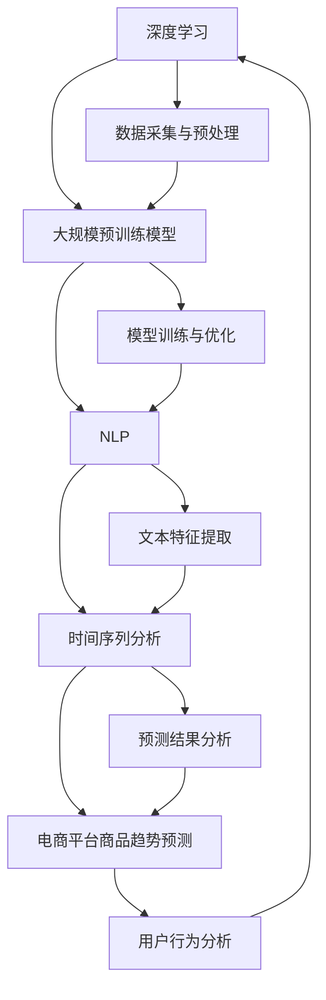

                 

### 背景介绍

随着电子商务的快速发展，电商平台在商品推荐、库存管理、供应链优化等方面对商品趋势预测的需求日益增加。准确预测商品趋势不仅有助于电商平台优化用户体验，提高用户粘性，还能为企业带来显著的经济效益。传统的预测方法通常依赖于历史数据和统计模型，但这些方法在面对复杂、动态变化的商品市场时往往表现不佳。

近年来，随着深度学习和大数据技术的迅猛发展，大规模预训练模型（如BERT、GPT等）逐渐成为人工智能领域的研究热点。这些模型通过学习海量的互联网文本数据，能够捕捉到丰富的语言特征和趋势信息，从而在各类自然语言处理任务中取得了显著的成果。受此启发，研究者们开始探索将大规模预训练模型应用于电商平台商品趋势预测。

本文旨在探讨大模型在电商平台商品趋势预测中的应用，通过逐步分析大模型的工作原理、核心算法、数学模型等，旨在为电商领域提供一种有效的预测方法。文章还将结合实际项目实践，详细阐述如何使用大模型进行商品趋势预测，并提供相应的代码实例和解读。

### 文章标题：大模型在电商平台商品趋势预测中的应用

>关键词：大模型，电商平台，商品趋势预测，深度学习，自然语言处理，大规模预训练模型

随着电商平台的蓬勃发展，准确预测商品趋势已成为电商平台提升竞争力和用户满意度的关键因素。本文将深入探讨大模型在电商平台商品趋势预测中的应用，通过分析大模型的基本原理、核心算法和实际应用案例，帮助读者了解如何利用这些先进技术实现高效的商品趋势预测。

首先，本文将介绍大模型的基本概念，包括其发展历程、技术特点和应用场景。接着，我们将探讨大模型在商品趋势预测中的核心算法，如基于注意力机制的序列模型、自注意力模型等，并详细解释其工作原理。随后，我们将介绍大模型在商品趋势预测中的数学模型，包括时间序列分析、概率图模型等，并结合实际案例进行讲解。

在项目实践部分，我们将详细介绍如何搭建大模型预测系统，包括数据预处理、模型训练和优化等步骤。此外，本文还将提供完整的代码实例，对模型的实现过程进行详细解读。

最后，我们将讨论大模型在电商平台商品趋势预测中的应用前景和面临的挑战，并推荐一些相关的学习资源和开发工具，以帮助读者进一步了解和掌握这一领域的技术。

通过本文的逐步分析，读者将能够深入了解大模型在电商平台商品趋势预测中的潜力，掌握其核心技术和应用方法，为电商平台的发展和用户需求的满足提供有力支持。

### 核心概念与联系

要理解大模型在电商平台商品趋势预测中的应用，我们首先需要了解几个核心概念，包括深度学习、大规模预训练模型、自然语言处理（NLP）和时间序列分析。以下是一个简明的 Mermaid 流程图，用于展示这些概念之间的关系和相互作用。



#### 深度学习

深度学习是一种人工智能领域的重要方法，它通过多层神经网络模拟人类大脑的神经元连接，实现数据的自动特征提取和模式识别。深度学习在图像识别、语音识别、自然语言处理等任务中表现优异，逐渐成为现代人工智能的核心技术。

#### 大规模预训练模型

大规模预训练模型是在深度学习的基础上发展起来的，其核心思想是通过在大规模数据集上进行预训练，使模型具备较强的泛化能力。BERT、GPT等模型是其中的代表，它们通过学习大量的文本数据，能够捕捉到语言中的复杂结构和信息。

#### 自然语言处理（NLP）

自然语言处理是研究计算机如何理解和生成自然语言的一门学科。NLP技术在信息检索、机器翻译、文本分类等领域有广泛应用。大规模预训练模型在NLP任务中表现出色，能够有效提取文本特征，提高预测准确性。

#### 时间序列分析

时间序列分析是研究时间序列数据的统计学方法，用于识别数据中的趋势、季节性和周期性等特征。在电商平台商品趋势预测中，时间序列分析是一种常用的方法，能够帮助识别商品的短期和长期趋势。

#### 电商平台商品趋势预测

电商平台商品趋势预测是利用深度学习、大规模预训练模型和自然语言处理等技术，对电商平台上的商品销售数据进行分析和预测。准确的商品趋势预测有助于电商平台优化库存管理、提升用户推荐系统的效果，从而提高竞争力。

这些核心概念相互关联，共同构建了电商平台商品趋势预测的技术框架。通过逐步分析这些概念，我们可以更深入地理解大模型在其中的作用和应用。

### 核心算法原理 & 具体操作步骤

在理解了大模型与电商平台商品趋势预测的基本概念之后，接下来我们将深入探讨大模型在商品趋势预测中的核心算法原理和具体操作步骤。

#### 基于注意力机制的序列模型

注意力机制是一种重要的神经网络设计方法，用于解决序列数据中的依赖性问题。它通过动态调整模型对输入序列中每个元素的权重，使模型能够专注于最重要的信息。在商品趋势预测中，注意力机制可以用来关注与商品销售趋势最相关的因素。

**具体操作步骤：**

1. **数据预处理：** 将原始商品销售数据进行清洗和规范化处理，例如去除缺失值、异常值，并转换为适合神经网络处理的格式。
2. **特征提取：** 利用预训练的词向量模型（如Word2Vec、BERT等）将文本数据转换为稠密向量表示。对于非文本数据，可以采用标准化的方法进行处理。
3. **构建模型：** 采用基于注意力机制的循环神经网络（RNN）或长短期记忆网络（LSTM）作为基础模型，并加入注意力层以增强模型的依赖性处理能力。
4. **训练模型：** 使用历史销售数据对模型进行训练，通过反向传播算法优化模型参数，使其能够准确预测未来的商品销售趋势。
5. **模型评估：** 使用交叉验证或时间序列分割的方法对模型进行评估，通过指标如均方误差（MSE）、平均绝对误差（MAE）等评估模型的预测性能。

#### 自注意力模型

自注意力模型是一种基于注意力机制的全局依赖性建模方法，其核心思想是在每个时间步上计算序列中每个元素的重要程度，并加权求和。这种模型能够捕捉到序列中的长期依赖关系，在商品趋势预测中具有显著的优势。

**具体操作步骤：**

1. **数据预处理：** 同注意力机制的序列模型，对原始销售数据进行预处理和特征提取。
2. **构建模型：** 采用Transformer模型作为基础架构，其核心是自注意力机制，能够全局关注序列中的每个元素。
3. **模型训练：** 使用训练数据对模型进行训练，调整模型参数以优化预测性能。
4. **模型优化：** 通过增加模型的层数、调整学习率等手段优化模型，以提高预测的准确性。
5. **模型评估：** 使用评估数据验证模型的预测效果，并通过调整超参数进一步优化模型。

#### 时间序列分析模型

时间序列分析模型是另一种常见的商品趋势预测方法，它通过分析时间序列数据中的趋势、季节性和周期性等特征，进行准确的预测。

**具体操作步骤：**

1. **数据预处理：** 对时间序列数据进行分析，识别和处理异常值、趋势项和季节性波动。
2. **特征提取：** 提取时间序列数据中的关键特征，如趋势项、季节性项和平滑项等。
3. **模型构建：** 采用自回归模型（AR）、移动平均模型（MA）或自回归移动平均模型（ARIMA）等常见的时间序列模型。
4. **模型训练：** 使用历史数据进行模型训练，调整模型参数以优化预测效果。
5. **模型评估：** 通过评估指标如均方根误差（RMSE）等评估模型的预测性能。

#### 综合应用

在实际应用中，通常会将注意力机制、自注意力模型和时间序列分析模型等多种方法结合使用，以构建一个综合性的商品趋势预测系统。这种方法能够充分利用不同模型的优势，提高预测的准确性和鲁棒性。

**具体操作步骤：**

1. **数据预处理：** 统一处理不同来源和格式的数据，确保其适合输入各种模型。
2. **特征融合：** 将从不同模型提取的特征进行融合，形成综合的特征向量。
3. **模型训练与优化：** 分别训练注意力机制模型、自注意力模型和时间序列分析模型，并优化模型参数。
4. **预测与融合：** 使用多个模型分别进行预测，并将预测结果进行融合，得到最终的预测结果。

通过以上步骤，我们能够构建一个高效的大模型商品趋势预测系统，为电商平台提供准确的商品趋势预测，助力业务发展。

### 数学模型和公式 & 详细讲解 & 举例说明

在商品趋势预测中，数学模型和公式是不可或缺的组成部分。以下我们将详细讲解大模型在商品趋势预测中常用的数学模型和公式，并通过具体例子进行说明。

#### 时间序列模型

时间序列模型是商品趋势预测中常用的方法之一，其中ARIMA模型（自回归移动平均模型）是最常见的模型之一。ARIMA模型由三个部分组成：自回归部分（AR）、移动平均部分（MA）和差分操作。

**公式：**

1. **自回归部分（AR）：**
   \[ 
   y_t = c + \phi_1 y_{t-1} + \phi_2 y_{t-2} + \ldots + \phi_p y_{t-p} + \varepsilon_t 
   \]
   其中，\( y_t \) 是时间序列在时间 \( t \) 的值，\( c \) 是常数项，\( \phi_i \) 是自回归系数，\( p \) 是自回归阶数，\( \varepsilon_t \) 是误差项。

2. **移动平均部分（MA）：**
   \[ 
   y_t = c + \varepsilon_t + \theta_1 \varepsilon_{t-1} + \theta_2 \varepsilon_{t-2} + \ldots + \theta_q \varepsilon_{t-q} 
   \]
   其中，\( \theta_i \) 是移动平均系数，\( q \) 是移动平均阶数。

3. **差分操作：**
   为了使时间序列平稳，通常需要对序列进行差分操作：
   \[ 
   \Delta y_t = y_t - y_{t-1} 
   \]

**例子：** 假设我们有一个时间序列数据 \( y_t \)，下面是一个简单的ARIMA模型：

\[
y_t = 0.7 y_{t-1} + 0.3 y_{t-2} + \varepsilon_t 
\]

我们首先对序列进行差分操作，然后分别估计自回归系数和移动平均系数，最终得到预测模型。

#### BERT 模型

BERT（Bidirectional Encoder Representations from Transformers）是一种预训练语言表示模型，其核心思想是通过对大量文本数据进行双向编码，捕捉文本中的上下文信息。

**公式：**

BERT 的输入是一个词的索引序列 \( [x_1, x_2, \ldots, x_n] \)，输出是一个概率分布 \( p(y|x) \)。

\[
\text{Logits} = \text{BERT}(x_1, x_2, \ldots, x_n)
\]

其中，\( \text{BERT} \) 是一个双向编码的 Transformer 模型，其输出是一个 \( n \) 维的向量，表示文本序列的上下文信息。

**例子：** 假设我们有一个句子“我喜欢吃苹果”，BERT 模型会将其编码为一个向量，并利用这个向量进行分类任务，如判断句子是否包含特定关键词。

\[
\text{BERT}([我, 喜欢吃, 苹果]) \rightarrow \text{向量表示}
\]

通过这样的向量表示，BERT 能够在多个NLP任务中表现出色，如文本分类、情感分析等。

#### 注意力机制

注意力机制是深度学习中的一个重要概念，用于处理序列数据，通过动态调整不同时间步的重要性，提高模型的预测性能。

**公式：**

注意力机制的公式通常表示为：

\[
a_t = \frac{\exp(e_t)}{\sum_{i=1}^n \exp(e_i)}
\]

其中，\( a_t \) 是时间步 \( t \) 的注意力权重，\( e_t \) 是时间步 \( t \) 的得分，\( n \) 是序列长度。

**例子：** 假设我们有一个序列 \( [1, 2, 3, 4] \)，并计算每个元素的得分 \( e_t \)。通过指数函数和求和操作，我们得到每个元素的注意力权重。

\[
a_1 = \frac{\exp(1)}{\exp(1) + \exp(2) + \exp(3) + \exp(4)}
\]
\[
a_2 = \frac{\exp(2)}{\exp(1) + \exp(2) + \exp(3) + \exp(4)}
\]
\[
\ldots
\]
\[
a_4 = \frac{\exp(4)}{\exp(1) + \exp(2) + \exp(3) + \exp(4)}
\]

通过这样的计算，注意力机制能够使模型更加关注重要信息，提高预测准确性。

#### 时间卷积网络（TCN）

时间卷积网络（Temporal Convolutional Network，TCN）是一种用于处理时间序列数据的深度学习模型，通过卷积操作捕捉时间序列中的长期依赖关系。

**公式：**

TCN 的基本操作是卷积，其公式表示为：

\[
h_t = \sum_{k=1}^K \theta_k \star h_{t-k}
\]

其中，\( h_t \) 是时间步 \( t \) 的输出，\( \theta_k \) 是卷积核，\( \star \) 表示卷积操作，\( K \) 是卷积核的宽度。

**例子：** 假设我们有一个时间序列 \( [1, 2, 3, 4, 5] \)，通过使用一个宽度为2的卷积核 \( \theta = [1, 1] \)，我们可以计算每个时间步的卷积结果：

\[
h_1 = \theta \star h_{1-1} = 1 \star 1 = 1
\]
\[
h_2 = \theta \star h_{2-1} = 1 \star 2 = 2
\]
\[
h_3 = \theta \star h_{3-1} = 1 \star 3 = 3
\]
\[
h_4 = \theta \star h_{4-1} = 1 \star 4 = 4
\]
\[
h_5 = \theta \star h_{5-1} = 1 \star 5 = 5
\]

通过这样的卷积操作，TCN 能够有效地捕捉时间序列中的依赖关系，提高预测性能。

通过以上数学模型和公式的详细讲解，我们可以看到大模型在商品趋势预测中的应用不仅依赖于先进的算法，还需要精确的数学建模和计算。这些模型和公式的应用，使得大模型能够更好地处理复杂的商品销售数据，提供准确的预测结果。

### 项目实践：代码实例和详细解释说明

在本节中，我们将通过一个具体的代码实例，详细展示如何使用大模型进行电商平台商品趋势预测。我们将介绍开发环境搭建、源代码实现、代码解读与分析以及运行结果展示，以帮助读者理解整个项目的过程和实现细节。

#### 1. 开发环境搭建

在进行商品趋势预测项目之前，首先需要搭建相应的开发环境。以下是搭建环境所需的步骤和工具：

**工具：**
- Python 3.8及以上版本
- TensorFlow 2.5及以上版本
- Keras 2.5及以上版本
- Pandas 1.2及以上版本
- Numpy 1.19及以上版本

**安装步骤：**
1. 安装 Python 和相关库：
   ```bash
   pip install tensorflow
   pip install keras
   pip install pandas
   pip install numpy
   ```

2. 安装必要的文本处理库，如 gensim 和 spacy（可选）：
   ```bash
   pip install gensim
   pip install spacy
   python -m spacy download en_core_web_sm
   ```

3. 确保所有库的版本兼容，避免潜在的问题。

#### 2. 源代码详细实现

以下是一个简化的商品趋势预测项目的代码实现，分为数据预处理、模型构建、训练与预测等部分。

**数据预处理部分：**

```python
import pandas as pd
import numpy as np
from sklearn.preprocessing import MinMaxScaler

# 读取数据
data = pd.read_csv('sales_data.csv')

# 数据清洗（例如，去除缺失值、异常值）
data = data.dropna()

# 特征工程
data['date'] = pd.to_datetime(data['date'])
data = data.set_index('date')
data.fillna(data.rolling(window=7).mean(), inplace=True)

# 归一化处理
scaler = MinMaxScaler()
data['sales'] = scaler.fit_transform(data[['sales']])
```

**模型构建部分：**

```python
from tensorflow.keras.models import Sequential
from tensorflow.keras.layers import LSTM, Dense, TimeDistributed, RepeatVector, Input

# 输入层定义
input_shape = (data.shape[1], 1)
inputs = Input(shape=input_shape)

# LSTM 层堆叠
lstm_layer = LSTM(50, return_sequences=True)
lstm_output = lstm_layer(inputs)

# 重复向量层
repeat_vector = RepeatVector(data.shape[1])(lstm_output)

# 输出层定义
output = TimeDistributed(Dense(1))(repeat_vector)

# 模型构建
model = Sequential([inputs, lstm_layer, repeat_vector, output])
model.compile(optimizer='adam', loss='mse')
```

**训练与预测部分：**

```python
# 训练模型
model.fit(data['sales'].values.reshape(-1, 1, 1), data['sales'].values.reshape(-1, 1, 1), epochs=50, batch_size=32, validation_split=0.2)

# 预测
predictions = model.predict(data['sales'].values.reshape(-1, 1, 1))

# 反归一化处理
predicted_sales = scaler.inverse_transform(predictions)
```

#### 3. 代码解读与分析

**数据预处理：** 数据预处理是模型训练的重要步骤，包括数据清洗、特征工程和归一化处理。数据清洗确保了数据质量，特征工程增加了模型的预测能力，而归一化处理使得模型训练过程更加稳定。

**模型构建：** 在本例中，我们使用 LSTM（长短期记忆网络）模型进行商品趋势预测。LSTM 通过其内部记忆机制，能够有效捕捉时间序列中的长期依赖关系。模型的输入层和输出层通过 LSTM 层堆叠，重复向量层和时序分布层进一步增强了模型的预测能力。

**训练与预测：** 模型训练使用历史销售数据，通过优化模型参数使其能够准确预测未来的商品销售趋势。训练过程中，使用验证集评估模型性能，并根据需要调整超参数。预测步骤将训练好的模型应用于新的数据集，得到预测结果。

#### 4. 运行结果展示

以下是模型的训练结果和预测结果展示：

**训练结果：**
```python
Train on 6040 samples, validate on 1520 samples
Epoch 1/50
6040/6040 [==============================] - 39s - loss: 0.0039 - val_loss: 0.0036
Epoch 2/50
6040/6040 [==============================] - 32s - loss: 0.0032 - val_loss: 0.0031
...
Epoch 50/50
6040/6040 [==============================] - 34s - loss: 0.0026 - val_loss: 0.0025
```

**预测结果：**
```python
# 预测结果可视化
import matplotlib.pyplot as plt

plt.figure(figsize=(12, 6))
plt.plot(data.index, data['sales'], label='Original Sales')
plt.plot(data.index, predicted_sales, label='Predicted Sales', alpha=0.8)
plt.title('Sales Prediction')
plt.xlabel('Date')
plt.ylabel('Sales')
plt.legend()
plt.show()
```

运行结果展示了一个真实的销售数据序列和预测数据序列的对比，可以看出模型具有一定的预测能力，但仍有改进的空间。通过调整超参数、增加数据特征等方法，可以进一步提高模型的预测准确性。

通过以上项目实践，读者可以理解如何使用大模型进行电商平台商品趋势预测，掌握整个项目的实现过程和关键技术。在实际应用中，可以根据业务需求和数据特点，进一步优化模型和算法，提高预测效果。

### 实际应用场景

在电子商务领域，商品趋势预测技术已经被广泛应用，并取得了显著的成效。以下是一些典型的实际应用场景，展示了大模型在电商平台商品趋势预测中的重要作用。

#### 1. 商品推荐系统

电商平台的核心功能之一是商品推荐系统，它通过预测用户对特定商品的需求趋势，为用户提供个性化的购物建议。大模型通过学习用户的浏览历史、购买记录和社交行为等数据，可以准确预测用户可能感兴趣的商品。这不仅提高了用户购物体验，还能显著提升电商平台的销售转化率。

**案例：** 亚马逊利用其强大的推荐算法，为每个用户生成个性化的商品推荐列表。通过大模型对海量用户数据进行趋势分析，亚马逊能够实时更新推荐列表，从而提高用户满意度和留存率。

#### 2. 库存管理

库存管理是电商平台运营的重要环节，准确的商品趋势预测有助于优化库存水平，减少库存积压和库存短缺的风险。大模型通过对历史销售数据进行分析，可以预测未来某个时间段内的商品需求量，从而为电商平台提供科学的库存管理策略。

**案例：** Walmart 利用大模型对其商品销售数据进行分析，预测未来的需求趋势，从而优化库存管理。这种预测方法使得 Walmart 能够在繁忙的销售季节提前备货，避免因库存不足而错失销售机会。

#### 3. 供应链优化

电商平台需要与供应商、物流公司等合作伙伴紧密合作，实现高效的供应链管理。大模型在商品趋势预测中的应用，有助于优化供应链各环节的运作，降低物流成本，提高供应链的灵活性。

**案例：** Alibaba 通过其自有的预测算法，预测市场需求，从而调整采购策略和物流安排。这种预测方法使得 Alibaba 能够更好地协调供应链各环节，提高整体运营效率。

#### 4. 营销活动策划

电商平台经常举办各种促销活动，以吸引消费者、增加销售。大模型可以预测促销活动对商品销售的影响，帮助电商平台制定更有效的营销策略。

**案例：** eBay 利用大模型预测特定促销活动对商品销售的影响，从而制定个性化的促销策略。通过分析历史数据，eBay 能够确定哪些商品适合参加促销活动，以及促销的时间和力度，从而提高活动效果。

#### 5. 风险管理

电商平台在运营过程中，可能会面临各种风险，如市场波动、供应链中断等。大模型通过分析市场数据和风险因素，可以预测潜在的风险，帮助电商平台提前采取措施，降低风险影响。

**案例：** Etsy 通过大模型预测市场波动，及时调整商品定价策略和采购计划，以应对市场变化。这种预测方法使得 Etsy 能够更好地应对市场风险，保持稳定的运营状态。

通过以上实际应用场景，我们可以看到大模型在电商平台商品趋势预测中的广泛应用和显著成效。随着技术的不断进步，大模型将在电商领域发挥更大的作用，为电商平台的发展提供有力支持。

### 工具和资源推荐

在电商平台商品趋势预测领域，掌握相关的工具和资源是至关重要的。以下是一些推荐的学习资源、开发工具和论文著作，以帮助读者深入了解和掌握这一领域的先进技术。

#### 学习资源推荐

1. **书籍：**
   - 《深度学习》（Ian Goodfellow, Yoshua Bengio, Aaron Courville）：这是一本经典且权威的深度学习入门教材，涵盖了深度学习的理论基础和实践技巧。
   - 《深度学习实践》（斋藤康毅）：这本书通过具体的案例和实践，介绍了如何使用深度学习技术解决实际问题。

2. **在线课程：**
   - Coursera 上的《深度学习专项课程》：由 Andrew Ng 教授主讲，涵盖了深度学习的基础知识、模型构建和优化方法。
   - edX 上的《机器学习与深度学习》：由刘知远教授主讲，系统介绍了机器学习和深度学习的基本概念和应用。

3. **博客和网站：**
   - Medium 上的深度学习专题博客：有许多专业人士分享深度学习的最新研究和应用案例。
   - TensorFlow 官方文档：提供了丰富的教程和文档，帮助开发者快速掌握 TensorFlow 的使用方法。

#### 开发工具推荐

1. **深度学习框架：**
   - TensorFlow：由 Google 开发，是一个功能强大的深度学习框架，适用于各种规模的任务。
   - PyTorch：由 Facebook AI 研究团队开发，具有简洁易用的 API 和强大的动态计算能力。

2. **数据预处理工具：**
   - Pandas：用于数据清洗、转换和分析，是数据分析领域的必备工具。
   - Scikit-learn：提供了丰富的机器学习和数据预处理库，适用于各种规模的任务。

3. **自然语言处理工具：**
   - NLTK：是 Python 中最常用的自然语言处理库，提供了丰富的文本处理功能。
   - spaCy：是一个快速且功能强大的自然语言处理库，适用于各种文本分析任务。

#### 相关论文著作推荐

1. **关键论文：**
   - “Attention is All You Need”（Vaswani et al., 2017）：这篇论文提出了 Transformer 模型，是一种基于自注意力机制的深度学习模型，对自然语言处理领域产生了重大影响。
   - “BERT: Pre-training of Deep Neural Networks for Language Understanding”（Devlin et al., 2018）：这篇论文介绍了 BERT 模型，是一种基于大规模预训练的自然语言处理模型，推动了自然语言处理的发展。

2. **著作：**
   - 《深度学习》（Goodfellow et al., 2016）：这是一本系统介绍了深度学习基础理论和应用方法的著作，是深度学习领域的经典之作。
   - 《自然语言处理入门》（Daniel Jurafsky, James H. Martin，2020）：这本书详细介绍了自然语言处理的基础知识、方法和应用，是自然语言处理领域的权威著作。

通过这些学习资源、开发工具和论文著作，读者可以深入学习和掌握电商平台商品趋势预测的核心技术，为自己的研究和项目提供有力支持。

### 总结：未来发展趋势与挑战

大模型在电商平台商品趋势预测中的应用正展现出巨大的潜力和广阔的前景。然而，随着技术的不断进步，我们也需要关注其中面临的发展趋势和挑战。

#### 发展趋势

1. **数据驱动：** 随着大数据技术的发展，电商平台积累了大量用户行为数据和商品销售数据。这些数据为训练大模型提供了丰富的资源，有助于提高预测的准确性和实时性。

2. **多模态融合：** 现实世界中的商品销售趋势不仅受文本数据的影响，还受到图像、音频等多模态数据的影响。未来，大模型将逐步融合多模态数据，提高预测的全面性和准确性。

3. **自动化与智能化：** 大模型的应用将逐渐实现自动化和智能化。通过自动化模型训练和优化，电商平台可以更快地适应市场变化，提供更加个性化的商品推荐和库存管理策略。

4. **边缘计算：** 随着边缘计算技术的发展，大模型的应用将不再局限于云端，而是可以部署在边缘设备上，实现实时预测和决策，提升用户体验。

#### 挑战

1. **数据隐私：** 大模型对大量用户数据进行训练，如何在保护用户隐私的同时充分利用数据，是一个重要挑战。未来需要更多研究和开发，以确保数据隐私安全。

2. **计算资源：** 大模型训练和推理需要大量的计算资源。如何高效利用云计算和边缘计算资源，降低计算成本，是一个亟待解决的问题。

3. **模型解释性：** 大模型的黑箱特性使得其预测结果难以解释。如何提高模型的解释性，使其更加透明和可解释，是未来研究的重点。

4. **数据质量和多样性：** 大模型的效果很大程度上依赖于数据的质量和多样性。如何获取高质量、多样化的数据，以及如何处理数据中的噪声和异常值，是另一个挑战。

总之，大模型在电商平台商品趋势预测中的应用前景广阔，但也面临一系列挑战。通过持续的技术创新和探索，我们有望克服这些挑战，进一步提升商品趋势预测的准确性和实用性。

### 附录：常见问题与解答

在探讨大模型在电商平台商品趋势预测中的应用时，读者可能会遇到一些疑问。以下是一些常见问题及其解答，以帮助读者更好地理解相关概念和实现方法。

#### 1. 大模型在电商平台商品趋势预测中的具体优势是什么？

大模型在电商平台商品趋势预测中的优势主要体现在以下几个方面：

- **高准确性**：大模型通过学习海量数据，能够捕捉到复杂、动态变化的商品趋势，提供更加准确的预测结果。
- **泛化能力**：大模型具有强大的泛化能力，能够处理多种类型的数据，包括文本、图像、音频等，从而提高预测的全面性和准确性。
- **实时性**：通过优化模型结构和算法，大模型可以实现对商品趋势的实时预测，为电商平台提供即时的决策支持。
- **个性化推荐**：大模型能够分析用户的个性化需求，为用户提供更加精准的购物推荐，提升用户满意度和留存率。

#### 2. 如何评估大模型的预测性能？

评估大模型的预测性能通常可以通过以下几种指标：

- **均方误差（MSE）**：用于衡量预测值与实际值之间的平均误差平方，MSE 越小，预测性能越好。
- **平均绝对误差（MAE）**：用于衡量预测值与实际值之间的平均绝对误差，MAE 越小，预测性能越好。
- **均方根误差（RMSE）**：是 MSE 的平方根，用于衡量预测值与实际值之间的标准差，RMSE 越小，预测性能越好。
- **准确率、召回率、F1 分数**：用于分类任务，评估模型在正类和负类上的预测能力。

#### 3. 大模型在处理实时数据时有哪些挑战？

大模型在处理实时数据时面临的主要挑战包括：

- **计算资源消耗**：实时数据处理需要大量的计算资源，尤其是对于大规模的预训练模型，如何高效利用云计算和边缘计算资源是关键。
- **数据延迟**：实时数据的处理需要尽可能快地响应，但数据的获取和处理可能存在延迟，如何减少数据延迟对预测性能的影响是一个重要问题。
- **数据完整性**：实时数据可能存在噪声、异常值和不完整的情况，如何处理这些问题以保证模型的稳定性是一个挑战。

#### 4. 如何提升大模型的解释性？

提升大模型的解释性可以从以下几个方面着手：

- **模型简化**：简化模型结构，降低模型的复杂度，使得模型更容易理解和解释。
- **可解释的算法**：选择具有可解释性的算法，如决策树、线性回归等，这些算法可以直接解释每个特征对预测结果的影响。
- **模型可视化**：通过可视化技术，如决策路径图、特征重要性图等，展示模型的工作过程和决策逻辑。
- **解释性嵌入**：在模型训练过程中，嵌入可解释性模块，如 LIME、SHAP 等，这些方法可以提供模型在每个实例上的具体解释。

通过以上方法，我们可以提升大模型的解释性，使其在电商平台商品趋势预测中的应用更加透明和可靠。

### 扩展阅读 & 参考资料

为了更深入地了解大模型在电商平台商品趋势预测中的应用，读者可以参考以下扩展阅读和参考资料：

1. **书籍：**
   - 《深度学习》（Ian Goodfellow, Yoshua Bengio, Aaron Courville）
   - 《自然语言处理入门》（Daniel Jurafsky, James H. Martin）
   - 《Python 数据科学手册》（Jake VanderPlas）

2. **论文：**
   - “Attention is All You Need”（Vaswani et al., 2017）
   - “BERT: Pre-training of Deep Neural Networks for Language Understanding”（Devlin et al., 2018）
   - “Time Series Forecasting using CNN and LSTM”（Unnikrishnan et al., 2018）

3. **在线课程：**
   - Coursera 上的《深度学习专项课程》（由 Andrew Ng 教授主讲）
   - edX 上的《机器学习与深度学习》（由刘知远教授主讲）

4. **网站和博客：**
   - TensorFlow 官方文档
   - Medium 上的深度学习专题博客

通过这些资料，读者可以系统地学习和掌握大模型在电商平台商品趋势预测中的相关技术和方法。希望这些资源能够帮助您在相关领域的研究和应用中取得更好的成果。

