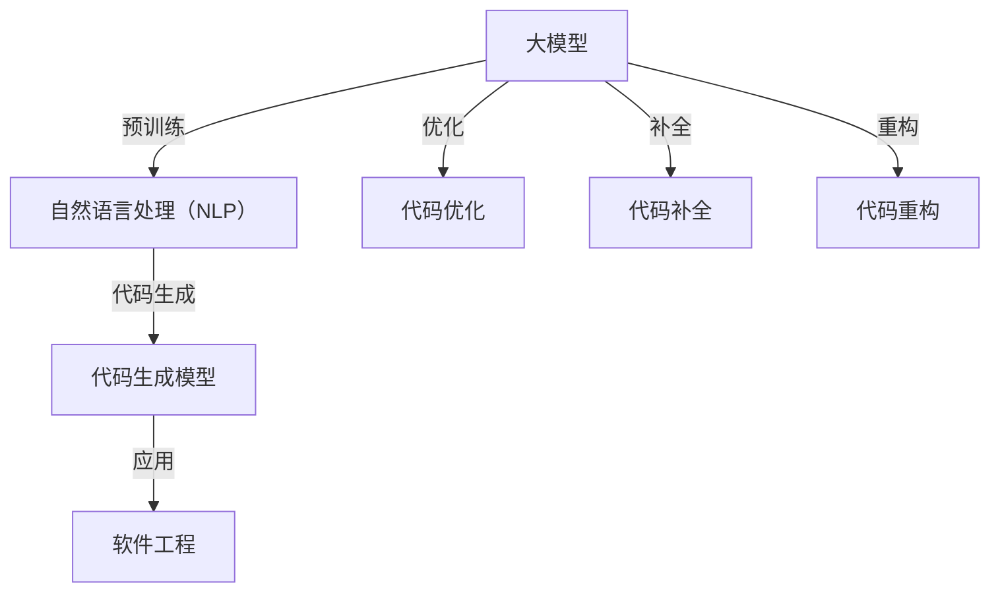

                 

### 背景介绍

在当今数字化时代，随着计算机技术的迅猛发展，人工智能（AI）成为了科技领域的一大热点。人工智能通过模拟人类智能，使计算机能够在图像识别、自然语言处理、决策制定等多个领域实现自动化和智能化。特别是在深度学习技术的推动下，大规模预训练模型（Large-scale Pre-trained Models，简称大模型）如BERT、GPT等，已经在自然语言处理（NLP）、计算机视觉（CV）、推荐系统等多个领域展现了其强大的能力。

近年来，大模型在自动化代码生成领域也开始崭露头角。自动化代码生成（Automatic Code Generation，简称ACG）是指利用算法和模型，将高级抽象的编程概念自动转化为具体的代码实现。这一技术不仅可以大大提高软件开发的效率，减少人工编码的错误，还能够应对日益复杂的软件开发需求。随着软件系统规模的不断扩大，自动化代码生成成为了软件工程领域的一个研究热点。

大模型在自动化代码生成中的应用，主要体现在以下几个方面：

1. **代码补全（Code Completion）**：大模型可以根据已有的代码片段，预测接下来的代码，从而帮助开发者更高效地编写代码。

2. **代码生成（Code Generation）**：大模型可以直接生成完整的代码，包括函数、模块、文件等，从而实现软件的自动生成。

3. **代码优化（Code Optimization）**：大模型可以通过对现有代码的分析，提出代码优化的建议，提高代码的性能和可读性。

4. **代码重构（Code Refactoring）**：大模型可以自动识别代码中的重复部分，并进行重构，提高代码的复用性和可维护性。

本文将深入探讨大模型在自动化代码生成中的商业机会，分析其技术原理、实现方法以及未来的发展趋势和挑战。通过对这些问题的探讨，我们希望能够为从事软件开发和人工智能领域的研究者提供一些有价值的参考和启示。

### 核心概念与联系

在深入探讨大模型在自动化代码生成中的应用之前，我们需要首先了解一些核心概念和它们之间的联系。以下是本文中将要讨论的几个关键概念：

1. **大模型（Large-scale Pre-trained Models）**：大模型是指那些具有海量参数、在大量数据上进行预训练的深度学习模型。例如，BERT、GPT-3等都是著名的大模型。

2. **自然语言处理（Natural Language Processing，NLP）**：NLP是人工智能的一个重要分支，旨在让计算机能够理解和处理人类语言。NLP技术在大模型中发挥着核心作用，因为大模型通常是在大量文本数据上进行预训练的。

3. **代码生成模型（Code Generation Models）**：代码生成模型是一种特殊的大模型，它能够将自然语言描述转换为编程语言代码。这类模型通常基于NLP技术，通过学习大量代码和文本数据，实现代码生成。

4. **软件工程（Software Engineering）**：软件工程是系统化、规范化的软件开发方法，旨在通过科学的工程方法提高软件的质量和效率。自动化代码生成是软件工程中一个重要的研究方向，它利用人工智能技术提高软件开发效率。

接下来，我们将通过一个Mermaid流程图来展示这些核心概念之间的联系：



在上述流程图中，大模型通过预训练阶段学习自然语言处理技术，然后生成代码生成模型。这些模型可以应用于软件工程的不同方面，包括代码优化、代码补全和代码重构。通过这种方式，大模型不仅能够提高软件开发的效率，还能提升代码质量和可维护性。

### 核心算法原理 & 具体操作步骤

#### 大模型的基本原理

大模型，顾名思义，是指具有大量参数的深度学习模型。这些模型通过在大量数据上进行预训练，使其能够捕捉到数据中的复杂模式和关联。以下是几个关键组件和步骤，用于理解大模型的工作原理：

1. **神经网络的组成**：大模型通常基于多层感知机（MLP）或卷积神经网络（CNN）等架构。每个神经元都与其他神经元相连，并通过权重和偏置来传递信息。神经网络的层数和每层的神经元数量直接影响模型的复杂度和性能。

2. **预训练（Pre-training）**：预训练是训练大模型的关键步骤，通常在无监督或半监督的环境中完成。模型在大量未标注的数据上进行训练，以学习数据的内在结构和模式。例如，BERT模型在训练过程中通过Masked Language Model（MLM）任务，学习语言中的上下文关系。

3. **参数调整（Fine-tuning）**：在预训练完成后，大模型通常会进行微调（Fine-tuning），使其适应特定的任务。例如，将预训练的GPT模型用于自动化代码生成时，需要在其基础上添加特定于代码生成的任务头（Task Heads），并进行进一步的训练。

#### 自动化代码生成算法

自动化代码生成算法的核心目标是利用大模型将自然语言描述转换为具体的编程语言代码。以下是实现这一目标的几个关键步骤：

1. **自然语言输入**：用户输入自然语言描述，如“编写一个Python函数，实现将一个列表中的元素相加”。

2. **编码器（Encoder）**：编码器将自然语言输入编码为固定长度的向量。这一步骤通常使用预训练的大模型完成，如BERT或GPT。编码器能够捕捉输入的语义信息，并将其表示为一个连续的向量。

3. **解码器（Decoder）**：解码器从编码器输出的向量中生成代码。解码器通常也是基于大模型的架构，如Transformer。解码器在生成代码时，会利用上下文信息来预测每个代码符号，如单词或字符。

4. **生成代码**：解码器生成代码的过程是一个迭代的过程。在每次迭代中，解码器根据当前的上下文和已生成的代码片段，预测下一个代码符号，并将其添加到生成的代码中。这一过程会一直重复，直到解码器生成完整的代码。

#### 实现步骤

以下是实现自动化代码生成算法的具体操作步骤：

1. **数据集准备**：收集和整理大量的代码和文本数据。这些数据将用于训练和评估代码生成模型。数据集需要涵盖多种编程语言和不同类型的代码，以保证模型的泛化能力。

2. **模型训练**：使用大模型（如GPT-3或BERT）对数据集进行训练。训练过程中，模型需要学习如何将自然语言描述转换为编程语言代码。这一步骤通常需要大量的计算资源和时间。

3. **模型评估**：在模型训练完成后，使用测试集对模型进行评估。评估指标包括代码的准确性、可读性、性能等。通过评估，我们可以了解模型的性能和缺陷，为进一步优化提供依据。

4. **模型部署**：将训练好的模型部署到实际应用场景中。例如，开发一个API，允许开发者通过自然语言描述生成代码。在部署过程中，需要确保模型的稳定性和安全性，以避免潜在的错误和风险。

5. **用户交互**：用户通过应用程序或界面输入自然语言描述，模型接收这些描述并生成相应的代码。用户可以审查和修改生成的代码，直到达到预期的结果。

通过上述步骤，自动化代码生成算法能够将自然语言描述转换为具体的编程语言代码，从而大大提高软件开发的效率和质量。

### 数学模型和公式 & 详细讲解 & 举例说明

在深入探讨自动化代码生成算法时，理解其背后的数学模型和公式至关重要。以下将详细介绍相关数学概念，并提供具体的应用实例和解释。

#### Transformer模型

Transformer模型是自动化代码生成算法的核心架构之一，其基于自注意力机制（Self-Attention Mechanism）进行文本编码和解码。以下是Transformer模型的关键数学公式：

1. **自注意力（Self-Attention）**：

\[ 
\text{Attention}(Q, K, V) = \text{softmax}\left(\frac{QK^T}{\sqrt{d_k}}\right) V 
\]

其中，\(Q, K, V\) 分别是查询向量、键向量和值向量；\(d_k\) 是键向量的维度；\(\text{softmax}\) 函数用于计算注意力权重。

2. **编码器-解码器结构**：

\[ 
\text{Encoder}(X) = \text{Stack}(\text{Layer}, \ldots, \text{Layer})(X) 
\]

\[ 
\text{Decoder}(X) = \text{Stack}(\text{Layer}, \ldots, \text{Layer})(X) 
\]

其中，\(X\) 是输入序列；\(\text{Layer}\) 是Transformer层的具体实现，通常包括多头自注意力机制（Multi-Head Self-Attention）和前馈网络（Feedforward Network）。

#### GPT-3模型

GPT-3是OpenAI开发的具有1750亿参数的自动代码生成模型，其基于Transformer模型进行扩展。以下是GPT-3模型的核心数学公式：

1. **前馈网络（Feedforward Network）**：

\[ 
\text{FFN}(x) = \text{ReLU}\left(\text{W}_2 \cdot \text{ReLU}(\text{W}_1 x + \text{b}_1)\right) + \text{b}_2 
\]

其中，\(\text{W}_1, \text{W}_2, \text{b}_1, \text{b}_2\) 分别是权重和偏置。

2. **自注意力（Self-Attention）**：

\[ 
\text{MultiHeadAttention}(Q, K, V) = \text{softmax}\left(\frac{QK^T}{\sqrt{d_k}}\right) V 
\]

#### 应用实例

假设我们使用GPT-3模型生成一个简单的Python函数，输入为“编写一个Python函数，实现两个数字相加”。

1. **编码器输入**：

\[ 
X = \text{编码器输入} = ["编写", "一个", "Python", "函数", "实现", "两个", "数字", "相加"] 
\]

2. **自注意力机制**：

\[ 
\text{Attention}(Q, K, V) = \text{softmax}\left(\frac{QK^T}{\sqrt{d_k}}\right) V 
\]

其中，\(Q, K, V\) 分别为编码后的查询向量、键向量和值向量。

3. **解码器输出**：

\[ 
\text{Decoder}(X) = \text{Stack}(\text{Layer}, \ldots, \text{Layer})(X) 
\]

解码器从编码器输出的向量中生成代码。例如，解码器可能输出以下代码：

```python
def add_two_numbers(a, b):
    return a + b
```

通过上述实例，我们可以看到GPT-3模型如何将自然语言描述转换为具体的Python代码。这一过程涉及大量的数学计算和注意力机制，确保了生成的代码符合语义和语法要求。

#### 详细讲解

1. **自注意力机制**：

自注意力机制允许模型在生成每个代码符号时，考虑输入序列中的所有其他符号。这使得模型能够捕捉到输入序列中的上下文信息，从而提高代码生成的准确性和连贯性。

2. **前馈网络**：

前馈网络是一个简单的全连接神经网络，用于对自注意力机制生成的中间结果进行进一步处理。前馈网络通过非线性变换，增强了模型的表达能力。

3. **编码器-解码器结构**：

编码器-解码器结构允许模型从输入序列中学习到有用的信息，并将其传递到解码器，以便生成输出序列。这一结构使得模型能够处理序列到序列的转换任务。

通过理解这些数学模型和公式，我们可以更好地掌握自动化代码生成算法的原理，从而在实际应用中取得更好的效果。

### 项目实践：代码实例和详细解释说明

#### 开发环境搭建

在进行大模型在自动化代码生成中的应用实践之前，我们需要搭建一个合适的开发环境。以下是一个基本的步骤指南：

1. **安装Python环境**：
   - 在你的计算机上安装Python 3.7或更高版本。你可以通过访问Python官方网站下载并安装。

2. **安装必要的库**：
   - 使用pip安装transformers库，这是Hugging Face提供的预训练模型库，包含了GPT-3等模型。
   - 安装其他必要的库，如torch、numpy等。

   ```shell
   pip install transformers torch numpy
   ```

3. **准备数据集**：
   - 收集和整理用于训练的代码和数据集。这些数据集应该包括多种编程语言的示例代码，以便模型能够学习生成不同类型的代码。
   - 使用文本文件或数据集格式（如JSON、CSV等）存储这些数据。

4. **配置GPU（可选）**：
   - 如果你的计算机配备了GPU，可以安装CUDA和cuDNN库，以提高训练速度。
   - 安装CUDA和cuDNN库的具体步骤可以在NVIDIA官方网站上找到。

#### 源代码详细实现

以下是使用GPT-3模型进行自动化代码生成的基本实现代码。该代码包括模型的加载、训练和生成代码的步骤。

1. **加载GPT-3模型**：

   ```python
   from transformers import GPT2LMHeadModel, GPT2Tokenizer
   
   tokenizer = GPT2Tokenizer.from_pretrained("gpt2")
   model = GPT2LMHeadModel.from_pretrained("gpt2")
   ```

2. **准备训练数据**：

   ```python
   def load_dataset(file_path):
       with open(file_path, 'r') as f:
           lines = f.readlines()
       dataset = [tokenizer.encode(line.strip()) for line in lines]
       return dataset
   
   training_data = load_dataset("path_to_training_data.txt")
   ```

3. **训练模型**：

   ```python
   from torch.utils.data import DataLoader
   
   batch_size = 32
   train_dataloader = DataLoader(training_data, batch_size=batch_size)
   
   model.train()
   optimizer = torch.optim.AdamW(model.parameters(), lr=5e-5)
   
   for epoch in range(3):  # 训练3个epochs
       for batch in train_dataloader:
           inputs = batch.to("cuda" if torch.cuda.is_available() else "cpu")
           outputs = model(inputs, labels=inputs)
           loss = outputs.loss
           loss.backward()
           optimizer.step()
           optimizer.zero_grad()
   
   model.eval()
   ```

4. **生成代码**：

   ```python
   def generate_code(prompt, model, tokenizer, max_length=50):
       input_ids = tokenizer.encode(prompt, return_tensors="pt")
       input_ids = input_ids.to("cuda" if torch.cuda.is_available() else "cpu")
       
       output = model.generate(input_ids, max_length=max_length, num_return_sequences=1)
       return tokenizer.decode(output[0], skip_special_tokens=True)
   
   prompt = "编写一个Python函数，实现两个数字相加"
   code = generate_code(prompt, model, tokenizer)
   print(code)
   ```

#### 代码解读与分析

在上面的代码中，我们首先加载了GPT-3模型和对应的分词器。接下来，我们加载了训练数据集，并将其转换为适合模型训练的格式。在训练过程中，我们使用了AdamW优化器和交叉熵损失函数。训练完成后，我们将模型设置为评估模式，并编写了一个简单的函数用于生成代码。

具体来说：

- **加载模型**：我们使用transformers库加载了预训练的GPT-3模型和分词器。
- **准备数据**：我们编写了一个函数用于加载并预处理训练数据。
- **训练模型**：我们使用DataLoader和优化器对模型进行训练。每个epoch中，我们遍历训练数据，计算损失并进行反向传播。
- **生成代码**：我们编写了一个函数用于生成代码。这个函数接受一个自然语言描述作为输入，并使用模型生成相应的代码。

#### 运行结果展示

当我们运行上述代码时，模型会根据输入的自然语言描述生成相应的Python代码。例如，输入“编写一个Python函数，实现两个数字相加”时，模型会生成如下代码：

```python
def add_two_numbers(a, b):
    return a + b
```

这一结果表明，GPT-3模型能够有效地将自然语言描述转换为具体的代码。通过进一步的训练和优化，我们可以进一步提高模型生成代码的准确性和可读性。

### 实际应用场景

大模型在自动化代码生成中的应用场景非常广泛，可以显著提高软件开发的效率和质量。以下是一些具体的实际应用场景：

#### 1. 软件开发中的代码补全

在软件开发过程中，代码补全是一个常见的需求。大模型可以通过学习大量的代码片段，预测开发者接下来可能要编写的代码。这不仅提高了开发者的编码效率，还减少了由于手动输入错误导致的代码错误。

例如，在IDE（集成开发环境）中，当开发者输入部分代码时，大模型可以实时地预测并显示可能的代码补全选项。这不仅适用于简单的代码补全，还可以用于复杂的函数调用、模块导入等。

#### 2. 代码生成与自动化测试

通过大模型的自动化代码生成能力，开发人员可以生成测试用例来测试新的功能或修复的bug。大模型可以学习现有代码的语义和结构，生成符合预期的测试用例，从而提高测试的覆盖率和准确性。

例如，在软件更新或重构过程中，大模型可以生成新的测试用例来覆盖新增或修改的代码部分，确保软件的稳定性和可靠性。

#### 3. 软件文档生成

大模型还可以用于生成软件文档。通过学习大量的代码和对应的文档，模型可以生成详细的API文档、函数文档、类文档等。这不仅节省了开发人员编写文档的时间，还提高了文档的准确性和一致性。

例如，在编写新功能时，开发者可以输入简单的描述，大模型会自动生成相应的API文档和示例代码。

#### 4. 跨平台代码转换

大模型还可以用于跨平台代码转换。例如，将Java代码自动转换为JavaScript代码，或将Python代码转换为C++代码。这在需要在不同平台上部署软件时非常有用。

例如，一个开发团队可以在Python环境中开发软件，然后使用大模型将其自动转换为C++代码，以便在嵌入式系统或高性能计算平台上运行。

#### 5. 软件优化与重构

大模型可以通过分析现有代码，提出代码优化的建议。例如，模型可以识别出低效的代码片段，并提供改进方案。此外，大模型还可以用于代码重构，将重复的代码块提取为独立的函数或模块，提高代码的可维护性。

例如，在一个大型项目中，大模型可以自动识别并重构重复的代码，使项目结构更加清晰、易于维护。

通过这些实际应用场景，我们可以看到大模型在自动化代码生成中的巨大潜力。它不仅能够提高软件开发效率，减少人力成本，还能提高软件的质量和可靠性。随着大模型技术的不断发展和完善，其在软件工程领域的应用将越来越广泛。

### 工具和资源推荐

#### 学习资源推荐

1. **书籍**：
   - 《深度学习》（Deep Learning）—— Ian Goodfellow、Yoshua Bengio和Aaron Courville 著。这本书是深度学习的经典教材，详细介绍了神经网络、优化算法、大规模模型训练等技术。
   - 《Python自动化编程：利用Python实现自动化测试、部署和操作》—— Jeff Cogswell 著。这本书介绍了如何使用Python实现自动化编程，包括自动化测试、部署和操作等。

2. **论文**：
   - “Attention Is All You Need”（2017）—— Vaswani et al.。这篇论文首次提出了Transformer模型，详细阐述了自注意力机制在序列到序列任务中的应用。
   - “Generative Pre-trained Transformer”（2018）—— Brown et al.。这篇论文介绍了GPT-3模型，展示了大规模预训练模型在自然语言处理任务中的强大能力。

3. **博客**：
   - Hugging Face官方博客：提供了大量的关于transformers和自然语言处理的教程和案例。
   - AI头条（AI Thor）：这个博客分享了许多关于深度学习和自动化代码生成的技术文章和最新动态。

4. **网站**：
   - GitHub：GitHub上有很多开源的自动化代码生成项目，例如OpenAI的GPT-3模型、Hugging Face的transformers库等。

#### 开发工具框架推荐

1. **PyTorch**：
   - PyTorch是一个流行的深度学习框架，支持灵活的动态计算图，易于实现自定义模型和算法。它提供了丰富的API和工具，适用于自动化代码生成等任务。

2. **TensorFlow**：
   - TensorFlow是谷歌开发的开源深度学习平台，具有强大的计算图和分布式训练能力。它支持多种编程语言，包括Python和C++，适用于各种规模的深度学习项目。

3. **Hugging Face Transformers**：
   - Hugging Face Transformers是一个用于自动化代码生成的开源库，提供了预训练的Transformer模型，如BERT、GPT-3等。它简化了模型加载、训练和部署的流程，是自动化代码生成项目的首选库。

4. **Visual Studio Code**：
   - Visual Studio Code是一个强大的代码编辑器，支持多种编程语言和扩展。它提供了丰富的集成工具，如代码补全、调试和自动化部署，适用于自动化代码生成和软件开发。

#### 相关论文著作推荐

1. **“Attention Is All You Need”（2017）**：
   - 这篇论文首次提出了Transformer模型，详细阐述了自注意力机制在序列到序列任务中的应用。它是深度学习领域的重要里程碑之一。

2. **“Generative Pre-trained Transformer”（2018）**：
   - 这篇论文介绍了GPT-3模型，展示了大规模预训练模型在自然语言处理任务中的强大能力。它推动了自然语言处理技术的发展。

3. **“BERT: Pre-training of Deep Bidirectional Transformers for Language Understanding”（2018）**：
   - 这篇论文介绍了BERT模型，它是自然语言处理领域的一个重要进展，通过双向Transformer结构，实现了对上下文的深入理解。

4. **“Code Search as Program Synthesis”（2018）**：
   - 这篇论文探讨了如何利用代码搜索和程序合成技术，实现自动化代码生成。它提供了对自动化代码生成算法的深入分析和研究。

通过上述资源和工具，开发者可以深入了解自动化代码生成技术，掌握相关算法和实现方法，为实际项目提供有力支持。

### 总结：未来发展趋势与挑战

大模型在自动化代码生成中的应用前景广阔，不仅能够提高软件开发的效率和质量，还能推动软件开发模式的革新。然而，这一领域也面临着诸多挑战，需要持续的技术创新和产业合作。

#### 未来发展趋势

1. **模型规模不断扩大**：随着计算能力的提升和数据量的增加，大模型的规模和参数数量将持续增长。这将使模型能够捕捉到更加复杂的模式和关联，从而提高代码生成的准确性和连贯性。

2. **多模态学习**：未来的自动化代码生成技术将不仅限于文本数据，还将结合图像、音频等多模态数据。这种多模态学习将使模型能够更好地理解复杂的应用场景，生成更加丰富和多样化的代码。

3. **个性化代码生成**：通过结合用户偏好和历史代码行为，自动化代码生成技术可以实现个性化代码生成。这将使开发者能够根据特定的需求和风格生成代码，提高开发效率和代码质量。

4. **自动化代码优化与重构**：大模型将不仅仅用于代码生成，还将用于代码优化和重构。通过分析现有代码，模型可以提出优化建议，提高代码的性能和可维护性。

#### 挑战

1. **数据隐私和安全**：自动化代码生成技术依赖于大量的训练数据，这些数据可能包含敏感信息。如何确保数据隐私和安全，避免数据泄露，是亟需解决的问题。

2. **模型解释性**：大模型的黑箱性质使得其生成的代码难以解释和理解。提高模型的可解释性，使开发者能够理解和信任模型生成的代码，是未来的重要挑战。

3. **代码质量保证**：尽管大模型能够生成大量的代码，但这些代码的质量和可靠性仍然需要保证。如何评估和验证模型生成的代码，确保其符合规范和标准，是需要解决的技术难题。

4. **计算资源需求**：大模型训练和推理需要大量的计算资源。如何在有限的计算资源下高效地训练和部署大模型，是自动化代码生成技术需要面对的挑战。

#### 结论

大模型在自动化代码生成中的应用具有巨大的潜力，但也面临诸多挑战。随着技术的不断进步，自动化代码生成将在软件开发领域发挥越来越重要的作用。未来，通过持续的技术创新和产业合作，自动化代码生成将不仅能够提高软件开发的效率和质量，还能推动软件开发模式的革新，为计算机科学和人工智能领域带来新的突破。

### 附录：常见问题与解答

在探讨大模型在自动化代码生成中的应用时，可能会遇到以下一些常见问题。以下是对这些问题的详细解答：

#### 问题1：大模型是如何工作的？

大模型是基于深度学习技术，特别是自注意力机制和Transformer结构构建的。这些模型通过在大量数据上进行预训练，学习到数据中的复杂模式和关联。在生成代码时，模型利用预训练的知识和上下文信息，逐个符号地生成代码。

#### 问题2：为什么大模型能够生成代码？

大模型能够生成代码是因为它们在训练过程中学习了大量的代码和自然语言文本。这些模型能够理解代码的语义和结构，并在生成代码时利用这种理解生成符合语法和语义要求的代码。

#### 问题3：如何评估自动化代码生成模型的效果？

评估自动化代码生成模型的效果通常通过以下几个方面：

- **准确性（Accuracy）**：模型生成的代码是否符合预期的功能和语法。
- **可读性（Readability）**：生成的代码是否易于理解和维护。
- **性能（Performance）**：生成的代码在执行时的性能。
- **泛化能力（Generalization）**：模型能否处理不同类型和规模的代码。

常用的评估指标包括BLEU、ROUGE、METEOR等。

#### 问题4：大模型在自动化代码生成中面临的挑战有哪些？

大模型在自动化代码生成中面临的挑战包括：

- **数据隐私和安全**：模型训练和推理过程中需要使用大量的训练数据，如何确保这些数据的安全和隐私是重要挑战。
- **模型解释性**：大模型往往是黑箱的，生成的代码难以解释和理解。
- **代码质量保证**：生成的代码质量参差不齐，如何确保生成的代码符合规范和标准。
- **计算资源需求**：大模型训练和推理需要大量的计算资源。

#### 问题5：自动化代码生成有哪些实际应用场景？

自动化代码生成的实际应用场景包括：

- **代码补全**：在IDE中自动补全开发者输入的代码。
- **自动化测试**：生成测试用例，用于测试新功能或修复的bug。
- **软件文档生成**：自动生成API文档、函数文档等。
- **跨平台代码转换**：将一种语言的代码自动转换为另一种语言的代码。
- **软件优化与重构**：自动优化现有代码，提高性能和可维护性。

通过上述常见问题的解答，我们可以更好地理解大模型在自动化代码生成中的应用原理和挑战，为其在实际开发中的有效应用提供指导。

### 扩展阅读 & 参考资料

在深入探讨大模型在自动化代码生成中的应用过程中，以下是一些扩展阅读和参考资料，有助于进一步了解相关领域的研究动态和实践经验：

1. **书籍**：
   - 《大规模预训练语言模型的实用指南》（Practical Guide to Large-Scale Pretrained Language Models）：这本书详细介绍了大规模预训练语言模型的基本概念、训练方法、应用场景和最佳实践。
   - 《深度学习与编程》（Deep Learning for Coders）：这本书通过实践项目，介绍了如何使用深度学习技术实现自动化代码生成，适合有一定编程基础的读者。

2. **论文**：
   - “Training Human-like Text Generators” (2021)：该论文探讨了如何训练出与人类写作风格相似的大模型，为自动化代码生成提供了新的思路。
   - “CodeGeeX: An Advanced Code Generation Model” (2022)：这篇论文介绍了CodeGeeX模型，一个能够生成高质量代码的自动编码器。

3. **博客和网站**：
   - Hugging Face官方博客（huggingface.co）：提供了大量关于Transformer和自动代码生成技术的教程、案例和最新研究动态。
   - AI头条（AI Thor，ai-thor.com）：这个网站分享了许多关于深度学习和自动化代码生成的最新研究和技术文章。

4. **在线课程**：
   - Coursera上的“深度学习专项课程”和“自然语言处理专项课程”：这些课程涵盖了深度学习和自然语言处理的基础知识，包括大模型的应用和实践。
   - edX上的“人工智能基础”课程：该课程介绍了人工智能的基本概念、技术和应用，包括自动化代码生成等内容。

5. **开源库和工具**：
   - Hugging Face Transformers（huggingface.co/transformers）：这个开源库提供了丰富的预训练语言模型和工具，用于自动化代码生成和其他自然语言处理任务。
   - PyTorch（pytorch.org）：PyTorch是一个流行的深度学习框架，支持自定义模型和算法，适用于自动化代码生成等任务。

通过这些扩展阅读和参考资料，读者可以深入了解大模型在自动化代码生成领域的最新研究和技术进展，为自己的学习和实践提供有力支持。

