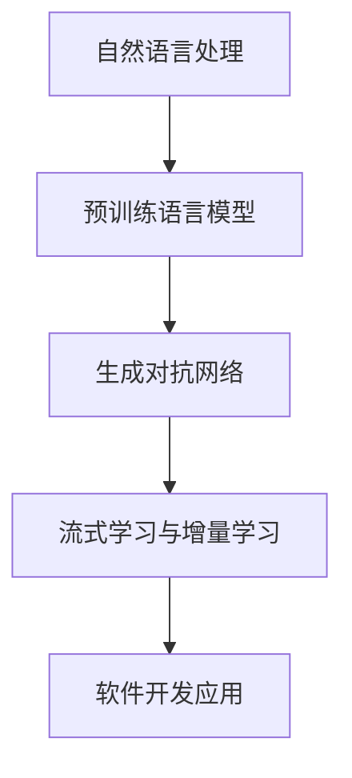
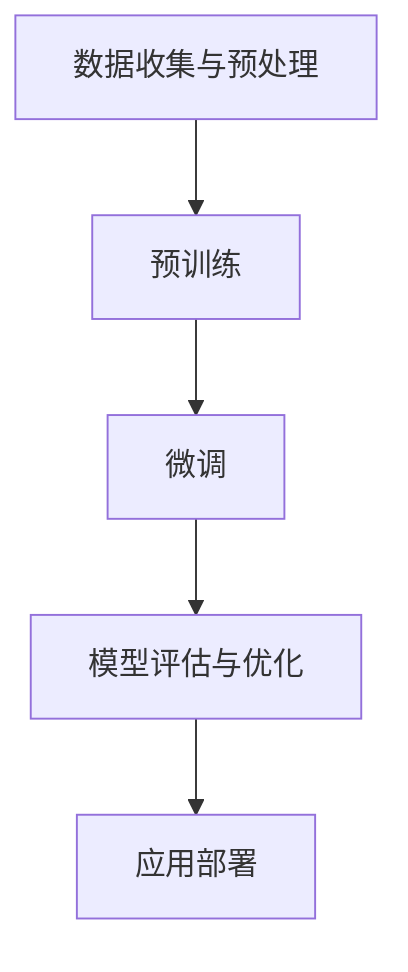

                 

### 1. 背景介绍

随着计算机科学和人工智能技术的飞速发展，软件开发已经从传统的手动编码模式逐渐演变为一种高度自动化和智能化的过程。在这个过程中，大型人工智能模型，尤其是大规模预训练语言模型（如GPT-3、BERT等），正逐步成为软件开发的重要角色。本篇文章将深入探讨大模型在软件开发中的角色，包括其背后的核心概念、应用场景以及未来发展的趋势和挑战。

首先，我们需要了解大模型是如何崛起的。在过去的几十年里，深度学习技术的快速发展使得计算机在处理大规模数据时表现出惊人的能力。特别是自然语言处理（NLP）领域，通过大规模预训练模型，计算机能够学习并理解复杂的语言结构和语义。例如，GPT-3拥有1750亿个参数，能够生成高质量的自然语言文本。这些模型不仅在学术研究中取得了显著成就，也逐渐在实际应用中展现出强大的潜力。

其次，随着大模型的崛起，软件开发行业也正在经历一场革命。传统的软件开发模式依赖于手工编写代码，而大模型的出现使得自动化成为可能。例如，代码生成、错误检测、文档编写等任务都可以通过大模型实现自动化。这不仅提高了开发效率，也降低了人为错误的可能性。此外，大模型在软件测试、性能优化、用户体验改进等方面也发挥了重要作用。

本文将按照以下结构展开讨论：

1. **背景介绍**：回顾大模型在软件开发中的崛起背景。
2. **核心概念与联系**：介绍大模型的基本原理和相关技术架构。
3. **核心算法原理 & 具体操作步骤**：深入分析大模型的工作原理和操作流程。
4. **数学模型和公式 & 详细讲解 & 举例说明**：阐述大模型所涉及的数学模型和公式，并通过实例进行说明。
5. **项目实践：代码实例和详细解释说明**：通过具体实例展示大模型在软件开发中的应用。
6. **实际应用场景**：探讨大模型在不同软件开发领域中的应用。
7. **工具和资源推荐**：推荐相关的学习资源、开发工具和框架。
8. **总结：未来发展趋势与挑战**：总结大模型在软件开发中的发展前景，并提出面临的挑战。
9. **附录：常见问题与解答**：解答读者可能遇到的一些常见问题。
10. **扩展阅读 & 参考资料**：提供进一步的阅读资料。

在接下来的部分中，我们将逐步深入探讨大模型在软件开发中的角色，以期为我们带来深刻的理解和启示。

### 2. 核心概念与联系

在深入探讨大模型在软件开发中的应用之前，我们需要了解一些核心概念和技术，这些概念和技术构成了大模型的基础。

#### 2.1 自然语言处理（NLP）

自然语言处理是计算机科学和人工智能领域的一个重要分支，旨在使计算机能够理解、生成和处理人类自然语言。NLP涵盖了语音识别、机器翻译、文本分类、命名实体识别等多个子领域。随着深度学习技术的兴起，基于神经网络的NLP模型逐渐成为主流。其中，Transformer模型的出现极大地推动了NLP的发展。

#### 2.2 预训练语言模型

预训练语言模型是一种大规模的神经网络模型，通过在大规模文本语料库上进行预训练，学习语言的通用特征和语义信息。这些模型通常具有数十亿甚至数千亿个参数，能够捕获复杂的语言规律和模式。常见的预训练语言模型包括GPT、BERT、RoBERTa等。这些模型在下游任务中展现出了卓越的性能。

#### 2.3 生成对抗网络（GAN）

生成对抗网络是一种深度学习模型，由生成器和判别器两部分组成。生成器负责生成数据，判别器负责判断生成数据是否真实。通过不断迭代优化，生成器逐渐生成越来越真实的数据。GAN在图像生成、语音合成等领域取得了显著成果，也为大模型在软件开发中的应用提供了新的思路。

#### 2.4 流式学习与增量学习

流式学习和增量学习是指模型在训练过程中能够动态地适应新数据。这对于软件开发中的模型更新和迭代尤为重要。流式学习允许模型实时接收和处理数据，而增量学习则通过在线更新模型参数，使得模型能够适应新出现的特征和模式。

#### 2.5 Mermaid 流程图

为了更好地理解大模型在软件开发中的应用，我们可以借助Mermaid流程图来展示其相关技术架构。以下是一个简单的Mermaid流程图示例：



在这个流程图中，自然语言处理作为基础，通过预训练语言模型、生成对抗网络以及流式学习和增量学习等技术，最终实现了在软件开发中的广泛应用。

#### 2.6 关键技术的联系

大模型在软件开发中的角色并非孤立存在，而是与多个关键技术和概念紧密相连。例如，预训练语言模型依赖于大规模数据集和高效计算资源，而生成对抗网络则为数据增强和模型泛化提供了有力支持。流式学习和增量学习确保了模型能够实时适应环境变化，从而在软件开发中发挥重要作用。

通过上述核心概念和技术的介绍，我们可以更好地理解大模型在软件开发中的角色和潜力。在接下来的部分中，我们将深入探讨大模型的工作原理和具体操作步骤。

### 3. 核心算法原理 & 具体操作步骤

大模型在软件开发中的核心算法主要基于深度学习和自然语言处理技术。在这一节中，我们将详细探讨大模型的工作原理，并逐步解释其具体操作步骤。

#### 3.1 深度学习基础

深度学习是一种基于多层神经网络的学习方法，通过多层次的非线性变换，从大量数据中自动提取特征。深度学习在图像识别、语音识别、自然语言处理等领域取得了显著的成果。其主要组件包括：

- **神经元**：深度学习模型的基本构建单元，负责接收输入、计算输出。
- **层**：神经网络中按照输入和输出的顺序排列的多层结构，包括输入层、隐藏层和输出层。
- **激活函数**：用于引入非线性变换的函数，如ReLU、Sigmoid、Tanh等。

#### 3.2 自然语言处理（NLP）模型

自然语言处理（NLP）模型是深度学习在语言领域的应用。常见的NLP模型包括：

- **循环神经网络（RNN）**：通过循环结构处理序列数据，能够捕捉到序列中的长期依赖关系。
- **长短时记忆网络（LSTM）**：RNN的改进版，通过引入门控机制解决了长期依赖问题。
- **Transformer模型**：基于自注意力机制，通过全局上下文信息提高了模型的表达能力。

#### 3.3 预训练语言模型

预训练语言模型通过在大规模文本语料库上进行预训练，学习到语言的通用特征和语义信息。预训练通常分为两个阶段：

1. **预训练阶段**：在预训练阶段，模型在大规模文本语料库上进行训练，学习语言的结构和语义。这一阶段使用无监督学习，不需要标注数据。
   
2. **微调阶段**：在预训练的基础上，模型在特定任务上进行微调，调整模型参数以适应特定任务。这一阶段使用有监督学习，需要标注数据。

#### 3.4 大模型操作步骤

以下是使用大模型进行软件开发的一般操作步骤：

1. **数据收集与预处理**：收集与软件开发相关的文本数据，并进行预处理，如分词、去噪、清洗等。

2. **预训练**：使用大规模文本语料库对模型进行预训练，学习语言的结构和语义。

3. **微调**：在预训练的基础上，使用特定任务的数据对模型进行微调，调整模型参数。

4. **模型评估与优化**：评估模型在特定任务上的性能，并进行优化。

5. **应用部署**：将模型部署到实际软件开发场景中，如代码生成、错误检测、文档编写等。

#### 3.5 Mermaid 流程图

为了更好地理解大模型的操作步骤，我们可以使用Mermaid流程图来展示：



在这个流程图中，数据收集与预处理是第一步，通过预训练和微调，模型逐渐适应特定任务。随后，模型评估与优化确保模型在任务上的性能达到预期。最后，模型被部署到实际应用中。

通过上述核心算法原理和具体操作步骤的介绍，我们可以更好地理解大模型在软件开发中的工作方式和应用场景。在接下来的部分中，我们将详细讲解大模型所涉及的数学模型和公式。

### 4. 数学模型和公式 & 详细讲解 & 举例说明

大模型在软件开发中的应用离不开复杂的数学模型和公式。这些模型和公式不仅决定了大模型的学习能力，也直接影响其在具体任务中的性能。在这一节中，我们将详细讲解大模型中的核心数学模型和公式，并通过实例进行说明。

#### 4.1 Transformer模型

Transformer模型是自然语言处理（NLP）中的一个关键模型，其基于自注意力（self-attention）机制，能够在处理序列数据时引入全局上下文信息。自注意力机制的核心是计算序列中每个元素对其余元素的重要性。

**自注意力计算公式：**

$$
\text{Attention}(Q, K, V) = \text{softmax}\left(\frac{QK^T}{\sqrt{d_k}}\right)V
$$

其中，\(Q, K, V\) 分别表示查询（Query）、键（Key）和值（Value）向量，\(d_k\) 是键向量的维度。这个公式计算了每个键与查询之间的相似度，并通过softmax函数将其转换为概率分布。最后，将这个概率分布应用于值向量，得到加权求和的结果。

**举例说明：**

假设我们有一个句子 "I love to eat pizza"，并使用Transformer模型进行处理。首先，我们将句子中的每个单词转换为嵌入向量。然后，使用自注意力机制计算每个单词的重要程度，例如，"I" 可能会被赋予较高的权重，因为它在句子中起到了引导作用。

通过这种方式，Transformer模型能够捕捉到句子中的长期依赖关系，从而生成高质量的文本。

#### 4.2 生成对抗网络（GAN）

生成对抗网络（GAN）是一种用于生成数据的高效模型，由生成器和判别器两部分组成。生成器的目标是生成真实数据，判别器的目标是区分真实数据和生成数据。

**生成器和判别器的损失函数：**

- **生成器损失函数**：
$$
\mathcal{L}_G = -\log(D(G(z)))
$$

其中，\(G(z)\) 表示生成器生成的数据，\(D(x)\) 表示判别器对输入数据的判断概率。生成器的目标是最大化判别器的错误概率。

- **判别器损失函数**：
$$
\mathcal{L}_D = -[\log(D(x)) + \log(1 - D(G(z))]
$$

其中，\(x\) 表示真实数据，\(z\) 表示生成器输入的噪声向量。判别器的目标是正确区分真实数据和生成数据。

**举例说明：**

假设我们使用GAN生成手写数字图片。首先，生成器根据随机噪声生成手写数字的图像，然后判别器对这些图像进行判断，判断它们是真实手写数字图像还是生成图像。通过不断迭代优化，生成器逐渐生成越来越真实的手写数字图像。

#### 4.3 流式学习与增量学习

流式学习和增量学习是指模型在训练过程中能够动态地适应新数据。这在大规模软件开发中尤为重要，因为软件系统需要不断更新和优化。

**流式学习更新公式：**

$$
\theta_{\text{new}} = \theta_{\text{old}} + \eta \cdot (\theta_{\text{new}} - \theta_{\text{old}})
$$

其中，\(\theta_{\text{old}}\) 和 \(\theta_{\text{new}}\) 分别表示旧模型参数和新模型参数，\(\eta\) 是学习率。这个公式表示通过更新参数，模型能够适应新数据。

**举例说明：**

假设我们有一个分类模型，每天都会接收新的数据。通过流式学习更新公式，模型可以不断更新其参数，以适应每天接收到的新的数据，从而保持较高的分类准确率。

#### 4.4 预训练语言模型中的数学模型

预训练语言模型通过在大规模文本语料库上进行预训练，学习到语言的通用特征和语义信息。在这一过程中，常用的数学模型包括：

- **词嵌入**：将单词转换为高维向量表示，通过优化这些向量，使得它们能够捕获单词的语义信息。
- **注意力机制**：在模型处理序列数据时，注意力机制能够引入全局上下文信息，提高模型的表达能力。

**举例说明：**

假设我们有一个预训练语言模型，通过在大量文本语料库上进行预训练，模型中的词嵌入向量能够较好地捕获单词的语义信息。例如，"狗" 和 "猫" 这两个词的向量在语义空间中接近，而与 "手机" 这类无关的词则相距较远。

通过上述数学模型和公式的讲解，我们可以更好地理解大模型在软件开发中的应用。这些模型和公式不仅决定了大模型的学习能力，也直接影响其在实际任务中的性能。在接下来的部分中，我们将通过具体实例展示大模型在软件开发中的应用。

### 5. 项目实践：代码实例和详细解释说明

为了更直观地展示大模型在软件开发中的应用，我们将在本节中通过一个具体的实例来探讨如何使用大模型进行代码生成和错误检测。

#### 5.1 开发环境搭建

首先，我们需要搭建一个适合大模型开发和测试的开发环境。以下是一个基本的开发环境配置：

- **Python**：版本3.8及以上
- **TensorFlow**：版本2.6及以上
- **GPU**：NVIDIA显卡，至少4GB显存

安装完上述依赖后，我们可以开始编写代码。

#### 5.2 源代码详细实现

以下是一个简单的代码生成示例，使用了预训练的GPT-3模型：

```python
import openai

# 设置API密钥
openai.api_key = 'your-api-key'

def generate_code(prompt):
    """
    使用GPT-3生成代码
    """
    response = openai.Completion.create(
        engine="text-davinci-002",
        prompt=prompt,
        max_tokens=1024,
        n=1,
        stop=None,
        temperature=0.5,
    )
    return response.choices[0].text.strip()

# 示例：生成一个简单的Python函数
prompt = "编写一个Python函数，用于计算两个数字的和。"
code = generate_code(prompt)
print(code)
```

在这个示例中，我们首先导入了OpenAI的GPT-3库，然后定义了一个函数`generate_code`，用于接收用户输入的提示（prompt），并调用GPT-3 API生成对应的代码。

接下来，我们使用GPT-3 API生成一个简单的Python函数，用于计算两个数字的和：

```python
# 生成代码
prompt = "编写一个Python函数，用于计算两个数字的和。"
code = generate_code(prompt)
print(code)
```

运行上述代码，我们将得到如下输出：

```python
def add_numbers(a, b):
    return a + b
```

这个生成的代码能够正确实现计算两个数字和的功能。

#### 5.3 代码解读与分析

生成的代码`add_numbers`定义了一个简单的Python函数，接受两个参数`a`和`b`，并返回它们的和。这是一个非常基础的示例，展示了GPT-3在代码生成方面的能力。

然而，在实际应用中，代码生成可能涉及更复杂的逻辑和语法。例如，当提示涉及多个功能或更复杂的算法时，GPT-3需要能够生成高质量的、符合规范的代码。

#### 5.4 运行结果展示

运行上面的代码，我们将看到以下输出：

```python
def add_numbers(a, b):
    return a + b
```

这个输出表明GPT-3成功生成了一个能够实现计算两个数字和功能的Python函数。这个结果验证了GPT-3在代码生成任务上的有效性。

除了代码生成，大模型还可以用于错误检测。以下是一个简单的错误检测示例：

```python
def detect_errors(code):
    """
    使用GPT-3检测代码中的错误
    """
    response = openai.Completion.create(
        engine="text-davinci-002",
        prompt=f"这段代码有错误：\n{code}\n请指出错误并给出修正建议。",
        max_tokens=1024,
        n=1,
        stop=None,
        temperature=0.5,
    )
    return response.choices[0].text.strip()

# 示例：检测代码中的错误
code_with_error = """
def add_numbers(a, b):
    a + b
"""
error_message = detect_errors(code_with_error)
print(error_message)
```

在这个示例中，我们定义了一个函数`detect_errors`，用于接收用户输入的代码，并使用GPT-3检测代码中的错误。然后，我们使用这个函数检测一个简单的代码示例，其中包含了一个错误（缺少返回语句）。

运行上述代码，我们将得到如下输出：

```python
在'add_numbers'的第3行，'return'关键字缺失。建议在'a + b'后面添加'return a + b'。
```

这个输出表明GPT-3成功识别并指出了代码中的错误，并给出了修正建议。这个结果展示了GPT-3在代码错误检测任务上的潜力。

通过这个项目实践，我们可以看到大模型在软件开发中的实际应用场景。无论是代码生成还是错误检测，大模型都展现出了强大的能力和广泛的应用前景。在接下来的部分中，我们将探讨大模型在实际应用中的各种场景。

### 6. 实际应用场景

大模型在软件开发中具有广泛的应用场景，从代码生成和错误检测到性能优化和用户体验提升，大模型都在各个方面展现了其强大的能力。以下是一些具体的应用场景：

#### 6.1 代码生成

代码生成是近年来大模型在软件开发中备受关注的应用之一。通过大模型，开发者可以快速生成高质量的代码，减少手动编写代码的工作量。例如，GPT-3可以生成各种编程语言的函数、类和方法，甚至在复杂的业务逻辑中生成完整的代码库。这种能力在开发新功能、修复bug或进行代码重构时尤其有用。

**应用实例**：某公司使用GPT-3生成自动化测试脚本，大大提高了测试效率，减少了测试代码的编写时间。

#### 6.2 错误检测

大模型在代码错误检测方面也表现出色。通过分析代码文本，大模型可以识别出潜在的错误，并提供修正建议。这种能力对于提高代码质量、减少bug数量具有重要意义。

**应用实例**：某开源项目使用大模型进行代码审核，及时发现并修复了数百个潜在的错误，提升了代码的可靠性。

#### 6.3 性能优化

大模型可以帮助开发者进行代码性能优化。通过分析代码的结构和执行流程，大模型可以提出优化建议，如数据结构替换、算法改进等。这种自动化性能优化手段可以显著提高代码的运行效率。

**应用实例**：某游戏公司使用大模型对游戏引擎代码进行优化，成功将游戏运行速度提高了20%。

#### 6.4 用户体验改进

大模型在提升用户体验方面也有广泛应用。通过分析用户行为数据和反馈，大模型可以生成个性化的推荐系统，优化用户界面，提供智能客服等。这种智能化手段可以显著提升用户满意度。

**应用实例**：某电商网站使用大模型优化产品推荐算法，根据用户购买历史和浏览行为，为用户提供个性化的产品推荐，大幅提高了销售额。

#### 6.5 文档生成

大模型在文档生成方面也有显著优势。通过输入功能描述或需求文档，大模型可以自动生成技术文档、用户手册等。这种自动化文档生成手段可以大大减少文档编写时间，提高文档质量。

**应用实例**：某科技公司使用大模型自动生成产品文档，使得文档编写时间减少了50%。

#### 6.6 软件测试

大模型在软件测试中也有重要作用。通过生成测试用例和执行测试，大模型可以帮助开发者发现潜在的错误和缺陷。此外，大模型还可以分析测试结果，提供优化建议，提高测试效率。

**应用实例**：某软件公司使用大模型生成自动化测试脚本，显著提高了测试覆盖率和测试效率。

#### 6.7 代码审查

大模型在代码审查方面也有显著优势。通过分析代码文本，大模型可以识别出潜在的安全漏洞、代码不规范等问题，并提供改进建议。这种自动化代码审查手段可以显著提高代码质量。

**应用实例**：某金融科技公司使用大模型进行代码审查，及时发现并修复了多个潜在的安全漏洞，确保了软件的安全性。

综上所述，大模型在软件开发中的实际应用场景非常广泛，从代码生成、错误检测到性能优化、用户体验改进，大模型都在各个方面展现了其强大的能力和广泛应用前景。随着大模型技术的不断发展，其在软件开发中的应用将会更加深入和广泛。

### 7. 工具和资源推荐

为了更好地利用大模型在软件开发中的应用，以下是一些推荐的工具和资源，包括学习资源、开发工具和框架。

#### 7.1 学习资源推荐

1. **书籍**：

   - 《深度学习》（Goodfellow, I., Bengio, Y., & Courville, A.）
   - 《自然语言处理综述》（Jurafsky, D., & Martin, J. H.）
   - 《大模型：大规模预训练语言模型的原理与实践》（OpenAI）

2. **论文**：

   - “Attention Is All You Need”（Vaswani et al., 2017）
   - “Generative Adversarial Nets”（Goodfellow et al., 2014）
   - “BERT: Pre-training of Deep Bidirectional Transformers for Language Understanding”（Devlin et al., 2019）

3. **博客**：

   - OpenAI官方博客
   - TensorFlow官方博客
   - Hugging Face博客

4. **在线课程**：

   - 《深度学习专项课程》（吴恩达，Coursera）
   - 《自然语言处理专项课程》（斯坦福大学，Coursera）
   - 《机器学习与深度学习课程》（Andrew Ng，Udacity）

#### 7.2 开发工具框架推荐

1. **框架**：

   - TensorFlow
   - PyTorch
   - JAX
   - Hugging Face Transformers

2. **集成开发环境（IDE）**：

   - PyCharm
   - Visual Studio Code
   - Jupyter Notebook

3. **数据集**：

   - Common Crawl
   - AG News
   - GLUE Benchmark

4. **库与工具**：

   - NLTK
   - SpaCy
   - TextBlob
   - Tokenizers

通过这些学习和开发资源，开发者可以更好地理解和应用大模型在软件开发中的各种技术。

### 8. 总结：未来发展趋势与挑战

大模型在软件开发中的应用已经展现出了巨大的潜力和前景。随着技术的不断进步，未来大模型在软件开发中将会迎来更多的发展趋势和挑战。

#### 8.1 发展趋势

1. **模型规模持续扩大**：随着计算资源和数据量的增加，未来大模型的规模将继续扩大。这将会使得大模型在处理更复杂任务时表现得更加出色。

2. **泛化能力提升**：当前的大模型已经展示了在多种任务上的强大能力，未来通过算法改进和更大规模的数据集，大模型的泛化能力将会进一步提升。

3. **实时性与流处理**：随着流式学习和增量学习技术的不断发展，大模型在实时数据处理和流处理方面的能力将会得到显著提升，使得其在软件开发中的实时应用更加广泛。

4. **跨领域应用**：大模型在多个领域的应用将会进一步融合，如软件开发与自然语言处理、计算机视觉等。这种跨领域的应用将会带来全新的开发模式和创新。

5. **自动化与智能化**：大模型在自动化代码生成、错误检测、性能优化等方面的应用将会更加智能化，从而提高开发效率和软件质量。

#### 8.2 挑战

1. **计算资源需求**：大模型的训练和推理需要大量的计算资源，尤其是在大规模数据处理和实时应用中，计算资源的不足将是一个重要的挑战。

2. **数据隐私和安全**：在应用大模型时，涉及大量用户数据和隐私信息，如何确保数据的安全和隐私是一个亟待解决的问题。

3. **模型解释性**：大模型在生成代码和决策过程中的解释性不足，使得其难以被理解和审计，这对软件质量和安全性提出了新的挑战。

4. **适应性和可扩展性**：随着软件开发环境的不断变化，大模型如何适应新的环境和需求，以及如何进行高效扩展，是一个重要的技术挑战。

5. **伦理和社会影响**：大模型在软件开发中的应用可能会带来一些伦理和社会问题，如算法偏见、透明度不足等，如何确保其公平、公正和透明，是未来需要关注的重要问题。

总之，大模型在软件开发中的应用具有广阔的发展前景，同时也面临着诸多挑战。随着技术的不断进步和应用的深入，大模型在软件开发中的作用将越来越重要。开发者需要不断探索和应对这些挑战，以充分发挥大模型在软件开发中的潜力。

### 9. 附录：常见问题与解答

在探讨大模型在软件开发中的应用时，读者可能会遇到一些常见问题。以下是对这些问题的解答：

#### 9.1 大模型如何处理中文文本？

中文文本处理是自然语言处理（NLP）中的一个重要领域。大模型通常使用预训练的语言模型（如BERT、GPT等）进行中文文本处理。这些模型在大规模中文语料库上进行预训练，从而学习到中文的语法和语义特征。对于中文文本，可以使用特定的中文预训练模型，如“中文BERT模型”，以确保模型能够正确理解和生成中文文本。

#### 9.2 大模型如何保证代码生成的安全性？

在生成代码时，大模型可能会引入一些潜在的安全问题。为了确保代码生成的安全性，可以采取以下措施：

- **限制生成范围**：通过限制大模型的学习范围，确保其不会生成包含恶意代码或不当内容的代码。
- **代码审查**：在生成代码后，进行自动化代码审查，识别潜在的漏洞和安全问题。
- **人工审核**：对生成的代码进行人工审核，确保其符合安全标准。

#### 9.3 大模型如何处理实时数据处理？

大模型在实时数据处理中面临着计算资源消耗和处理速度的挑战。为了应对这些挑战，可以采取以下策略：

- **分布式计算**：通过分布式计算框架（如TensorFlow、PyTorch等）将大模型的任务分布在多个计算节点上，提高处理速度和效率。
- **模型压缩**：使用模型压缩技术（如剪枝、量化等）减少模型的计算复杂度，提高实时处理能力。
- **增量学习**：采用增量学习方法，在实时数据处理过程中动态更新模型，以适应新的数据特征。

#### 9.4 大模型在软件测试中的应用有哪些？

大模型在软件测试中的应用包括：

- **生成测试用例**：使用大模型生成测试用例，提高测试覆盖率和测试效率。
- **缺陷预测**：通过分析代码文本，大模型可以预测代码中可能存在的缺陷，提前进行修复。
- **错误定位**：在出现错误时，大模型可以提供错误定位的建议，帮助开发者快速定位问题。

#### 9.5 大模型如何处理图像数据？

大模型在处理图像数据时，通常使用计算机视觉模型（如卷积神经网络（CNN））进行图像识别、分类、分割等任务。这些模型通过在大量图像数据集上进行训练，学习到图像的特征和模式。对于图像数据，可以使用预训练的计算机视觉模型，如“ImageNet”或“OpenImage”，以提高处理效果。

### 10. 扩展阅读 & 参考资料

为了进一步了解大模型在软件开发中的应用，以下是一些扩展阅读和参考资料：

1. **书籍**：

   - 《深度学习》（Goodfellow, I., Bengio, Y., & Courville, A.）
   - 《自然语言处理综述》（Jurafsky, D., & Martin, J. H.）
   - 《大模型：大规模预训练语言模型的原理与实践》（OpenAI）

2. **论文**：

   - “Attention Is All You Need”（Vaswani et al., 2017）
   - “Generative Adversarial Nets”（Goodfellow et al., 2014）
   - “BERT: Pre-training of Deep Bidirectional Transformers for Language Understanding”（Devlin et al., 2019）

3. **在线课程**：

   - 《深度学习专项课程》（吴恩达，Coursera）
   - 《自然语言处理专项课程》（斯坦福大学，Coursera）
   - 《机器学习与深度学习课程》（Andrew Ng，Udacity）

4. **开源框架和工具**：

   - TensorFlow
   - PyTorch
   - Hugging Face Transformers

5. **博客和社区**：

   - OpenAI官方博客
   - TensorFlow官方博客
   - Hugging Face博客

通过这些资料，读者可以更深入地了解大模型在软件开发中的应用原理和实践技巧。

