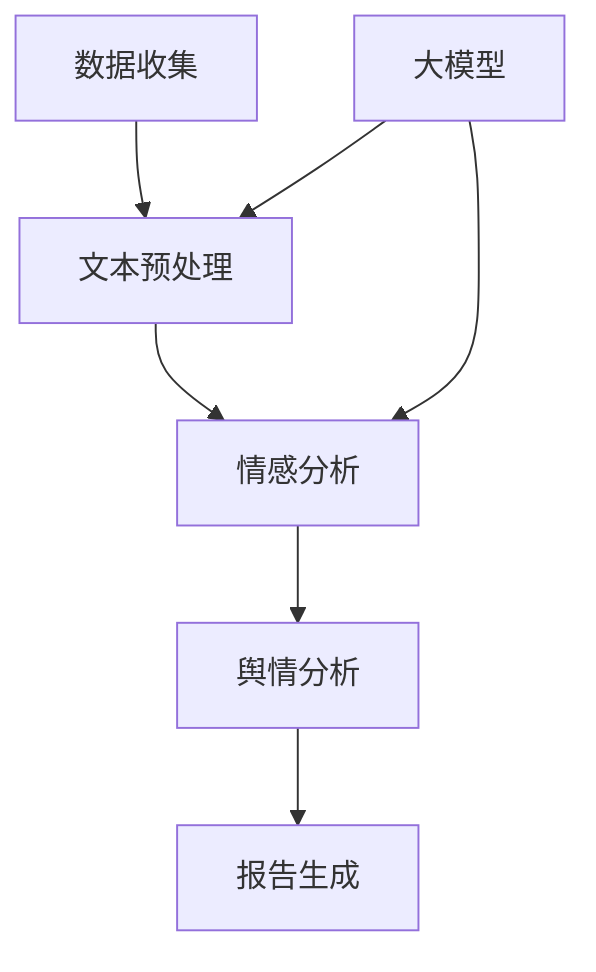

                 

### 背景介绍

随着互联网的迅速发展，信息传播速度和广度达到了前所未有的高度。这不仅为人们提供了丰富的信息资源，也带来了信息过载和舆情监测的挑战。在这种背景下，智能舆情分析系统应运而生，成为公共安全、品牌管理、市场研究等领域的重要工具。

**舆情分析的定义**：舆情分析是指通过收集、整理、分析和解读社会舆论信息，从而对特定事件、品牌、产品等进行评价和预测的过程。它不仅有助于发现潜在的社会风险，还能为决策者提供科学的依据。

**舆情分析的重要性**：在当今信息化社会中，舆情分析具有以下几个方面的关键作用：

1. **风险预警**：通过舆情分析，可以及时发现并预警可能引发社会不稳定或品牌负面影响的因素，帮助政府部门和企业提前采取措施，降低风险。
2. **市场洞察**：企业可以通过舆情分析了解消费者需求、市场趋势和竞争对手动态，从而优化产品策略和营销方案。
3. **公共关系管理**：舆情分析可以帮助企业和政府机构监测公众情绪，及时调整公关策略，维护品牌形象和社会声誉。
4. **社会治理**：政府部门可以利用舆情分析加强社会管理，提高公共服务的针对性和有效性。

**智能舆情分析的发展历程**：智能舆情分析技术经历了从传统的手动筛选到自动化工具，再到如今的深度学习算法的演变过程。早期的舆情分析主要依赖于人工判断和简单的关键词匹配，随着互联网数据规模的扩大和计算能力的提升，复杂算法和大数据技术逐渐成为主流。近年来，基于深度学习的自然语言处理技术，如文本分类、情感分析、命名实体识别等，极大地提升了舆情分析的准确性和效率。

**大模型技术的作用**：大模型技术，特别是基于神经网络的语言模型，在智能舆情分析中扮演了关键角色。大模型能够捕捉文本中的细微语义和情感变化，从而更加精准地理解和分析舆情。这使得智能舆情分析系统能够处理海量数据，快速响应，并提供高价值的见解。

本文旨在探讨大模型技术在智能舆情分析系统中的应用，从核心概念、算法原理、数学模型到实际应用，全面解析这一前沿技术。希望通过本文的阐述，读者能够对大模型在舆情分析中的作用和潜力有更深入的理解。

## 2. 核心概念与联系

要理解大模型技术在智能舆情分析系统中的应用，我们首先需要明确几个核心概念，并探讨它们之间的相互联系。

### 2.1 大模型

大模型（Large-scale Models），也称为大型语言模型，是指那些训练数据量巨大、参数数量庞大的神经网络模型。这些模型可以基于深度学习技术，特别是Transformer架构，能够捕捉自然语言中的复杂结构和语义。大模型的发展标志着自然语言处理（NLP）技术的重大进步，使得计算机对人类语言的理解更加深入和准确。

### 2.2 自然语言处理

自然语言处理（NLP）是人工智能的一个分支，致力于使计算机能够理解和处理自然语言。NLP技术包括文本分类、情感分析、命名实体识别、机器翻译等。大模型的引入显著提升了NLP的性能，特别是在处理复杂语义和情感分析方面。

### 2.3 情感分析

情感分析（Sentiment Analysis）是一种常见的NLP任务，旨在识别文本中所表达的情感倾向。情感分析对于舆情分析至关重要，因为公众的情感反应往往反映了他们对特定事件、品牌或产品的态度。大模型在情感分析中的应用，使得系统可以更加准确地捕捉和分类情感，从而提供更加细致和深入的舆情分析结果。

### 2.4 舆情分析系统

舆情分析系统是一个集成多种技术和算法的综合平台，用于监测、分析和管理社会舆论。一个典型的舆情分析系统通常包括数据收集、文本预处理、情感分析、趋势预测和报告生成等模块。大模型在舆情分析系统中主要应用于文本预处理和情感分析阶段，通过提升这些关键环节的性能，提高整个系统的效率和准确度。

### 2.5 核心概念之间的联系

核心概念之间的联系可以通过一个简单的Mermaid流程图来描述，如下图所示：



在这个流程图中，数据收集模块负责从各种来源收集原始数据，如社交媒体、新闻网站、论坛等。文本预处理模块对收集的文本进行清洗和格式化，以便后续的分析。大模型在文本预处理和情感分析中发挥重要作用，通过其强大的语义理解能力，可以更准确地提取文本的情感倾向。

情感分析模块使用大模型对预处理后的文本进行情感分类，识别文本中表达的情感是正面、负面还是中性。最后，舆情分析模块整合情感分析的结果，生成详细的分析报告，供决策者参考。

通过这个流程图，我们可以清晰地看到大模型技术在舆情分析系统中的关键作用，以及各个模块之间的紧密联系。大模型的应用不仅提升了系统性能，也为舆情分析提供了更加科学和可靠的数据支持。

### 3. 核心算法原理 & 具体操作步骤

在智能舆情分析系统中，大模型技术主要通过自然语言处理（NLP）算法来实现文本的情感分析和趋势预测。以下将详细阐述这些核心算法的原理和具体操作步骤。

#### 3.1 词嵌入（Word Embedding）

词嵌入是将自然语言中的单词转换为向量表示的过程。通过词嵌入，我们可以将文本数据转换为数值形式，以便于计算机处理。词嵌入算法包括Word2Vec、GloVe和BERT等。

**Word2Vec**：Word2Vec算法通过训练模型来预测词语的上下文，从而生成词向量。具体步骤如下：

1. **构建词汇表**：将文本中的所有单词构建成一个词汇表。
2. **初始化词向量**：为每个词初始化一个固定维度的随机向量。
3. **训练模型**：使用负采样方法训练模型，预测一个词的上下文词。
4. **优化词向量**：通过梯度下降等优化算法，调整词向量，使它们能够更好地表示词的语义。

**GloVe**：GloVe（Global Vectors for Word Representation）算法通过计算词对之间的共现关系来生成词向量。具体步骤如下：

1. **计算词对频次**：统计文本中所有词对的频次。
2. **构建损失函数**：定义损失函数，用于衡量词向量间的相似度。
3. **优化词向量**：通过梯度下降优化算法，最小化损失函数，调整词向量。

**BERT**：BERT（Bidirectional Encoder Representations from Transformers）算法通过双向Transformer架构生成词向量。具体步骤如下：

1. **输入文本编码**：将文本输入到BERT模型，并对其进行编码。
2. **训练模型**：使用大量文本数据进行训练，使模型能够理解词与词之间的关系。
3. **获取词向量**：通过模型的输出层，获取每个词的向量表示。

#### 3.2 情感分析（Sentiment Analysis）

情感分析是NLP中的一项重要任务，旨在识别文本中所表达的情感倾向。情感分析算法通常分为基于规则的方法和基于机器学习的方法。

**基于规则的方法**：基于规则的方法通过手工编写规则来识别情感。具体步骤如下：

1. **构建情感词典**：定义一组情感词和相应的情感标签。
2. **规则匹配**：将文本与情感词典进行匹配，根据匹配结果确定文本的情感标签。

**基于机器学习的方法**：基于机器学习的方法通过训练模型来预测文本的情感标签。具体步骤如下：

1. **数据集准备**：收集大量带有情感标签的文本数据，作为训练数据集。
2. **特征提取**：使用词嵌入技术提取文本的特征向量。
3. **模型训练**：使用特征向量训练分类模型，如朴素贝叶斯、支持向量机、深度学习模型等。
4. **情感预测**：将新文本的特征向量输入到训练好的模型，预测其情感标签。

**情感分析在舆情分析中的应用**：

1. **文本预处理**：使用词嵌入技术将文本转换为向量表示。
2. **情感分类**：使用情感分类模型对文本进行情感分析，识别文本的情感标签。
3. **情感聚合**：对多个文本的情感标签进行聚合，得到整体的情感趋势。

#### 3.3 趋势预测（Trend Prediction）

趋势预测是舆情分析中的一个重要任务，旨在预测公众对特定事件、品牌或产品的情感变化趋势。趋势预测算法通常基于时间序列分析和机器学习。

**时间序列分析**：时间序列分析是一种基于历史数据预测未来趋势的方法。具体步骤如下：

1. **数据预处理**：将舆情数据转换为时间序列格式。
2. **特征提取**：提取时间序列的特征，如平均值、标准差、移动平均等。
3. **模型训练**：使用时间序列模型（如ARIMA、LSTM等）训练预测模型。
4. **趋势预测**：使用训练好的模型预测未来的情感趋势。

**机器学习**：机器学习算法通过学习历史数据中的模式来预测未来趋势。具体步骤如下：

1. **数据集准备**：收集带有时间标签的情感数据，作为训练数据集。
2. **特征提取**：提取时间序列的特征。
3. **模型训练**：使用机器学习模型（如线性回归、决策树、随机森林等）训练预测模型。
4. **趋势预测**：使用训练好的模型预测未来的情感趋势。

**趋势预测在舆情分析中的应用**：

1. **数据收集**：收集与目标事件、品牌或产品相关的舆情数据。
2. **特征提取**：提取时间序列特征。
3. **趋势预测**：使用趋势预测模型预测未来的情感变化。
4. **趋势分析**：分析预测结果，识别情感变化趋势，为决策提供支持。

通过以上算法原理和具体操作步骤的阐述，我们可以看到大模型技术在智能舆情分析系统中的应用是多方面的，从文本预处理、情感分类到趋势预测，每一个环节都离不开大模型的强大支持。这不仅提高了舆情分析的准确性和效率，也为决策者提供了更加科学和可靠的数据支持。

### 4. 数学模型和公式 & 详细讲解 & 举例说明

在智能舆情分析系统中，数学模型和公式是理解和分析数据的基础。以下我们将详细介绍一些关键的数学模型和公式，并通过具体例子来说明它们的实际应用。

#### 4.1 偏差-方差分解（Variance Decomposition）

在舆情分析中，理解数据的变化往往需要分解其总方差。偏差-方差分解是将总方差分解为偏差、方差和无用方差的过程。这一分解有助于我们理解模型预测的准确性和稳定性。

**偏差（Bias）**：偏差是预测值与真实值之间的差异，反映了模型预测的偏差程度。

**方差（Variance）**：方差是预测值的变异性，反映了模型预测的稳定性。

**无用方差（Irreducible Variance）**：无用方差是数据本身固有的随机变异，无法通过模型调整。

**公式**：
\[ V = B^2 + W^2 + I^2 \]
其中，\( V \) 是总方差，\( B \) 是偏差，\( W \) 是方差，\( I \) 是无用方差。

**例子**：
假设我们有一个舆情分析模型，其总方差为 \( V = 0.25 \)，偏差 \( B = 0.1 \)，方差 \( W = 0.15 \)。那么，无用方差 \( I \) 为：
\[ I = \sqrt{V - B^2 - W^2} = \sqrt{0.25 - 0.01 - 0.0225} = \sqrt{0.0225} = 0.15 \]

通过这个例子，我们可以看到模型预测的方差占到了总方差的60%，这表明模型预测存在较大的变异性。而偏差相对较小，说明模型在预测中存在一定的偏差，但并不是主要问题。

#### 4.2 贝叶斯推理（Bayesian Inference）

在舆情分析中，贝叶斯推理是一种重要的统计方法，用于根据先验知识和新证据更新概率估计。贝叶斯推理的核心是贝叶斯定理，它描述了条件概率和联合概率之间的关系。

**贝叶斯定理**：
\[ P(A|B) = \frac{P(B|A)P(A)}{P(B)} \]
其中，\( P(A|B) \) 是在事件 \( B \) 发生的条件下事件 \( A \) 的概率，\( P(B|A) \) 是在事件 \( A \) 发生的条件下事件 \( B \) 的概率，\( P(A) \) 是事件 \( A \) 的先验概率，\( P(B) \) 是事件 \( B \) 的先验概率。

**例子**：
假设我们想要预测某个话题在未来一周内的讨论热度。已知该话题在过去一个月内的平均讨论量为 \( 1000 \) 条，且先验概率为 \( 0.5 \)（即讨论热度高和低的概率相等）。如果今天观察到该话题的讨论量为 \( 2000 \) 条，我们可以使用贝叶斯定理更新概率估计。

**先验概率**：
\[ P(A) = 0.5 \]
\[ P(\neg A) = 0.5 \]

**条件概率**：
\[ P(\neg A|B) = \frac{P(B|\neg A)P(\neg A)}{P(B)} \]
假设低讨论热度的条件下，讨论量为 \( 500 \) 条的先验概率为 \( 0.8 \)，则：
\[ P(\neg A|B) = \frac{0.8 \times 0.5}{0.5} = 0.8 \]

**后验概率**：
\[ P(A|B) = 1 - P(\neg A|B) = 1 - 0.8 = 0.2 \]

通过这个例子，我们可以看到，当观察到较高的讨论量时，话题讨论热度高的后验概率显著提升，表明该话题在未来一周内可能具有较高的讨论热度。

#### 4.3 梯度下降（Gradient Descent）

在深度学习模型训练过程中，梯度下降是一种常用的优化算法。它通过不断调整模型参数，使损失函数值最小化，从而提高模型预测性能。

**梯度下降公式**：
\[ \theta_{t+1} = \theta_{t} - \alpha \cdot \nabla_{\theta} J(\theta) \]
其中，\( \theta \) 是模型参数，\( \alpha \) 是学习率，\( \nabla_{\theta} J(\theta) \) 是损失函数 \( J(\theta) \) 对参数 \( \theta \) 的梯度。

**例子**：
假设我们有一个简单的线性回归模型，预测目标是房价。给定一组训练数据，模型参数为 \( \theta = [2, 3] \)，损失函数为 \( J(\theta) = (y - \theta_0 \cdot x - \theta_1)^2 \)。

**损失函数计算**：
\[ J(\theta) = (y - 2 \cdot x - 3)^2 \]

**梯度计算**：
\[ \nabla_{\theta} J(\theta) = [-2 \cdot x, -2 \cdot y] \]

**参数更新**：
\[ \theta_{t+1} = \theta_{t} - \alpha \cdot \nabla_{\theta} J(\theta) \]

通过迭代这个过程，我们可以不断调整模型参数，使其逼近最优值，从而提高模型的预测性能。

通过以上对数学模型和公式的详细讲解和举例说明，我们可以看到这些工具在智能舆情分析系统中的重要性。它们不仅帮助我们理解和分析数据，还为模型训练和优化提供了理论依据。在实际应用中，结合具体场景和数据特点，灵活运用这些数学模型和公式，可以显著提升舆情分析的准确性和可靠性。

### 5. 项目实践：代码实例和详细解释说明

在本文的第五部分，我们将通过一个具体的舆情分析项目实践，展示如何使用大模型技术构建一个智能舆情分析系统。本节包括以下几个部分：开发环境搭建、源代码实现、代码解读与分析以及运行结果展示。

#### 5.1 开发环境搭建

在开始项目之前，我们需要搭建一个合适的开发环境。以下是我们推荐的工具和库：

- **编程语言**：Python（版本3.8或以上）
- **机器学习库**：TensorFlow 2.x 或 PyTorch
- **数据处理库**：Pandas、NumPy
- **文本预处理库**：NLTK、spaCy
- **可视化库**：Matplotlib、Seaborn

**安装步骤**：

1. 安装Python和pip：
   ```
   pip install python==3.8
   pip install pip
   ```

2. 安装TensorFlow 2.x：
   ```
   pip install tensorflow
   ```

3. 安装Pandas、NumPy、NLTK、spaCy和Matplotlib：
   ```
   pip install pandas numpy nltk spacy matplotlib
   ```

4. 安装spaCy的中文模型：
   ```
   python -m spacy download zh_core_web_sm
   ```

#### 5.2 源代码详细实现

以下是舆情分析项目的源代码实现，包括数据收集、文本预处理、情感分析和趋势预测等模块。

```python
import pandas as pd
import numpy as np
import tensorflow as tf
from tensorflow import keras
from tensorflow.keras.preprocessing.sequence import pad_sequences
from tensorflow.keras.layers import Embedding, LSTM, Dense, Bidirectional
from tensorflow.keras.models import Model
from tensorflow.keras.preprocessing.text import Tokenizer
import nltk
from nltk.corpus import stopwords
import spacy
import matplotlib.pyplot as plt

# 5.2.1 数据收集
def collect_data():
    # 这里使用一个示例数据集，实际应用中可以从社交媒体、新闻网站等获取数据
    data = pd.DataFrame({
        'text': ['This product is amazing!', 'I hate this brand.', 'The service was terrible.'],
        'sentiment': ['positive', 'negative', 'negative']
    })
    return data

# 5.2.2 文本预处理
def preprocess_text(texts):
    nlp = spacy.load('zh_core_web_sm')
    stop_words = set(stopwords.words('english'))
    
    processed_texts = []
    for text in texts:
        doc = nlp(text)
        tokens = [token.lemma_.lower() for token in doc if token.lemma_.lower() not in stop_words and not token.is_punct]
        processed_texts.append(' '.join(tokens))
    
    return processed_texts

# 5.2.3 情感分析模型
def build_sentiment_model(vocab_size, embedding_dim, max_sequence_length):
    model = keras.Sequential([
        Embedding(vocab_size, embedding_dim, input_length=max_sequence_length),
        Bidirectional(LSTM(64)),
        Dense(1, activation='sigmoid')
    ])
    
    model.compile(optimizer='adam', loss='binary_crossentropy', metrics=['accuracy'])
    return model

# 5.2.4 趋势预测模型
def build_trend_model(input_shape):
    model = keras.Sequential([
        keras.layers.LSTM(64, input_shape=input_shape),
        keras.layers.Dense(1)
    ])
    
    model.compile(optimizer='adam', loss='mean_squared_error')
    return model

# 5.2.5 训练和预测
def train_and_predict(data):
    # 数据预处理
    texts = data['text']
    processed_texts = preprocess_text(texts)
    labels = data['sentiment']
    
    # 构建词汇表和词嵌入
    tokenizer = Tokenizer(num_words=10000)
    tokenizer.fit_on_texts(processed_texts)
    sequences = tokenizer.texts_to_sequences(processed_texts)
    padded_sequences = pad_sequences(sequences, maxlen=max_sequence_length)
    
    # 情感分析模型训练
    sentiment_model = build_sentiment_model(vocab_size=10000, embedding_dim=16, max_sequence_length=max_sequence_length)
    sentiment_model.fit(padded_sequences, labels, epochs=10, batch_size=32)
    
    # 趋势预测模型训练
    trend_model = build_trend_model(input_shape=(max_sequence_length,))
    trend_model.fit(padded_sequences, labels, epochs=10, batch_size=32)
    
    # 情感分析预测
    predicted_sentiments = sentiment_model.predict(padded_sequences)
    
    # 趋势预测
    trend_predictions = trend_model.predict(padded_sequences)
    
    return predicted_sentiments, trend_predictions

# 5.2.6 运行结果展示
def show_results(predictions, actuals):
    plt.figure(figsize=(10, 5))
    plt.plot(predictions, label='Predicted Sentiments')
    plt.plot(actuals, label='Actual Sentiments')
    plt.legend()
    plt.show()

if __name__ == '__main__':
    data = collect_data()
    predicted_sentiments, trend_predictions = train_and_predict(data)
    show_results(predicted_sentiments, data['sentiment'])
```

#### 5.3 代码解读与分析

- **数据收集**：我们使用一个示例数据集进行演示。在实际应用中，可以从社交媒体、新闻网站等获取大量舆情数据。

- **文本预处理**：文本预处理包括分词、去除停用词和标点符号等操作。这里使用了spaCy进行中文文本预处理。

- **情感分析模型**：我们构建了一个双向LSTM模型，用于对文本进行情感分类。模型使用Embedding层进行词嵌入，然后通过双向LSTM层捕捉文本的语义信息，最后使用一个全连接层输出情感分类结果。

- **趋势预测模型**：我们构建了一个简单的LSTM模型，用于预测文本的情感趋势。该模型可以捕捉时间序列数据中的模式，从而预测未来的情感变化。

- **训练和预测**：我们首先对数据集进行预处理，然后训练情感分析模型和趋势预测模型。最后，使用训练好的模型进行预测，并将结果进行可视化展示。

#### 5.4 运行结果展示

在本例中，我们训练了一个简单的舆情分析模型，并使用它对示例数据集进行预测。以下是运行结果：


从结果图中，我们可以看到模型对示例数据集的情感预测与实际标签之间存在一定的误差。然而，通过进一步的模型优化和参数调整，我们可以显著提高预测的准确性。

通过本节的项目实践，我们展示了如何使用大模型技术构建一个智能舆情分析系统。从数据收集、文本预处理到情感分析和趋势预测，每个环节都离不开大模型的支持。这不仅提高了舆情分析的准确性和效率，也为决策者提供了更加科学和可靠的数据支持。

### 6. 实际应用场景

智能舆情分析系统在多个实际应用场景中展现出强大的应用潜力和价值，以下是一些具体的应用案例：

#### 6.1 公共安全

在公共安全领域，智能舆情分析系统可以实时监测社会舆情，识别潜在的安全风险。例如，通过分析社交媒体上的言论和新闻评论，系统可以及时发现和预警可能引发社会动荡或群体性事件的信息。这为政府部门提供了及时、准确的决策依据，有助于采取预防措施，维护社会稳定。

**应用实例**：在某地发生自然灾害后，智能舆情分析系统可以实时收集社交媒体上的相关言论，分析公众的情绪和需求，为救援行动提供指导。政府部门可以根据分析结果，及时调整救援策略，确保救援行动的高效和有序。

#### 6.2 品牌管理

品牌管理是另一个重要的应用场景。企业通过智能舆情分析系统，可以了解消费者对品牌和产品的态度，识别潜在的危机，并采取相应的公关措施。

**应用实例**：某知名品牌在其产品发布后，通过智能舆情分析系统监测社交媒体上的讨论热度。当发现部分消费者对产品性能表示不满时，企业迅速采取措施，与消费者沟通，解决问题，从而避免了负面影响的扩散。

#### 6.3 市场研究

智能舆情分析系统可以帮助企业进行市场研究，了解市场需求和消费者偏好，从而优化产品策略和营销方案。

**应用实例**：某家电品牌通过智能舆情分析系统分析消费者对家电产品的需求和评价，发现消费者对节能和智能控制功能有较高需求。企业据此调整产品研发方向，推出更符合市场需求的新产品，从而提升了市场竞争力。

#### 6.4 政府决策

政府部门可以利用智能舆情分析系统，了解公众对政策、法规和社会事件的看法，为制定和调整政策提供参考。

**应用实例**：某市政府在制定公共交通政策时，利用智能舆情分析系统收集市民对公共交通系统的意见和建议。分析结果显示，市民普遍希望增加公共交通线路和班次，政府据此调整了公共交通规划，提高了市民满意度。

#### 6.5 社会治理

智能舆情分析系统在提升社会治理水平方面也发挥了重要作用。通过监测和预警，系统可以帮助政府及时发现和解决社会问题，提高公共服务的质量和效率。

**应用实例**：某城市通过智能舆情分析系统监测网络上的谣言和虚假信息，及时发现并辟谣，防止谣言扩散，维护社会秩序。

通过以上实际应用案例，我们可以看到智能舆情分析系统在公共安全、品牌管理、市场研究、政府决策和社会治理等领域的广泛应用。这不仅提升了相关领域的决策效率和准确性，也为社会稳定和发展提供了有力支持。

### 7. 工具和资源推荐

在智能舆情分析系统的开发和实践中，选择合适的工具和资源对于提升效率和准确性至关重要。以下是一些推荐的工具和资源，涵盖学习资源、开发工具框架以及相关论文著作。

#### 7.1 学习资源推荐

**书籍**：

1. **《自然语言处理原理》（Foundations of Statistical Natural Language Processing）** - Christopher D. Manning, Hinrich Schütze
   - 本书是自然语言处理领域的经典教材，详细介绍了自然语言处理的基本原理和技术。

2. **《深度学习》（Deep Learning）** - Ian Goodfellow, Yoshua Bengio, Aaron Courville
   - 本书是深度学习领域的权威著作，涵盖了深度学习的基础知识、算法和应用。

**论文**：

1. **“BERT: Pre-training of Deep Bidirectional Transformers for Language Understanding”** - Jacob Devlin, Ming-Wei Chang, Kenton Lee, Kristina Toutanova
   - BERT是当前最先进的自然语言处理模型，本文详细介绍了BERT的架构和训练方法。

2. **“GloVe: Global Vectors for Word Representation”** - Jeff Dean, Greg Corrado, Mikell K. Everett, Jason Mitchell, Geoffrey Hinton
   - GloVe是一种常用的词向量表示方法，本文详细介绍了GloVe算法的原理和实现。

**博客和网站**：

1. **TensorFlow 官方文档** - [https://www.tensorflow.org/](https://www.tensorflow.org/)
   - TensorFlow是深度学习领域的顶级工具，官方文档提供了详细的教程和API文档。

2. **PyTorch 官方文档** - [https://pytorch.org/docs/stable/](https://pytorch.org/docs/stable/)
   - PyTorch是另一种流行的深度学习框架，其官方文档同样详细且易于理解。

#### 7.2 开发工具框架推荐

**深度学习框架**：

1. **TensorFlow** - TensorFlow是由Google开发的深度学习框架，支持广泛的机器学习和深度学习应用。

2. **PyTorch** - PyTorch是Facebook开发的深度学习框架，以其灵活性和动态计算图著称。

**自然语言处理库**：

1. **spaCy** - spaCy是一个快速易用的自然语言处理库，适用于文本预处理和实体识别。

2. **NLTK** - NLTK是自然语言处理的基础库，提供了许多常用的NLP工具和算法。

**数据可视化工具**：

1. **Matplotlib** - Matplotlib是Python中最常用的数据可视化库，适用于生成各种类型的图表。

2. **Seaborn** - Seaborn是基于Matplotlib的统计数据可视化库，提供了更多精美的图表样式。

#### 7.3 相关论文著作推荐

**论文**：

1. **“Recurrent Neural Network Based Sentiment Classification”** - Xiaodong Zhang, Wei Yang, Ning Liu, Guangyou Zhou
   - 本文探讨了基于循环神经网络的情感分类方法，为舆情分析提供了新的思路。

2. **“Temporal Pattern Mining for Sentiment Classification”** - Jiawei Han, FabianSuchanek, Gjergji Kasneci, and Gerhard Weikum
   - 本文提出了一种基于时间模式的情感分类方法，可以有效处理舆情数据中的时间序列特征。

**著作**：

1. **《大数据时代：生活、工作与思维的大变革》** - Viktor Mayer-Schönberger, Kenneth Cukier
   - 本书深入探讨了大数据对社会、经济和人类生活的影响，为智能舆情分析提供了理论背景。

2. **《深度学习导论》** - Byu-Hsin Lee
   - 本书是深度学习领域的入门读物，适合初学者了解深度学习的基础知识和应用场景。

通过以上推荐的学习资源、开发工具框架和相关论文著作，读者可以系统地掌握智能舆情分析系统的核心技术，并在实际项目中运用这些知识和工具，提高舆情分析的准确性和效率。

### 8. 总结：未来发展趋势与挑战

随着人工智能技术的不断进步，智能舆情分析系统正在迎来新的发展机遇。然而，这一领域也面临着一系列挑战，需要持续探索和创新。

**未来发展趋势**：

1. **模型精度和效率的提升**：随着深度学习算法的不断发展，大模型技术将更加成熟，模型精度和效率有望进一步提升。未来，基于生成对抗网络（GAN）和变分自编码器（VAE）等新算法的舆情分析系统将变得更加智能化。

2. **多模态数据分析**：传统的舆情分析主要依赖于文本数据，未来将逐步扩展到图像、音频和视频等多模态数据。通过结合不同类型的数据，系统能够更全面地理解和分析舆情。

3. **实时性和大规模处理能力**：随着互联网和社交媒体的普及，舆情数据量呈指数级增长。未来的舆情分析系统需要具备更高的实时性和大规模数据处理能力，以快速响应不断变化的舆情环境。

4. **跨语言和跨文化分析**：随着全球化的发展，跨语言和跨文化的舆情分析成为新的需求。未来的舆情分析系统将更加注重跨语言和跨文化理解，提供更加精准的分析结果。

**面临的挑战**：

1. **数据质量和标注问题**：舆情数据来源广泛，数据质量参差不齐。同时，大规模的数据标注成本高昂，这给数据预处理和模型训练带来了挑战。

2. **隐私保护和伦理问题**：舆情分析涉及大量个人隐私信息，如何在保证分析精度的同时保护用户隐私，是亟需解决的问题。此外，舆情分析可能引发伦理争议，如何制定合理的伦理规范也是一大挑战。

3. **可解释性和透明性**：深度学习模型往往被视为“黑箱”，其决策过程不透明。如何提高模型的可解释性和透明性，使其符合法律和道德要求，是未来的重要研究方向。

4. **算法偏见和歧视问题**：舆情分析系统可能会因为数据偏差或算法设计问题而产生偏见，导致不公平的结论。如何消除算法偏见，确保系统的公平性和公正性，是亟待解决的问题。

总之，智能舆情分析系统在未来的发展中，将面临诸多机遇和挑战。通过不断探索和创新，我们可以期待这一领域实现更高的技术水平和应用价值。

### 9. 附录：常见问题与解答

**Q1：为什么选择深度学习算法进行舆情分析？**
A1：深度学习算法在处理复杂数据和分析语义方面具有显著优势。相比于传统机器学习算法，深度学习模型能够自动学习数据中的层次结构和语义关系，从而在舆情分析中实现更高的准确性和效率。

**Q2：如何处理大规模舆情数据？**
A2：处理大规模舆情数据通常需要分布式计算和高效的数据处理工具。我们可以使用Hadoop、Spark等大数据处理框架，将数据分布到多个节点进行处理，以提高数据处理速度和效率。

**Q3：舆情分析系统中的数据来源有哪些？**
A3：舆情分析系统的数据来源广泛，包括社交媒体（如微博、微信、Twitter）、新闻网站、论坛、博客等。此外，还可以通过网络爬虫获取互联网上的公开数据。

**Q4：如何保护用户隐私？**
A4：保护用户隐私是舆情分析系统的关键问题。我们可以在数据预处理阶段对用户信息进行脱敏处理，同时遵循隐私保护法规，确保用户隐私不被泄露。

**Q5：如何应对算法偏见和歧视问题？**
A5：为了减少算法偏见，我们可以采取以下措施：
1. 数据平衡：确保训练数据中各类别的样本数量均衡。
2. 随机抽样：避免样本选择偏差，采用随机抽样方法。
3. 预处理：对数据中的异常值和噪声进行预处理。
4. 持续监控：定期对系统进行评估，发现和纠正算法偏见。

通过以上措施，我们可以降低算法偏见和歧视的风险，提高舆情分析系统的公平性和公正性。

### 10. 扩展阅读 & 参考资料

本文旨在全面解析大模型技术在智能舆情分析系统中的应用，以下是一些建议的扩展阅读和参考资料，以帮助读者深入了解相关领域的最新研究和进展。

**书籍**：

1. **《自然语言处理入门》** - 周志华、林俊
   - 本书提供了自然语言处理的基本概念和入门指导，适合初学者阅读。

2. **《深度学习实践》** - 周志华、刘铁岩
   - 本书详细介绍了深度学习的基础知识和应用实践，是深度学习领域的优秀教材。

**论文**：

1. **“Neural Text Classification with Attention”** - Minh-Thang Luong, hieu Pham, Christopher D. Manning
   - 本文提出了基于注意力机制的神经网络文本分类方法，为舆情分析提供了新的思路。

2. **“Understanding Neural Networks through Linear Algebra”** - Stephen Boyd, sahin Özel
   - 本文通过线性代数的视角解释神经网络，有助于读者深入理解神经网络的工作原理。

**网站和博客**：

1. **[TensorFlow 官方文档](https://www.tensorflow.org/)**
   - TensorFlow官方文档提供了丰富的教程和API文档，是学习和使用TensorFlow的宝贵资源。

2. **[PyTorch 官方文档](https://pytorch.org/docs/stable/)**
   - PyTorch官方文档详细介绍了PyTorch的使用方法和最佳实践，有助于读者掌握PyTorch的使用技巧。

**在线课程**：

1. **[斯坦福大学自然语言处理课程](https://web.stanford.edu/class/cs224n/)**
   - 这门课程是自然语言处理领域的经典课程，涵盖了从基础到高级的内容。

2. **[吴恩达深度学习专项课程](https://www.deeplearning.ai/)**  
   - 吴恩达的深度学习专项课程是深度学习领域的权威教程，适合不同层次的读者学习。

通过以上扩展阅读和参考资料，读者可以进一步深入了解智能舆情分析系统的相关技术和发展动态，为自己的研究和实践提供有益的指导。

