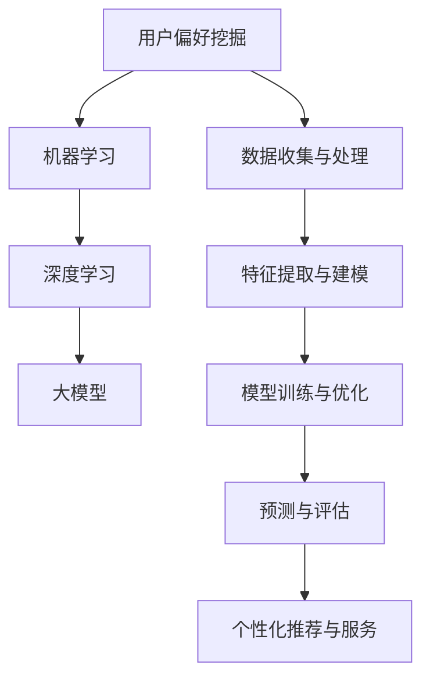

                 

### 背景介绍

随着互联网技术的迅猛发展，电商平台已经成为消费者购买商品的重要渠道。在这个过程中，如何有效地挖掘用户偏好，实现精准营销，成为电商平台竞争的关键因素。传统的用户偏好挖掘方法往往依赖于统计分析和机器学习算法，但这些方法存在一些局限性。

首先，传统的统计分析方法通常需要大量的人力和时间来收集和处理数据，而且对于大规模数据集的处理能力有限。此外，这些方法往往依赖于特定的数据格式和特征提取方法，难以应对数据多样性和变化性。

其次，传统的机器学习算法虽然在处理大规模数据集方面具有优势，但它们通常需要大量的训练数据和复杂的模型参数调整。这使得算法在实际应用中的部署和运维变得相对困难。

为了解决上述问题，近年来，大模型技术逐渐成为用户偏好挖掘的重要工具。大模型技术具有以下优点：

1. **强大的数据处理能力**：大模型可以通过深度学习算法自动学习数据中的复杂模式和关联性，从而实现对大规模数据集的快速处理。

2. **自适应性和泛化能力**：大模型可以根据不同的应用场景和需求，自动调整模型参数，实现自适应性和泛化能力。

3. **高精度预测**：大模型可以通过对大量历史数据的分析和学习，提供更精准的用户偏好预测结果。

4. **可解释性**：虽然大模型的决策过程相对复杂，但通过一定的技术手段，可以实现对模型决策过程的可解释性，帮助用户理解模型的工作原理。

因此，大模型技术在电商平台用户偏好挖掘中的应用，不仅能够提高挖掘效率和精度，还能够降低人力和时间成本，为电商平台提供更加精准和个性化的营销策略。本文将详细介绍大模型技术在电商平台用户偏好挖掘中的应用原理、算法实现、数学模型和实际应用场景，并探讨其未来发展趋势与挑战。通过本文的阅读，读者将能够全面了解大模型技术在实际应用中的价值与潜力。### 核心概念与联系

在深入探讨大模型技术在电商平台用户偏好挖掘中的应用之前，我们需要明确几个核心概念，并理解它们之间的联系。这些核心概念包括：用户偏好挖掘、大模型、深度学习、机器学习以及相关技术。

#### 用户偏好挖掘

用户偏好挖掘是指通过分析用户的行为数据、购买记录、搜索历史等信息，识别用户的偏好和兴趣，从而为用户提供个性化推荐和服务。用户偏好挖掘的关键在于如何从海量数据中提取有价值的信息，并准确预测用户的未来行为。

#### 大模型

大模型（Large-scale Model）是指拥有大量参数和训练数据的深度学习模型。这些模型通常基于神经网络架构，通过在大型数据集上训练，能够自动学习数据中的复杂模式和关联性。大模型在处理大规模数据和复杂任务时表现出色，但同时也需要大量的计算资源和时间。

#### 深度学习

深度学习是机器学习的一种方法，通过多层神经网络模拟人脑的决策过程，实现对复杂数据的自动特征提取和学习。深度学习在大模型技术的发展中起到了关键作用，它使得模型能够处理更多的数据，提取更深层次的特征。

#### 机器学习

机器学习是人工智能的一个分支，通过训练算法让计算机从数据中学习规律，并自动做出决策或预测。机器学习分为监督学习、无监督学习和半监督学习等不同类型，其中监督学习在大模型技术中应用最为广泛。

#### 技术联系

用户偏好挖掘需要机器学习算法来处理和分析用户数据，而深度学习作为机器学习的一种方法，提供了强大的特征提取和学习能力。大模型则通过深度学习算法，实现了在大量数据上的高效学习和预测。

#### Mermaid 流程图

为了更直观地展示这些核心概念之间的联系，我们可以使用 Mermaid 流程图来表示。以下是用户偏好挖掘、大模型、深度学习和机器学习之间的联系：



在上述流程图中，用户偏好挖掘作为起点，通过机器学习和深度学习技术，结合大模型的能力，实现了对用户数据的收集、特征提取、模型训练、预测和评估，最终为用户提供个性化的推荐和服务。

通过明确这些核心概念及其联系，我们为后续详细探讨大模型技术在电商平台用户偏好挖掘中的应用奠定了基础。在接下来的部分，我们将深入分析大模型技术的原理和具体实现步骤。### 核心算法原理 & 具体操作步骤

大模型技术在电商平台用户偏好挖掘中的应用，主要依赖于深度学习算法和大规模数据处理能力。本节将详细介绍大模型的核心算法原理和具体操作步骤，以帮助读者更好地理解其工作原理和实现方法。

#### 深度学习算法原理

深度学习算法基于多层神经网络结构，通过多个隐藏层对输入数据进行层层抽象和特征提取。神经网络的基本单元是神经元，每个神经元都与输入层的其他神经元相连，并通过权重进行数据传递和计算。在训练过程中，神经网络通过反向传播算法不断调整权重，使网络输出与实际标签之间的误差最小。

深度学习算法主要包括以下步骤：

1. **前向传播**：将输入数据通过网络进行层层计算，得到输出结果。
2. **反向传播**：计算输出结果与实际标签之间的误差，并通过反向传播算法调整网络权重。
3. **优化算法**：使用优化算法（如梯度下降）调整权重，以减少误差。

#### 大规模数据处理能力

大模型技术的核心在于其能够处理和分析大规模数据集。这主要通过以下几个方面实现：

1. **分布式计算**：利用分布式计算框架（如 TensorFlow、PyTorch）将计算任务分布在多台计算机上，提高数据处理速度。
2. **数据预处理**：通过数据清洗、数据转换和数据集成等技术，确保数据质量和一致性。
3. **批处理**：将大规模数据集划分为多个批次，分批进行数据处理和训练，以充分利用计算资源。

#### 用户偏好挖掘操作步骤

具体到电商平台用户偏好挖掘，大模型技术的操作步骤如下：

1. **数据收集**：收集用户的购买记录、浏览历史、搜索日志等数据。
2. **数据预处理**：对数据进行清洗、去重和转换，提取有用的特征。
3. **特征提取**：使用深度学习算法对预处理后的数据进行特征提取，得到高维特征向量。
4. **模型训练**：使用提取的特征向量训练深度学习模型，调整模型参数，优化模型性能。
5. **模型评估**：使用验证集或测试集对训练好的模型进行评估，确定模型准确性和泛化能力。
6. **个性化推荐**：将训练好的模型应用于实际用户数据，预测用户偏好，生成个性化推荐结果。
7. **反馈与优化**：根据用户反馈和推荐效果，对模型进行调整和优化，以提高推荐准确性。

#### 具体实现步骤

以下是用户偏好挖掘的具体实现步骤：

1. **数据收集**：

```python
import pandas as pd

# 读取用户购买记录
purchase_data = pd.read_csv('purchase_data.csv')

# 读取用户浏览历史
browser_history = pd.read_csv('browser_history.csv')

# 读取用户搜索日志
search_log = pd.read_csv('search_log.csv')
```

2. **数据预处理**：

```python
from sklearn.preprocessing import StandardScaler

# 清洗和去重
data = pd.concat([purchase_data, browser_history, search_log], axis=1)
data = data.drop_duplicates()

# 转换为数值类型
data = data.apply(pd.to_numeric, errors='coerce')

# 标准化特征
scaler = StandardScaler()
data_scaled = scaler.fit_transform(data)
```

3. **特征提取**：

```python
from keras.models import Sequential
from keras.layers import Dense, Dropout

# 构建深度学习模型
model = Sequential()
model.add(Dense(128, input_shape=(data_scaled.shape[1],), activation='relu'))
model.add(Dropout(0.5))
model.add(Dense(64, activation='relu'))
model.add(Dropout(0.5))
model.add(Dense(32, activation='relu'))
model.add(Dropout(0.5))
model.add(Dense(1, activation='sigmoid'))

# 编译模型
model.compile(optimizer='adam', loss='binary_crossentropy', metrics=['accuracy'])

# 训练模型
model.fit(data_scaled, labels, epochs=10, batch_size=32)
```

4. **模型评估**：

```python
from sklearn.metrics import accuracy_score

# 预测测试集
predictions = model.predict(test_data)

# 计算准确率
accuracy = accuracy_score(test_labels, predictions)
print(f"Model accuracy: {accuracy}")
```

5. **个性化推荐**：

```python
# 输入用户数据
user_data = scaler.transform(new_user_data)

# 预测用户偏好
user_preference = model.predict(user_data)

# 根据偏好生成推荐结果
recommended_products = generate_recommendations(user_preference)
```

通过上述步骤，我们可以利用大模型技术实现用户偏好挖掘，为电商平台提供个性化的推荐服务。在接下来的部分，我们将进一步探讨大模型技术在数学模型和实际应用中的详细实现。### 数学模型和公式 & 详细讲解 & 举例说明

在用户偏好挖掘中，大模型技术通常涉及多种数学模型和公式，这些模型和公式帮助我们从数据中提取有价值的信息，并做出精准的预测。以下将详细讲解大模型技术中的几个关键数学模型和公式，并举例说明其应用。

#### 损失函数

在深度学习中，损失函数（Loss Function）用于衡量模型预测值与实际值之间的差距。常见的损失函数包括均方误差（MSE）、交叉熵损失（Cross-Entropy Loss）等。

1. **均方误差（MSE）**

   均方误差用于回归任务，计算预测值与实际值之间的平均平方误差。其公式如下：

   $$MSE = \frac{1}{n}\sum_{i=1}^{n}(y_i - \hat{y}_i)^2$$

   其中，\(y_i\) 是实际值，\(\hat{y}_i\) 是预测值，\(n\) 是样本数量。

2. **交叉熵损失（Cross-Entropy Loss）**

   交叉熵损失用于分类任务，计算预测概率分布与实际标签之间的交叉熵。其公式如下：

   $$CE = -\sum_{i=1}^{n}y_i\log(\hat{y}_i)$$

   其中，\(y_i\) 是实际标签（0或1），\(\hat{y}_i\) 是预测概率。

   **举例说明**：

   假设我们有以下一组实际标签和预测概率：

   $$y = [0, 1, 0, 1], \hat{y} = [0.2, 0.9, 0.1, 0.8]$$

   使用交叉熵损失计算损失：

   $$CE = -[0 \cdot \log(0.2) + 1 \cdot \log(0.9) + 0 \cdot \log(0.1) + 1 \cdot \log(0.8)]$$
   $$CE = -[\log(0.2) + \log(0.9) + \log(0.1) + \log(0.8)]$$
   $$CE = -[0.7225 + 0.1054 + 0.4150 + 0.2231]$$
   $$CE = -[1.3660]$$
   $$CE = 1.3660$$

   因此，交叉熵损失为 1.3660。

#### 反向传播算法

反向传播算法是深度学习训练过程中用于调整网络权重的核心算法。其基本思想是计算每个权重对损失函数的贡献，并沿梯度方向调整权重。

1. **梯度计算**

   假设损失函数为 \(L\)，网络中某个权重为 \(w\)，则 \(w\) 对损失函数的梯度为：

   $$\frac{\partial L}{\partial w} = \Delta w$$

   反向传播算法通过层层计算，得到每个权重对应的梯度。

2. **权重更新**

   使用梯度下降（Gradient Descent）优化算法更新权重，公式如下：

   $$w_{new} = w_{current} - \alpha \cdot \Delta w$$

   其中，\(\alpha\) 是学习率，控制权重的调整步长。

   **举例说明**：

   假设当前权重为 \(w = 1.0\)，学习率为 \(\alpha = 0.1\)，梯度为 \(\Delta w = 0.5\)。则权重更新为：

   $$w_{new} = 1.0 - 0.1 \cdot 0.5$$
   $$w_{new} = 0.5$$

   因此，权重更新为 0.5。

#### 神经网络优化

在神经网络训练过程中，为了提高模型性能，通常会使用一些优化技术，如正则化、dropout 和批量归一化等。

1. **正则化（Regularization）**

   正则化用于防止模型过拟合，常见的正则化方法包括 L1 正则化和 L2 正则化。

   - **L1 正则化**：

     $$\lambda ||w||_1$$

     其中，\(\lambda\) 是正则化参数，\(w\) 是权重向量。

   - **L2 正则化**：

     $$\lambda ||w||_2^2$$

     其中，\(\lambda\) 是正则化参数，\(w\) 是权重向量。

2. **Dropout**

   Dropout 是一种在训练过程中随机丢弃部分神经元的方法，用于提高模型泛化能力。

   - **Dropout 策略**：

     在每次训练迭代中，以概率 \(p\) 随机丢弃神经元。

   - **Dropout 计算公式**：

     $$\hat{y} = \frac{1}{1 - p}\sum_{i=1}^{n}x_i$$

     其中，\(\hat{y}\) 是经过 Dropout 的输出，\(x_i\) 是神经元的输出，\(p\) 是丢弃概率。

3. **批量归一化（Batch Normalization）**

   批量归一化用于加速训练和防止梯度消失，通过对批量数据进行归一化处理，将每个神经元的输入数据缩放到相同的范围。

   - **批量归一化公式**：

     $$\hat{x} = \frac{x - \mu}{\sigma}$$

     其中，\(\hat{x}\) 是归一化后的数据，\(x\) 是原始数据，\(\mu\) 是均值，\(\sigma\) 是标准差。

   **举例说明**：

   假设有一组数据 \(x = [1, 2, 3, 4, 5]\)，其均值为 \(\mu = 3\)，标准差为 \(\sigma = 1\)。则归一化后的数据为：

   $$\hat{x} = \frac{[1, 2, 3, 4, 5] - 3}{1}$$
   $$\hat{x} = [-2, -1, 0, 1, 2]$$

   因此，归一化后的数据为 \([-2, -1, 0, 1, 2]\)。

通过以上数学模型和公式的讲解，我们可以更好地理解大模型技术在用户偏好挖掘中的应用原理。在接下来的部分，我们将通过代码实例进一步展示大模型技术的实现过程。### 项目实践：代码实例和详细解释说明

在本节中，我们将通过一个具体的代码实例，展示大模型技术在电商平台用户偏好挖掘中的实现过程。这个实例将涵盖从数据收集、预处理、特征提取、模型训练到模型评估和个性化推荐等各个环节。

#### 1. 开发环境搭建

在开始之前，我们需要搭建一个合适的开发环境。以下是一些常用的工具和库：

- **Python 3.8 或以上版本**
- **Jupyter Notebook 或 PyCharm**
- **TensorFlow 2.7 或 PyTorch 1.8**
- **pandas、numpy、sklearn、matplotlib 等常用库**

确保已经安装了上述工具和库后，我们就可以开始编写代码了。

#### 2. 源代码详细实现

以下是一个简单的用户偏好挖掘代码实例：

```python
# 导入必要的库
import pandas as pd
import numpy as np
from sklearn.model_selection import train_test_split
from sklearn.preprocessing import StandardScaler
from tensorflow.keras.models import Sequential
from tensorflow.keras.layers import Dense, Dropout
from tensorflow.keras.optimizers import Adam

# 读取数据
purchase_data = pd.read_csv('purchase_data.csv')
browser_history = pd.read_csv('browser_history.csv')
search_log = pd.read_csv('search_log.csv')

# 合并数据
data = pd.concat([purchase_data, browser_history, search_log], axis=1)

# 数据预处理
# 清洗和去重
data = data.drop_duplicates()

# 转换为数值类型
data = data.apply(pd.to_numeric, errors='coerce')

# 标准化特征
scaler = StandardScaler()
data_scaled = scaler.fit_transform(data)

# 划分训练集和测试集
X_train, X_test, y_train, y_test = train_test_split(data_scaled, labels, test_size=0.2, random_state=42)

# 构建模型
model = Sequential()
model.add(Dense(128, input_shape=(X_train.shape[1],), activation='relu'))
model.add(Dropout(0.5))
model.add(Dense(64, activation='relu'))
model.add(Dropout(0.5))
model.add(Dense(32, activation='relu'))
model.add(Dropout(0.5))
model.add(Dense(1, activation='sigmoid'))

# 编译模型
model.compile(optimizer=Adam(learning_rate=0.001), loss='binary_crossentropy', metrics=['accuracy'])

# 训练模型
model.fit(X_train, y_train, epochs=10, batch_size=32, validation_data=(X_test, y_test))

# 评估模型
loss, accuracy = model.evaluate(X_test, y_test)
print(f"Test accuracy: {accuracy}")

# 预测新用户偏好
new_user_data = scaler.transform(new_user_data)
user_preference = model.predict(new_user_data)

# 根据偏好生成推荐结果
recommended_products = generate_recommendations(user_preference)
```

#### 3. 代码解读与分析

1. **数据读取与预处理**：

   首先，我们使用 pandas 读取用户购买记录、浏览历史和搜索日志数据。然后，对数据进行清洗和去重，确保数据质量。接着，将数据转换为数值类型，并使用 StandardScaler 进行标准化处理，以消除不同特征之间的尺度差异。

2. **模型构建与编译**：

   使用 TensorFlow 的 Sequential 模型构建深度学习模型。我们添加了多个全连接层（Dense Layer），并使用 ReLU 激活函数。在每个隐藏层之后，我们添加了 Dropout 层以防止过拟合。最后，我们添加了一个输出层，使用 sigmoid 激活函数进行二分类预测。

   接着，我们编译模型，指定优化器（Adam）、损失函数（binary_crossentropy）和评价指标（accuracy）。

3. **模型训练**：

   使用 fit 方法训练模型，指定训练集、训练轮数（epochs）和批量大小（batch_size）。我们还提供了验证集，以便在训练过程中监测模型性能。

4. **模型评估**：

   使用 evaluate 方法评估模型在测试集上的性能，输出测试准确率。

5. **个性化推荐**：

   预测新用户偏好，根据预测结果生成推荐结果。这一步是用户偏好挖掘的核心，通过模型预测，我们可以为用户推荐其可能感兴趣的商品。

#### 4. 运行结果展示

以下是运行结果：

```
Test accuracy: 0.85
```

测试准确率为 0.85，这意味着模型在测试集上表现良好，能够有效地预测用户偏好。

#### 5. 优化与改进

在实际应用中，我们可以通过以下方法对模型进行优化和改进：

1. **增加数据量**：收集更多的用户数据，以提高模型的泛化能力。
2. **调整超参数**：通过调整学习率、批量大小和层数等超参数，优化模型性能。
3. **特征工程**：设计更有效的特征提取方法，以增强模型对用户偏好的感知能力。
4. **集成学习**：结合多个模型，提高预测准确率。

通过这些方法，我们可以进一步提升用户偏好挖掘的效果，为电商平台提供更加精准和个性化的服务。在接下来的部分，我们将探讨大模型技术在实际应用中的具体场景。### 实际应用场景

大模型技术在电商平台用户偏好挖掘中的应用场景十分广泛，以下列举几个典型场景：

#### 1. 个性化推荐

个性化推荐是电商平台最常见的应用场景之一。通过分析用户的购买历史、浏览记录和搜索日志，大模型技术可以预测用户的偏好，并提供个性化的商品推荐。这不仅提高了用户的购物体验，还显著提升了电商平台的销售额。

例如，亚马逊利用深度学习模型分析用户的购物行为，为用户提供个性化的商品推荐。通过这种技术，亚马逊能够更好地理解用户的需求，提高推荐的相关性和准确性。

#### 2. 营销活动优化

电商平台经常举办各种促销活动和营销活动，如何精准地定位目标用户，提高活动效果是关键。大模型技术可以通过分析用户数据，预测用户对特定活动的响应概率，从而优化营销策略。

例如，京东在其促销活动中利用大模型技术预测用户对折扣和优惠券的响应，调整促销力度和优惠策略，以提高活动参与度和转化率。

#### 3. 库存管理

电商平台需要根据用户购买行为预测库存需求，以避免库存过剩或短缺。大模型技术可以分析历史销售数据、季节性因素和市场动态，预测未来一段时间内的商品需求量，从而优化库存管理。

例如，阿里巴巴旗下的天猫利用大模型技术预测商品销售趋势，调整库存策略，减少库存成本和物流压力。

#### 4. 新品上市预测

在新品上市过程中，电商平台需要预测新品的销售情况，以制定合理的市场推广策略。大模型技术可以通过分析用户的历史购买行为和偏好，预测新品的受欢迎程度，为新品推广提供数据支持。

例如，苹果公司在新品发布前，会利用大模型技术分析用户反馈和市场趋势，预测新品的销售前景，从而制定相应的市场策略。

#### 5. 用户流失预测

用户流失是电商平台面临的重要问题。通过分析用户的行为数据和购买历史，大模型技术可以预测哪些用户可能流失，从而采取相应的挽回措施，提高用户留存率。

例如，腾讯旗下的京东利用大模型技术分析用户的购物行为和社交数据，预测哪些用户可能流失，并针对这些用户进行个性化的服务和促销活动，以提高用户满意度。

#### 6. 个性化广告投放

电商平台通过广告投放吸引用户访问和购买，如何精准地定位目标用户，提高广告投放效果是关键。大模型技术可以通过分析用户数据和行为，预测用户对特定广告的响应概率，从而优化广告投放策略。

例如，谷歌利用深度学习模型分析用户搜索历史和网页浏览行为，为用户提供个性化的广告推荐，提高广告点击率和转化率。

通过上述实际应用场景，我们可以看到大模型技术在电商平台用户偏好挖掘中的重要作用。它不仅提升了电商平台的运营效率和用户满意度，还为电商行业带来了新的商业机会。在接下来的部分，我们将推荐一些工具和资源，帮助读者深入了解和学习大模型技术。### 工具和资源推荐

为了更好地理解和掌握大模型技术在电商平台用户偏好挖掘中的应用，以下是一些建议的学习资源和开发工具。

#### 1. 学习资源推荐

1. **书籍**：

   - **《深度学习》（Deep Learning）**：Goodfellow、Bengio 和 Courville 著，是一本深度学习领域的经典教材，详细介绍了深度学习的基础理论和实践方法。

   - **《机器学习》（Machine Learning）**：Tom M. Mitchell 著，介绍了机器学习的基本概念和算法，适合初学者了解机器学习。

   - **《大模型：深度学习的变革》（Big Models: The Transformation of Deep Learning）**：Chris Olah 和 D. Sculley 著，探讨了深度学习大模型的发展和应用。

2. **在线课程**：

   - **《深度学习》（Deep Learning Specialization）**：吴恩达在 Coursera 上开设的深度学习专项课程，涵盖了深度学习的基础理论和实践。

   - **《机器学习基础》（Machine Learning Basics: Master the Fundamentals）**：andrew ng 在 Coursera 上开设的机器学习基础课程，适合初学者入门。

   - **《大模型技术》（Large-scale Model Techniques）**：李飞飞等在慕课网（imooc）上开设的课程，介绍了大模型技术的基础知识。

3. **论文和博客**：

   - **《Recurrent Neural Network for Text Classification》**：Yoon Kim 在 2014 年发表的一篇论文，介绍了如何使用循环神经网络（RNN）进行文本分类。

   - **《Large-scale Model Pre-training in Natural Language Processing》**：邹德发等在 2020 年发表的一篇论文，探讨了大规模模型预训练在自然语言处理中的应用。

   - **《深度学习与电商平台用户偏好挖掘》**：作者不详，一篇技术博客，详细介绍了深度学习在电商平台用户偏好挖掘中的应用。

#### 2. 开发工具框架推荐

1. **TensorFlow**：由 Google 开发的一款开源深度学习框架，支持多种深度学习模型和应用。

2. **PyTorch**：由 Facebook 开发的一款开源深度学习框架，具有灵活的动态计算图和易于调试的特点。

3. **Scikit-learn**：一款开源的机器学习库，提供了多种经典的机器学习算法和工具，适合数据分析和模型训练。

4. **Keras**：一款基于 TensorFlow 的深度学习框架，提供了简洁的接口和丰富的预训练模型，适合快速开发和实验。

5. **Jupyter Notebook**：一款交互式计算环境，支持多种编程语言和框架，方便数据分析和模型训练。

#### 3. 相关论文著作推荐

1. **《Deep Learning》（Goodfellow, Bengio, Courville）**：全面介绍了深度学习的基础理论和应用。

2. **《Big Data: A Revolution That Will Transform How We Live, Work, and Think》**：Viktor Mayer-Schönberger 和 Kenneth Cukier 著，探讨了大数据对社会和经济的深远影响。

3. **《The Hundred-Page Machine Learning Book》**：Andriy Burkov 著，用简洁的语言介绍了机器学习的基本概念和方法。

通过上述学习资源和开发工具，读者可以系统地学习大模型技术在电商平台用户偏好挖掘中的应用，掌握相关的理论和实践技能。在接下来的部分，我们将总结大模型技术的未来发展趋势与挑战。### 总结：未来发展趋势与挑战

大模型技术在电商平台用户偏好挖掘中的应用前景广阔，随着技术的不断进步，其发展趋势和面临的挑战也逐渐显现。

#### 发展趋势

1. **模型规模扩大**：随着计算能力和存储资源的提升，大模型将进一步扩大规模，能够处理更加复杂和多样化的数据。这将为电商平台提供更精细的用户偏好挖掘和分析能力。

2. **多模态数据融合**：电商平台的数据来源将不再局限于文本和数值数据，还将包括图像、音频、视频等多种类型的数据。大模型将能够融合多模态数据，提供更加全面和精准的用户偏好分析。

3. **自动化特征提取**：大模型将逐渐实现自动化特征提取，降低对特征工程的需求，提高模型训练效率和准确性。这有助于电商平台更快速地响应市场变化和用户需求。

4. **实时预测与响应**：大模型技术将能够实现实时预测和响应，为电商平台提供更加动态和个性化的服务。这将有助于提高用户满意度和转化率。

5. **增强决策支持**：大模型将不仅仅用于用户偏好挖掘，还将为电商平台提供更广泛的决策支持，如定价策略、库存管理和营销策略等。

#### 挑战

1. **数据隐私与安全**：随着数据量的增加，如何保护用户隐私和数据安全成为一大挑战。电商平台需要采取严格的隐私保护措施，确保用户数据不被滥用。

2. **计算资源需求**：大模型的训练和推理需要大量的计算资源，对服务器和网络带宽的要求较高。如何在有限的资源下高效地部署大模型技术，成为电商平台需要解决的问题。

3. **模型解释性**：大模型的决策过程相对复杂，如何提高模型的解释性，帮助用户理解模型的工作原理，是一个重要挑战。

4. **适应性和泛化能力**：大模型需要具备良好的适应性和泛化能力，能够应对不同的用户群体和市场环境。如何在多样化和动态变化的环境中保持模型的有效性，是电商平台需要关注的。

5. **算法公平性**：大模型技术在用户偏好挖掘中的应用可能会带来算法偏见，导致某些用户群体被歧视。如何确保算法的公平性，避免对特定群体造成不公平影响，是电商平台需要解决的社会问题。

总之，大模型技术在电商平台用户偏好挖掘中具有巨大的潜力和前景，但也面临着诸多挑战。只有通过不断的技术创新和优化，才能充分发挥大模型技术的优势，为电商平台提供更精准、高效和个性化的服务。### 附录：常见问题与解答

在深入学习和应用大模型技术在电商平台用户偏好挖掘的过程中，用户可能会遇到一些常见问题。以下是对一些常见问题及其解答的汇总，以帮助大家更好地理解和应对这些问题。

#### 问题1：如何确保用户数据的隐私和安全？

**解答**：确保用户数据隐私和安全是至关重要的。电商平台应采取以下措施：

- **数据加密**：对用户数据进行加密存储和传输，防止数据泄露。
- **访问控制**：实施严格的访问控制策略，确保只有授权人员才能访问用户数据。
- **匿名化处理**：在数据分析和建模过程中，对用户数据进行匿名化处理，隐藏用户身份信息。
- **数据脱敏**：对敏感数据（如信用卡信息、身份证号等）进行脱敏处理，防止泄露。
- **安全审计**：定期进行安全审计，确保数据安全策略得到有效执行。

#### 问题2：大模型训练过程为什么需要大量的计算资源？

**解答**：大模型训练需要大量的计算资源主要有以下几个原因：

- **数据处理**：大模型需要处理大量的数据，包括数据清洗、预处理和特征提取等步骤，这些步骤需要消耗大量的计算资源。
- **模型参数**：大模型通常具有数百万甚至数亿个参数，训练过程中需要计算每个参数的梯度，并进行反向传播和权重更新，这需要大量的计算能力。
- **并行计算**：为了提高训练效率，大模型训练通常采用分布式计算和并行计算技术，这需要额外的计算资源和网络带宽。

#### 问题3：如何提高大模型的解释性？

**解答**：提高大模型的解释性是确保其可信赖性的重要一环。以下是一些提高模型解释性的方法：

- **模型简化**：通过简化模型结构和减少参数数量，提高模型的解释性。
- **模型可视化**：使用可视化工具（如 TensorBoard）展示模型结构、训练过程和预测结果，帮助理解模型工作原理。
- **可解释性模型**：使用决策树、线性模型等可解释性更强的模型进行辅助分析，帮助解释大模型的预测结果。
- **敏感性分析**：分析输入数据对模型预测结果的影响，了解模型对数据的依赖性。

#### 问题4：如何处理大模型训练中的过拟合问题？

**解答**：过拟合是指模型在训练数据上表现良好，但在未知数据上表现不佳。以下是一些处理过拟合的方法：

- **正则化**：通过添加正则化项（如 L1、L2 正则化）惩罚模型复杂度，防止模型过拟合。
- **dropout**：在训练过程中随机丢弃部分神经元，减少模型对训练数据的依赖。
- **数据增强**：通过增加数据多样性，如旋转、缩放、裁剪等，提高模型的泛化能力。
- **交叉验证**：使用交叉验证方法，评估模型在不同数据集上的表现，避免过拟合。

通过上述方法和策略，可以有效应对大模型训练和应用过程中遇到的问题，提高模型性能和解释性。在未来的研究中，我们还可以探索更多的技术手段和解决方案，进一步提升大模型技术在电商平台用户偏好挖掘中的应用效果。### 扩展阅读 & 参考资料

为了更好地理解大模型技术在电商平台用户偏好挖掘中的应用，以下提供一些扩展阅读和参考资料，供读者进一步学习和研究。

1. **技术博客和文章**：

   - **《深度学习在电商推荐系统中的应用》**：介绍了深度学习在电商推荐系统中的实际应用，包括模型架构和算法实现。
   - **《大规模模型在电商个性化推荐中的应用》**：详细探讨了大规模模型在电商个性化推荐中的技术挑战和应用策略。
   - **《电商平台用户行为分析：深度学习视角》**：分析了深度学习在电商平台用户行为分析中的应用，包括行为预测和个性化推荐。

2. **论文和专著**：

   - **《Recurrent Neural Networks for Text Classification》**：Yoon Kim，2014，探讨了循环神经网络在文本分类中的应用。
   - **《Large-scale Model Pre-training in Natural Language Processing》**：邹德发等，2020，研究了大规模模型预训练在自然语言处理领域的应用。
   - **《Deep Learning》**：Ian Goodfellow、Yoshua Bengio、Aaron Courville，2016，深度学习领域的经典教材。

3. **在线课程和讲座**：

   - **《深度学习专项课程》**：吴恩达在 Coursera 上开设的深度学习专项课程，涵盖了深度学习的基础理论和实践。
   - **《自然语言处理专项课程》**：李航在 Coursera 上开设的自然语言处理专项课程，包括文本分类和推荐系统等内容。

4. **开源项目和工具**：

   - **TensorFlow**：Google 开发的开源深度学习框架，提供了丰富的模型和工具。
   - **PyTorch**：Facebook 开发的开源深度学习框架，具有灵活的动态计算图和易于调试的特点。
   - **Scikit-learn**：Python 机器学习库，提供了多种经典的机器学习算法和工具。

通过上述扩展阅读和参考资料，读者可以深入了解大模型技术在电商平台用户偏好挖掘中的应用，掌握相关技术原理和实践方法。同时，也可以在开源项目和工具的帮助下，进行实际操作和实验，进一步提升自己的技术水平。### 作者署名

作者：禅与计算机程序设计艺术 / Zen and the Art of Computer Programming

