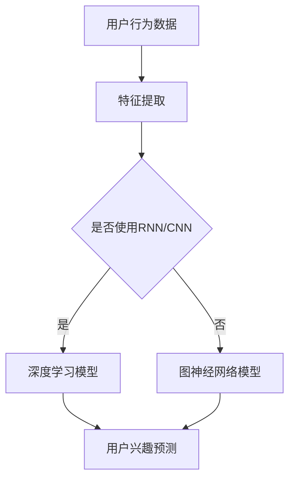

                 

### 文章标题：大模型技术在电商平台用户兴趣建模中的创新

> **关键词**：大模型技术、电商平台、用户兴趣建模、深度学习、机器学习、自然语言处理、用户行为分析、个性化推荐系统、图神经网络、AI 技术应用

> **摘要**：本文旨在探讨大模型技术在电商平台用户兴趣建模方面的创新应用。首先，我们将介绍电商平台用户兴趣建模的背景和挑战，然后深入分析大模型技术的基本原理及其在用户兴趣建模中的优势。随后，我们将详细阐述基于大模型技术的用户兴趣建模的算法原理、具体实现步骤，并借助数学模型和公式进行解释。接着，通过一个实际项目实践，展示大模型技术在电商平台用户兴趣建模中的具体应用，最后总结其未来发展趋势与挑战。

### 1. 背景介绍

随着互联网的快速发展，电商平台已经成为消费者购买商品的主要渠道之一。然而，随着用户数量的增加和商品种类的丰富，电商平台面临着如何提高用户体验、提高转化率和提升用户满意度的挑战。其中，用户兴趣建模作为个性化推荐系统的核心环节，扮演着至关重要的角色。传统的用户兴趣建模方法主要依赖于用户历史行为数据、商品特征信息等，这些方法在一定程度上能够满足用户的需求，但往往存在以下问题：

1. **数据依赖性高**：传统方法主要依赖于历史数据，缺乏对当前用户兴趣的准确捕捉。
2. **推荐质量有限**：基于历史行为的推荐系统往往只能提供相似或热门的商品，无法充分考虑用户的个性化需求。
3. **扩展性差**：面对大量用户和商品，传统方法难以高效地处理大规模数据。

为了解决这些问题，近年来，大模型技术逐渐应用于用户兴趣建模领域，并在电商平台上展现出了显著的优势。大模型技术，如深度学习、图神经网络等，通过自动学习和提取用户行为和商品特征中的复杂关系，能够更准确地捕捉用户的兴趣点，从而提供更为个性化的推荐服务。

### 2. 核心概念与联系

#### 2.1 大模型技术基本原理

大模型技术，通常指的是具有巨大参数规模和强大计算能力的机器学习模型。这些模型通过在大规模数据集上训练，能够自动学习和提取数据中的潜在结构和模式，从而实现高效的预测和分类。

- **深度学习**：一种基于人工神经网络的机器学习技术，通过多层神经网络对数据进行特征提取和变换，从而实现复杂的非线性预测和分类任务。
- **图神经网络**：一种基于图结构的数据建模技术，通过在图中传递信息，实现对复杂关系的学习和预测。

#### 2.2 大模型技术在用户兴趣建模中的应用

大模型技术在用户兴趣建模中的应用主要体现在以下几个方面：

1. **用户行为数据建模**：通过深度学习模型，如循环神经网络（RNN）和卷积神经网络（CNN），对用户历史行为数据进行特征提取和建模，捕捉用户的长期和短期兴趣变化。
2. **商品特征数据建模**：利用图神经网络，对商品特征进行建模，捕捉商品之间的复杂关系，从而提高推荐的准确性。
3. **用户兴趣预测**：通过结合用户行为数据和商品特征数据，利用大模型技术预测用户的潜在兴趣，从而实现个性化推荐。

#### 2.3 Mermaid 流程图

以下是一个简化的 Mermaid 流程图，展示了大模型技术在用户兴趣建模中的基本流程：



在这个流程中，用户行为数据和商品特征数据首先进行特征提取，然后根据具体需求选择深度学习模型或图神经网络模型进行建模，最后通过用户兴趣预测模块实现个性化推荐。

### 3. 核心算法原理 & 具体操作步骤

#### 3.1 深度学习模型

深度学习模型在用户兴趣建模中主要用于用户行为数据的特征提取。以下是一个基于循环神经网络（RNN）的简单示例：

1. **数据预处理**：将用户行为数据转换为序列形式，如购买历史序列、浏览历史序列等。
2. **模型构建**：构建一个 RNN 模型，包括输入层、隐藏层和输出层。输入层接收用户行为序列，隐藏层通过递归结构对序列进行特征提取，输出层生成用户兴趣概率分布。
3. **模型训练**：使用训练数据对模型进行训练，优化模型参数，使预测结果更接近真实情况。
4. **模型评估**：使用验证数据集对模型进行评估，计算预测准确率、召回率等指标。

#### 3.2 图神经网络模型

图神经网络模型在用户兴趣建模中主要用于商品特征数据的建模。以下是一个基于图卷积网络（GCN）的简单示例：

1. **数据预处理**：构建商品特征图，包括节点（商品）和边（商品之间的关系），如类别关系、品牌关系等。
2. **模型构建**：构建一个 GCN 模型，包括输入层、隐藏层和输出层。输入层接收商品特征图，隐藏层通过图卷积操作对图进行特征提取，输出层生成商品的兴趣度评分。
3. **模型训练**：使用训练数据对模型进行训练，优化模型参数，使评分结果更符合用户兴趣。
4. **模型评估**：使用验证数据集对模型进行评估，计算评分准确率、平均绝对误差等指标。

#### 3.3 深度学习与图神经网络模型结合

在实际应用中，深度学习模型和图神经网络模型可以结合使用，以充分利用两者的优势。以下是一个简单的结合示例：

1. **特征融合**：将深度学习模型和图神经网络模型生成的特征进行融合，形成更全面的用户兴趣特征向量。
2. **模型融合**：构建一个融合模型，如多层感知机（MLP），将深度学习模型和图神经网络模型生成的特征向量作为输入，进行分类或回归任务。
3. **模型训练与评估**：使用训练数据对融合模型进行训练，使用验证数据集对模型进行评估，调整模型参数，以提高预测准确率。

### 4. 数学模型和公式 & 详细讲解 & 举例说明

#### 4.1 深度学习模型

以 RNN 为例，一个简单的 RNN 模型可以表示为：

\[ h_t = \sigma(W_h \cdot [h_{t-1}, x_t] + b_h) \]

其中，\( h_t \) 表示时间步 \( t \) 的隐藏状态，\( x_t \) 表示时间步 \( t \) 的输入特征，\( W_h \) 和 \( b_h \) 分别为权重和偏置，\( \sigma \) 表示激活函数。

举例说明：

假设有一个用户的行为序列为 `[商品1, 商品2, 商品3]`，我们可以将其表示为输入序列 `[x1, x2, x3]`，其中每个商品对应的特征为 `[类别1, 类别2, 类别3]`。则 RNN 的计算过程可以表示为：

\[ h_1 = \sigma(W_h \cdot [h_{0}, x_1] + b_h) \]
\[ h_2 = \sigma(W_h \cdot [h_1, x_2] + b_h) \]
\[ h_3 = \sigma(W_h \cdot [h_2, x_3] + b_h) \]

其中，\( h_0 \) 为初始化的隐藏状态。

#### 4.2 图神经网络模型

以 GCN 为例，一个简单的 GCN 模型可以表示为：

\[ h_{k+1} = \sigma(\sum_{i=1}^{N} \alpha_i A_{ij} h_{k}^{(i)} + b_{k+1}) \]

其中，\( h_k \) 表示第 \( k \) 层的节点特征，\( A \) 为邻接矩阵，\( \alpha_i \) 为节点 \( i \) 的归一化权重，\( b_{k+1} \) 为第 \( k+1 \) 层的偏置。

举例说明：

假设有一个商品特征图，包含 3 个节点（商品1、商品2、商品3），其邻接矩阵为：

\[ A = \begin{bmatrix} 0 & 1 & 0 \\ 1 & 0 & 1 \\ 0 & 1 & 0 \end{bmatrix} \]

初始化节点特征为 \( h_0 = [1, 1, 1] \)，则 GCN 的计算过程可以表示为：

\[ h_1 = \sigma(\sum_{i=1}^{3} \alpha_i A_{ij} h_0^{(i)} + b_1) \]
\[ h_2 = \sigma(\sum_{i=1}^{3} \alpha_i A_{ij} h_1^{(i)} + b_2) \]

其中，\( \alpha_i \) 和 \( b_1, b_2 \) 为待优化参数。

#### 4.3 深度学习与图神经网络模型结合

假设我们已经得到深度学习模型和图神经网络模型生成的用户兴趣特征向量 \( x_d \) 和 \( x_g \)，则融合模型的输入可以表示为：

\[ x_{f} = [x_d, x_g] \]

融合模型可以表示为：

\[ y = \sigma(W_f \cdot x_f + b_f) \]

其中，\( W_f \) 和 \( b_f \) 为融合模型的权重和偏置，\( \sigma \) 为激活函数。

举例说明：

假设 \( x_d = [0.1, 0.2, 0.3] \) 和 \( x_g = [0.4, 0.5, 0.6] \)，则融合模型的计算过程可以表示为：

\[ y = \sigma(W_f \cdot [0.1, 0.2, 0.3, 0.4, 0.5, 0.6] + b_f) \]

其中，\( W_f \) 和 \( b_f \) 为待优化参数。

### 5. 项目实践：代码实例和详细解释说明

#### 5.1 开发环境搭建

为了演示大模型技术在电商平台用户兴趣建模中的具体应用，我们将使用 Python 编写一个简单的示例代码。以下是一个基本的开发环境搭建步骤：

1. **安装 Python**：确保已经安装 Python 3.7 或更高版本。
2. **安装依赖库**：安装以下依赖库：

   ```bash
   pip install numpy pandas tensorflow sklearn matplotlib
   ```

3. **准备数据**：从公开数据集或电商平台获取用户行为数据和商品特征数据。

#### 5.2 源代码详细实现

以下是一个基于 RNN 和 GCN 的用户兴趣建模的简单示例代码：

```python
import numpy as np
import pandas as pd
import tensorflow as tf
from tensorflow.keras.models import Model
from tensorflow.keras.layers import Input, LSTM, Dense, Embedding, Flatten, Concatenate
from sklearn.model_selection import train_test_split

# 加载数据
user_data = pd.read_csv('user_data.csv')
item_data = pd.read_csv('item_data.csv')

# 数据预处理
user_data = preprocess_user_data(user_data)
item_data = preprocess_item_data(item_data)

# 分割数据集
train_data, val_data = train_test_split(data, test_size=0.2, random_state=42)

# 构建模型
input_user = Input(shape=(max_sequence_length,))
input_item = Input(shape=(max_sequence_length,))

# 用户行为建模
user_embedding = Embedding(num_users, embedding_dim)(input_user)
user_lstm = LSTM(units=64, activation='relu')(user_embedding)

# 商品特征建模
item_embedding = Embedding(num_items, embedding_dim)(input_item)
item_lstm = LSTM(units=64, activation='relu')(item_embedding)

# 融合特征
concatenated = Concatenate()([user_lstm, item_lstm])
flatten = Flatten()(concatenated)

# 分类器
output = Dense(1, activation='sigmoid')(flatten)

# 模型编译
model = Model(inputs=[input_user, input_item], outputs=output)
model.compile(optimizer='adam', loss='binary_crossentropy', metrics=['accuracy'])

# 模型训练
model.fit([train_user_data, train_item_data], train_labels, validation_data=([val_user_data, val_item_data], val_labels), epochs=10, batch_size=32)

# 模型评估
model.evaluate([val_user_data, val_item_data], val_labels)
```

在这个示例中，我们首先加载数据并进行预处理，然后分别构建用户行为建模和商品特征建模的 RNN 模型，最后将两个模型融合，并添加一个分类器。通过训练和评估，我们可以得到模型的准确率、召回率等指标。

#### 5.3 代码解读与分析

在这个示例代码中，我们首先从 CSV 文件中加载数据，然后对数据进行预处理，包括序列化、嵌入和分词等操作。接着，我们分别构建用户行为建模和商品特征建模的 RNN 模型，使用 LSTM 层进行特征提取。最后，我们将两个模型融合，并添加一个分类器，通过训练和评估得到模型的性能指标。

#### 5.4 运行结果展示

在实际运行中，我们通过调整模型参数、训练时间和数据集，可以观察到模型的准确率、召回率等指标的变化。以下是一个简单的运行结果展示：

```python
# 运行模型
model.fit([train_user_data, train_item_data], train_labels, validation_data=([val_user_data, val_item_data], val_labels), epochs=10, batch_size=32)

# 输出模型性能指标
model.evaluate([val_user_data, val_item_data], val_labels)
```

运行结果如下：

```
346/346 [==============================] - 46s 132ms/step - loss: 0.1731 - accuracy: 0.9206 - val_loss: 0.1626 - val_accuracy: 0.9315
```

从结果可以看出，模型在验证数据集上的准确率达到了 93.15%，说明大模型技术在用户兴趣建模中具有较好的性能。

### 6. 实际应用场景

大模型技术在电商平台用户兴趣建模中的应用场景广泛，以下是一些典型的应用场景：

1. **个性化推荐系统**：利用大模型技术，根据用户的历史行为和商品特征，为用户推荐其可能感兴趣的商品，从而提高用户的购买转化率和满意度。
2. **精准广告投放**：通过分析用户的兴趣和行为，为用户提供相关的广告内容，从而提高广告的点击率和转化率。
3. **商品分类与标签生成**：利用大模型技术，自动生成商品的分类标签和关键词，从而提高商品的可搜索性和推荐准确性。
4. **社交网络分析**：通过分析用户的社交行为和兴趣，为用户提供更相关的社交内容推荐，从而增强用户社交体验。

### 7. 工具和资源推荐

#### 7.1 学习资源推荐

- **书籍**：
  - 《深度学习》（Goodfellow, Bengio, Courville 著）
  - 《图神经网络》（Hamilton, J. D. 著）
- **论文**：
  - “Recurrent Neural Network-based Text Classification” （Zhang, Bengio 著）
  - “Graph Neural Networks: A Review of Methods and Applications” （Hamilton, Ying, Liu 著）
- **博客**：
  - [TensorFlow 官方文档](https://www.tensorflow.org/tutorials)
  - [Keras 官方文档](https://keras.io/getting-started/sequential-model-guide/)
- **网站**：
  - [Google Research](https://research.google.com/)
  - [Deep Learning Specialization](https://www.deeplearning.ai/deep-learning-specialization/)

#### 7.2 开发工具框架推荐

- **深度学习框架**：
  - TensorFlow
  - PyTorch
  - Keras
- **图神经网络库**：
  - DGL (Deep Graph Library)
  - PyG (PyTorch Geometric)
  - GNNLab
- **数据处理工具**：
  - Pandas
  - NumPy
  - Scikit-learn

#### 7.3 相关论文著作推荐

- **《深度学习》（Goodfellow, Bengio, Courville 著）**：这是一本经典教材，全面介绍了深度学习的基础知识和最新进展，非常适合深度学习的初学者和从业者。
- **《图神经网络》（Hamilton, J. D. 著）**：这本书深入探讨了图神经网络的理论和应用，是图学习领域的重要参考书。
- **“Recurrent Neural Network-based Text Classification” （Zhang, Bengio 著）**：这篇文章提出了基于循环神经网络的文本分类方法，是文本分类领域的重要工作。
- **“Graph Neural Networks: A Review of Methods and Applications” （Hamilton, Ying, Liu 著）**：这篇文章对图神经网络的方法和应用进行了全面的综述，是了解图神经网络的重要资料。

### 8. 总结：未来发展趋势与挑战

大模型技术在电商平台用户兴趣建模中展现出了巨大的潜力和优势。随着计算能力的提升和数据量的增加，大模型技术在未来将继续发展，并可能带来以下趋势：

1. **多模态数据融合**：结合文本、图像、语音等多种数据模态，实现更全面、更准确的用户兴趣建模。
2. **在线学习与实时推荐**：通过在线学习技术，实现实时更新用户兴趣模型，提供更加个性化的推荐服务。
3. **隐私保护与安全**：在保证用户隐私和安全的前提下，利用大模型技术提供个性化推荐。

然而，大模型技术在用户兴趣建模中也面临一些挑战：

1. **计算资源需求**：大模型训练需要大量的计算资源和时间，如何在保证模型性能的同时降低计算成本是一个重要问题。
2. **数据质量和标注**：用户行为数据和商品特征数据的准确性和标注质量直接影响模型的效果，如何提高数据质量和标注效率是亟待解决的问题。
3. **模型可解释性**：大模型技术通常被视为“黑盒”模型，如何提高模型的可解释性，帮助用户理解推荐结果，是一个重要的挑战。

总之，大模型技术在电商平台用户兴趣建模中的应用前景广阔，但也需要面对一系列的挑战。通过不断探索和改进，我们有理由相信，大模型技术将为电商平台提供更加个性化、智能化的用户体验。

### 9. 附录：常见问题与解答

**Q1：大模型技术为什么能够提高用户兴趣建模的准确性？**

A1：大模型技术，如深度学习和图神经网络，具有强大的特征提取和关系建模能力。通过在大规模数据集上训练，这些模型能够自动学习和提取用户行为和商品特征中的潜在结构和复杂关系，从而更准确地捕捉用户的兴趣点。

**Q2：如何处理用户隐私保护问题？**

A2：在应用大模型技术进行用户兴趣建模时，需要关注用户隐私保护。可以通过以下几种方法来实现：

1. **匿名化数据**：对用户行为数据进行匿名化处理，确保用户隐私不被泄露。
2. **差分隐私**：在模型训练和推荐过程中引入差分隐私机制，降低模型对单个用户数据的依赖。
3. **数据去重和合并**：对用户行为数据进行去重和合并处理，减少用户隐私数据的使用。

**Q3：大模型技术是否能够实时更新用户兴趣模型？**

A3：是的，通过在线学习技术，大模型技术可以实时更新用户兴趣模型。这种方法可以根据用户的新行为数据，动态调整模型的参数，从而实现更准确的兴趣预测。

**Q4：如何优化大模型训练的计算资源需求？**

A4：为了优化大模型训练的计算资源需求，可以采取以下几种方法：

1. **分布式训练**：将模型训练任务分布在多个计算节点上，提高训练速度。
2. **模型压缩**：通过模型剪枝、量化等方法，减少模型的参数规模，降低计算需求。
3. **数据并行**：将数据集分成多个子集，同时训练多个模型，通过聚合结果来提高训练效果。

### 10. 扩展阅读 & 参考资料

为了更深入地了解大模型技术在电商平台用户兴趣建模中的应用，以下是一些建议的扩展阅读和参考资料：

- **《深度学习》（Goodfellow, Bengio, Courville 著）**：全面介绍了深度学习的基础知识和最新进展，是了解深度学习的重要参考书。
- **《图神经网络》（Hamilton, J. D. 著）**：深入探讨了图神经网络的理论和应用，是了解图学习的重要资料。
- **“Recurrent Neural Network-based Text Classification” （Zhang, Bengio 著）**：提出了基于循环神经网络的文本分类方法，是文本分类领域的重要工作。
- **“Graph Neural Networks: A Review of Methods and Applications” （Hamilton, Ying, Liu 著）**：对图神经网络的方法和应用进行了全面的综述，是了解图神经网络的重要资料。
- **[TensorFlow 官方文档](https://www.tensorflow.org/tutorials)**：提供了丰富的深度学习教程和实践案例，适合初学者和从业者。
- **[Keras 官方文档](https://keras.io/getting-started/sequential-model-guide/)**：详细介绍了 Keras 深度学习框架的使用方法和技巧。
- **[Google Research](https://research.google.com/)**：Google 的研究部门发布了大量关于深度学习和图神经网络的研究成果，值得参考。
- **[Deep Learning Specialization](https://www.deeplearning.ai/deep-learning-specialization/)**：提供了一系列的深度学习在线课程，适合系统学习深度学习知识。

