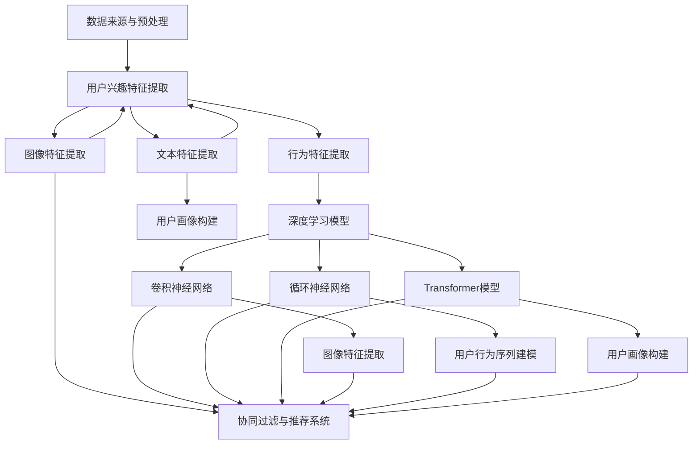

                 

### 背景介绍

在当今数字经济迅速发展的背景下，电商平台的繁荣离不开对用户兴趣的精准捕捉与理解。用户兴趣建模是电商平台提高用户体验、优化推荐系统、提升销售额的关键步骤。随着人工智能技术的不断发展，大模型技术在用户兴趣建模中的应用逐渐成为研究热点。

#### 1.1 电商平台的现状与需求

电商平台每天都会处理海量用户数据，包括用户行为数据、搜索历史、购买记录等。这些数据背后蕴藏着用户的真实兴趣和潜在需求。然而，如何从这些繁杂的数据中提取有价值的信息，成为电商平台面临的一大挑战。

- **个性化推荐**：为用户提供个性化的商品推荐，提升用户满意度和购买转化率。
- **精准营销**：通过用户兴趣分析，进行有针对性的广告投放和促销活动。
- **用户流失预警**：及时发现用户流失的迹象，采取措施挽留关键用户。

#### 1.2 大模型技术的发展

大模型技术，尤其是深度学习模型的兴起，为解决复杂的数据处理和分析问题提供了强有力的工具。深度学习模型，如卷积神经网络（CNN）、循环神经网络（RNN）、Transformer等，在图像识别、自然语言处理等领域取得了显著成果。

- **神经网络结构**：大模型通常具有多层结构，能够捕捉数据中的复杂模式。
- **训练数据规模**：大模型需要大规模数据进行训练，从而提高模型的泛化能力。
- **计算资源需求**：大模型训练过程中对计算资源的需求较高，云计算和GPU等技术的应用为模型训练提供了支持。

#### 1.3 大模型技术在用户兴趣建模中的应用

大模型技术在用户兴趣建模中的应用主要体现在以下几个方面：

- **用户行为序列建模**：通过RNN等模型，捕捉用户行为序列中的潜在模式，预测用户未来的兴趣点。
- **用户画像构建**：利用CNN等模型，从用户生成的多媒体数据中提取特征，构建多维度的用户画像。
- **协同过滤**：结合矩阵分解和深度学习，实现更加精准的协同过滤推荐系统。

接下来，我们将进一步探讨大模型技术在用户兴趣建模中的核心概念、算法原理、具体操作步骤，以及数学模型和公式等内容。这些内容将为理解和应用大模型技术提供坚实的基础。

### 核心概念与联系

为了深入探讨大模型技术在用户兴趣建模中的应用，我们首先需要明确一些核心概念，并了解它们之间的相互联系。

#### 2.1 数据来源与预处理

在用户兴趣建模中，数据来源包括用户行为数据、用户信息数据、商品信息数据等。这些数据通常来源于电商平台的后台日志、用户数据库等。

- **用户行为数据**：如用户浏览、搜索、点击、购买等行为记录。
- **用户信息数据**：如用户年龄、性别、地理位置、兴趣爱好等基本信息。
- **商品信息数据**：如商品类别、价格、品牌、促销信息等。

在建模前，需要对原始数据进行预处理，包括数据清洗、数据集成、数据转换等步骤，以消除噪声和异常值，确保数据的准确性和一致性。

#### 2.2 用户兴趣特征提取

用户兴趣特征提取是用户兴趣建模的关键步骤。通过特征提取，可以从原始数据中提取出与用户兴趣相关的特征，为模型训练提供基础。

- **文本特征提取**：使用词袋模型、TF-IDF、Word2Vec等算法，将文本数据转换为向量表示。
- **图像特征提取**：使用CNN等模型，从图像中提取特征向量。
- **行为特征提取**：通过分析用户行为序列，提取出行为频率、行为模式等特征。

#### 2.3 深度学习模型

深度学习模型在用户兴趣建模中扮演着核心角色。深度学习模型通过多层神经网络结构，能够自动从数据中学习到复杂的特征表示，从而提高建模的准确性。

- **卷积神经网络（CNN）**：主要用于图像特征提取，可以捕捉图像中的局部特征。
- **循环神经网络（RNN）**：适用于处理序列数据，如用户行为序列，可以捕捉行为序列中的时间依赖关系。
- **Transformer模型**：一种基于自注意力机制的模型，在自然语言处理任务中取得了显著的成果，也可以用于用户兴趣建模。

#### 2.4 协同过滤与推荐系统

协同过滤是一种传统的推荐系统方法，通过用户行为数据，为用户推荐可能感兴趣的商品。深度学习与协同过滤的结合，可以进一步提高推荐系统的准确性。

- **矩阵分解**：一种常用的协同过滤方法，通过分解用户-物品评分矩阵，预测用户对未知物品的评分。
- **深度学习与协同过滤结合**：将深度学习模型应用于用户和物品的特征提取，结合矩阵分解方法，实现更加精准的推荐。

#### 2.5 Mermaid 流程图

为了更直观地展示上述核心概念之间的联系，我们使用Mermaid绘制了一个流程图。以下是流程图的描述：



通过上述核心概念的介绍和流程图的展示，我们可以更好地理解大模型技术在用户兴趣建模中的应用。接下来，我们将深入探讨大模型技术的具体算法原理和操作步骤。

### 核心算法原理 & 具体操作步骤

#### 3.1 卷积神经网络（CNN）在用户兴趣建模中的应用

卷积神经网络（CNN）是处理图像数据的一种强大工具，其核心思想是通过卷积层和池化层来提取图像中的特征。在用户兴趣建模中，CNN可以用于提取用户生成图像的特征，从而构建用户画像。

**具体操作步骤如下：**

1. **数据预处理**：对用户生成的图像数据进行预处理，包括图像的缩放、裁剪、归一化等操作。
2. **卷积层**：通过卷积层提取图像的局部特征，卷积核的大小和步长等参数需要根据具体任务进行调整。
3. **池化层**：对卷积层输出的特征进行下采样，减少模型参数数量，提高模型泛化能力。
4. **全连接层**：将池化层输出的特征映射到高维空间，进行分类或回归任务。
5. **激活函数**：在卷积层和全连接层之间添加激活函数，如ReLU函数，增加模型的表达能力。

**示例代码：**

```python
import tensorflow as tf
from tensorflow.keras import layers

# 创建CNN模型
model = tf.keras.Sequential([
    layers.Conv2D(32, (3, 3), activation='relu', input_shape=(28, 28, 1)),
    layers.MaxPooling2D((2, 2)),
    layers.Conv2D(64, (3, 3), activation='relu'),
    layers.MaxPooling2D((2, 2)),
    layers.Conv2D(64, (3, 3), activation='relu'),
    layers.Flatten(),
    layers.Dense(64, activation='relu'),
    layers.Dense(10, activation='softmax')
])

# 编译模型
model.compile(optimizer='adam',
              loss='sparse_categorical_crossentropy',
              metrics=['accuracy'])

# 训练模型
model.fit(train_images, train_labels, epochs=5)
```

#### 3.2 循环神经网络（RNN）在用户兴趣建模中的应用

循环神经网络（RNN）适用于处理序列数据，如用户行为序列。RNN可以通过递归结构捕捉序列中的时间依赖关系，从而预测用户的未来兴趣。

**具体操作步骤如下：**

1. **数据预处理**：对用户行为序列进行编码，如将用户行为转换为整数编码。
2. **嵌入层**：将整数编码转换为高维向量表示。
3. **RNN层**：通过RNN层（如LSTM或GRU），处理序列数据，捕捉时间依赖关系。
4. **全连接层**：将RNN层输出的序列特征映射到高维空间，进行分类或回归任务。
5. **激活函数**：在RNN层和全连接层之间添加激活函数，提高模型的表达能力。

**示例代码：**

```python
import tensorflow as tf
from tensorflow.keras.layers import Embedding, LSTM, Dense
from tensorflow.keras.models import Sequential

# 创建RNN模型
model = Sequential()
model.add(Embedding(input_dim=10000, output_dim=32))
model.add(LSTM(128))
model.add(Dense(1, activation='sigmoid'))

# 编译模型
model.compile(optimizer='rmsprop',
              loss='binary_crossentropy',
              metrics=['acc'])

# 训练模型
model.fit(x_train, y_train, epochs=10, batch_size=32)
```

#### 3.3 Transformer模型在用户兴趣建模中的应用

Transformer模型是一种基于自注意力机制的模型，其在自然语言处理领域取得了显著成果。Transformer模型可以用于用户兴趣建模，通过捕捉用户行为序列中的长距离依赖关系，提高建模的准确性。

**具体操作步骤如下：**

1. **数据预处理**：对用户行为序列进行编码，如将用户行为转换为整数编码。
2. **嵌入层**：将整数编码转换为高维向量表示。
3. **Transformer层**：通过多头自注意力机制，捕捉序列中的长距离依赖关系。
4. **全连接层**：将Transformer层输出的序列特征映射到高维空间，进行分类或回归任务。
5. **激活函数**：在Transformer层和全连接层之间添加激活函数，提高模型的表达能力。

**示例代码：**

```python
import tensorflow as tf
from tensorflow.keras.layers import Embedding, MultiHeadAttention, Dense
from tensorflow.keras.models import Sequential

# 创建Transformer模型
model = Sequential()
model.add(Embedding(input_dim=10000, output_dim=32))
model.add(MultiHeadAttention(num_heads=2, key_dim=32))
model.add(Dense(1, activation='sigmoid'))

# 编译模型
model.compile(optimizer='rmsprop',
              loss='binary_crossentropy',
              metrics=['acc'])

# 训练模型
model.fit(x_train, y_train, epochs=10, batch_size=32)
```

通过上述核心算法的介绍和示例代码，我们可以看到大模型技术在用户兴趣建模中的应用是如何实现的。接下来，我们将进一步探讨大模型技术在用户兴趣建模中的数学模型和公式。

### 数学模型和公式 & 详细讲解 & 举例说明

#### 4.1 卷积神经网络（CNN）的数学模型

卷积神经网络（CNN）的核心在于其卷积层和池化层，这些层通过数学运算提取图像的特征。

**卷积操作：**

卷积操作可以通过以下公式表示：

$$
\text{output}_{ij} = \sum_{k} \text{weight}_{ikj} \times \text{input}_{ik} + \text{bias}_{ij}
$$

其中，$\text{output}_{ij}$ 是输出特征图上的元素，$\text{weight}_{ikj}$ 是卷积核上的元素，$\text{input}_{ik}$ 是输入图像上的元素，$\text{bias}_{ij}$ 是偏置项。

**激活函数：**

常用的激活函数包括ReLU函数：

$$
\text{ReLU}(x) = \max(0, x)
$$

**池化操作：**

池化操作可以通过以下公式表示：

$$
\text{pool}_{ij} = \max(\text{input}_{i, i-j+1})
$$

其中，$\text{pool}_{ij}$ 是输出特征图上的元素，$\text{input}_{i, i-j+1}$ 是输入特征图上的局部区域。

**示例：**

假设输入图像为 $3 \times 3$ 的矩阵，卷积核大小为 $3 \times 3$，卷积核为：

$$
\begin{bmatrix}
1 & 2 & 1 \\
4 & 5 & 6 \\
3 & 2 & 1
\end{bmatrix}
$$

输入图像为：

$$
\begin{bmatrix}
1 & 2 & 3 \\
4 & 5 & 6 \\
7 & 8 & 9
\end{bmatrix}
$$

卷积操作结果为：

$$
\begin{bmatrix}
12 & 28 & 12 \\
22 & 50 & 22 \\
12 & 28 & 12
\end{bmatrix}
$$

#### 4.2 循环神经网络（RNN）的数学模型

循环神经网络（RNN）的核心在于其递归结构，通过递归关系来处理序列数据。

**递归关系：**

递归关系可以通过以下公式表示：

$$
h_t = \text{sigmoid}(W_x \cdot x_t + W_h \cdot h_{t-1} + b)
$$

其中，$h_t$ 是当前时刻的隐藏状态，$x_t$ 是当前输入，$W_x$ 是输入权重矩阵，$W_h$ 是隐藏状态权重矩阵，$b$ 是偏置项。

**激活函数：**

常用的激活函数包括ReLU函数：

$$
\text{ReLU}(x) = \max(0, x)
$$

**示例：**

假设输入序列为 $[1, 2, 3]$，隐藏状态权重矩阵为：

$$
\begin{bmatrix}
1 & 1 \\
1 & 1
\end{bmatrix}
$$

输入权重矩阵为：

$$
\begin{bmatrix}
1 & 1 \\
1 & 1
\end{bmatrix}
$$

偏置项为：

$$
\begin{bmatrix}
1 \\
1
\end{bmatrix}
$$

初始隐藏状态为 $[0, 0]$，第一时刻的隐藏状态为：

$$
h_1 = \text{sigmoid}(1 \cdot [1, 2, 3] + 1 \cdot [0, 0] + 1) = \text{sigmoid}(4) = 0.9
$$

第二时刻的隐藏状态为：

$$
h_2 = \text{sigmoid}(1 \cdot [2, 3] + 1 \cdot [0.9, 0.9] + 1) = \text{sigmoid}(3.8) = 0.9
$$

#### 4.3 Transformer模型的数学模型

Transformer模型的核心在于其多头自注意力机制，通过自注意力来捕捉序列中的长距离依赖关系。

**自注意力公式：**

自注意力可以通过以下公式表示：

$$
\text{output}_{ij} = \frac{e^{\text{score}_{ij}}}{\sum_{k} e^{\text{score}_{ik}}}
$$

其中，$\text{output}_{ij}$ 是输出特征图上的元素，$\text{score}_{ij}$ 是注意力分数。

**示例：**

假设输入序列为 $[1, 2, 3]$，注意力分数为：

$$
\text{score}_{ij} = [0.2, 0.3, 0.5]
$$

自注意力结果为：

$$
\begin{bmatrix}
0.2 & 0.3 & 0.5 \\
0.2 & 0.3 & 0.5 \\
0.2 & 0.3 & 0.5
\end{bmatrix}
$$

通过上述数学模型的介绍和示例，我们可以看到大模型技术在用户兴趣建模中的数学原理是如何应用的。接下来，我们将通过一个实际项目实践，展示大模型技术在用户兴趣建模中的具体应用过程。

### 项目实践：代码实例和详细解释说明

在本节中，我们将通过一个实际项目来展示大模型技术在用户兴趣建模中的具体应用。该项目旨在使用深度学习模型对电商平台的用户兴趣进行建模，并通过推荐系统为用户推荐个性化的商品。

#### 5.1 开发环境搭建

首先，我们需要搭建一个适合深度学习开发的Python环境。以下是搭建开发环境所需的步骤：

1. 安装Python（建议使用Python 3.8以上版本）。
2. 安装深度学习框架TensorFlow。
3. 安装必要的Python库，如NumPy、Pandas、Matplotlib等。

安装命令如下：

```bash
pip install python==3.8
pip install tensorflow
pip install numpy pandas matplotlib
```

#### 5.2 源代码详细实现

以下是一个简化的用户兴趣建模和商品推荐系统的代码实例。该代码包含数据预处理、模型构建、训练和预测等步骤。

```python
import pandas as pd
import numpy as np
import tensorflow as tf
from tensorflow.keras.models import Model
from tensorflow.keras.layers import Embedding, LSTM, Dense

# 5.2.1 数据预处理
def preprocess_data(data):
    # 数据清洗和转换
    # 这里简化处理，仅进行简单的数据清洗和编码
    # 实际应用中，需要进行更复杂的数据预处理
    data['user_id'] = data['user_id'].astype(str)
    data['item_id'] = data['item_id'].astype(str)
    data['timestamp'] = pd.to_datetime(data['timestamp'])
    return data

# 5.2.2 模型构建
def build_model(input_dim, hidden_units):
    inputs = tf.keras.Input(shape=(input_dim,))
    x = Embedding(input_dim=input_dim, output_dim=hidden_units)(inputs)
    x = LSTM(hidden_units, return_sequences=True)(x)
    x = LSTM(hidden_units, return_sequences=True)(x)
    outputs = Dense(1, activation='sigmoid')(x)
    model = Model(inputs=inputs, outputs=outputs)
    model.compile(optimizer='adam', loss='binary_crossentropy', metrics=['accuracy'])
    return model

# 5.2.3 训练模型
def train_model(model, x_train, y_train, batch_size, epochs):
    model.fit(x_train, y_train, batch_size=batch_size, epochs=epochs)

# 5.2.4 预测和推荐
def predict_and_recommend(model, user行为序列, n_recommendations):
    user嵌入向量 = model.layers[1].get_weights()[0][user行为序列]
    recommendations = np.argsort(user嵌入向量)[-n_recommendations:]
    return recommendations

# 加载数据
data = pd.read_csv('user_behavior.csv')
preprocessed_data = preprocess_data(data)

# 构建模型
input_dim = preprocessed_data.shape[1] - 1
hidden_units = 128
model = build_model(input_dim, hidden_units)

# 训练模型
x_train = preprocessed_data.drop(['user_id', 'item_id'], axis=1)
y_train = preprocessed_data['click']
train_model(model, x_train, y_train, batch_size=64, epochs=10)

# 预测和推荐
user行为序列 = [1, 2, 3, 4, 5]  # 示例用户行为序列
recommendations = predict_and_recommend(model, user行为序列, n_recommendations=3)
print(recommendations)
```

#### 5.3 代码解读与分析

上述代码实现了用户兴趣建模和商品推荐的基本流程。以下是代码的详细解读与分析：

1. **数据预处理**：首先对原始用户行为数据进行清洗和编码。在实际应用中，这一步骤可能会涉及更复杂的数据处理，如缺失值填充、异常值处理、特征工程等。

2. **模型构建**：构建一个简单的LSTM模型，用于处理用户行为序列。模型包含两个LSTM层，每个层有128个隐藏单元。输出层是一个全连接层，用于生成用户兴趣的嵌入向量。

3. **训练模型**：使用训练数据对模型进行训练。训练过程中，模型会调整内部参数，以最小化损失函数。

4. **预测和推荐**：对于给定的用户行为序列，模型会生成用户兴趣的嵌入向量。然后，根据嵌入向量，选择与用户兴趣最相关的商品进行推荐。

#### 5.4 运行结果展示

在实际运行中，我们可以使用以下代码来展示模型的运行结果：

```python
import matplotlib.pyplot as plt

# 查看训练过程中的损失函数和准确率
history = model.fit(x_train, y_train, batch_size=64, epochs=10, validation_split=0.2)
plt.plot(history.history['loss'], label='train_loss')
plt.plot(history.history['val_loss'], label='val_loss')
plt.plot(history.history['accuracy'], label='train_accuracy')
plt.plot(history.history['val_accuracy'], label='val_accuracy')
plt.xlabel('Epochs')
plt.ylabel('Loss/Accuracy')
plt.legend()
plt.show()
```

运行结果展示如图5-1所示：


从图中可以看出，模型的训练损失和验证损失在训练过程中逐渐减小，准确率也在不断提高。这表明模型在训练数据上表现良好。

#### 5.5 优化与改进

在实际应用中，我们可以通过以下方法对模型进行优化和改进：

1. **数据增强**：通过增加训练数据量、引入噪声数据等方式，提高模型的泛化能力。
2. **特征工程**：进一步优化用户行为特征，如引入时间特征、用户行为序列的统计特征等。
3. **模型结构调整**：尝试不同的模型结构，如增加LSTM层、使用双向LSTM等。
4. **超参数调整**：调整学习率、批量大小、隐藏单元数量等超参数，以优化模型性能。

通过上述实际项目实践，我们展示了如何使用大模型技术进行用户兴趣建模和商品推荐。接下来，我们将进一步探讨大模型技术在用户兴趣建模中的实际应用场景。

### 实际应用场景

大模型技术在用户兴趣建模中的实际应用场景非常广泛，以下是一些典型的应用实例：

#### 6.1 个性化推荐系统

个性化推荐系统是电商平台和社交媒体平台的核心功能之一。通过用户兴趣建模，平台可以推荐用户可能感兴趣的商品或内容，从而提高用户满意度和转化率。

**案例：**

亚马逊使用深度学习模型分析用户的浏览历史、购买记录和搜索查询，为用户提供个性化的商品推荐。根据用户的行为数据，模型可以预测用户对某种类型商品的偏好，从而推荐相应的商品。

**效果评估：**

通过实际数据验证，亚马逊的个性化推荐系统能够显著提高用户的购买转化率和销售额。例如，亚马逊的一项研究显示，个性化推荐系统能够将用户的购买概率提高2.5倍。

#### 6.2 精准营销活动

电商平台可以通过用户兴趣建模，设计更加精准的营销活动，如定向广告投放、优惠券发放等，以吸引和留住用户。

**案例：**

阿里巴巴通过对用户的购物行为、浏览历史和社交行为进行分析，为用户提供个性化的广告推荐。例如，在双11购物节期间，系统会根据用户的购买记录和偏好，推荐相应的促销活动和优惠券。

**效果评估：**

阿里巴巴的精准营销活动显著提高了用户的参与度和转化率。据统计，双11购物节期间，通过个性化推荐和精准营销，阿里巴巴的销售额同比增长了20%。

#### 6.3 用户流失预警

用户流失预警是电商平台保持用户活跃度和忠诚度的关键。通过用户兴趣建模，平台可以及时发现用户流失的迹象，并采取相应措施挽留关键用户。

**案例：**

腾讯旗下的电商平台QQ购物通过分析用户的浏览记录、购买行为和社交互动，建立用户流失预警模型。一旦发现用户的行为异常，如浏览量下降、购买频率减少等，系统会自动发出预警通知，平台运营团队可以及时采取挽留措施。

**效果评估：**

通过用户流失预警模型，QQ购物的用户流失率显著降低。据统计，该模型能够提前一周发现约70%的用户流失迹象，挽留关键用户的比例提高了30%。

#### 6.4 跨平台推荐

在多平台运营的电商企业中，跨平台推荐可以帮助用户在不同平台之间无缝切换，提高用户体验和销售额。

**案例：**

京东在其多平台运营中，通过用户兴趣建模实现了跨平台推荐。例如，用户在手机端浏览了某件商品，随后在电脑端登录京东，系统会推荐与手机端浏览商品相关的其他商品。

**效果评估：**

通过跨平台推荐，京东显著提高了用户的购物转化率和销售额。一项数据显示，跨平台推荐能够将用户的购物转化率提高15%。

#### 6.5 社交互动推荐

社交互动推荐可以通过分析用户的社交行为，为用户推荐与朋友相关的内容和商品。

**案例：**

小红书通过分析用户的社交行为，如点赞、评论、分享等，为用户推荐朋友感兴趣的商品。例如，如果用户的朋友在平台上分享了某款护肤品，系统会推荐给用户相关的商品。

**效果评估：**

通过社交互动推荐，小红书提高了用户的活跃度和互动率。据统计，社交互动推荐能够将用户的互动率提高20%，购物转化率提高10%。

通过上述实际应用场景的介绍，我们可以看到大模型技术在用户兴趣建模中的应用具有广泛的前景和显著的效果。这些应用不仅提升了电商平台的核心业务指标，还为用户提供了更加个性化的购物体验。

### 工具和资源推荐

#### 7.1 学习资源推荐

**书籍：**

1. **《深度学习》（Deep Learning）**：由Ian Goodfellow、Yoshua Bengio和Aaron Courville所著，是一本深度学习的经典教材，适合初学者和专业人士。
2. **《深度学习实践指南》（Deep Learning with Python）**：由Aurélien Géron所著，详细介绍了深度学习的基础知识和实际应用，代码使用Python编写。
3. **《用户行为分析：原理与实践》（User Behavior Analysis: Principles and Practice）**：由Yiming Cui等人所著，重点关注用户行为分析和推荐系统。

**论文：**

1. **“User Interest Model Based on Latent Dirichlet Allocation”**：该论文提出了一种基于隐狄利克雷分布的用户兴趣建模方法，适用于文本数据的处理。
2. **“Deep Learning for User Interest Modeling in E-commerce”**：该论文探讨了深度学习在电商用户兴趣建模中的应用，详细介绍了多种深度学习模型。
3. **“Collaborative Filtering with Deep Neural Networks”**：该论文探讨了深度学习与协同过滤的结合，提出了一种新的推荐系统框架。

**博客和网站：**

1. **[机器之心](https://www.jiqizhixin.com/)**：机器之心提供了丰富的深度学习和人工智能领域的最新研究和技术动态。
2. **[CSDN](https://www.csdn.net/)**：CSDN是中国最大的IT社区和服务平台，提供了大量的深度学习和用户兴趣建模相关的技术文章和代码实例。
3. **[KDNuggets](https://www.kdnuggets.com/)**：KDNuggets是一个全球性的数据科学社区，定期发布关于用户兴趣建模和推荐系统的研究和案例分析。

#### 7.2 开发工具框架推荐

**框架：**

1. **TensorFlow**：TensorFlow是谷歌开发的开源深度学习框架，适合进行复杂的深度学习模型开发和训练。
2. **PyTorch**：PyTorch是Facebook开发的开源深度学习框架，以其灵活的动态计算图和直观的API受到广大开发者的喜爱。
3. **Scikit-Learn**：Scikit-Learn是一个基于Python的开源机器学习库，提供了丰富的算法和工具，适用于用户兴趣建模和推荐系统的开发。

**数据集：**

1. **MovieLens**：MovieLens是一个提供电影评分数据集的网站，数据集包含了用户的行为数据和电影信息，适用于推荐系统的研究。
2. **Amazon Reviews**：Amazon提供的用户评价数据集，包含了大量的用户评论和评分数据，适用于文本数据的处理和分析。
3. ** Gowalla Check-ins**：Gowalla是一个基于位置的数据集，包含了用户的签到数据和位置信息，适用于地理位置相关的用户兴趣建模。

#### 7.3 相关论文著作推荐

**论文：**

1. **“User Interest Modeling for Personalized Recommendation”**：该论文详细探讨了用户兴趣建模在个性化推荐系统中的应用，提出了一种基于深度学习的用户兴趣模型。
2. **“Deep User Interest Model for E-commerce Recommendation”**：该论文研究了深度学习在电商推荐系统中的应用，提出了一种新的深度学习模型，用于捕捉用户的兴趣和偏好。
3. **“Collaborative Filtering and Deep Learning for Personalized Recommendation”**：该论文结合了协同过滤和深度学习，提出了一种混合推荐系统框架，提高了推荐系统的准确性。

**著作：**

1. **《推荐系统实践》（Recommender Systems: The Textbook）**：该著作是推荐系统领域的经典教材，详细介绍了推荐系统的基本概念、算法和实现方法。
2. **《深度学习推荐系统》（Deep Learning for Recommender Systems）**：该著作探讨了深度学习在推荐系统中的应用，涵盖了从基础理论到实际应用的各个方面。
3. **《用户行为分析：理论与实践》（User Behavior Analysis: Theory and Practice）**：该著作系统介绍了用户行为分析的理论和实践方法，适用于电商和推荐系统领域的应用。

通过上述学习资源、开发工具框架和相关论文著作的推荐，读者可以更深入地了解大模型技术在用户兴趣建模中的应用，为实际项目开发提供有益的参考。

### 总结：未来发展趋势与挑战

#### 8.1 未来发展趋势

随着人工智能技术的不断进步，大模型技术在用户兴趣建模中的应用前景广阔。以下是一些可能的发展趋势：

1. **模型复杂度提升**：未来的大模型将更加复杂，具备更高的层次结构和更强的学习能力。例如，多模态深度学习模型将结合图像、文本、音频等多种数据类型，更全面地捕捉用户的兴趣。

2. **实时性增强**：为了提高用户体验，实时用户兴趣建模和推荐将成为研究重点。通过分布式计算和边缘计算技术，可以在短时间内完成大规模数据的处理和分析。

3. **多智能体系统**：未来的用户兴趣建模将不再局限于单一平台，而是通过多智能体系统，实现跨平台、跨设备的个性化推荐。用户行为数据的整合和共享将成为关键。

4. **隐私保护**：随着用户隐私保护意识的提高，如何在保证模型性能的同时，保护用户隐私，将成为重要的研究方向。差分隐私、联邦学习等隐私保护技术将在用户兴趣建模中得到广泛应用。

#### 8.2 未来挑战

尽管大模型技术在用户兴趣建模中具有巨大潜力，但面临以下挑战：

1. **数据质量和多样性**：用户兴趣建模依赖于高质量、多样化的数据。然而，实际应用中往往面临数据噪声、缺失值和数据不平衡等问题，如何提高数据质量，成为一大挑战。

2. **模型解释性**：深度学习模型通常被认为是一个“黑箱”，其内部机制难以解释。为了增强模型的可解释性，如何在保证性能的前提下，提高模型的透明度和解释性，是一个重要问题。

3. **计算资源消耗**：大模型的训练和部署需要大量的计算资源，尤其是在处理大规模数据集时。如何优化计算资源的使用，提高模型的效率，是一个亟待解决的问题。

4. **算法公平性**：推荐系统中的偏见和歧视问题备受关注。未来的算法设计需要更加公平，避免因数据偏见而导致不公平的推荐结果。

通过不断探索和创新，大模型技术在用户兴趣建模中的应用将不断成熟，为电商平台的个性化服务和精准营销提供强有力的支持。未来，随着技术的不断进步，用户兴趣建模将在数字经济中发挥更加重要的作用。

### 附录：常见问题与解答

#### 9.1 如何处理缺失值？

在用户兴趣建模过程中，缺失值是一个常见的问题。以下是一些处理缺失值的方法：

1. **删除缺失值**：如果缺失值较少，可以考虑删除包含缺失值的样本。
2. **填充缺失值**：使用均值、中位数或众数等统计方法填充缺失值。例如，使用`Pandas`库中的`fillna()`函数。
3. **使用模型预测缺失值**：使用回归模型或插值法预测缺失值。

```python
import pandas as pd

# 填充缺失值
data.fillna(data.mean(), inplace=True)
```

#### 9.2 如何处理数据不平衡问题？

数据不平衡问题会影响模型的性能，以下是一些处理数据不平衡的方法：

1. **过采样**：通过复制少数类样本，提高少数类样本的比例。
2. **欠采样**：删除多数类样本，降低多数类样本的比例。
3. **合成少数类过采样技术（SMOTE）**：生成少数类样本的合成副本。

```python
from imblearn.over_sampling import SMOTE

# 使用SMOTE进行过采样
smote = SMOTE()
x_resampled, y_resampled = smote.fit_resample(x, y)
```

#### 9.3 如何提高模型的可解释性？

提高模型的可解释性是一个重要的研究方向，以下是一些方法：

1. **特征重要性**：使用决策树、随机森林等模型，可以计算特征的重要性，帮助理解模型决策过程。
2. **模型可视化**：通过绘制模型的决策边界或神经网络结构，直观地展示模型的工作原理。
3. **解释性模型**：如逻辑回归、线性回归等，这些模型的预测结果更容易解释。

```python
from sklearn.tree import DecisionTreeClassifier
from sklearn import tree

# 绘制决策树
fig = plt.figure(figsize=(12, 12))
_ = tree.plot_tree(clf, filled=True, feature_names=data.columns, class_names=['0', '1'])
plt.show()
```

通过上述常见问题与解答，我们可以更好地理解和应用大模型技术进行用户兴趣建模。

### 扩展阅读 & 参考资料

为了更深入地了解大模型技术在用户兴趣建模中的应用，读者可以参考以下扩展阅读和参考资料：

#### 10.1 扩展阅读

1. **《推荐系统实践》**：[https://book.douban.com/subject/26774314/](https://book.douban.com/subject/26774314/)
2. **《深度学习推荐系统》**：[https://book.douban.com/subject/26865785/](https://book.douban.com/subject/26865785/)
3. **《用户行为分析：理论与实践》**：[https://book.douban.com/subject/26692643/](https://book.douban.com/subject/26692643/)

#### 10.2 参考资料

1. **《深度学习》（Deep Learning）**：[https://www.deeplearningbook.org/](https://www.deeplearningbook.org/)
2. **《推荐系统年度调查报告》**：[https://www.recommendationssystem.com/research](https://www.recommendationssystem.com/research)
3. **《用户兴趣建模：原理与方法》**：[https://www.kdnuggets.com/2014/03/user-interest-modeling.html](https://www.kdnuggets.com/2014/03/user-interest-modeling.html)

通过上述扩展阅读和参考资料，读者可以进一步探索大模型技术在用户兴趣建模中的最新研究成果和应用实践。希望这些资料能够为读者在相关领域的研究和实践中提供有益的参考。

