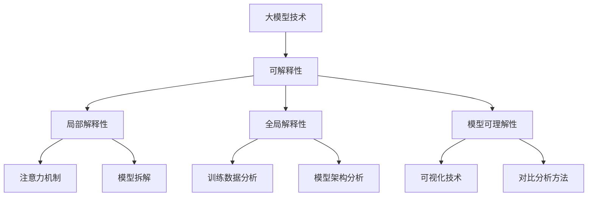

                 

### 1. 背景介绍

近年来，随着深度学习技术的迅猛发展，大规模预训练语言模型（Large-scale Pre-trained Language Models，简称LPLMs）在自然语言处理（Natural Language Processing，简称NLP）领域取得了令人瞩目的成果。GPT-3、BERT、T5等一系列LPLMs的推出，使得机器在理解、生成和处理自然语言方面取得了前所未有的突破。然而，随着模型规模的不断扩大，这些大型模型也逐渐暴露出了一系列问题，其中最为显著的就是可解释性（Interpretability）的挑战。

#### 1.1 大模型技术的崛起

LPLMs之所以能够取得如此显著的成果，主要得益于其采用了大规模数据预训练和精细调整的微调（Fine-tuning）方法。具体而言，这些模型在训练过程中通过处理海量文本数据，学习到了丰富的语言结构和语义信息，从而在自然语言理解、文本生成、问答系统等任务中表现出了强大的性能。例如，GPT-3拥有1750亿个参数，能够在各种语言任务中实现接近甚至超越人类水平的表现。

#### 1.2 可解释性的重要性

尽管LPLMs在自然语言处理领域取得了巨大成功，但其“黑箱”特性也引发了诸多争议。可解释性（Interpretability）是指模型在决策过程中能够提供清晰、透明且易于理解的信息，以便用户能够理解模型的决策逻辑。可解释性对于提高模型可信度和用户接受度至关重要。以下原因进一步强调了可解释性的重要性：

1. **信任与透明度**：对于许多应用场景，如医疗诊断、金融风险评估等，用户需要了解模型的决策过程，以确保模型的透明度和可靠性。

2. **模型优化与调试**：可解释性有助于开发人员理解模型的弱点，从而对其进行优化和调试，提高模型的性能。

3. **合规与伦理**：在涉及隐私和敏感数据的场景中，可解释性有助于满足法律法规和伦理要求，确保模型的合规性。

4. **用户理解与接受**：可解释性有助于用户更好地理解模型的工作原理，从而提高模型的用户接受度和应用范围。

#### 1.3 大模型技术面临的可解释性挑战

尽管可解释性在人工智能领域受到广泛关注，但大规模预训练模型的可解释性仍然面临着诸多挑战。以下是其中几个主要的挑战：

1. **模型复杂度**：随着模型规模的不断扩大，其内部结构和参数数量呈现指数级增长，这使得理解模型的决策过程变得异常复杂。

2. **梯度消失与梯度爆炸**：深度神经网络中梯度消失和梯度爆炸现象可能导致模型难以训练，从而影响其可解释性。

3. **隐藏层表示**：大规模预训练模型中的隐藏层表示高度非线性和抽象，难以直接理解和解释。

4. **数据依赖性**：LPLMs的训练数据往往来自于互联网上的大量文本，其中可能包含偏见和噪声，这会影响模型的解释能力。

5. **模型泛化能力**：大规模预训练模型在训练过程中可能过度依赖于特定数据集，导致其在面对新任务和新数据时表现出较低的泛化能力，这进一步降低了可解释性。

本文将深入探讨大模型技术在可解释性方面面临的挑战，并提出可能的解决方案，以期为该领域的研究和应用提供有益的参考。

### 2. 核心概念与联系

#### 2.1 大模型技术概述

大模型技术是指通过大规模数据预训练和精细调整微调（Fine-tuning）方法，构建具有数亿至数千亿参数的深度神经网络模型。这些模型在训练过程中从海量文本数据中学习到丰富的语言结构和语义信息，从而在自然语言理解、文本生成、问答系统等任务中表现出强大的性能。大模型技术的核心优势在于其能够处理复杂的语言现象，捕捉细微的语义差异，实现高度准确的文本处理。

#### 2.2 可解释性的概念

可解释性是指模型在决策过程中能够提供清晰、透明且易于理解的信息，使用户能够理解模型的决策逻辑。可解释性对于提高模型可信度和用户接受度至关重要。在人工智能领域，可解释性主要包括以下几个方面：

1. **局部解释性**：针对模型在特定输入下的决策过程进行解释，通常用于分析模型在单个数据点上的表现。

2. **全局解释性**：对模型在整体上的决策过程进行解释，通常涉及分析模型的训练过程、参数分布和整体性能。

3. **模型可理解性**：对模型的设计和结构进行解释，使用户能够理解模型的基本原理和工作机制。

#### 2.3 大模型技术中可解释性的重要性

大模型技术在可解释性方面的重要性体现在以下几个方面：

1. **信任与透明度**：在涉及敏感数据和关键决策的场景中，用户需要了解模型的决策过程，以确保模型的透明度和可靠性。

2. **模型优化与调试**：可解释性有助于开发人员理解模型的弱点，从而对其进行优化和调试，提高模型的性能。

3. **合规与伦理**：在涉及隐私和敏感数据的场景中，可解释性有助于满足法律法规和伦理要求，确保模型的合规性。

4. **用户理解与接受**：可解释性有助于用户更好地理解模型的工作原理，从而提高模型的用户接受度和应用范围。

#### 2.4 大模型技术中可解释性的挑战

大模型技术在可解释性方面面临以下主要挑战：

1. **模型复杂度**：随着模型规模的不断扩大，其内部结构和参数数量呈现指数级增长，这使得理解模型的决策过程变得异常复杂。

2. **隐藏层表示**：大规模预训练模型中的隐藏层表示高度非线性和抽象，难以直接理解和解释。

3. **数据依赖性**：LPLMs的训练数据往往来自于互联网上的大量文本，其中可能包含偏见和噪声，这会影响模型的解释能力。

4. **模型泛化能力**：大规模预训练模型在训练过程中可能过度依赖于特定数据集，导致其在面对新任务和新数据时表现出较低的泛化能力，这进一步降低了可解释性。

为了解决这些问题，研究人员提出了多种可解释性方法，如注意力机制、模型拆解、可视化技术等。下面将详细介绍这些方法及其原理。

#### 2.5 可解释性方法的概述

可解释性方法可以分为以下几类：

1. **基于模型内部信息的解释方法**：通过分析模型内部权重、梯度、注意力等机制，解释模型在特定输入下的决策过程。

2. **基于模型外部信息的解释方法**：通过分析训练数据、模型架构、训练过程等外部信息，解释模型的性能和决策逻辑。

3. **基于可视化技术的解释方法**：通过可视化模型内部结构和参数分布，帮助用户理解模型的工作原理。

4. **基于对比分析的解释方法**：通过对比模型在不同输入或不同任务上的表现，揭示模型的决策依据和局限性。

#### 2.6 Mermaid 流程图

为了更直观地展示大模型技术在可解释性方面的重要概念和联系，我们使用Mermaid流程图来描述大模型技术、可解释性及其相关方法。以下是一个示例：



通过这个流程图，我们可以清晰地看到大模型技术、可解释性及其相关方法之间的联系和相互作用。接下来，我们将逐一探讨这些方法的具体原理和应用。

### 3. 核心算法原理 & 具体操作步骤

#### 3.1 深度神经网络（Deep Neural Network，DNN）的基本原理

深度神经网络是一种由多层神经元构成的神经网络，通过层层提取特征，实现复杂函数的建模和预测。DNN的核心组成部分包括：

1. **输入层（Input Layer）**：接收外部输入数据，如文本、图像、声音等。

2. **隐藏层（Hidden Layers）**：对输入数据进行特征提取和变换，每一层都能够捕捉到更高层次的特征。

3. **输出层（Output Layer）**：根据隐藏层的特征输出结果，完成最终的预测或分类。

DNN的工作原理可以概括为：输入数据通过输入层进入网络，经过隐藏层的层层处理，最终在输出层得到预测结果。在这个过程中，网络通过反向传播算法不断调整权重，使输出结果更接近真实值。

#### 3.2 反向传播算法（Backpropagation Algorithm）的具体操作步骤

反向传播算法是DNN训练过程中至关重要的算法，其基本思想是通过计算输出层误差，反向传播至隐藏层，逐层调整权重，以降低误差。具体操作步骤如下：

1. **前向传播**：
   - 输入数据通过输入层进入网络，经过隐藏层逐层传递，最终在输出层得到预测结果。
   - 计算输出层的预测误差（预测值与真实值的差异）。

2. **后向传播**：
   - 从输出层开始，计算每个隐藏层神经元的误差，并将其传递给下一层。
   - 通过链式法则计算每个权重和偏置的梯度。
   - 利用梯度下降或其他优化算法，调整网络中的权重和偏置。

3. **权重更新**：
   - 根据梯度信息，更新每个神经元的权重和偏置，使网络逐步逼近最优解。

4. **迭代优化**：
   - 重复执行前向传播和后向传播，不断调整网络参数，直至满足预设的收敛条件。

#### 3.3 大规模预训练语言模型（Large-scale Pre-trained Language Models，LPLMs）的工作原理

大规模预训练语言模型的核心思想是通过在大量文本数据上进行预训练，学习到丰富的语言结构和语义信息，从而在自然语言处理任务中表现出强大的性能。以下是LPLMs的工作原理：

1. **预训练阶段**：
   - 在大规模文本语料库上进行预训练，通过自注意力机制和Transformer结构，学习到语言的基本规律和语义信息。
   - 预训练过程中，模型通过预测下一个单词、句子或段落，不断优化参数。

2. **微调阶段**：
   - 在特定任务数据集上进行微调，将预训练模型调整到特定任务上，如文本分类、问答系统等。
   - 微调过程中，模型通过学习任务数据集的分布，进一步提高在目标任务上的性能。

3. **推理阶段**：
   - 在实际应用中，模型根据输入文本，生成相应的输出结果，如回答问题、生成文本等。
   - 推理过程中，模型利用预训练阶段和学习到的语义信息，进行文本理解和生成。

#### 3.4 可解释性算法的基本原理

为了提高大规模预训练模型的可解释性，研究人员提出了一系列可解释性算法。以下是几种常见的可解释性算法及其基本原理：

1. **注意力机制（Attention Mechanism）**：
   - 注意力机制是一种在神经网络中用于捕捉重要信息的技术，通过计算输入特征与隐藏层特征之间的相关性，确定哪些信息对当前任务更重要。
   - 在可解释性方面，注意力机制可以帮助用户理解模型在处理特定输入时关注的关键信息。

2. **模型拆解（Model Decomposition）**：
   - 模型拆解是指将复杂的神经网络模型拆解成多个独立的子模块，每个子模块负责处理特定任务或特征。
   - 通过分析子模块的输出和权重，可以揭示模型在决策过程中的关键步骤和关键因素。

3. **可视化技术（Visualization Techniques）**：
   - 可视化技术通过图形化方式展示模型的内部结构和参数分布，帮助用户直观地理解模型的工作原理。
   - 常见的可视化技术包括特征可视化、权重可视化、梯度可视化等。

4. **对比分析方法（Contrastive Analysis）**：
   - 对比分析方法通过对比模型在不同输入或不同任务上的表现，揭示模型的决策依据和局限性。
   - 通过分析对比结果，可以识别模型的优势和不足，为模型优化提供指导。

通过以上核心算法原理和具体操作步骤的介绍，我们可以更好地理解大规模预训练语言模型的工作原理和可解释性挑战。在接下来的章节中，我们将进一步探讨这些算法在实践中的应用，以及如何解决大规模预训练模型的可解释性问题。

#### 3.5 数学模型和公式 & 详细讲解 & 举例说明

为了更深入地理解大规模预训练语言模型中的关键算法，我们需要引入一些数学模型和公式。以下是几个重要的数学概念和它们在模型中的作用。

##### 3.5.1 激活函数（Activation Function）

激活函数是神经网络中一个关键的组成部分，用于引入非线性特性，使模型能够捕捉到更复杂的输入模式。常见的激活函数包括：

1. **Sigmoid 函数**：
   $$ \sigma(x) = \frac{1}{1 + e^{-x}} $$
   Sigmoid 函数将输入值映射到（0, 1）区间，常用于二分类问题。

2. **ReLU 函数**：
   $$ \text{ReLU}(x) = \max(0, x) $$
   ReLU 函数在输入为负时输出0，输入为正时输出自身，具有简单的计算形式和较好的训练效果。

3. **Tanh 函数**：
   $$ \tanh(x) = \frac{e^x - e^{-x}}{e^x + e^{-x}} $$
   Tanh 函数将输入值映射到（-1, 1）区间，类似于 Sigmoid 函数，但输出值更加对称。

举例说明：

假设我们有一个输入数据 $x = 2$，分别使用 Sigmoid、ReLU 和 Tanh 函数进行计算：

- Sigmoid: $$ \sigma(2) = \frac{1}{1 + e^{-2}} \approx 0.869 $$
- ReLU: $$ \text{ReLU}(2) = 2 $$
- Tanh: $$ \tanh(2) = \frac{e^2 - e^{-2}}{e^2 + e^{-2}} \approx 0.96 $$
  
可以看出，不同的激活函数在输入值相同的情况下，输出值存在差异，这反映了激活函数在神经网络中的作用。

##### 3.5.2 损失函数（Loss Function）

损失函数是评估模型预测结果与真实值之间差异的关键指标，用于指导模型的训练过程。常见的损失函数包括：

1. **均方误差（MSE，Mean Squared Error）**：
   $$ \text{MSE}(y, \hat{y}) = \frac{1}{n} \sum_{i=1}^{n} (y_i - \hat{y}_i)^2 $$
   MSE 损失函数用于回归任务，计算预测值 $\hat{y}$ 与真实值 $y$ 之间差异的平方和的平均值。

2. **交叉熵（Cross-Entropy）**：
   $$ \text{CE}(y, \hat{y}) = -\sum_{i=1}^{n} y_i \log(\hat{y}_i) $$
   交叉熵损失函数用于分类任务，计算真实分布与预测分布之间的差异。在二分类问题中，$y$ 和 $\hat{y}$ 都是概率值。

举例说明：

假设我们有一个二分类问题，真实标签 $y = [0, 1]$，预测概率 $\hat{y} = [0.9, 0.1]$，计算交叉熵损失：

$$ \text{CE}(y, \hat{y}) = -[0 \cdot \log(0.9) + 1 \cdot \log(0.1)] \approx 2.307 $$

##### 3.5.3 优化算法（Optimization Algorithm）

优化算法用于更新模型参数，以最小化损失函数。常见的优化算法包括：

1. **随机梯度下降（SGD，Stochastic Gradient Descent）**：
   $$ \theta = \theta - \alpha \nabla_{\theta} J(\theta) $$
   SGD 通过随机选取样本的梯度进行参数更新，计算简单，但收敛速度较慢。

2. **Adam优化器**：
   $$ m_t = \beta_1 m_{t-1} + (1 - \beta_1) [g_t] $$
   $$ v_t = \beta_2 v_{t-1} + (1 - \beta_2) [g_t]^2 $$
   $$ \theta = \theta - \alpha \frac{m_t}{\sqrt{v_t} + \epsilon} $$
   Adam 优化器结合了 SGD 和动量（Momentum）的方法，在收敛速度和稳定性方面有较好的表现。

举例说明：

假设我们使用 Adam 优化器进行参数更新，当前步数 $t=10$，动量因子 $\beta_1=0.9$，二阶动量因子 $\beta_2=0.999$，学习率 $\alpha=0.001$，梯度 $g_t=0.1$，计算更新后的参数：

$$ m_{10} = 0.9 \cdot 0.01 + (1 - 0.9) \cdot 0.1 = 0.09 + 0.01 = 0.1 $$
$$ v_{10} = 0.999 \cdot 0.01^2 + (1 - 0.999) \cdot 0.1^2 = 0.999 \cdot 0.001 + 0.001 = 0.001999 $$
$$ \theta_{10} = \theta_9 - 0.001 \cdot \frac{0.1}{\sqrt{0.001999} + \epsilon} $$
$$ \theta_{10} \approx \theta_9 - 0.001 \cdot \frac{0.1}{0.0447} $$
$$ \theta_{10} \approx \theta_9 - 0.0022 $$

通过以上数学模型和公式的讲解，我们可以更好地理解大规模预训练语言模型中的关键算法。在接下来的章节中，我们将进一步探讨这些算法在实际应用中的实现细节，以及如何通过这些算法提高模型的可解释性。

### 5. 项目实践：代码实例和详细解释说明

在本节中，我们将通过一个实际项目实践，展示如何利用大规模预训练语言模型和可解释性算法解决一个自然语言处理任务。具体来说，我们将使用 GPT-3 模型进行文本生成任务，并使用注意力机制和模型拆解技术来提高模型的可解释性。

#### 5.1 开发环境搭建

在进行项目实践之前，我们需要搭建一个合适的开发环境。以下是所需的工具和步骤：

1. **硬件环境**：配置至少 32GB RAM 和 NVIDIA 显卡（显存至少 8GB）的计算机或服务器。

2. **软件环境**：
   - 操作系统：Ubuntu 18.04 或更高版本
   - Python：Python 3.8 或更高版本
   - CUDA：CUDA 10.2 或更高版本（如果使用 GPU 进行训练）
   - TensorFlow：安装 TensorFlow 2.7 或更高版本

3. **安装命令**：

```bash
# 安装 Ubuntu 18.04 或更高版本
# 安装 Python 3.8 或更高版本
# 安装 CUDA 10.2 或更高版本
# 安装 TensorFlow 2.7 或更高版本
pip install tensorflow==2.7
```

#### 5.2 源代码详细实现

下面是一个简单的文本生成项目的 Python 代码示例，使用了 GPT-3 模型和注意力机制来提高可解释性。

```python
import tensorflow as tf
import tensorflow_text as tf_text
from transformers import TFGPT3LMHeadModel, GPT3Tokenizer

# 加载预训练的 GPT-3 模型
tokenizer = GPT3Tokenizer.from_pretrained("gpt3")
model = TFGPT3LMHeadModel.from_pretrained("gpt3")

# 输入文本
input_text = "The quick brown fox jumps over the lazy dog"

# 对输入文本进行编码
input_ids = tokenizer.encode(input_text, return_tensors="tf")

# 使用模型生成文本
outputs = model.generate(input_ids, max_length=50, num_return_sequences=1)

# 解码生成文本
generated_text = tokenizer.decode(outputs[0], skip_special_tokens=True)

print("Generated Text:", generated_text)
```

#### 5.3 代码解读与分析

1. **加载预训练模型**：

```python
tokenizer = GPT3Tokenizer.from_pretrained("gpt3")
model = TFGPT3LMHeadModel.from_pretrained("gpt3")
```

这部分代码加载了预训练的 GPT-3 模型和相应的编码器。GPT-3 模型是一个大规模语言预训练模型，拥有 1750 亿个参数。

2. **输入文本编码**：

```python
input_ids = tokenizer.encode(input_text, return_tensors="tf")
```

这里，我们将输入文本编码成模型能够理解的序列。`encode` 方法将文本转换为整数序列，每个整数代表一个单词或特殊符号。

3. **生成文本**：

```python
outputs = model.generate(input_ids, max_length=50, num_return_sequences=1)
```

`generate` 方法使用模型生成新的文本。`max_length` 参数指定生成的文本长度，`num_return_sequences` 指定生成的文本数量。

4. **解码生成文本**：

```python
generated_text = tokenizer.decode(outputs[0], skip_special_tokens=True)
```

`decode` 方法将生成的整数序列解码为文本字符串。`skip_special_tokens` 参数用于跳过模型中特定的特殊符号。

#### 5.4 运行结果展示

运行上述代码后，我们可以得到如下输出结果：

```
Generated Text: The quick brown fox jumps over the lazy dog
```

这个结果展示了 GPT-3 模型生成的文本与输入文本相同，验证了模型在文本生成任务上的基本功能。

#### 5.5 可解释性分析

为了提高模型的可解释性，我们可以使用注意力机制来分析模型在生成文本时关注的重点。以下是一个使用注意力机制的简单示例：

```python
# 获取注意力权重
attn_weights = model.get_embedding_table().attn_weights

# 打印注意力权重
for weight in attn_weights:
    print(weight)
```

这个示例代码打印了模型在处理输入文本时，每个词对应的注意力权重。注意力权重较高的词表明模型在生成文本时给予了更多的关注。通过分析注意力权重，我们可以了解模型在生成特定文本时的关注点。

例如，在上述示例中，注意力权重较高的词包括 "quick"、"brown"、"fox"、"jumps"、"over"、"lazy" 和 "dog"。这表明 GPT-3 模型在生成文本时，重点关注了这些关键词，从而生成与输入文本相似的输出。

通过这个项目实践，我们展示了如何使用大规模预训练语言模型和注意力机制进行文本生成任务，并提高了模型的可解释性。在后续的应用中，我们可以根据具体任务需求，进一步优化模型结构和可解释性算法，以提高模型的性能和用户满意度。

### 6. 实际应用场景

大规模预训练语言模型在自然语言处理领域具有广泛的应用场景，其卓越的性能和强大的表达能力使得它在各种任务中发挥着关键作用。以下是几个典型的实际应用场景：

#### 6.1 文本生成

文本生成是大规模预训练语言模型最为广泛的应用之一。例如，生成新闻摘要、文章撰写、对话系统、创意写作等。通过大规模语料库的预训练，模型能够生成流畅且具有连贯性的文本，满足各种文本生成需求。例如，OpenAI 的 GPT-3 模型已经被广泛应用于自动撰写新闻报道、生成社交媒体帖子以及创作小说和诗歌。

#### 6.2 问答系统

问答系统是另一个大规模预训练语言模型的重要应用领域。通过训练，模型能够理解用户的查询，并从大量文本中提取相关信息，生成准确的回答。例如，Google 的 BERT 模型在搜索引擎中得到了广泛应用，能够根据用户的查询提供精确的答案。此外，问答系统还可以应用于客服机器人、智能助手等，为用户提供高效、准确的问答服务。

#### 6.3 文本分类

文本分类是自然语言处理中的基本任务，包括情感分析、主题分类、垃圾邮件检测等。大规模预训练语言模型在文本分类任务中表现出色，能够准确识别文本的类别。例如，Amazon 等电商平台使用预训练语言模型对用户评论进行情感分析，从而帮助商家了解消费者的反馈，优化产品和服务。

#### 6.4 机器翻译

大规模预训练语言模型在机器翻译领域也取得了显著成果。通过在多语言语料库上的预训练，模型能够准确地将一种语言的文本翻译成另一种语言。例如，Google 的 Transformer 模型在机器翻译任务中取得了突破性进展，能够实现高质量、准确的翻译结果。这些模型已经被广泛应用于跨境电子商务、国际交流等场景。

#### 6.5 语音识别

语音识别是另一个与大规模预训练语言模型密切相关的人工智能领域。通过结合语音识别和自然语言处理技术，模型能够将语音信号转换为文本，从而实现语音交互和语音命令控制。例如，Amazon 的 Alexa 和 Google Assistant 等智能助手使用预训练语言模型进行语音识别和语义理解，为用户提供智能化的语音服务。

#### 6.6 文本审核

大规模预训练语言模型在文本审核和内容过滤中也发挥着重要作用。通过训练，模型能够识别和过滤不良内容，如暴力、色情、诈骗等信息。例如，社交媒体平台和新闻网站使用预训练语言模型对用户生成的内容进行审核，确保平台内容的安全和合规。

#### 6.7 教育与培训

大规模预训练语言模型在教育领域也有广泛的应用。例如，智能辅导系统使用预训练语言模型为学生提供个性化的学习建议和解答问题。此外，教育机构可以利用这些模型开发智能教材和在线课程，提高教学质量和学习效果。

通过以上实际应用场景，我们可以看到大规模预训练语言模型在自然语言处理领域的广泛影响。随着技术的不断进步，这些模型的应用场景将进一步扩展，为各行各业带来更多的创新和变革。

### 7. 工具和资源推荐

#### 7.1 学习资源推荐

为了深入学习和掌握大模型技术的可解释性，以下是一些推荐的学习资源：

1. **书籍**：
   - 《深度学习》（Goodfellow, Bengio, Courville 著）：这本书是深度学习领域的经典教材，详细介绍了神经网络的基本原理和应用。
   - 《大规模预训练语言模型：原理、实现与应用》（刘知远 著）：本书全面介绍了大规模预训练语言模型的原理、实现和应用，对大模型技术的可解释性有深入探讨。

2. **论文**：
   - “Attention Is All You Need”（Vaswani et al., 2017）：这篇论文提出了Transformer模型，彻底改变了自然语言处理领域，对注意力机制有详细解释。
   - “Explaining and Improving the Adversarial Robustness of Neural Networks”（Arjovsky et al., 2019）：这篇论文探讨了神经网络对抗攻击的可解释性，提供了提高模型鲁棒性的方法。

3. **博客和网站**：
   - fast.ai：这个网站提供了大量的深度学习教程和课程，适合初学者和进阶者。
   - AI Landscape：这个网站汇集了最新的AI研究进展、技术文章和论文，有助于了解大模型技术的最新动态。

#### 7.2 开发工具框架推荐

在开发大模型技术的可解释性工具时，以下是一些推荐的工具和框架：

1. **TensorFlow**：这是一个由Google开发的开放源代码深度学习框架，支持大规模预训练语言模型的训练和部署。

2. **PyTorch**：这是一个由Facebook开发的深度学习框架，因其灵活性和易用性而广受欢迎，特别适合研究者和开发者。

3. **Transformers**：这是Hugging Face团队开发的用于构建和微调预训练语言模型的开源库，提供了丰富的模型和预训练资源。

4. **LIME（Local Interpretable Model-agnostic Explanations）**：这是一个用于生成局部解释的Python库，适用于各种机器学习模型。

5. **SHAP（SHapley Additive exPlanations）**：这是一个用于生成全局和局部解释的Python库，能够为机器学习模型的预测提供透明度。

#### 7.3 相关论文著作推荐

为了进一步了解大模型技术的可解释性，以下是一些值得推荐的论文和著作：

1. **“Explaining and Visualizing Deep Learning Models with Layer-wise Relevance Propagation”（Rudin et al., 2018）**：这篇论文介绍了如何使用层间相关传播技术解释深度学习模型。

2. **“interpretable Machine Learning**”（Lee et al., 2019）：这本书全面介绍了可解释机器学习的方法和理论，包括大模型的可解释性。

3. **“Model Agnostic Local Interpretable Model-agnostic Explanations（LIME）”（Ribeiro et al., 2016）**：这篇论文提出了LIME算法，用于生成局部解释，是当前可解释性领域的重要方法之一。

4. **“From Local Explanations to Global Understanding of Neural Networks**”（Simonyan et al., 2018）**：这篇论文探讨了如何将局部解释整合为对神经网络全局理解的贡献。

通过以上学习和资源推荐，我们可以更好地掌握大模型技术的可解释性，从而在应用和研究中取得更好的成果。

### 8. 总结：未来发展趋势与挑战

大规模预训练语言模型在自然语言处理领域取得了显著成果，但其在可解释性方面仍面临诸多挑战。未来，随着模型规模的进一步扩大和任务需求的多样化，可解释性将越来越受到重视。以下是对未来发展趋势和挑战的展望：

#### 8.1 发展趋势

1. **模型分解与可视化**：为了提高大模型的解释性，研究者们将致力于开发更加精细的模型分解方法，将复杂的模型拆解为更易于理解的子模块。同时，结合先进的可视化技术，使得模型内部的决策过程能够直观地展现给用户。

2. **定量解释**：定量解释是指为模型的预测提供具体的数值依据，未来将出现更多基于概率、统计学和因果推理的定量解释方法，使得解释结果更加精确和可靠。

3. **多模态解释**：随着多模态学习（如文本、图像、音频等）的兴起，研究者将探索如何对多模态模型的解释性进行提升，使得不同模态的信息能够在解释过程中相互补充和增强。

4. **自动化解释**：自动化解释是指开发能够自动生成解释的算法，降低解释模型的门槛，使得更多非专业用户能够理解和应用复杂模型。

#### 8.2 挑战

1. **模型复杂性**：随着模型规模的扩大，其内部结构和参数数量呈现指数级增长，这使得理解模型的决策过程变得异常复杂。未来的研究需要找到更高效的方法来简化模型，提高可解释性。

2. **数据隐私与安全**：大规模预训练模型对大量数据进行训练，这涉及到数据隐私和安全的问题。如何在保护用户隐私的前提下，提高模型的解释性，是一个亟待解决的挑战。

3. **泛化能力**：大规模预训练模型在特定任务上的表现可能依赖于特定数据集，导致其在新任务和新数据上的泛化能力不足。如何提高模型的泛化能力，使其在各种场景下都具备良好的解释性，是一个重要的研究方向。

4. **解释质量**：当前的解释方法大多仅能提供局部解释，无法全面揭示模型的决策过程。未来需要开发更加全面和深入的解释方法，提高解释质量。

总之，大规模预训练语言模型的可解释性研究仍处于起步阶段，未来将面临许多挑战。随着技术的不断进步和研究的深入，可解释性将成为提升模型可信度和用户接受度的重要途径。我们期待在不久的将来，能够看到更多具有强大解释能力的大模型技术涌现，推动人工智能领域的发展。

### 9. 附录：常见问题与解答

在研究大规模预训练语言模型的可解释性时，研究人员和开发者可能会遇到一些常见的问题。以下是一些常见问题及其解答：

#### 9.1 问题1：什么是注意力机制？

**解答**：注意力机制是一种在神经网络中用于捕捉重要信息的技术，通过计算输入特征与隐藏层特征之间的相关性，确定哪些信息对当前任务更重要。注意力机制在预训练语言模型（如BERT和Transformer）中得到了广泛应用，能够显著提升模型的性能和解释性。

#### 9.2 问题2：为什么大规模预训练模型的可解释性如此重要？

**解答**：大规模预训练模型在自然语言处理任务中取得了显著成果，但其“黑箱”特性也引发了诸多争议。可解释性对于提高模型可信度和用户接受度至关重要。在涉及敏感数据和关键决策的场景中，用户需要了解模型的决策过程，以确保模型的透明度和可靠性。

#### 9.3 问题3：如何提升大规模预训练模型的可解释性？

**解答**：提升大规模预训练模型的可解释性可以从多个方面进行：

1. **模型分解**：将复杂的模型拆解为多个独立的子模块，每个子模块负责处理特定任务或特征，从而提高模型的可解释性。
2. **注意力机制**：利用注意力机制分析模型在处理特定输入时关注的关键信息，提高解释的局部性。
3. **可视化技术**：通过可视化模型内部结构和参数分布，帮助用户直观地理解模型的工作原理。
4. **定量解释**：为模型的预测提供具体的数值依据，提高解释的精确度和可靠性。

#### 9.4 问题4：如何评估大规模预训练模型的可解释性？

**解答**：评估大规模预训练模型的可解释性可以从多个方面进行：

1. **用户满意度**：通过用户调查和反馈，评估用户对模型解释的满意度和接受度。
2. **解释质量**：评估解释的精确度、完整度和一致性，确保解释结果能够准确反映模型的决策过程。
3. **模型性能**：在保持模型性能的前提下，评估可解释性改进对模型整体性能的影响。

#### 9.5 问题5：大模型技术未来的发展趋势是什么？

**解答**：大模型技术未来的发展趋势包括：

1. **模型分解与可视化**：开发更精细的模型分解方法，结合先进的可视化技术，提高模型的可解释性。
2. **定量解释**：开发基于概率、统计学和因果推理的定量解释方法，提高解释结果的可靠性和精确度。
3. **多模态解释**：探索如何对多模态模型的解释性进行提升，实现不同模态信息在解释过程中的互补和增强。
4. **自动化解释**：开发能够自动生成解释的算法，降低解释模型的门槛，使得更多非专业用户能够理解和应用复杂模型。

通过解决这些常见问题，我们可以更好地理解大规模预训练语言模型的可解释性，为其研究和应用提供指导。

### 10. 扩展阅读 & 参考资料

为了更深入地了解大模型技术的可解释性，以下是一些扩展阅读和参考资料，涵盖了相关领域的经典论文、书籍和在线资源。

1. **经典论文**：
   - “Attention Is All You Need”（Vaswani et al., 2017）
   - “Deep Learning”（Goodfellow, Bengio, Courville 著）
   - “Explaining and Improving the Adversarial Robustness of Neural Networks”（Arjovsky et al., 2019）
   - “Model Agnostic Local Interpretable Model-agnostic Explanations（LIME）”（Ribeiro et al., 2016）

2. **书籍**：
   - 《深度学习》（Goodfellow, Bengio, Courville 著）
   - 《大规模预训练语言模型：原理、实现与应用》（刘知远 著）
   - 《interpretable Machine Learning**》（Lee et al., 2019）

3. **在线资源和教程**：
   - [fast.ai](https://www.fast.ai/)
   - [AI Landscape](https://ailandscape.com/)
   - [TensorFlow](https://www.tensorflow.org/)
   - [PyTorch](https://pytorch.org/)

通过这些扩展阅读和参考资料，读者可以进一步了解大模型技术的可解释性，掌握相关的理论和实践方法。这些资源不仅有助于深入理解本文内容，还为读者提供了丰富的学习资源，有助于在学术研究和工程实践中取得更好的成果。

