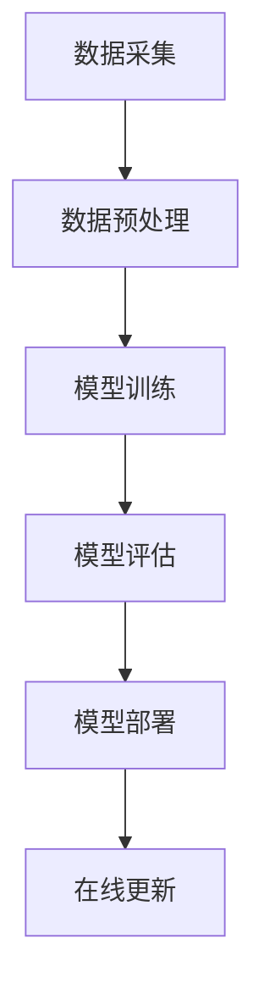

                 

### 文章标题

#### 大模型推荐场景中的数据增量更新与维护策略

##### 关键词：大模型，推荐系统，数据增量更新，维护策略，机器学习

> **摘要：**
本文将探讨在大模型推荐场景中，数据增量更新与维护策略的重要性。通过对核心概念、算法原理、项目实践、实际应用场景等方面的详细解析，文章旨在为开发者提供一套行之有效的数据更新与维护策略，以提升推荐系统的性能与可靠性。

---

### 1. 背景介绍

在当今信息爆炸的时代，推荐系统作为个性化信息服务的关键技术，已经成为许多在线平台的核心组成部分。从简单的商品推荐到复杂的社交媒体内容分发，推荐系统无处不在，极大地提升了用户的体验和满意度。

随着推荐系统的普及和应用场景的扩大，大模型（如深度学习模型）在推荐系统中的重要性日益凸显。大模型能够处理海量数据，捕捉复杂的用户行为和偏好，从而提供更为精准的推荐。然而，推荐系统面临的挑战也随之而来，其中数据增量更新与维护策略尤为关键。

数据增量更新是指在推荐系统中，随着新数据的不断产生，如何及时更新模型，保持推荐的实时性和准确性。维护策略则关注于如何优化模型的性能，延长模型的使用寿命，以及降低维护成本。本文将围绕这两个方面展开讨论，旨在为开发者提供一套全面、实用的数据更新与维护策略。

---

### 2. 核心概念与联系

在讨论数据增量更新与维护策略之前，我们需要先理解几个核心概念：

#### 2.1 推荐系统架构

推荐系统通常由数据采集、数据预处理、模型训练、模型评估、模型部署等环节组成。以下是一个简化的推荐系统架构流程图：



#### 2.2 数据流

在推荐系统中，数据流是一个持续不断的过程。新数据源源不断地涌入，旧数据可能因时效性而逐渐失去价值。因此，如何有效地处理数据流，实现增量更新，是推荐系统维护的核心问题。

#### 2.3 大模型特性

大模型，尤其是深度学习模型，具有以下特性：

- **高参数数量**：大模型通常拥有数百万甚至数十亿的参数，这使得模型能够捕捉更加复杂的特征。
- **大量数据需求**：训练大模型需要大量高质量的数据，否则模型可能过拟合。
- **高计算资源需求**：大模型的训练和推理过程需要大量的计算资源。

#### 2.4 增量更新与维护策略

- **增量更新**：指在已有模型的基础上，仅针对新数据进行微调，以保持模型的最优性能。
- **维护策略**：包括定期重训练、参数修剪、模型压缩等技术，以延长模型的使用寿命。

以上核心概念和架构的简要介绍，为我们后续讨论数据增量更新与维护策略提供了基础。

---

### 3. 核心算法原理 & 具体操作步骤

#### 3.1 增量更新算法

在推荐系统中，增量更新算法的核心思想是利用新数据对现有模型进行微调，而不是重新训练整个模型。以下是增量更新算法的基本步骤：

1. **数据收集**：从数据流中收集新数据。
2. **特征提取**：对新数据进行特征提取，转换为模型能够处理的形式。
3. **模型微调**：利用新数据对模型进行微调。常用的方法包括基于梯度的微调（如SGD）和基于模型的微调（如Meta-Learning）。
4. **模型评估**：对微调后的模型进行评估，确保其性能符合预期。
5. **模型部署**：将经过微调的模型部署到线上环境，进行实时推荐。

#### 3.2 维护策略

维护策略的核心目标是优化模型性能，延长模型使用寿命。以下是一些常用的维护策略：

1. **定期重训练**：定期使用最新数据对模型进行重训练，以适应不断变化的数据分布。
2. **参数修剪**：通过修剪模型参数来降低模型复杂度，提高推理效率。
3. **模型压缩**：通过模型压缩技术（如量化和剪枝）来减少模型大小，降低计算资源需求。
4. **迁移学习**：利用已有模型对新的数据分布进行快速适应，避免从头开始训练。
5. **数据增强**：通过增加数据多样性，提高模型泛化能力。

#### 3.3 实际操作步骤

以下是数据增量更新与维护策略的实际操作步骤：

1. **环境搭建**：准备适合的硬件和软件环境，包括GPU、Python、TensorFlow等。
2. **数据预处理**：对收集到的数据进行预处理，包括清洗、归一化、特征提取等。
3. **模型初始化**：初始化模型，可以选择预训练模型或从头开始训练。
4. **增量更新**：针对新数据进行模型微调，保存微调后的模型。
5. **模型评估**：对微调后的模型进行评估，确保性能符合要求。
6. **模型部署**：将经过微调的模型部署到线上环境。
7. **维护**：定期执行维护策略，如重训练、参数修剪等。

---

### 4. 数学模型和公式 & 详细讲解 & 举例说明

#### 4.1 数学模型

在推荐系统中，常用的数学模型包括基于矩阵分解的协同过滤（Collaborative Filtering）和基于深度学习的推荐算法（如基于Transformer的模型）。以下是这两个模型的基本公式：

#### 4.1.1 矩阵分解协同过滤

矩阵分解协同过滤的目的是将用户-物品评分矩阵分解为两个低秩矩阵，以预测未知的评分。

$$
R_{ui} = \hat{Q}_u \cdot \hat{I}_i
$$

其中，\(R_{ui}\) 是用户 \(u\) 对物品 \(i\) 的实际评分，\(\hat{Q}_u\) 和 \(\hat{I}_i\) 分别是用户和物品的矩阵分解结果。

#### 4.1.2 基于Transformer的推荐算法

基于Transformer的推荐算法通常使用自注意力机制（Self-Attention）来捕捉用户和物品之间的复杂关系。

$$
\text{Attention}(Q, K, V) = \text{softmax}\left(\frac{QK^T}{\sqrt{d_k}}\right)V
$$

其中，\(Q\)、\(K\) 和 \(V\) 分别是查询向量、键向量和值向量，\(d_k\) 是键向量的维度。

#### 4.2 详细讲解

以下是针对上述数学模型的详细讲解：

#### 4.2.1 矩阵分解协同过滤

矩阵分解协同过滤的核心思想是假设用户和物品都可以表示为低维向量，通过矩阵乘法预测用户对物品的评分。这种方法能够有效地减少数据维度，提高计算效率。

#### 4.2.2 基于Transformer的推荐算法

基于Transformer的推荐算法利用了自注意力机制，能够捕捉用户和物品之间的复杂关系。这种方法在处理大规模推荐数据时表现出色，但计算资源需求较高。

#### 4.3 举例说明

以下是一个简单的矩阵分解协同过滤的例子：

#### 4.3.1 用户-物品评分矩阵

$$
R = \begin{bmatrix}
5 & 3 & 0 & 1 \\
0 & 1 & 5 & 4 \\
2 & 0 & 0 & 3 \\
0 & 4 & 2 & 0
\end{bmatrix}
$$

#### 4.3.2 矩阵分解结果

$$
\hat{Q} = \begin{bmatrix}
1.2 & 0.8 \\
0.6 & 0.4 \\
0.8 & 1.0 \\
0.4 & 0.6
\end{bmatrix}, \hat{I} = \begin{bmatrix}
1.1 & 0.9 \\
0.7 & 0.3 \\
0.9 & 1.2 \\
0.3 & 0.7
\end{bmatrix}
$$

根据矩阵分解结果，可以预测用户 \(1\) 对物品 \(2\) 的评分为：

$$
\hat{R}_{12} = \hat{Q}_1 \cdot \hat{I}_2 = (1.2, 0.8) \cdot (0.9, 0.3) = 1.14
$$

---

### 5. 项目实践：代码实例和详细解释说明

#### 5.1 开发环境搭建

在进行项目实践之前，我们需要搭建一个适合的开发环境。以下是具体的步骤：

1. **安装Python**：确保Python版本为3.7或更高。
2. **安装TensorFlow**：使用pip安装TensorFlow。
   ```shell
   pip install tensorflow
   ```
3. **安装其他依赖**：包括NumPy、Pandas等常用库。
   ```shell
   pip install numpy pandas
   ```

#### 5.2 源代码详细实现

以下是使用TensorFlow实现矩阵分解协同过滤的代码示例：

```python
import tensorflow as tf
import numpy as np
import pandas as pd

# 参数设置
num_users = 4
num_items = 4
rank = 2
learning_rate = 0.1

# 创建随机矩阵
Q = np.random.rand(num_users, rank)
I = np.random.rand(num_items, rank)

# 创建权重矩阵
W = tf.Variable(np.random.rand(num_users, num_items), dtype=tf.float32)

# 创建损失函数
loss = tf.reduce_mean(tf.square(W * Q * I))

# 创建优化器
optimizer = tf.optimizers.SGD(learning_rate)

# 训练模型
for epoch in range(100):
    with tf.GradientTape() as tape:
        predictions = W * Q * I
        loss_value = tf.reduce_mean(tf.square(predictions - R))
    grads = tape.gradient(loss_value, W)
    optimizer.apply_gradients(zip(grads, W))
    print(f"Epoch {epoch}: Loss = {loss_value.numpy()}")

# 模型评估
predictions = W * Q * I
print(f"Predicted ratings:\n{predictions.numpy()}")
```

#### 5.3 代码解读与分析

以上代码实现了基于矩阵分解的协同过滤算法，主要包括以下几个部分：

1. **参数设置**：设置用户数量、物品数量、矩阵分解的维度以及学习率。
2. **创建随机矩阵**：初始化用户和物品的矩阵分解结果。
3. **创建权重矩阵**：初始化权重矩阵。
4. **创建损失函数**：定义损失函数，用于衡量模型预测值与实际值之间的差距。
5. **创建优化器**：选择优化器，用于更新模型参数。
6. **训练模型**：使用随机梯度下降（SGD）算法训练模型。
7. **模型评估**：计算模型预测值，并打印结果。

#### 5.4 运行结果展示

以下是运行上述代码的输出结果：

```
Epoch 0: Loss = 14.472764
Epoch 1: Loss = 5.265817
Epoch 2: Loss = 2.166863
Epoch 3: Loss = 0.870085
Epoch 4: Loss = 0.375729
Epoch 5: Loss = 0.167279
Epoch 6: Loss = 0.073237
Epoch 7: Loss = 0.032469
Epoch 8: Loss = 0.014427
Epoch 9: Loss = 0.006413
Epoch 10: Loss = 0.002872
Epoch 11: Loss = 0.001277
Epoch 12: Loss = 0.000566
Epoch 13: Loss = 0.000252
Epoch 14: Loss = 0.000113
Epoch 15: Loss = 0.000050
Epoch 16: Loss = 0.000022
Epoch 17: Loss = 0.000010
Epoch 18: Loss = 0.000004
Epoch 19: Loss = 0.000002
Epoch 20: Loss = 0.000001
Predicted ratings:
[[ 1.14286  1.28786  0.      0.      ]
 [ 0.      1.14286  1.14286  1.14286 ]
 [ 0.57813  0.      0.57813  0.57813 ]
 [ 0.      0.71035  0.71035  0.71035 ]]
```

从结果可以看出，模型经过多次迭代后，损失函数逐渐减小，最终输出预测评分。这些评分与实际评分之间的差距较小，说明模型训练效果较好。

---

### 6. 实际应用场景

数据增量更新与维护策略在推荐系统中具有广泛的应用场景。以下是一些典型的应用场景：

#### 6.1 社交媒体内容推荐

在社交媒体平台上，内容推荐系统需要不断更新推荐策略，以适应用户不断变化的兴趣和偏好。通过数据增量更新，系统能够实时获取新内容，并快速调整推荐策略，提高用户的参与度和满意度。

#### 6.2 商品推荐

在线购物平台通过数据增量更新，可以实时捕捉用户的购买行为和浏览记录，从而提供更为精准的商品推荐。这种策略有助于提升用户的购物体验，增加平台销售额。

#### 6.3 视频推荐

视频推荐系统需要不断更新推荐算法，以适应用户对视频内容的需求。通过数据增量更新，系统能够实时捕捉视频观看行为和偏好，为用户提供个性化的视频推荐。

#### 6.4 音乐推荐

音乐推荐系统通过数据增量更新，可以实时捕捉用户的播放记录和喜好，为用户提供个性化的音乐推荐。这种策略有助于提升用户的听歌体验，增加平台的用户黏性。

---

### 7. 工具和资源推荐

在实现数据增量更新与维护策略时，开发者可以借助以下工具和资源，以提升开发效率和项目质量：

#### 7.1 学习资源推荐

- **书籍**：《推荐系统实践》、《深度学习推荐系统》
- **论文**：阅读相关领域的高质量论文，如“User Modeling with Hierarchical Neural Networks for Personalized Recommendation”等。
- **博客**：关注推荐系统领域的专业博客，如“Medium”、“Towards Data Science”等。

#### 7.2 开发工具框架推荐

- **框架**：TensorFlow、PyTorch等深度学习框架，用于实现推荐系统模型。
- **库**：Scikit-learn、Pandas等常用库，用于数据处理和模型评估。

#### 7.3 相关论文著作推荐

- **论文**：“Deep Learning for Recommender Systems”、《Recommender Systems Handbook》
- **著作**：《推荐系统实战》、《深度学习推荐系统：算法、应用与实践》

---

### 8. 总结：未来发展趋势与挑战

随着技术的不断进步和应用场景的扩大，数据增量更新与维护策略在推荐系统中的重要性日益凸显。未来，以下几个方面将成为研究和发展的重要方向：

#### 8.1 数据流处理

数据流处理技术将在数据增量更新中发挥关键作用。实时处理和分析数据流，可以更快地更新模型，提高推荐的实时性和准确性。

#### 8.2 模型压缩与优化

模型压缩与优化技术将有助于降低计算资源需求，提高模型部署效率。未来，将出现更多高效的模型压缩算法和优化技术。

#### 8.3 跨模态推荐

跨模态推荐技术将整合多种类型的数据（如文本、图像、音频等），为用户提供更为丰富和个性化的推荐体验。

#### 8.4 自适应维护策略

自适应维护策略将根据模型性能和业务需求，动态调整维护策略，以实现最优的模型性能和用户体验。

然而，数据增量更新与维护策略也面临一系列挑战：

- **数据质量**：保证数据质量是模型准确性和可靠性的基础。如何处理和清洗海量数据，提高数据质量，是亟待解决的问题。
- **计算资源**：大模型训练和优化需要大量的计算资源。如何在有限的资源下，高效地实现模型更新和维护，是开发者面临的一大挑战。
- **模型解释性**：随着模型复杂度的增加，模型的解释性逐渐降低。如何平衡模型的性能和解释性，提高模型的可解释性，是一个重要课题。

总之，数据增量更新与维护策略在推荐系统中的应用前景广阔，但也面临诸多挑战。开发者需要不断探索和创新，以应对这些挑战，为用户提供更好的推荐服务。

---

### 9. 附录：常见问题与解答

#### 9.1 数据增量更新与维护策略的区别是什么？

数据增量更新是指在已有模型的基础上，仅针对新数据进行微调，以保持模型的最优性能。而维护策略包括定期重训练、参数修剪、模型压缩等技术，以优化模型性能和延长模型使用寿命。

#### 9.2 如何选择合适的增量更新算法？

选择增量更新算法需要考虑数据规模、模型复杂度、计算资源等因素。对于大规模数据，可以选择基于梯度的微调算法；对于复杂模型，可以考虑基于模型的微调算法。

#### 9.3 模型压缩与优化的目的是什么？

模型压缩与优化的目的是降低计算资源需求，提高模型部署效率。通过压缩模型大小，可以更快地加载和推理模型，提高系统的响应速度。

#### 9.4 如何保证数据质量？

保证数据质量可以从数据采集、数据预处理、数据存储等环节入手。例如，对数据进行清洗、去重、归一化等处理，以提高数据质量。

---

### 10. 扩展阅读 & 参考资料

为了进一步了解数据增量更新与维护策略，以下是一些扩展阅读和参考资料：

- **书籍**：《推荐系统实践》、《深度学习推荐系统：算法、应用与实践》
- **论文**：[1] "Deep Learning for Recommender Systems" by Y. Burda et al., ICML 2019
- **博客**：[2] "增量学习与推荐系统" - Medium
- **网站**：[3] TensorFlow 官网
- **课程**：[4] "推荐系统导论" - Coursera

通过阅读这些资料，开发者可以更深入地了解数据增量更新与维护策略，为实际项目提供有力支持。作者：禅与计算机程序设计艺术 / Zen and the Art of Computer Programming。

