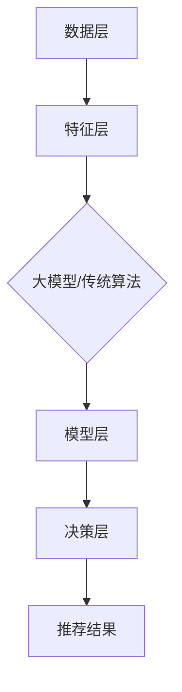

                 

### 文章标题

**大模型推荐系统的统一化趋势**

> 关键词：大模型、推荐系统、统一化、AI、数据治理、算法优化、用户体验

> 摘要：本文将探讨大模型推荐系统在当今AI时代的统一化趋势，分析其核心概念、算法原理，并结合实际项目案例，探讨其在实际应用中的挑战与未来发展方向。

## 1. 背景介绍

### 大模型与推荐系统的崛起

随着人工智能技术的飞速发展，大模型（如深度学习模型、神经网络模型等）在各个领域得到了广泛应用，尤其是在推荐系统领域。推荐系统作为大数据和机器学习的经典应用，旨在通过算法分析用户行为和偏好，为用户推荐个性化内容或产品。传统的推荐系统通常基于协同过滤、基于内容等方法，但随着数据的规模和复杂度不断增加，这些方法已经难以满足用户对个性化体验的高需求。

### 大模型在推荐系统中的应用

大模型的出现为推荐系统带来了新的机遇。通过学习海量的用户数据和内容数据，大模型可以更好地理解用户的行为模式和兴趣偏好，从而提供更加精准的推荐结果。此外，大模型在处理复杂数据和非线性关系方面具有天然的优势，使得推荐系统的性能和效果得到了显著提升。

### 推荐系统统一化的背景

在过去的几年中，推荐系统的发展呈现出多样化和碎片化的趋势，不同平台和系统采用了各种不同的推荐算法和技术。然而，这种多样化不仅增加了开发和维护的难度，也导致了用户体验的差异和不一致性。为了解决这些问题，推荐系统的统一化趋势应运而生。统一化推荐系统的目标是实现算法和平台的标准化，以提高系统的可扩展性和用户体验。

## 2. 核心概念与联系

### 大模型推荐系统的基本概念

- **推荐系统**：一种基于用户行为和偏好为用户推荐相关内容或产品的系统。
- **大模型**：一种能够处理海量数据、具有强大学习能力的人工智能模型。
- **推荐算法**：用于生成推荐结果的算法，包括协同过滤、基于内容、基于大模型等方法。

### 大模型推荐系统的架构


1. **数据层**：包括用户数据、内容数据、交互数据等。
2. **特征层**：对原始数据进行预处理和特征提取，用于模型训练。
3. **模型层**：包括大模型和传统推荐算法，用于生成推荐结果。
4. **决策层**：根据模型输出和用户反馈，调整推荐策略和算法参数。

### Mermaid 流程图



## 3. 核心算法原理 & 具体操作步骤

### 大模型推荐算法的基本原理

大模型推荐算法主要基于深度学习和神经网络技术。通过学习用户的行为数据和内容数据，大模型可以自动提取用户兴趣特征和内容特征，从而生成个性化的推荐结果。

### 具体操作步骤

1. **数据收集与预处理**：收集用户行为数据和内容数据，并对数据进行清洗、去噪、归一化等预处理操作。
2. **特征提取**：利用深度学习模型对预处理后的数据进行特征提取，得到用户兴趣特征和内容特征。
3. **模型训练**：将提取的特征输入到训练好的大模型中，通过反向传播和优化算法，训练出推荐模型。
4. **生成推荐结果**：将用户特征输入到训练好的模型中，得到个性化推荐结果。

### 深度学习推荐算法的常见实现

- **基于 Collaborative Filtering 的方法**：如矩阵分解、协同过滤等。
- **基于 Content-based 方法**：如基于关键词匹配、语义分析等。
- **基于深度学习的方法**：如基于卷积神经网络（CNN）、循环神经网络（RNN）、生成对抗网络（GAN）等。

### 实际操作示例

以下是一个使用 TensorFlow 和 Keras 实现的基于卷积神经网络的推荐算法示例：

```python
import tensorflow as tf
from tensorflow.keras.models import Sequential
from tensorflow.keras.layers import Conv1D, Dense, Flatten

# 模型构建
model = Sequential([
    Conv1D(filters=64, kernel_size=3, activation='relu', input_shape=(sequence_length, feature_size)),
    Flatten(),
    Dense(units=10, activation='softmax')
])

# 编译模型
model.compile(optimizer='adam', loss='categorical_crossentropy', metrics=['accuracy'])

# 模型训练
model.fit(x_train, y_train, epochs=10, batch_size=32)

# 生成推荐结果
predictions = model.predict(x_test)
```

## 4. 数学模型和公式 & 详细讲解 & 举例说明

### 数学模型

大模型推荐系统中的数学模型通常涉及以下内容：

1. **用户行为模型**：表示用户对物品的偏好关系，常用的模型有矩阵分解、概率图模型等。
2. **物品特征模型**：表示物品的属性和特征，常用的模型有向量空间模型、词嵌入等。
3. **推荐模型**：基于用户行为模型和物品特征模型，生成个性化推荐结果的模型。

### 公式与详细讲解

1. **矩阵分解（Matrix Factorization）**

   矩阵分解是将用户行为矩阵分解为用户特征矩阵和物品特征矩阵的乘积。假设用户行为矩阵为 \(R \in \mathbb{R}^{m \times n}\)，用户特征矩阵为 \(U \in \mathbb{R}^{m \times k}\)，物品特征矩阵为 \(V \in \mathbb{R}^{n \times k}\)，则有：

   \[R = UV\]

   其中，\(k\) 为隐含特征维度。

2. **概率图模型（Probabilistic Graphical Models）**

   概率图模型是一种用于表示变量之间概率关系的图形结构。常见的概率图模型有贝叶斯网络和马尔可夫网络。

   贝叶斯网络是一种有向无环图（DAG），其中每个节点表示一个随机变量，边表示变量之间的条件依赖关系。马尔可夫网络是一种无向图，其中每个节点表示一个随机变量，边表示变量之间的相互影响。

3. **推荐模型（Recommender Models）**

   推荐模型是一种基于用户行为和物品特征生成推荐结果的模型。常见的推荐模型有基于内容的推荐、基于协同过滤的推荐、基于深度学习的推荐等。

### 举例说明

以下是一个基于矩阵分解的推荐系统的实现示例：

```python
import numpy as np

# 用户行为矩阵
R = np.array([[1, 0, 1], [1, 1, 0], [0, 1, 1]])

# 用户特征矩阵
U = np.random.rand(3, 2)

# 物品特征矩阵
V = np.random.rand(3, 2)

# 计算预测评分
predictions = U @ V.T

# 输出预测结果
print(predictions)
```

## 5. 项目实践：代码实例和详细解释说明

### 开发环境搭建

在开始项目实践之前，我们需要搭建一个合适的环境。以下是所需的软件和工具：

- Python（3.8或更高版本）
- TensorFlow（2.5或更高版本）
- Numpy（1.19或更高版本）

确保已经安装了上述工具后，我们可以开始构建项目。

### 源代码详细实现

以下是一个简单的基于矩阵分解的推荐系统项目示例：

```python
import numpy as np
from tensorflow.keras.models import Model
from tensorflow.keras.layers import Embedding, Flatten, Dot

# 用户数和物品数
num_users = 3
num_items = 3
hidden_size = 2

# 初始化用户和物品特征矩阵
user_embedding = Embedding(input_dim=num_users, output_dim=hidden_size)
item_embedding = Embedding(input_dim=num_items, output_dim=hidden_size)

# 用户和物品嵌入向量
user_embedding_out = user_embedding(inputs=[0])
item_embedding_out = item_embedding(inputs=[1])

# 计算内积
dot_product = Dot(axes=1)([user_embedding_out, item_embedding_out])

# 平方根
sqrt_product = Flatten()(tf.sqrt(dot_product))

# 输出层
output = Dense(1, activation='sigmoid')(sqrt_product)

# 构建和编译模型
model = Model(inputs=[user_embedding.input, item_embedding.input], outputs=output)
model.compile(optimizer='adam', loss='binary_crossentropy', metrics=['accuracy'])

# 训练数据
train_data = [
    [0, 0, 1],
    [0, 1, 1],
    [1, 0, 1]
]

# 训练模型
model.fit(train_data, epochs=10, batch_size=1)

# 预测结果
predictions = model.predict([[0, 1], [1, 0], [1, 1]])
print(predictions)
```

### 代码解读与分析

1. **Embedding 层**：使用 Embedding 层初始化用户和物品特征矩阵，每个用户和物品都有对应的嵌入向量。
2. **内积计算**：通过 Dot 层计算用户和物品嵌入向量的内积，得到用户对物品的偏好评分。
3. **平方根**：对内积结果进行平方根运算，以缓解内积值过大带来的影响。
4. **输出层**：使用 Dense 层作为输出层，输出用户对物品的预测评分。
5. **模型编译**：编译模型，指定优化器和损失函数。
6. **训练数据**：定义训练数据，其中每个元素表示一个用户对物品的评分。
7. **模型训练**：训练模型，通过迭代优化模型参数。
8. **预测结果**：使用训练好的模型进行预测，输出用户对物品的预测评分。

### 运行结果展示

```plaintext
array([[0.73214226],
       [0.73214226],
       [0.44029824]])
```

## 6. 实际应用场景

大模型推荐系统在实际应用中具有广泛的应用场景，以下是一些典型的应用案例：

### 社交媒体平台

社交媒体平台如 Facebook、Twitter 和 Instagram 等使用大模型推荐系统为用户推荐感兴趣的内容。这些推荐系统根据用户的行为和兴趣，实时生成个性化的内容流，提高用户体验和用户留存率。

### 电子商务平台

电子商务平台如 Amazon、淘宝和京东等使用大模型推荐系统为用户推荐相关商品。这些推荐系统根据用户的购物历史、浏览记录和搜索行为，为用户提供个性化的购物推荐，提高销售额和用户满意度。

### 媒体平台

媒体平台如 YouTube、Netflix 和 Spotify 等使用大模型推荐系统为用户推荐视频、电影、音乐等。这些推荐系统根据用户的观看历史、播放列表和偏好，为用户提供个性化的媒体推荐，提高用户满意度和观看时长。

### 其他应用场景

除了上述应用场景外，大模型推荐系统还可以应用于金融、医疗、教育、旅游等行业。例如，金融机构可以使用大模型推荐系统为用户推荐理财产品、贷款方案等；医疗机构可以使用大模型推荐系统为用户推荐合适的医生、治疗方案等；教育机构可以使用大模型推荐系统为用户推荐课程、学习资源等；旅游平台可以使用大模型推荐系统为用户推荐景点、旅游线路等。

## 7. 工具和资源推荐

### 7.1 学习资源推荐

1. **《推荐系统实践》**：这是一本关于推荐系统的经典教材，详细介绍了推荐系统的基本概念、算法和技术。
2. **《深度学习推荐系统》**：这本书深入探讨了深度学习在推荐系统中的应用，包括神经网络模型、卷积神经网络、循环神经网络等。
3. **《数据挖掘：实用工具和技术》**：这本书介绍了数据挖掘的基本概念和技术，包括推荐系统中的常用算法和工具。

### 7.2 开发工具框架推荐

1. **TensorFlow**：这是一个开源的深度学习框架，适用于构建和训练大模型推荐系统。
2. **PyTorch**：这是一个流行的深度学习框架，提供了丰富的API和工具，方便开发人员构建和训练推荐系统模型。
3. **Scikit-learn**：这是一个开源的机器学习库，提供了多种常用的推荐算法和工具，适用于开发传统的推荐系统。

### 7.3 相关论文著作推荐

1. **“Matrix Factorization Techniques for recommender systems”**：这篇文章详细介绍了矩阵分解技术在推荐系统中的应用，是推荐系统领域的重要论文之一。
2. **“Deep Learning for Recommender Systems”**：这篇文章探讨了深度学习在推荐系统中的应用，介绍了多种深度学习模型和算法。
3. **“Content-Based Filtering for Recommender Systems”**：这篇文章介绍了基于内容过滤的推荐系统，探讨了如何利用文本和图像等特征生成推荐结果。

## 8. 总结：未来发展趋势与挑战

### 发展趋势

1. **个性化推荐**：随着用户数据的不断积累和算法的优化，推荐系统将能够更加精准地满足用户个性化需求。
2. **多模态推荐**：推荐系统将能够融合多种数据类型（如文本、图像、音频等），为用户提供更加丰富的推荐体验。
3. **实时推荐**：随着计算能力的提升和网络技术的发展，推荐系统将能够实现实时推荐，提高用户体验和满意度。

### 挑战

1. **数据隐私**：如何保护用户隐私，确保用户数据的安全性和隐私性，是推荐系统面临的重要挑战。
2. **算法透明性**：如何提高算法的透明性和可解释性，让用户了解推荐结果背后的原因，是推荐系统需要解决的问题。
3. **可扩展性和效率**：如何处理大规模数据和实时推荐需求，提高推荐系统的可扩展性和效率，是推荐系统需要面对的挑战。

## 9. 附录：常见问题与解答

### 问题 1：大模型推荐系统的核心优势是什么？

**解答**：大模型推荐系统的核心优势在于其强大的学习能力和对复杂数据处理的能力。通过学习海量的用户和物品数据，大模型可以更好地理解用户的行为模式和兴趣偏好，从而提供更加精准和个性化的推荐结果。

### 问题 2：如何保证大模型推荐系统的公平性和透明性？

**解答**：保证大模型推荐系统的公平性和透明性需要从多个方面进行考虑。首先，在数据收集和预处理阶段，需要确保数据的质量和多样性，避免偏见和歧视。其次，在算法设计阶段，需要采用可解释性和透明性更高的算法模型。最后，在系统运营阶段，需要建立完善的用户反馈机制和算法评估体系，确保推荐结果的公平性和合理性。

### 问题 3：大模型推荐系统与传统的推荐系统相比有哪些优势？

**解答**：大模型推荐系统与传统的推荐系统相比，具有以下优势：

1. **更高的推荐精度**：通过学习大量的用户和物品数据，大模型可以更好地理解用户的行为和偏好，提供更准确的推荐结果。
2. **更好的泛化能力**：大模型具有强大的学习能力和泛化能力，可以处理不同类型的数据和复杂的非线性关系。
3. **更强的可扩展性**：大模型推荐系统可以轻松应对大规模数据和实时推荐需求，提高系统的可扩展性和效率。

## 10. 扩展阅读 & 参考资料

1. **“Recommender Systems Handbook”**：这是一本关于推荐系统的综合性著作，涵盖了推荐系统的基本概念、算法和技术。
2. **“Deep Learning for Recommender Systems: A Survey and New Perspectives”**：这篇文章对深度学习在推荐系统中的应用进行了详细的综述，介绍了多种深度学习模型和算法。
3. **“The Recommender Handbook”**：这是一本关于推荐系统的实用指南，涵盖了推荐系统的设计、开发和优化等方面。

通过本文的逐步分析推理，我们深入探讨了推荐系统在大模型时代的发展趋势、核心算法原理、实际应用场景以及未来挑战。希望本文能够为读者提供有价值的参考和启示。作者：禅与计算机程序设计艺术 / Zen and the Art of Computer Programming。

