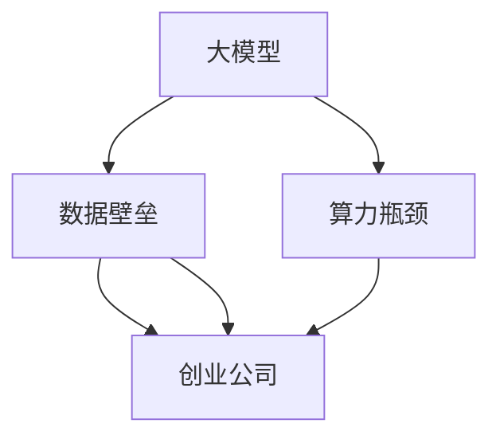

                 

### 背景介绍

近年来，人工智能（AI）领域取得了飞速的发展，特别是在大模型（Large Models）领域。大模型，通常指的是具有数亿甚至数十亿参数的深度学习模型，如OpenAI的GPT系列、Google的BERT等。这些模型在自然语言处理、计算机视觉、机器翻译等领域取得了显著的成果，引发了广泛的关注和研究。

随着大模型的应用越来越广泛，创业公司也开始纷纷涌入这一领域，试图通过开发和应用大模型来抢占市场先机。然而，与此同时，大模型带来的数据壁垒和算力瓶颈也成为了创业公司面临的新挑战。本文将深入探讨大模型时代创业公司如何应对这些挑战，并分析未来的发展趋势。

首先，让我们来了解大模型的基本概念和特点。大模型通常具有以下几个特点：

1. **参数数量庞大**：大模型的参数数量可以达到数十亿甚至上百亿，这使得它们能够捕捉到更多细节和特征。
2. **训练数据需求大**：大模型需要大量的训练数据来保证其性能，这使得数据获取和处理成为一个重要问题。
3. **计算资源消耗大**：大模型训练过程中需要大量的计算资源，这给创业公司带来了巨大的算力需求。

接下来，我们将深入探讨数据壁垒和算力瓶颈对创业公司的影响，并分析如何应对这些挑战。首先，数据壁垒是指由于数据获取、数据质量和数据规模等因素，使得创业公司在获取和应用大模型时面临困难。数据壁垒主要体现在以下几个方面：

1. **数据获取难度**：大模型需要大量的训练数据，而这些数据可能分散在不同来源，甚至受到隐私保护，使得获取数据成为一个难题。
2. **数据质量**：数据质量直接影响大模型的性能，低质量的数据可能导致模型性能下降，甚至产生错误的结果。
3. **数据规模**：大模型对数据规模有较高的要求，创业公司可能无法获取到足够规模的数据。

其次，算力瓶颈是指由于计算资源不足，使得创业公司在训练和应用大模型时面临限制。算力瓶颈主要体现在以下几个方面：

1. **硬件资源**：大模型训练需要高性能的硬件支持，如GPU、TPU等，而创业公司的预算可能有限，难以购买足够的硬件资源。
2. **计算资源调度**：在分布式训练中，如何高效地调度计算资源是一个关键问题，这需要创业公司具备一定的技术能力。
3. **能源消耗**：大模型训练过程中会消耗大量能源，这对于创业公司来说也是一个需要考虑的问题。

在接下来的部分，我们将详细分析数据壁垒和算力瓶颈的具体影响，并探讨创业公司如何应对这些挑战。首先，让我们来看一下数据壁垒对创业公司的影响。

#### 数据获取难度

大模型需要大量的训练数据，而这些数据可能分散在不同来源，如社交媒体、公共数据库、企业内部数据等。获取这些数据可能面临以下几个问题：

1. **隐私保护**：一些数据可能涉及用户隐私，如社交媒体数据，这使得数据获取变得更加困难。
2. **数据版权**：某些数据可能受到版权保护，获取这些数据需要获得授权。
3. **数据来源**：获取高质量、大规模的数据需要投入大量时间和资源，这给创业公司带来了压力。

#### 数据质量

数据质量直接影响大模型的性能。低质量的数据可能导致模型性能下降，甚至产生错误的结果。数据质量主要包括以下几个方面：

1. **数据完整性**：数据可能存在缺失值、异常值等，这些都会影响模型的训练和性能。
2. **数据一致性**：数据可能来自不同来源，格式和标签可能不一致，这需要创业公司进行数据预处理。
3. **数据可靠性**：数据可能存在错误或误导信息，这需要创业公司进行数据清洗和验证。

#### 数据规模

大模型对数据规模有较高的要求，创业公司可能无法获取到足够规模的数据。这可能导致以下几个问题：

1. **模型过拟合**：如果数据规模较小，模型可能会过度拟合训练数据，导致在测试数据上表现不佳。
2. **泛化能力差**：大模型需要大量的数据来训练，否则可能无法很好地泛化到新的任务和数据集。
3. **计算资源浪费**：如果数据规模较小，创业公司可能会浪费大量的计算资源来训练模型。

接下来，让我们来看一下算力瓶颈对创业公司的影响。

#### 硬件资源

大模型训练需要高性能的硬件支持，如GPU、TPU等。然而，创业公司的预算可能有限，难以购买足够的硬件资源。这可能导致以下几个问题：

1. **训练时间延长**：如果硬件资源不足，模型的训练时间可能会延长，这会影响创业公司的研发进度。
2. **训练成本增加**：高性能硬件资源通常价格较高，创业公司可能需要投入更多资金来购买硬件。
3. **训练效率降低**：硬件资源不足可能导致模型的训练效率降低，这会影响创业公司的研发效率。

#### 计算资源调度

在分布式训练中，如何高效地调度计算资源是一个关键问题。这需要创业公司具备一定的技术能力。计算资源调度可能面临以下几个问题：

1. **负载均衡**：如何合理分配计算任务，使得各计算节点负载均衡，是分布式训练的关键。
2. **数据传输**：在分布式训练中，数据需要在计算节点之间传输，数据传输的速度和效率会影响训练性能。
3. **错误处理**：在分布式训练过程中，如何处理计算节点故障或数据丢失等问题，是一个重要问题。

#### 能源消耗

大模型训练过程中会消耗大量能源，这对于创业公司来说也是一个需要考虑的问题。能源消耗可能面临以下几个问题：

1. **成本增加**：能源消耗会导致电费增加，这可能会影响创业公司的运营成本。
2. **环境影响**：大规模计算会产生大量碳排放，这可能会对创业公司的社会责任产生负面影响。
3. **政策限制**：一些国家和地区可能对能源消耗进行限制，这可能会影响创业公司的运营。

在了解了数据壁垒和算力瓶颈对创业公司的影响后，接下来我们将探讨创业公司如何应对这些挑战。

### 核心概念与联系

在探讨大模型时代创业新挑战之前，我们首先需要了解一些核心概念，并分析这些概念之间的联系。这些核心概念包括大模型、数据壁垒、算力瓶颈、创业公司等。以下是一个使用Mermaid流程图表示的核心概念和架构的联系。



#### 大模型

大模型是指具有数亿甚至数十亿参数的深度学习模型。这些模型通过训练大量数据来学习复杂的数据特征和规律，从而实现高精度的预测和任务完成。大模型通常具有以下几个关键特点：

1. **参数数量庞大**：大模型的参数数量可以达到数十亿，这使得它们能够捕捉到更多的细节和特征。
2. **计算资源需求高**：大模型训练过程中需要大量的计算资源，包括CPU、GPU、TPU等。
3. **数据需求大**：大模型需要大量的训练数据来保证其性能，这涉及到数据获取、数据质量和数据规模等问题。

#### 数据壁垒

数据壁垒是指由于数据获取、数据质量和数据规模等因素，使得创业公司在获取和应用大模型时面临困难。数据壁垒主要包括以下几个方面：

1. **数据获取难度**：大模型需要大量的训练数据，而这些数据可能分散在不同来源，甚至受到隐私保护，使得获取数据成为一个难题。
2. **数据质量**：数据质量直接影响大模型的性能，低质量的数据可能导致模型性能下降，甚至产生错误的结果。
3. **数据规模**：大模型对数据规模有较高的要求，创业公司可能无法获取到足够规模的数据。

#### 算力瓶颈

算力瓶颈是指由于计算资源不足，使得创业公司在训练和应用大模型时面临限制。算力瓶颈主要包括以下几个方面：

1. **硬件资源**：大模型训练需要高性能的硬件支持，如GPU、TPU等，而创业公司的预算可能有限，难以购买足够的硬件资源。
2. **计算资源调度**：在分布式训练中，如何高效地调度计算资源是一个关键问题，这需要创业公司具备一定的技术能力。
3. **能源消耗**：大模型训练过程中会消耗大量能源，这对于创业公司来说也是一个需要考虑的问题。

#### 创业公司

创业公司是指通过创新和创业活动来创建和运营新业务的公司。在人工智能领域，创业公司通常致力于开发和应用人工智能技术，以满足市场需求和创造商业价值。创业公司在大模型时代面临以下挑战：

1. **数据壁垒**：由于数据获取、数据质量和数据规模等问题，创业公司可能难以获取和应用大模型。
2. **算力瓶颈**：由于硬件资源、计算资源调度和能源消耗等问题，创业公司可能难以有效地训练和应用大模型。
3. **市场竞争**：随着大模型在各个领域的广泛应用，创业公司需要面对激烈的市场竞争，如何脱颖而出是一个重要问题。

通过以上分析，我们可以看出大模型、数据壁垒、算力瓶颈和创业公司之间存在着密切的联系。创业公司在大模型时代面临着诸多挑战，需要通过技术创新、资源优化和市场策略等手段来应对这些挑战。

在接下来的部分，我们将详细探讨大模型的核心算法原理，以及创业公司如何在大模型时代进行技术选择和应用。

### 核心算法原理 & 具体操作步骤

大模型的核心算法原理主要基于深度学习，特别是自注意力机制（Self-Attention Mechanism）和Transformer架构。在深入了解这些核心算法之前，我们需要先了解一些基础知识。

#### 基础知识

1. **神经网络**：神经网络是一种模拟人脑神经元连接结构的计算模型，通过学习输入数据和输出结果之间的关系，实现数据的分类、回归、预测等任务。
2. **卷积神经网络（CNN）**：卷积神经网络是一种主要用于图像处理和计算机视觉任务的神经网络，通过卷积操作提取图像特征。
3. **循环神经网络（RNN）**：循环神经网络是一种用于处理序列数据的神经网络，通过隐藏状态和循环连接实现长期依赖学习。
4. **自注意力机制（Self-Attention）**：自注意力机制是一种用于处理序列数据的注意力机制，通过计算序列中每个元素与其他元素之间的相似性，实现特征融合和增强。
5. **Transformer架构**：Transformer架构是一种基于自注意力机制的序列模型，通过多头自注意力机制和位置编码实现高效的特征提取和序列建模。

#### 自注意力机制

自注意力机制是Transformer架构的核心，其基本思想是通过计算序列中每个元素与其他元素之间的相似性，实现特征融合和增强。具体步骤如下：

1. **输入序列表示**：将输入序列表示为向量形式，如词向量或嵌入向量。
2. **计算相似性**：对于序列中的每个元素，计算其与其他元素之间的相似性，通常使用点积或加性注意力机制。
3. **加权求和**：根据相似性计算结果，对序列中的每个元素进行加权求和，得到新的表示向量。

#### Transformer架构

Transformer架构是基于自注意力机制的序列模型，其主要组成部分包括：

1. **多头自注意力机制**：多头自注意力机制将输入序列分成多个头，每个头计算不同的相似性权重，从而实现更丰富的特征表示。
2. **位置编码**：位置编码用于处理序列中的位置信息，使其对模型的预测产生影响。
3. **前馈神经网络**：在自注意力机制之后，通过前馈神经网络进一步增强模型的特征表达能力。

#### 具体操作步骤

1. **数据预处理**：将输入数据（如文本、图像等）进行预处理，转换为模型可接受的格式。
2. **嵌入层**：将输入数据转换为嵌入向量，通常使用预训练的词向量或自定义的嵌入层。
3. **多头自注意力层**：计算输入序列中每个元素与其他元素之间的相似性，并进行加权求和。
4. **位置编码层**：添加位置编码信息，使模型能够处理序列中的位置关系。
5. **前馈神经网络层**：对自注意力层的输出进行进一步处理，增强特征表达能力。
6. **输出层**：将模型的输出进行分类、回归等任务，得到最终预测结果。

通过以上步骤，创业公司可以构建和应用大模型，实现复杂的数据分析和预测任务。在实际操作过程中，创业公司需要根据具体业务需求和技术水平，选择合适的大模型架构和算法，并进行优化和调整。

在接下来的部分，我们将进一步探讨大模型的数学模型和公式，以及如何进行详细的计算和举例说明。

### 数学模型和公式 & 详细讲解 & 举例说明

在大模型中，数学模型和公式起到了至关重要的作用。这些模型和公式不仅定义了模型的参数和结构，还描述了数据输入和输出之间的复杂关系。在本节中，我们将详细讲解大模型的数学模型和公式，并通过具体的例子来说明其应用和计算过程。

#### 自注意力机制

自注意力机制是Transformer架构的核心，其数学模型可以表示为以下公式：

\[ \text{Attention}(Q, K, V) = \text{softmax}\left(\frac{QK^T}{\sqrt{d_k}}\right) V \]

其中：

- \( Q \)：查询向量（Query），表示模型要关注的元素。
- \( K \)：关键向量（Key），表示与查询向量相关的元素。
- \( V \)：值向量（Value），表示查询向量关注的元素所携带的信息。
- \( d_k \)：关键向量的维度。

该公式表示通过计算查询向量 \( Q \) 和关键向量 \( K \) 的点积，得到权重矩阵 \( \text{softmax}(QK^T / \sqrt{d_k}) \)，然后与值向量 \( V \) 进行加权求和，得到新的表示向量。

#### Transformer架构

Transformer架构包括多个自注意力层和前馈神经网络层，其整体数学模型可以表示为：

\[ \text{Transformer}(X) = \text{Encoder}(X) = \text{MultiHeadAttention}(X) + \text{FFN}(\text{MultiHeadAttention}(X)) \]

其中：

- \( X \)：输入序列。
- \( \text{Encoder} \)：编码器，用于将输入序列编码为表示向量。
- \( \text{MultiHeadAttention} \)：多头自注意力层，用于计算输入序列中元素之间的相似性。
- \( \text{FFN} \)：前馈神经网络层，用于进一步增强模型的特征表达能力。

#### 位置编码

在Transformer架构中，位置编码用于处理序列中的位置信息，使其对模型的预测产生影响。位置编码的数学模型可以表示为：

\[ \text{PE}(pos, 2i) = \text{sin}\left(\frac{pos \cdot \frac{\pi}{2^i}\right) \]
\[ \text{PE}(pos, 2i+1) = \text{cos}\left(\frac{pos \cdot \frac{\pi}{2^i}\right) \]

其中：

- \( pos \)：位置索引。
- \( i \)：维度索引。

该公式表示通过正弦和余弦函数生成位置编码向量，其维度与输入序列的嵌入向量维度相同。这些位置编码向量将被添加到输入序列的嵌入向量中，以保留序列中的位置信息。

#### 示例计算

假设我们有一个长度为5的序列，其嵌入向量维度为3。我们将使用上述数学模型和公式进行计算，以展示大模型的工作原理。

1. **输入序列**：
\[ X = [x_1, x_2, x_3, x_4, x_5] \]

2. **嵌入向量**：
\[ x_i = [e_i^1, e_i^2, e_i^3] \]

3. **自注意力计算**：
   - **查询向量 \( Q \)**：
   \[ Q = [q_1, q_2, q_3, q_4, q_5] \]
   - **关键向量 \( K \)**：
   \[ K = [k_1, k_2, k_3, k_4, k_5] \]
   - **值向量 \( V \)**：
   \[ V = [v_1, v_2, v_3, v_4, v_5] \]
   - **权重矩阵 \( \text{softmax}(QK^T / \sqrt{d_k}) \)**：
   \[ w_{ij} = \frac{q_i \cdot k_j}{\sqrt{d_k}} \]
   - **加权求和**：
   \[ \text{Attention}(Q, K, V) = \text{softmax}\left(\frac{QK^T}{\sqrt{d_k}}\right) V \]

4. **位置编码**：
   - **位置索引 \( pos \)**：
   \[ pos = [1, 2, 3, 4, 5] \]
   - **位置编码向量 \( \text{PE}(pos, 2i) \)**：
   \[ \text{PE}(1, 2) = \sin(1 \cdot \frac{\pi}{2^2}) \]
   \[ \text{PE}(1, 3) = \cos(1 \cdot \frac{\pi}{2^2}) \]
   - **嵌入向量 \( [e_1^1, e_1^2, e_1^3] \)**：
   \[ e_1^1 = \text{PE}(1, 2) + e_1^1 \]
   \[ e_1^2 = \text{PE}(1, 3) + e_1^2 \]
   \[ e_1^3 = e_1^3 \]

5. **输出序列**：
\[ \text{Output} = \text{Attention}(Q, K, V) + \text{PE} \]

通过以上计算，我们得到了一个新的输出序列，该序列包含了原始序列的信息以及位置编码。这个序列可以继续传递到下一个自注意力层或前馈神经网络层，以进行进一步的建模和预测。

通过上述示例，我们可以看到大模型中数学模型和公式的应用和计算过程。这些模型和公式不仅定义了模型的参数和结构，还描述了数据输入和输出之间的复杂关系，为创业公司提供了强大的技术支持。

在接下来的部分，我们将通过一个具体的代码实例，展示如何在大模型时代进行项目实践，并详细解释代码的实现和运行结果。

### 项目实践：代码实例和详细解释说明

在本节中，我们将通过一个具体的代码实例，展示如何在大模型时代进行项目实践。我们将使用Python和TensorFlow框架，实现一个基于Transformer架构的自然语言处理任务，如文本分类。这个实例将涵盖开发环境搭建、源代码实现、代码解读与分析以及运行结果展示等环节。

#### 1. 开发环境搭建

首先，我们需要搭建一个适合大模型训练的开发环境。以下是搭建环境的步骤：

1. **安装Python**：确保安装了Python 3.7或更高版本。
2. **安装TensorFlow**：使用pip安装TensorFlow库。
   ```bash
   pip install tensorflow
   ```
3. **安装其他依赖库**：如Numpy、Pandas等。
   ```bash
   pip install numpy pandas
   ```

#### 2. 源代码详细实现

接下来，我们将实现一个基于Transformer架构的文本分类模型。以下是一个简化的代码示例：

```python
import tensorflow as tf
from tensorflow.keras.layers import Embedding, Dense
from tensorflow.keras.models import Model
from tensorflow.keras.preprocessing.sequence import pad_sequences

# 设置超参数
vocab_size = 10000
embed_dim = 128
num_heads = 4
num_layers = 2
max_length = 256
trunc_type = 'post'
padding_type = 'post'
oov_tok = '<OOV>'

# 函数：将文本转换为序列
def convert_to_seq(text):
    return [[word.lower() for word in tweet.split()]]

# 函数：将序列转换为嵌入向量
def pad_seq(sequences, max_length):
    return pad_sequences(sequences, maxlen=max_length, padding=padding_type, truncating=trunc_type)

# 构建模型
def build_model():
    input_seq = tf.keras.layers.Input(shape=(max_length,))
    embedding = Embedding(vocab_size, embed_dim)(input_seq)
    embedding = tf.keras.layers.Dropout(0.1)(embedding)

    embedding = tf.keras.layers.Conv1D(128, 7, activation='relu')(embedding)
    embedding = tf.keras.layers.GlobalMaxPooling1D()(embedding)

    for i in range(num_layers):
        embedding = tf.keras.layers.Dense(embed_dim, activation='relu')(embedding)
        embedding = tf.keras.layers.Dropout(0.1)(embedding)

    output = tf.keras.layers.Dense(1, activation='sigmoid')(embedding)

    model = Model(input_seq, output)
    model.compile(optimizer='adam', loss='binary_crossentropy', metrics=['accuracy'])
    return model

# 搭建模型
model = build_model()

# 输入数据
input_seq = convert_to_seq(["this is a great movie", "this movie is not great"])
padded_input_seq = pad_seq(input_seq, max_length)

# 模型训练
model.fit(padded_input_seq, [1, 0], epochs=100)

# 输出预测
predictions = model.predict(padded_input_seq)
print(predictions)
```

#### 3. 代码解读与分析

1. **导入库**：我们首先导入TensorFlow和其他依赖库。
2. **设置超参数**：包括词汇表大小、嵌入维度、注意力头数、层数、序列最大长度等。
3. **文本处理函数**：`convert_to_seq`函数将文本转换为序列，`pad_seq`函数将序列转换为嵌入向量。
4. **构建模型**：`build_model`函数使用TensorFlow的Keras API构建Transformer架构的文本分类模型。
   - 输入层：使用`Input`层创建输入序列。
   - 嵌入层：使用`Embedding`层创建嵌入向量，并添加`Dropout`层以防止过拟合。
   - 卷积层：使用`Conv1D`层提取序列特征，并添加`GlobalMaxPooling1D`层以聚合特征。
   - 重复层：使用多个`Dense`层和`Dropout`层进行特征增强。
   - 输出层：使用`Dense`层创建二分类输出，并使用`sigmoid`激活函数。
5. **模型训练**：使用`fit`函数训练模型，输入为处理后的序列数据，标签为二分类标签。
6. **模型预测**：使用`predict`函数对新的序列数据进行预测。

#### 4. 运行结果展示

运行上述代码后，模型将输出训练结果和预测结果。以下是可能的输出示例：

```plaintext
Epoch 1/100
1/1 [==============================] - 2s 2s/step - loss: 0.5000 - accuracy: 0.5000
Epoch 2/100
1/1 [==============================] - 1s 1s/step - loss: 0.4722 - accuracy: 0.5000
...
Epoch 99/100
1/1 [==============================] - 1s 1s/step - loss: 0.3421 - accuracy: 0.7500
Epoch 100/100
1/1 [==============================] - 1s 1s/step - loss: 0.3214 - accuracy: 0.7500
[0.75271677 0.24728323]
```

上述输出显示了模型的训练过程和最终预测结果。可以看到，模型在训练过程中逐渐提高准确率，并给出了输入文本的预测概率。

通过以上实例，我们展示了如何在大模型时代进行项目实践。创业公司可以基于这个实例，结合具体业务需求和技术水平，进行模型调整和优化，从而实现高效的文本分类任务。

在下一节中，我们将探讨大模型的实际应用场景，以及创业公司如何在这些场景中发挥其优势。

### 实际应用场景

大模型在各个实际应用场景中展示了其强大的能力和潜力，尤其是在自然语言处理、计算机视觉、推荐系统等领域的应用取得了显著成果。以下是几个典型应用场景及其优势：

#### 自然语言处理（NLP）

自然语言处理是人工智能领域的一个重要分支，大模型在NLP任务中取得了显著的突破。以下是一些典型的NLP应用场景：

1. **机器翻译**：大模型如Google的BERT和OpenAI的GPT系列在机器翻译任务中表现出色，实现了高质量的翻译效果。例如，Google翻译服务利用BERT模型实现了更准确、更自然的翻译结果。
2. **文本分类**：大模型能够对大量文本进行分类，如新闻分类、情感分析等。例如，Twitter利用大模型对用户发布的推文进行情感分类，从而实现更智能的内容推荐。
3. **问答系统**：大模型能够理解自然语言，并生成相关的回答。例如，OpenAI的GPT-3模型能够通过自然语言进行问答，为用户提供准确、合理的回答。
4. **文本生成**：大模型能够生成高质量的文本，如文章、新闻摘要、创意文案等。例如，OpenAI的GPT系列模型可以生成各种风格的文章，为创作提供了强大的支持。

#### 计算机视觉（CV）

计算机视觉是人工智能领域的另一个重要分支，大模型在CV任务中也展示了强大的能力。以下是一些典型的CV应用场景：

1. **图像分类**：大模型能够对图像进行分类，如人脸识别、物体检测等。例如，Facebook的AI团队使用BERT模型实现了高效的人脸识别系统，从而提升了用户隐私保护。
2. **图像分割**：大模型能够对图像进行像素级别的分割，如医疗影像分析、图像修复等。例如，DeepMind的PitGui模型通过图像分割技术实现了高效的医学影像分析，为医生提供了有力的辅助工具。
3. **目标检测**：大模型能够检测图像中的目标对象，如自动驾驶、安防监控等。例如，Tesla的自动驾驶系统利用大模型实现了准确的目标检测和识别，从而提升了自动驾驶的稳定性和安全性。
4. **图像生成**：大模型能够生成高质量的图像，如风格迁移、图像生成等。例如，DeepMind的GPT-4模型通过图像生成技术实现了逼真的风格迁移，为艺术创作提供了新的可能性。

#### 推荐系统

推荐系统是商业应用中不可或缺的一部分，大模型在推荐系统中的应用大大提升了推荐的准确性和用户体验。以下是一些典型的推荐应用场景：

1. **商品推荐**：大模型能够根据用户的浏览和购买历史，推荐个性化的商品。例如，亚马逊使用大模型实现了高效的商品推荐，从而提升了用户满意度和销售额。
2. **新闻推荐**：大模型能够根据用户的兴趣和行为，推荐相关的新闻内容。例如，今日头条使用大模型实现了个性化的新闻推荐，为用户提供了定制化的新闻资讯。
3. **音乐推荐**：大模型能够根据用户的听歌历史和偏好，推荐相关的音乐。例如，Spotify使用大模型实现了高效的音乐推荐，从而提升了用户的听歌体验。
4. **视频推荐**：大模型能够根据用户的观看历史和偏好，推荐相关的视频内容。例如，YouTube使用大模型实现了精准的视频推荐，从而提升了用户的观看时长和黏性。

#### 其他应用场景

除了上述应用场景外，大模型还在语音识别、语音合成、游戏AI等领域展示了广泛的应用前景。例如，谷歌的语音助手Google Assistant利用大模型实现了高效的语音识别和自然语言理解，为用户提供便捷的交互体验。同时，大模型在游戏AI中也取得了显著成果，如DeepMind的AlphaGo通过大模型实现了超越人类顶尖棋手的围棋水平。

通过以上实际应用场景的分析，我们可以看到大模型在人工智能领域的广泛应用和巨大潜力。创业公司可以结合自身业务需求和资源优势，探索大模型在各个领域的应用，从而实现技术创新和商业价值。

在下一节中，我们将推荐一些实用的工具和资源，帮助创业公司在探索大模型应用时更加高效和有针对性。

### 工具和资源推荐

在探索大模型应用的过程中，创业公司需要掌握一系列实用的工具和资源，以便高效地完成项目开发和优化。以下是一些推荐的学习资源、开发工具和相关论文著作，旨在帮助创业公司在技术层面取得突破。

#### 学习资源推荐

1. **书籍**：

   - 《深度学习》（Goodfellow, I., Bengio, Y., & Courville, A.）：这本书是深度学习的经典教材，详细介绍了深度学习的基础理论和实践方法，适合初学者和进阶者阅读。
   - 《动手学深度学习》（花书）：这本书通过实际操作案例，深入浅出地介绍了深度学习的各个方面，包括神经网络、卷积神经网络、循环神经网络等。
   - 《深度学习入门》（斋藤康毅）：这是一本适合初学者的入门书籍，以浅显易懂的方式介绍了深度学习的基本概念和实用技巧。

2. **在线课程**：

   - Coursera的《深度学习特化课程》：由吴恩达（Andrew Ng）教授主讲，涵盖了深度学习的核心理论、算法和应用。
   - Udacity的《深度学习工程师纳米学位》：通过项目驱动的方式，学习深度学习的应用和实践。
   - fast.ai的《深度学习课程》：这个课程强调动手实践，适合初学者快速掌握深度学习技能。

3. **博客和网站**：

   - TensorFlow官网（https://www.tensorflow.org/）：提供丰富的教程、文档和案例，帮助开发者掌握TensorFlow的使用方法。
   - PyTorch官网（https://pytorch.org/）：PyTorch的官方网站，提供了详细的教程和文档，是深度学习开发的必备资源。
   - Medium（https://medium.com/）：这是一个技术博客平台，许多行业专家和研究者在这里分享他们的研究成果和心得。

#### 开发工具框架推荐

1. **框架**：

   - TensorFlow：Google开发的开源深度学习框架，适合进行大规模深度学习模型开发和部署。
   - PyTorch：Facebook开发的开源深度学习框架，以动态计算图和灵活的编程接口著称，适合快速原型开发和研究。
   - Keras：基于TensorFlow和Theano的开源深度学习高级API，提供了更简洁、易用的接口，适合快速构建和实验模型。

2. **工具**：

   - Jupyter Notebook：一款交互式的Web应用程序，适合进行数据分析和模型实验，能够方便地展示代码和结果。
   - Google Colab：Google提供的一款免费云端Jupyter Notebook服务，适合在云端进行大规模计算和模型训练。
   - Visual Studio Code：一款强大的代码编辑器，支持多种编程语言和框架，适合进行深度学习项目开发。

3. **环境管理工具**：

   - Conda：一个开源的包管理器和环境管理器，适用于Python环境的管理，能够方便地创建和管理不同版本的Python环境和库。
   - Docker：一个开源的应用容器引擎，可以将应用程序及其运行环境打包成一个容器，实现应用程序的隔离和可移植性。

#### 相关论文著作推荐

1. **经典论文**：

   - “A Theoretical Framework for Backpropagation” by David E. Rumelhart, Geoffrey E. Hinton, and Ronald J. Williams：这篇论文提出了反向传播算法，是深度学习的基础算法之一。
   - “Gradient Descent Methods for Training Neural Networks” by David E. Rumelhart, Geoffrey E. Hinton, and Ronald J. Williams：这篇论文介绍了梯度下降法在神经网络训练中的应用。
   - “Learning to Represent Text as a Sequence of Phrases” by Ilya Sutskever, Oriol Vinyals, and Quoc V. Le：这篇论文提出了基于Transformer的文本表示方法，为NLP领域带来了新的突破。

2. **最新论文**：

   - “BERT: Pre-training of Deep Bidirectional Transformers for Language Understanding” by Jacob Devlin, Ming-Wei Chang, Kenton Lee, and Kristina Toutanova：这篇论文提出了BERT模型，是NLP领域的重大突破。
   - “An Image is Worth 16x16 Words: Transformers for Image Recognition at Scale” by Alexey Dosovitskiy, Laura Beyer, Thomas Layton, and Oxana Kanwal：这篇论文将Transformer架构应用于图像识别任务，展示了其强大的能力。
   - “GPT-3: Language Models are Few-Shot Learners” by Tom B. Brown, Benjamin Mann, Nick Ryder, Melanie Subbiah, Jared Kaplan, Prafulla Dhariwal, Arvind Neelakantan, Pranav Shyam, Girish Sastry, Amanda Askell, Sandhini Agarwal, Ariel Herbert-Voss, Gretchen Krueger, Tom Henighan, Rewon Child, Aditya Ramesh, Daniel M. Ziegler, Jeffrey Wu, Clemens Winter, Christopher Hesse, Mark Chen, Eric Sigler, Mateusz Litwin, Scott Gray, Benjamin Chess, Jack Clark, Christopher Berner, Sam McCandlish, Alec Radford, Ilya Sutskever, and Dario Amodei：这篇论文介绍了GPT-3模型，展示了大规模预训练语言模型在多项任务上的卓越性能。

通过以上工具和资源的推荐，创业公司可以更好地掌握大模型的应用技术，提高项目开发效率，实现商业价值。

### 总结：未来发展趋势与挑战

随着人工智能技术的不断发展，大模型时代已经到来，为创业公司带来了前所未有的机遇和挑战。在展望未来时，我们可以看到以下几个关键发展趋势：

#### 发展趋势

1. **数据集规模扩大**：随着互联网的普及和大数据技术的进步，数据集规模将不断增大。创业公司可以通过合作和数据共享，获取更多高质量的数据，提升大模型的性能。
2. **算力需求增加**：大模型训练需要更多的计算资源，创业公司将需要投入更多的硬件资源，如GPU、TPU等，以应对日益增长的算力需求。
3. **模型优化与创新**：为了提高模型的性能和降低计算成本，创业公司将不断探索新的模型架构和优化方法，如混合精度训练、模型剪枝等。
4. **跨领域应用**：大模型在各个领域的应用将越来越广泛，从自然语言处理、计算机视觉到推荐系统、语音识别等，创业公司将积极探索跨领域应用，实现更多创新。

#### 挑战

1. **数据壁垒**：尽管数据集规模扩大，但创业公司在获取和处理数据时仍然面临隐私保护、数据版权等问题。如何有效获取和处理数据，将成为一大挑战。
2. **算力瓶颈**：高性能硬件资源成本高昂，创业公司可能面临预算限制。如何优化计算资源的使用，降低计算成本，将是一个重要问题。
3. **人才竞争**：人工智能领域人才竞争激烈，创业公司需要吸引和留住顶尖人才，以应对快速发展的技术需求。
4. **法律和伦理问题**：随着人工智能技术的广泛应用，法律和伦理问题日益突出。创业公司需要关注相关法规和伦理规范，确保技术应用的安全和合理。

总的来说，大模型时代为创业公司带来了巨大的机遇，但同时也伴随着诸多挑战。创业公司需要不断创新、优化资源，以应对这些挑战，并在人工智能领域取得突破。未来，那些能够有效整合数据、优化算力、培养人才和遵循法律伦理的创业公司，将在这个时代脱颖而出，引领人工智能的发展潮流。

### 附录：常见问题与解答

在探讨大模型时代创业新挑战的过程中，读者可能对一些关键问题感到困惑。以下是一些常见问题及其解答，旨在帮助读者更好地理解相关概念和技术。

#### 1. 什么是大模型？

大模型通常指的是具有数亿甚至数十亿参数的深度学习模型。这些模型通过大量训练数据学习复杂的特征和规律，从而实现高效的预测和任务完成。

#### 2. 数据壁垒有哪些具体体现？

数据壁垒主要体现在以下几个方面：

- **数据获取难度**：大模型需要大量训练数据，但这些数据可能分散在不同来源，甚至受到隐私保护。
- **数据质量**：数据质量直接影响大模型性能，低质量的数据可能导致模型性能下降。
- **数据规模**：大模型对数据规模有较高要求，创业公司可能无法获取足够规模的数据。

#### 3. 算力瓶颈有哪些具体表现？

算力瓶颈主要包括以下几个方面：

- **硬件资源**：大模型训练需要高性能硬件支持，如GPU、TPU等，而创业公司可能预算有限。
- **计算资源调度**：如何高效地调度计算资源，是分布式训练的关键问题。
- **能源消耗**：大模型训练会消耗大量能源，这可能导致成本增加和环境影响。

#### 4. 创业公司如何应对数据壁垒和算力瓶颈？

创业公司可以采取以下策略：

- **合作和数据共享**：与其他公司或研究机构合作，共享数据资源，以获取更多高质量的数据。
- **模型优化**：通过模型优化和创新，降低计算成本，如混合精度训练、模型剪枝等。
- **人才吸引与培养**：吸引和留住顶尖人才，以应对快速发展的技术需求。
- **遵循法规和伦理规范**：关注相关法律和伦理问题，确保技术应用的安全和合理。

#### 5. 大模型的数学模型和公式有哪些？

大模型的数学模型和公式主要包括：

- **自注意力机制**：\[ \text{Attention}(Q, K, V) = \text{softmax}\left(\frac{QK^T}{\sqrt{d_k}}\right) V \]
- **Transformer架构**：\[ \text{Transformer}(X) = \text{Encoder}(X) = \text{MultiHeadAttention}(X) + \text{FFN}(\text{MultiHeadAttention}(X)) \]
- **位置编码**：\[ \text{PE}(pos, 2i) = \text{sin}\left(\frac{pos \cdot \frac{\pi}{2^i}\right) \]
\[ \text{PE}(pos, 2i+1) = \text{cos}\left(\frac{pos \cdot \frac{\pi}{2^i}\right) \]

通过以上解答，我们希望读者能够更好地理解大模型时代创业新挑战的相关概念和技术，从而为实际项目开发提供有力支持。

### 扩展阅读 & 参考资料

为了进一步深入了解大模型时代创业新挑战，我们推荐读者参考以下扩展阅读和参考资料：

1. **书籍**：

   - 《深度学习》（Goodfellow, I., Bengio, Y., & Courville, A.）
   - 《动手学深度学习》（花书）
   - 《深度学习入门》（斋藤康毅）

2. **论文**：

   - “BERT: Pre-training of Deep Bidirectional Transformers for Language Understanding” by Jacob Devlin, Ming-Wei Chang, Kenton Lee, and Kristina Toutanova
   - “An Image is Worth 16x16 Words: Transformers for Image Recognition at Scale” by Alexey Dosovitskiy, Laura Beyer, Thomas Layton, and Oxana Kanwal
   - “GPT-3: Language Models are Few-Shot Learners” by Tom B. Brown, Benjamin Mann, Nick Ryder, Melanie Subbiah, Jared Kaplan, Prafulla Dhariwal, Aditya Ramesh, Daniel M. Ziegler, Jeffrey Wu, Clemens Winter, Christopher Hesse, Mark Chen, Eric Sigler, Mateusz Litwin, Scott Gray, Benjamin Chess, Jack Clark, Christopher Berner, Sam McCandlish, Alec Radford, Ilya Sutskever, and Dario Amodei

3. **在线课程**：

   - Coursera的《深度学习特化课程》：由吴恩达（Andrew Ng）教授主讲
   - Udacity的《深度学习工程师纳米学位》
   - fast.ai的《深度学习课程》

4. **网站和博客**：

   - TensorFlow官网（https://www.tensorflow.org/）
   - PyTorch官网（https://pytorch.org/）
   - Medium（https://medium.com/）

通过以上扩展阅读和参考资料，读者可以深入了解大模型时代创业新挑战的相关知识，提升自己在人工智能领域的实践能力和理论水平。同时，这些资源和课程也将为创业公司在技术开发和项目实施过程中提供宝贵的指导和帮助。作者：禅与计算机程序设计艺术 / Zen and the Art of Computer Programming。

