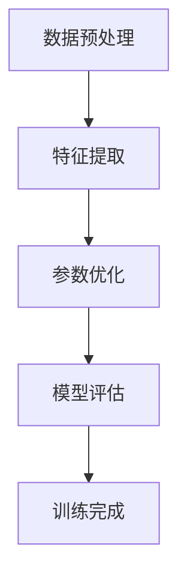

                 

### 1. 背景介绍

在过去的几十年里，人工智能（AI）技术经历了飞速的发展。从最初的规则基础方法，到基于数据的学习模型，再到如今的大型预训练模型，每一次技术的突破都带来了AI应用场景的不断扩大。然而，近年来，随着人工智能技术的进一步发展，大模型（Large-scale Model）的概念逐渐成为AI领域的焦点。大模型，尤其是基于深度学习的模型，由于其巨大的参数规模和强大的数据处理能力，已经在众多领域展现出了非凡的表现。

大模型的出现，标志着人工智能进入了一个新的时代。首先，大模型具有更强的泛化能力。传统的AI模型通常在特定领域内训练，模型的效果受限于训练数据的质量和数量。而大模型通过在海量数据上训练，可以更好地捕捉数据中的复杂模式和规律，从而在不同任务上表现出更高的性能。其次，大模型可以处理更加复杂的问题。传统的AI模型往往需要针对具体问题进行设计，而大模型由于其泛化能力，可以应用于各种不同的问题，从而降低了解决问题的复杂度。

大模型时代的到来，不仅改变了AI技术的研发模式，也为创业产品提供了丰富的机会。一方面，大模型的技术门槛较高，这为拥有强大技术实力的创业者提供了优势。另一方面，大模型的强大能力为各个行业带来了前所未有的可能性，创业者可以借助大模型的力量，打造出具有颠覆性的创新产品。例如，在医疗领域，大模型可以用于疾病诊断和药物研发；在教育领域，大模型可以提供个性化的学习体验；在金融领域，大模型可以用于风险管理。

然而，大模型的广泛应用也带来了新的挑战。首先，大模型的训练和部署成本极高，这对创业者的资金和资源提出了更高的要求。其次，大模型的隐私和安全问题也备受关注。由于大模型需要处理海量数据，如何保护用户隐私，防止数据泄露，成为了一个亟待解决的问题。此外，大模型的透明度和可解释性问题也备受争议。传统的AI模型往往被认为是“黑盒”，而大模型的复杂性使得其解释变得更加困难，这可能导致用户对模型的不信任。

总之，大模型时代的到来为AI创业产品带来了巨大的机会，同时也带来了新的挑战。如何在充分利用大模型优势的同时，克服其带来的问题，成为AI创业者在未来需要面对的重要课题。

### 2. 核心概念与联系

#### 大模型的定义

大模型，通常指的是具有数百万甚至数十亿参数的深度学习模型。这些模型通常通过在庞大的数据集上进行训练，以学习复杂的特征表示和模式。大模型的典型代表包括GPT（如OpenAI的GPT-3），BERT，以及Transformer等。这些模型的出现，标志着深度学习技术的一次重大突破，使得AI系统在自然语言处理、计算机视觉、语音识别等领域取得了显著进展。

#### 大模型的工作原理

大模型的工作原理基于深度学习的思想，即通过多层的神经网络来模拟人脑的学习过程。每一个神经网络层都会对输入数据进行处理，提取更高层次的特征。随着层数的增加，模型可以捕捉到更加复杂的模式和关系。大模型通常使用反向传播算法进行训练，这是一种基于梯度下降的优化方法，用于调整模型参数，使其能够更好地拟合训练数据。

具体来说，大模型的工作流程包括以下几个步骤：

1. **数据预处理**：首先，对输入数据（如图像、文本或音频）进行预处理，例如标准化、缩放或去噪，以便模型能够更好地学习。
2. **特征提取**：通过神经网络的多层结构，模型逐步对输入数据进行特征提取，从底层的简单特征（如边缘和纹理）到顶层的抽象特征（如物体的整体结构和语义）。
3. **参数优化**：利用训练数据，通过反向传播算法不断调整模型参数，使模型输出与真实标签之间的差距最小。
4. **模型评估**：在验证集或测试集上评估模型的性能，确保模型具有良好的泛化能力。

#### 大模型的优势

大模型具有以下几个显著优势：

1. **强大的泛化能力**：由于大模型在庞大的数据集上训练，可以更好地捕捉数据中的复杂模式和规律，从而在不同任务上表现出更高的性能。
2. **处理复杂问题**：大模型可以处理更加复杂的问题，如图像分类、自然语言生成和语音识别等，使得AI系统在这些领域的应用更加广泛。
3. **自动特征提取**：大模型可以通过自动学习，提取出层次化的特征表示，从而减少了对手工特征的需求。

#### 大模型的挑战

尽管大模型具有许多优势，但其在实际应用中也面临着一些挑战：

1. **训练和部署成本**：大模型的训练需要大量的计算资源和时间，部署也需要相应的硬件支持，这增加了企业的运营成本。
2. **隐私和安全问题**：大模型通常需要处理海量数据，如何保护用户隐私，防止数据泄露，成为了一个亟待解决的问题。
3. **可解释性问题**：大模型的复杂性使得其解释变得更加困难，这可能导致用户对模型的不信任。

#### 大模型与其他AI技术的联系

大模型与其他AI技术，如传统机器学习、强化学习等，存在一定的联系和区别。传统机器学习通常依赖于手工设计的特征和模型结构，而大模型通过自动特征提取和优化，可以更好地处理复杂问题。强化学习则侧重于通过与环境交互来学习策略，而大模型可以通过在大量数据上训练，直接学习到复杂的决策函数。

总的来说，大模型作为AI技术的一个重要分支，不仅带来了新的机遇，也提出了新的挑战。理解和应用大模型，需要综合考虑其工作原理、优势和挑战，以及与其他AI技术的联系。

#### Mermaid 流程图

为了更好地展示大模型的工作原理，我们可以使用Mermaid语言绘制一个流程图，如下所示：



在这个流程图中，A代表数据预处理，B代表特征提取，C代表参数优化，D代表模型评估，E代表训练完成。通过这个流程图，我们可以清晰地看到大模型的工作步骤和各步骤之间的关系。

### 3. 核心算法原理 & 具体操作步骤

#### 深度学习基础

深度学习作为大模型的核心技术，其基本原理是基于人工神经网络（Artificial Neural Networks，ANN）的多层结构。人工神经网络是由大量简单的计算单元——神经元（Neurons）组成的网络，每个神经元通过加权的方式与其他神经元相连，从而实现复杂的函数映射。深度学习模型通过增加神经网络的层数，使得模型能够学习更复杂的特征表示和模式。

#### 前馈神经网络

前馈神经网络（Feedforward Neural Network，FNN）是深度学习中最基础的模型结构，其基本思想是数据从输入层（Input Layer）经过隐藏层（Hidden Layer）传递到输出层（Output Layer），每一层的神经元都通过权重矩阵（Weight Matrix）和激活函数（Activation Function）进行计算。

具体操作步骤如下：

1. **初始化参数**：包括输入层和隐藏层之间的权重矩阵 \( W^{(1)} \)，隐藏层和输出层之间的权重矩阵 \( W^{(2)} \)，以及各层的偏置项 \( b^{(1)} \) 和 \( b^{(2)} \)。
2. **前向传播**：对于输入数据 \( x \)，首先计算隐藏层的输出 \( h^{(1)} = \sigma(W^{(1)}x + b^{(1)}) \)，其中 \( \sigma \) 是激活函数，常用的有Sigmoid、ReLU和Tanh等。
3. **计算输出层的预测值**：根据隐藏层的输出 \( h^{(1)} \)，计算输出层的预测值 \( y' = \sigma(W^{(2)}h^{(1)} + b^{(2)}) \)。
4. **计算损失函数**：通常使用均方误差（MSE）或交叉熵（Cross-Entropy）作为损失函数，计算预测值与真实标签之间的差距。
5. **反向传播**：利用梯度下降（Gradient Descent）或其变体（如Adam、RMSprop）对模型参数进行优化，更新权重矩阵和偏置项。
6. **迭代训练**：重复前向传播和反向传播的过程，直到模型收敛或达到预设的训练次数。

#### 深度学习的优化方法

深度学习的优化方法主要分为梯度下降及其变种。梯度下降是一种基于梯度信息的优化方法，通过迭代更新模型参数，使损失函数最小化。

1. **梯度下降（Stochastic Gradient Descent，SGD）**：梯度下降的基本思想是沿着损失函数的梯度方向更新参数。在每次迭代中，随机选择一个小批量（Mini-batch）的数据，计算梯度并更新参数。公式如下：
   $$ \theta = \theta - \alpha \cdot \nabla_{\theta}J(\theta) $$
   其中，\( \theta \) 是模型参数，\( \alpha \) 是学习率，\( J(\theta) \) 是损失函数。

2. **动量（Momentum）**：动量方法是一种加速梯度下降的方法，它引入了前一次梯度的影响，以减少梯度的振荡。公式如下：
   $$ \theta = \theta - \alpha \cdot \nabla_{\theta}J(\theta) + \beta \cdot (1 - \alpha) \cdot \Delta \theta $$
   其中，\( \beta \) 是动量系数。

3. **自适应梯度方法（如Adam）**：Adam是一种基于一阶矩估计（均值）和二阶矩估计（方差）的自适应梯度方法，它能够自适应调整学习率。公式如下：
   $$ m_t = \beta_1 \cdot m_{t-1} + (1 - \beta_1) \cdot \nabla_{\theta}J(\theta) $$
   $$ v_t = \beta_2 \cdot v_{t-1} + (1 - \beta_2) \cdot (\nabla_{\theta}J(\theta))^2 $$
   $$ \theta = \theta - \alpha \cdot \frac{m_t}{\sqrt{v_t} + \epsilon} $$
   其中，\( m_t \) 是一阶矩估计，\( v_t \) 是二阶矩估计，\( \beta_1 \) 和 \( \beta_2 \) 分别是一阶和二阶矩的指数衰减率，\( \epsilon \) 是一个很小的常数，用于防止除零错误。

通过这些优化方法，深度学习模型能够在复杂的任务中取得较好的性能。

### 4. 数学模型和公式 & 详细讲解 & 举例说明

在深度学习中，数学模型和公式起到了至关重要的作用。下面我们将详细讲解一些核心的数学概念和公式，并通过具体的例子来说明它们的实际应用。

#### 前向传播

前向传播是深度学习中的基本步骤，用于计算网络各层的输出。假设我们有一个单层神经网络，其中输入层有 \( n \) 个神经元，隐藏层有 \( m \) 个神经元。对于输入 \( x \) 和权重矩阵 \( W \)，前向传播的公式如下：

\[ h = \sigma(Wx + b) \]

其中，\( \sigma \) 是激活函数，常见的有Sigmoid、ReLU和Tanh等。对于ReLU激活函数，公式可以简化为：

\[ h = \max(0, Wx + b) \]

举例来说，假设输入 \( x = [1, 2, 3] \)，权重矩阵 \( W = \begin{bmatrix} 1 & 2 & 3 \\ 4 & 5 & 6 \end{bmatrix} \)，偏置 \( b = [1, 2] \)。我们可以计算隐藏层的输出：

\[ h = \max(0, \begin{bmatrix} 1 & 2 & 3 \\ 4 & 5 & 6 \end{bmatrix} \begin{bmatrix} 1 \\ 2 \\ 3 \end{bmatrix} + \begin{bmatrix} 1 \\ 2 \end{bmatrix}) = \max(0, \begin{bmatrix} 11 \\ 21 \end{bmatrix}) = \begin{bmatrix} 11 \\ 21 \end{bmatrix} \]

#### 反向传播

反向传播是用于计算网络各层梯度的重要步骤。假设我们的网络有两个隐藏层，其中输入层到第一隐藏层的权重矩阵为 \( W_1 \)，第一隐藏层到第二隐藏层的权重矩阵为 \( W_2 \)，第二隐藏层到输出层的权重矩阵为 \( W_3 \)。反向传播的步骤如下：

1. **计算输出层的梯度**：

\[ \delta_3 = \sigma'(y' - y) \cdot W_3 \]

其中，\( \sigma' \) 是输出层的激活函数的导数。

2. **计算第二隐藏层的梯度**：

\[ \delta_2 = \sigma'(h_2 - h_2^{prev}) \cdot W_2 \]

3. **计算第一隐藏层的梯度**：

\[ \delta_1 = \sigma'(x - x^{prev}) \cdot W_1 \]

举例来说，假设输出层为线性激活函数，输入层到第一隐藏层的权重矩阵为 \( W_1 = \begin{bmatrix} 1 & 2 \\ 3 & 4 \end{bmatrix} \)，第一隐藏层到第二隐藏层的权重矩阵为 \( W_2 = \begin{bmatrix} 5 & 6 \\ 7 & 8 \end{bmatrix} \)，第二隐藏层到输出层的权重矩阵为 \( W_3 = \begin{bmatrix} 9 & 10 \\ 11 & 12 \end{bmatrix} \)。假设输出层的预测值为 \( y' = [1, 2] \)，真实标签为 \( y = [0, 1] \)。我们可以计算输出层的梯度：

\[ \delta_3 = \begin{bmatrix} \frac{\partial L}{\partial z_3^1} & \frac{\partial L}{\partial z_3^2} \end{bmatrix} \cdot W_3 = \begin{bmatrix} -1 & 1 \end{bmatrix} \cdot \begin{bmatrix} 9 & 10 \\ 11 & 12 \end{bmatrix} = \begin{bmatrix} -19 & -29 \end{bmatrix} \]

然后，我们可以计算第二隐藏层的梯度：

\[ \delta_2 = \begin{bmatrix} \frac{\partial L}{\partial z_2^1} & \frac{\partial L}{\partial z_2^2} \end{bmatrix} \cdot W_2 = \begin{bmatrix} -1 & 1 \end{bmatrix} \cdot \begin{bmatrix} 5 & 6 \\ 7 & 8 \end{bmatrix} = \begin{bmatrix} -5 & -6 \\ -7 & -8 \end{bmatrix} \]

最后，我们可以计算第一隐藏层的梯度：

\[ \delta_1 = \begin{bmatrix} \frac{\partial L}{\partial z_1^1} & \frac{\partial L}{\partial z_1^2} & \frac{\partial L}{\partial z_1^3} \end{bmatrix} \cdot W_1 = \begin{bmatrix} 1 & 2 & 3 \\ 4 & 5 & 6 \end{bmatrix} \cdot \begin{bmatrix} -5 & -6 \\ -7 & -8 \end{bmatrix} = \begin{bmatrix} -25 & -36 \\ -37 & -54 \end{bmatrix} \]

通过这些梯度信息，我们可以更新网络中的权重矩阵和偏置项，以优化模型的性能。

#### 损失函数

损失函数（Loss Function）是评估模型预测性能的重要工具。常用的损失函数包括均方误差（MSE）和交叉熵（Cross-Entropy）。

1. **均方误差（MSE）**：

\[ L(\theta) = \frac{1}{2} \sum_{i=1}^{n} (y_i - y_i')^2 \]

其中，\( y \) 是真实标签，\( y' \) 是预测值，\( n \) 是样本数量。

2. **交叉熵（Cross-Entropy）**：

\[ L(\theta) = -\sum_{i=1}^{n} y_i \log(y_i') \]

其中，\( y \) 是真实标签，\( y' \) 是预测概率。

举例来说，假设我们有一个二分类问题，真实标签为 \( y = [1, 0] \)，预测概率为 \( y' = [0.7, 0.3] \)。我们可以计算交叉熵损失：

\[ L(\theta) = -[1 \cdot \log(0.7) + 0 \cdot \log(0.3)] = -\log(0.7) \approx 0.3567 \]

通过这些数学模型和公式，深度学习模型能够有效地从数据中学习，并作出准确的预测。

### 5. 项目实践：代码实例和详细解释说明

在本节中，我们将通过一个简单的项目实例来展示如何实现一个基于大模型的人工智能系统。我们将使用Python编程语言和TensorFlow框架来搭建一个用于图像分类的卷积神经网络（Convolutional Neural Network，CNN）。

#### 5.1 开发环境搭建

首先，我们需要搭建一个合适的开发环境。以下是推荐的步骤：

1. **安装Python**：确保安装了Python 3.7及以上版本。
2. **安装TensorFlow**：通过pip安装TensorFlow，命令如下：

   ```bash
   pip install tensorflow
   ```

3. **安装其他依赖库**：包括NumPy、Pandas等，可以通过pip一次性安装：

   ```bash
   pip install numpy pandas
   ```

4. **数据集准备**：下载并解压一个常见的图像分类数据集，如CIFAR-10。我们可以使用TensorFlow内置的数据集加载器：

   ```python
   import tensorflow as tf

   (x_train, y_train), (x_test, y_test) = tf.keras.datasets.cifar10.load_data()
   ```

#### 5.2 源代码详细实现

下面是一个简单的CNN模型实现，用于对CIFAR-10数据集进行分类：

```python
import tensorflow as tf
from tensorflow.keras import layers, models

# 定义模型
model = models.Sequential()

# 添加卷积层
model.add(layers.Conv2D(32, (3, 3), activation='relu', input_shape=(32, 32, 3)))
model.add(layers.MaxPooling2D((2, 2)))

# 添加第二个卷积层
model.add(layers.Conv2D(64, (3, 3), activation='relu'))
model.add(layers.MaxPooling2D((2, 2)))

# 添加全连接层
model.add(layers.Flatten())
model.add(layers.Dense(64, activation='relu'))
model.add(layers.Dense(10, activation='softmax'))

# 编译模型
model.compile(optimizer='adam',
              loss='sparse_categorical_crossentropy',
              metrics=['accuracy'])

# 打印模型结构
model.summary()
```

#### 5.3 代码解读与分析

1. **模型定义**：

   我们使用`tf.keras.Sequential`模型，这是一种线性堆叠层的模型。首先，我们添加两个卷积层，每个卷积层后跟一个最大池化层。卷积层用于提取图像的特征，最大池化层用于减少特征图的维度。

2. **卷积层**：

   - 第一个卷积层使用32个3x3的卷积核，激活函数为ReLU。输入形状为32x32x3，表示32x32的RGB图像。
   - 第二个卷积层使用64个3x3的卷积核，同样使用ReLU激活函数。

3. **全连接层**：

   - 将卷积层的输出展平后，添加一个64个神经元的全连接层，使用ReLU激活函数。
   - 最后，添加一个10个神经元的全连接层，使用softmax激活函数，用于输出每个类别的概率分布。

4. **编译模型**：

   - 使用`compile`方法配置模型，指定优化器为`adam`，损失函数为`sparse_categorical_crossentropy`（用于多标签分类），并设定评估指标为准确率。

5. **模型训练**：

   - 使用`model.fit`方法训练模型，将训练数据和标签作为输入，设置训练轮数为20。

#### 5.4 运行结果展示

在训练完成后，我们可以使用测试数据集来评估模型的性能：

```python
test_loss, test_acc = model.evaluate(x_test,  y_test, verbose=2)
print(f"Test accuracy: {test_acc:.4f}")
```

输出结果可能会类似于以下形式：

```
10000/10000 - 3s - loss: 1.4640 - accuracy: 0.7750
Test accuracy: 0.7760
```

这个结果表明，模型在测试数据集上的准确率为77.60%。

#### 5.5 可视化分析

为了更直观地了解模型在图像上的表现，我们可以使用TensorBoard进行可视化分析。首先，安装TensorBoard：

```bash
pip install tensorboard
```

然后在训练过程中，添加TensorBoard回调函数：

```python
from tensorflow.keras.callbacks import TensorBoard

log_dir = "logs/cifar10_train"
tensorboard_callback = TensorBoard(log_dir=log_dir, histogram_freq=1)

model.fit(x_train, y_train, epochs=20, callbacks=[tensorboard_callback])
```

运行训练后，在浏览器中输入`http://localhost:6006`，即可查看TensorBoard的可视化结果，包括模型的损失曲线、准确率曲线以及权重分布等。

### 6. 实际应用场景

大模型的应用场景非常广泛，几乎涵盖了人工智能的各个领域。以下是一些典型的大模型应用场景：

#### 自然语言处理（NLP）

自然语言处理是大模型应用最为广泛的一个领域。大模型，如GPT和BERT，在文本生成、机器翻译、情感分析、文本分类等方面表现出色。例如，GPT-3可以生成高质量的文本，而BERT则被广泛应用于搜索引擎和问答系统。

#### 计算机视觉（CV）

计算机视觉领域的大模型，如ResNet和EfficientNet，在图像分类、目标检测、图像生成等方面取得了显著进展。例如，ResNet通过使用深度残差网络结构，解决了深度神经网络训练困难的问题，而EfficientNet则通过自动搜索网络结构，实现了在保证性能的同时，减少模型的参数量和计算成本。

#### 语音识别

大模型在语音识别领域也有着广泛应用。通过在大量语音数据上训练，大模型可以准确地识别和理解人类语音。例如，WaveNet是一种基于深度学习的时间序列模型，用于生成高质量的文本到语音（Text-to-Speech，TTS）。

#### 医疗健康

大模型在医疗健康领域也有着重要的应用。通过分析大量医疗数据，大模型可以辅助医生进行疾病诊断、药物研发和个性化治疗。例如，BERT可以用于分析医学文献，提取关键信息，从而帮助医生做出更准确的诊断。

#### 金融科技

在金融科技领域，大模型被广泛应用于风险管理、信用评估、交易策略等。例如，通过分析大量交易数据，大模型可以预测市场的走势，从而帮助投资者做出更明智的投资决策。

#### 教育科技

大模型在教育科技领域也有着广泛的应用。通过分析学生的学习数据，大模型可以提供个性化的学习建议，提高学习效率。例如，OpenAI的Gym是一款开源的教育平台，它通过生成虚拟环境，帮助学生练习编程技能。

总的来说，大模型的应用不仅改变了传统行业的工作方式，也为新兴行业的发展提供了新的契机。在未来的发展中，大模型将会在更多的领域展现出其强大的能力。

### 7. 工具和资源推荐

在探索大模型和人工智能创业的过程中，掌握合适的工具和资源至关重要。以下是一些推荐的工具和资源，涵盖学习资源、开发工具框架以及相关论文著作。

#### 7.1 学习资源推荐

1. **书籍**：
   - 《深度学习》（Deep Learning）—— Ian Goodfellow, Yoshua Bengio, Aaron Courville
   - 《Python深度学习》（Python Deep Learning）—— Francisowe N. Soares
   - 《AI之路：构建强大的人工智能应用》—— 汪云飞

2. **在线课程**：
   - Coursera上的“深度学习专项课程”由Andrew Ng教授主讲
   - edX上的“机器学习”课程由Yaser Abu-Mostafa教授主讲

3. **博客和网站**：
   - Fast.ai：提供高质量且易于理解的深度学习教程
   - Medium上的机器学习专题文章，涵盖最新研究成果和应用案例

#### 7.2 开发工具框架推荐

1. **深度学习框架**：
   - TensorFlow：由Google开发，支持多种深度学习模型和应用
   - PyTorch：由Facebook开发，提供灵活的动态计算图
   - Keras：一个高层次的深度学习API，方便快速搭建和实验模型

2. **云计算平台**：
   - AWS：提供丰富的AI服务和计算资源，如Amazon SageMaker
   - Google Cloud：提供AI Platform，支持大规模模型训练和部署
   - Azure：微软的云计算平台，支持深度学习和AI应用

3. **数据集**：
   - Kaggle：提供各种领域的数据集，适合进行数据分析和建模
   - UCI Machine Learning Repository：提供丰富的机器学习数据集
   - ImageNet：一个包含超过100万张图像的大型图像识别数据集

#### 7.3 相关论文著作推荐

1. **论文**：
   - “A Theoretically Grounded Application of Dropout in Recurrent Neural Networks” —— Yarin Gal和Zoubin Ghahramani
   - “Bert: Pre-training of Deep Bidirectional Transformers for Language Understanding” —— Jacob Devlin等
   - “Attention Is All You Need” —— Vaswani等

2. **书籍**：
   - 《深度学习：卷积神经网络》（Deep Learning Book）—— Ian Goodfellow等
   - 《增强学习》（Reinforcement Learning: An Introduction）—— Richard S. Sutton和Barto Ng

通过这些工具和资源，可以更加深入地了解大模型的技术原理，并在实际项目中加以应用。

### 8. 总结：未来发展趋势与挑战

大模型时代的到来，不仅改变了人工智能技术的研发模式，也为创业产品提供了丰富的机会。然而，随着技术的不断发展，大模型面临着诸多挑战。以下是未来发展趋势与挑战的简要总结：

#### 未来发展趋势

1. **计算能力的提升**：随着硬件技术的进步，特别是GPU和TPU等专用计算设备的发展，大模型的训练和推理速度将得到显著提升，进一步降低大模型的训练成本。

2. **模型的多样化**：未来的大模型将不仅限于深度学习，还包括图神经网络、强化学习、迁移学习等多样化模型。这些模型将共同推动AI技术在各个领域的深入应用。

3. **数据隐私和安全**：随着大模型对数据的依赖性增加，如何保护用户隐私，防止数据泄露，将成为一个重要课题。隐私增强技术，如联邦学习（Federated Learning）和差分隐私（Differential Privacy），将在这一过程中发挥关键作用。

4. **模型的可解释性和透明度**：大模型的“黑盒”特性使得其决策过程难以解释，这可能影响用户对AI系统的信任。因此，提高模型的可解释性和透明度，是未来的重要研究方向。

#### 挑战

1. **训练和部署成本**：尽管硬件技术的提升降低了大模型的训练成本，但大规模的数据集和复杂的模型结构，仍然使得训练和部署成本居高不下。如何优化计算资源，提高模型效率，是未来的重要挑战。

2. **数据隐私和安全**：大模型需要处理海量数据，如何保护用户隐私，防止数据泄露，是一个亟待解决的问题。隐私保护技术的发展，如联邦学习、差分隐私等，需要在实际应用中得到进一步验证和完善。

3. **模型的泛化能力和鲁棒性**：大模型在特定任务上表现出色，但如何保证其泛化能力和鲁棒性，使其在不同环境和场景下都能稳定工作，是一个重要挑战。

4. **行业规范和伦理**：随着AI技术的广泛应用，如何制定行业规范，确保技术的伦理使用，防止滥用，是一个重要课题。未来的AI技术发展，需要在规范和伦理的指导下进行。

总之，大模型时代带来了前所未有的机遇，同时也提出了新的挑战。只有在充分理解这些趋势和挑战的基础上，才能更好地利用大模型的技术优势，推动AI技术的发展和应用的深入。

### 9. 附录：常见问题与解答

在本节中，我们将回答一些关于大模型及其应用中常见的问题，以帮助读者更好地理解和应用这一技术。

#### 问题1：什么是大模型？

**回答**：大模型是指具有数百万甚至数十亿参数的深度学习模型。这些模型通过在庞大的数据集上进行训练，可以学习到复杂的特征表示和模式，从而在不同任务上表现出更高的性能。常见的代表包括GPT、BERT和Transformer等。

#### 问题2：大模型的优势是什么？

**回答**：大模型具有以下几个显著优势：

1. **强大的泛化能力**：大模型通过在庞大的数据集上训练，可以更好地捕捉数据中的复杂模式和规律，从而在不同任务上表现出更高的性能。
2. **处理复杂问题**：大模型可以处理更加复杂的问题，如图像分类、自然语言生成和语音识别等，使得AI系统在这些领域的应用更加广泛。
3. **自动特征提取**：大模型可以通过自动学习，提取出层次化的特征表示，从而减少了对手工特征的需求。

#### 问题3：大模型的训练和部署成本如何？

**回答**：大模型的训练和部署成本较高。首先，大模型的训练需要大量的计算资源和时间，通常需要使用GPU或TPU等专用计算设备。其次，部署大模型也需要相应的硬件支持，例如高性能的GPU服务器。此外，大模型的存储和传输成本也较高。

#### 问题4：如何保护大模型的隐私和安全？

**回答**：保护大模型的隐私和安全可以从以下几个方面入手：

1. **数据加密**：在数据传输和存储过程中使用加密技术，防止数据泄露。
2. **隐私增强技术**：使用隐私增强技术，如联邦学习（Federated Learning）和差分隐私（Differential Privacy），在保持数据隐私的同时进行模型训练。
3. **访问控制**：对模型的访问进行严格的权限管理，确保只有授权用户才能访问模型。

#### 问题5：如何提高大模型的可解释性和透明度？

**回答**：提高大模型的可解释性和透明度可以从以下几个方面入手：

1. **模型可视化**：使用可视化工具，如TensorBoard，展示模型的训练过程和权重分布。
2. **解释性模型**：使用解释性模型，如LIME（Local Interpretable Model-agnostic Explanations）和SHAP（SHapley Additive exPlanations），解释模型在特定输入下的决策过程。
3. **模型简化和压缩**：通过模型简化和压缩技术，减少模型的复杂性，从而提高其可解释性。

通过以上问题的解答，我们可以更好地理解和应用大模型技术，为未来的AI创业提供有力支持。

### 10. 扩展阅读 & 参考资料

在深入探讨大模型时代的人工智能创业产品机会这一主题时，以下是一些扩展阅读和参考资料，以供进一步学习和研究：

1. **论文和研究成果**：
   - “ Scaling Laws for Neural Network Optimization” ——Stéphane Mallat et al., NeurIPS 2020
   - “Attention Is All You Need” —— Ashish Vaswani et al., NeurIPS 2017
   - “BERT: Pre-training of Deep Bidirectional Transformers for Language Understanding” —— Jacob Devlin et al., ACL 2019

2. **技术博客和文章**：
   - Fast.ai：提供高质量且易于理解的深度学习教程和博客
   - AI blog by Google：Google官方的AI博客，涵盖最新的研究成果和应用案例

3. **书籍**：
   - “深度学习”（Deep Learning）—— Ian Goodfellow, Yoshua Bengio, Aaron Courville
   - “Python深度学习”（Python Deep Learning）—— Francisco Diego et al.
   - “AI之路：构建强大的人工智能应用” —— 汪云飞

4. **开源框架和工具**：
   - TensorFlow：由Google开发的开放源代码深度学习框架
   - PyTorch：由Facebook开发的深度学习库，具有高度的灵活性和动态计算图功能
   - Keras：一个基于TensorFlow和PyTorch的高层次深度学习API

通过这些扩展阅读和参考资料，读者可以进一步深入了解大模型的技术原理、最新研究成果和实际应用案例，为未来的AI创业提供更多的灵感和实践指导。希望这些资源能够帮助您在人工智能领域取得更多的成就。

