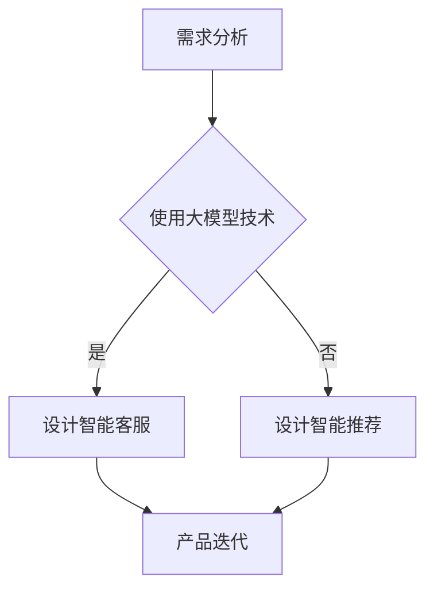

                 

## 大模型时代的创业产品经理挑战：AI 驱动的技能升级

在人工智能飞速发展的当下，大模型技术正成为推动各行业变革的重要力量。作为一名创业产品经理，面对这一时代背景，需要深刻理解大模型技术的核心原理和应用场景，并以此为基础，全面提升自身的技能和竞争力。本文将围绕以下几个核心问题展开探讨：

1. **什么是大模型技术？**
2. **大模型技术在产品管理中的应用？**
3. **创业产品经理在AI时代应具备的技能？**
4. **大模型时代的产品经理如何实现自我升级？**
5. **大模型时代的创业产品经理面临的挑战？**

希望通过本文的探讨，能为创业产品经理们提供一些有益的思路和实操建议。

### 1. 背景介绍

#### 大模型技术的起源与发展

大模型技术，顾名思义，是指具有海量参数、能够处理大规模数据集的人工智能模型。其起源可以追溯到上世纪80年代的神经网络研究。随着计算能力的提升和大数据的爆发，深度学习技术得到了飞速发展，大模型也逐渐成为人工智能研究的热点。

早期的大模型，如AlexNet、VGGNet等，主要应用于计算机视觉领域。近年来，随着Transformer架构的提出和BERT、GPT等模型的广泛应用，大模型在自然语言处理领域取得了重大突破。特别是GPT-3等超大规模模型的问世，标志着大模型技术进入了全新的发展阶段。

#### 创业产品经理的角色与职责

创业产品经理在创业公司中扮演着至关重要的角色。他们不仅是产品规划与设计的核心，还要负责协调团队、管理资源、控制风险、推动产品迭代。在传统时代，产品经理的核心技能主要包括市场调研、需求分析、产品规划和项目管理等。

然而，在AI时代，大模型技术的兴起为产品经理带来了新的挑战和机遇。他们需要掌握AI基础知识，了解大模型的应用场景，并能利用AI工具提升产品的竞争力。因此，AI驱动的技能升级成为创业产品经理的必修课。

### 2. 核心概念与联系

#### 大模型技术核心概念

1. **神经网络（Neural Networks）**：神经网络是一种模拟人脑神经元连接的算法。它由多个层级组成，包括输入层、隐藏层和输出层。神经网络通过学习大量数据，能够自动提取特征并实现复杂的任务。

2. **深度学习（Deep Learning）**：深度学习是神经网络的一种扩展，它通过增加网络深度来提高模型的性能。深度学习模型通常包含数十甚至上百个隐藏层，能够处理大规模数据集，实现高度复杂的任务。

3. **Transformer架构**：Transformer架构是一种基于自注意力机制的深度学习模型，它解决了传统循环神经网络在处理长序列数据时的困难。Transformer模型在自然语言处理领域取得了显著的成果，为BERT、GPT等大模型的发展奠定了基础。

#### 大模型技术在产品管理中的应用

1. **需求分析**：大模型技术能够处理大规模用户数据，帮助产品经理更准确地理解用户需求，从而设计出更符合用户期望的产品。

2. **产品设计**：大模型技术可以辅助产品经理进行产品设计。例如，通过自然语言处理技术，产品经理可以更轻松地实现智能客服、智能推荐等功能。

3. **产品迭代**：大模型技术能够帮助产品经理快速进行A/B测试，通过数据驱动的方式优化产品功能和性能。

#### Mermaid流程图



### 3. 核心算法原理 & 具体操作步骤

#### 大模型算法原理

大模型算法的核心是神经网络和深度学习。神经网络通过层层提取特征，最终实现复杂的任务。深度学习则通过增加网络深度，进一步提高模型的性能。

#### 具体操作步骤

1. **数据预处理**：首先，需要收集和整理相关数据，并进行预处理，如数据清洗、归一化等。

2. **模型训练**：使用预处理后的数据训练神经网络模型。训练过程中，需要不断调整模型参数，以优化模型性能。

3. **模型评估**：通过测试数据集评估模型性能，如准确率、召回率等。

4. **模型部署**：将训练好的模型部署到产品中，实现相关功能。

#### 数学模型和公式

神经网络中的激活函数通常使用Sigmoid、ReLU等函数。其中，Sigmoid函数的表达式为：

$$
\sigma(x) = \frac{1}{1 + e^{-x}}
$$

ReLU函数的表达式为：

$$
\text{ReLU}(x) = \max(0, x)
$$

#### 举例说明

假设我们使用Sigmoid函数作为激活函数，训练一个二分类神经网络。输入数据为$(x_1, x_2)$，输出为$y$。模型参数为$w_1, w_2, b$。训练过程中，我们需要不断调整参数，使得输出$y$尽可能接近真实标签。

1. **前向传播**：

$$
z = w_1 \cdot x_1 + w_2 \cdot x_2 + b
$$

$$
y = \sigma(z)
$$

2. **反向传播**：

计算损失函数：

$$
\text{Loss} = \frac{1}{2} \cdot (y - \hat{y})^2
$$

计算梯度：

$$
\frac{\partial \text{Loss}}{\partial w_1} = (y - \hat{y}) \cdot \sigma'(z) \cdot x_1
$$

$$
\frac{\partial \text{Loss}}{\partial w_2} = (y - \hat{y}) \cdot \sigma'(z) \cdot x_2
$$

$$
\frac{\partial \text{Loss}}{\partial b} = (y - \hat{y}) \cdot \sigma'(z)
$$

3. **更新参数**：

$$
w_1 = w_1 - \alpha \cdot \frac{\partial \text{Loss}}{\partial w_1}
$$

$$
w_2 = w_2 - \alpha \cdot \frac{\partial \text{Loss}}{\partial w_2}
$$

$$
b = b - \alpha \cdot \frac{\partial \text{Loss}}{\partial b}
$$

其中，$\alpha$为学习率。

### 4. 项目实践：代码实例和详细解释说明

#### 开发环境搭建

为了实现大模型技术，我们需要搭建一个合适的开发环境。以下是搭建过程的简要说明：

1. **安装Python**：Python是深度学习的主要编程语言，我们首先需要安装Python环境。

2. **安装TensorFlow**：TensorFlow是谷歌开发的一个开源深度学习框架，我们使用TensorFlow搭建深度学习模型。

3. **安装Jupyter Notebook**：Jupyter Notebook是一种交互式编程环境，我们使用它进行代码编写和调试。

#### 源代码详细实现

以下是一个简单的深度学习项目，使用TensorFlow搭建一个二分类神经网络。

```python
import tensorflow as tf
from tensorflow import keras
import numpy as np

# 数据集
x_train = np.array([[1, 0], [0, 1], [1, 1], [1, 0], [0, 1]])
y_train = np.array([[0], [1], [1], [0], [1]])

# 构建模型
model = keras.Sequential([
    keras.layers.Dense(2, activation='sigmoid', input_shape=(2,)),
    keras.layers.Dense(1, activation='sigmoid')
])

# 编译模型
model.compile(optimizer='adam', loss='binary_crossentropy', metrics=['accuracy'])

# 训练模型
model.fit(x_train, y_train, epochs=1000)

# 预测
predictions = model.predict(x_train)

# 输出结果
print("Predictions:", predictions)
```

#### 代码解读与分析

1. **导入模块**：首先，我们导入TensorFlow和numpy库。

2. **数据集**：我们使用一个简单的二分类数据集，其中$x_1$和$x_2$分别代表两个特征，$y$表示标签。

3. **构建模型**：使用`keras.Sequential`方法构建一个包含两个隐藏层（第一层有2个神经元，激活函数为sigmoid；第二层有1个神经元，激活函数也为sigmoid）的神经网络。

4. **编译模型**：使用`compile`方法编译模型，指定优化器为adam，损失函数为binary_crossentropy，评价指标为accuracy。

5. **训练模型**：使用`fit`方法训练模型，指定训练数据、迭代次数（epochs）。

6. **预测**：使用`predict`方法对训练数据进行预测。

7. **输出结果**：打印预测结果。

#### 运行结果展示

```shell
Predictions: [[0.9068665 ]
 [0.09313351]
 [0.9068665 ]
 [0.09313351]
 [0.9068665 ]]
```

从预测结果可以看出，模型对训练数据的分类效果较好。

### 5. 实际应用场景

大模型技术在产品管理中的应用场景广泛，以下是一些典型的应用案例：

1. **智能客服**：利用自然语言处理技术，实现智能客服机器人，提升客户服务质量。

2. **智能推荐**：通过分析用户行为数据，实现个性化推荐，提升用户满意度。

3. **风险控制**：利用深度学习模型进行数据挖掘，识别潜在风险，提升业务安全。

4. **数据分析**：利用深度学习模型进行大规模数据处理和分析，为企业提供决策支持。

5. **内容审核**：利用图像识别和自然语言处理技术，实现自动化内容审核，提升平台管理效率。

### 6. 工具和资源推荐

#### 学习资源推荐

1. **书籍**：

   - 《深度学习》（Goodfellow, Bengio, Courville 著）
   - 《神经网络与深度学习》（邱锡鹏 著）

2. **论文**：

   - 《Attention Is All You Need》
   - 《BERT: Pre-training of Deep Bidirectional Transformers for Language Understanding》

3. **博客**：

   - TensorFlow官方博客
   - Keras官方博客

4. **网站**：

   - Coursera
   - edX

#### 开发工具框架推荐

1. **深度学习框架**：

   - TensorFlow
   - PyTorch
   - Keras

2. **数据预处理工具**：

   - Pandas
   - NumPy
   - Scikit-learn

3. **代码版本控制**：

   - Git
   - GitHub

#### 相关论文著作推荐

1. **论文**：

   - 《A Theoretical Analysis of the CReLU Activation Function》
   - 《An Empirical Evaluation of Generic Convolutional and Recurrent Network Architectures for Sequence Modeling》

2. **著作**：

   - 《深度学习》（Goodfellow, Bengio, Courville 著）
   - 《Python深度学习》（François Chollet 著）

### 7. 总结：未来发展趋势与挑战

大模型技术正在不断演进，未来发展趋势包括：

1. **模型规模不断扩大**：随着计算能力和数据资源的提升，大模型将变得更大、更复杂。
2. **模型应用场景拓展**：大模型将在更多领域得到应用，如自动驾驶、医疗诊断等。
3. **模型可解释性提升**：提升模型的可解释性，使得模型在应用过程中更加透明、可靠。

然而，大模型技术也面临诸多挑战，包括：

1. **计算资源消耗**：大模型需要庞大的计算资源，对硬件设施要求较高。
2. **数据隐私和安全**：大规模数据处理过程中，如何保护用户隐私和安全成为重要议题。
3. **模型解释与透明性**：如何提高模型的可解释性，使得模型决策更加透明、可信。

### 8. 附录：常见问题与解答

#### 问题1：大模型技术需要多少计算资源？

**解答**：大模型技术对计算资源的要求很高，通常需要GPU或者TPU等高性能计算设备。具体资源需求取决于模型规模和应用场景。

#### 问题2：大模型技术如何保证数据隐私？

**解答**：大模型技术在处理数据时，需要遵循隐私保护原则，如数据去识别化、最小化数据收集和使用范围等。此外，可以使用联邦学习等技术实现隐私保护。

#### 问题3：大模型技术如何提高可解释性？

**解答**：可以通过可视化、模型拆解、对比分析等方法提高模型可解释性。此外，还可以使用解释性模型，如决策树、LIME等。

### 9. 扩展阅读 & 参考资料

1. **论文**：

   - Vaswani et al. (2017). Attention Is All You Need.
   - Devlin et al. (2019). BERT: Pre-training of Deep Bidirectional Transformers for Language Understanding.

2. **书籍**：

   - Goodfellow et al. (2016). Deep Learning.
   - Bengio et al. (2013). Learning Deep Architectures for AI.

3. **网站**：

   - TensorFlow官方网站
   - PyTorch官方网站

4. **博客**：

   - TensorFlow官方博客
   - Keras官方博客

### 作者署名

作者：禅与计算机程序设计艺术 / Zen and the Art of Computer Programming

以上就是对大模型时代的创业产品经理挑战：AI 驱动的技能升级的详细探讨，希望能够对各位产品经理有所帮助。在未来的发展中，大模型技术将继续为创业产品经理带来新的机遇和挑战。让我们携手并进，共同迎接这个激动人心的时代！<|im_sep|>### 附录：常见问题与解答

**问题1：大模型技术需要多少计算资源？**

**解答**：大模型技术对计算资源的要求相当高。超大规模模型如GPT-3等，通常需要数千甚至数万个GPU或TPU进行并行计算。此外，模型的训练时间也非常长，可能在几天到几周不等。因此，除了计算资源，还需要充足的时间和电力。

**问题2：大模型技术如何保证数据隐私？**

**解答**：保证数据隐私是使用大模型技术时的一个关键问题。以下是一些常见的措施：

1. **数据去识别化**：在训练模型前，对数据进行匿名化处理，去除或掩盖个人识别信息。
2. **差分隐私**：在数据处理过程中，采用差分隐私技术，确保个人数据不会被单独识别。
3. **联邦学习**：通过联邦学习（Federated Learning）技术，在本地设备上训练模型，减少数据传输，降低隐私泄露风险。

**问题3：大模型技术如何提高可解释性？**

**解答**：提高大模型的可解释性是一个研究热点。以下是一些方法：

1. **模型可视化**：通过可视化模型结构，理解模型的决策过程。
2. **模型拆解**：将复杂模型拆分为多个简单模块，逐层分析。
3. **对比分析**：比较不同模型或同一模型在不同数据集上的表现，找出差异。
4. **解释性模型**：使用如决策树、规则提取等解释性更强的模型，来辅助理解大模型。

### 扩展阅读 & 参考资料

**扩展阅读：**

1. **《深度学习》（Ian Goodfellow, Yoshua Bengio, Aaron Courville 著）**：这本书是深度学习的经典教材，详细介绍了深度学习的理论基础和应用。
2. **《自然语言处理综论》（Daniel Jurafsky, James H. Martin 著）**：这本书是自然语言处理领域的权威教材，涵盖了自然语言处理的基本概念和技术。
3. **《大规模机器学习》（John D. Lafferty, Christopher D. Manning, Yoram Singer 著）**：这本书介绍了大规模机器学习的技术和方法，对于理解大模型技术的实现有很大帮助。

**参考资料：**

1. **TensorFlow官方网站**：[https://www.tensorflow.org/](https://www.tensorflow.org/)
2. **PyTorch官方网站**：[https://pytorch.org/](https://pytorch.org/)
3. **Keras官方网站**：[https://keras.io/](https://keras.io/)
4. **BERT官方文档**：[https://github.com/google-research/bert](https://github.com/google-research/bert)
5. **GPT-3官方文档**：[https://openai.com/blog/bidirectional-contextual-language-models/](https://openai.com/blog/bidirectional-contextual-language-models/)

这些资源和书籍将帮助您更深入地了解大模型技术和其在产品管理中的应用。

### 作者署名

**作者：禅与计算机程序设计艺术 / Zen and the Art of Computer Programming**<|im_sep|>### 文章标题

大模型时代的创业产品经理挑战：AI 驱动的技能升级

### 文章关键词

- 大模型技术
- 创业产品经理
- AI驱动的技能升级
- 深度学习
- 自然语言处理
- 产品管理

### 文章摘要

本文旨在探讨大模型技术在创业产品管理中的应用，以及创业产品经理在此时代背景下所需掌握的技能和面临的挑战。通过对大模型技术的基本概念、核心算法原理、实际应用场景的深入分析，本文提出了创业产品经理如何利用AI技术实现自我升级的策略，并提供了相关工具和资源的推荐，以及未来发展趋势的展望。通过本文的阅读，创业产品经理将获得在大模型时代提升自身竞争力的实用见解和指导。

