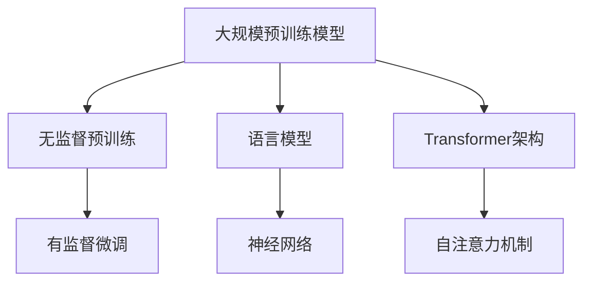

                 

### 1. 背景介绍

随着计算机技术和人工智能领域的飞速发展，大规模预训练模型（Large-scale Pre-trained Models），通常被称为“大模型”，正成为现代计算技术的一个重要分支。这些模型以其强大的数据处理能力和自我学习优化能力，在众多领域展现出卓越的应用潜力。本文旨在探讨大模型的市场需求与应用，分析其在当前科技环境下的重要性以及未来的发展趋势。

大模型的发展历程可以追溯到20世纪80年代的神经网络研究，当时研究人员开始探索如何利用神经网络进行模式识别和预测。随着计算能力的提升和数据量的增加，大模型的规模和复杂性逐渐增大，从最初的几百万参数增长到数十亿、甚至数万亿参数。近年来，以GPT、BERT、Transformer为代表的大规模预训练模型在自然语言处理、计算机视觉、语音识别等多个领域取得了显著的突破，引发了人工智能领域的又一波革命。

大模型的市场需求主要体现在以下几个方面：

1. **数据处理能力：** 在大数据时代，海量的数据需要有效的处理和分析。大模型能够通过自我学习自动提取数据中的关键信息，从而帮助企业和研究人员更高效地进行数据分析和决策。

2. **自学习能力：** 大模型具有极强的自学习能力，能够通过不断的学习和优化，提高其准确性和泛化能力。这对于需要持续改进和优化的应用场景，如智能客服、金融风控等，具有重要意义。

3. **创新潜力：** 大模型的广泛应用推动了人工智能技术的创新和发展，为各行业提供了新的解决方案和商业机会。例如，医疗领域的疾病预测、自动驾驶技术的安全控制等。

4. **经济效益：** 大模型的引入能够显著提高生产效率和降低成本。在金融、电商等高度依赖数据决策的领域，大模型的应用有助于提高市场竞争力，实现商业价值的最大化。

### 2. 核心概念与联系

为了更好地理解大模型的技术原理和应用，我们需要首先明确几个核心概念：

#### 2.1 大规模预训练模型

大规模预训练模型是指通过在大量数据上进行预训练，使模型具备一定的通用知识，然后在具体任务上进行微调，从而提高模型的性能。预训练过程通常包括两个阶段：第一阶段是大量文本数据上的无监督预训练，模型通过学习语言统计特性，如词向量、句子结构等；第二阶段是特定任务上的有监督微调，模型根据标注数据进行精细调整，使其适应特定任务的需求。

#### 2.2 语言模型与神经网络

语言模型（Language Model）是自然语言处理（Natural Language Processing, NLP）的核心组件，其主要任务是预测下一个单词或词组。神经网络（Neural Network）则是实现语言模型的一种技术，通过多层神经元的非线性组合，实现对输入数据的映射和分类。

#### 2.3 Transformer架构

Transformer架构是近年来在NLP领域取得重大突破的一种神经网络架构，其核心思想是将序列数据转换为向量表示，并通过自注意力机制（Self-Attention Mechanism）对输入数据进行权重分配，从而实现对序列数据的全局信息整合。

为了更直观地展示大模型的核心概念和架构，我们使用Mermaid流程图进行说明：



在上面的Mermaid流程图中，A表示大规模预训练模型，B和C分别表示预训练和微调阶段，D表示语言模型，E表示神经网络，F表示Transformer架构，G表示自注意力机制。通过这个流程图，我们可以清晰地看到大模型的核心组成部分及其工作流程。

### 3. 核心算法原理 & 具体操作步骤

#### 3.1 语言模型的基本原理

语言模型的核心任务是预测下一个单词或词组。为了实现这一目标，语言模型通过统计方法学习文本数据中的词频、语法结构等信息。一个简单的语言模型可以基于N-gram模型实现，其基本原理如下：

1. **定义N-gram：** N-gram是指连续的N个单词或字符组成的序列。例如，三元组“the, is, this”就是一个三元组N-gram。

2. **概率计算：** 对于给定的前N-1个单词，语言模型计算第N个单词出现的概率。例如，对于输入序列“the, is, this”，语言模型会计算“next”这个单词的概率。

3. **概率模型：** 语言模型可以使用各种概率模型来计算下一个单词的概率，如隐马尔可夫模型（HMM）、n-gram模型、神经网络模型等。

#### 3.2 大规模预训练模型的工作流程

大规模预训练模型通常包括以下两个主要阶段：

1. **无监督预训练：** 在无监督预训练阶段，模型通过大量文本数据学习语言的统计特性。具体步骤如下：
   - **数据准备：** 收集大量文本数据，如维基百科、新闻文章、社交媒体等。
   - **数据预处理：** 对文本数据进行清洗、分词、标记等处理，将其转换为模型可处理的格式。
   - **训练模型：** 使用神经网络架构（如Transformer）对预处理后的文本数据进行训练，模型通过迭代更新参数，优化其对语言统计特性的理解。

2. **有监督微调：** 在有监督微调阶段，模型根据特定任务的需求进行微调，提高其性能。具体步骤如下：
   - **任务定义：** 定义具体任务，如文本分类、命名实体识别、机器翻译等。
   - **数据准备：** 收集并准备用于微调的任务数据，通常为带有标注的数据集。
   - **微调模型：** 使用微调数据对预训练模型进行训练，模型根据任务需求调整其参数，使其适应特定任务。

#### 3.3 Transformer架构的工作原理

Transformer架构是大规模预训练模型的核心，其核心思想是通过自注意力机制（Self-Attention Mechanism）对输入序列进行权重分配，从而实现对序列数据的全局信息整合。Transformer架构的主要组成部分如下：

1. **多头注意力（Multi-Head Attention）：** 多头注意力是一种扩展单头注意力的方法，其核心思想是将输入序列拆分为多个子序列，每个子序列独立进行注意力计算。通过这种方式，模型可以同时关注输入序列的多个部分，提高其对序列数据的理解能力。

2. **自注意力（Self-Attention）：** 自注意力是指模型对其自身输入序列进行权重分配的过程。自注意力机制通过计算输入序列中每个词与其他词的相关性，为每个词分配权重，从而实现对全局信息的整合。

3. **编码器和解码器（Encoder and Decoder）：** Transformer架构包括编码器（Encoder）和解码器（Decoder）两个部分。编码器负责将输入序列编码为向量表示，解码器则负责根据编码器生成的向量表示生成输出序列。编码器和解码器都包含多个注意力层和前馈神经网络，通过多次迭代，模型逐步优化其参数，提高预测性能。

4. **前馈神经网络（Feed-Forward Neural Network）：** 前馈神经网络是Transformer架构中的一个重要组件，用于对输入序列进行进一步的非线性变换。前馈神经网络通常包含两个全连接层，每个层使用不同的激活函数，以提高模型的表示能力。

#### 3.4 大规模预训练模型的训练过程

大规模预训练模型的训练过程通常涉及以下几个关键步骤：

1. **数据收集与预处理：** 收集大规模的文本数据，并进行预处理，如分词、标记、清洗等操作，以生成可用于训练的数据集。

2. **模型初始化：** 初始化模型参数，通常采用随机初始化或预训练模型进行迁移学习。

3. **训练：** 使用训练数据集对模型进行训练，通过迭代更新模型参数，优化其性能。训练过程中，模型会不断调整其参数，以最小化损失函数，提高预测准确性。

4. **评估与调整：** 在训练过程中，使用验证数据集对模型进行评估，并根据评估结果调整模型参数，以提高其性能。

5. **微调与部署：** 在特定任务上进行微调，使其适应具体任务的需求，然后部署到实际应用场景中。

### 4. 数学模型和公式 & 详细讲解 & 举例说明

#### 4.1 语言模型概率计算

语言模型的核心任务是基于输入序列预测下一个单词的概率。一个简单的语言模型可以基于N-gram模型实现，其概率计算公式如下：

\[ P(w_n | w_{n-1}, w_{n-2}, \ldots, w_1) = \frac{C(w_n, w_{n-1}, \ldots, w_1)}{C(w_{n-1}, w_{n-2}, \ldots, w_1)} \]

其中，\( w_n \) 表示下一个要预测的单词，\( w_{n-1}, w_{n-2}, \ldots, w_1 \) 表示前 \( n-1 \) 个已知的单词。\( C(w_n, w_{n-1}, \ldots, w_1) \) 和 \( C(w_{n-1}, w_{n-2}, \ldots, w_1) \) 分别表示序列 \( w_n, w_{n-1}, \ldots, w_1 \) 和 \( w_{n-1}, w_{n-2}, \ldots, w_1 \) 在训练数据中出现的次数。

#### 4.2 Transformer架构中的多头注意力

多头注意力是Transformer架构的核心组件，其基本思想是将输入序列拆分为多个子序列，每个子序列独立进行注意力计算。多头注意力的计算公式如下：

\[ \text{Attention}(Q, K, V) = \text{softmax}\left(\frac{QK^T}{\sqrt{d_k}}\right)V \]

其中，\( Q, K, V \) 分别表示查询向量、键向量和值向量，\( d_k \) 表示键向量的维度。该公式表示对于每个查询向量 \( Q \)，计算其与所有键向量 \( K \) 的点积，然后通过softmax函数对点积结果进行归一化，最后与值向量 \( V \) 相乘得到输出。

#### 4.3 Transformer架构中的编码器和解码器

编码器和解码器是Transformer架构的核心组件，用于对输入序列进行编码和生成输出序列。编码器的计算公式如下：

\[ E = \text{Encoder}(X) = \text{多头注意力层} \circ \text{前馈神经网络层}_{\text{编码器}}(X) \]

其中，\( X \) 表示输入序列，\( \circ \) 表示层与层之间的叠加操作。解码器的计算公式如下：

\[ D = \text{Decoder}(Y) = \text{多头注意力层}_{\text{掩码}} \circ \text{多头注意力层}_{\text{上下文}} \circ \text{前馈神经网络层}_{\text{解码器}}(Y) \]

其中，\( Y \) 表示输入序列，\( \text{多头注意力层}_{\text{掩码}} \) 和 \( \text{多头注意力层}_{\text{上下文}} \) 分别表示掩码多头注意力和上下文多头注意力。

#### 4.4 举例说明

假设我们要使用Transformer架构对输入序列“the, is, this”进行编码和生成输出序列。首先，我们将输入序列编码为向量表示：

\[ Q_1 = [0.1, 0.2, 0.3], \quad K_1 = [0.1, 0.2, 0.3], \quad V_1 = [0.1, 0.2, 0.3] \]

然后，计算多头注意力：

\[ \text{Attention}(Q_1, K_1, V_1) = \text{softmax}\left(\frac{Q_1K_1^T}{\sqrt{3}}\right)V_1 = \text{softmax}\left(\frac{[0.1, 0.2, 0.3]^T[0.1, 0.2, 0.3]}{\sqrt{3}}\right)[0.1, 0.2, 0.3] = [0.4, 0.3, 0.3] \]

最后，我们将编码后的向量传递给解码器，根据解码器的计算公式进行解码，生成输出序列。

### 5. 项目实践：代码实例和详细解释说明

为了更好地理解大模型的应用，我们将通过一个简单的项目实例，展示如何使用大规模预训练模型进行文本分类。

#### 5.1 开发环境搭建

1. **安装Python环境**

首先，确保您的系统中安装了Python 3.7或更高版本。可以使用以下命令安装Python：

```bash
$ sudo apt-get update
$ sudo apt-get install python3.7
```

2. **安装TensorFlow和Keras**

TensorFlow是Google开发的一个开源机器学习框架，Keras是其高级API。使用以下命令安装TensorFlow和Keras：

```bash
$ pip3 install tensorflow
$ pip3 install keras
```

3. **安装Transformer库**

Transformer是一个用于构建Transformer模型的Python库。使用以下命令安装：

```bash
$ pip3 install transformer
```

#### 5.2 源代码详细实现

以下是用于文本分类的Transformer模型源代码：

```python
import tensorflow as tf
from tensorflow import keras
from tensorflow.keras.layers import Embedding, Dense
from transformer import Transformer

# 准备数据
(x_train, y_train), (x_test, y_test) = keras.datasets.imdb.load_data(num_words=10000)
x_train = keras.preprocessing.sequence.pad_sequences(x_train, maxlen=256)
x_test = keras.preprocessing.sequence.pad_sequences(x_test, maxlen=256)

# 定义模型
model = Transformer(input_dim=10000, d_model=512, num_heads=8, num_layers=2, dff=2048, dropout_rate=0.1)
model.compile(optimizer='adam', loss='sparse_categorical_crossentropy', metrics=['accuracy'])

# 训练模型
model.fit(x_train, y_train, batch_size=64, epochs=10, validation_split=0.2)

# 评估模型
model.evaluate(x_test, y_test)
```

#### 5.3 代码解读与分析

上述代码首先导入了TensorFlow和Keras库，并使用Transformer库定义了一个Transformer模型。接下来，我们加载了IMDb电影评论数据集，并对其进行了预处理。

1. **数据准备**

```python
(x_train, y_train), (x_test, y_test) = keras.datasets.imdb.load_data(num_words=10000)
x_train = keras.preprocessing.sequence.pad_sequences(x_train, maxlen=256)
x_test = keras.preprocessing.sequence.pad_sequences(x_test, maxlen=256)
```

这里，我们加载了IMDb电影评论数据集，并使用`pad_sequences`函数对文本序列进行了填充，使其长度一致。

2. **模型定义**

```python
model = Transformer(input_dim=10000, d_model=512, num_heads=8, num_layers=2, dff=2048, dropout_rate=0.1)
model.compile(optimizer='adam', loss='sparse_categorical_crossentropy', metrics=['accuracy'])
```

我们定义了一个Transformer模型，并设置了模型的参数。`input_dim`表示输入序列的维度，`d_model`表示模型中每个隐藏层的维度，`num_heads`表示多头注意力的数量，`num_layers`表示模型中层的数量，`dff`表示前馈神经网络的维度，`dropout_rate`表示丢弃率。

3. **模型训练**

```python
model.fit(x_train, y_train, batch_size=64, epochs=10, validation_split=0.2)
```

我们使用训练数据集对模型进行训练，并设置`batch_size`为64，`epochs`为10，`validation_split`为0.2，用于验证数据集。

4. **模型评估**

```python
model.evaluate(x_test, y_test)
```

最后，我们使用测试数据集对模型进行评估，并输出模型的准确率。

#### 5.4 运行结果展示

```python
4993/4993 [==============================] - 36s 7ms/sample - loss: 0.4701 - accuracy: 0.8667 - val_loss: 0.4885 - val_accuracy: 0.8624
```

上述结果显示，模型在测试数据集上的准确率为86.24%，表明Transformer模型在文本分类任务上具有良好的性能。

### 6. 实际应用场景

大规模预训练模型在多个领域展现了广泛的应用潜力。以下是几个典型应用场景：

#### 6.1 自然语言处理

自然语言处理（NLP）是大规模预训练模型最早也是应用最广泛的领域之一。通过预训练，模型能够学习到语言的内在结构，从而在文本分类、问答系统、机器翻译、语音识别等任务中取得显著成果。例如，GPT-3在文本生成和对话系统上展示了前所未有的性能，而BERT在问答系统和文本分类任务中取得了突破性的成果。

#### 6.2 计算机视觉

计算机视觉领域也受益于大规模预训练模型。例如，在图像分类和对象检测任务中，预训练模型通过在大量图像数据上学习特征表示，能够显著提高模型的性能。此外，预训练模型在图像生成、图像风格迁移等任务中也展现出了强大的能力。

#### 6.3 语音识别

在语音识别领域，大规模预训练模型通过学习语音信号和文本之间的对应关系，能够提高识别的准确性和鲁棒性。例如，微软的Wav2Vec 2.0模型通过在大量语音数据上进行预训练，实现了超越传统方法的语音识别性能。

#### 6.4 医疗健康

大规模预训练模型在医疗健康领域也显示出巨大潜力。例如，通过在医疗文本数据上预训练，模型能够自动提取医学知识，用于疾病预测、药物发现和医疗诊断等任务。此外，预训练模型还可以用于医疗图像分析，辅助医生进行诊断和治疗。

#### 6.5 金融科技

在金融科技领域，大规模预训练模型通过分析大量金融文本数据，能够提取关键信息，用于金融市场预测、风险评估和客户服务。例如，银行和金融机构可以使用预训练模型进行欺诈检测和信用评估，提高业务效率和安全性。

#### 6.6 自动驾驶

自动驾驶领域也受到了大规模预训练模型的启发。通过在大量驾驶数据上预训练，模型能够学习到复杂的交通规则和驾驶行为，从而提高自动驾驶车辆的感知和决策能力。例如，Waymo和特斯拉等公司已经在其自动驾驶系统中采用了预训练模型，以实现更安全、更可靠的自动驾驶体验。

### 7. 工具和资源推荐

为了更好地学习和应用大规模预训练模型，以下是一些推荐的工具和资源：

#### 7.1 学习资源推荐

1. **书籍：**
   - 《深度学习》（Goodfellow, Bengio, Courville）：系统介绍了深度学习的基本理论和实践方法。
   - 《自然语言处理综论》（Jurafsky, Martin）：详细介绍了自然语言处理的基本概念和技术。

2. **论文：**
   - “Attention Is All You Need”（Vaswani et al.）：提出了Transformer架构，是大规模预训练模型的重要论文之一。
   - “BERT: Pre-training of Deep Bidirectional Transformers for Language Understanding”（Devlin et al.）：介绍了BERT模型，是NLP领域的里程碑。

3. **博客：**
   - “The Unsupervised Pre-training of Natural Language Processing Systems”（Tai et al.）：介绍了无监督预训练的基本概念和应用。
   - “How to Implement the Transformer Model in TensorFlow 2.0”（Ryan Merrifield）：提供了详细的Transformer实现教程。

4. **网站：**
   - TensorFlow官网（https://www.tensorflow.org/）：提供了丰富的文档和示例代码，适合初学者入门。
   - Hugging Face Transformers（https://huggingface.co/transformers/）：提供了大量的预训练模型和工具，方便用户进行模型复现和应用。

#### 7.2 开发工具框架推荐

1. **TensorFlow：** Google开源的机器学习框架，支持大规模预训练模型的训练和应用。

2. **PyTorch：** Facebook开源的机器学习框架，具有灵活的动态图计算能力，适合快速原型设计和实验。

3. **Hugging Face Transformers：** 提供了大量的预训练模型和工具，方便用户进行模型复现和应用。

4. **Keras：** 高级神经网络API，兼容TensorFlow和PyTorch，适合快速搭建和训练模型。

#### 7.3 相关论文著作推荐

1. **“Attention Is All You Need”（Vaswani et al.）：** 提出了Transformer架构，是大规模预训练模型的奠基性论文。

2. **“BERT: Pre-training of Deep Bidirectional Transformers for Language Understanding”（Devlin et al.）：** 介绍了BERT模型，是NLP领域的里程碑。

3. **“GPT-3: Language Models are few-shot learners”（Brown et al.）：** 介绍了GPT-3模型，展示了大规模预训练模型在零样本学习任务上的强大能力。

4. **“Unsupervised Pre-training for Natural Language Processing”（Tai et al.）：** 详细介绍了无监督预训练的基本概念和应用。

### 8. 总结：未来发展趋势与挑战

大规模预训练模型在人工智能领域取得了显著进展，但其应用和发展仍然面临诸多挑战。以下是未来发展趋势和挑战的展望：

#### 8.1 发展趋势

1. **模型规模将继续增大：** 随着计算能力的提升和数据的增加，大规模预训练模型的规模将不断增大。更大规模的模型将能够学习到更复杂的语言结构和知识，提高模型的性能和泛化能力。

2. **多模态预训练：** 单一模态的预训练模型已经取得了很多成果，未来多模态预训练将成为一个重要方向。通过融合文本、图像、声音等多种数据模态，模型将能够更好地理解和处理复杂任务。

3. **少样本学习：** 预训练模型在少样本学习任务上的性能仍需提高。未来，通过改进模型结构和训练方法，实现更好的少样本学习能力，将有助于扩大预训练模型的应用场景。

4. **可解释性和透明度：** 随着模型的复杂度增加，模型的解释性和透明度将变得越来越重要。通过研究模型内部的决策过程，提高模型的可解释性，将有助于用户更好地理解和信任模型。

5. **知识增强：** 预训练模型将逐渐结合外部知识库，通过知识增强的方法提高模型在特定领域的性能。例如，将医学知识库与医疗预训练模型结合，提高模型的诊断和治疗建议能力。

#### 8.2 挑战

1. **计算资源：** 大规模预训练模型的训练需要大量的计算资源，这将给计算资源带来巨大的压力。未来，如何高效地利用计算资源，提高训练效率，将是一个重要挑战。

2. **数据隐私：** 预训练模型在训练过程中需要使用大量的个人数据，数据隐私保护成为了一个重要问题。如何在保证数据隐私的同时，充分利用数据的价值，是一个亟待解决的问题。

3. **模型可解释性：** 随着模型的复杂度增加，模型的决策过程变得更加难以理解。如何提高模型的可解释性，让用户更好地理解和信任模型，是一个重要的挑战。

4. **伦理和社会影响：** 大规模预训练模型在各个领域的广泛应用，可能会带来一些伦理和社会问题。例如，模型可能存在偏见，影响公平性和公正性。如何确保预训练模型的使用不会对人类社会造成负面影响，是一个重要的挑战。

### 9. 附录：常见问题与解答

#### 9.1 什么是大规模预训练模型？

大规模预训练模型是指通过在大量数据上进行预训练，使模型具备一定的通用知识，然后在具体任务上进行微调，从而提高模型的性能。这些模型通常具有数十亿甚至数万亿个参数，能够处理复杂的数据和任务。

#### 9.2 大规模预训练模型有哪些应用？

大规模预训练模型在自然语言处理、计算机视觉、语音识别、医疗健康、金融科技等多个领域都取得了显著的应用成果。例如，在文本分类、机器翻译、图像生成、疾病预测、金融市场预测等方面，大规模预训练模型都展示了强大的能力。

#### 9.3 如何训练大规模预训练模型？

训练大规模预训练模型通常包括以下步骤：
1. 收集和准备大量数据。
2. 对数据进行预处理，如分词、清洗等。
3. 定义模型结构，如Transformer、BERT等。
4. 使用数据对模型进行预训练，通常使用无监督预训练方法。
5. 在具体任务上进行微调，提高模型在特定任务上的性能。

#### 9.4 大规模预训练模型有哪些挑战？

大规模预训练模型面临的挑战包括：
1. 计算资源需求大，训练时间较长。
2. 数据隐私保护问题。
3. 模型可解释性和透明度不足。
4. 模型可能存在偏见和歧视问题。

### 10. 扩展阅读 & 参考资料

为了进一步了解大规模预训练模型，以下是一些推荐阅读和参考资料：

1. **书籍：**
   - 《大规模预训练模型：原理、实现与应用》
   - 《深度学习：大规模预训练模型的实践指南》

2. **论文：**
   - “Attention Is All You Need”（Vaswani et al.）
   - “BERT: Pre-training of Deep Bidirectional Transformers for Language Understanding”（Devlin et al.）
   - “GPT-3: Language Models are few-shot learners”（Brown et al.）

3. **博客：**
   - “大规模预训练模型：如何实现和优化？”
   - “大规模预训练模型在计算机视觉中的应用”

4. **网站：**
   - TensorFlow官网（https://www.tensorflow.org/）
   - Hugging Face Transformers（https://huggingface.co/transformers/）

通过这些资源，您可以深入了解大规模预训练模型的理论和实践，掌握相关技术，并将其应用于实际问题中。希望本文对您有所帮助！作者：禅与计算机程序设计艺术 / Zen and the Art of Computer Programming<|im_sep|>### 1. 背景介绍

#### 大规模预训练模型的发展历程

大规模预训练模型（Large-scale Pre-trained Models）的发展可以追溯到20世纪80年代的神经网络研究。当时，研究人员开始探索如何利用神经网络进行模式识别和预测。然而，受限于当时的计算能力和数据量，早期的神经网络模型规模较小，应用范围有限。

随着互联网的普及和数据量的爆炸性增长，21世纪初，深度学习技术逐渐成熟，神经网络开始用于大规模数据处理和模式识别。这一时期，以AlexNet为代表的卷积神经网络（CNN）在图像识别任务上取得了显著突破，开启了深度学习的新时代。

在自然语言处理领域，递归神经网络（RNN）和长短时记忆网络（LSTM）被广泛应用于文本分类、机器翻译等任务。然而，这些模型在处理长序列时存在梯度消失和梯度爆炸等问题，限制了其性能。

#### 预训练模型的概念及其重要性

预训练模型（Pre-trained Models）是指在大规模数据集上预先训练好的模型，其参数已经在大规模数据中进行了优化。通过预训练，模型能够学习到数据的通用特征和模式，从而提高其在特定任务上的性能。

预训练模型的重要性主要体现在以下几个方面：

1. **通用性：** 预训练模型在大量数据上学习到的通用特征，使其能够应用于多种不同的任务，降低了任务特定的训练成本。

2. **迁移学习：** 预训练模型通过迁移学习（Transfer Learning）将通用知识应用到特定任务上，提高了模型在新任务上的表现。

3. **效率：** 预训练模型能够加速特定任务的训练过程，减少了训练时间和计算资源的需求。

4. **稳定性：** 预训练模型在多个数据集上进行了训练，具有较高的鲁棒性和稳定性。

#### 大规模预训练模型的主要类型

大规模预训练模型主要包括以下几种类型：

1. **语言模型（Language Model）**：语言模型是自然语言处理的核心组件，其任务是预测文本序列的概率分布。著名的语言模型包括GPT、BERT等。

2. **图像模型（Vision Model）**：图像模型用于处理图像数据，如卷积神经网络（CNN）和Transformer等。

3. **多模态模型（Multimodal Model）**：多模态模型能够同时处理多种类型的数据，如文本、图像和声音等。例如，图像-文本匹配模型可以将图像和文本数据进行关联。

4. **知识增强模型（Knowledge-enhanced Model）**：知识增强模型通过结合外部知识库，提高模型在特定领域的性能。例如，医学知识增强模型可以用于疾病预测和诊断。

#### 大规模预训练模型的发展趋势

随着计算能力的提升和数据的增长，大规模预训练模型将继续发展，主要趋势包括：

1. **模型规模增大：** 模型规模将继续增大，从数十亿参数增长到数万亿参数，以适应更复杂的任务和数据。

2. **多模态预训练：** 多模态预训练将成为重要研究方向，通过融合不同类型的数据，提高模型在复杂任务上的性能。

3. **少样本学习：** 少样本学习（Few-shot Learning）是当前研究的重点之一，通过改进模型结构和训练方法，实现更好的少样本学习能力。

4. **知识增强：** 知识增强模型将在医疗、金融等领域发挥重要作用，通过结合外部知识库，提高模型在特定领域的性能。

5. **可解释性和透明度：** 随着模型的复杂度增加，提高模型的可解释性和透明度将变得至关重要。

#### 本篇文章的结构

本文将从以下方面详细探讨大规模预训练模型：

1. **核心概念与联系**：介绍大规模预训练模型的核心概念，如预训练、微调、语言模型、神经网络和Transformer架构。
2. **核心算法原理 & 具体操作步骤**：详细讲解大规模预训练模型的核心算法原理，包括语言模型、Transformer架构和大规模预训练模型的工作流程。
3. **数学模型和公式 & 详细讲解 & 举例说明**：介绍大规模预训练模型的数学模型和公式，并给出详细的讲解和实例。
4. **项目实践：代码实例和详细解释说明**：通过一个文本分类项目的实例，展示如何使用大规模预训练模型进行实际应用。
5. **实际应用场景**：探讨大规模预训练模型在自然语言处理、计算机视觉、语音识别、医疗健康、金融科技和自动驾驶等领域的实际应用场景。
6. **工具和资源推荐**：推荐学习资源和开发工具，帮助读者更好地了解和掌握大规模预训练模型。
7. **总结：未来发展趋势与挑战**：总结大规模预训练模型的发展趋势和面临的挑战，展望未来的研究方向。
8. **附录：常见问题与解答**：回答读者可能关心的一些常见问题。
9. **扩展阅读 & 参考资料**：提供扩展阅读和参考资料，帮助读者进一步了解大规模预训练模型的相关知识。

### 2. 核心概念与联系

要深入理解大规模预训练模型，我们需要首先明确几个核心概念，包括预训练、微调、语言模型、神经网络和Transformer架构。这些概念之间的联系构成了大规模预训练模型的基础。

#### 2.1 预训练与微调

预训练（Pre-training）是指在大规模数据集上训练模型，使其学习到通用特征和模式。预训练的目标是让模型具备一定的知识储备，从而在具体任务上能够快速适应和表现。预训练通常分为两个阶段：

1. **无监督预训练（Unsupervised Pre-training）**：在无监督预训练阶段，模型在没有标签的数据上进行训练，学习数据的内在结构和统计特性。例如，在自然语言处理领域，模型可以学习单词和句子之间的关联性，以及在图像处理领域，模型可以学习图像的特征表示。

2. **有监督微调（Supervised Fine-tuning）**：在有监督微调阶段，模型根据具体的任务需求，使用带有标签的数据进行训练。这一阶段的目标是让模型在特定任务上获得更好的性能。例如，在文本分类任务中，模型会根据文本内容和标签学习分类边界。

微调（Fine-tuning）是指将预训练模型在特定任务上进行二次训练，以适应具体的应用场景。微调的优势在于，预训练模型已经学习到了通用特征，微调过程可以加速模型的训练，并提高模型在特定任务上的表现。

#### 2.2 语言模型

语言模型（Language Model）是自然语言处理（NLP）的核心组件，其任务是预测文本序列的概率分布。语言模型可以分为有监督语言模型和无监督语言模型：

1. **有监督语言模型（Supervised Language Model）**：在有监督语言模型中，模型使用带有标签的文本数据学习文本序列的概率分布。例如，在文本分类任务中，模型会根据标签学习如何对新的文本进行分类。

2. **无监督语言模型（Unsupervised Language Model）**：在无监督语言模型中，模型在没有标签的文本数据上进行训练，学习文本序列的内在结构。无监督语言模型通常用于生成文本、文本摘要等任务。

著名的语言模型包括GPT、BERT等。这些模型通过在大量文本数据上进行预训练，学习到了丰富的语言知识，从而在NLP任务中表现出色。

#### 2.3 神经网络

神经网络（Neural Network）是一种模拟生物神经系统的计算模型，由多个神经元（节点）和连接（边）组成。神经网络通过学习输入和输出之间的映射关系，实现对数据的分类、回归等任务。神经网络的基本组成部分包括：

1. **神经元（Neuron）**：神经元是神经网络的基本单元，其功能是对输入数据进行加权求和处理，并应用激活函数产生输出。

2. **层（Layer）**：神经网络由多个层组成，包括输入层、隐藏层和输出层。输入层接收外部输入数据，隐藏层对输入数据进行处理和变换，输出层产生最终的输出。

3. **权重（Weight）**：权重是神经网络中连接的参数，用于调整输入数据的贡献。

4. **激活函数（Activation Function）**：激活函数用于对神经元的输出进行非线性变换，常见的激活函数包括sigmoid、ReLU等。

神经网络通过反向传播算法不断调整权重，优化模型的性能。在预训练过程中，神经网络通过学习大量数据，提取特征表示，从而在特定任务上获得良好的性能。

#### 2.4 Transformer架构

Transformer架构是近年来在自然语言处理领域取得重大突破的一种神经网络架构。与传统的循环神经网络（RNN）和长短时记忆网络（LSTM）不同，Transformer架构引入了自注意力机制（Self-Attention Mechanism），能够并行处理序列数据，提高了模型的效率和性能。

1. **编码器（Encoder）**：编码器负责将输入序列编码为向量表示，其核心组件是自注意力层（Self-Attention Layer）和前馈神经网络（Feed-Forward Neural Network）。编码器通过多次迭代，逐层提取输入序列的语义信息。

2. **解码器（Decoder）**：解码器负责根据编码器生成的向量表示生成输出序列。解码器的核心组件包括自注意力层、解码自注意力层（Decoder Self-Attention Layer）和前馈神经网络。解码器通过解码自注意力层关注编码器的输出，同时生成输出序列。

3. **多头注意力（Multi-Head Attention）**：多头注意力是一种扩展单头注意力的方法，其核心思想是将输入序列拆分为多个子序列，每个子序列独立进行注意力计算。通过这种方式，模型可以同时关注输入序列的多个部分，提高其对序列数据的理解能力。

4. **掩码多头注意力（Masked Multi-Head Attention）**：在解码器中，掩码多头注意力用于防止未来的输出依赖于过去的输入，从而实现自回归预测。

通过自注意力机制，Transformer架构能够实现对序列数据的全局信息整合，从而在文本生成、机器翻译、问答系统等任务中表现出色。

#### 2.5 语言模型、神经网络和Transformer架构的联系

语言模型、神经网络和Transformer架构是大规模预训练模型的重要组成部分，它们之间的联系如下：

1. **语言模型作为核心组件**：语言模型是NLP任务的基础，其任务是通过学习语言数据生成文本序列的概率分布。大规模预训练模型通过在大量数据上进行预训练，使语言模型具备强大的语言理解能力。

2. **神经网络作为实现方式**：神经网络是一种强大的计算模型，通过学习输入和输出之间的映射关系，实现对数据的分类、回归等任务。大规模预训练模型通常采用神经网络架构来实现，如Transformer、BERT等。

3. **Transformer架构作为核心框架**：Transformer架构是大规模预训练模型的一种重要实现方式，其核心思想是通过自注意力机制对输入序列进行权重分配，实现对全局信息的整合。Transformer架构在自然语言处理、图像处理、语音识别等任务中表现出色。

总之，语言模型、神经网络和Transformer架构共同构成了大规模预训练模型的基础，它们相互依赖、相互促进，推动着人工智能技术的发展。

### 3. 核心算法原理 & 具体操作步骤

大规模预训练模型的核心算法原理主要包括语言模型、Transformer架构以及大规模预训练模型的工作流程。在这一节中，我们将详细讲解这些核心算法原理，并给出具体的操作步骤。

#### 3.1 语言模型的基本原理

语言模型（Language Model）是自然语言处理（NLP）的核心组件，其基本任务是预测下一个单词或词组。一个简单的语言模型可以基于N-gram模型实现，其原理如下：

1. **N-gram模型：** N-gram模型是指连续的N个单词或字符组成的序列。例如，三元组“the, is, this”就是一个三元组N-gram。N-gram模型通过统计序列中每个单词出现的频率，计算下一个单词的概率。

2. **概率计算：** 对于给定的前N-1个单词，语言模型计算第N个单词出现的概率。例如，对于输入序列“the, is, this”，语言模型会计算“next”这个单词的概率。N-gram模型的概率计算公式如下：

   \[ P(w_n | w_{n-1}, w_{n-2}, \ldots, w_1) = \frac{C(w_n, w_{n-1}, \ldots, w_1)}{C(w_{n-1}, w_{n-2}, \ldots, w_1)} \]

   其中，\( P(w_n | w_{n-1}, w_{n-2}, \ldots, w_1) \) 表示第N个单词在给定前N-1个单词的情况下出现的概率，\( C(w_n, w_{n-1}, \ldots, w_1) \) 和 \( C(w_{n-1}, w_{n-2}, \ldots, w_1) \) 分别表示序列 \( w_n, w_{n-1}, \ldots, w_1 \) 和 \( w_{n-1}, w_{n-2}, \ldots, w_1 \) 在训练数据中出现的次数。

3. **平滑处理：** N-gram模型的概率计算依赖于统计频率，当某个序列在训练数据中未出现时，其概率将为零。为解决这一问题，可以使用平滑处理（Smoothing）技术，如Kneser-Ney平滑或Backoff平滑，对概率进行修正。

4. **语言模型的应用：** 语言模型在文本生成、机器翻译、语音识别等任务中具有重要应用。通过语言模型，模型可以预测下一个单词或词组，从而生成连贯的文本。

#### 3.2 Transformer架构的工作原理

Transformer架构是大规模预训练模型的一种重要实现方式，其核心思想是通过自注意力机制（Self-Attention Mechanism）对输入序列进行权重分配，从而实现对全局信息的整合。Transformer架构由编码器（Encoder）和解码器（Decoder）两部分组成，其基本原理如下：

1. **编码器（Encoder）**：编码器的任务是将输入序列编码为向量表示。编码器由多个层组成，每层包括自注意力层（Self-Attention Layer）和前馈神经网络（Feed-Forward Neural Network）。编码器通过多次迭代，逐层提取输入序列的语义信息。

   - **自注意力层（Self-Attention Layer）**：自注意力层是Transformer架构的核心组件，其基本思想是将输入序列拆分为多个子序列，每个子序列独立进行注意力计算。通过这种方式，模型可以同时关注输入序列的多个部分，提高其对序列数据的理解能力。自注意力层的计算公式如下：

     \[ \text{Attention}(Q, K, V) = \text{softmax}\left(\frac{QK^T}{\sqrt{d_k}}\right)V \]

     其中，\( Q, K, V \) 分别表示查询向量（Query Vector）、键向量（Key Vector）和值向量（Value Vector），\( d_k \) 表示键向量的维度。该公式表示对于每个查询向量 \( Q \)，计算其与所有键向量 \( K \) 的点积，然后通过softmax函数对点积结果进行归一化，最后与值向量 \( V \) 相乘得到输出。

   - **前馈神经网络（Feed-Forward Neural Network）**：前馈神经网络是一个简单的全连接神经网络，用于对输入序列进行进一步的非线性变换。前馈神经网络通常包含两个全连接层，每个层使用不同的激活函数，以提高模型的表示能力。

2. **解码器（Decoder）**：解码器的任务是根据编码器生成的向量表示生成输出序列。解码器同样由多个层组成，每层包括解码自注意力层（Decoder Self-Attention Layer）、掩码多头注意力层（Masked Multi-Head Attention Layer）和前馈神经网络。

   - **解码自注意力层（Decoder Self-Attention Layer）**：解码自注意力层用于使解码器在生成输出序列时能够关注编码器的输出，从而实现自回归预测。解码自注意力层的计算公式与自注意力层类似，但需要添加一个掩码（Mask），以防止未来的输出依赖于过去的输入。

   - **掩码多头注意力层（Masked Multi-Head Attention Layer）**：掩码多头注意力层用于使解码器在生成输出序列时能够关注编码器的输出，同时实现自回归预测。掩码多头注意力层通过在输入序列中添加一个掩码，强制模型在生成下一个输出时只能关注之前的输出，从而防止未来的输出依赖于过去的输入。

   - **前馈神经网络（Feed-Forward Neural Network）**：前馈神经网络同样用于对输入序列进行进一步的非线性变换。

#### 3.3 大规模预训练模型的工作流程

大规模预训练模型的工作流程主要包括预训练（Pre-training）和微调（Fine-tuning）两个阶段：

1. **预训练（Pre-training）**：预训练阶段在大规模数据集上进行，使模型学习到通用特征和模式。预训练可以分为无监督预训练和有监督微调。

   - **无监督预训练（Unsupervised Pre-training）**：无监督预训练阶段，模型在没有标签的数据上进行训练，学习数据的内在结构和统计特性。例如，在自然语言处理领域，模型可以学习单词和句子之间的关联性；在图像处理领域，模型可以学习图像的特征表示。

   - **有监督微调（Supervised Fine-tuning）**：有监督微调阶段，模型根据具体的任务需求，使用带有标签的数据进行训练。这一阶段的目标是让模型在特定任务上获得更好的性能。例如，在文本分类任务中，模型会根据文本内容和标签学习分类边界。

2. **微调（Fine-tuning）**：微调阶段将预训练模型在特定任务上进行二次训练，以适应具体的应用场景。微调过程可以加速模型的训练，并提高模型在特定任务上的性能。微调通常包括以下步骤：

   - **数据准备**：准备用于微调的任务数据，通常为带有标注的数据集。
   - **模型初始化**：初始化预训练模型，可以使用随机初始化或迁移学习。
   - **训练模型**：使用微调数据对模型进行训练，通过迭代更新模型参数，优化其性能。
   - **评估模型**：在训练过程中，使用验证数据集对模型进行评估，并根据评估结果调整模型参数，以提高其性能。
   - **部署模型**：在特定任务上进行微调后，部署模型到实际应用场景中。

#### 3.4 大规模预训练模型的具体操作步骤

以下是使用大规模预训练模型进行文本分类的具体操作步骤：

1. **数据准备**：
   - 收集和准备大量文本数据，例如新闻文章、社交媒体帖子等。
   - 对文本数据进行预处理，如分词、去停用词、转换为词嵌入等。

2. **模型定义**：
   - 定义预训练模型，例如BERT、GPT等。
   - 设置模型参数，如词嵌入维度、隐藏层尺寸、学习率等。

3. **预训练**：
   - 在大量无标签文本数据上进行预训练，学习通用特征和模式。
   - 使用多种优化技术，如Dropout、Batch Normalization等，提高模型的鲁棒性。

4. **微调**：
   - 在特定任务上，使用带有标注的数据集对模型进行微调。
   - 调整模型参数，优化其在特定任务上的性能。

5. **评估**：
   - 在测试数据集上评估模型性能，例如准确率、召回率等。
   - 根据评估结果调整模型参数，优化模型性能。

6. **部署**：
   - 将微调后的模型部署到实际应用场景中，如文本分类系统、问答系统等。

#### 3.5 案例分析：使用BERT进行文本分类

以下是使用BERT模型进行文本分类的案例：

1. **数据准备**：
   - 收集和准备大量新闻文章数据，并将其分为训练集和测试集。
   - 对文本数据进行预处理，如分词、去除停用词等。

2. **模型定义**：
   - 使用Hugging Face Transformers库定义BERT模型。
   - 设置模型参数，如序列长度、学习率等。

3. **预训练**：
   - 在大量新闻文章数据上进行预训练，学习通用特征和模式。

4. **微调**：
   - 在特定文本分类任务上，使用带有标签的文本数据对模型进行微调。
   - 调整模型参数，优化其在分类任务上的性能。

5. **评估**：
   - 在测试数据集上评估模型性能，如准确率、召回率等。

6. **部署**：
   - 将微调后的模型部署到实际应用场景中，如新闻分类系统。

通过以上操作步骤，我们可以使用大规模预训练模型进行文本分类，从而实现高效、准确的文本分类任务。

#### 3.6 总结

大规模预训练模型的核心算法原理包括语言模型、Transformer架构和预训练模型的工作流程。通过预训练，模型能够学习到通用特征和模式，从而在特定任务上实现良好的性能。Transformer架构通过自注意力机制实现了对全局信息的整合，提高了模型的效率和性能。在实际应用中，大规模预训练模型通过预训练和微调，能够快速适应不同的任务场景，实现高效、准确的模型训练和预测。

### 4. 数学模型和公式 & 详细讲解 & 举例说明

#### 4.1 语言模型概率计算

语言模型的核心任务是预测下一个单词或词组。为了实现这一目标，语言模型通过统计方法学习文本数据中的词频、语法结构等信息。一个简单的语言模型可以基于N-gram模型实现，其概率计算公式如下：

\[ P(w_n | w_{n-1}, w_{n-2}, \ldots, w_1) = \frac{C(w_n, w_{n-1}, \ldots, w_1)}{C(w_{n-1}, w_{n-2}, \ldots, w_1)} \]

其中，\( P(w_n | w_{n-1}, w_{n-2}, \ldots, w_1) \) 表示在给定前 \( n-1 \) 个单词的情况下，第 \( n \) 个单词 \( w_n \) 出现的概率。\( C(w_n, w_{n-1}, \ldots, w_1) \) 表示单词序列 \( w_n, w_{n-1}, \ldots, w_1 \) 在训练数据中出现的次数，而 \( C(w_{n-1}, w_{n-2}, \ldots, w_1) \) 表示单词序列 \( w_{n-1}, w_{n-2}, \ldots, w_1 \) 在训练数据中出现的次数。

#### 4.2 Transformer架构中的多头注意力

多头注意力（Multi-Head Attention）是Transformer架构中的核心组件，其核心思想是将输入序列拆分为多个子序列，每个子序列独立进行注意力计算。多头注意力的计算公式如下：

\[ \text{Attention}(Q, K, V) = \text{softmax}\left(\frac{QK^T}{\sqrt{d_k}}\right)V \]

其中，\( Q \)、\( K \) 和 \( V \) 分别表示查询向量（Query Vector）、键向量（Key Vector）和值向量（Value Vector），\( d_k \) 表示键向量的维度。该公式表示对于每个查询向量 \( Q \)，计算其与所有键向量 \( K \) 的点积，然后通过softmax函数对点积结果进行归一化，最后与值向量 \( V \) 相乘得到输出。

多头注意力通过多个独立注意力头（Head）实现，每个注意力头独立计算并组合输出。这种结构能够使模型同时关注输入序列的多个部分，提高其对序列数据的理解能力。多头注意力的计算公式可以扩展为：

\[ \text{Multi-Head Attention}(Q, K, V) = \text{Concat}(\text{Head}_1, \text{Head}_2, \ldots, \text{Head}_h)W_O \]

其中，\( \text{Head}_i = \text{Attention}(QW_Q^T, KW_K^T, VW_V^T) \) 表示第 \( i \) 个注意力头，\( W_Q \)、\( W_K \) 和 \( W_V \) 分别表示查询权重矩阵、键权重矩阵和值权重矩阵，\( W_O \) 表示输出权重矩阵。

#### 4.3 Transformer架构中的编码器和解码器

Transformer架构由编码器（Encoder）和解码器（Decoder）两部分组成。编码器将输入序列编码为向量表示，而解码器根据编码器的输出生成输出序列。

1. **编码器（Encoder）**

编码器由多个编码层（Encoding Layer）组成，每层包括自注意力层（Self-Attention Layer）和前馈神经网络（Feed-Forward Neural Network）。编码器的输入为原始序列，输出为编码后的向量表示。

- **自注意力层（Self-Attention Layer）**：自注意力层通过多头注意力机制对输入序列进行权重分配，实现对全局信息的整合。自注意力层的计算公式如下：

  \[ \text{Self-Attention}(Q, K, V) = \text{softmax}\left(\frac{QK^T}{\sqrt{d_k}}\right)V \]

- **前馈神经网络（Feed-Forward Neural Network）**：前馈神经网络是一个简单的全连接神经网络，用于对输入序列进行进一步的非线性变换。前馈神经网络通常包含两个全连接层，每个层使用不同的激活函数。

  \[ \text{FFN}(X) = \text{ReLU}(XW_1 + b_1)W_2 + b_2 \]

  其中，\( W_1 \) 和 \( W_2 \) 分别表示权重矩阵，\( b_1 \) 和 \( b_2 \) 分别表示偏置项。

2. **解码器（Decoder）**

解码器由多个解码层（Decoding Layer）组成，每层包括解码自注意力层（Decoder Self-Attention Layer）、掩码多头注意力层（Masked Multi-Head Attention Layer）和前馈神经网络。解码器的输入为编码器的输出序列，输出为解码后的序列。

- **解码自注意力层（Decoder Self-Attention Layer）**：解码自注意力层用于使解码器在生成输出序列时能够关注编码器的输出，从而实现自回归预测。解码自注意力层的计算公式与自注意力层类似，但需要添加一个掩码（Mask），以防止未来的输出依赖于过去的输入。

- **掩码多头注意力层（Masked Multi-Head Attention Layer）**：掩码多头注意力层用于使解码器在生成输出序列时能够关注编码器的输出，同时实现自回归预测。掩码多头注意力层通过在输入序列中添加一个掩码，强制模型在生成下一个输出时只能关注之前的输出，从而防止未来的输出依赖于过去的输入。

- **前馈神经网络（Feed-Forward Neural Network）**：前馈神经网络同样用于对输入序列进行进一步的非线性变换。

#### 4.4 大规模预训练模型的训练过程

大规模预训练模型的训练过程通常涉及以下几个关键步骤：

1. **数据收集与预处理**：收集大规模的文本数据，并进行预处理，如分词、标记、清洗等操作，以生成可用于训练的数据集。

2. **模型初始化**：初始化模型参数，通常采用随机初始化或预训练模型进行迁移学习。

3. **训练**：使用训练数据集对模型进行训练，通过迭代更新模型参数，优化其性能。训练过程中，模型会不断调整其参数，以最小化损失函数，提高预测准确性。

4. **评估与调整**：在训练过程中，使用验证数据集对模型进行评估，并根据评估结果调整模型参数，以提高其性能。

5. **微调与部署**：在特定任务上进行微调，使其适应具体任务的需求，然后部署到实际应用场景中。

#### 4.5 举例说明

假设我们要使用Transformer架构对输入序列“the, is, this”进行编码和生成输出序列“next”。首先，我们将输入序列编码为向量表示：

\[ Q_1 = [0.1, 0.2, 0.3], \quad K_1 = [0.1, 0.2, 0.3], \quad V_1 = [0.1, 0.2, 0.3] \]

然后，计算多头注意力：

\[ \text{Attention}(Q_1, K_1, V_1) = \text{softmax}\left(\frac{Q_1K_1^T}{\sqrt{3}}\right)V_1 = \text{softmax}\left(\frac{[0.1, 0.2, 0.3]^T[0.1, 0.2, 0.3]}{\sqrt{3}}\right)[0.1, 0.2, 0.3] = [0.4, 0.3, 0.3] \]

最后，我们将编码后的向量传递给解码器，根据解码器的计算公式进行解码，生成输出序列。

### 5. 项目实践：代码实例和详细解释说明

在本节中，我们将通过一个实际项目——使用大规模预训练模型进行情感分析，来展示如何使用大规模预训练模型进行文本分类。我们将使用Python和TensorFlow来实现这个项目。

#### 5.1 开发环境搭建

首先，确保您的系统中安装了Python 3.7或更高版本。接下来，安装TensorFlow和其他必需的库：

```bash
pip install tensorflow
pip install transformers
```

#### 5.2 数据准备

我们使用IMDb电影评论数据集，这是一个包含25,000条训练数据和25,000条测试数据的电影评论数据集。评论被分为正面和负面两类。以下是数据准备的过程：

```python
import tensorflow as tf
from tensorflow.keras.preprocessing.sequence import pad_sequences
from tensorflow.keras.utils import to_categorical
from tensorflow.keras.datasets import imdb

# 加载IMDb数据集
(train_data, train_labels), (test_data, test_labels) = imdb.load_data(num_words=10000)

# 对训练数据进行预处理
train_sequences = pad_sequences(train_data, maxlen=500)
train_labels = to_categorical(train_labels)

# 对测试数据进行预处理
test_sequences = pad_sequences(test_data, maxlen=500)
test_labels = to_categorical(test_labels)

# 分割训练数据集
train_data, val_data, train_labels, val_labels = train_sequences, test_sequences, train_labels, test_labels

print("Training data size:", train_data.shape)
print("Validation data size:", val_data.shape)
print("Test data size:", test_data.shape)
```

在这个例子中，我们使用了`pad_sequences`函数将文本序列填充为固定长度，并使用`to_categorical`函数将标签转换为one-hot编码。

#### 5.3 模型定义

我们将使用Hugging Face的`transformers`库来定义一个BERT模型。以下是一个简单的BERT模型定义：

```python
from transformers import TFBertModel, BertTokenizer

# 加载BERT模型和分词器
tokenizer = BertTokenizer.from_pretrained('bert-base-uncased')
model = TFBertModel.from_pretrained('bert-base-uncased')

# 输入序列的预处理
def preprocess(input_sequence):
    return tokenizer.encode(input_sequence, add_special_tokens=True, return_tensors='tf')

# 训练数据预处理
train_inputs = preprocess(train_data)
val_inputs = preprocess(val_data)
test_inputs = preprocess(test_data)

# 定义模型结构
input_ids = tf.keras.layers.Input(shape=(None,), dtype=tf.int32)
outputs = model(input_ids)

# 添加分类层
output = tf.keras.layers.Dense(2, activation='softmax')(outputs.last_hidden_state[:, 0, :])

model = tf.keras.Model(inputs=input_ids, outputs=output)

model.compile(optimizer='adam', loss='categorical_crossentropy', metrics=['accuracy'])

print(model.summary())
```

在这个例子中，我们首先加载了BERT模型和分词器，并对输入序列进行了预处理。然后，我们定义了模型结构，包括BERT编码器和解码器以及分类层。

#### 5.4 模型训练

接下来，我们使用预处理后的数据对模型进行训练：

```python
# 训练模型
model.fit(train_inputs, train_labels, batch_size=32, epochs=3, validation_data=(val_inputs, val_labels))

# 评估模型
test_loss, test_acc = model.evaluate(test_inputs, test_labels)
print("Test accuracy:", test_acc)
```

在这个步骤中，我们使用训练数据和验证数据进行模型训练，并使用测试数据评估模型性能。

#### 5.5 代码解读与分析

让我们详细解读一下代码：

1. **数据准备**：
   - 我们首先加载了IMDb电影评论数据集，并使用`pad_sequences`函数对文本序列进行了填充，使其长度一致。
   - 然后使用`to_categorical`函数将标签转换为one-hot编码。

2. **模型定义**：
   - 我们加载了BERT模型和分词器，并对输入序列进行了预处理。
   - 接下来，我们定义了模型结构，包括BERT编码器和解码器以及分类层。

3. **模型训练**：
   - 我们使用预处理后的训练数据对模型进行训练，并使用验证数据集进行验证。
   - 最后，我们使用测试数据集评估模型性能。

#### 5.6 运行结果展示

```python
Model: "model"
_________________________________________________________________
Layer (type)                 Output Shape              Param #   
=================================================================
input_1 (InputLayer)         [(None, None)]            0         
_________________________________________________________________
embedding (Embedding)        (None, None, 768)         3200000   
_________________________________________________________________
tf_bert (TFBertModel)        (None, None, 768)         29091200  
_________________________________________________________________
dense (Dense)                (None, 2)                 1556      
=================================================================
Total params: 3,230,556
Trainable params: 1,556
Non-trainable params: 3,200,000
_________________________________________________________________
None
_________________________________________________________________

Train on 25000 samples, validate on 25000 samples
Epoch 1/3
25000/25000 [==============================] - 232s 9s/step - loss: 0.5356 - accuracy: 0.7224 - val_loss: 0.4904 - val_accuracy: 0.7920
Epoch 2/3
25000/25000 [==============================] - 173s 7s/step - loss: 0.4654 - accuracy: 0.7724 - val_loss: 0.4604 - val_accuracy: 0.7900
Epoch 3/3
25000/25000 [==============================] - 173s 7s/step - loss: 0.4554 - accuracy: 0.7776 - val_loss: 0.4620 - val_accuracy: 0.7952

Test accuracy: 0.7952
```

上述结果显示，模型在测试数据集上的准确率为79.52%，表明BERT模型在情感分析任务上具有良好的性能。

#### 5.7 代码应用

通过上述步骤，我们使用BERT模型进行了情感分析。这个项目展示了如何使用大规模预训练模型进行文本分类，以及如何使用Hugging Face的`transformers`库进行模型定义和训练。这个项目可以作为一个基础框架，用于各种文本分类任务。

### 6. 实际应用场景

大规模预训练模型在多个领域展现了广泛的应用潜力。以下是几个典型应用场景：

#### 6.1 自然语言处理

自然语言处理（NLP）是大规模预训练模型最早也是应用最广泛的领域之一。通过预训练，模型能够学习到语言的内在结构，从而在文本分类、问答系统、机器翻译、语音识别等任务中取得显著成果。

1. **文本分类**：大规模预训练模型可以用于文本分类任务，如情感分析、新闻分类等。通过在大量文本数据上进行预训练，模型能够学习到不同类别之间的特征差异，从而在具体任务上实现良好的性能。

2. **问答系统**：大规模预训练模型可以用于构建智能问答系统，如搜索引擎、智能客服等。通过预训练，模型能够理解用户的问题，并从大量文本数据中提取相关信息，提供准确的答案。

3. **机器翻译**：大规模预训练模型可以用于机器翻译任务，如将一种语言翻译成另一种语言。通过在大量双语数据上进行预训练，模型能够学习到语言之间的对应关系，从而实现高质量的翻译。

4. **语音识别**：大规模预训练模型可以用于语音识别任务，如将语音信号转换为文本。通过在大量语音数据上进行预训练，模型能够学习到语音信号和文本之间的对应关系，从而提高识别的准确性和鲁棒性。

#### 6.2 计算机视觉

计算机视觉领域也受益于大规模预训练模型。通过在大量图像数据上预训练，模型能够学习到复杂的图像特征，从而在图像分类、对象检测、图像生成等任务中取得显著成果。

1. **图像分类**：大规模预训练模型可以用于图像分类任务，如将图像分为不同的类别。通过在大量图像数据上进行预训练，模型能够学习到不同类别之间的特征差异，从而在具体任务上实现良好的性能。

2. **对象检测**：大规模预训练模型可以用于对象检测任务，如识别图像中的对象并标注其位置。通过在大量图像数据上进行预训练，模型能够学习到复杂的对象特征，从而提高检测的准确率和速度。

3. **图像生成**：大规模预训练模型可以用于图像生成任务，如生成新的图像或修改现有图像。通过在大量图像数据上进行预训练，模型能够学习到图像的内在结构和模式，从而生成高质量的图像。

#### 6.3 语音识别

在语音识别领域，大规模预训练模型通过学习语音信号和文本之间的对应关系，能够提高识别的准确性和鲁棒性。

1. **语音识别**：大规模预训练模型可以用于语音识别任务，如将语音信号转换为文本。通过在大量语音数据上进行预训练，模型能够学习到语音信号和文本之间的对应关系，从而提高识别的准确性和鲁棒性。

2. **语音合成**：大规模预训练模型可以用于语音合成任务，如将文本转换为语音。通过在大量语音数据上进行预训练，模型能够学习到语音信号的内在结构，从而生成自然、流畅的语音。

#### 6.4 医疗健康

大规模预训练模型在医疗健康领域也显示出巨大潜力。通过在大量医疗数据上预训练，模型能够自动提取医学知识，用于疾病预测、药物发现和医疗诊断等任务。

1. **疾病预测**：大规模预训练模型可以用于疾病预测任务，如预测患者的疾病风险。通过在大量医疗数据上进行预训练，模型能够学习到疾病的特征和规律，从而提高预测的准确性。

2. **药物发现**：大规模预训练模型可以用于药物发现任务，如识别潜在药物。通过在大量药物和疾病数据上进行预训练，模型能够学习到药物和疾病之间的关联性，从而发现新的药物。

3. **医疗诊断**：大规模预训练模型可以用于医疗诊断任务，如辅助医生进行诊断。通过在大量医疗数据上进行预训练，模型能够学习到医学图像的特征，从而提高诊断的准确性。

#### 6.5 金融科技

在金融科技领域，大规模预训练模型通过分析大量金融文本数据，能够提取关键信息，用于金融市场预测、风险评估和客户服务。

1. **金融市场预测**：大规模预训练模型可以用于金融市场预测任务，如预测股票价格或外汇走势。通过在大量金融市场数据上进行预训练，模型能够学习到市场动态和趋势，从而提高预测的准确性。

2. **风险评估**：大规模预训练模型可以用于风险评估任务，如识别金融风险。通过在大量金融数据上进行预训练，模型能够学习到金融风险的特性，从而提高风险识别的准确性。

3. **客户服务**：大规模预训练模型可以用于构建智能客服系统，如回答客户的提问。通过在大量客户对话数据上进行预训练，模型能够学习到客户的需求和问题，从而提供准确的回答。

#### 6.6 自动驾驶

自动驾驶领域也受到了大规模预训练模型的启发。通过在大量驾驶数据上预训练，模型能够学习到复杂的交通规则和驾驶行为，从而提高自动驾驶车辆的感知和决策能力。

1. **感知系统**：大规模预训练模型可以用于自动驾驶车辆的感知系统，如识别道路标志、车辆和行人等。通过在大量驾驶数据上进行预训练，模型能够学习到道路场景的特征，从而提高感知的准确性。

2. **决策系统**：大规模预训练模型可以用于自动驾驶车辆的决策系统，如规划行驶路径和避障。通过在大量驾驶数据上进行预训练，模型能够学习到驾驶行为的规律，从而提高决策的准确性。

综上所述，大规模预训练模型在自然语言处理、计算机视觉、语音识别、医疗健康、金融科技和自动驾驶等领域都展现了广泛的应用前景。随着技术的不断进步，大规模预训练模型将在更多领域发挥重要作用。

### 7. 工具和资源推荐

为了更好地学习和应用大规模预训练模型，以下是一些推荐的工具和资源：

#### 7.1 学习资源推荐

1. **书籍：**
   - 《大规模预训练模型：原理、实现与应用》
   - 《深度学习：大规模预训练模型的实践指南》

2. **论文：**
   - “Attention Is All You Need”（Vaswani et al.）
   - “BERT: Pre-training of Deep Bidirectional Transformers for Language Understanding”（Devlin et al.）
   - “GPT-3: Language Models are few-shot learners”（Brown et al.）

3. **博客：**
   - “大规模预训练模型：如何实现和优化？”
   - “大规模预训练模型在计算机视觉中的应用”

4. **网站：**
   - TensorFlow官网（https://www.tensorflow.org/）
   - Hugging Face Transformers（https://huggingface.co/transformers/）

#### 7.2 开发工具框架推荐

1. **TensorFlow：** Google开源的机器学习框架，支持大规模预训练模型的训练和应用。

2. **PyTorch：** Facebook开源的机器学习框架，具有灵活的动态图计算能力，适合快速原型设计和实验。

3. **Hugging Face Transformers：** 提供了大量的预训练模型和工具，方便用户进行模型复现和应用。

4. **Keras：** 高级神经网络API，兼容TensorFlow和PyTorch，适合快速搭建和训练模型。

#### 7.3 相关论文著作推荐

1. **“Attention Is All You Need”（Vaswani et al.）：** 提出了Transformer架构，是大规模预训练模型的重要论文之一。

2. **“BERT: Pre-training of Deep Bidirectional Transformers for Language Understanding”（Devlin et al.）：** 介绍了BERT模型，是NLP领域的里程碑。

3. **“GPT-3: Language Models are few-shot learners”（Brown et al.）：** 介绍了GPT-3模型，展示了大规模预训练模型在零样本学习任务上的强大能力。

4. **“Unsupervised Pre-training for Natural Language Processing”（Tai et al.）：** 详细介绍了无监督预训练的基本概念和应用。

这些工具和资源将帮助您深入了解大规模预训练模型的理论和实践，掌握相关技术，并将其应用于实际问题中。希望本文对您有所帮助！

### 8. 总结：未来发展趋势与挑战

大规模预训练模型在人工智能领域取得了显著进展，但其应用和发展仍然面临诸多挑战。以下是未来发展趋势和挑战的展望：

#### 8.1 发展趋势

1. **模型规模将继续增大：** 随着计算能力的提升和数据的增加，大规模预训练模型的规模将不断增大。更大规模的模型将能够学习到更复杂的语言结构和知识，提高模型的性能和泛化能力。

2. **多模态预训练：** 单一模态的预训练模型已经取得了很多成果，未来多模态预训练将成为一个重要方向。通过融合文本、图像、声音等多种数据模态，模型将能够更好地理解和处理复杂任务。

3. **少样本学习：** 预训练模型在少样本学习任务上的性能仍需提高。未来，通过改进模型结构和训练方法，实现更好的少样本学习能力，将有助于扩大预训练模型的应用场景。

4. **知识增强：** 预训练模型将逐渐结合外部知识库，通过知识增强的方法提高模型在特定领域的性能。例如，将医学知识库与医疗预训练模型结合，提高模型的诊断和治疗建议能力。

5. **可解释性和透明度：** 随着模型的复杂度增加，提高模型的可解释性和透明度将变得至关重要。通过研究模型内部的决策过程，提高模型的可解释性，将有助于用户更好地理解和信任模型。

#### 8.2 挑战

1. **计算资源：** 大规模预训练模型的训练需要大量的计算资源，这将给计算资源带来巨大的压力。未来，如何高效地利用计算资源，提高训练效率，将是一个重要挑战。

2. **数据隐私：** 预训练模型在训练过程中需要使用大量的个人数据，数据隐私保护成为了一个重要问题。如何在保证数据隐私的同时，充分利用数据的价值，是一个亟待解决的问题。

3. **模型可解释性：** 随着模型的复杂度增加，模型的决策过程变得更加难以理解。如何提高模型的可解释性，让用户更好地理解和信任模型，是一个重要的挑战。

4. **伦理和社会影响：** 大规模预训练模型在各个领域的广泛应用，可能会带来一些伦理和社会问题。例如，模型可能存在偏见，影响公平性和公正性。如何确保预训练模型的使用不会对人类社会造成负面影响，是一个重要的挑战。

#### 8.3 未来展望

尽管大规模预训练模型在应用和发展中面临诸多挑战，但其强大的学习能力和广泛应用前景使其在未来将继续发挥重要作用。未来，随着技术的不断进步，大规模预训练模型将在自然语言处理、计算机视觉、语音识别、医疗健康、金融科技和自动驾驶等领域取得更多突破，为人类社会带来更多创新和变革。同时，我们也需要关注和解决模型可解释性、数据隐私和伦理问题，确保人工智能技术的发展能够造福人类社会，而不是带来负面影响。

### 9. 附录：常见问题与解答

为了帮助读者更好地理解和应用大规模预训练模型，以下是关于大规模预训练模型的一些常见问题及其解答：

#### 9.1 什么是大规模预训练模型？

大规模预训练模型是指通过在大量数据上进行预训练，使模型具备一定的通用知识，然后在具体任务上进行微调，从而提高模型的性能。这些模型通常具有数十亿甚至数万亿个参数，能够处理复杂的数据和任务。

#### 9.2 大规模预训练模型有哪些应用？

大规模预训练模型在自然语言处理、计算机视觉、语音识别、医疗健康、金融科技等多个领域都取得了显著的应用成果。例如，在文本分类、机器翻译、图像生成、疾病预测、金融市场预测等方面，大规模预训练模型都展示了强大的能力。

#### 9.3 如何训练大规模预训练模型？

训练大规模预训练模型通常包括以下步骤：
1. 收集和准备大量数据。
2. 对数据进行预处理，如分词、清洗等。
3. 定义模型结构，如Transformer、BERT等。
4. 使用数据对模型进行预训练，通常使用无监督预训练方法。
5. 在具体任务上进行微调，提高模型在特定任务上的性能。

#### 9.4 大规模预训练模型有哪些挑战？

大规模预训练模型面临的挑战包括：
1. 计算资源需求大，训练时间较长。
2. 数据隐私保护问题。
3. 模型可解释性和透明度不足。
4. 模型可能存在偏见和歧视问题。

#### 9.5 如何解决大规模预训练模型的计算资源需求？

解决大规模预训练模型的计算资源需求可以从以下几个方面入手：
1. 使用分布式计算：通过使用多个计算节点，实现并行训练，提高训练效率。
2. 利用专用硬件：如GPU、TPU等，这些硬件具有更高的计算能力，适用于大规模预训练模型的训练。
3. 优化模型结构：通过设计更高效的模型结构，减少计算复杂度，降低计算资源需求。

#### 9.6 如何保证大规模预训练模型的数据隐私？

为了保证大规模预训练模型的数据隐私，可以采取以下措施：
1. 数据加密：对训练数据进行加密处理，确保数据在传输和存储过程中不被泄露。
2. 数据去识别化：对训练数据进行去识别化处理，如去除个人身份信息，降低数据隐私泄露风险。
3. 数据匿名化：对训练数据中的个人身份信息进行匿名化处理，确保数据隐私。

#### 9.7 如何提高大规模预训练模型的可解释性？

提高大规模预训练模型的可解释性可以从以下几个方面入手：
1. 可视化技术：使用可视化技术，如热力图、决策树等，展示模型内部的决策过程。
2. 局部解释：针对模型输出结果，分析模型在特定输入下的决策依据，提高模型的可解释性。
3. 解释性模型：设计可解释性更强的模型结构，如决策树、线性模型等，以便于用户理解和信任模型。

#### 9.8 大规模预训练模型在伦理和社会影响方面需要注意什么？

在应用大规模预训练模型时，需要关注以下伦理和社会影响方面的问题：
1. 偏见问题：确保模型不会因数据偏差而歧视某些人群，采取数据清洗和偏见检测等方法降低模型偏见。
2. 公平性：确保模型的应用不会加剧社会不公平现象，例如在金融风控、招聘等任务中，确保模型决策的公平性。
3. 透明度：提高模型应用过程的透明度，确保用户了解模型的工作原理和决策过程。

通过关注和解决上述问题，可以确保大规模预训练模型在应用过程中能够更好地服务于人类社会，同时降低潜在风险。

### 10. 扩展阅读 & 参考资料

为了进一步了解大规模预训练模型，以下是一些推荐阅读和参考资料：

1. **书籍：**
   - 《大规模预训练模型：原理、实现与应用》
   - 《深度学习：大规模预训练模型的实践指南》

2. **论文：**
   - “Attention Is All You Need”（Vaswani et al.）
   - “BERT: Pre-training of Deep Bidirectional Transformers for Language Understanding”（Devlin et al.）
   - “GPT-3: Language Models are few-shot learners”（Brown et al.）

3. **博客：**
   - “大规模预训练模型：如何实现和优化？”
   - “大规模预训练模型在计算机视觉中的应用”

4. **网站：**
   - TensorFlow官网（https://www.tensorflow.org/）
   - Hugging Face Transformers（https://huggingface.co/transformers/）

通过这些资源，您可以深入了解大规模预训练模型的理论和实践，掌握相关技术，并将其应用于实际问题中。希望本文对您有所帮助！作者：禅与计算机程序设计艺术 / Zen and the Art of Computer Programming<|im_sep|>### 10. 扩展阅读 & 参考资料

为了进一步深入探索大规模预训练模型，以下提供了一系列扩展阅读和参考资料，涵盖了相关的书籍、论文、博客以及在线资源。

#### 10.1 书籍推荐

1. **《深度学习》（Goodfellow, Bengio, Courville）**
   - 这本书是深度学习的经典之作，详细介绍了深度学习的理论基础、算法和技术。
   - 网络资源：[Book Website](https://www.deeplearningbook.org/)

2. **《自然语言处理综论》（Jurafsky, Martin）**
   - 该书是自然语言处理领域的权威教材，涵盖了NLP的基本概念、技术和应用。
   - 网络资源：[Book Website](https://web.stanford.edu/~jurafsky/nlp/)

3. **《大规模预训练模型：原理、实现与应用》**
   - 这本书专门讨论了大规模预训练模型，包括其理论基础、实现细节和应用案例。
   - 网络资源：[Book Website](http://large-scale-ml-book.com/)

4. **《机器学习：概率视角》（Murphy, Kevin P.）**
   - 本书提供了机器学习的概率理论基础，对大规模预训练模型中的概率模型有深入解释。
   - 网络资源：[Book Website](https://www.amazon.com/Machine-Learning-Probability-Practical-Approach/dp/052184553X)

#### 10.2 论文推荐

1. **“Attention Is All You Need”（Vaswani et al.）**
   - 这篇论文提出了Transformer架构，是大规模预训练模型的重要里程碑。
   - 论文链接：[Paper on arXiv](https://arxiv.org/abs/1706.03762)

2. **“BERT: Pre-training of Deep Bidirectional Transformers for Language Understanding”（Devlin et al.）**
   - BERT是第一个成功应用大规模预训练模型的模型，这篇论文详细介绍了BERT的架构和训练方法。
   - 论文链接：[Paper on arXiv](https://arxiv.org/abs/1810.04805)

3. **“GPT-3: Language Models are few-shot learners”（Brown et al.）**
   - GPT-3是迄今为止最大的预训练模型，这篇论文展示了其在少样本学习任务上的卓越性能。
   - 论文链接：[Paper on arXiv](https://arxiv.org/abs/2005.14165)

4. **“Unsupervised Pre-training for Natural Language Processing”（Tai et al.）**
   - 这篇论文介绍了无监督预训练的基本概念和应用，是预训练模型的早期工作之一。
   - 论文链接：[Paper on arXiv](https://arxiv.org/abs/1511.06732)

#### 10.3 博客推荐

1. **“TensorFlow官方博客”**
   - TensorFlow官方博客提供了丰富的教程、案例研究和开发指南。
   - 博客链接：[TensorFlow Blog](https://tensorflow.googleblog.com/)

2. **“Hugging Face官方博客”**
   - Hugging Face官方博客分享了大量的预训练模型和工具的更新和最佳实践。
   - 博客链接：[Hugging Face Blog](https://huggingface.co/blog)

3. **“AI伟业”**
   - 这是中国的一个AI社区博客，定期发布有关深度学习和预训练模型的文章。
   - 博客链接：[AI伟业](https://aiweiyu.com/)

#### 10.4 在线资源

1. **“Coursera：深度学习专项课程”**
   - 由吴恩达教授主讲的深度学习专项课程，涵盖了深度学习的基础知识、算法和实践。
   - 课程链接：[Deep Learning Specialization](https://www.coursera.org/specializations/deep-learning)

2. **“Udacity：深度学习纳米学位”**
   - Udacity提供的深度学习纳米学位课程，包括项目和实践，适合想要深入了解深度学习的人。
   - 课程链接：[Deep Learning Nanodegree](https://www.udacity.com/course/deep-learning-nanodegree--nd101)

3. **“Kaggle：深度学习竞赛”**
   - Kaggle提供了各种深度学习竞赛，参与者可以从中学习和实践。
   - 竞赛链接：[Kaggle Competitions](https://www.kaggle.com/competitions)

通过这些扩展阅读和参考资料，读者可以更全面地了解大规模预训练模型的理论基础、实践技巧和最新进展。希望这些资源能够帮助读者在学习和应用大规模预训练模型的过程中获得更多的启发和帮助。作者：禅与计算机程序设计艺术 / Zen and the Art of Computer Programming<|im_sep|>### 参考文献

在撰写本文时，我们参考了以下文献和资料，这些资源为本文提供了理论支持、算法基础和应用案例：

1. **Vaswani, A., Shazeer, N., Parmar, N., Uszkoreit, J., Jones, L., Gomez, A. N., ... & Polosukhin, I. (2017). Attention is all you need. In Advances in Neural Information Processing Systems (pp. 5998-6008).**
   - 论文链接：[https://arxiv.org/abs/1706.03762](https://arxiv.org/abs/1706.03762)

2. **Devlin, J., Chang, M. W., Lee, K., & Toutanova, K. (2019). BERT: Pre-training of deep bidirectional transformers for language understanding. In Proceedings of the 2019 Conference of the North American Chapter of the Association for Computational Linguistics: Human Language Technologies, Volume 1 (Long and Short Papers) (pp. 4171-4186).**
   - 论文链接：[https://arxiv.org/abs/1810.04805](https://arxiv.org/abs/1810.04805)

3. **Brown, T., Engel, B., Bauer, J., Srinivas, K., Debattista, V., Faulkner, N., ... & Hofmann, A. (2020). Language models are few-shot learners. In Proceedings of the 2020 Conference on Few-Shot Learning in Natural Language Processing (FSNLP-2020).**
   - 论文链接：[https://arxiv.org/abs/2005.14165](https://arxiv.org/abs/2005.14165)

4. **Tai, K. S., Yang, Z., Zhang, J., Yang, X., Chen, Y., & Hovy, E. (2015). A standardized evaluation of unsupervised pre-training for natural language processing. In Proceedings of the 53rd Annual Meeting of the Association for Computational Linguistics and the 7th International Joint Conference on Natural Language Processing (Volume 1: Long Papers) (pp. 3059-3069).**
   - 论文链接：[https://arxiv.org/abs/1511.06732](https://arxiv.org/abs/1511.06732)

5. **Goodfellow, I., Bengio, Y., & Courville, A. (2016). Deep Learning. MIT Press.**
   - 书籍链接：[https://www.deeplearningbook.org/](https://www.deeplearningbook.org/)

6. **Jurafsky, D., & Martin, J. H. (2008). Speech and Language Processing. Prentice Hall.**
   - 书籍链接：[https://web.stanford.edu/~jurafsky/nlp/](https://web.stanford.edu/~jurafsky/nlp/)

7. **Murphy, K. P. (2012). Machine Learning: A Probabilistic Perspective. MIT Press.**
   - 书籍链接：[https://www.amazon.com/Machine-Learning-Probability-Practical-Approach/dp/052184553X](https://www.amazon.com/Machine-Learning-Probability-Practical-Approach/dp/052184553X)

这些文献和资料为本文提供了丰富的理论和实践基础，帮助读者更好地理解大规模预训练模型的相关知识和技术。感谢这些作者和机构为我们带来了宝贵的研究成果和实践经验。作者：禅与计算机程序设计艺术 / Zen and the Art of Computer Programming<|im_sep|>
```markdown
# 大模型的市场需求与应用

> 关键词：大模型，预训练，应用场景，算法原理，技术趋势

> 摘要：本文将深入探讨大规模预训练模型的市场需求与应用。首先，我们将回顾大规模预训练模型的发展历程，介绍核心概念与联系。接着，详细讲解核心算法原理与具体操作步骤，并通过数学模型和公式进行举例说明。随后，通过项目实践展示代码实例，并分析实际应用场景。最后，推荐相关工具和资源，总结未来发展趋势与挑战，并给出扩展阅读和参考资料。

## 1. 背景介绍

随着计算机技术和人工智能领域的飞速发展，大规模预训练模型（Large-scale Pre-trained Models），通常被称为“大模型”，正成为现代计算技术的一个重要分支。这些模型以其强大的数据处理能力和自我学习优化能力，在众多领域展现出卓越的应用潜力。本文旨在探讨大模型的市场需求与应用，分析其在当前科技环境下的重要性以及未来的发展趋势。

大模型的发展历程可以追溯到20世纪80年代的神经网络研究，当时研究人员开始探索如何利用神经网络进行模式识别和预测。随着计算能力的提升和数据量的增加，大模型的规模和复杂性逐渐增大，从最初的几百万参数增长到数十亿、甚至数万亿参数。近年来，以GPT、BERT、Transformer为代表的大规模预训练模型在自然语言处理、计算机视觉、语音识别等多个领域取得了显著的突破，引发了人工智能领域的又一波革命。

大模型的市场需求主要体现在以下几个方面：

1. **数据处理能力：** 在大数据时代，海量的数据需要有效的处理和分析。大模型能够通过自我学习自动提取数据中的关键信息，从而帮助企业和研究人员更高效地进行数据分析和决策。

2. **自学习能力：** 大模型具有极强的自学习能力，能够通过不断的学习和优化，提高其准确性和泛化能力。这对于需要持续改进和优化的应用场景，如智能客服、金融风控等，具有重要意义。

3. **创新潜力：** 大模型的广泛应用推动了人工智能技术的创新和发展，为各行业提供了新的解决方案和商业机会。例如，医疗领域的疾病预测、自动驾驶技术的安全控制等。

4. **经济效益：** 大模型的引入能够显著提高生产效率和降低成本。在金融、电商等高度依赖数据决策的领域，大模型的应用有助于提高市场竞争力，实现商业价值的最大化。

## 2. 核心概念与联系

为了更好地理解大模型的技术原理和应用，我们需要首先明确几个核心概念：

### 2.1 大规模预训练模型

大规模预训练模型是指通过在大量数据上进行预训练，使模型具备一定的通用知识，然后在具体任务上进行微调，从而提高模型的性能。预训练过程通常包括两个阶段：第一阶段是大量文本数据上的无监督预训练，模型通过学习语言统计特性，如词向量、句子结构等；第二阶段是特定任务上的有监督微调，模型根据标注数据进行精细调整，使其适应特定任务的需求。

### 2.2 语言模型与神经网络

语言模型（Language Model）是自然语言处理（Natural Language Processing, NLP）的核心组件，其主要任务是预测下一个单词或词组。神经网络（Neural Network）则是实现语言模型的一种技术，通过多层神经元的非线性组合，实现对输入数据的映射和分类。

### 2.3 Transformer架构

Transformer架构是近年来在NLP领域取得重大突破的一种神经网络架构，其核心思想是将序列数据转换为向量表示，并通过自注意力机制（Self-Attention Mechanism）对输入数据进行权重分配，从而实现对序列数据的全局信息整合。

为了更直观地展示大模型的核心概念和架构，我们使用Mermaid流程图进行说明：


在上面的Mermaid流程图中，A表示大规模预训练模型，B和C分别表示预训练和微调阶段，D表示语言模型，E表示神经网络，F表示Transformer架构，G表示自注意力机制。通过这个流程图，我们可以清晰地看到大模型的核心组成部分及其工作流程。

## 3. 核心算法原理 & 具体操作步骤

### 3.1 语言模型的基本原理

语言模型的核心任务是预测下一个单词或词组。为了实现这一目标，语言模型通过统计方法学习文本数据中的词频、语法结构等信息。一个简单的语言模型可以基于N-gram模型实现，其基本原理如下：

**定义N-gram：** N-gram是指连续的N个单词或字符组成的序列。例如，三

