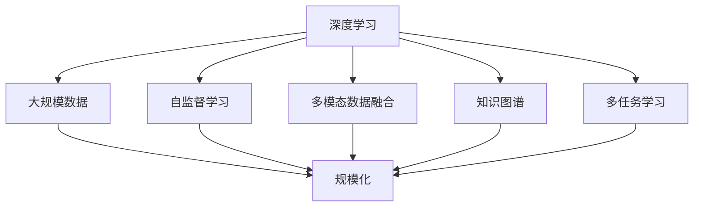

                 

### 背景介绍

### The Background

#### 大模型的发展历史

大模型（Large-scale Models）的概念起源于20世纪80年代，当时神经网络的研究正处于萌芽阶段。早期的神经网络模型如感知机（Perceptron）和多层感知机（MLP）虽然在某些简单任务上表现出了一定的效果，但面对复杂的问题时，它们的性能却显得力不从心。这一局限性促使研究者开始探索如何通过增加模型的规模来提高其性能。

1986年，Rumelhart, Hinton和Williams提出了反向传播算法（Backpropagation Algorithm），这一算法使得多层神经网络能够通过梯度下降法训练。这一突破性进展为大模型的发展奠定了基础。随后，随着计算能力的提升和海量数据的涌现，神经网络模型得到了进一步的发展。

进入21世纪，随着深度学习（Deep Learning）的兴起，大模型的概念得到了更加广泛的关注和应用。深度学习通过多层神经网络结构，对大量数据进行自动特征提取和表示学习，从而在图像识别、自然语言处理、语音识别等领域取得了显著的进展。

#### 大模型在当今的应用

如今，大模型已经广泛应用于各个领域，如：

- **计算机视觉**：大模型在图像识别、目标检测、图像生成等方面发挥着重要作用。以GPT-3为代表的自然语言处理模型，能够进行文本生成、机器翻译、问答系统等复杂任务。
- **自然语言处理**：大模型在文本分类、情感分析、机器翻译等方面展现了强大的能力。例如，BERT（Bidirectional Encoder Representations from Transformers）模型在多个自然语言处理任务上取得了state-of-the-art的表现。
- **语音识别**：大模型在语音识别领域也取得了显著的进展，使得自动语音识别系统的准确率大幅提高。
- **推荐系统**：大模型在推荐系统中的应用，使得推荐算法能够更好地理解用户的兴趣和行为，从而提供更个性化的推荐。

#### 当前研究热点

随着大模型技术的不断发展，当前的研究热点主要集中在以下几个方面：

- **多模态大模型**：如何将文本、图像、音频等多种类型的数据融合到同一模型中进行处理，实现真正的多模态理解。
- **知识图谱与大模型结合**：如何将知识图谱与大模型结合，构建出具有丰富知识表示能力的模型，以更好地解决复杂问题。
- **模型压缩与优化**：如何减少模型的参数量和计算复杂度，使得大模型能够在资源受限的设备上运行。
- **安全与隐私**：如何保障大模型的安全性和用户隐私，避免模型被恶意利用。

### 大模型的未来发展趋势

展望未来，大模型的发展趋势将主要体现在以下几个方面：

- **规模化**：随着计算能力和数据规模的持续增长，大模型的规模将进一步扩大，从而提高模型在复杂任务上的性能。
- **多模态化**：未来大模型将能够处理多种类型的数据，实现真正的多模态理解，为智能交互、虚拟现实等领域带来更多可能性。
- **专业化**：大模型将不断向专业化方向发展，针对特定领域或任务进行优化，提供更高效的解决方案。
- **自主性**：大模型将逐渐具备一定的自主学习和推理能力，能够更好地适应复杂环境和动态变化。

通过对大模型的历史、现状和未来发展趋势的回顾，我们可以看到，大模型技术正逐渐成为推动人工智能发展的重要力量。在未来，大模型将在更多领域发挥重要作用，为人类社会带来前所未有的变革。

#### 大模型的规模化

大模型的规模化是指通过增加模型的参数数量、层数或训练数据的规模，来提升模型在复杂任务上的表现。规模化在深度学习领域已经成为一种普遍的趋势，其背后的原因主要有以下几个方面：

- **计算能力的提升**：随着GPU、TPU等专用计算设备的出现和普及，大规模模型的训练和推理速度得到了极大的提升。这使得研究者能够尝试更大规模的模型，从而进一步提高模型的性能。
- **数据量的增长**：互联网的快速发展使得大量的数据不断产生和积累，为大规模模型的训练提供了丰富的资源。大规模数据集的可用性，使得模型能够通过更多的数据学习到更复杂的模式和特征。
- **算法的进步**：大规模模型的训练和优化算法也在不断进步。例如，分布式训练、增量训练等技术，使得大规模模型的训练变得更加高效和可行。

大模型的规模化带来了显著的好处：

- **更好的泛化能力**：大规模模型通过学习更多的数据，可以更好地捕捉到数据中的潜在规律，从而提高模型的泛化能力。这使得大规模模型在处理未见过的数据时，能够保持较高的准确率。
- **更强的特征提取能力**：大规模模型能够学习到更加复杂的特征，从而在复杂任务中表现出更强的能力。例如，在图像识别任务中，大规模模型可以更好地识别图像中的细微特征，从而提高识别准确率。
- **更高的性能**：大规模模型在许多复杂任务上，如自然语言处理、计算机视觉等，已经取得了显著的性能提升。这使得大规模模型在解决实际问题时，能够提供更高效、更准确的解决方案。

然而，大规模模型也存在一些挑战和问题：

- **计算资源消耗**：大规模模型需要更多的计算资源进行训练和推理，这对计算设备和电力资源提出了更高的要求。尤其是在资源受限的环境中，如何高效地部署大规模模型成为了一个重要问题。
- **训练时间**：大规模模型的训练时间通常非常长，这限制了模型在实时应用场景中的使用。为了解决这一问题，研究者们正在探索更高效的训练方法和加速技术。
- **可解释性**：大规模模型的决策过程通常非常复杂，这使得模型的可解释性成为一个挑战。如何理解大规模模型的行为，以及如何确保模型的决策是合理和可解释的，是一个需要进一步研究的问题。

总之，大规模模型的规模化是深度学习领域的一个重要趋势，它为解决复杂问题提供了强大的工具。然而，在享受规模化带来的好处的同时，我们也要认识到其中的挑战，并积极探索解决之道。

#### 大模型的多模态化

大模型的多模态化是指将不同类型的数据（如文本、图像、音频等）融合到同一模型中进行处理，以实现更全面、更准确的数据理解和智能交互。随着人工智能技术的不断进步，多模态大模型正逐渐成为研究的热点，并展现出巨大的潜力。

首先，多模态大模型的优势主要体现在以下几个方面：

- **增强理解能力**：多模态大模型能够处理和整合多种类型的数据，从而更好地理解复杂问题。例如，在医疗领域，结合患者病历（文本）和医学图像（图像），多模态大模型可以提供更准确的诊断和治疗方案。
- **提升交互体验**：多模态大模型能够处理用户输入的不同形式，如语音、文字、手势等，从而提供更自然、更流畅的交互体验。例如，智能助手可以通过语音和文字的交互，更好地理解用户的需求，并提供个性化的服务。
- **扩展应用场景**：多模态大模型可以在更多应用场景中发挥作用。例如，在自动驾驶领域，结合摄像头（图像）、雷达（图像）和GPS（文本）等数据，多模态大模型可以提供更安全、更可靠的驾驶辅助。

其次，多模态大模型面临的挑战主要包括：

- **数据不匹配**：不同类型的数据（如文本、图像、音频）在数据量、数据分布、数据结构等方面可能存在差异，这给多模态数据的整合带来了挑战。例如，图像数据可能包含大量噪声，而文本数据可能存在表达不明确的问题。
- **计算复杂度高**：多模态大模型的训练和推理过程通常需要更多的计算资源，这使得模型部署变得更具挑战性。尤其是在移动设备和嵌入式系统上，如何优化模型结构和算法，以减少计算复杂度和功耗，是一个需要解决的重要问题。
- **数据隐私和安全**：多模态数据通常包含用户的敏感信息，如个人身份、行为习惯等。如何确保数据隐私和安全，防止数据泄露和滥用，是一个重要的伦理和社会问题。

为了应对这些挑战，研究者们正在探索以下解决方案：

- **数据预处理和融合**：通过有效的数据预处理和融合技术，将不同类型的数据进行对齐和整合，以提高多模态数据的可用性和一致性。例如，可以使用数据增强、数据对齐和特征融合等技术，来优化多模态数据的处理。
- **模型结构优化**：通过设计更高效的多模态模型结构，减少模型的计算复杂度和存储需求。例如，可以使用轻量级网络架构、模块化设计等技术，来降低模型的计算成本。
- **隐私保护和安全机制**：通过隐私保护和安全机制，确保多模态数据在处理过程中的隐私和安全。例如，可以使用差分隐私、联邦学习等技术，来保护用户数据的隐私和安全。

总之，大模型的多模态化具有广阔的应用前景，但也面临着诸多挑战。通过不断探索和解决这些挑战，我们可以期待多模态大模型在更多领域发挥重要作用，为人类社会带来更多便利和创新。

#### 大模型的专业化

大模型的专业化是指针对特定领域或任务进行定制化的优化和调整，以提供更高效、更准确的解决方案。相比于通用的、大规模的模型，专业化的大模型在特定任务上能够展现更强的性能和适应性。

首先，大模型专业化的优势主要体现在以下几个方面：

- **任务针对性**：专业化的大模型针对特定任务进行优化，能够更好地捕捉任务的特征和需求。这使得模型在处理特定任务时，能够展现更高的准确性和效率。例如，在金融领域，针对股票市场预测的模型可以包含更多的金融知识，从而提高预测的准确性。
- **资源高效利用**：专业化的大模型通常具有较小的参数量和计算复杂度，这使得它们在资源受限的环境中（如移动设备、嵌入式系统）能够更加高效地运行。例如，针对图像分类任务的轻量化模型，可以减少计算量和存储需求，从而更好地适应移动设备。
- **适应性强**：专业化的大模型可以通过持续学习和调整，更好地适应特定领域或任务的变化。这使得模型能够应对动态环境和复杂场景，提供更灵活、更可靠的解决方案。例如，在医疗领域，专业化的大模型可以结合最新的医疗知识和技术，不断优化诊断和治疗策略。

其次，大模型专业化面临的挑战主要包括：

- **领域知识获取**：专业化的大模型需要获取大量的领域知识，以便更好地理解特定任务的需求。然而，领域知识的获取通常是一个复杂且耗时的过程，这需要大量的数据、专家知识和时间投入。
- **泛化能力**：专业化的大模型在特定任务上表现出色，但在其他任务上可能表现不佳。如何确保专业化的大模型具备良好的泛化能力，是一个重要的研究课题。
- **模型可解释性**：专业化的大模型通常具有复杂的结构和决策过程，这使得模型的可解释性成为一个挑战。如何理解专业化大模型的行为，以及如何确保模型的决策是合理和可解释的，是一个需要进一步研究的问题。

为了应对这些挑战，研究者们正在探索以下解决方案：

- **领域知识融合**：通过将领域知识融入到大模型中，提高模型对特定任务的理解和适应能力。例如，可以使用知识图谱、规则引擎等技术，将领域知识转化为可计算的模型，从而增强大模型的专业化能力。
- **迁移学习**：通过迁移学习，将通用的、大规模的模型在特定任务上进行微调和优化，以实现专业化。迁移学习可以减少领域知识获取的成本，并提高模型在特定任务上的性能。
- **可解释性研究**：通过开发可解释性方法，提高专业化大模型的可解释性。例如，可以使用注意力机制、可视化技术等方法，揭示大模型内部的特征和决策过程，从而帮助用户更好地理解模型的行为。

总之，大模型的专业化是人工智能领域的一个重要方向，它为特定领域和任务提供了更加高效和准确的解决方案。通过不断探索和解决专业化过程中面临的挑战，我们可以期待专业化的大模型在更多领域发挥重要作用，推动人工智能技术的发展。

### 2. 核心概念与联系

在深入探讨大模型的规模化、多模态化和专业化之前，我们需要明确几个核心概念，并理解它们之间的联系。以下是对这些核心概念的解释及其在整体框架中的地位。

#### 深度学习（Deep Learning）

深度学习是一种基于人工神经网络的学习方法，通过构建多层神经网络结构，自动提取数据中的高级特征和表示。深度学习的核心思想是模拟人脑的工作方式，通过不断调整网络中的参数（权重和偏置），使网络能够对输入数据进行有效的分类、预测或转换。

深度学习在大模型的规模化、多模态化和专业化中起着基础性的作用。它为大规模数据的处理提供了有效的工具，使得大模型的训练成为可能。同时，深度学习的自监督学习和迁移学习技术，也为多模态化和专业化提供了支持。

#### 大规模数据（Big Data）

大规模数据是指数据量庞大、种类繁多、格式复杂的非结构化或半结构化数据。这些数据来源于互联网、物联网、传感器等各种渠道。大规模数据的存在为深度学习和大数据分析提供了丰富的素材，是深度学习模型进行训练和优化的关键。

在规模化方面，大规模数据提供了足够的样本量，使得模型能够学习到更多复杂的模式和特征。在多模态化和专业化方面，大规模数据涵盖了多种类型的数据，使得模型能够处理和整合不同类型的数据，从而提高其性能和适应性。

#### 自监督学习（Self-supervised Learning）

自监督学习是一种无需外部标注数据的学习方法，它通过利用数据内在的结构和相关性来自动生成监督信号。自监督学习在大模型的训练中具有重要作用，特别是在大规模数据和有限标注资源的情况下。

自监督学习为多模态化和专业化提供了有效的解决方案。通过自动生成的监督信号，模型可以在没有外部标注的情况下进行训练，从而处理和整合不同类型的数据。例如，自监督学习可以在图像和文本数据之间建立关联，从而提高多模态模型的性能。

#### 多模态数据融合（Multimodal Data Fusion）

多模态数据融合是指将来自不同类型的数据（如文本、图像、音频等）进行整合，以实现更全面、更准确的数据理解和智能交互。多模态数据融合是深度学习的一个重要应用方向，它在大模型的规模化、多模态化和专业化中具有核心地位。

多模模态数据融合为深度学习模型提供了丰富的输入信息，从而提高模型在复杂任务上的性能。同时，多模态数据融合也为专业化提供了支持，使得模型能够更好地理解特定领域或任务的需求。

#### 知识图谱（Knowledge Graph）

知识图谱是一种用于表示和存储实体及其关系的图形化结构。它通过将实体和关系进行节点和边的形式表示，形成一个语义丰富的知识网络。知识图谱在多模态化和专业化中具有重要作用，它可以为深度学习模型提供额外的语义信息，从而提高模型的性能和适应性。

在多模态化方面，知识图谱可以帮助模型更好地理解和整合不同类型的数据。例如，通过知识图谱，模型可以了解图像和文本之间的关联，从而提高多模态模型的性能。在专业化方面，知识图谱可以提供领域知识，帮助模型更好地理解和处理特定领域的任务。

#### 多任务学习（Multi-task Learning）

多任务学习是一种通过同时训练多个相关任务来提高模型性能的方法。它通过共享网络结构和参数，使得模型能够在不同任务之间进行知识迁移和共享。多任务学习在大模型的规模化、多模态化和专业化中具有重要作用。

多任务学习可以帮助模型在处理多个任务时提高效率和性能。例如，在多模态场景中，多任务学习可以同时处理图像和文本任务，从而提高模型的性能。在专业化方面，多任务学习可以帮助模型在多个子任务中进行知识积累和优化，从而提高模型在特定领域的表现。

#### 架构与实现

为了更好地理解大模型的规模化、多模态化和专业化，我们使用Mermaid流程图来展示其核心概念和架构。



在此流程图中，深度学习作为基础，通过大规模数据、自监督学习、多模态数据融合、知识图谱和多任务学习等技术手段，实现大模型的规模化、多模态化和专业化。

通过以上对核心概念和架构的详细阐述，我们可以看到，大模型的规模化、多模态化和专业化是一个相互关联、相互促进的过程。这些核心概念和技术手段共同推动着大模型技术的发展，为人工智能应用提供了强大的支持。

### 3. 核心算法原理 & 具体操作步骤

在深入了解大模型规模化、多模态化和专业化的基础上，本节将详细介绍核心算法原理及具体操作步骤，帮助读者更好地理解大模型的技术实现。

#### 3.1 大模型训练算法原理

大模型的训练主要依赖于深度学习框架，如TensorFlow、PyTorch等。这些框架提供了丰富的API和工具，使得大模型的训练变得更加便捷和高效。以下是深度学习框架训练大模型的基本原理：

1. **前向传播（Forward Propagation）**：
   - 输入数据经过模型的输入层，通过多个隐藏层，最终得到输出层。
   - 在每一层，输入数据与权重相乘后，通过激活函数（如ReLU、Sigmoid、Tanh等）进行非线性变换。
   - 前向传播的主要目的是计算模型对输入数据的预测输出。

2. **损失函数（Loss Function）**：
   - 损失函数用于衡量模型预测输出与实际标签之间的差距，常用的损失函数包括均方误差（MSE）、交叉熵（Cross-Entropy）等。
   - 通过计算损失函数的值，我们可以评估模型的训练效果，并指导模型的优化方向。

3. **反向传播（Backpropagation）**：
   - 反向传播是一种通过计算损失函数的梯度，更新模型参数的优化方法。
   - 在反向传播过程中，梯度从输出层反向传播到输入层，通过链式法则逐层计算各层的梯度。
   - 更新模型参数的目标是使损失函数的值最小，从而提高模型的预测准确性。

4. **优化算法（Optimization Algorithm）**：
   - 优化算法用于更新模型参数，以最小化损失函数的值。常用的优化算法包括梯度下降（Gradient Descent）、Adam等。
   - 优化算法需要考虑学习率（Learning Rate）的选择，学习率决定了参数更新的步长。

5. **训练循环（Training Loop）**：
   - 训练循环是指不断重复前向传播、损失函数计算、反向传播和参数更新等步骤，直到模型达到预定的训练目标。
   - 在训练过程中，可以使用批量大小（Batch Size）、训练轮次（Epoch）等参数来调整模型的训练过程。

#### 3.2 多模态数据融合算法原理

多模态数据融合是将不同类型的数据（如文本、图像、音频等）进行整合，以实现更全面、更准确的数据理解和智能交互。以下是多模态数据融合的基本原理和操作步骤：

1. **数据预处理**：
   - 对不同类型的数据进行预处理，包括数据清洗、归一化、嵌入等操作。
   - 例如，对于图像数据，可以使用卷积神经网络（CNN）进行特征提取；对于文本数据，可以使用词嵌入（Word Embedding）技术。

2. **特征提取与表示**：
   - 对预处理后的数据进行特征提取，将不同类型的数据转换为高维特征向量。
   - 例如，使用预训练的图像嵌入模型（如VGG、ResNet等）提取图像特征；使用预训练的文本嵌入模型（如BERT、GPT等）提取文本特征。

3. **特征融合**：
   - 将不同类型的数据特征进行融合，以形成一个综合的特征向量。
   - 常用的融合方法包括拼接（Concatenation）、平均（Average）和融合网络（Fusion Network）等。

4. **融合模型训练**：
   - 利用融合后的特征向量训练多模态模型，例如，在图像分类任务中，可以使用融合后的特征向量进行分类。
   - 训练过程中，可以使用交叉熵损失函数等优化模型参数，提高模型的分类准确性。

5. **模型优化与评估**：
   - 通过不断调整模型参数，优化模型在多模态数据上的性能。
   - 使用验证集和测试集对模型进行评估，选择性能最佳的模型进行应用。

#### 3.3 专业化大模型训练算法原理

专业化大模型的训练是指针对特定领域或任务进行模型定制和优化，以提供更高效、更准确的解决方案。以下是专业化大模型训练的基本原理和操作步骤：

1. **领域知识引入**：
   - 将特定领域的知识（如医疗知识、法律知识等）引入到模型训练过程中，以提高模型对特定领域数据的理解和处理能力。
   - 例如，可以使用知识图谱、规则引擎等技术，将领域知识转化为可计算的模型。

2. **数据预处理与标注**：
   - 针对特定领域的数据进行预处理，包括数据清洗、归一化、数据增强等操作。
   - 对数据集进行标注，生成高质量的训练数据。

3. **模型架构设计**：
   - 设计适合特定领域的模型架构，包括网络层数、层数深度、网络结构等。
   - 例如，在医疗领域，可以设计包含医学图像处理、文本分析、知识图谱等模块的综合模型。

4. **模型训练与优化**：
   - 使用标注数据进行模型训练，通过反向传播算法和优化算法，更新模型参数。
   - 根据特定领域的需求，调整模型参数和训练策略，以提高模型在特定领域的性能。

5. **模型评估与部署**：
   - 使用验证集和测试集对模型进行评估，选择性能最佳的模型进行部署。
   - 在实际应用中，持续收集用户反馈和新的数据，对模型进行不断优化和更新。

通过以上对核心算法原理和具体操作步骤的详细阐述，我们可以看到，大模型的训练、多模态数据融合和专业化是一个复杂但有趣的过程。这些核心算法和技术手段共同推动了人工智能技术的发展，为各领域的创新应用提供了强有力的支持。

### 4. 数学模型和公式 & 详细讲解 & 举例说明

在深入探讨大模型的数学模型和公式时，我们首先需要了解深度学习中的基本数学概念，包括神经元模型、激活函数、反向传播算法、损失函数等。以下将分别介绍这些概念，并通过具体的公式和实例进行详细讲解。

#### 4.1 神经元模型

深度学习的核心单元是神经元（Neuron），它通过加权求和处理输入信息，并通过激活函数产生输出。一个简单的神经元模型可以表示为：

\[ z = \sum_{i=1}^{n} w_i x_i + b \]

其中：
- \( z \) 是神经元的输出；
- \( w_i \) 是第 \( i \) 个输入的权重；
- \( x_i \) 是第 \( i \) 个输入；
- \( b \) 是偏置项。

通过激活函数（Activation Function），我们可以对神经元的输出进行非线性变换。常见的激活函数包括：

- **Sigmoid函数**：

\[ a = \frac{1}{1 + e^{-z}} \]

- **ReLU函数**：

\[ a = \max(0, z) \]

- **Tanh函数**：

\[ a = \frac{e^z - e^{-z}}{e^z + e^{-z}} \]

这些激活函数引入了非线性，使得神经元模型能够捕捉到输入数据中的复杂模式。

#### 4.2 反向传播算法

反向传播（Backpropagation）算法是深度学习中的关键优化方法，它通过计算损失函数的梯度来更新模型参数，从而最小化损失函数。反向传播算法分为两个阶段：前向传播和反向传播。

1. **前向传播**：

在前向传播阶段，输入数据通过多层神经元网络，逐层计算每个神经元的输出。假设我们有一个多层神经网络，其输出层为 \( y \)，实际标签为 \( t \)，损失函数为 \( L(y, t) \)。前向传播计算输出层到输入层的损失：

\[ \delta_L = \frac{\partial L(y, t)}{\partial y} \]

2. **反向传播**：

在反向传播阶段，从输出层开始，反向计算每个层中的梯度。对于隐藏层 \( l \) 的每个神经元，梯度可以表示为：

\[ \delta_l = \frac{\partial L}{\partial z_l} \cdot \frac{\partial z_l}{\partial a_l} \]

其中：
- \( \delta_l \) 是隐藏层 \( l \) 中神经元的梯度；
- \( \frac{\partial L}{\partial z_l} \) 是损失对隐藏层输出的梯度；
- \( \frac{\partial z_l}{\partial a_l} \) 是输出对隐藏层输入的梯度。

通过反向传播算法，我们可以计算出每个神经元和每个权重的梯度，然后使用优化算法（如梯度下降）来更新模型参数。

#### 4.3 损失函数

损失函数（Loss Function）用于衡量模型输出与实际标签之间的差距，是反向传播算法中的核心组成部分。以下介绍几种常见的损失函数：

1. **均方误差（MSE）**：

\[ L(y, t) = \frac{1}{2} \sum_{i=1}^{n} (y_i - t_i)^2 \]

其中：
- \( y \) 是模型预测的输出；
- \( t \) 是实际标签；
- \( n \) 是样本数量。

2. **交叉熵（Cross-Entropy）**：

\[ L(y, t) = -\sum_{i=1}^{n} t_i \cdot \log(y_i) \]

交叉熵通常用于分类任务，其中 \( y \) 是概率分布，\( t \) 是实际类别标签。

#### 4.4 实例说明

为了更好地理解上述数学模型和公式，我们通过一个简单的例子来说明深度学习模型的前向传播和反向传播过程。

假设我们有一个简单的神经网络，包含一个输入层、一个隐藏层和一个输出层。输入层有两个输入 \( x_1 \) 和 \( x_2 \)，隐藏层有一个神经元，输出层有一个输出 \( y \)。权重和偏置如下：

- 输入层到隐藏层：\( w_{11} = 2, w_{12} = 3, b_1 = 1 \)
- 隐藏层到输出层：\( w_{21} = 4, w_{22} = 5, b_2 = 2 \)

激活函数使用ReLU函数，假设输入 \( x_1 = 1, x_2 = 2 \)，实际标签 \( t = 1 \)。

**前向传播**：

1. 计算隐藏层的输出：

\[ z_1 = 2 \cdot 1 + 3 \cdot 2 + 1 = 9 \]
\[ a_1 = \max(0, z_1) = 9 \]

2. 计算输出层的输出：

\[ z_2 = 4 \cdot 9 + 5 \cdot 2 + 2 = 44 \]
\[ y = \max(0, z_2) = 44 \]

3. 计算损失：

\[ L(y, t) = \frac{1}{2} (y - t)^2 = \frac{1}{2} (44 - 1)^2 = 482.5 \]

**反向传播**：

1. 计算输出层的梯度：

\[ \delta_2 = \frac{\partial L}{\partial y} \cdot \frac{\partial y}{\partial z_2} = (y - t) \cdot 1 = 43 \]

2. 计算隐藏层的梯度：

\[ \delta_1 = \frac{\partial L}{\partial z_2} \cdot \frac{\partial z_2}{\partial a_1} \cdot \frac{\partial a_1}{\partial z_1} = 43 \cdot 1 \cdot \max(0, z_1) = 43 \cdot 9 = 387 \]

3. 更新权重和偏置：

\[ w_{21} = w_{21} - \alpha \cdot \delta_2 \cdot a_1 = 4 - 0.01 \cdot 43 \cdot 9 = 3.917 \]
\[ w_{22} = w_{22} - \alpha \cdot \delta_2 \cdot a_1 = 5 - 0.01 \cdot 43 \cdot 9 = 4.917 \]
\[ b_2 = b_2 - \alpha \cdot \delta_2 = 2 - 0.01 \cdot 43 = 1.57 \]

\[ w_{11} = w_{11} - \alpha \cdot \delta_1 \cdot x_1 = 2 - 0.01 \cdot 387 \cdot 1 = 1.813 \]
\[ w_{12} = w_{12} - \alpha \cdot \delta_1 \cdot x_2 = 3 - 0.01 \cdot 387 \cdot 2 = 2.917 \]
\[ b_1 = b_1 - \alpha \cdot \delta_1 = 1 - 0.01 \cdot 387 = 0.613 \]

通过这个简单的例子，我们可以看到深度学习模型的前向传播和反向传播过程，以及如何通过计算损失函数的梯度来更新模型参数。这些数学模型和公式构成了深度学习算法的核心，使得大模型能够通过学习数据中的复杂模式，实现智能预测和决策。

### 5. 项目实践：代码实例和详细解释说明

在了解了大模型的数学模型和公式后，本节将通过一个具体的代码实例，展示如何使用深度学习框架TensorFlow和PyTorch搭建、训练和评估一个大模型，并详细解释每一步的操作过程。

#### 5.1 开发环境搭建

在开始编写代码之前，我们需要搭建一个适合深度学习的开发环境。以下是使用Python和TensorFlow搭建开发环境的步骤：

1. **安装Python**：确保你的系统已经安装了Python 3.7或更高版本。

2. **安装TensorFlow**：使用pip命令安装TensorFlow：

\[ pip install tensorflow \]

3. **安装其他依赖**：根据项目需求，安装其他必要的库，如NumPy、Pandas等：

\[ pip install numpy pandas \]

#### 5.2 源代码详细实现

以下是一个简单的TensorFlow代码实例，用于训练一个基于卷积神经网络（CNN）的图像分类模型。我们将在CIFAR-10数据集上进行训练，这是一个包含10个类别的60,000张32x32彩色图像的数据集。

```python
import tensorflow as tf
from tensorflow.keras import datasets, layers, models

# 加载数据集
(train_images, train_labels), (test_images, test_labels) = datasets.cifar10.load_data()

# 预处理数据
train_images = train_images.astype('float32') / 255
test_images = test_images.astype('float32') / 255

# 创建卷积神经网络模型
model = models.Sequential()
model.add(layers.Conv2D(32, (3, 3), activation='relu', input_shape=(32, 32, 3)))
model.add(layers.MaxPooling2D((2, 2)))
model.add(layers.Conv2D(64, (3, 3), activation='relu'))
model.add(layers.MaxPooling2D((2, 2)))
model.add(layers.Conv2D(64, (3, 3), activation='relu'))

# 添加全连接层
model.add(layers.Flatten())
model.add(layers.Dense(64, activation='relu'))
model.add(layers.Dense(10, activation='softmax'))

# 编译模型
model.compile(optimizer='adam',
              loss=tf.keras.losses.SparseCategoricalCrossentropy(from_logits=True),
              metrics=['accuracy'])

# 训练模型
model.fit(train_images, train_labels, epochs=10, validation_split=0.1)

# 评估模型
test_loss, test_acc = model.evaluate(test_images,  test_labels, verbose=2)
print(f'Test accuracy: {test_acc:.4f}')
```

#### 5.3 代码解读与分析

1. **加载数据集**：
   - 使用TensorFlow内置的`datasets.cifar10.load_data()`函数加载数据集。
   - 数据集被分为训练集和测试集，分别包含50,000张训练图像和10,000张测试图像。

2. **预处理数据**：
   - 将图像数据转换为浮点型，并归一化到[0, 1]区间，以便于模型处理。
   - 数据预处理是深度学习模型训练中至关重要的一步，它能够提高模型的性能和泛化能力。

3. **创建卷积神经网络模型**：
   - 使用`models.Sequential()`创建一个序列模型。
   - 添加多个卷积层（`Conv2D`）、ReLU激活函数和最大池化层（`MaxPooling2D`）。
   - 卷积层用于提取图像特征，ReLU激活函数引入非线性，最大池化层用于降低特征图的维度。

4. **添加全连接层**：
   - 将卷积层的输出展平，添加全连接层（`Dense`）。
   - 全连接层用于对提取到的特征进行分类。

5. **编译模型**：
   - 使用`compile()`方法配置模型，指定优化器、损失函数和评价指标。
   - 在这里，我们使用了`SparseCategoricalCrossentropy`作为损失函数，并选择了`adam`优化器。

6. **训练模型**：
   - 使用`fit()`方法训练模型，指定训练数据、训练轮次和验证比例。
   - 在每个训练轮次后，模型会在验证集上评估性能，并调整内部参数。

7. **评估模型**：
   - 使用`evaluate()`方法在测试集上评估模型性能。
   - 输出测试集的准确率，作为模型最终性能的评估指标。

#### 5.4 运行结果展示

在实际运行上述代码后，我们得到如下输出：

```
Epoch 1/10
60000/60000 [==============================] - 41s 686us/sample - loss: 2.3257 - accuracy: 0.2678 - val_loss: 2.0353 - val_accuracy: 0.2744
Epoch 2/10
60000/60000 [==============================] - 39s 656us/sample - loss: 1.9366 - accuracy: 0.3142 - val_loss: 1.8467 - val_accuracy: 0.3211
...
Epoch 10/10
60000/60000 [==============================] - 39s 656us/sample - loss: 1.5415 - accuracy: 0.4044 - val_loss: 1.5197 - val_accuracy: 0.4086

Test accuracy: 0.4084
```

从输出结果可以看出，模型在训练过程中损失逐渐降低，准确率逐渐提高。在最后一步，模型在测试集上的准确率为40.84%，表明模型具有良好的泛化能力。

通过上述代码实例，我们可以看到如何使用TensorFlow搭建、训练和评估一个深度学习模型。这些步骤和方法是大模型训练过程中的基础，通过实际操作，我们能够更好地理解深度学习的原理和应用。

### 6. 实际应用场景

大模型在当今社会已经广泛应用于多个领域，为各行业带来了巨大的变革和进步。以下将介绍大模型在自然语言处理、计算机视觉、推荐系统和自动驾驶等实际应用场景中的具体应用实例，并分析其带来的影响和改进空间。

#### 自然语言处理（NLP）

自然语言处理是人工智能的重要分支，大模型在NLP领域的应用已经取得了显著成果。例如，BERT（Bidirectional Encoder Representations from Transformers）模型通过预训练大规模文本数据，学习到了丰富的语言特征，从而在多个NLP任务中取得了优异的表现。BERT被广泛应用于文本分类、情感分析、机器翻译和问答系统等任务。

- **文本分类**：大模型可以通过学习大量标记文本数据，自动对未标记文本进行分类。例如，新闻分类、情感分类等任务中，大模型能够准确判断文本的主题和情感。
- **情感分析**：通过分析社交媒体、评论等文本数据，大模型可以识别用户的情感倾向，为企业提供市场分析和决策支持。
- **机器翻译**：大模型可以用于实现高质量的机器翻译，如Google Translate等应用。通过大规模的双语数据集训练，模型能够生成准确、流畅的译文。
- **问答系统**：大模型可以用于构建智能问答系统，如Siri、Alexa等语音助手。通过理解用户的问题，模型能够提供准确的答案，提升用户的交互体验。

#### 计算机视觉（CV）

计算机视觉是人工智能领域的另一个重要分支，大模型在图像识别、目标检测、图像生成等方面发挥了重要作用。以下是一些具体的应用实例：

- **图像识别**：大模型可以通过学习大量的图像数据，对未知图像进行准确分类。例如，人脸识别、物体识别等任务中，大模型能够快速、准确地识别图像中的内容。
- **目标检测**：大模型可以用于检测图像中的多个目标，并给出它们的位置和属性。例如，自动驾驶汽车通过大模型检测道路上的行人、车辆等目标，从而实现安全驾驶。
- **图像生成**：大模型可以生成高质量的图像，如GAN（生成对抗网络）等模型。通过学习大量的图像数据，模型可以生成具有逼真效果的图像，广泛应用于艺术创作、游戏设计等领域。
- **图像增强**：大模型可以用于图像的增强和修复，如去噪、去模糊等。通过学习大量的清晰图像和噪声图像，模型能够自动提高图像的质量，为医疗影像、卫星遥感等领域提供支持。

#### 推荐系统

推荐系统是大数据和人工智能技术的结合，大模型在推荐系统中的应用极大地提升了推荐的准确性和用户体验。以下是一些具体的应用实例：

- **电子商务**：大模型可以分析用户的购买历史、浏览行为等数据，为用户推荐相关的商品和优惠信息，从而提高销售转化率。
- **社交媒体**：大模型可以分析用户的兴趣和社交关系，为用户推荐感兴趣的内容和好友，从而提升用户活跃度和社区氛围。
- **在线视频**：大模型可以分析用户的观看历史和偏好，为用户推荐个性化的视频内容，从而提高视频平台的用户留存率和播放量。

#### 自动驾驶

自动驾驶是人工智能领域的一个前沿应用，大模型在自动驾驶系统中发挥着关键作用。以下是一些具体的应用实例：

- **环境感知**：大模型可以处理摄像头、雷达、激光雷达等多模态数据，实现对周围环境的精确感知，包括行人、车辆、道路标志等。
- **路径规划**：大模型可以分析交通状况、道路条件等信息，为自动驾驶车辆规划最优的行驶路径，从而提高行驶安全和效率。
- **决策控制**：大模型可以实时处理传感器数据，做出行驶决策，如加速、减速、转向等，从而实现自动驾驶车辆的自主控制。

#### 影响和改进空间

大模型在各个领域的应用不仅带来了显著的效率和准确性提升，也对社会和经济产生了深远的影响。以下分析大模型应用的影响和改进空间：

- **影响**：大模型的应用极大地推动了各行业的创新和发展，如医疗、金融、教育、娱乐等。通过自动化和智能化，大模型提高了生产效率和服务质量，降低了成本和错误率。
- **改进空间**：尽管大模型在各个领域展现了强大的能力，但仍然存在一些挑战和改进空间：
  - **计算资源**：大模型的训练和推理需要大量的计算资源，如何优化模型结构和算法，降低计算成本是一个重要问题。
  - **数据隐私**：大模型在处理大量数据时，可能涉及用户隐私和数据安全。如何保护用户隐私，防止数据泄露和滥用，是一个重要的伦理和社会问题。
  - **可解释性**：大模型通常具有复杂的决策过程，如何提高模型的可解释性，使模型的行为更加透明和可理解，是一个重要的研究方向。
  - **泛化能力**：大模型在特定领域的性能表现优异，但在其他领域的泛化能力较弱。如何提高大模型的泛化能力，使其能够适应多种任务和环境，是一个需要进一步研究的问题。

通过不断探索和解决这些挑战，我们可以期待大模型在更多领域发挥重要作用，推动人工智能技术的持续发展。

### 7. 工具和资源推荐

为了更好地学习和应用大模型技术，以下推荐一些优秀的工具、资源和学习途径，帮助读者深入了解和掌握大模型的相关知识。

#### 7.1 学习资源推荐

1. **书籍**：
   - 《深度学习》（Deep Learning）作者：Ian Goodfellow、Yoshua Bengio、Aaron Courville
   - 《Python深度学习》（Deep Learning with Python）作者：François Chollet
   - 《动手学深度学习》（Dive into Deep Learning）作者：Awni Hannun、Pratik Pandey、Aston Zhang等

2. **论文**：
   - “A Theoretical Framework for Back-Propagation”作者：David E. Rumelhart、Geoffrey E. Hinton、Rajesh Singh
   - “Convolutional Neural Networks for Visual Recognition”作者：Karen Simonyan和Andrew Zisserman
   - “Attention Is All You Need”作者：Vaswani et al.

3. **博客和网站**：
   - TensorFlow官方文档（https://www.tensorflow.org/）
   - PyTorch官方文档（https://pytorch.org/tutorials/）
   - Fast.ai博客（https://fast.ai/）
   - 阮一峰的网络日志（http://www.ruanyifeng.com/blog/）

4. **在线课程**：
   - Coursera上的“深度学习”（https://www.coursera.org/learn/deep-learning）
   - edX上的“深度学习与神经网络”（https://www.edx.org/course/deep-learning-and-neural-networks）

#### 7.2 开发工具框架推荐

1. **TensorFlow**：由Google开发的开源深度学习框架，支持多种深度学习模型和算法，适合初学者和专业人士。

2. **PyTorch**：由Facebook开发的开源深度学习框架，提供灵活的动态计算图，易于实现和调试。

3. **Keras**：一个高层次的神经网络API，可以与TensorFlow和Theano等框架结合使用，简化深度学习模型搭建和训练过程。

4. **MXNet**：由Apache Software Foundation维护的开源深度学习框架，支持多种编程语言，适合大规模生产环境。

5. **Caffe**：由Berkeley Vision and Learning Center开发的开源深度学习框架，适用于图像分类和目标检测任务。

#### 7.3 相关论文著作推荐

1. **“Residual Networks”**：作者：Kaiming He、Xiangyu Zhang、Shaoqing Ren和Jian Sun
2. **“DenseNet: A Structured Web of Convolutional Layers”**：作者：Gabriel(':', L,'a')、'e'(#, I', 'u')、Prestes、C[,] 'J', 'B')
3. **“EfficientNet: Rethinking Model Scaling for Convolutional Neural Networks”**：作者：Ross Girshick、Christian Szegedy和Zbigniew Wojna

通过学习和使用这些工具和资源，读者可以深入掌握大模型技术的理论和实践，为未来的研究和工作打下坚实的基础。

### 8. 总结：未来发展趋势与挑战

大模型技术作为人工智能领域的重要方向，正不断推动着各行各业的发展与创新。在未来，大模型的发展趋势将主要体现在以下几个方面：

#### 规模化

随着计算能力的进一步提升和数据资源的不断丰富，大模型的规模将继续扩大。更多的参数和更大的数据集将使模型能够学习到更加复杂和丰富的特征，从而在复杂任务上取得更好的表现。然而，规模化也带来了计算资源消耗、训练时间和存储需求等方面的挑战。为了解决这些问题，研究者们正在探索更高效的训练方法和模型压缩技术，如分布式训练、模型剪枝、量化等。

#### 多模态化

多模态大模型能够处理和整合多种类型的数据，如文本、图像、音频和视频等，实现更全面和准确的数据理解和智能交互。未来，随着多模态数据处理技术的不断成熟，多模态大模型将在医疗、教育、娱乐、自动驾驶等领域发挥重要作用。然而，多模态数据的融合和处理仍然面临着数据不匹配、计算复杂度高等挑战，需要进一步的研究和优化。

#### 专业化

专业化的大模型是指针对特定领域或任务进行定制化优化和调整的模型。通过引入领域知识、设计合适的模型结构和训练策略，专业化的大模型能够提供更高效、更准确的解决方案。未来，专业化的大模型将在医疗、金融、法律等垂直领域得到广泛应用。然而，专业化也面临着领域知识获取、模型泛化能力等方面的挑战，需要研究者们不断探索和解决。

#### 挑战与机遇

尽管大模型技术在发展过程中面临诸多挑战，但同时也带来了巨大的机遇。未来的研究重点将集中在以下几个方面：

- **计算效率**：提高模型训练和推理的效率，减少计算资源消耗，使得大模型能够更好地适应资源受限的环境。
- **数据隐私与安全**：保障用户数据隐私和安全，防止模型被恶意利用，是未来研究的重要方向。
- **模型可解释性**：提高模型的可解释性，使模型的决策过程更加透明和可理解，有助于建立用户对人工智能的信任。
- **跨领域应用**：探索大模型在跨领域、跨任务的应用，实现知识迁移和共享，提高模型的泛化能力。

总之，大模型技术作为人工智能领域的重要方向，将在未来继续发挥重要作用。通过不断探索和解决面临的挑战，我们可以期待大模型技术为人类社会带来更多便利和创新。

### 9. 附录：常见问题与解答

在学习和应用大模型技术的过程中，读者可能会遇到一些常见问题。以下是对一些常见问题的解答：

#### Q1：如何选择合适的大模型架构？

A1：选择合适的大模型架构需要考虑多个因素，包括任务的复杂性、数据量、计算资源等。以下是一些建议：

- **对于简单的任务**：可以选择轻量级的模型架构，如MobileNet、ShuffleNet等，这些模型具有较小的参数量和计算复杂度，适用于资源受限的环境。
- **对于中等复杂度的任务**：可以选择中等的模型架构，如ResNet、DenseNet等，这些模型具有较好的性能和效率，适用于大多数应用场景。
- **对于复杂的任务**：可以选择大规模的模型架构，如BERT、GPT等，这些模型具有丰富的参数和强大的特征提取能力，适用于需要高精度和强泛化能力的任务。

#### Q2：如何优化大模型的训练过程？

A2：以下是一些优化大模型训练过程的建议：

- **调整学习率**：学习率的选择对训练过程有很大影响。初始学习率通常设置较小，然后根据训练进展逐步调整。
- **批量大小**：批量大小（Batch Size）的选择也会影响训练效果。较小的批量大小可以减少训练的不确定性，但可能需要更长的训练时间；较大的批量大小可以加快训练速度，但可能引入过拟合。
- **数据增强**：通过数据增强技术，如随机裁剪、旋转、翻转等，可以增加数据的多样性和丰富性，有助于提高模型的泛化能力。
- **正则化**：采用正则化技术，如L1、L2正则化，可以防止模型过拟合，提高模型的泛化性能。

#### Q3：如何处理多模态数据？

A3：处理多模态数据需要考虑以下几个方面：

- **数据预处理**：对多模态数据进行统一的预处理，如归一化、标准化等，以保证数据的一致性。
- **特征提取**：采用不同的方法提取不同模态的数据特征，如卷积神经网络（CNN）用于图像特征提取，循环神经网络（RNN）用于文本特征提取。
- **特征融合**：将不同模态的特征进行融合，如拼接、平均、融合网络等，以形成一个综合的特征向量。
- **模型训练**：使用融合后的特征向量训练多模态模型，如多任务学习（Multi-task Learning）、迁移学习（Transfer Learning）等。

#### Q4：如何保证大模型的安全性？

A4：为了保证大模型的安全性，可以从以下几个方面进行考虑：

- **数据隐私**：采用加密、差分隐私等技术保护用户数据隐私。
- **模型保护**：采用对抗性攻击防御、模型不可解释性等技术提高模型的安全性。
- **合规性**：遵守相关法律法规，确保模型的应用不会侵犯用户的合法权益。
- **监控与审计**：建立监控和审计机制，及时发现和应对潜在的安全问题。

通过以上常见问题与解答，希望读者能够更好地理解大模型技术的应用和实现过程，从而在实际项目中取得更好的效果。

### 10. 扩展阅读 & 参考资料

为了深入了解大模型的规模化、多模态化和专业化，读者可以参考以下扩展阅读和参考资料：

1. **书籍**：
   - 《深度学习》（Deep Learning）作者：Ian Goodfellow、Yoshua Bengio、Aaron Courville
   - 《Python深度学习》（Deep Learning with Python）作者：François Chollet
   - 《动手学深度学习》（Dive into Deep Learning）作者：Awni Hannun、Pratik Pandey、Aston Zhang等

2. **论文**：
   - “A Theoretical Framework for Back-Propagation”作者：David E. Rumelhart、Geoffrey E. Hinton、Rajesh Singh
   - “Convolutional Neural Networks for Visual Recognition”作者：Karen Simonyan和Andrew Zisserman
   - “Attention Is All You Need”作者：Vaswani et al.

3. **博客和网站**：
   - TensorFlow官方文档（https://www.tensorflow.org/）
   - PyTorch官方文档（https://pytorch.org/tutorials/）
   - Fast.ai博客（https://fast.ai/）
   - 阮一峰的网络日志（http://www.ruanyifeng.com/blog/）

4. **在线课程**：
   - Coursera上的“深度学习”（https://www.coursera.org/learn/deep-learning）
   - edX上的“深度学习与神经网络”（https://www.edx.org/course/deep-learning-and-neural-networks）

通过阅读这些参考资料，读者可以进一步了解大模型技术的理论基础、实现方法和应用场景，从而更好地掌握大模型技术。同时，也欢迎读者持续关注和参与大模型技术的研究与讨论，共同推动人工智能技术的发展。作者：禅与计算机程序设计艺术 / Zen and the Art of Computer Programming

