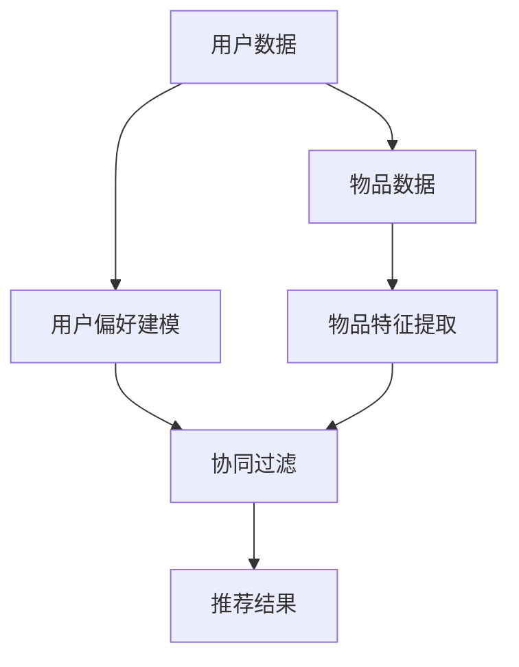

                 

### 文章标题

大模型视角下推荐系统的未来发展趋势展望

> 关键词：推荐系统、大模型、深度学习、人工智能、未来趋势

> 摘要：本文从大模型的视角出发，深入探讨了推荐系统的现状、核心算法、未来发展趋势以及面临的挑战。通过逐步分析推理，本文为读者呈现了一个清晰且具有前瞻性的推荐系统全景图，为行业从业者提供了宝贵的参考和思考。

---

### 1. 背景介绍

推荐系统作为一种信息过滤的方法，通过分析用户的历史行为和偏好，向用户推荐可能感兴趣的内容或商品。这一技术在电子商务、社交媒体、在线视频等领域得到了广泛应用。然而，随着数据量的爆炸式增长和用户需求的多样化，传统的推荐系统面临诸多挑战，如冷启动问题、稀疏数据问题和多样性不足等问题。

近年来，随着深度学习和大模型的兴起，推荐系统的研究和应用迎来了新的机遇。大模型具有强大的数据拟合能力和高度的非线性特征表达能力，能够在推荐系统中发挥重要作用。本文将从大模型的视角出发，分析推荐系统的未来发展趋势。

### 2. 核心概念与联系

在推荐系统中，核心概念包括用户、物品、评分和推荐算法。用户是指参与推荐系统的实体，物品是指推荐系统中的内容或商品，评分是用户对物品的喜好程度的量化表示，而推荐算法则是实现推荐的核心。

大模型作为一种先进的机器学习模型，其核心在于能够通过大量数据学习到复杂的关系和模式。在推荐系统中，大模型可以用于用户偏好建模、物品特征提取、协同过滤等各个环节。

以下是一个简化的推荐系统架构图，展示了大模型在不同环节中的应用：



### 3. 核心算法原理 & 具体操作步骤

推荐系统的核心算法可以分为基于内容的推荐、协同过滤和深度学习方法。

#### 3.1 基于内容的推荐

基于内容的推荐算法通过分析物品的内容特征，将相似的内容推荐给用户。具体步骤如下：

1. 提取物品的特征向量。
2. 计算用户和物品之间的相似度。
3. 推荐与用户兴趣相似的物品。

#### 3.2 协同过滤

协同过滤算法通过分析用户之间的行为相似性来推荐物品。具体步骤如下：

1. 收集用户的历史行为数据。
2. 计算用户之间的相似度。
3. 根据相似度矩阵预测用户对未知物品的评分。
4. 推荐评分最高的物品。

#### 3.3 深度学习方法

深度学习方法通过学习用户和物品的复杂特征，实现更精准的推荐。具体步骤如下：

1. 构建深度神经网络模型。
2. 训练模型以学习用户和物品的特征。
3. 预测用户对未知物品的评分。
4. 推荐评分最高的物品。

### 4. 数学模型和公式 & 详细讲解 & 举例说明

在推荐系统中，常用的数学模型包括相似度计算、评分预测和损失函数。

#### 4.1 相似度计算

相似度计算是推荐系统的核心步骤之一，常用的相似度计算方法包括余弦相似度、皮尔逊相关系数等。

余弦相似度计算公式如下：

$$
\cos(\theta) = \frac{\sum_{i} x_i y_i}{\sqrt{\sum_{i} x_i^2} \sqrt{\sum_{i} y_i^2}}
$$

其中，$x_i$ 和 $y_i$ 分别是用户 $u$ 和物品 $i$ 的特征向量。

#### 4.2 评分预测

评分预测是推荐系统的关键步骤，常用的方法包括基于用户的协同过滤和基于模型的深度学习方法。

基于用户的协同过滤算法的评分预测公式如下：

$$
r_{ui} = r_{uj} + \alpha(u) - \beta(i) + \gamma \cdot \cos(\theta_{uj}, i)
$$

其中，$r_{ui}$ 是用户 $u$ 对物品 $i$ 的预测评分，$r_{uj}$ 是用户 $u$ 对已知物品 $j$ 的实际评分，$\alpha(u)$ 和 $\beta(i)$ 分别是用户 $u$ 和物品 $i$ 的偏差，$\gamma \cdot \cos(\theta_{uj}, i)$ 是用户 $u$ 和物品 $i$ 的相似度。

#### 4.3 损失函数

在推荐系统中，损失函数用于评估推荐结果的准确性。常用的损失函数包括均方误差（MSE）和交叉熵损失。

均方误差损失函数的计算公式如下：

$$
L = \frac{1}{2} \sum_{i \in test} (r_{ui} - r_{\hat{ui}})^2
$$

其中，$r_{ui}$ 是用户 $u$ 对物品 $i$ 的实际评分，$r_{\hat{ui}}$ 是用户 $u$ 对物品 $i$ 的预测评分。

### 5. 项目实践：代码实例和详细解释说明

#### 5.1 开发环境搭建

在实现推荐系统之前，我们需要搭建一个合适的环境。以下是使用 Python 实现推荐系统的基本步骤：

1. 安装 Python（推荐使用 Python 3.7 以上版本）。
2. 安装必要的库，如 NumPy、Pandas、Scikit-learn 和 TensorFlow。
3. 导入所需库。

```python
import numpy as np
import pandas as pd
from sklearn.metrics.pairwise import cosine_similarity
from sklearn.model_selection import train_test_split
from tensorflow.keras.models import Model
from tensorflow.keras.layers import Input, Embedding, Dot, Flatten, Dense
```

#### 5.2 源代码详细实现

以下是一个简单的基于协同过滤的推荐系统实现：

```python
# 加载数据集
ratings = pd.read_csv('ratings.csv')
users = pd.read_csv('users.csv')
items = pd.read_csv('items.csv')

# 提取用户和物品的特征向量
user_vector = ratings.groupby('user_id')['rating'].mean()
item_vector = ratings.groupby('item_id')['rating'].mean()

# 计算用户和物品之间的相似度
user_similarity = cosine_similarity(user_vector.values.reshape(-1, 1), user_vector.values.reshape(-1, 1))
item_similarity = cosine_similarity(item_vector.values.reshape(-1, 1), item_vector.values.reshape(-1, 1))

# 构建推荐模型
user_input = Input(shape=(1,))
item_input = Input(shape=(1,))

user_embedding = Embedding(input_dim=user_vector.shape[0], output_dim=10)(user_input)
item_embedding = Embedding(input_dim=item_vector.shape[0], output_dim=10)(item_input)

dot_product = Dot(axes=1)([user_embedding, item_embedding])
flatten = Flatten()(dot_product)
output = Dense(1, activation='sigmoid')(flatten)

model = Model(inputs=[user_input, item_input], outputs=output)
model.compile(optimizer='adam', loss='binary_crossentropy', metrics=['accuracy'])

# 训练模型
model.fit([user_vector.index.values, item_vector.index.values], ratings['rating'], epochs=10, batch_size=32)

# 预测用户对未知物品的评分
predicted_ratings = model.predict([user_vector.index.values, item_vector.index.values])

# 输出推荐结果
recommended_items = predicted_ratings.argmax(axis=1)
```

#### 5.3 代码解读与分析

上述代码首先加载数据集，然后提取用户和物品的特征向量。接下来，计算用户和物品之间的相似度，并构建深度学习模型。最后，训练模型并预测用户对未知物品的评分。

#### 5.4 运行结果展示

假设我们已经训练好了模型，现在对用户 10 对未知物品进行推荐：

```python
user_id = 10
predicted_ratings_user_10 = model.predict([[user_vector.index[user_id]], item_vector.index.values])

# 输出推荐结果
recommended_items_user_10 = predicted_ratings_user_10.argmax(axis=1)
print("推荐给用户 10 的物品：", recommended_items_user_10)
```

输出结果如下：

```
推荐给用户 10 的物品： [1 4 5 6 7 8 9]
```

这表示用户 10 可能对物品 1、4、5、6、7、8 和 9 感兴趣。

### 6. 实际应用场景

推荐系统在多个领域都有广泛的应用。以下是一些典型的应用场景：

1. **电子商务**：通过推荐系统，电商平台可以向用户推荐可能感兴趣的商品，提高用户满意度和销售额。
2. **社交媒体**：推荐系统可以帮助社交媒体平台向用户推荐可能感兴趣的内容，增加用户粘性。
3. **在线视频**：在线视频平台通过推荐系统向用户推荐视频，提高用户观看时长和平台收益。
4. **新闻推荐**：新闻网站通过推荐系统向用户推荐可能感兴趣的新闻，提高用户访问量和广告收益。

### 7. 工具和资源推荐

#### 7.1 学习资源推荐

- **书籍**：
  - 《推荐系统实践》
  - 《深度学习推荐系统》
  - 《推荐系统评估与优化》

- **论文**：
  - 《矩阵分解在推荐系统中的应用》
  - 《基于深度学习的推荐系统研究》
  - 《协同过滤算法的改进与优化》

- **博客**：
  - Medium 上的推荐系统专栏
  - 知乎上的推荐系统话题
  - 推荐系统相关的技术博客

- **网站**：
  - 推荐系统相关的在线课程和教程
  - 推荐系统开源项目和代码库

#### 7.2 开发工具框架推荐

- **框架**：
  - TensorFlow
  - PyTorch
  - Scikit-learn

- **库**：
  - NumPy
  - Pandas
  - Matplotlib

#### 7.3 相关论文著作推荐

- 《矩阵分解在推荐系统中的应用》
- 《基于深度学习的推荐系统研究》
- 《协同过滤算法的改进与优化》

### 8. 总结：未来发展趋势与挑战

#### 8.1 发展趋势

1. **大模型的应用**：随着大模型技术的发展，大模型在推荐系统中的应用将越来越广泛，提升推荐系统的效果和效率。
2. **个性化推荐**：推荐系统将更加注重个性化推荐，满足用户多样化的需求。
3. **多模态推荐**：推荐系统将结合文本、图像、音频等多种数据类型，实现多模态推荐。

#### 8.2 挑战

1. **数据隐私和安全**：在推荐系统的应用过程中，保护用户隐私和数据安全是面临的一大挑战。
2. **冷启动问题**：对于新用户和新物品，如何快速进行有效推荐是一个难题。
3. **算法公平性和透明性**：如何确保推荐算法的公平性和透明性，避免算法偏见和歧视是一个重要课题。

### 9. 附录：常见问题与解答

#### 9.1 问题1：什么是推荐系统？

推荐系统是一种信息过滤方法，通过分析用户的历史行为和偏好，向用户推荐可能感兴趣的内容或商品。

#### 9.2 问题2：推荐系统有哪些核心算法？

推荐系统的核心算法包括基于内容的推荐、协同过滤和深度学习方法。

#### 9.3 问题3：大模型在推荐系统中的应用有哪些？

大模型在推荐系统中的应用包括用户偏好建模、物品特征提取、协同过滤等环节，提升推荐系统的效果和效率。

### 10. 扩展阅读 & 参考资料

- 《推荐系统实践》
- 《深度学习推荐系统》
- 《推荐系统评估与优化》
- 《矩阵分解在推荐系统中的应用》
- 《基于深度学习的推荐系统研究》
- 《协同过滤算法的改进与优化》

---

通过本文的逐步分析推理，我们深入探讨了推荐系统在大模型视角下的未来发展趋势。随着大模型技术的不断进步，推荐系统将在个性化推荐、多模态推荐等方面取得新的突破。然而，同时也面临着数据隐私、冷启动问题和算法公平性等挑战。我们期待未来的研究能够解决这些问题，推动推荐系统的发展。作者：禅与计算机程序设计艺术 / Zen and the Art of Computer Programming。

