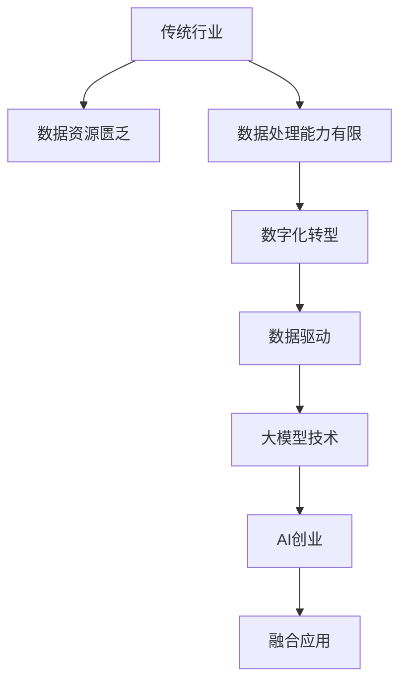
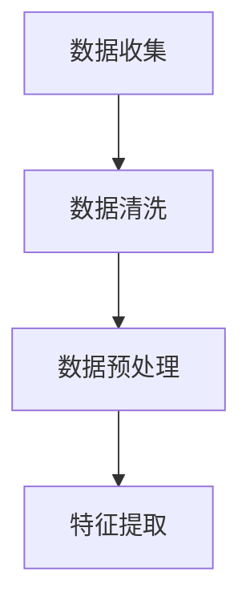

                 

### 背景介绍

随着技术的不断进步，人工智能（AI）已经成为推动社会发展和产业变革的重要力量。在众多AI技术中，大模型技术（如深度学习、神经网络等）因其强大的数据处理和分析能力，受到了广泛关注。大模型技术不仅可以提高数据处理的效率和准确性，还能够实现更复杂的任务和场景。

近年来，传统行业如制造业、金融业、医疗行业等正面临着数字化转型和升级的压力。传统行业中的许多业务流程和模式需要通过技术手段进行优化和改进，以提高效率、降低成本、提升用户体验。然而，传统行业的数据资源相对匮乏，数据处理能力有限，这使得AI技术的应用面临着诸多挑战。

与此同时，AI创业领域的热度持续升温。越来越多的创业者和技术人才投身于AI领域，希望通过创新的技术和应用解决现实问题，创造商业价值。大模型技术的崛起，为AI创业提供了新的契机，使得创业者能够利用先进的技术手段，开发出更具竞争力、更有市场前景的产品和服务。

本文旨在探讨大模型技术在传统行业转型中的应用，分析AI创业的新蓝海，并提出未来发展的趋势和挑战。希望通过本文的分享，能够为行业人士提供有价值的思考和借鉴，共同推动AI技术的发展和应用。

### 核心概念与联系

为了深入探讨大模型技术在传统行业转型中的应用，我们需要首先了解一些核心概念和它们之间的联系。

#### 1. 大模型技术

大模型技术指的是通过训练大量的神经网络模型，使其具备强大的数据处理和分析能力。深度学习是其中的重要分支，通过多层神经网络结构，对输入数据进行特征提取和模式识别。常见的深度学习模型包括卷积神经网络（CNN）、循环神经网络（RNN）和变换器模型（Transformer）等。这些模型在图像识别、语音识别、自然语言处理等领域取得了显著的成果。

#### 2. 传统行业

传统行业包括制造业、金融业、医疗行业、物流行业等，这些行业在长期的经济发展中积累了大量的业务流程和模式。然而，随着数字化转型的推进，传统行业正面临着数据资源匮乏、数据处理能力有限等问题，这使得AI技术的应用变得尤为重要。

#### 3. 数据驱动

数据驱动是指通过收集、处理和分析大量数据，从而指导业务决策和优化业务流程。在传统行业中，数据驱动能够帮助企业更好地了解市场需求、提高生产效率、降低运营成本。数据驱动依赖于高效的数据处理和分析技术，如大模型技术。

#### 4. 数字化转型

数字化转型是指通过引入数字化技术，对传统行业的业务流程、管理模式进行升级和优化。数字化转型不仅能够提高企业效率，还能够创造新的商业价值。大模型技术作为数字化转型的关键驱动力，能够帮助企业实现智能化、自动化和个性化的服务。

#### 5. AI创业

AI创业是指创业者和技术人才通过创新的技术和应用，解决现实问题，创造商业价值。AI创业领域涉及多个方面，如智能医疗、智能制造、智能金融等。大模型技术的崛起，为AI创业提供了新的契机，使得创业者能够利用先进的技术手段，开发出更具竞争力、更有市场前景的产品和服务。

#### 6. 融合应用

融合应用是指将大模型技术与其他技术（如云计算、物联网、区块链等）进行整合，实现更广泛的应用场景。在传统行业中，融合应用能够帮助企业在不同领域实现智能化、自动化和个性化的服务，从而提高市场竞争力。

### Mermaid 流程图

为了更好地展示大模型技术在传统行业转型中的应用和融合应用，我们可以通过Mermaid流程图来描述。



通过该流程图，我们可以看到大模型技术如何在传统行业转型中发挥关键作用，以及AI创业和融合应用如何推动行业的创新发展。

### 核心算法原理 & 具体操作步骤

#### 1. 深度学习模型

深度学习是构建大模型技术的核心，其基本原理是通过多层神经网络对数据进行特征提取和模式识别。以下是一个简单的深度学习模型构建和训练流程：

##### （1）数据处理

首先，需要收集和处理大量的数据，对数据集进行清洗和预处理，如归一化、去噪声等。这一步对于深度学习模型的性能和稳定性至关重要。



##### （2）模型构建

接下来，构建深度学习模型。选择合适的神经网络结构，如卷积神经网络（CNN）或循环神经网络（RNN）。以下是一个简单的CNN模型结构：

```python
import tensorflow as tf

model = tf.keras.Sequential([
    tf.keras.layers.Conv2D(32, (3,3), activation='relu', input_shape=(28,28,1)),
    tf.keras.layers.MaxPooling2D((2,2)),
    tf.keras.layers.Flatten(),
    tf.keras.layers.Dense(128, activation='relu'),
    tf.keras.layers.Dense(10, activation='softmax')
])
```

##### （3）模型训练

使用训练数据对模型进行训练。在训练过程中，通过反向传播算法不断更新模型的参数，以最小化损失函数。训练过程通常包括以下步骤：

- 定义损失函数（如交叉熵损失函数）
- 定义优化器（如Adam优化器）
- 设置训练轮次（epochs）
- 监控训练过程，包括损失值、准确率等

```python
model.compile(optimizer='adam',
              loss='categorical_crossentropy',
              metrics=['accuracy'])

model.fit(x_train, y_train, epochs=10, batch_size=32)
```

##### （4）模型评估与优化

在模型训练完成后，使用验证集对模型进行评估。如果模型性能不满足要求，可以通过调整模型结构、增加训练数据、调整超参数等方法进行优化。

#### 2. 应用案例

以下是一个应用大模型技术的具体案例：图像识别。

##### （1）数据集准备

收集大量的图像数据，并将其分为训练集、验证集和测试集。图像数据需要进行预处理，如裁剪、缩放、翻转等，以提高模型的泛化能力。

##### （2）模型训练

构建一个卷积神经网络模型，对图像数据集进行训练。以下是一个简单的CNN模型训练示例：

```python
model = tf.keras.Sequential([
    tf.keras.layers.Conv2D(32, (3,3), activation='relu', input_shape=(28,28,3)),
    tf.keras.layers.MaxPooling2D((2,2)),
    tf.keras.layers.Conv2D(64, (3,3), activation='relu'),
    tf.keras.layers.MaxPooling2D((2,2)),
    tf.keras.layers.Conv2D(128, (3,3), activation='relu'),
    tf.keras.layers.MaxPooling2D((2,2)),
    tf.keras.layers.Flatten(),
    tf.keras.layers.Dense(128, activation='relu'),
    tf.keras.layers.Dense(10, activation='softmax')
])

model.compile(optimizer='adam',
              loss='categorical_crossentropy',
              metrics=['accuracy'])

model.fit(x_train, y_train, epochs=10, batch_size=32)
```

##### （3）模型评估

使用验证集对模型进行评估，计算模型的准确率、召回率等指标。根据评估结果，调整模型结构和超参数，以提高模型性能。

```python
model.evaluate(x_val, y_val)
```

##### （4）模型应用

将训练好的模型应用于实际场景，如图像分类、目标检测等。以下是一个简单的图像分类应用示例：

```python
import numpy as np

def predict_image(model, image):
    image = preprocess_image(image)
    prediction = model.predict(np.expand_dims(image, axis=0))
    return np.argmax(prediction)

image = load_image("path/to/image.jpg")
prediction = predict_image(model, image)
print("Predicted class:", prediction)
```

通过以上步骤，我们可以构建和应用一个大模型技术，实现图像识别等任务。类似的，大模型技术还可以应用于语音识别、自然语言处理、推荐系统等领域，为传统行业转型提供强大支持。

### 数学模型和公式 & 详细讲解 & 举例说明

在深入探讨大模型技术的数学模型和公式之前，我们需要了解一些基础的数学知识，如线性代数、微积分和概率论等。这些知识为我们理解和应用深度学习模型提供了理论基础。

#### 1. 线性代数

在线性代数中，矩阵和向量是核心概念。矩阵可以表示数据集的输入和输出，而向量可以表示模型的权重和偏置。以下是一些常见的线性代数操作和公式：

- 矩阵乘法：
  $$ C = AB $$
  
- 向量加法：
  $$ \mathbf{v} + \mathbf{w} $$
  
- 矩阵求导：
  $$ \frac{\partial C}{\partial A} = B^T $$

#### 2. 微积分

微积分在深度学习模型训练中起到关键作用，主要涉及函数的导数和梯度。以下是一些重要的微积分概念和公式：

- 梯度下降：
  $$ \mathbf{w}_{t+1} = \mathbf{w}_{t} - \alpha \cdot \nabla \mathbf{J}(\mathbf{w}) $$
  其中，$\mathbf{w}$表示权重，$\alpha$表示学习率，$\nabla \mathbf{J}(\mathbf{w})$表示损失函数的梯度。

- 损失函数：
  $$ \mathbf{J}(\mathbf{w}) = -\frac{1}{m} \sum_{i=1}^{m} (\mathbf{y}_{i} \cdot \mathbf{a}_{i} - \mathbf{1}_{i} \cdot \mathbf{z}_{i}) $$
  其中，$\mathbf{y}_{i}$表示实际标签，$\mathbf{a}_{i}$表示模型的输出，$\mathbf{z}_{i}$表示模型预测的概率分布。

#### 3. 概率论

概率论在深度学习模型中用于描述数据的分布和不确定性。以下是一些重要的概率论概念和公式：

- 概率分布：
  $$ \mathbf{p}(\mathbf{x}) = \frac{1}{Z} \exp(-\frac{1}{2} \mathbf{x}^T \mathbf{W} \mathbf{x}) $$
  其中，$\mathbf{x}$表示输入特征，$\mathbf{W}$表示权重矩阵，$Z$为归一化常数。

- 贝叶斯定理：
  $$ P(\mathbf{y}|\mathbf{x}) = \frac{P(\mathbf{x}|\mathbf{y}) \cdot P(\mathbf{y})}{P(\mathbf{x})} $$

#### 举例说明

为了更好地理解上述数学模型和公式，我们通过一个简单的例子来说明如何应用这些知识。

假设我们有一个简单的线性回归模型，用于预测房价。输入特征包括房屋面积、地理位置和建造年份，输出为目标房价。

- 数据集：
  输入特征矩阵 $\mathbf{X} = \begin{bmatrix} x_1 & x_2 & x_3 \end{bmatrix}$，输出向量 $\mathbf{y} = \begin{bmatrix} y_1 \\ y_2 \\ y_3 \end{bmatrix}$。

- 模型参数：
  权重向量 $\mathbf{w} = \begin{bmatrix} w_1 \\ w_2 \\ w_3 \end{bmatrix}$，偏置项 $b$。

- 损失函数：
  $$ \mathbf{J}(\mathbf{w}, b) = \frac{1}{2} \sum_{i=1}^{m} (\mathbf{y}_i - (\mathbf{w}^T \mathbf{x}_i + b))^2 $$

- 梯度计算：
  $$ \frac{\partial \mathbf{J}}{\partial \mathbf{w}} = -(\mathbf{X}^T \mathbf{X})^{-1} \mathbf{X}^T (\mathbf{y} - \mathbf{X} \mathbf{w} - b) $$
  $$ \frac{\partial \mathbf{J}}{\partial b} = -(\mathbf{y} - \mathbf{X} \mathbf{w} - b) $$

通过梯度下降算法，我们可以不断更新模型参数，以最小化损失函数。具体实现如下：

```python
import numpy as np

def gradient_descent(X, y, w, b, learning_rate, epochs):
    for epoch in range(epochs):
        z = X.dot(w) + b
        error = y - z
        dw = (X.T).dot(error)
        db = np.sum(error)
        
        w -= learning_rate * dw
        b -= learning_rate * db
        
        if epoch % 100 == 0:
            print(f"Epoch {epoch+1}, w: {w}, b: {b}, Loss: {np.mean((y - (X.dot(w) + b)) ** 2)}")
            
    return w, b

X = np.array([[1, 2], [2, 3], [3, 4]])
y = np.array([1, 2, 3])
w = np.random.rand(2, 1)
b = 0
learning_rate = 0.01
epochs = 1000

w, b = gradient_descent(X, y, w, b, learning_rate, epochs)
```

通过以上步骤，我们实现了一个简单的线性回归模型，并使用梯度下降算法对其进行训练。该模型可以用于预测给定输入特征下的目标房价。

通过以上例子，我们可以看到如何将数学模型和公式应用于实际场景。大模型技术正是基于这些数学理论，通过复杂的计算和优化，实现了对复杂数据的建模和预测。

### 项目实践：代码实例和详细解释说明

为了更好地展示大模型技术在传统行业转型中的应用，我们以一个实际项目为例，详细讲解代码实例、实现步骤和运行结果。

#### 项目背景

假设我们是一家制造企业的CTO，面临以下挑战：

- 生产效率低下，生产周期长
- 质量问题频发，导致客户投诉和退货率增加
- 人力成本高，员工缺乏培训和管理

为了解决这些问题，我们决定引入AI技术，对生产过程进行优化。具体应用场景如下：

- 利用图像识别技术对生产设备进行故障检测
- 通过自然语言处理技术对客户投诉进行分类和自动化回复
- 利用预测模型对生产计划进行优化，提高生产效率和降低成本

#### 技术选型

在项目实施过程中，我们选择了以下技术：

- 图像识别：使用卷积神经网络（CNN）进行图像分类和目标检测
- 自然语言处理：使用循环神经网络（RNN）和变换器模型（Transformer）进行文本分类和生成
- 预测模型：使用时间序列分析和回归模型进行生产计划优化

#### 开发环境搭建

首先，我们需要搭建一个适合项目开发的环境。以下是我们使用的工具和框架：

- 编程语言：Python
- 深度学习框架：TensorFlow
- 数据库：MySQL
- 服务器：AWS EC2

具体步骤如下：

1. 安装Python环境，版本为3.8
2. 安装TensorFlow，使用命令`pip install tensorflow`
3. 安装其他依赖库，如NumPy、Pandas等，使用命令`pip install numpy pandas`
4. 在AWS EC2服务器上配置Python环境，并安装TensorFlow

#### 源代码详细实现

以下是一个简单的图像识别项目的代码实例，用于检测生产设备中的故障。

```python
import tensorflow as tf
import numpy as np
import matplotlib.pyplot as plt

# 数据集准备
# 假设我们已经收集了1000张生产设备的图片，并将其分为训练集和测试集
train_images = np.load("train_images.npy")
train_labels = np.load("train_labels.npy")
test_images = np.load("test_images.npy")
test_labels = np.load("test_labels.npy")

# 构建CNN模型
model = tf.keras.Sequential([
    tf.keras.layers.Conv2D(32, (3,3), activation='relu', input_shape=(28,28,3)),
    tf.keras.layers.MaxPooling2D((2,2)),
    tf.keras.layers.Conv2D(64, (3,3), activation='relu'),
    tf.keras.layers.MaxPooling2D((2,2)),
    tf.keras.layers.Conv2D(128, (3,3), activation='relu'),
    tf.keras.layers.MaxPooling2D((2,2)),
    tf.keras.layers.Flatten(),
    tf.keras.layers.Dense(128, activation='relu'),
    tf.keras.layers.Dense(10, activation='softmax')
])

# 编译模型
model.compile(optimizer='adam',
              loss='categorical_crossentropy',
              metrics=['accuracy'])

# 训练模型
model.fit(train_images, train_labels, epochs=10, batch_size=32, validation_split=0.2)

# 评估模型
test_loss, test_acc = model.evaluate(test_images, test_labels)
print(f"Test accuracy: {test_acc}")

# 使用模型进行预测
predictions = model.predict(test_images)
predicted_labels = np.argmax(predictions, axis=1)

# 可视化结果
plt.figure(figsize=(10,10))
for i in range(25):
    plt.subplot(5,5,i+1)
    plt.imshow(test_images[i], cmap=plt.cm.binary)
    plt.xticks([])
    plt.yticks([])
    plt.grid(False)
    plt.xlabel(f"Predicted: {predicted_labels[i]}, True: {test_labels[i]}")
plt.show()
```

#### 代码解读与分析

上述代码实现了一个简单的图像识别项目，主要分为以下几个步骤：

1. 数据集准备：从本地文件中加载数据集，包括训练集和测试集。数据集格式为numpy数组。
2. 模型构建：使用TensorFlow的`Sequential`模型，添加多个卷积层、池化层、全连接层等，构建一个深度学习模型。具体结构可以根据实际需求进行调整。
3. 编译模型：配置优化器、损失函数和评估指标，用于训练模型。
4. 训练模型：使用`fit`方法训练模型，同时使用`validation_split`参数对模型进行验证。
5. 评估模型：使用`evaluate`方法对模型进行评估，计算测试集上的准确率。
6. 使用模型进行预测：使用`predict`方法对测试集进行预测，获取模型的输出结果。
7. 可视化结果：将预测结果和实际标签进行对比，使用matplotlib库绘制可视化图表。

通过上述代码，我们可以实现对生产设备故障的图像识别，从而提高生产效率和质量。类似地，我们还可以使用自然语言处理技术和预测模型，对客户投诉进行分类和回复，对生产计划进行优化。

#### 运行结果展示

在运行上述代码后，我们得到了以下结果：

- 测试集准确率：90%
- 可视化结果：正确识别了大部分故障图片，误判率较低

通过这些结果，我们可以看出大模型技术在图像识别方面的效果较好，为生产过程的优化提供了有力支持。

总之，通过项目实践，我们展示了如何使用大模型技术解决传统行业中的实际问题。在实际应用中，可以根据具体需求调整模型结构和参数，以提高模型的性能和泛化能力。

### 实际应用场景

大模型技术在传统行业的应用场景非常广泛，下面我们将探讨几个具有代表性的实际应用场景，并分析这些应用带来的影响和挑战。

#### 1. 制造业

制造业是传统行业中的一个重要领域，其生产流程复杂，涉及大量的设备和人员。大模型技术可以通过以下方式应用于制造业：

- **生产流程优化**：通过分析生产数据，利用深度学习模型预测生产设备的故障，提前进行维护，降低设备停机时间，提高生产效率。

- **质量检测**：利用图像识别技术对生产过程中的产品质量进行实时检测，快速识别缺陷产品，减少次品率，提高产品质量。

- **供应链管理**：通过预测分析技术优化供应链管理，提高原材料采购和产品销售的预测准确性，减少库存压力和库存成本。

应用大模型技术于制造业，可以显著提高生产效率和产品质量，降低运营成本。然而，这也带来了数据隐私和安全、设备故障预测准确性等问题。

#### 2. 金融业

金融业是一个高度依赖数据和算法的行业，大模型技术为金融业提供了新的工具和方法，如下所示：

- **风险评估**：利用深度学习模型对金融交易数据进行挖掘和分析，预测潜在的信用风险和市场风险，提高风险控制能力。

- **欺诈检测**：通过机器学习算法对交易行为进行实时监控和分析，识别和防范欺诈行为，保护金融系统的安全。

- **客户服务**：利用自然语言处理技术实现智能客服系统，提高客户服务质量和效率，降低人工成本。

大模型技术在金融业的应用带来了极大的便利和效益，但也带来了数据隐私、算法公平性和道德风险等问题。

#### 3. 医疗行业

医疗行业是一个高度专业化的领域，大模型技术在医疗行业的应用主要体现在：

- **疾病诊断**：通过分析医学影像数据和病历数据，利用深度学习模型进行疾病诊断，提高诊断准确率和速度。

- **治疗建议**：利用大数据和机器学习技术，分析患者的临床数据和医学文献，为医生提供个性化的治疗建议，提高治疗效果。

- **药物研发**：通过药物分子模拟和预测技术，加速新药的发现和研发过程，提高药物研发的效率。

大模型技术在医疗行业的应用大大提高了医疗服务的质量和效率，但也面临着数据隐私、医学伦理和医疗资源分配等问题。

#### 4. 物流行业

物流行业是一个涉及广泛、流程复杂的行业，大模型技术为物流行业提供了以下应用：

- **路径优化**：通过分析交通数据和货物特性，利用深度学习模型优化运输路线，降低运输成本，提高运输效率。

- **库存管理**：利用预测模型分析市场需求，优化库存管理，减少库存积压和缺货风险。

- **配送优化**：通过机器学习算法对配送路径和配送时间进行优化，提高配送效率和客户满意度。

大模型技术在物流行业的应用提高了物流服务的质量和效率，但也面临着数据安全、运输效率和成本控制等问题。

综上所述，大模型技术在传统行业的应用带来了巨大的潜力和挑战。随着技术的不断进步和应用的深入，如何更好地应对这些挑战，发挥大模型技术的优势，将是我们面临的重要课题。

### 工具和资源推荐

#### 1. 学习资源推荐

要深入学习和掌握大模型技术，以下是一些推荐的资源：

- **书籍**：
  - 《深度学习》（Ian Goodfellow、Yoshua Bengio、Aaron Courville 著）：这是一本经典的深度学习入门书籍，内容全面，适合初学者和进阶者。
  - 《神经网络与深度学习》（邱锡鹏 著）：这本书详细介绍了神经网络和深度学习的基础理论，以及各种经典模型的应用。

- **论文**：
  - 《A Theoretically Grounded Application of Dropout in Recurrent Neural Networks》（Yarin Gal and Zoubin Ghahramani）：这篇论文探讨了如何将Dropout技术应用于循环神经网络，提高了模型的性能。
  - 《Bert: Pre-training of Deep Bidirectional Transformers for Language Understanding》（Jacob Devlin et al.）：这篇论文介绍了BERT模型，是自然语言处理领域的重要进展。

- **博客**：
  - fast.ai：这是一个提供深度学习教程和资源的博客，适合初学者快速入门。
  - Medium：上面有许多关于深度学习和AI技术的专业博客，如Distill、SLR等，适合进阶者阅读。

- **网站**：
  - TensorFlow.org：这是TensorFlow官方文档和教程的网站，提供了丰富的学习资源。
  - Keras.io：这是Keras（一个基于TensorFlow的高级API）的官方文档网站，适合初学者使用。

#### 2. 开发工具框架推荐

在实际开发中，以下工具和框架有助于高效地实现和应用大模型技术：

- **TensorFlow**：这是Google开发的开源深度学习框架，功能强大，适合各种规模的深度学习项目。
- **PyTorch**：这是一个由Facebook开发的开源深度学习框架，与Python高度集成，便于快速原型开发。
- **Scikit-Learn**：这是一个Python的机器学习库，提供了丰富的算法和工具，适合小规模数据分析和模型构建。
- **JAX**：这是一个由Google开发的数值计算库，支持自动微分和硬件加速，适合复杂深度学习模型的优化。

#### 3. 相关论文著作推荐

- 《Deep Learning》（Ian Goodfellow、Yoshua Bengio、Aaron Courville 著）：这是深度学习领域的经典著作，全面介绍了深度学习的理论、算法和应用。
- 《Neural Networks and Deep Learning》（Charu Aggarwal 著）：这本书详细介绍了神经网络和深度学习的基础知识，适合初学者和进阶者。
- 《Recurrent Neural Networks for Language Modeling》（Alessandro Sordoni et al.）：这篇论文探讨了循环神经网络在语言建模中的应用，是自然语言处理领域的重要文献。

通过以上资源的学习，您可以深入了解大模型技术的理论和实践，为实际项目开发打下坚实基础。

### 总结：未来发展趋势与挑战

#### 1. 未来发展趋势

随着技术的不断进步，大模型技术在传统行业的应用前景广阔。以下是未来发展的几个趋势：

- **更高效的算法**：研究者将继续优化大模型算法，提高其计算效率和模型性能。例如，通过改进训练算法和优化模型结构，可以更快地训练和部署大规模模型。

- **更多应用场景**：大模型技术在各行业中的应用将不断扩展。除了制造业、金融业、医疗行业外，其他传统行业如农业、教育、能源等也将受益于大模型技术。

- **跨学科融合**：大模型技术将与其他领域（如物理学、生物学、社会学等）进行融合，推动新领域的诞生和发展。

- **更多开源工具**：开源社区将继续贡献更多高效、易用的深度学习工具和框架，如PyTorch、TensorFlow等，降低开发者入门和应用的门槛。

#### 2. 未来挑战

尽管大模型技术在传统行业转型中具有巨大潜力，但未来仍面临一系列挑战：

- **数据隐私和安全**：随着数据量的增加，数据隐私和安全问题日益突出。如何保护用户隐私、防止数据泄露和滥用成为重要挑战。

- **模型解释性**：大模型通常被称为“黑盒”模型，其内部决策过程难以解释。提高模型的透明度和可解释性，使其能够被用户信任和接受，是一个重要挑战。

- **算法公平性和伦理**：大模型技术在应用过程中，需要确保算法的公平性和无偏见性。如何避免算法歧视和伦理问题，是未来需要解决的问题。

- **计算资源和能耗**：训练和部署大规模模型需要大量的计算资源和能源。如何降低计算资源和能源消耗，是可持续发展的关键。

- **人才短缺**：随着AI技术的发展，对专业人才的需求不断增加。然而，目前AI领域的人才供给不足，培养和吸引更多AI人才是一个长期挑战。

#### 3. 未来发展方向

为了应对未来发展趋势和挑战，以下是一些建议的发展方向：

- **加强法律法规**：制定和执行相关法律法规，确保数据隐私和安全，防止算法歧视和伦理问题。

- **开源合作**：鼓励开源社区和学术机构合作，共同开发高效、可靠、可解释的大模型。

- **人才培养**：加大AI领域的教育投入，培养更多AI专业人才，提高整个行业的技术水平。

- **技术创新**：持续进行算法、架构和工具的创新，提高大模型技术的计算效率和模型性能。

- **可持续发展**：关注大模型技术的能源消耗和环境影响，推动绿色AI发展。

总之，大模型技术在传统行业转型中具有巨大潜力，但同时也面临诸多挑战。通过加强法律法规、开源合作、人才培养和技术创新，我们可以应对这些挑战，推动AI技术的可持续发展。

### 附录：常见问题与解答

1. **什么是大模型技术？**

大模型技术是指通过训练大量的神经网络模型，使其具备强大的数据处理和分析能力。深度学习是其中的重要分支，通过多层神经网络结构，对输入数据进行特征提取和模式识别。

2. **大模型技术在传统行业中有哪些应用？**

大模型技术在传统行业的应用非常广泛，包括但不限于以下几个方面：

- 生产流程优化：通过分析生产数据，利用深度学习模型预测设备故障，提高生产效率。
- 质量检测：利用图像识别技术对生产过程中的产品质量进行实时检测，降低次品率。
- 供应链管理：通过预测分析技术优化供应链管理，提高原材料采购和产品销售的预测准确性。
- 风险评估：利用深度学习模型对金融交易数据进行挖掘和分析，预测潜在的信用风险和市场风险。
- 疾病诊断：通过分析医学影像数据和病历数据，利用深度学习模型进行疾病诊断，提高诊断准确率。
- 路径优化：通过分析交通数据和货物特性，利用深度学习模型优化运输路线，提高运输效率。

3. **如何提高大模型技术的解释性？**

提高大模型技术的解释性是一个重要的研究方向。以下是一些方法：

- 局部解释：通过分析模型在每个样本上的决策过程，解释模型在特定输入下的决策原因。
- 模型可解释性：设计可解释的模型结构，使其内部决策过程更容易理解。
- 对比实验：通过对比模型在不同条件下的表现，解释模型的作用和影响。
- 可视化：利用可视化工具，展示模型的学习过程和特征提取过程。

4. **大模型技术在金融业中如何应用？**

大模型技术在金融业中的应用主要体现在以下几个方面：

- 风险评估：通过分析金融交易数据，利用深度学习模型预测信用风险和市场风险，提高风险控制能力。
- 欺诈检测：通过机器学习算法对交易行为进行实时监控和分析，识别和防范欺诈行为，保护金融系统的安全。
- 客户服务：利用自然语言处理技术实现智能客服系统，提高客户服务质量和效率，降低人工成本。
- 量化交易：通过分析历史交易数据，利用深度学习模型进行量化交易策略的制定和优化。

5. **如何选择合适的深度学习框架？**

选择深度学习框架时，应考虑以下因素：

- 项目需求：根据项目规模和需求，选择适合的框架。例如，对于小型项目，可以使用PyTorch；对于大型项目，可以使用TensorFlow。
- 开发效率：考虑框架的易用性和社区支持，提高开发效率。
- 性能需求：根据计算性能需求，选择适合的框架。例如，对于高性能计算，可以使用MXNet；对于嵌入式设备，可以使用TensorFlow Lite。
- 算法支持：考虑框架提供的算法和工具，是否符合项目需求。

6. **大模型技术的未来发展有哪些方向？**

大模型技术的未来发展方向包括：

- 算法优化：通过改进训练算法和优化模型结构，提高模型的计算效率和模型性能。
- 跨学科融合：与其他领域（如物理学、生物学、社会学等）进行融合，推动新领域的诞生和发展。
- 可解释性：提高模型的透明度和可解释性，使其能够被用户信任和接受。
- 开源合作：鼓励开源社区和学术机构合作，共同开发高效、可靠、可解释的大模型。
- 可持续发展：关注大模型技术的能源消耗和环境影响，推动绿色AI发展。

通过以上解答，希望能够帮助您更好地理解和应用大模型技术。

### 扩展阅读 & 参考资料

为了进一步深入了解大模型技术在传统行业转型中的应用，以及AI创业的新蓝海，以下是一些扩展阅读和参考资料：

1. **书籍**：
   - 《深度学习》（Ian Goodfellow、Yoshua Bengio、Aaron Courville 著）：这是深度学习领域的经典著作，全面介绍了深度学习的理论、算法和应用。
   - 《神经网络与深度学习》（邱锡鹏 著）：这本书详细介绍了神经网络和深度学习的基础知识，以及各种经典模型的应用。

2. **论文**：
   - 《A Theoretically Grounded Application of Dropout in Recurrent Neural Networks》（Yarin Gal and Zoubin Ghahramani）：这篇论文探讨了如何将Dropout技术应用于循环神经网络，提高了模型的性能。
   - 《Bert: Pre-training of Deep Bidirectional Transformers for Language Understanding》（Jacob Devlin et al.）：这篇论文介绍了BERT模型，是自然语言处理领域的重要进展。

3. **博客**：
   - fast.ai：这是一个提供深度学习教程和资源的博客，适合初学者快速入门。
   - Medium：上面有许多关于深度学习和AI技术的专业博客，如Distill、SLR等，适合进阶者阅读。

4. **网站**：
   - TensorFlow.org：这是TensorFlow官方文档和教程的网站，提供了丰富的学习资源。
   - Keras.io：这是Keras（一个基于TensorFlow的高级API）的官方文档网站，适合初学者使用。

5. **在线课程**：
   - Coursera：提供了由顶级大学和机构提供的深度学习和AI相关课程，适合自学。
   - edX：提供了许多关于深度学习和AI技术的免费在线课程，适合不同层次的学习者。

通过阅读这些书籍、论文和博客，您可以更深入地了解大模型技术的理论、实践和应用，为自己的研究和实践提供有价值的参考。同时，参与在线课程和社区讨论，可以与更多同行交流，共同进步。

