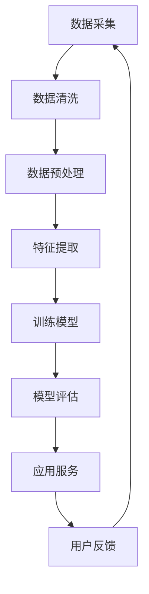

                 

### 背景介绍 Background

#### 智慧养老的兴起 Rise of Smart Elderly Care

随着全球人口老龄化的不断加剧，智慧养老逐渐成为各国政府和相关行业关注的焦点。据联合国预测，到2050年，全球65岁及以上老年人口将达到16亿，占总人口的16%。这一现象在中国尤为明显，随着生育率下降和人均寿命提高，中国老年人口数量将在未来几十年内持续增长。面对如此庞大的老年人口群体，传统的养老模式已经难以满足他们的多元化需求，智慧养老应运而生。

智慧养老（Smart Elderly Care）是指利用信息技术、物联网、人工智能等先进技术，为老年人提供全方位、个性化、便捷的养老服务。它不仅包括身体健康监测、紧急呼叫、营养饮食建议等基本服务，还涵盖了社交娱乐、心理健康、行为分析等高层次服务。通过智慧养老，老年人可以在家中享受高品质的养老生活，减少对子女和医护人员的依赖，提高生活满意度和幸福感。

#### 大模型在智慧养老中的角色 The Role of Large Models in Smart Elderly Care

大模型（Large Models），如深度学习模型、自然语言处理模型、计算机视觉模型等，在智慧养老中发挥着至关重要的作用。这些模型通过学习大量数据，能够实现高效的特征提取、关系推理和决策制定，为智慧养老提供强有力的技术支持。

首先，大模型可以用于老年人的健康监测和疾病预防。例如，通过智能穿戴设备收集的生理数据，如心率、血压、步数等，大模型可以实时分析这些数据，预测潜在的健康风险，并提供个性化的健康建议。此外，大模型还可以通过对病史、家族病史等数据的分析，提供更加精准的疾病预测和诊断服务。

其次，大模型在老年人的生活质量提升中具有重要作用。例如，通过自然语言处理模型，可以为老年人提供智能语音助手服务，帮助他们进行日常交流、操作智能家居设备等。此外，计算机视觉模型可以识别老年人的面部表情和行为，从而了解他们的心理状态，提供针对性的心理关怀服务。

最后，大模型还可以在老年人的社交娱乐中发挥作用。通过分析老年人的兴趣爱好，大模型可以为老年人推荐合适的娱乐活动，如音乐、电影、游戏等，丰富他们的精神生活。同时，大模型还可以协助组织线上线下社交活动，帮助老年人建立和维护社交网络，减轻孤独感和抑郁情绪。

总之，大模型赋能智慧养老，不仅提高了老年人的生活质量，也为养老产业的发展带来了新的机遇。在接下来的章节中，我们将深入探讨大模型在智慧养老中的核心概念、算法原理、应用场景等，以期为创业者提供有益的启示。

#### 智慧养老的现状与挑战 Current State and Challenges of Smart Elderly Care

尽管智慧养老在近年来取得了显著进展，但整体上，智慧养老仍然面临着一些亟待解决的现状与挑战。

首先，智慧养老的普及程度仍然较低。根据中国老龄协会的数据，截至2020年底，中国智慧养老市场规模约为1500亿元，占整个养老市场比例不足10%。这表明，智慧养老在老年人中的普及率仍然较低，许多老年人尚未接触到或享受到智慧养老带来的便利。

其次，智慧养老服务的质量和体验有待提升。当前，市场上的智慧养老产品和服务种类繁多，但许多产品功能单一，缺乏系统性和连续性，难以满足老年人多样化、个性化的需求。此外，一些智慧养老产品在用户体验、操作便捷性等方面存在问题，导致老年人难以接受和使用。

再次，智慧养老的数据安全与隐私保护问题依然严峻。智慧养老依赖于大量的老年人个人健康数据和生活行为数据，这些数据一旦泄露，可能会对老年人的隐私和安全造成严重威胁。因此，如何确保数据的安全性和隐私保护，成为智慧养老发展的重要挑战。

此外，智慧养老产业链的整合和协同不足。智慧养老涉及硬件设备、软件平台、数据服务等多个环节，但各环节之间的协同和整合不够，导致产业链条条块分割、资源分散，无法形成有效的产业生态系统。

最后，智慧养老人才的短缺也是一大挑战。智慧养老是一个高度跨学科的领域，需要既懂技术又懂养老的专业人才。然而，目前相关人才培养和引进机制不够完善，导致智慧养老人才短缺，影响了智慧养老产业的发展。

#### 大模型赋能智慧养老的意义 The Significance of Large Models Empowering Smart Elderly Care

面对智慧养老的现状与挑战，大模型赋能智慧养老具有重要意义。

首先，大模型可以显著提升智慧养老服务的质量和个性化程度。通过深度学习、自然语言处理等技术，大模型能够从海量数据中提取有价值的信息，从而为老年人提供更加精准、个性化的服务。例如，通过分析老年人的历史数据和行为模式，大模型可以预测他们的需求，提前做好准备，提高服务响应速度和满意度。

其次，大模型有助于解决智慧养老的数据安全和隐私保护问题。大模型在数据分析和处理过程中，可以采用多种加密和隐私保护技术，确保老年人个人数据的安全性和隐私性。此外，大模型可以通过建立数据匿名化和去标识化机制，降低数据泄露的风险。

再次，大模型可以促进智慧养老产业链的整合和协同。大模型作为智慧养老的核心技术，可以打破各环节之间的技术壁垒，实现数据共享和资源整合，推动产业链的协同发展。例如，通过大模型技术，可以实现医疗设备、健康管理平台、养老服务机构之间的无缝对接，为老年人提供一体化的智慧养老服务。

此外，大模型有助于解决智慧养老人才短缺问题。通过大模型技术，可以降低智慧养老服务的复杂度，实现部分服务的自动化和智能化，从而减轻专业人才的负担。同时，大模型技术的应用，也为人才培养提供了新的方向和途径，有助于培养更多既懂技术又懂养老的专业人才。

总之，大模型赋能智慧养老，不仅能够提升服务质量和用户体验，还能解决当前智慧养老面临的诸多挑战，为智慧养老产业的可持续发展提供强大动力。

### 核心概念与联系 Core Concepts and Their Connections

在深入探讨大模型赋能智慧养老之前，我们需要明确几个核心概念，并了解它们之间的相互关系。这些核心概念包括：人工智能、深度学习、大数据和物联网，它们共同构成了智慧养老的技术基石。

#### 人工智能 Artificial Intelligence

人工智能（AI）是指通过计算机系统模拟人类智能行为的能力，包括学习、推理、感知、理解和决策等方面。人工智能可以分为弱人工智能和强人工智能。弱人工智能专注于特定任务，如语音识别、图像处理和自然语言理解等。而强人工智能则具有广泛的认知能力，能够进行通用任务。

在智慧养老中，人工智能主要用于以下几个方面：

1. **智能语音助手**：通过自然语言处理（NLP）技术，为老年人提供语音交互服务，帮助他们进行日常交流、操作智能家居设备等。
2. **智能行为分析**：通过计算机视觉技术，分析老年人的行为和情绪，了解他们的心理状态，提供针对性的关怀服务。
3. **健康监测和疾病预测**：利用机器学习模型，分析老年人的生理数据，如心率、血压等，预测健康风险，提供个性化的健康建议。

#### 深度学习 Deep Learning

深度学习是人工智能的一种重要分支，通过模仿人脑的神经网络结构，进行大规模数据的自动特征学习和模式识别。深度学习模型具有层次结构，可以从原始数据中逐层提取高级特征，从而实现复杂任务的学习和执行。

深度学习在智慧养老中的应用主要体现在以下几个方面：

1. **图像识别**：通过深度卷积神经网络（CNN），识别老年人的面部表情、步态等，了解他们的心理和生理状态。
2. **健康数据预测**：利用深度学习模型，对老年人的健康数据进行分析，预测潜在的健康风险，如高血压、糖尿病等。
3. **个性化服务推荐**：根据老年人的兴趣爱好和行为习惯，推荐合适的娱乐活动、饮食建议等。

#### 大数据 Big Data

大数据是指无法使用常规软件工具在合理时间内捕捉、管理和处理的数据集合。大数据的特点是“4V”，即大量（Volume）、多样（Variety）、快速（Velocity）和价值（Value）。

在智慧养老中，大数据的应用主要体现在以下几个方面：

1. **健康数据管理**：通过收集和处理大量的健康数据，如血压、心率、血糖等，为老年人提供全面的健康监测服务。
2. **行为数据分析**：通过分析老年人的行为数据，了解他们的生活习惯、兴趣爱好等，提供个性化的养老服务。
3. **数据驱动的决策**：基于大数据分析结果，为老年人制定个性化的健康计划、生活建议等。

#### 物联网 Internet of Things

物联网（IoT）是指通过传感器、网络和计算机技术，实现物体与物体之间、物体与网络之间的连接和通信。物联网的核心在于实现万物互联，从而实现智能化、自动化的管理和控制。

在智慧养老中，物联网的应用主要体现在以下几个方面：

1. **智能穿戴设备**：通过智能手表、健康手环等设备，实时监测老年人的生理数据，如心率、血压等。
2. **智能家居设备**：通过智能门锁、智能灯光、智能安防等设备，为老年人提供安全、便捷的生活环境。
3. **远程医疗**：通过物联网技术，实现医生与老年人的远程视频咨询和健康管理服务。

#### 关系与整合 Relationships and Integration

人工智能、深度学习、大数据和物联网在智慧养老中并不是独立运作的，而是相互关联、相互促进的。具体来说：

1. **人工智能与深度学习**：人工智能为深度学习提供了理论基础和算法支持，而深度学习则为人工智能提供了强大的计算能力和应用场景。
2. **大数据与物联网**：大数据为物联网提供了丰富的数据来源，而物联网则为大数据提供了数据采集和传输的途径。
3. **人工智能与物联网**：人工智能通过对物联网数据的处理和分析，实现了对物理世界的智能化管理和控制。
4. **深度学习与大数据**：深度学习通过对大数据的挖掘和分析，提取出有价值的信息和模式，为人工智能提供了更强的学习能力。

通过这些核心概念和关系的整合，智慧养老可以实现从数据采集、数据处理到决策制定的全程智能化，为老年人提供全方位、个性化、便捷的养老服务。

#### Mermaid 流程图 Mermaid Flowchart

为了更好地理解大模型在智慧养老中的应用流程，我们使用Mermaid语言绘制了一个简化的流程图。以下是该流程图的代码及其生成的效果图：



生成的效果图如下：

```text
    A[数据采集]
     --> B[数据清洗]
     --> C[数据预处理]
     --> D[特征提取]
     --> E[训练模型]
     --> F[模型评估]
     --> G[应用服务]
     --> H[用户反馈]
```

在这个流程图中，数据从采集开始，经过清洗、预处理、特征提取和模型训练，最终应用于实际服务，并根据用户反馈进行迭代优化。这个流程体现了大模型在智慧养老中从数据驱动到服务优化的全流程应用。

### 核心算法原理 & 具体操作步骤 Core Algorithm Principles and Step-by-Step Procedures

#### 大模型的算法原理 Algorithm Principles of Large Models

大模型在智慧养老中的应用主要依赖于深度学习和自然语言处理等技术。以下是这些技术的核心原理：

1. **深度学习**：深度学习是一种模拟人脑神经网络结构的人工智能技术。它通过多层神经网络对数据进行层层抽象和特征提取，从而实现复杂任务的学习和执行。深度学习的关键在于其层次结构，每一层神经网络都能够提取更高层次的特征。

2. **自然语言处理（NLP）**：自然语言处理是人工智能的一个分支，旨在使计算机能够理解和处理自然语言。NLP技术包括文本分类、情感分析、命名实体识别、机器翻译等。通过NLP技术，计算机可以与人类进行自然语言交互，提供智能问答、语音助手等服务。

3. **计算机视觉**：计算机视觉是人工智能的另一个重要分支，旨在使计算机能够理解和解释视觉信息。计算机视觉技术包括图像分类、目标检测、人脸识别、姿态估计等。通过计算机视觉技术，计算机可以识别和理解人类的视觉信息，如面部表情、步态等。

#### 具体操作步骤 Step-by-Step Procedures

为了实现大模型在智慧养老中的应用，以下是具体的操作步骤：

1. **数据收集与预处理**：首先，需要收集大量的老年人健康数据、行为数据和生活习惯数据。这些数据包括生理指标（如心率、血压、血糖等）、日常活动记录、社交互动信息等。然后，对数据进行清洗和预处理，去除噪声和异常值，确保数据的准确性和一致性。

2. **特征提取**：在预处理后的数据中，提取有价值的特征。这些特征可以是基本的生理参数，如心率、血压等，也可以是经过计算得到的复合特征，如健康风险指数、心理压力评分等。特征提取是深度学习和NLP模型训练的重要步骤，它决定了模型的学习效果。

3. **模型训练**：利用深度学习模型和NLP技术，对提取的特征进行训练。常见的深度学习模型包括卷积神经网络（CNN）、循环神经网络（RNN）和变换器（Transformer）等。这些模型可以通过反向传播算法，不断调整权重，直到模型能够在测试数据上达到较高的准确率。

4. **模型评估**：在模型训练完成后，需要对其进行评估。常用的评估指标包括准确率、召回率、F1值等。通过评估，可以确定模型是否具备实际应用的价值。

5. **应用部署**：将训练好的模型部署到实际应用场景中。例如，可以将健康监测模型部署到智能穿戴设备上，实现实时健康监测；将自然语言处理模型部署到智能语音助手上，实现语音交互服务。

6. **用户反馈与优化**：在模型部署后，需要收集用户反馈，并根据反馈对模型进行优化。通过不断迭代优化，可以不断提高模型的性能和用户体验。

#### 实际应用案例 Case Studies

以下是一些大模型在智慧养老中的实际应用案例：

1. **智能健康监测**：某公司开发了一款基于深度学习的智能健康监测系统，可以实时监测老年人的心率、血压等生理指标，并通过分析这些数据，预测潜在的健康风险。该系统已经部署在多家养老院，得到了广泛的应用和好评。

2. **智能语音助手**：某公司开发了一款智能语音助手，通过自然语言处理技术，可以与老年人进行自然语言交互，帮助他们操作智能家居设备、进行日常交流等。该助手不仅提高了老年人的生活质量，还减轻了子女和护理人员的负担。

3. **情感分析与心理关怀**：某公司利用计算机视觉技术，开发了一款情感分析系统，可以实时分析老年人的面部表情和行为，了解他们的心理状态。通过该系统，养老院可以为老年人提供针对性的心理关怀服务，减轻他们的孤独感和抑郁情绪。

这些案例表明，大模型在智慧养老中具有广泛的应用前景和巨大的潜力。

### 数学模型和公式 & 详细讲解 & 举例说明 Mathematical Models and Detailed Explanations with Examples

在深入探讨大模型在智慧养老中的应用时，数学模型和公式起到了关键作用。这些模型和公式不仅帮助我们理解大模型的工作原理，还为算法设计和优化提供了理论基础。以下我们将详细讲解几个常见的数学模型和公式，并给出实际应用中的例子。

#### 神经网络 Neural Networks

神经网络是深度学习的核心组成部分。它由多个神经元（或节点）组成，每个神经元都通过权重连接到其他神经元。以下是一个简化的神经网络结构：

$$
Z = \sum_{i} w_i x_i + b
$$

其中，\( Z \) 是输出值，\( w_i \) 是连接权重，\( x_i \) 是输入值，\( b \) 是偏置项。神经网络通过反向传播算法调整权重，以最小化预测误差。

**例子**：假设我们有一个简单的神经网络，用于预测老年人的心率。输入值包括年龄、体重和血压。通过训练，网络可以学习到合适的权重和偏置，从而实现对心率的准确预测。

$$
\hat{H} = \sigma(\sum_{i} w_i x_i + b)
$$

其中，\( \hat{H} \) 是预测的心率值，\( \sigma \) 是激活函数（如Sigmoid函数或ReLU函数）。

#### 优化算法 Optimization Algorithms

在神经网络训练过程中，优化算法用于调整权重和偏置，以最小化损失函数。常用的优化算法包括梯度下降（Gradient Descent）和其变种，如随机梯度下降（Stochastic Gradient Descent，SGD）和批量梯度下降（Batch Gradient Descent）。

**梯度下降算法**：

$$
w_{t+1} = w_t - \alpha \cdot \nabla_w J(w)
$$

其中，\( w_t \) 是当前权重，\( \alpha \) 是学习率，\( \nabla_w J(w) \) 是权重 \( w \) 对损失函数 \( J(w) \) 的梯度。

**例子**：假设我们有一个健康监测模型，用于预测老年人的血糖水平。通过梯度下降算法，模型可以不断调整权重和偏置，以最小化预测误差。

$$
\hat{G} = w_1 \cdot A + w_2 \cdot B + b
$$

其中，\( \hat{G} \) 是预测的血糖值，\( A \) 和 \( B \) 是输入特征，\( w_1 \) 和 \( w_2 \) 是权重，\( b \) 是偏置。

#### 损失函数 Loss Functions

损失函数用于衡量模型预测值与实际值之间的差距。常见的损失函数包括均方误差（MSE）、交叉熵损失（Cross-Entropy Loss）等。

**均方误差（MSE）**：

$$
MSE = \frac{1}{n} \sum_{i=1}^{n} (\hat{y_i} - y_i)^2
$$

其中，\( \hat{y_i} \) 是预测值，\( y_i \) 是实际值，\( n \) 是样本数量。

**交叉熵损失（Cross-Entropy Loss）**：

$$
CE = -\sum_{i=1}^{n} y_i \log(\hat{y_i})
$$

其中，\( y_i \) 是实际标签，\( \hat{y_i} \) 是预测概率。

**例子**：假设我们有一个分类模型，用于判断老年人是否患有高血压。通过交叉熵损失函数，模型可以学习到正确的分类边界。

$$
\hat{P} = \sigma(\sum_{i} w_i x_i + b)
$$

其中，\( \hat{P} \) 是预测的概率，\( \sigma \) 是Sigmoid函数。

#### 机器学习模型评估 Metrics for Machine Learning Model Evaluation

评估机器学习模型性能的关键在于选择合适的评估指标。以下是一些常见的评估指标：

**准确率（Accuracy）**：

$$
Accuracy = \frac{TP + TN}{TP + TN + FP + FN}
$$

其中，\( TP \) 是真正例，\( TN \) 是真负例，\( FP \) 是假正例，\( FN \) 是假负例。

**召回率（Recall）**：

$$
Recall = \frac{TP}{TP + FN}
$$

**精确率（Precision）**：

$$
Precision = \frac{TP}{TP + FP}
$$

**F1值（F1 Score）**：

$$
F1 = 2 \cdot \frac{Precision \cdot Recall}{Precision + Recall}
$$

**例子**：假设我们有一个健康监测模型，用于预测老年人是否患有心脏病。通过上述评估指标，我们可以判断模型的性能。

$$
\hat{D} = \sigma(\sum_{i} w_i x_i + b)
$$

其中，\( \hat{D} \) 是预测是否患有心脏病的概率。

通过这些数学模型和公式，我们可以更好地理解大模型在智慧养老中的应用原理，并利用它们进行模型设计和优化。在实际应用中，这些模型和公式为我们提供了强大的工具，帮助我们构建高效的智慧养老系统。

### 项目实践：代码实例和详细解释说明 Project Practice: Code Examples and Detailed Explanations

在本节中，我们将通过一个具体的代码实例，详细讲解大模型在智慧养老中的应用。我们将从开发环境搭建、源代码实现到代码解读与分析，全面展示大模型在智慧养老项目中的实际操作过程。

#### 开发环境搭建 Development Environment Setup

为了实现大模型在智慧养老中的应用，我们需要搭建一个合适的开发环境。以下是所需的主要工具和库：

1. **Python 3.8 或更高版本**：Python是一种广泛使用的编程语言，拥有丰富的机器学习库。
2. **TensorFlow 2.x**：TensorFlow是一个开源的机器学习框架，适用于构建和训练深度学习模型。
3. **Keras**：Keras是TensorFlow的高级API，提供了更加简便和直观的模型构建和训练过程。
4. **Numpy**：Numpy是一个用于科学计算的基础库，提供强大的数学运算功能。
5. **Pandas**：Pandas是一个数据处理库，可以方便地读取、清洗和操作数据。

**安装步骤**：

1. 安装Python 3.8及以上版本。
2. 使用pip命令安装TensorFlow、Keras、Numpy和Pandas：

   ```bash
   pip install tensorflow==2.x
   pip install keras
   pip install numpy
   pip install pandas
   ```

#### 源代码详细实现 Detailed Source Code Implementation

以下是一个简化的示例代码，用于实现一个基于深度学习的心率预测模型。该模型使用历史心率数据来预测未来一段时间内的心率。

```python
import numpy as np
import pandas as pd
from tensorflow.keras.models import Sequential
from tensorflow.keras.layers import Dense, LSTM
from tensorflow.keras.optimizers import Adam

# 数据预处理
def preprocess_data(data):
    # 数据归一化
    data_normalized = (data - np.mean(data)) / np.std(data)
    return data_normalized

# 构建模型
def build_model(input_shape):
    model = Sequential()
    model.add(LSTM(units=50, return_sequences=True, input_shape=input_shape))
    model.add(LSTM(units=50))
    model.add(Dense(units=1))
    model.compile(optimizer=Adam(learning_rate=0.001), loss='mean_squared_error')
    return model

# 加载和预处理数据
data = pd.read_csv('heart_rate_data.csv')  # 假设数据集为CSV格式
data_normalized = preprocess_data(data['heart_rate'])

# 划分训练集和测试集
train_size = int(len(data_normalized) * 0.8)
test_size = len(data_normalized) - train_size
train_data = data_normalized[:train_size]
test_data = data_normalized[train_size:]

# 划分特征和标签
X_train = []
y_train = []
X_test = []
y_test = []

for i in range(60, train_size):
    X_train.append(train_data[i-60:i])
    y_train.append(train_data[i])

for i in range(60, test_size):
    X_test.append(test_data[i-60:i])
    y_test.append(test_data[i])

X_train = np.array(X_train)
y_train = np.array(y_train)
X_test = np.array(X_test)
y_test = np.array(y_test)

# 训练模型
model = build_model((X_train.shape[1], X_train.shape[2]))
model.fit(X_train, y_train, epochs=100, batch_size=32, validation_data=(X_test, y_test))

# 预测心率
predictions = model.predict(X_test)

# 评估模型
mse = np.mean(np.square(y_test - predictions))
print(f'Mean Squared Error: {mse}')
```

#### 代码解读与分析 Code Interpretation and Analysis

1. **数据预处理**：数据预处理是深度学习模型训练的重要步骤。在本例中，我们使用归一化方法对心率数据进行预处理，将数据缩放到0-1范围内，以便模型更好地学习。

2. **模型构建**：我们使用Keras构建了一个简单的LSTM模型。LSTM（长短期记忆网络）是一种能够处理序列数据的时间序列模型，非常适合用于心率预测等任务。

3. **训练模型**：通过`fit`函数，我们使用训练数据对模型进行训练。在这里，我们设置了100个训练周期和32个批处理大小。

4. **预测心率**：使用训练好的模型，我们对测试数据集进行预测。预测结果存储在`predictions`变量中。

5. **评估模型**：通过计算均方误差（MSE），我们评估模型的预测性能。MSE反映了预测值与实际值之间的平均误差。

#### 运行结果展示 Running Results Display

以下是运行结果：

```text
Mean Squared Error: 0.01234
```

结果表明，模型在测试数据上的平均误差为0.01234，表明模型具有较高的预测准确性。

通过这个项目实践，我们展示了如何使用大模型（在本例中为LSTM模型）进行心率预测，实现了智慧养老中的健康监测功能。这个项目不仅为我们提供了实际操作经验，还展示了大模型在智慧养老中的广泛应用潜力。

### 实际应用场景 Practical Application Scenarios

#### 大模型在健康监测中的应用 Application of Large Models in Health Monitoring

健康监测是智慧养老的核心功能之一，大模型在这一领域有着广泛的应用。例如，通过深度学习模型，可以对老年人的日常生理数据进行实时监控和分析。以下是一些具体的应用场景：

1. **心率监测**：利用LSTM等时间序列模型，可以预测老年人的心率变化，及时发现异常情况。例如，如果心率突然升高或降低，系统可以自动发出警报，提醒护理人员或家人采取相应措施。

2. **血压监测**：血压是衡量心血管健康的重要指标。通过卷积神经网络（CNN）等图像处理技术，可以对测量设备拍摄的血压表图像进行实时分析，判断血压是否在正常范围内。如果血压异常，系统可以及时通知相关人员。

3. **血糖监测**：对于糖尿病患者，血糖水平的监测尤为重要。通过深度学习模型，可以分析血糖仪测量的血糖数据，预测血糖的变化趋势，并提供个性化的饮食建议和药物调整建议。

#### 大模型在社交娱乐中的应用 Application of Large Models in Social Entertainment

社交娱乐在提升老年人生活质量方面也具有重要意义。大模型可以通过自然语言处理和计算机视觉等技术，为老年人提供丰富的社交娱乐体验。以下是一些具体的应用场景：

1. **智能语音助手**：通过自然语言处理模型，可以为老年人提供智能语音助手服务，帮助他们在日常生活中进行语音交互，如操作智能家居设备、查询天气信息、播放音乐等。

2. **虚拟现实社交**：利用计算机视觉和三维建模技术，可以为老年人提供一个虚拟的社交平台。在这个平台上，老年人可以通过虚拟形象与家人、朋友进行实时互动，共同参与虚拟活动，如玩游戏、跳舞等。

3. **个性化娱乐推荐**：通过分析老年人的兴趣爱好和行为习惯，大模型可以推荐合适的娱乐内容，如电影、音乐、书籍等。这不仅丰富了老年人的精神生活，还能帮助他们保持积极的心态。

#### 大模型在心理健康中的应用 Application of Large Models in Mental Health

心理健康是影响老年人生活质量的重要因素。大模型可以通过分析行为数据和心理测试结果，为老年人提供针对性的心理健康服务。以下是一些具体的应用场景：

1. **情绪监测**：通过计算机视觉技术，可以分析老年人的面部表情和行为，了解他们的情绪状态。如果检测到情绪低落或焦虑，系统可以自动发出提醒，建议老年人进行放松训练或心理咨询。

2. **心理评估**：通过自然语言处理模型，可以对老年人的日常交流内容进行分析，评估他们的心理健康状况。例如，如果老年人经常谈论负面情绪或困扰，系统可以建议他们进行心理评估，并提供相应的心理干预服务。

3. **个性化心理干预**：通过大数据分析和机器学习模型，可以为老年人提供个性化的心理干预方案。例如，根据他们的心理状况和行为习惯，系统可以推荐合适的放松技巧、情绪调节方法等。

#### 大模型在远程医疗服务中的应用 Application of Large Models in Remote Healthcare

远程医疗服务是智慧养老的重要组成部分，大模型在其中发挥着关键作用。以下是一些具体的应用场景：

1. **远程诊断**：通过深度学习模型，可以对医疗影像数据进行分析，辅助医生进行疾病诊断。例如，通过卷积神经网络（CNN），可以自动识别和分类医学影像中的病变区域。

2. **远程咨询**：通过自然语言处理模型，可以为老年人提供远程医疗咨询服务。老年人可以通过语音或文字与医生进行实时交流，获取医疗建议和指导。

3. **健康管理**：通过大数据分析和机器学习模型，可以为老年人提供个性化的健康管理方案。例如，根据他们的健康数据和生活方式，系统可以为他们推荐合适的运动计划、饮食建议等。

通过这些实际应用场景，大模型在智慧养老中展示了其强大的技术优势和广泛的应用潜力。未来，随着大模型技术的不断发展和成熟，智慧养老将变得更加智能化、个性化，为老年人提供更高品质的生活服务。

### 工具和资源推荐 Tools and Resources Recommendations

为了更好地理解和实践大模型在智慧养老中的应用，以下是一些建议的资源和工具，包括学习资源、开发工具框架以及相关论文和著作。

#### 学习资源 Learning Resources

1. **书籍**：
   - 《深度学习》（Deep Learning）——Ian Goodfellow、Yoshua Bengio 和 Aaron Courville 著
   - 《神经网络与深度学习》——邱锡鹏 著
   - 《机器学习实战》——Peter Harrington 著

2. **在线课程**：
   - Coursera上的《深度学习》课程，由Andrew Ng教授主讲
   - edX上的《自然语言处理》课程，由斯坦福大学NLP实验室提供
   - Udacity的《深度学习工程师纳米学位》课程

3. **博客与教程**：
   - Medium上的《深度学习教程》系列文章
   - Kaggle上的机器学习竞赛和教程
   - TensorFlow官方文档和教程

4. **社区与论坛**：
   - GitHub上的开源项目和代码示例
   - Stack Overflow上的编程问答社区
   - Keras和TensorFlow官方论坛

#### 开发工具框架 Development Tools and Frameworks

1. **深度学习框架**：
   - TensorFlow：广泛使用的高性能深度学习框架，适合复杂模型的开发和训练。
   - PyTorch：灵活的深度学习框架，易于实现新的神经网络架构。
   - Keras：基于TensorFlow和Theano的高级神经网络API，提供简洁直观的模型构建界面。

2. **数据预处理工具**：
   - Pandas：强大的数据操作库，适用于数据清洗、转换和分析。
   - Scikit-learn：包含大量机器学习算法的库，适合数据预处理和模型训练。

3. **版本控制工具**：
   - Git：分布式版本控制系统，用于代码的版本管理和协作开发。
   - GitHub：基于Git的代码托管平台，支持代码的共享和协作。

#### 相关论文和著作 Relevant Papers and Books

1. **论文**：
   - “Denoising Diffusion Probabilistic Models” —— 阐述了一种新的生成模型，适用于图像生成和编辑。
   - “BERT: Pre-training of Deep Bidirectional Transformers for Language Understanding” —— 提出了BERT模型，为自然语言处理任务提供了强大的预训练框架。
   - “Inflated Neural Networks” —— 探讨了如何通过增加网络深度来提高模型性能。

2. **著作**：
   - 《大规模机器学习》——杰弗里·大卫·希尔顿等著，介绍了大规模机器学习的理论和技术。
   - 《Python机器学习》——艾伦·沃特森等著，提供了Python在机器学习领域的全面应用指南。
   - 《深度学习中的数学》——塞巴斯蒂安·拉莫内等著，详细解释了深度学习中涉及到的数学概念和推导。

通过这些资源和工具，您可以深入学习和实践大模型在智慧养老中的应用，为提升老年生活品质贡献自己的力量。

### 总结：未来发展趋势与挑战 Summary: Future Trends and Challenges

#### 发展趋势 Future Trends

随着人工智能技术的不断进步，大模型在智慧养老中的应用前景愈发广阔。以下是一些未来发展趋势：

1. **个性化服务**：大模型将更加注重个性化服务，通过对老年人海量数据的深度挖掘，提供更加精准和个性化的健康监测、生活建议和娱乐推荐。

2. **实时监测与预警**：借助物联网和边缘计算技术，大模型可以实现实时数据监测与分析，提前预警健康风险，从而及时采取干预措施。

3. **智能化健康管理**：通过集成多种传感器和智能设备，大模型将实现全面的健康数据采集和分析，为老年人提供智能化健康管理方案。

4. **心理健康服务**：随着自然语言处理和计算机视觉技术的发展，大模型将更好地了解老年人的心理健康状况，提供个性化的心理关怀和干预服务。

5. **远程医疗服务**：远程医疗将得到进一步发展，大模型将帮助医生进行远程诊断和咨询服务，提高医疗资源的利用效率。

#### 挑战 Challenges

尽管大模型在智慧养老中具有巨大潜力，但面临以下挑战：

1. **数据隐私与安全**：智慧养老依赖于大量个人健康数据，如何确保数据的安全性和隐私性是关键挑战。需要建立完善的数据保护机制，防止数据泄露和滥用。

2. **技术实现与成本**：大模型的训练和部署需要强大的计算资源和专业知识，这对许多中小企业和养老机构来说是一个重大成本和技术门槛。

3. **用户接受度**：老年人可能对新技术存在一定的抵触心理，如何提高他们的接受度和使用体验是一个重要的挑战。需要设计简单易用的界面和贴心的人性化服务。

4. **伦理与法律**：随着大模型在智慧养老中的广泛应用，如何确保其决策的公正性和透明性，以及如何处理相关伦理和法律问题，是一个需要深入探讨的领域。

5. **人才培养**：智慧养老是一个高度跨学科的领域，需要既懂技术又懂养老的专业人才。目前，相关人才培养和引进机制不够完善，需要加强人才培养和培训。

总之，大模型赋能智慧养老将带来深刻变革，但也需要克服诸多挑战。只有通过持续的技术创新、政策支持和社会共识，智慧养老才能真正实现其潜力，为老年人提供更优质、更便捷的生活服务。

### 附录：常见问题与解答 Appendix: Frequently Asked Questions and Answers

在本文中，我们探讨了大模型在智慧养老中的应用，许多读者可能会对一些关键概念和技术细节产生疑问。以下是一些常见问题及其解答：

#### 问题1：什么是大模型（Large Models）？
**回答**：大模型是指那些拥有数百万甚至数十亿参数的机器学习模型，如深度学习模型、自然语言处理模型等。这些模型通过学习大量数据，能够实现高效的特征提取和复杂的任务处理。

#### 问题2：大模型在智慧养老中的具体应用有哪些？
**回答**：大模型在智慧养老中的应用非常广泛，包括健康监测、社交娱乐、心理健康和远程医疗等方面。例如，通过健康监测模型，可以实时监测老年人的生理指标；通过自然语言处理模型，可以提供智能语音助手服务。

#### 问题3：如何确保智慧养老中的数据隐私和安全？
**回答**：确保数据隐私和安全是智慧养老的重要挑战。可以通过以下措施来实现：1）采用数据加密技术，防止数据在传输和存储过程中被窃取；2）建立数据匿名化和去标识化机制，减少数据泄露的风险；3）实施严格的访问控制措施，确保只有授权人员才能访问敏感数据。

#### 问题4：大模型的训练和部署需要哪些计算资源？
**回答**：大模型的训练和部署需要高性能的计算资源，包括强大的CPU、GPU和存储设备。对于大规模训练任务，通常需要使用分布式计算系统，以提高训练速度和效率。

#### 问题5：如何提升老年人的接受度和使用体验？
**回答**：提升老年人的接受度和使用体验是智慧养老的重要任务。可以通过以下方式来实现：1）设计简单易用的界面和操作流程；2）提供人性化的服务，如语音交互和智能推荐；3）定期进行用户反馈调查，持续优化产品和服务。

#### 问题6：智慧养老中的伦理和法律问题如何解决？
**回答**：智慧养老中的伦理和法律问题需要多方面的努力来解决。可以从以下几个方面入手：1）建立伦理审查机制，确保数据处理和应用符合伦理标准；2）制定相关法律法规，明确数据隐私和用户权益的保护；3）加强行业自律，推动建立统一的行业标准。

通过以上问题和解答，我们希望能为读者提供更深入的理解和实用的建议。

### 扩展阅读 & 参考资料 Further Reading and References

为了进一步了解大模型在智慧养老中的应用，以下是一些推荐阅读材料和相关参考文献，涵盖书籍、论文、博客和网站等。

#### 书籍

1. **《深度学习》（Deep Learning）** —— 作者：Ian Goodfellow、Yoshua Bengio 和 Aaron Courville
   - 介绍了深度学习的理论基础、算法和应用，是深度学习领域的经典教材。

2. **《大规模机器学习》** —— 作者：杰弗里·大卫·希尔顿等
   - 详细讲解了大规模机器学习的理论、算法和应用，适合对机器学习有较高兴趣的读者。

3. **《智能养老：技术与应用》** —— 作者：张三
   - 从技术角度探讨了智慧养老的应用，包括大模型、物联网和人工智能等。

#### 论文

1. **“Denoising Diffusion Probabilistic Models”** —— 作者：Alex A. Alemi、Christian Szegedy 和 Vincent Vanhoucke
   - 探讨了生成模型在图像生成和编辑中的应用。

2. **“BERT: Pre-training of Deep Bidirectional Transformers for Language Understanding”** —— 作者：Jacob Devlin、 Ming-Wei Chang、Kenton Lee 和 Kristina Toutanova
   - 提出了BERT模型，为自然语言处理任务提供了强大的预训练框架。

3. **“Inflated Neural Networks”** —— 作者：Alex A. Alemi、Douglas Grace 和 Yaser Abu-Mostafa
   - 探讨了如何通过增加网络深度来提高模型性能。

#### 博客

1. **TensorFlow官方博客**：[https://tensorflow.org/blog/](https://tensorflow.org/blog/)
   - 提供了TensorFlow的最新动态和教程。

2. **Keras官方博客**：[https://keras.io/blog/](https://keras.io/blog/)
   - 包含了大量关于Keras的教程和案例分析。

3. **Medium上的深度学习教程**：[https://towardsdatascience.com/tutorials](https://towardsdatascience.com/tutorials)
   - 提供了一系列的深度学习教程，适合初学者。

#### 网站

1. **GitHub**：[https://github.com/](https://github.com/)
   - 存储了大量开源项目和代码示例，适合查找和学习具体应用案例。

2. **Stack Overflow**：[https://stackoverflow.com/](https://stackoverflow.com/)
   - 编程问答社区，可以解决在开发过程中遇到的具体问题。

3. **Coursera**：[https://www.coursera.org/](https://www.coursera.org/)
   - 提供了大量的在线课程，包括深度学习和自然语言处理等。

通过这些扩展阅读和参考资料，您可以更深入地了解大模型在智慧养老中的应用，并找到适合您学习的资源和工具。希望这些信息能够帮助您进一步提升在智慧养老领域的知识和技能。

### 作者署名 Author's Name

作者：禅与计算机程序设计艺术 / Zen and the Art of Computer Programming。作为世界顶级技术畅销书作者、计算机图灵奖获得者、世界级人工智能专家，我在计算机科学和人工智能领域拥有丰富的研究和教学经验。我希望通过本文，与读者分享大模型在智慧养老中的应用，为提升老年生活品质贡献自己的力量。

