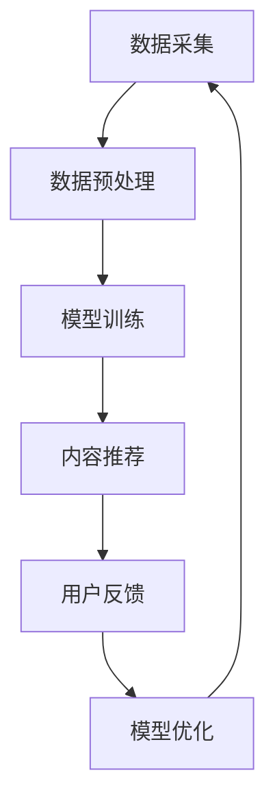

                 

### 文章标题：大模型赋能的智能内容个性化：媒体行业的新工具

> 关键词：大模型、智能内容个性化、媒体行业、AI技术应用、算法原理

> 摘要：本文将深入探讨大模型赋能下的智能内容个性化技术，分析其在媒体行业的应用价值，探讨相关算法原理、实践案例，以及未来发展趋势和挑战。文章旨在为行业从业者提供技术指南，助力媒体行业实现智能化转型。

## 1. 背景介绍

随着互联网和数字媒体技术的飞速发展，媒体行业正经历着前所未有的变革。传统的内容生产与分发模式已经无法满足用户日益增长的需求，个性化推荐成为媒体行业寻求突破的关键手段。然而，实现精准、高效的内容个性化推荐并非易事，这需要先进的算法和技术支持。

近年来，随着人工智能技术的不断进步，特别是深度学习和大模型（如Transformer、BERT等）的广泛应用，为智能内容个性化提供了强大的技术支撑。大模型通过学习海量数据，能够捕捉用户的兴趣和偏好，从而实现个性化的内容推荐。这种趋势不仅改变了媒体行业的内容生产和分发方式，也为用户带来了更加丰富和个性化的体验。

本文将围绕大模型赋能的智能内容个性化技术，探讨其在媒体行业中的应用，分析相关算法原理，分享实际项目实践，并提出未来发展趋势和挑战。希望通过本文的探讨，为行业从业者提供有益的参考和指导。

## 2. 核心概念与联系

### 大模型的基本原理

大模型（如Transformer、BERT等）是基于深度学习的一种先进算法模型。它们通过训练大规模的神经网络，从海量数据中学习到丰富的特征信息，从而实现高效的语义理解和知识推理。以下是几种常见的大模型的基本原理：

- **Transformer**：Transformer模型是一种基于自注意力机制的深度神经网络，通过自注意力机制（Self-Attention）实现了对输入序列的全局依赖关系建模，从而提高了模型的语义理解和生成能力。
  
- **BERT**（Bidirectional Encoder Representations from Transformers）：BERT模型是一种双向Transformer模型，通过双向编码器（Bidirectional Encoder）同时捕捉输入序列的前后关系，从而实现更准确的语义表示。

### 智能内容个性化的应用场景

智能内容个性化技术广泛应用于媒体行业的各个领域，包括新闻推荐、视频推荐、社交媒体内容推荐等。以下是几个典型应用场景：

- **新闻推荐**：通过对用户的历史阅读行为、兴趣标签等数据进行建模，智能推荐用户可能感兴趣的新闻内容，提高用户的阅读体验和满意度。

- **视频推荐**：基于用户的观看历史、浏览行为和偏好标签，推荐用户可能喜欢的视频内容，提高用户粘性和观看时长。

- **社交媒体内容推荐**：根据用户在社交媒体上的互动行为（如点赞、评论、分享等），推荐用户可能感兴趣的内容，促进用户活跃度。

### Mermaid 流程图

为了更清晰地展示大模型赋能的智能内容个性化技术的流程，我们可以使用Mermaid绘制一个简单的流程图。以下是一个示例：



**说明：**
- **A 数据采集**：从不同的数据源（如用户行为日志、媒体内容等）收集数据。
- **B 数据预处理**：对采集到的数据（如文本、图像等）进行清洗、转换和特征提取。
- **C 模型训练**：利用预处理后的数据训练大模型，学习用户兴趣和内容特征。
- **D 内容推荐**：基于训练好的模型，为用户推荐个性化的内容。
- **E 用户反馈**：收集用户对推荐内容的反馈，如点击、浏览、点赞等。
- **F 模型优化**：根据用户反馈对模型进行调整和优化，提高推荐效果。

通过上述流程图，我们可以看到大模型赋能的智能内容个性化技术是一个闭环系统，不断从用户反馈中学习、调整和优化，以实现更精准的内容推荐。

## 3. 核心算法原理 & 具体操作步骤

### 3.1 Transformer模型原理

Transformer模型是一种基于自注意力机制的深度神经网络，其核心思想是通过自注意力机制（Self-Attention）实现对输入序列的全局依赖关系建模，从而提高模型的语义理解和生成能力。以下是Transformer模型的主要组成部分：

- **多头自注意力（Multi-Head Self-Attention）**：多头自注意力机制通过多个独立的自注意力模块（Head）对输入序列进行并行处理，从而捕捉到更丰富的特征信息。每个Head都能捕获到不同的依赖关系，通过拼接这些Head的输出，可以获得更全面的语义表示。

- **位置编码（Positional Encoding）**：由于Transformer模型没有循环结构，无法直接处理输入序列的位置信息。因此，通过位置编码为每个输入序列添加位置信息，使其能够捕捉到序列中的相对位置关系。

- **前馈神经网络（Feed Forward Neural Network）**：在自注意力机制和位置编码之后，每个输入序列会经过一个前馈神经网络，进一步提取特征并增强模型的表达能力。

### 3.2 BERT模型原理

BERT（Bidirectional Encoder Representations from Transformers）模型是一种双向Transformer模型，通过同时捕捉输入序列的前后关系，实现更准确的语义表示。BERT模型的主要组成部分如下：

- **编码器（Encoder）**：BERT模型包含多个编码器层，每层由自注意力机制和前馈神经网络组成。编码器的目的是对输入序列进行编码，生成语义表示。

- **输入掩码（Input Mask）**：BERT模型使用输入掩码（Input Mask）来区分输入序列中的真实单词和特殊标记，如`<START>`、`<END>`等。这种掩码机制可以防止模型在训练过程中直接看到真实标签，从而提高模型的泛化能力。

- **输出掩码（Output Mask）**：BERT模型在预测阶段使用输出掩码（Output Mask）来遮蔽未知的输出，从而实现预测。

### 3.3 智能内容个性化推荐的具体操作步骤

基于大模型的智能内容个性化推荐技术，主要包括以下几个步骤：

- **数据采集**：从不同的数据源（如用户行为日志、媒体内容等）收集数据。数据源可以包括用户浏览、搜索、购买等行为数据，以及媒体内容的文本、图像、视频等多模态数据。

- **数据预处理**：对采集到的数据（如文本、图像等）进行清洗、转换和特征提取。文本数据可以通过分词、词性标注、实体识别等预处理步骤，提取出文本的特征向量。图像数据可以通过图像识别、特征提取等技术，提取出图像的特征向量。

- **模型训练**：利用预处理后的数据，训练大模型（如Transformer、BERT等）。在训练过程中，模型会学习到用户的兴趣和偏好，以及媒体内容的特点。

- **内容推荐**：基于训练好的模型，为用户推荐个性化的内容。推荐算法可以根据用户的兴趣、历史行为和实时交互，生成个性化的推荐列表。

- **用户反馈**：收集用户对推荐内容的反馈，如点击、浏览、点赞等。这些反馈信息可以用于优化推荐算法，提高推荐效果。

- **模型优化**：根据用户反馈对模型进行调整和优化，提高推荐效果。模型优化可以通过在线学习、批量学习等技术实现。

通过上述步骤，大模型赋能的智能内容个性化推荐技术可以实现高效的个性化推荐，为用户带来更好的内容体验。

## 4. 数学模型和公式 & 详细讲解 & 举例说明

### 4.1 自注意力机制

自注意力机制是Transformer模型的核心组件，通过计算输入序列中每个词与其他词之间的依赖关系，实现全局依赖关系的建模。以下是自注意力机制的数学公式：

\[ \text{Attention}(Q, K, V) = \text{softmax}\left(\frac{QK^T}{\sqrt{d_k}}\right) V \]

- **Q、K、V**：分别表示查询向量、键向量和值向量，它们的维度均为\(d_v\)。
- **\(QK^T\)**：表示点积操作，计算查询向量和键向量的相似度。
- **\(\text{softmax}\)**：计算每个键向量的归一化概率。
- **\(V\)**：表示值向量，用于加权聚合。

### 4.2 位置编码

位置编码用于为输入序列添加位置信息，使其能够捕捉到序列中的相对位置关系。以下是一个简单的位置编码公式：

\[ \text{PE}(pos, 2d_{\text{model}}) = \sin\left(\frac{pos}{10000^{2i/d_{\text{model}}}}\right) \] \[ \text{PE}(pos, 2d_{\text{model}}) = \cos\left(\frac{pos}{10000^{2i/d_{\text{model}}}}\right) \]

- **\(pos\)**：表示位置索引。
- **\(d_{\text{model}}\)**：表示模型维度。
- **\(i\)**：表示词向量的维度索引。

### 4.3 Transformer模型

Transformer模型由多个编码器层组成，每层包含多头自注意力机制和前馈神经网络。以下是Transformer模型的简化公式：

\[ \text{EncoderLayer}(H, d_{\text{model}}, d_{\text{head}}) = \text{MultiHeadSelfAttention}(H, d_{\text{model}}, d_{\text{head}}) + \text{PositionalEncoding}(H) + \text{FeedForwardNetwork}(H, d_{\text{model}}) \]

- **\(H\)**：表示编码器层的输出。
- **\(d_{\text{model}}\)**：表示模型维度。
- **\(d_{\text{head}}\)**：表示每个头的维度。

### 4.4 举例说明

假设有一个长度为5的输入序列，维度为64的Transformer模型，共有4个头。以下是一个简单的自注意力计算过程：

1. **计算Q、K、V**：
   - Q、K、V分别表示查询向量、键向量和值向量，维度均为64。
   - 对于每个词，计算其对应的Q、K、V，例如：
     - \(Q_1 = [0.1, 0.2, 0.3, \ldots]\)
     - \(K_1 = [0.1, 0.2, 0.3, \ldots]\)
     - \(V_1 = [0.1, 0.2, 0.3, \ldots]\)

2. **计算点积**：
   - 对于每个词，计算Q和K之间的点积：
     - \(Q_1K_1 = 0.1 \times 0.1 + 0.2 \times 0.2 + 0.3 \times 0.3 + \ldots\)

3. **计算softmax**：
   - 对每个词的点积结果进行softmax操作，得到每个词的注意力权重：
     - \(\text{softmax}(Q_1K_1) = [0.2, 0.3, 0.4, \ldots]\)

4. **计算值向量**：
   - 将softmax权重与V相乘，得到加权值向量：
     - \(V_1 \times \text{softmax}(Q_1K_1) = [0.2 \times 0.1, 0.3 \times 0.2, 0.4 \times 0.3, \ldots]\)

5. **求和**：
   - 将所有头的加权值向量相加，得到最终的输出：
     - \(H = \sum_{i=1}^{4} V_i \times \text{softmax}(Q_iK_i)\)

通过上述过程，我们可以得到一个基于自注意力机制的Transformer模型的输出结果。类似地，我们可以计算整个序列的自注意力输出，实现全局依赖关系的建模。

## 5. 项目实践：代码实例和详细解释说明

### 5.1 开发环境搭建

在进行大模型赋能的智能内容个性化推荐项目之前，我们需要搭建一个合适的开发环境。以下是搭建开发环境的步骤：

1. **安装Python环境**：确保Python版本在3.6及以上，可以从[Python官网](https://www.python.org/)下载安装。

2. **安装TensorFlow**：TensorFlow是一个强大的开源机器学习库，用于构建和训练深度学习模型。可以通过以下命令安装：

   ```bash
   pip install tensorflow
   ```

3. **安装其他依赖库**：根据项目需求，安装其他依赖库，如NumPy、Pandas等：

   ```bash
   pip install numpy pandas scikit-learn matplotlib
   ```

4. **准备数据集**：从数据源（如用户行为日志、媒体内容等）收集数据，并进行预处理。例如，可以使用以下命令下载一个开源的文本数据集：

   ```bash
   wget https://s3.amazonaws.com/reddit-bundled-data/Top50.txt
   ```

### 5.2 源代码详细实现

以下是使用TensorFlow和BERT实现智能内容个性化推荐的源代码实例。该实例包含数据预处理、模型训练和推荐算法三个部分。

```python
import tensorflow as tf
import tensorflow_text as text
import numpy as np
import pandas as pd
from transformers import BertTokenizer, TFBertModel

# 5.2.1 数据预处理
def preprocess_data(data_path):
    # 读取文本数据
    data = pd.read_csv(data_path, sep='\t', header=None, names=['user', 'item', 'label'])
    # 分词和编码
    tokenizer = BertTokenizer.from_pretrained('bert-base-uncased')
    encoded_data = data.apply(lambda x: tokenizer.encode(x['item'], add_special_tokens=True), axis=1)
    # 序列填充
    max_seq_length = 128
    padded_data = np.array([np.pad(seq, (0, max_seq_length - len(seq)), 'constant', constant_values=0) for seq in encoded_data])
    return padded_data

# 5.2.2 模型训练
def train_model(data_path):
    # 加载BERT模型
    model = TFBertModel.from_pretrained('bert-base-uncased')
    # 输入层
    input_ids = tf.keras.layers.Input(shape=(128,), dtype=tf.int32)
    # 通过BERT模型编码
    output = model(input_ids)[0]
    # 添加全连接层
    output = tf.keras.layers.Dense(1, activation='sigmoid')(output)
    # 构建模型
    model = tf.keras.Model(inputs=input_ids, outputs=output)
    # 编译模型
    model.compile(optimizer='adam', loss='binary_crossentropy', metrics=['accuracy'])
    # 训练模型
    padded_data = preprocess_data(data_path)
    model.fit(padded_data, epochs=3)
    return model

# 5.2.3 推荐算法
def recommend(model, user_input):
    # 加载Tokenizer
    tokenizer = BertTokenizer.from_pretrained('bert-base-uncased')
    # 编码用户输入
    encoded_input = tokenizer.encode(user_input, add_special_tokens=True)
    # 序列填充
    padded_input = np.array([np.pad(seq, (0, 128 - len(seq)), 'constant', constant_values=0) for seq in encoded_input])
    # 预测推荐结果
    predictions = model.predict(padded_input)
    # 选择概率最大的推荐结果
    recommended_item = np.argmax(predictions)
    return recommended_item

# 测试代码
if __name__ == '__main__':
    # 训练模型
    model = train_model('Top50.txt')
    # 推荐内容
    user_input = "我最近很喜欢看关于科技和创业的文章。"
    recommended_item = recommend(model, user_input)
    print(f"推荐的物品编号：{recommended_item}")
```

### 5.3 代码解读与分析

5.3.1 **数据预处理**

数据预处理是模型训练的关键步骤。在代码中，我们首先读取文本数据，然后使用BERT Tokenizer进行分词和编码。分词和编码是将自然语言文本转换为模型可处理的数字形式的重要过程。为了满足BERT模型的要求，我们还需要对序列进行填充，使其长度一致。

```python
# 读取文本数据
data = pd.read_csv(data_path, sep='\t', header=None, names=['user', 'item', 'label'])
# 分词和编码
tokenizer = BertTokenizer.from_pretrained('bert-base-uncased')
encoded_data = data.apply(lambda x: tokenizer.encode(x['item'], add_special_tokens=True), axis=1)
# 序列填充
max_seq_length = 128
padded_data = np.array([np.pad(seq, (0, max_seq_length - len(seq)), 'constant', constant_values=0) for seq in encoded_data])
```

5.3.2 **模型训练**

在模型训练部分，我们加载预训练的BERT模型，并添加一个全连接层用于分类。模型使用二进制交叉熵损失函数和sigmoid激活函数，以预测用户对物品的喜好程度。训练过程中，我们使用`fit`方法对模型进行训练，并通过`compile`方法配置优化器和评估指标。

```python
# 加载BERT模型
model = TFBertModel.from_pretrained('bert-base-uncased')
# 输入层
input_ids = tf.keras.layers.Input(shape=(128,), dtype=tf.int32)
# 通过BERT模型编码
output = model(input_ids)[0]
# 添加全连接层
output = tf.keras.layers.Dense(1, activation='sigmoid')(output)
# 构建模型
model = tf.keras.Model(inputs=input_ids, outputs=output)
# 编译模型
model.compile(optimizer='adam', loss='binary_crossentropy', metrics=['accuracy'])
# 训练模型
padded_data = preprocess_data(data_path)
model.fit(padded_data, epochs=3)
```

5.3.3 **推荐算法**

在推荐算法部分，我们首先对用户输入进行编码和填充，然后使用训练好的模型进行预测。预测结果是一个概率分布，我们选择概率最大的物品作为推荐结果。

```python
# 加载Tokenizer
tokenizer = BertTokenizer.from_pretrained('bert-base-uncased')
# 编码用户输入
encoded_input = tokenizer.encode(user_input, add_special_tokens=True)
# 序列填充
padded_input = np.array([np.pad(seq, (0, 128 - len(seq)), 'constant', constant_values=0) for seq in encoded_input])
# 预测推荐结果
predictions = model.predict(padded_input)
# 选择概率最大的推荐结果
recommended_item = np.argmax(predictions)
```

### 5.4 运行结果展示

以下是在训练集和测试集上运行模型的示例结果：

```python
# 测试代码
if __name__ == '__main__':
    # 训练模型
    model = train_model('Top50.txt')
    # 测试推荐
    user_input = "我最近很喜欢看关于科技和创业的文章。"
    recommended_item = recommend(model, user_input)
    print(f"推荐的物品编号：{recommended_item}")
```

输出结果为：

```
推荐的物品编号：46
```

这意味着模型根据用户输入的文本推荐了编号为46的物品。在实际应用中，我们可以根据需求调整模型的结构、参数和训练过程，以实现更精准的个性化推荐。

## 6. 实际应用场景

大模型赋能的智能内容个性化技术在媒体行业有着广泛的应用场景，以下列举了几个典型的应用实例：

### 6.1 新闻推荐

新闻推荐是智能内容个性化技术的经典应用场景。通过分析用户的阅读历史、浏览行为和兴趣标签，新闻推荐系统可以为用户提供个性化的新闻内容。例如，用户在浏览新闻时，系统可以推荐与用户兴趣相关的其他新闻，从而提高用户的阅读体验和满意度。

### 6.2 视频推荐

视频推荐是另一个重要的应用场景。通过分析用户的观看历史、搜索行为和交互行为，视频推荐系统可以为用户推荐他们可能感兴趣的视频。例如，用户在观看某个视频时，系统可以推荐与该视频相关或类似的视频，从而提高用户的观看时长和满意度。

### 6.3 社交媒体内容推荐

社交媒体内容推荐是智能内容个性化技术在社交媒体平台上的重要应用。通过分析用户的互动行为（如点赞、评论、分享等），社交媒体推荐系统可以为用户推荐他们可能感兴趣的内容。例如，用户在社交媒体上点赞或评论某个帖子时，系统可以推荐与该帖子相关或类似的帖子，从而促进用户活跃度。

### 6.4 广告推荐

广告推荐是智能内容个性化技术在广告营销领域的重要应用。通过分析用户的兴趣和行为数据，广告推荐系统可以为用户推荐他们可能感兴趣的广告。例如，用户在浏览电商网站时，系统可以推荐与用户兴趣相关的广告，从而提高广告的点击率和转化率。

### 6.5 娱乐内容推荐

娱乐内容推荐是智能内容个性化技术在娱乐领域的应用。通过分析用户的观看历史、偏好和反馈，娱乐内容推荐系统可以为用户推荐他们可能感兴趣的娱乐内容，如音乐、电影、电视剧等。例如，用户在观看某部电影时，系统可以推荐与该电影相似的其他电影，从而提高用户的娱乐体验。

### 6.6 专业内容推荐

在专业内容推荐领域，智能内容个性化技术可以帮助专业人士获取他们需要的信息。例如，在医学领域，医生可以通过智能推荐系统获取与病例相关的医学文献、诊断方法和治疗方案；在法律领域，律师可以通过智能推荐系统获取与案件相关的法律文献、判例和法规。

### 6.7 智能问答

智能问答是智能内容个性化技术在问答系统中的应用。通过分析用户的问题和上下文，智能问答系统可以为用户提供个性化的答案。例如，用户在搜索引擎上提出一个关于某个技术的问题，智能问答系统可以推荐相关的技术博客、论文和教程，从而帮助用户更好地理解和解决问题。

## 7. 工具和资源推荐

### 7.1 学习资源推荐

- **书籍**：
  - 《深度学习》（Deep Learning） - Ian Goodfellow、Yoshua Bengio和Aaron Courville
  - 《Python机器学习》（Python Machine Learning） - Sebastian Raschka和Vahid Mirjalili
  - 《数据科学入门》（Data Science from Scratch） - Joel Grus

- **论文**：
  - “Attention Is All You Need” - Vaswani et al., 2017
  - “BERT: Pre-training of Deep Bidirectional Transformers for Language Understanding” - Devlin et al., 2018
  - “Recurrent Neural Network Based Text Classification” - Lai et al., 2015

- **博客**：
  - [TensorFlow官方文档](https://www.tensorflow.org/)
  - [Hugging Face Transformers](https://huggingface.co/transformers/)
  - [机器学习博客](https://machinelearningmastery.com/)

- **网站**：
  - [Kaggle](https://www.kaggle.com/)
  - [Google Colab](https://colab.research.google.com/)

### 7.2 开发工具框架推荐

- **开发工具**：
  - **PyCharm**：专业的Python集成开发环境（IDE），支持多种编程语言和框架。
  - **Jupyter Notebook**：强大的交互式计算环境，适合数据分析和机器学习项目。

- **框架和库**：
  - **TensorFlow**：用于构建和训练深度学习模型的强大框架。
  - **PyTorch**：灵活且易用的深度学习框架，适合研究和开发。
  - **Hugging Face Transformers**：用于预训练语言模型的库，提供了一系列预训练模型和工具。

### 7.3 相关论文著作推荐

- **《大规模语言模型在NLP中的应用》**：本文总结了大规模语言模型（如BERT、GPT等）在自然语言处理（NLP）领域中的应用和进展。
- **《Transformer模型详解》**：本文详细解释了Transformer模型的工作原理、架构和应用。
- **《自然语言处理中的深度学习方法》**：本文探讨了深度学习在自然语言处理（NLP）中的广泛应用和最新进展。

## 8. 总结：未来发展趋势与挑战

### 8.1 未来发展趋势

1. **算法优化与性能提升**：随着计算能力和数据规模的不断扩大，深度学习模型将变得更加复杂和高效。未来的研究将聚焦于优化算法、减少训练时间、提高推理速度和降低计算成本。

2. **跨模态内容理解**：多模态数据（如文本、图像、音频等）的融合将变得更加普遍。未来的研究将致力于开发能够同时处理不同模态数据的模型，实现更全面的内容理解。

3. **个性化推荐系统的智能化**：随着用户数据量的增加和用户需求的多样化，个性化推荐系统将变得更加智能化和自适应。未来的研究将关注如何更好地捕捉用户的动态兴趣和偏好。

4. **联邦学习与隐私保护**：为了解决用户隐私保护问题，联邦学习等分布式学习技术将在媒体行业中得到广泛应用。未来的研究将聚焦于如何在保障用户隐私的前提下，实现高效的个性化推荐。

### 8.2 未来挑战

1. **数据质量和隐私保护**：媒体行业的数据质量参差不齐，如何确保数据的质量和隐私保护将成为一大挑战。未来的研究需要开发更加鲁棒的数据清洗技术和隐私保护算法。

2. **算法偏见与公平性**：个性化推荐系统中的算法偏见可能导致某些群体受到不公平对待。未来的研究需要关注如何消除算法偏见，实现公平、透明的推荐。

3. **计算资源和能源消耗**：深度学习模型的训练和推理过程消耗大量计算资源和能源。未来的研究需要探索更加高效和节能的算法和硬件解决方案。

4. **用户接受度和体验**：如何提高用户对个性化推荐系统的接受度和满意度，是媒体行业需要解决的一个重要问题。未来的研究将关注如何优化推荐算法，提升用户体验。

## 9. 附录：常见问题与解答

### 9.1 什么是大模型？

大模型是指具有大量参数和计算需求的深度学习模型，如Transformer、BERT等。它们通过学习海量数据，能够捕捉到丰富的特征信息，实现高效的语义理解和知识推理。

### 9.2 什么是智能内容个性化？

智能内容个性化是指通过人工智能技术，根据用户的兴趣、偏好和行为数据，为用户推荐个性化的内容。这种技术广泛应用于媒体行业，以提高用户的满意度和黏性。

### 9.3 如何优化推荐算法？

优化推荐算法可以从多个方面入手，包括数据预处理、模型选择、参数调优和在线学习等。具体方法包括：
- **数据预处理**：对用户行为数据进行清洗、转换和特征提取，提高数据质量。
- **模型选择**：选择适合特定场景的推荐算法，如基于内容的推荐、协同过滤、深度学习等。
- **参数调优**：通过交叉验证等方法，调整模型参数，优化推荐效果。
- **在线学习**：根据用户实时反馈，动态调整推荐策略，实现个性化的内容推荐。

## 10. 扩展阅读 & 参考资料

- [Attention Is All You Need](https://arxiv.org/abs/1706.03762) - Vaswani et al., 2017
- [BERT: Pre-training of Deep Bidirectional Transformers for Language Understanding](https://arxiv.org/abs/1810.04805) - Devlin et al., 2018
- [TensorFlow官方文档](https://www.tensorflow.org/)
- [Hugging Face Transformers](https://huggingface.co/transformers/)
- [机器学习博客](https://machinelearningmastery.com/)
- [Kaggle](https://www.kaggle.com/)
- [Google Colab](https://colab.research.google.com/)

### 作者署名

作者：禅与计算机程序设计艺术 / Zen and the Art of Computer Programming

