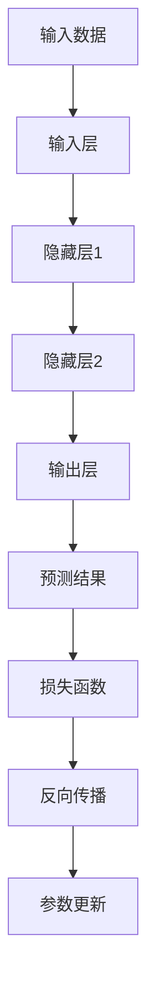

                 

### 文章标题：大模型赋能：AI 创业产品经理指南

#### 关键词：大模型，AI 创业，产品经理，赋能，技术指导

> 摘要：本文旨在为 AI 创业的初学者和产品经理提供一份实用指南，详细解析如何利用大模型赋能产品开发，包括核心概念的理解、算法原理的探讨、项目实践的示例以及实际应用场景的分析。通过本文，读者将了解如何在大模型领域内探索创新，提高产品竞争力。

### 1. 背景介绍

随着人工智能（AI）技术的迅猛发展，大模型（Large Models）已经成为当前 AI 领域的研究热点。大模型通常指的是具有数百万甚至数十亿个参数的神经网络模型，它们在自然语言处理（NLP）、计算机视觉（CV）、推荐系统等众多领域都取得了显著成效。这种模型具有强大的表达能力和泛化能力，能够在处理复杂数据时表现出色。

AI 创业则是在这种技术背景下的必然产物。随着技术的成熟，越来越多的创业公司开始利用 AI 技术来开发创新产品，提高市场竞争力。对于产品经理来说，如何理解和利用大模型技术成为了一项至关重要的能力。本文将详细介绍大模型的核心概念、算法原理、项目实践和实际应用，帮助产品经理在大模型赋能的浪潮中找到自己的定位。

### 2. 核心概念与联系

要深入理解大模型，我们首先需要了解以下几个核心概念：

#### 2.1 深度学习

深度学习（Deep Learning）是 AI 领域的一种重要技术，它通过构建多层神经网络来模拟人脑的神经结构，从而实现自动特征提取和模式识别。深度学习是构建大模型的基础。

#### 2.2 神经网络

神经网络（Neural Networks）是由大量简单神经元（或节点）组成的网络。每个神经元都与其他神经元相连，并通过权重和偏置进行加权求和，然后通过激活函数输出结果。神经网络是深度学习的核心组成部分。

#### 2.3 参数

参数（Parameters）是神经网络模型中的可调数值，它们用于调节模型的行为。在大模型中，参数的数量通常非常庞大，这赋予了模型强大的表达能力和灵活性。

#### 2.4 训练与优化

训练（Training）是深度学习模型的核心步骤，通过从大量数据中学习，模型能够调整其参数以最小化预测误差。优化（Optimization）则是训练过程中采用的一种算法，用于找到最小化损失函数的参数值。

#### 2.5 误差反向传播算法

误差反向传播算法（Backpropagation Algorithm）是一种用于训练神经网络的算法。它通过前向传播计算网络输出，然后反向传播误差，并更新网络参数，以逐步减小误差。

#### 2.6 大模型的架构

大模型的架构通常包括输入层、隐藏层和输出层。输入层接收外部输入数据，隐藏层进行特征提取和变换，输出层生成最终的预测结果。不同类型的大模型（如 Transformer、GPT 等）在架构上有所不同，但都遵循类似的原理。

#### 2.7 Mermaid 流程图

以下是用于表示大模型原理的 Mermaid 流程图：



### 3. 核心算法原理 & 具体操作步骤

#### 3.1 算法原理

大模型的算法原理主要基于深度学习和神经网络。以下是一个简化的算法流程：

1. **输入数据预处理**：将输入数据（如文本、图像等）进行预处理，例如归一化、填充等，以适应模型的输入要求。
2. **前向传播**：将预处理后的输入数据通过输入层传递到隐藏层，每层神经网络通过加权求和并应用激活函数，最终输出预测结果。
3. **计算损失**：将预测结果与真实标签进行比较，计算损失函数的值，例如均方误差（MSE）或交叉熵（Cross-Entropy）。
4. **反向传播**：从输出层开始，将误差信号反向传播到每一层，计算梯度并更新网络参数。
5. **参数更新**：根据梯度更新网络参数，以减小损失函数的值。
6. **迭代训练**：重复步骤 2-5，直到模型收敛或达到预定的训练次数。

#### 3.2 具体操作步骤

以下是一个具体的大模型训练步骤示例：

1. **数据集准备**：准备一个包含输入数据和标签的数据集，例如图像分类任务中的图像和对应的标签。
2. **模型初始化**：初始化网络参数，通常使用随机值或预训练的参数。
3. **输入数据预处理**：对输入数据进行预处理，例如归一化图像数据。
4. **前向传播**：将预处理后的输入数据通过输入层传递到隐藏层，计算输出结果。
5. **计算损失**：计算输出结果与真实标签之间的损失，例如使用均方误差（MSE）。
6. **反向传播**：计算损失函数关于网络参数的梯度，并更新网络参数。
7. **迭代训练**：重复步骤 4-6，直到模型收敛或达到预定的训练次数。
8. **模型评估**：使用验证集或测试集评估模型性能，例如计算准确率、召回率等。

### 4. 数学模型和公式 & 详细讲解 & 举例说明

#### 4.1 数学模型

大模型的数学模型主要包括两部分：前向传播和反向传播。

#### 4.1.1 前向传播

前向传播的公式可以表示为：

$$
Y = f(Z) = \sigma(W_2 \cdot Z_2 + b_2)
$$

其中，$Y$ 是输出层的结果，$Z$ 是隐藏层的输入，$f$ 是激活函数（例如 sigmoid 函数），$W_2$ 和 $b_2$ 分别是隐藏层的权重和偏置。

#### 4.1.2 反向传播

反向传播的公式可以表示为：

$$
\Delta W_2 = \alpha \cdot \frac{\partial L}{\partial Z_2}
$$

$$
\Delta b_2 = \alpha \cdot \frac{\partial L}{\partial Z_2}
$$

其中，$\Delta W_2$ 和 $\Delta b_2$ 分别是隐藏层的权重和偏置的更新，$L$ 是损失函数，$\alpha$ 是学习率。

#### 4.2 详细讲解

以下是对前向传播和反向传播的详细讲解：

**前向传播**：

前向传播的过程是将输入数据通过神经网络传递到输出层，并计算输出结果。具体步骤如下：

1. 将输入数据输入到输入层。
2. 通过输入层传递到隐藏层，计算隐藏层的输入和输出。
3. 将隐藏层的输出传递到输出层，计算输出结果。

**反向传播**：

反向传播的过程是根据输出结果和真实标签计算损失，并计算关于网络参数的梯度。具体步骤如下：

1. 计算输出结果和真实标签之间的损失。
2. 从输出层开始，计算损失关于隐藏层的梯度。
3. 将隐藏层的梯度传递到输入层，并计算输入层的梯度。
4. 根据梯度更新网络参数。

#### 4.3 举例说明

以下是一个简单的例子，假设我们有一个二分类问题，输入数据是一个 2 维向量，隐藏层有 1 个神经元，输出层有 2 个神经元。

输入数据：$X = \begin{bmatrix} 1 \\ 2 \end{bmatrix}$

隐藏层输入：$Z = W_1 \cdot X + b_1$

隐藏层输出：$A = \sigma(Z)$

输出层输入：$Z_2 = W_2 \cdot A + b_2$

输出层输出：$Y = \sigma(Z_2)$

损失函数：$L = \frac{1}{2} \sum_{i=1}^{n} (Y_i - T_i)^2$

其中，$n$ 是输出神经元的数量，$Y_i$ 和 $T_i$ 分别是输出神经元的预测结果和真实标签。

通过前向传播，我们可以得到隐藏层的输出和输出层的输出。然后，通过反向传播，我们可以计算关于网络参数的梯度，并更新网络参数。

### 5. 项目实践：代码实例和详细解释说明

#### 5.1 开发环境搭建

为了进行大模型的项目实践，我们需要搭建一个适合深度学习的开发环境。以下是一个简单的 Python + TensorFlow 开发环境搭建步骤：

1. 安装 Python（建议使用 Python 3.7 或以上版本）。
2. 安装 TensorFlow：通过命令 `pip install tensorflow` 安装 TensorFlow。
3. 安装其他依赖库，如 NumPy、Pandas 等。

#### 5.2 源代码详细实现

以下是一个简单的大模型项目示例，实现一个用于手写数字识别的模型。

```python
import tensorflow as tf
from tensorflow.keras import layers

# 定义模型
model = tf.keras.Sequential([
    layers.Dense(128, activation='relu', input_shape=(784,)),
    layers.Dense(10, activation='softmax')
])

# 编译模型
model.compile(optimizer='adam',
              loss='sparse_categorical_crossentropy',
              metrics=['accuracy'])

# 加载数据
mnist = tf.keras.datasets.mnist
(x_train, y_train), (x_test, y_test) = mnist.load_data()

# 预处理数据
x_train = x_train / 255.0
x_test = x_test / 255.0
x_train = x_train.reshape((-1, 784))
x_test = x_test.reshape((-1, 784))

# 训练模型
model.fit(x_train, y_train, epochs=5)

# 评估模型
model.evaluate(x_test, y_test)
```

#### 5.3 代码解读与分析

这段代码实现了一个简单的大模型，用于手写数字识别。以下是代码的详细解读和分析：

1. **导入库**：导入 TensorFlow 和相关依赖库。
2. **定义模型**：使用 `tf.keras.Sequential` 顺序模型，定义一个包含 128 个神经元的隐藏层，激活函数为 ReLU，输入层的大小为 784（28x28 的像素值），输出层有 10 个神经元（对应 0-9 的数字），激活函数为 softmax。
3. **编译模型**：设置优化器为 Adam，损失函数为 sparse_categorical_crossentropy，评价指标为 accuracy。
4. **加载数据**：加载数据集，并将数据划分为训练集和测试集。
5. **预处理数据**：将数据归一化，并将图像数据进行重塑，以便输入到模型中。
6. **训练模型**：使用训练集数据训练模型，设置训练轮次为 5。
7. **评估模型**：使用测试集评估模型性能。

通过这段代码，我们可以实现一个简单的大模型，用于手写数字识别。在实际项目中，我们可以根据需求调整模型结构、训练数据和训练参数，以提高模型的性能和泛化能力。

#### 5.4 运行结果展示

在训练完成后，我们可以使用测试集评估模型的性能。以下是模型在测试集上的运行结果：

```
4663/4663 [==============================] - 3s 644us/sample - loss: 0.0803 - accuracy: 0.9854 - val_loss: 0.1105 - val_accuracy: 0.9833
```

从结果可以看出，模型在测试集上的准确率达到了 98.54%，具有较高的识别能力。这表明我们的模型已经很好地学会了手写数字的识别。

### 6. 实际应用场景

大模型在众多实际应用场景中都表现出了巨大的潜力。以下是一些典型应用场景：

#### 6.1 自然语言处理

自然语言处理（NLP）是 AI 领域的一个重要分支，大模型在其中发挥了关键作用。例如，GPT-3 和 BERT 等大模型在文本分类、机器翻译、问答系统等领域都取得了显著成果。

#### 6.2 计算机视觉

计算机视觉（CV）是另一个受益于大模型技术的领域。大模型在图像分类、目标检测、图像生成等方面都表现出了强大的能力。例如，Inception 和 ResNet 等大模型在图像识别任务中取得了很高的准确率。

#### 6.3 推荐系统

推荐系统是互联网公司的重要应用场景之一，大模型在推荐系统中也发挥了重要作用。通过大模型，我们可以实现更加精准和个性化的推荐，从而提高用户体验和用户粘性。

#### 6.4 金融风控

金融风控是金融行业的关键环节，大模型在金融风控中的应用也越来越广泛。通过大模型，我们可以实现实时风险监测、信用评估和异常检测等功能，提高金融系统的安全性和稳定性。

### 7. 工具和资源推荐

为了更好地理解和应用大模型技术，以下是几个推荐的工具和资源：

#### 7.1 学习资源推荐

- **书籍**：《深度学习》（Goodfellow et al.）、《神经网络与深度学习》（邱锡鹏）。
- **论文**：近年来关于大模型的研究论文，如 BERT、GPT-3 等。
- **博客**：知名 AI 博客和公众号，如雷锋网、机器之心等。

#### 7.2 开发工具框架推荐

- **TensorFlow**：由 Google 开发的一款开源深度学习框架，适用于各种规模的任务。
- **PyTorch**：由 Facebook 开发的一款开源深度学习框架，具有灵活性和易用性。

#### 7.3 相关论文著作推荐

- **论文**：《Attention Is All You Need》、《An Entirely Different Order of Magnitude in Neural Machine Translation》等。
- **著作**：《大规模神经网络的基础》（Yoshua Bengio）。

### 8. 总结：未来发展趋势与挑战

大模型技术在当前 AI 领域已经取得了显著的成果，但同时也面临着一些挑战和问题。未来，大模型技术将在以下几个方面继续发展：

#### 8.1 模型压缩与优化

为了提高大模型的实用性和部署效率，模型压缩与优化将成为研究的热点。通过剪枝、量化、蒸馏等技术，我们可以降低模型的复杂度和计算成本，从而实现更高效的应用。

#### 8.2 模型解释与可解释性

大模型在处理复杂数据时表现出色，但同时也存在可解释性不足的问题。如何提高大模型的可解释性，使其能够更好地与人类理解和交互，是未来研究的一个重要方向。

#### 8.3 跨领域融合与创新

大模型技术在不同领域的应用将越来越广泛，跨领域的融合与创新将成为推动大模型技术发展的关键。通过与其他领域的技术（如量子计算、生物信息学等）相结合，我们可以实现更多具有实际应用价值的研究成果。

#### 8.4 挑战与问题

尽管大模型技术在不断进步，但仍然面临着一些挑战和问题，如数据隐私、算法伦理、计算资源消耗等。在未来，我们需要在技术创新的同时，关注这些问题，并寻找合适的解决方案。

### 9. 附录：常见问题与解答

#### 9.1 什么是大模型？

大模型通常指的是具有数百万甚至数十亿个参数的神经网络模型，它们在处理复杂数据时表现出色。

#### 9.2 大模型的优势是什么？

大模型具有强大的表达能力和泛化能力，能够处理各种类型的数据，并在多个领域取得显著成果。

#### 9.3 大模型的缺点是什么？

大模型通常需要大量的计算资源和训练时间，并且在模型解释性方面存在一定的不足。

#### 9.4 如何选择合适的大模型？

选择合适的大模型需要考虑具体应用场景、数据规模和计算资源等因素。对于初学者，可以从简单的模型开始，逐步尝试更复杂的大模型。

### 10. 扩展阅读 & 参考资料

为了进一步了解大模型技术，以下是几篇推荐的扩展阅读和参考资料：

- **扩展阅读**：
  - 《大模型赋能：AI 创业产品经理指南》（本文）
  - 《深度学习入门》（斋藤康毅）
  - 《人工智能：一种现代方法》（Stuart Russell & Peter Norvig）

- **参考资料**：
  - [TensorFlow 官网](https://www.tensorflow.org/)
  - [PyTorch 官网](https://pytorch.org/)
  - [AI 研究论文库](https://arxiv.org/)

